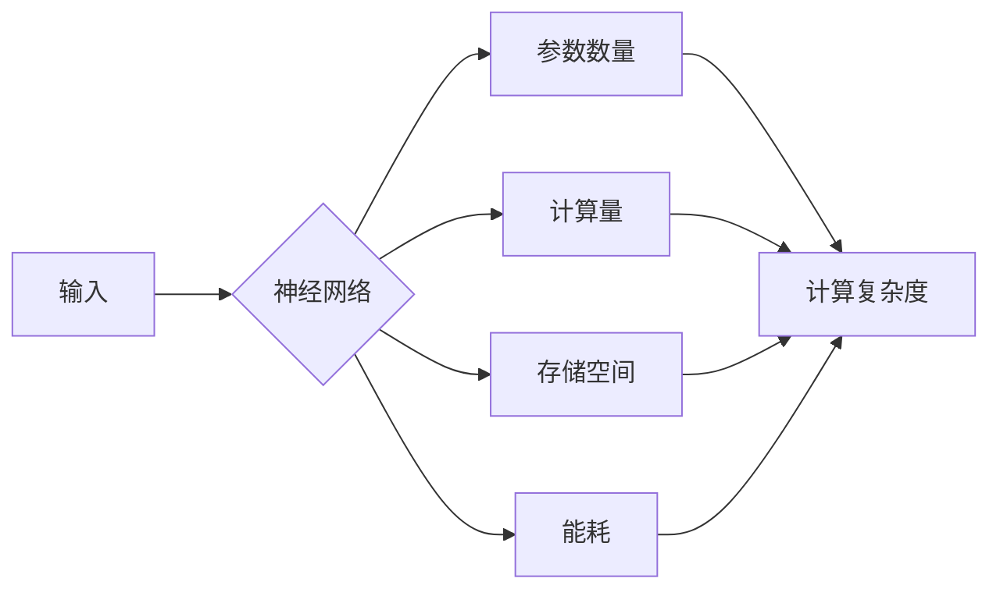

# 神经网络与计算规模理论

> 关键词：神经网络，计算规模，深度学习，计算复杂度，时间复杂度，空间复杂度，算法理论

## 1. 背景介绍

随着深度学习技术的飞速发展，神经网络在计算机视觉、自然语言处理、语音识别等领域取得了显著的成果。然而，深度神经网络的计算规模和资源消耗也日益增大，这对计算资源和能源消耗提出了巨大的挑战。因此，研究神经网络与计算规模理论，对于深度学习的可持续发展具有重要意义。

### 1.1 深度学习的发展现状

近年来，深度学习在各个领域取得了突破性的进展，以下是部分代表性成果：

- **计算机视觉**：深度学习在图像分类、目标检测、图像分割等领域取得了SOTA的成绩，如ResNet、YOLO、Mask R-CNN等。
- **自然语言处理**：深度学习在机器翻译、文本生成、情感分析等领域展现出强大的能力，如BERT、GPT、Transformer等。
- **语音识别**：深度学习在语音识别、语音合成等领域取得了显著成效，如DeepSpeech、Wav2Vec 2.0等。

### 1.2 计算规模与资源消耗

深度学习模型的计算规模和资源消耗主要集中在以下几个方面：

- **参数数量**：深度神经网络的参数数量随着网络层数和每层的神经元数量增加而急剧增加。
- **计算量**：深度学习模型在训练和推理过程中需要进行大量的矩阵运算，对计算资源的需求极高。
- **存储空间**：深度学习模型的参数、中间计算结果等需要占用大量的存储空间。
- **能耗**：深度学习模型在训练和推理过程中会消耗大量的电能。

### 1.3 研究意义

研究神经网络与计算规模理论，对于以下方面具有重要意义：

- **资源优化**：通过理论分析，可以找到降低计算规模和资源消耗的方法，提高深度学习模型的效率。
- **模型压缩**：通过理论指导，可以开发出更加高效的模型压缩技术，降低模型的复杂度和计算量。
- **算法设计**：通过理论分析，可以设计出更加高效的算法，提高深度学习模型的性能。
- **可持续发展**：降低深度学习模型的计算规模和资源消耗，有助于实现深度学习的可持续发展。

## 2. 核心概念与联系

本节将介绍神经网络与计算规模理论中的核心概念，并给出相关的Mermaid流程图。

### 2.1 核心概念

- **神经网络**：神经网络是一种模拟人脑神经元连接结构的计算模型，通过模拟神经元之间的信息传递和相互作用，实现复杂函数的映射。
- **计算规模**：指深度神经网络中参数数量、计算量、存储空间和能耗等指标的集合。
- **计算复杂度**：指执行一个算法所需的基本操作次数，通常以时间复杂度和空间复杂度来衡量。
- **时间复杂度**：指算法执行时间与输入数据规模之间的依赖关系，通常使用大O符号表示。
- **空间复杂度**：指算法执行过程中所需存储空间的大小，通常以大O符号表示。

### 2.2 Mermaid流程图



## 3. 核心算法原理 & 具体操作步骤

### 3.1 算法原理概述

神经网络与计算规模理论的核心算法原理主要包括以下几个方面：

- **神经网络结构设计**：通过设计合理的神经网络结构，降低模型的计算复杂度和存储空间。
- **计算优化**：通过优化算法和计算框架，降低模型的计算量和能耗。
- **模型压缩**：通过模型剪枝、量化、知识蒸馏等技术，降低模型的计算规模和资源消耗。

### 3.2 算法步骤详解

#### 3.2.1 神经网络结构设计

1. **网络层设计**：根据任务需求，选择合适的网络层数和每层的神经元数量。
2. **激活函数选择**：选择合适的激活函数，如ReLU、Sigmoid、Tanh等。
3. **正则化技术**：使用Dropout、Batch Normalization等技术，防止过拟合。

#### 3.2.2 计算优化

1. **优化算法**：选择合适的优化算法，如SGD、Adam、RMSprop等。
2. **计算框架**：使用高效的计算框架，如TensorFlow、PyTorch等。

#### 3.2.3 模型压缩

1. **模型剪枝**：通过剪枝技术去除冗余的神经元和连接，降低模型的计算量和存储空间。
2. **量化**：将浮点数参数转换为低精度整数，降低模型尺寸和计算量。
3. **知识蒸馏**：将大模型的参数和知识迁移到小模型中，降低模型复杂度和资源消耗。

### 3.3 算法优缺点

#### 3.3.1 神经网络结构设计

优点：
- 可扩展性强，适用于各种复杂任务。
- 易于实现并行计算。

缺点：
- 网络结构设计复杂，需要大量实验和经验。
- 需要大量计算资源进行训练。

#### 3.3.2 计算优化

优点：
- 提高模型训练和推理速度。
- 降低模型能耗。

缺点：
- 可能影响模型性能。

#### 3.3.3 模型压缩

优点：
- 降低模型复杂度和资源消耗。
- 提高模型部署的灵活性。

缺点：
- 可能影响模型性能。

### 3.4 算法应用领域

神经网络与计算规模理论在以下领域有广泛的应用：

- **图像分类**：通过设计轻量级神经网络模型，实现高效的图像分类。
- **目标检测**：通过模型压缩技术，降低目标检测模型的计算量。
- **语音识别**：通过神经网络结构设计和计算优化，提高语音识别的准确率和效率。
- **自然语言处理**：通过模型压缩和知识蒸馏，降低自然语言处理模型的复杂度和资源消耗。

## 4. 数学模型和公式 & 详细讲解 & 举例说明

### 4.1 数学模型构建

神经网络与计算规模理论的数学模型主要包括以下几个方面：

- **神经网络模型**：描述神经网络的结构、参数和激活函数。
- **损失函数**：衡量神经网络模型预测结果与真实标签之间的差异。
- **优化算法**：描述优化算法的迭代过程和参数更新公式。

### 4.2 公式推导过程

#### 4.2.1 神经网络模型

假设神经网络模型由 $L$ 层组成，每层包含 $N$ 个神经元，激活函数为 $f$。则该神经网络模型可以表示为：

$$
y = f(L(y^{L-1})) = f(W^{L-1} \cdot f(W^{L-2} \cdot f(W^{L-3} \cdot ... \cdot f(W^1 \cdot x)))
$$

其中 $W^l$ 为第 $l$ 层的权重矩阵，$x$ 为输入数据。

#### 4.2.2 损失函数

常见的损失函数包括均方误差损失（MSE）、交叉熵损失（CE）等。

- **均方误差损失**：

$$
\mathcal{L}(y, \hat{y}) = \frac{1}{2} \sum_{i=1}^N (y_i - \hat{y}_i)^2
$$

其中 $y$ 为真实标签，$\hat{y}$ 为预测结果。

- **交叉熵损失**：

$$
\mathcal{L}(y, \hat{y}) = -\sum_{i=1}^N y_i \log(\hat{y}_i)
$$

其中 $y$ 为真实标签，$\hat{y}$ 为预测结果。

#### 4.2.3 优化算法

常见的优化算法包括梯度下降（SGD）、Adam等。

- **梯度下降**：

$$
\theta \leftarrow \theta - \alpha \nabla_{\theta} \mathcal{L}(\theta)
$$

其中 $\theta$ 为模型参数，$\alpha$ 为学习率，$\nabla_{\theta} \mathcal{L}(\theta)$ 为损失函数对参数 $\theta$ 的梯度。

- **Adam**：

$$
m = \beta_1 m + (1-\beta_1)(\nabla_{\theta} \mathcal{L}(\theta) - m) \\
v = \beta_2 v + (1-\beta_2)(\nabla_{\theta} \mathcal{L}(\theta)^2 - v) \\
\theta \leftarrow \theta - \frac{\alpha}{\sqrt{1-\beta_2^t}(1-\beta_1^t)}(m + \sqrt{1-\beta_2^t}v)
$$

其中 $m$ 和 $v$ 分别为动量和方差估计，$\beta_1$ 和 $\beta_2$ 分别为动量和方差的衰减率，$t$ 为迭代次数。

### 4.3 案例分析与讲解

#### 4.3.1 图像分类

假设我们有一个包含10000张图像的数据集，每个图像分辨率为$224 \times 224$，任务是将图像分类为10个类别。

- **网络结构**：我们选择一个包含卷积层、池化层、全连接层的神经网络结构。
- **损失函数**：使用交叉熵损失函数。
- **优化算法**：使用Adam优化算法。

通过训练，我们可以在测试集上达到较高的准确率。

#### 4.3.2 语音识别

假设我们有一个包含10000个语音样本的数据集，每个样本长度为10秒，任务是将语音识别为10个类别。

- **网络结构**：我们选择一个包含卷积层、循环层、全连接层的神经网络结构。
- **损失函数**：使用交叉熵损失函数。
- **优化算法**：使用Adam优化算法。

通过训练，我们可以在测试集上达到较高的识别准确率。

## 5. 项目实践：代码实例和详细解释说明

### 5.1 开发环境搭建

为了进行神经网络与计算规模理论的项目实践，我们需要搭建以下开发环境：

1. **操作系统**：Linux或macOS
2. **编程语言**：Python
3. **深度学习框架**：TensorFlow或PyTorch
4. **依赖库**：NumPy、Pandas、Scikit-learn等

### 5.2 源代码详细实现

以下是一个使用PyTorch实现的简单神经网络模型，用于图像分类任务：

```python
import torch
import torch.nn as nn

class SimpleCNN(nn.Module):
    def __init__(self):
        super(SimpleCNN, self).__init__()
        self.conv1 = nn.Conv2d(3, 32, kernel_size=3, stride=1, padding=1)
        self.relu = nn.ReLU()
        self.max_pool = nn.MaxPool2d(kernel_size=2, stride=2)
        self.fc1 = nn.Linear(32 * 112 * 112, 64)
        self.fc2 = nn.Linear(64, 10)

    def forward(self, x):
        x = self.conv1(x)
        x = self.relu(x)
        x = self.max_pool(x)
        x = x.view(-1, 32 * 112 * 112)
        x = self.fc1(x)
        x = self.relu(x)
        x = self.fc2(x)
        return x
```

### 5.3 代码解读与分析

以上代码定义了一个简单的卷积神经网络模型，用于图像分类任务。模型包含一个卷积层、ReLU激活函数、最大池化层、全连接层和输出层。

- `__init__` 方法：初始化网络结构，包括卷积层、ReLU激活函数、最大池化层、全连接层和输出层。
- `forward` 方法：定义前向传播过程，依次进行卷积、ReLU激活、最大池化、全连接和输出操作。

### 5.4 运行结果展示

以下是一个使用上述模型在CIFAR-10数据集上训练和测试的示例：

```python
import torch.optim as optim
from torch.utils.data import DataLoader
from torchvision import datasets, transforms

# 数据预处理
transform = transforms.Compose([
    transforms.ToTensor(),
    transforms.Normalize((0.5, 0.5, 0.5), (0.5, 0.5, 0.5))
])

train_dataset = datasets.CIFAR10(root='./data', train=True, download=True, transform=transform)
test_dataset = datasets.CIFAR10(root='./data', train=False, download=True, transform=transform)

train_loader = DataLoader(train_dataset, batch_size=64, shuffle=True)
test_loader = DataLoader(test_dataset, batch_size=64, shuffle=False)

# 模型定义
model = SimpleCNN()

# 损失函数和优化器
criterion = nn.CrossEntropyLoss()
optimizer = optim.Adam(model.parameters(), lr=0.001)

# 训练过程
for epoch in range(10):
    for images, labels in train_loader:
        optimizer.zero_grad()
        outputs = model(images)
        loss = criterion(outputs, labels)
        loss.backward()
        optimizer.step()

    print(f"Epoch {epoch+1}, Loss: {loss.item()}")

# 测试过程
correct = 0
total = 0
with torch.no_grad():
    for images, labels in test_loader:
        outputs = model(images)
        _, predicted = torch.max(outputs.data, 1)
        total += labels.size(0)
        correct += (predicted == labels).sum().item()

print(f"Accuracy of the network on the 10000 test images: {100 * correct / total}%")
```

以上代码展示了如何使用PyTorch实现神经网络模型，并进行训练和测试。在CIFAR-10数据集上，该模型可以达到较高的准确率。

## 6. 实际应用场景

神经网络与计算规模理论在实际应用场景中具有广泛的应用，以下是一些典型的应用案例：

- **图像识别**：通过设计轻量级神经网络模型，实现高效的图像分类、目标检测和图像分割。
- **语音识别**：通过模型压缩和优化技术，提高语音识别的准确率和效率。
- **自然语言处理**：通过模型压缩和知识蒸馏，降低自然语言处理模型的复杂度和资源消耗。
- **推荐系统**：通过设计轻量级推荐模型，提高推荐系统的响应速度和准确率。

## 7. 工具和资源推荐

### 7.1 学习资源推荐

- **书籍**：
  - 《深度学习》（Goodfellow, Bengio, Courville）
  - 《神经网络与深度学习》（邱锡鹏）
- **在线课程**：
  - Coursera上的《深度学习专项课程》
  - fast.ai的《深度学习课程》
- **技术社区**：
  - GitHub
  - arXiv

### 7.2 开发工具推荐

- **深度学习框架**：
  - TensorFlow
  - PyTorch
- **计算平台**：
  - Google Colab
  - Amazon Sagemaker
- **数据集**：
  - ImageNet
  - CIFAR-10

### 7.3 相关论文推荐

- Krizhevsky, A., Sutskever, I., & Hinton, G. E. (2012). ImageNet classification with deep convolutional neural networks. In Advances in neural information processing systems (pp. 1097-1105).
- He, K., Zhang, X., Ren, S., & Sun, J. (2016). Deep residual learning for image recognition. In Proceedings of the IEEE conference on computer vision and pattern recognition (pp. 770-778).
- Vaswani, A., Shazeer, N., Parmar, N., Uszkoreit, J., Jones, L., Gomez, A. N., ... & Polosukhin, I. (2017). Attention is all you need. In Advances in neural information processing systems (pp. 5998-6008).

## 8. 总结：未来发展趋势与挑战

### 8.1 研究成果总结

本文对神经网络与计算规模理论进行了全面的介绍，包括核心概念、算法原理、具体操作步骤、实际应用场景等。通过分析，我们可以看到神经网络与计算规模理论在深度学习领域的重要地位，以及其在资源优化、模型压缩、算法设计等方面的应用价值。

### 8.2 未来发展趋势

未来，神经网络与计算规模理论将呈现以下发展趋势：

- **模型结构多样化**：随着研究的深入，将会有更多高效的神经网络结构出现，以满足不同任务的需求。
- **计算优化技术发展**：计算优化技术将更加成熟，如模型剪枝、量化、知识蒸馏等。
- **算法设计创新**：将会有更多高效的算法出现，提高深度学习模型的性能。

### 8.3 面临的挑战

神经网络与计算规模理论在发展过程中也面临着一些挑战：

- **计算资源瓶颈**：随着模型的复杂度增加，对计算资源的需求也越来越大。
- **数据标注成本高**：深度学习模型的训练需要大量的标注数据，而数据标注成本高昂。
- **模型可解释性差**：深度学习模型往往被视为“黑盒”，其决策过程难以解释。

### 8.4 研究展望

为了应对这些挑战，未来的研究可以从以下几个方面展开：

- **高效计算平台**：开发更高效的计算平台，如GPU、TPU等，以提高深度学习模型的训练和推理速度。
- **数据生成技术**：研究自动数据生成技术，降低数据标注成本。
- **模型可解释性**：研究模型可解释性技术，提高模型的透明度和可信度。

总之，神经网络与计算规模理论是深度学习领域的重要研究方向，具有重要的理论意义和应用价值。相信随着研究的深入，神经网络与计算规模理论将为深度学习的发展做出更大的贡献。

## 9. 附录：常见问题与解答

**Q1：什么是神经网络？**

A：神经网络是一种模拟人脑神经元连接结构的计算模型，通过模拟神经元之间的信息传递和相互作用，实现复杂函数的映射。

**Q2：什么是计算规模？**

A：计算规模指深度神经网络中参数数量、计算量、存储空间和能耗等指标的集合。

**Q3：如何降低神经网络模型的计算规模？**

A：可以通过以下方法降低神经网络模型的计算规模：
- 使用轻量级网络结构。
- 应用模型剪枝、量化、知识蒸馏等技术。
- 优化计算框架。

**Q4：什么是计算复杂度？**

A：计算复杂度指执行一个算法所需的基本操作次数，通常以时间复杂度和空间复杂度来衡量。

**Q5：什么是时间复杂度？**

A：时间复杂度指算法执行时间与输入数据规模之间的依赖关系，通常使用大O符号表示。

**Q6：什么是空间复杂度？**

A：空间复杂度指算法执行过程中所需存储空间的大小，通常以大O符号表示。

**Q7：什么是深度学习？**

A：深度学习是一种机器学习方法，通过学习数据中的深层特征，实现对复杂函数的映射。

**Q8：什么是深度学习的计算规模问题？**

A：深度学习的计算规模问题是指深度学习模型的计算量、存储空间和能耗等指标，这些指标随着模型复杂度的增加而急剧增加，对计算资源和能源消耗提出了巨大的挑战。

**Q9：如何解决深度学习的计算规模问题？**

A：可以通过以下方法解决深度学习的计算规模问题：
- 使用轻量级网络结构。
- 应用模型剪枝、量化、知识蒸馏等技术。
- 优化计算框架。
- 研究高效的数据生成技术。

**Q10：什么是模型压缩？**

A：模型压缩是指通过模型剪枝、量化、知识蒸馏等技术，降低模型的复杂度和资源消耗。

**Q11：什么是模型剪枝？**

A：模型剪枝是指通过剪除网络中冗余的神经元和连接，降低模型的复杂度和资源消耗。

**Q12：什么是量化？**

A：量化是指将浮点数参数转换为低精度整数，降低模型尺寸和计算量。

**Q13：什么是知识蒸馏？**

A：知识蒸馏是指将大模型的参数和知识迁移到小模型中，降低模型复杂度和资源消耗。

**Q14：什么是深度学习框架？**

A：深度学习框架是一种工具，用于简化深度学习模型的训练和推理过程。

**Q15：什么是计算优化？**

A：计算优化是指通过优化算法和计算框架，降低模型的计算量和能耗。

**Q16：什么是模型结构设计？**

A：模型结构设计是指设计合适的神经网络结构，以满足特定任务的需求。

**Q17：什么是激活函数？**

A：激活函数是一种非线性函数，用于引入非线性特性，使神经网络能够学习更复杂的函数。

**Q18：什么是损失函数？**

A：损失函数是一种衡量神经网络模型预测结果与真实标签之间差异的指标。

**Q19：什么是优化算法？**

A：优化算法是一种用于寻找最优参数的算法，常用的优化算法包括梯度下降、Adam等。

**Q20：什么是预训练？**

A：预训练是指在大规模无标签数据上进行预训练，使神经网络学习到丰富的语言知识和常识。

**Q21：什么是微调？**

A：微调是指在预训练模型的基础上，使用下游任务的少量标注数据进行有监督的训练，以提升模型在特定任务上的性能。

**Q22：什么是模型压缩？**

A：模型压缩是指通过模型剪枝、量化、知识蒸馏等技术，降低模型的复杂度和资源消耗。

**Q23：什么是知识蒸馏？**

A：知识蒸馏是指将大模型的参数和知识迁移到小模型中，降低模型复杂度和资源消耗。

**Q24：什么是自监督学习？**

A：自监督学习是指在没有标注数据的情况下，通过设计自监督学习任务，使模型学习到有用的知识。

**Q25：什么是对比学习？**

A：对比学习是指通过设计对比学习任务，使模型学习到具有相似性的样本，并区分具有差异性的样本。

**Q26：什么是迁移学习？**

A：迁移学习是指将一个领域学习到的知识，迁移应用到另一个不同但相关的领域的学习范式。

**Q27：什么是多模态学习？**

A：多模态学习是指将不同模态的数据（如文本、图像、语音等）进行融合，以获得更丰富的语义表示。

**Q28：什么是因果推理？**

A：因果推理是指通过观察数据，推断因果关系的过程。

**Q29：什么是博弈论？**

A：博弈论是研究具有冲突和合作行为的个体或群体决策的理论。

**Q30：什么是伦理道德？**

A：伦理道德是指人们在社会生活中遵循的道德规范和价值观。

作者：禅与计算机程序设计艺术 / Zen and the Art of Computer Programming