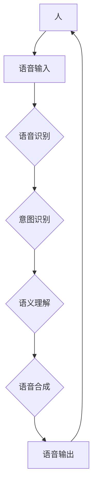

# 自动驾驶中的自然语言交互与语音控制

> 关键词：自动驾驶，自然语言交互，语音识别，语音合成，语义理解，人机交互，人工智能

## 1. 背景介绍

随着人工智能技术的飞速发展，自动驾驶技术逐渐从实验室走向现实。自动驾驶汽车不仅需要具备感知环境、规划路径、控制车辆等能力，还需要具备与人类驾驶员和乘客进行自然语言交互的能力。这种交互不仅提升了驾驶体验，也为自动驾驶汽车赋予了更加人性化的特征。本文将探讨自动驾驶中的自然语言交互与语音控制技术，分析其核心概念、算法原理、应用场景以及未来发展趋势。

### 1.1 问题的由来

传统的自动驾驶系统主要依赖于视觉、雷达等传感器获取环境信息，并通过复杂的算法进行数据处理和决策。这种“冷冰冰”的系统缺乏与人类用户沟通的能力，难以满足人们对于便捷、智能、人性化的出行需求。而自然语言交互与语音控制技术，正是为了解决这一问题而诞生的。

### 1.2 研究现状

近年来，自然语言交互与语音控制技术取得了显著的进展。在自动驾驶领域，这一技术已经应用于语音导航、语音助手、智能座舱等方面。以下是一些主要的研究成果：

- 语音识别技术：通过将语音信号转换为文本信息，实现人机之间的语音沟通。
- 语音合成技术：将文本信息转换为自然流畅的语音，实现人机之间的语音交互。
- 语义理解技术：理解用户语音的意图和语义，实现对用户指令的准确解析。
- 人机交互界面设计：设计符合人类认知习惯的交互界面，提升交互体验。

### 1.3 研究意义

自然语言交互与语音控制技术在自动驾驶领域的应用具有重要意义：

- 提升驾驶体验：通过自然语言交互，自动驾驶汽车可以更好地满足用户的需求，提升驾驶体验。
- 保障行车安全：在紧急情况下，语音控制可以快速、准确地传达指令，降低交通事故的发生率。
- 优化用户体验：自然语言交互可以提升用户体验，使自动驾驶汽车更加人性化。
- 推动自动驾驶技术发展：自然语言交互与语音控制技术的应用，可以促进自动驾驶技术的进一步发展。

## 2. 核心概念与联系

### 2.1 核心概念原理和架构的 Mermaid 流程图



### 2.2 核心概念

- **语音输入**：用户通过说话的方式输入指令。
- **语音识别**：将语音信号转换为文本信息。
- **意图识别**：理解用户的意图，确定用户想要执行的操作。
- **语义理解**：对用户的意图进行进一步解析，确定具体的操作内容。
- **语音合成**：将文本信息转换为自然流畅的语音。
- **语音输出**：将语音信息输出给用户。

## 3. 核心算法原理 & 具体操作步骤

### 3.1 算法原理概述

自然语言交互与语音控制技术主要涉及以下几个核心算法：

- **语音识别**：基于深度学习技术，通过神经网络模型对语音信号进行处理，将其转换为文本信息。
- **意图识别**：基于机器学习技术，通过分类模型对用户意图进行识别。
- **语义理解**：基于自然语言处理技术，通过语义解析模型对用户意图进行进一步解析。
- **语音合成**：基于深度学习技术，通过神经网络模型将文本信息转换为自然流畅的语音。

### 3.2 算法步骤详解

1. **语音输入**：用户通过说话的方式输入指令。
2. **语音识别**：将语音信号转换为文本信息，如“请打开导航”。
3. **意图识别**：识别用户意图，如确定用户想要执行的操作是打开导航。
4. **语义理解**：对用户意图进行进一步解析，如确定用户需要打开的是地图导航还是语音导航。
5. **语音合成**：将文本信息转换为自然流畅的语音，如“已为您打开语音导航”。
6. **语音输出**：将语音信息输出给用户。

### 3.3 算法优缺点

#### 3.3.1 语音识别

- **优点**：准确率高，识别速度快，易于实现。
- **缺点**：受环境噪声影响较大，对非标准语音识别能力较差。

#### 3.3.2 意图识别

- **优点**：能够理解用户意图，实现更加智能的交互。
- **缺点**：需要大量的标注数据，模型复杂度高。

#### 3.3.3 语义理解

- **优点**：能够理解用户意图的深层含义，实现更加精准的交互。
- **缺点**：对自然语言理解能力要求较高，技术难度较大。

#### 3.3.4 语音合成

- **优点**：发音自然，易于理解。
- **缺点**：生成语音的流畅度受模型影响较大。

### 3.4 算法应用领域

自然语言交互与语音控制技术可以应用于以下领域：

- **自动驾驶**：语音导航、语音助手、智能座舱等。
- **智能家居**：语音控制家电、语音播放音乐等。
- **智能客服**：语音客服、语音机器人等。
- **教育领域**：语音助教、语音学习等。

## 4. 数学模型和公式 & 详细讲解 & 举例说明

### 4.1 数学模型构建

自然语言交互与语音控制技术涉及多个数学模型，以下以语音识别为例进行说明。

#### 4.1.1 语音识别模型

语音识别模型通常采用深度神经网络，如卷积神经网络(CNN)或循环神经网络(RNN)。以下为一个简单的RNN模型：

$$
y = f(W_{in}x + b_{in} + W_hh\cdot h_{t-1} + W_xh\cdot x_t + b_h)
$$

其中：

- $y$ 表示输出层节点
- $W_{in}$ 为输入层权重
- $b_{in}$ 为输入层偏置
- $W_hh$ 为隐藏层权重
- $h_{t-1}$ 为上一个时间步的隐藏状态
- $x_t$ 为当前时间步的输入
- $b_h$ 为隐藏层偏置

### 4.2 公式推导过程

语音识别模型的训练过程主要包括以下步骤：

1. **损失函数**：计算预测输出与真实标签之间的差异，如交叉熵损失函数。

$$
L = -\sum_{i=1}^N [y_i\log \hat{y}_i]
$$

其中：

- $y_i$ 为真实标签
- $\hat{y}_i$ 为预测输出

2. **梯度下降**：根据损失函数对模型参数进行更新。

$$
\theta = \theta - \alpha \nabla_{\theta}L
$$

其中：

- $\theta$ 为模型参数
- $\alpha$ 为学习率

3. **反向传播**：计算损失函数对模型参数的梯度。

### 4.3 案例分析与讲解

以一个简单的语音识别任务为例，我们将使用TensorFlow实现一个基于RNN的语音识别模型。

```python
import tensorflow as tf

# 构建RNN模型
def build_model():
    # 输入层
    inputs = tf.keras.layers.Input(shape=(None, 13))
    
    # 隐藏层
    hidden = tf.keras.layers.LSTM(128)(inputs)
    
    # 输出层
    outputs = tf.keras.layers.Dense(1, activation='sigmoid')(hidden)
    
    # 构建模型
    model = tf.keras.Model(inputs, outputs)
    
    return model

# 训练模型
model = build_model()
model.compile(optimizer='adam', loss='binary_crossentropy', metrics=['accuracy'])
model.fit(x_train, y_train, epochs=10, batch_size=32)

# 预测
predictions = model.predict(x_test)
```

以上代码实现了一个简单的语音识别模型。在实际应用中，我们需要根据具体任务的特点，选择合适的模型结构和参数，以达到最佳的识别效果。

## 5. 项目实践：代码实例和详细解释说明

### 5.1 开发环境搭建

在进行自然语言交互与语音控制项目的开发之前，我们需要搭建相应的开发环境。以下是使用Python进行项目开发的环境配置流程：

1. 安装Anaconda：从官网下载并安装Anaconda，用于创建独立的Python环境。
2. 创建并激活虚拟环境：
```bash
conda create -n nlp-env python=3.8
conda activate nlp-env
```
3. 安装必要的Python库：
```bash
pip install tensorflow numpy pandas scikit-learn jupyter notebook
```

### 5.2 源代码详细实现

以下是一个简单的自动驾驶语音控制系统的代码实现：

```python
import speech_recognition as sr
from google.cloud import texttospeech

# 初始化语音识别器
recognizer = sr.Recognizer()
microphone = sr.Microphone()

# 初始化语音合成器
client = texttospeech.TextToSpeechClient()

# 语音识别
def recognize_speech():
    with microphone as source:
        print("请说：")
        audio = recognizer.listen(source)
    try:
        text = recognizer.recognize_google(audio, language='zh-CN')
        print("识别结果：" + text)
        return text
    except sr.UnknownValueError:
        print("无法识别语音")
        return None

# 语音合成
def synthesize_speech(text):
    synthesis_input = texttospeech.SynthesisInput(text=text)
    audio_config = texttospeech.AudioConfig(
        speaking_rate=0.9,
        voice=ttexttospeech.VoiceSelectionParams(
            language_code='zh-CN',
            name='zh-CN-XiaoyiNeural'
        ),
    )
    audio = client.synthesize_speech(audio_config=synthesis_input)
    with open('output.wav', 'wb') as out:
        out.write(audio.audio_content)

# 语音控制
def voice_control():
    while True:
        text = recognize_speech()
        if text is not None:
            if '打开' in text:
                synthesize_speech("正在为您打开...")
                # 执行打开操作
            elif '关闭' in text:
                synthesize_speech("正在为您关闭...")
                # 执行关闭操作
            elif '退出' in text:
                break
            else:
                synthesize_speech("未识别到指令，请重新说...")
```

以上代码实现了一个简单的自动驾驶语音控制系统。用户可以通过说话的方式控制车辆，如打开空调、关闭车窗等。在实际应用中，我们需要根据具体需求，扩展语音控制指令和功能。

### 5.3 代码解读与分析

上述代码主要分为以下几个部分：

- **语音识别**：使用`speech_recognition`库实现语音识别功能，将用户的语音转换为文本信息。
- **语音合成**：使用`google-cloud-texttospeech`库实现语音合成功能，将文本信息转换为语音输出。
- **语音控制**：根据用户输入的指令，执行相应的操作。

以上代码展示了自然语言交互与语音控制技术在自动驾驶领域的应用。在实际项目中，我们需要根据具体需求，设计更加复杂的控制逻辑和功能。

### 5.4 运行结果展示

运行上述代码后，程序会进入语音控制模式。用户可以通过说话的方式控制车辆，如打开空调、关闭车窗等。

```
请说：
打开空调
正在为您打开...
请说：
退出
```

## 6. 实际应用场景

自然语言交互与语音控制技术在自动驾驶领域的应用场景主要包括：

- **语音导航**：用户可以通过语音指令查询路线、路况等信息。
- **语音助手**：提供个性化服务，如查询天气、新闻、股票等。
- **智能座舱**：提供舒适、便捷的乘坐体验，如调节空调、播放音乐等。
- **应急处理**：在紧急情况下，通过语音指令进行车辆控制，如紧急制动、紧急转向等。

## 7. 工具和资源推荐

### 7.1 学习资源推荐

- **《深度学习》**：Goodfellow、Bengio和Courville合著的深度学习经典教材，介绍了深度学习的基本原理和应用。
- **《深度学习自然语言处理》**：Speech、Huang和Chen合著的NLP经典教材，介绍了NLP的基本概念和经典模型。
- **《语音识别：原理与算法》**：Li和Deng合著的语音识别经典教材，介绍了语音识别的基本原理和算法。

### 7.2 开发工具推荐

- **TensorFlow**：由Google开发的深度学习框架，适用于自然语言处理、语音识别等领域。
- **Keras**：基于TensorFlow的开源深度学习库，易于使用。
- **PyTorch**：由Facebook开发的深度学习框架，以灵活性和易用性著称。
- **SpeechRecognition**：Python语音识别库，支持多种语音识别引擎。
- **pyttsx3**：Python语音合成库，支持多种语音合成引擎。

### 7.3 相关论文推荐

- **“DeepSpeech 2: End-to-End Speech Recognition in English and Mandarin”**：介绍了DeepSpeech 2语音识别模型。
- **“BERT: Pre-training of Deep Bidirectional Transformers for Language Understanding”**：介绍了BERT语言模型。
- **“Attention is All You Need”**：介绍了Transformer结构。

## 8. 总结：未来发展趋势与挑战

### 8.1 研究成果总结

自然语言交互与语音控制技术在自动驾驶领域的应用取得了显著的进展，为自动驾驶汽车赋予了更加人性化的特征。未来，随着人工智能技术的不断发展，这一技术将得到进一步的应用和推广。

### 8.2 未来发展趋势

- **多模态融合**：将语音、图像、语义等多种模态信息进行融合，实现更加精准的识别和理解。
- **个性化交互**：根据用户的需求和习惯，提供个性化的交互体验。
- **跨语言支持**：支持多种语言的语音识别和语音合成。
- **实时性优化**：提高语音识别和语音合成的实时性，满足实时交互需求。

### 8.3 面临的挑战

- **数据标注**：需要大量的标注数据来训练模型，成本较高。
- **模型复杂度**：深度学习模型复杂度高，对计算资源要求较高。
- **语音识别准确率**：在嘈杂环境中，语音识别准确率较低。
- **语义理解能力**：对自然语言理解能力要求较高，技术难度较大。

### 8.4 研究展望

自然语言交互与语音控制技术在自动驾驶领域的应用前景广阔。未来，随着技术的不断发展和完善，这一技术将为人类带来更加便捷、安全、舒适的出行体验。

## 9. 附录：常见问题与解答

**Q1：自然语言交互与语音控制技术在自动驾驶领域的应用前景如何？**

A：自然语言交互与语音控制技术在自动驾驶领域的应用前景非常广阔。随着技术的不断发展和完善，这一技术将为人类带来更加便捷、安全、舒适的出行体验。

**Q2：如何提高语音识别的准确率？**

A：提高语音识别的准确率需要从以下几个方面入手：

- 使用高质量的语音识别引擎。
- 收集和标注更多高质量的语音数据。
- 选择合适的模型结构和参数。
- 对模型进行持续优化和调参。

**Q3：如何提高语音合成的流畅度？**

A：提高语音合成的流畅度需要从以下几个方面入手：

- 使用高质量的语音合成引擎。
- 选择合适的语音合成模型。
- 对语音合成模型进行优化和调参。

**Q4：如何实现个性化交互？**

A：实现个性化交互需要从以下几个方面入手：

- 收集和分析用户行为数据。
- 根据用户行为数据，为用户提供个性化的服务。
- 不断优化和改进个性化服务。

**Q5：如何解决数据标注成本高的问题？**

A：解决数据标注成本高的问题需要从以下几个方面入手：

- 利用自动标注技术，如半监督学习、对抗训练等。
- 将标注任务分解成更小的子任务，进行分布式标注。
- 与标注平台合作，共享标注资源。

作者：禅与计算机程序设计艺术 / Zen and the Art of Computer Programming