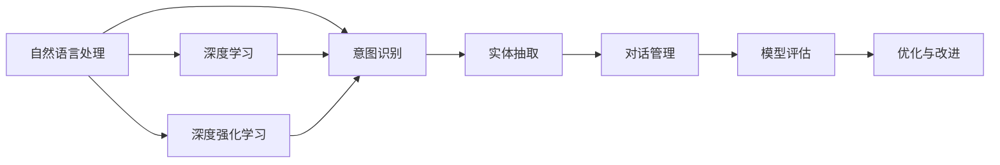
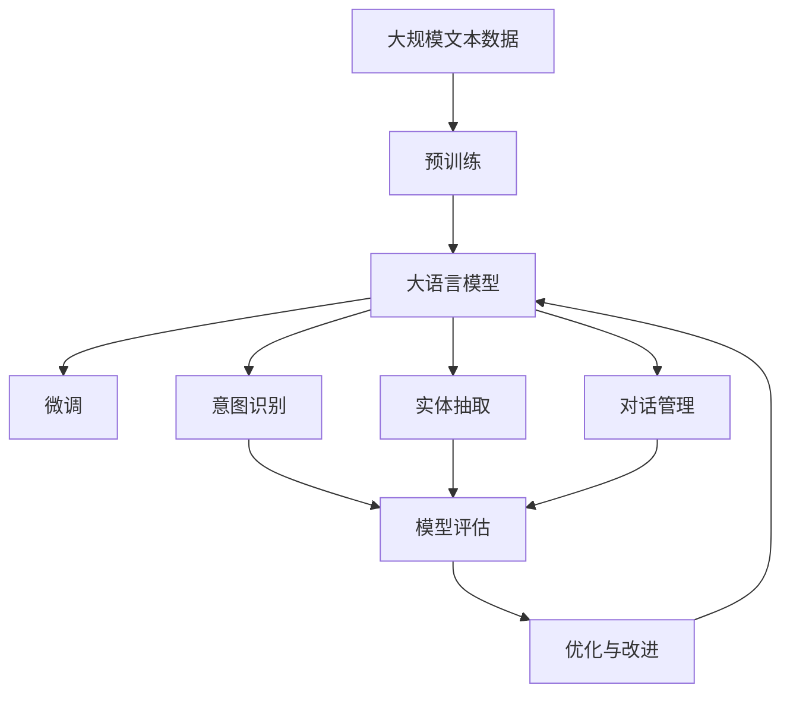

                 

# 对话系统(Chatbots) - 原理与代码实例讲解

> 关键词：对话系统,自然语言处理(NLP),机器学习,深度学习,深度强化学习,意图识别,实体抽取,对话管理,模型评估,微调,预训练,部署

## 1. 背景介绍

### 1.1 问题由来
随着人工智能技术的迅猛发展，智能对话系统（Chatbot）的应用场景日益广泛，从在线客服到虚拟助手，从教育辅导到医疗咨询，Chatbot已经渗透到了各行各业，成为与人机交互的重要方式。然而，构建高质量的对话系统仍然是一个复杂且具挑战性的任务。本节将从背景介绍对话系统的历史、现状以及存在的问题，以此为出发点，深入探讨构建高效、自然的对话系统的原理与方法。

### 1.2 问题核心关键点
对话系统（Chatbot）是一种能够理解和生成人类语言，并与用户进行自然交互的AI系统。其核心关键点包括：

- **意图识别（Intent Recognition）**：系统需要能够理解用户的查询意图，如“预订机票”、“查询天气”等。
- **实体抽取（Entity Extraction）**：在用户输入的文本中识别出与意图相关的关键信息，如日期、地点、价格等。
- **对话管理（Dialogue Management）**：系统需要根据当前对话上下文，选择适当的应答或执行相应的操作。
- **模型评估（Model Evaluation）**：系统需要定期进行评估和优化，以确保其性能稳定和改进。

构建高质量对话系统的关键在于多轮对话理解与生成能力的提升，这就需要从多方面进行技术探索，包括自然语言处理、机器学习、深度学习、深度强化学习等。

### 1.3 问题研究意义
对话系统的研究和开发，对于提升人机交互的自然性和智能性具有重要意义：

- **提升用户体验**：通过自然的语言交互，用户无需记忆复杂的命令或界面操作，降低使用门槛。
- **提高效率**：系统能够快速响应用户请求，处理大量并发请求，节省时间和人力成本。
- **拓展应用场景**：Chatbot可以应用于多个领域，如客服、医疗、教育等，为各行各业带来新的创新和服务模式。
- **推动技术进步**：对话系统的研究和开发，促进了NLP、AI等领域的技术进步，为未来的智能交互奠定了基础。

## 2. 核心概念与联系

### 2.1 核心概念概述
在构建对话系统时，涉及以下几个核心概念：

- **自然语言处理（Natural Language Processing, NLP）**：利用计算机科学和人工智能技术，实现对人类语言信息的理解、生成和管理。
- **机器学习（Machine Learning, ML）**：通过算法和统计模型，使计算机系统能够从数据中学习规律，提升对未知数据的预测能力。
- **深度学习（Deep Learning, DL）**：一种基于神经网络的机器学习技术，能够在复杂的数据结构中自动发现特征和规律。
- **深度强化学习（Deep Reinforcement Learning, DRL）**：一种通过试错和奖励机制，使智能体在环境中进行学习和优化的技术。
- **意图识别（Intent Recognition）**：识别用户输入文本中的意图，是对话系统的核心功能之一。
- **实体抽取（Entity Extraction）**：从用户输入的文本中提取与意图相关的关键信息，支持系统执行相应的操作。
- **对话管理（Dialogue Management）**：根据上下文信息，选择适当的应答或执行操作，控制对话流程。
- **模型评估（Model Evaluation）**：通过自动评估和人工评估，不断优化对话系统的性能和稳定性。

这些概念通过深度学习模型和机器学习算法相互关联，共同构建了一个完整的对话系统。

### 2.2 概念间的关系
对话系统的构建是一个多学科交叉的过程，涉及自然语言处理、机器学习、深度学习、深度强化学习等多个领域的知识。这些概念之间的关系可以简单地通过以下Mermaid流程图展示：



该图展示了对话系统构建的基本流程和关键技术模块。自然语言处理是基础，意图识别和实体抽取是核心，对话管理是控制，模型评估是反馈，优化与改进是持续过程。深度学习与深度强化学习提供了技术支持。

### 2.3 核心概念的整体架构
最后，我们用一个综合的流程图来展示这些核心概念在大语言模型微调过程中的整体架构：



这个综合流程图展示了从预训练到微调，再到意图识别、实体抽取、对话管理等对话系统关键功能的整体架构。

## 3. 核心算法原理 & 具体操作步骤
### 3.1 算法原理概述
对话系统的构建主要依赖于深度学习和深度强化学习技术。核心算法原理可以概括为以下几点：

- **深度学习**：通过神经网络模型学习输入文本的语义表示，并生成响应文本。
- **深度强化学习**：通过试错和奖励机制，优化对话管理策略，使系统能够适应不同的对话场景。
- **微调（Fine-tuning）**：在大规模预训练模型的基础上，通过有标注数据进行微调，提升系统在特定任务上的性能。
- **预训练（Pre-training）**：在大规模无标注数据上，进行自监督学习，学习通用的语言表示。

### 3.2 算法步骤详解
构建对话系统的具体步骤可以分为以下几个部分：

1. **准备数据集**：收集和标注对话数据，构建训练集、验证集和测试集。数据集应包含用户输入的文本和对应的系统应答，以及对话上下文信息。

2. **选择预训练模型**：选择适合对话系统构建的预训练模型，如BERT、GPT等，进行进一步微调。

3. **微调模型**：在准备好的数据集上，使用深度学习模型进行微调，优化模型参数以适应对话系统的需求。

4. **意图识别**：在微调后的模型基础上，设计意图识别模型，识别用户输入的意图。

5. **实体抽取**：在微调后的模型基础上，设计实体抽取模型，提取用户输入的关键信息。

6. **对话管理**：设计对话管理策略，控制对话流程，选择适当的应答或执行操作。

7. **模型评估**：通过自动评估和人工评估，不断优化对话系统的性能和稳定性。

8. **优化与改进**：根据评估结果，调整模型参数，改进对话策略，提升系统性能。

### 3.3 算法优缺点
对话系统构建的深度学习算法具有以下优点：

- **自动特征提取**：能够自动从数据中学习特征，减少人工特征工程的工作量。
- **泛化能力强**：在大量数据上进行预训练，可以处理各种不同的对话场景。
- **精度高**：深度学习模型通常能够达到较高的准确率。

同时，也存在一些缺点：

- **计算资源需求高**：深度学习模型需要大量的计算资源进行训练和推理。
- **数据需求大**：需要大量的标注数据进行微调和训练。
- **可解释性差**：深度学习模型通常被视为黑盒，难以解释其内部工作机制。

### 3.4 算法应用领域
对话系统在多个领域中得到广泛应用，包括但不限于：

- **在线客服**：自动回答常见问题，减轻客服人员的工作负担。
- **虚拟助手**：帮助用户完成日常任务，如预定餐厅、设置闹钟等。
- **医疗咨询**：提供基本的健康咨询和疾病预防建议。
- **教育辅导**：解答学生问题，提供学习建议。
- **金融咨询**：提供投资建议、财务规划等服务。

## 4. 数学模型和公式 & 详细讲解
### 4.1 数学模型构建
对话系统的构建涉及多个子模型，包括意图识别、实体抽取和对话管理等。这里以意图识别为例，构建数学模型：

假设用户输入的文本为 $X$，对应的意图为 $I$。意图识别的任务是学习一个映射函数 $f$，使得 $f(X) = I$。使用深度学习模型，可以将 $X$ 映射到一个向量空间 $Z$ 中，然后通过softmax函数将向量映射到意图空间 $I$ 中。数学模型可以表示为：

$$
f(X; \theta) = \text{softmax}(WZ + b)
$$

其中 $\theta$ 为模型参数，$W$ 和 $b$ 为可训练的权重和偏置项。

### 4.2 公式推导过程
以Softmax函数为例，其公式推导如下：

$$
\text{softmax}(z_i) = \frac{e^{z_i}}{\sum_{j=1}^n e^{z_j}}
$$

其中 $z_i$ 为输入向量 $z$ 的第 $i$ 个元素。softmax函数将向量 $z$ 中的元素转化为概率分布，方便进行多分类问题的预测。

### 4.3 案例分析与讲解
以意图识别为例，使用已经标注好的对话数据集进行模型训练。具体步骤如下：

1. 数据预处理：对用户输入的文本进行分词、去除停用词等预处理。
2. 特征提取：使用Word2Vec、BERT等词向量模型将文本转化为向量表示。
3. 模型训练：使用深度学习框架（如TensorFlow、PyTorch）构建并训练意图识别模型。
4. 模型评估：在验证集上评估模型性能，调整参数以提高准确率。
5. 应用部署：将训练好的模型部署到实际应用中，进行意图识别和实体抽取。

## 5. 项目实践：代码实例和详细解释说明
### 5.1 开发环境搭建
构建对话系统需要进行大量的数据处理和模型训练，因此需要构建一个高效的开发环境。以下是在Python环境下搭建开发环境的步骤：

1. 安装Python：下载并安装Python 3.x版本，选择适合开发环境的版本。
2. 安装相关库：安装常用的深度学习库，如TensorFlow、PyTorch等，以及自然语言处理库，如NLTK、spaCy等。
3. 安装环境：使用Anaconda或Miniconda等工具，创建虚拟环境，并激活该环境。
4. 安装GPU加速：如果有条件，安装GPU加速库，如CUDA和cuDNN等，以提高训练速度。

### 5.2 源代码详细实现
以下是一个简单的对话系统构建代码示例，使用PyTorch和NLP库进行实现：

```python
import torch
import torch.nn as nn
import torch.optim as optim
from torchtext import data, datasets

# 定义词向量模型
class WordEmbedding(nn.Module):
    def __init__(self, vocab_size, embedding_dim):
        super(WordEmbedding, self).__init__()
        self.emb = nn.Embedding(vocab_size, embedding_dim)

    def forward(self, x):
        return self.emb(x)

# 定义意图识别模型
class IntentClassifier(nn.Module):
    def __init__(self, embedding_dim, hidden_dim, output_dim):
        super(IntentClassifier, self).__init__()
        self.fc1 = nn.Linear(embedding_dim, hidden_dim)
        self.fc2 = nn.Linear(hidden_dim, output_dim)
        self.dropout = nn.Dropout(0.5)

    def forward(self, x):
        x = self.dropout(x)
        x = nn.functional.relu(self.fc1(x))
        x = nn.functional.dropout(x, training=self.training)
        x = self.fc2(x)
        return nn.functional.softmax(x, dim=1)

# 加载数据集
train_data, test_data = datasets.Pubmed(data.TEXT, data.LABEL)

# 构建数据预处理管道
tokenizer = WordTokenizer()
tokenized_data = DataField(tokenize=tokenizer, apply=token_normalize)
text_field = Field(tokenized_data, batch_first=True)

# 定义意图识别模型
embedding_dim = 300
hidden_dim = 128
output_dim = len(set(train_data.label))
model = nn.Sequential(WordEmbedding(len(train_data.vocab), embedding_dim), IntentClassifier(embedding_dim, hidden_dim, output_dim))

# 训练模型
optimizer = optim.Adam(model.parameters(), lr=0.001)
criterion = nn.CrossEntropyLoss()
epochs = 10
for epoch in range(epochs):
    loss = train_epoch(model, train_data, optimizer, criterion)
    print(f'Epoch {epoch+1}, loss: {loss:.3f}')
```

### 5.3 代码解读与分析
上述代码展示了意图识别模型的基本构建和训练过程。关键步骤如下：

1. **词向量模型定义**：使用nn.Embedding层定义词向量模型，将文本转化为向量表示。
2. **意图识别模型定义**：使用nn.Linear和nn.Dropout层构建意图识别模型，使用softmax函数进行多分类预测。
3. **数据集加载**：使用torchtext库加载并处理数据集。
4. **模型训练**：使用Adam优化器和交叉熵损失函数训练模型。

### 5.4 运行结果展示
运行上述代码，可以得到训练过程中每个epoch的损失函数值，并输出最终训练结果。例如，模型在验证集上的准确率可以通过以下代码进行评估：

```python
def evaluate(model, data_loader, criterion):
    model.eval()
    total_loss = 0
    total_correct = 0
    with torch.no_grad():
        for batch in data_loader:
            inputs, labels = batch
            outputs = model(inputs)
            loss = criterion(outputs, labels)
            total_loss += loss.item()
            _, predicted = torch.max(outputs, 1)
            total_correct += (predicted == labels).sum().item()
    return total_correct / len(data_loader.dataset)

test_data_loader = data.DataLoader(test_data, batch_size=32, shuffle=True)
print(f'Test Accuracy: {evaluate(model, test_data_loader):.3f}')
```

## 6. 实际应用场景
### 6.1 智能客服
智能客服是对话系统应用最广泛的场景之一。通过微调大语言模型，智能客服可以自动处理常见问题，提升客户满意度。具体应用场景包括：

- **常见问题解答**：自动回答关于产品、服务、价格等问题。
- **个性化推荐**：根据客户历史行为，推荐合适的产品或服务。
- **情感分析**：分析客户情绪，及时调整客服策略。
- **自动回拨**：根据客户需求，自动回拨给人工客服。

### 6.2 虚拟助手
虚拟助手是一种为用户提供个性化服务的对话系统，可以应用于多种场景，如智能家居、个人助理等。具体应用场景包括：

- **日程管理**：帮助用户管理日程，提醒重要事件。
- **健康监测**：提供健康建议，监测身体状况。
- **购物助手**：根据用户需求，推荐商品，提供购买建议。
- **生活助手**：提供天气预报、新闻资讯等服务。

### 6.3 医疗咨询
医疗咨询系统通过微调大语言模型，可以提供基本的健康咨询和疾病预防建议，具体应用场景包括：

- **常见疾病咨询**：自动回答关于疾病症状、预防、治疗等问题。
- **健康建议**：根据用户健康数据，提供健康建议和饮食指导。
- **心理支持**：提供心理辅导和情感支持。

### 6.4 未来应用展望
随着深度学习和深度强化学习技术的不断进步，对话系统的应用场景将更加广泛。未来对话系统将可能应用于以下领域：

- **多语言支持**：支持多种语言的自然对话，为全球用户提供服务。
- **跨模态交互**：支持语音、图像等多模态交互，提升用户体验。
- **实时语音翻译**：实时进行语音翻译，支持跨语言对话。
- **情感识别与回应**：根据用户情感状态，调整对话策略，提升交互体验。
- **智能推荐**：结合用户历史数据，进行个性化推荐，提升用户体验。

## 7. 工具和资源推荐
### 7.1 学习资源推荐
为了帮助开发者系统掌握对话系统的原理与技术，以下是一些推荐的学习资源：

1. **《Deep Learning for Natural Language Processing》**：斯坦福大学吴恩达教授的深度学习课程，讲解自然语言处理的基础知识和深度学习模型。
2. **《Hands-On Machine Learning with Scikit-Learn, Keras, and TensorFlow》**：由Aurélien Géron编写的机器学习入门书籍，讲解机器学习和深度学习的基本原理与应用。
3. **《Dialogue Systems》**：斯坦福大学的对话系统课程，讲解对话系统的构建与优化。
4. **《Attention and Transformer Architectures》**：深度学习框架TensorFlow的官方教程，讲解Transformer架构及其应用。
5. **《Python Natural Language Processing》**：一本详细的Python自然语言处理入门书籍，涵盖NLP中的基本技术和应用。

### 7.2 开发工具推荐
构建对话系统需要多种工具的支持，以下是一些推荐的工具：

1. **PyTorch**：基于Python的深度学习框架，灵活高效，支持动态计算图。
2. **TensorFlow**：由Google开发的深度学习框架，支持静态计算图和分布式训练。
3. **NLTK**：自然语言处理工具包，提供各种NLP任务的基本功能。
4. **spaCy**：自然语言处理库，提供快速的文本处理和分析功能。
5. **TensorBoard**：深度学习模型的可视化工具，提供模型训练和评估的可视化支持。

### 7.3 相关论文推荐
对话系统是一个活跃的研究领域，以下是一些推荐的相关论文：

1. **"Deep Conversational Agents: Reinforcement Learning for Dialogue Control"**：由Google Research发表的论文，介绍使用深度强化学习构建对话系统的方法。
2. **"Attention is All You Need"**：由Google Brain团队发表的论文，介绍Transformer架构及其在NLP中的应用。
3. **"End-to-End Learning for Retargeted Ads: Objectives, Training, and Evaluation"**：由Facebook AI Research发表的论文，介绍使用对话系统进行广告定向的研究。
4. **"Dialogue Contextualized Embeddings from Pre-trained Language Models"**：由CMU和IBM联合发表的论文，介绍使用预训练语言模型进行对话系统构建的方法。

## 8. 总结：未来发展趋势与挑战
### 8.1 研究成果总结
对话系统的研究和开发是一个不断进化的过程，以下是一些关键的研究成果和趋势：

1. **深度学习模型**：深度学习模型在大规模数据上进行预训练，可以显著提升意图识别和实体抽取的性能。
2. **深度强化学习**：深度强化学习通过试错和奖励机制，优化对话管理策略，提高系统的自然交互能力。
3. **微调技术**：微调技术在大规模预训练模型基础上进行优化，提升系统在特定任务上的性能。
4. **多模态交互**：多模态交互结合语音、图像等多种信息，提升对话系统的互动体验。
5. **情感分析**：情感分析技术可以识别用户情绪，优化对话策略，提升用户体验。
6. **个性化推荐**：个性化推荐系统结合用户历史数据，提供更加精准的服务。

### 8.2 未来发展趋势
未来对话系统的发展趋势包括以下几个方面：

1. **更智能的对话管理**：通过深度强化学习，对话系统可以更好地理解和响应用户需求，提供更加智能化的服务。
2. **跨模态交互**：结合语音、图像等多种模态信息，提升对话系统的交互体验。
3. **多语言支持**：支持多种语言的自然对话，为全球用户提供服务。
4. **实时语音翻译**：实时进行语音翻译，支持跨语言对话。
5. **情感识别与回应**：根据用户情感状态，调整对话策略，提升交互体验。
6. **个性化推荐**：结合用户历史数据，进行个性化推荐，提升用户体验。

### 8.3 面临的挑战
尽管对话系统的研究和开发取得了许多进展，但仍面临以下挑战：

1. **数据获取与标注**：对话系统需要大量的标注数据进行训练和优化，数据获取和标注成本较高。
2. **多轮对话理解**：对话系统需要理解多轮对话上下文，目前仍存在一定的理解困难。
3. **模型可解释性**：深度学习模型的黑盒特性，使其难以解释内部工作机制，需要开发可解释的模型。
4. **鲁棒性提升**：对话系统需要具备较强的鲁棒性，应对各种不同的对话场景。
5. **隐私保护**：对话系统涉及用户的隐私信息，需要保护用户隐私，防止信息泄露。

### 8.4 研究展望
未来的对话系统研究，需要从以下几个方面进行深入探索：

1. **可解释性**：开发可解释的对话系统，增强用户对系统的信任感。
2. **多模态交互**：结合语音、图像等多种模态信息，提升对话系统的互动体验。
3. **实时处理**：实现实时对话处理，提升系统响应速度。
4. **跨语言支持**：支持多种语言的自然对话，为全球用户提供服务。
5. **隐私保护**：保护用户隐私，防止信息泄露。
6. **情感分析**：识别用户情绪，优化对话策略，提升用户体验。

总之，对话系统是一个多学科交叉的研究领域，需要结合自然语言处理、深度学习、深度强化学习等多方面的技术，不断提升系统的性能和用户体验。通过不断的探索和优化，对话系统必将在未来的智能交互中发挥更加重要的作用。

## 9. 附录：常见问题与解答
### Q1: 对话系统构建需要哪些关键技术？
A: 对话系统构建需要以下关键技术：

1. **深度学习**：用于构建意图识别和实体抽取模型。
2. **深度强化学习**：用于优化对话管理策略。
3. **微调技术**：在大规模预训练模型基础上进行优化。
4. **多模态交互**：结合语音、图像等多种模态信息，提升互动体验。
5. **情感分析**：识别用户情绪，优化对话策略。
6. **个性化推荐**：结合用户历史数据，进行个性化推荐。

### Q2: 对话系统构建过程中，如何选择预训练模型？
A: 选择预训练模型需要考虑以下因素：

1. **模型规模**：越大规模的模型，通常具备更强的语言理解能力。
2. **任务相关性**：选择与任务相关的预训练模型，如BERT、GPT等，可以提升模型性能。
3. **计算资源**：计算资源有限的情况下，选择参数较少的模型，如BERT等。
4. **开源支持**：选择有良好开源支持、社区活跃的模型，便于开发和部署。

### Q3: 对话系统构建过程中，如何优化模型性能？
A: 优化模型性能可以采取以下方法：

1. **数据增强**：通过回译、近义替换等方式扩充训练集，提高模型泛化能力。
2. **正则化**：使用L2正则、Dropout等技术，防止过拟合。
3. **超参数调优**：通过网格搜索、随机搜索等方法，优化模型超参数。
4. **模型裁剪**：去除不必要的层和参数，减小模型尺寸，提升推理速度。
5. **量化加速**：将浮点模型转为定点模型，压缩存储空间，提高计算效率。
6. **模型压缩**：采用稀疏化存储、剪枝等方法，优化模型结构。

### Q4: 对话系统构建过程中，如何处理多轮对话上下文？
A: 处理多轮对话上下文可以采取以下方法：

1. **上下文编码**：使用RNN、GRU等序列模型，对多轮对话进行编码，提取上下文信息。
2. **注意力机制**：使用注意力机制，关注关键对话信息，提高模型理解能力。
3. **记忆网络**：使用记忆网络，保存对话历史信息，增强上下文理解能力。
4. **多轮对话训练**：在多轮对话数据上进行训练，提升模型理解能力。

总之，构建高质量的对话系统需要结合多种技术和方法，不断优化模型性能，提升用户体验。

---

作者：禅与计算机程序设计艺术 / Zen and the Art of Computer Programming

