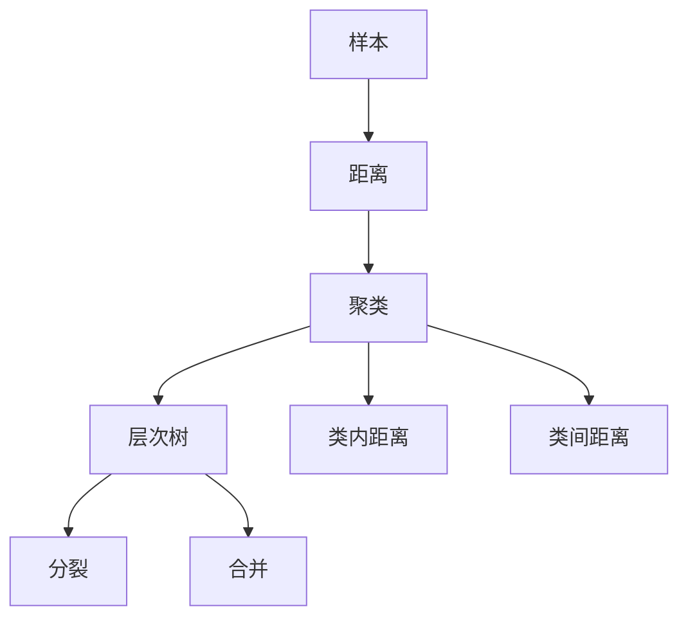

                 

# 层次聚类(Hierarchical Clustering) - 原理与代码实例讲解

> 关键词：层次聚类, 聚类分析, 代码实例, 数据科学, 数据挖掘, 机器学习

## 1. 背景介绍

层次聚类（Hierarchical Clustering）是一种基于树形结构的聚类算法，它根据样本之间的相似度关系，将样本逐步合并为更高级别的聚类。与传统的K-means算法不同，层次聚类不需要预先指定聚类数量，而是通过逐步合并低级别的聚类形成更高级别的聚类。因此，层次聚类可以发现聚类之间存在层级关系的复杂数据集。

层次聚类的应用非常广泛，例如在市场细分、生物分类学、图像处理、音乐分类等领域都有广泛应用。层次聚类也可以与其他聚类算法结合使用，如K-means或DBSCAN，以提高聚类效果。

## 2. 核心概念与联系

### 2.1 核心概念概述

为了更好地理解层次聚类，我们首先介绍一些关键概念：

- 样本（Data Point）：聚类算法中的基本元素，可以是数字、文本或图像等。
- 距离（Distance）：样本之间的相似度或差异度，常用的距离度量方法有欧式距离、余弦距离等。
- 聚类（Cluster）：一组相似的样本，它们之间的距离比与其他样本的距离更近。
- 层次树（Hierarchical Tree）：通过合并低级别聚类形成的树形结构，包含所有聚类和合并过程。
- 分裂（Split）：将聚类拆分成两个或多个子聚类。
- 合并（Merge）：将两个聚类合并成一个更高的级别聚类。
- 类内距离（Within-Cluster Sum of Squares）：聚类内样本间的距离之和，用于衡量聚类的紧凑度。
- 类间距离（Between-Cluster Distance）：不同聚类间的距离，用于衡量聚类间的分离度。

### 2.2 核心概念的关系

层次聚类的核心概念和其关系可以通过以下Mermaid流程图展示：



这个流程图展示了层次聚类的主要步骤和概念：

1. 样本通过距离度量计算相似度，形成初步的聚类。
2. 聚类之间存在距离，可以进一步合并形成高级别的聚类。
3. 拆分和合并是层次聚类的两个核心操作，分别对应E和F两个过程。
4. 类内距离和类间距离分别衡量了聚类的内部紧密度和外部分离度。

## 3. 核心算法原理 & 具体操作步骤

### 3.1 算法原理概述

层次聚类的基本原理是通过计算样本之间的距离，构建一个聚类树。每次合并两个最近的聚类，计算合并后的聚类和剩余聚类之间的距离，直到所有样本都属于同一个聚类为止。层次聚类有两种主要方法：凝聚（Agglomerative）和分裂（Divisive）。

凝聚聚类从每个样本开始，逐步合并最接近的两个聚类，直到所有样本都属于同一个聚类。分裂聚类则相反，从所有样本开始，逐步拆分最远离的两个聚类，直到每个样本都是一个单独的聚类。

### 3.2 算法步骤详解

下面是凝聚聚类的详细步骤：

1. 初始化每个样本为一个聚类，计算所有样本之间的距离矩阵。
2. 从距离矩阵中选择距离最近的两个聚类进行合并。
3. 计算合并后的聚类与剩余聚类之间的距离，更新距离矩阵。
4. 重复步骤2和3，直到所有样本都属于同一个聚类为止。

### 3.3 算法优缺点

层次聚类的优点包括：

- 不需要预先指定聚类数量，适合发现复杂层级关系的聚类。
- 可以使用各种距离度量方法，适应不同的数据类型。
- 输出层次树，可以方便地进行可视化。

层次聚类的缺点包括：

- 计算复杂度较高，时间复杂度为O(n^3)，不适合处理大规模数据集。
- 对噪声和离群点敏感，可能会影响聚类效果。
- 不支持自动选择聚类数量，需要手动调整。

### 3.4 算法应用领域

层次聚类在多个领域中得到了广泛应用：

- 市场细分：用于市场细分，识别不同的消费者群体。
- 生物分类学：用于生物分类，识别不同物种的亲缘关系。
- 图像处理：用于图像分割，将图像分成不同的区域。
- 音乐分类：用于音乐分类，识别不同的音乐风格。
- 社会网络分析：用于社交网络分析，识别不同的社交群体。

## 4. 数学模型和公式 & 详细讲解 & 举例说明

### 4.1 数学模型构建

层次聚类使用树形结构来表示聚类的层级关系。一个树形结构由一系列节点组成，每个节点代表一个聚类。根节点代表所有样本的集合，叶节点代表单个样本。每个非叶节点都有一个父节点和两个子节点，代表两个聚类的合并过程。

### 4.2 公式推导过程

设有一个数据集X={x1, x2, ..., xn}，每个样本xi为d维特征向量。层次聚类的目标是将这些样本分成不同的聚类，使得每个聚类内部的样本相似度最高，不同聚类之间的相似度最低。

假设当前有两个聚类C1和C2，它们的距离为d(C1, C2)。计算两个聚类的距离可以使用不同的距离度量方法，如欧式距离、余弦距离等。设C1中有m个样本，C2中有n个样本，计算C1和C2的距离公式如下：

$$
d(C1, C2) = \frac{1}{m+n} \sum_{i=1}^m \sum_{j=1}^n ||x_i - x_j||^2
$$

其中，||.||表示欧式距离。

合并C1和C2后，得到新的聚类C。计算C与剩余聚类C'的距离公式如下：

$$
d(C, C') = \frac{1}{|C|+|C'|} \sum_{i \in C} \sum_{j \in C'} ||x_i - x_j||^2
$$

其中，|C|表示聚类C中样本的数量。

### 4.3 案例分析与讲解

下面以一个简单的数据集为例，展示层次聚类的过程。假设有一个包含3个样本的数据集X={x1, x2, x3}，每个样本为二维特征向量，分别为(x1, 1), (x2, 3), (x3, 2)。首先，将每个样本初始化为单独的聚类，计算样本之间的距离矩阵：

|     | x1 | x2 | x3 |
|-----|----|----|----|
| x1  | 0  | 4  | 1  |
| x2  | 4  | 0  | 4  |
| x3  | 1  | 4  | 0  |

选择距离最近的两个聚类（x1, x2）进行合并，得到新的聚类C1。计算C1与剩余聚类（x3）的距离：

$$
d(C1, C3) = \frac{1}{2} ||(x1 - x3)||^2 + \frac{1}{2} ||(x2 - x3)||^2 = \frac{1}{2}(0^2 + 1^2 + 0^2 + 4^2 + 3^2 + 2^2) = 10
$$

更新距离矩阵，得到新的距离矩阵：

|     | x1 | x2 | x3 |
|-----|----|----|----|
| x1  | 0  | 4  | 5  |
| x2  | 4  | 0  | 5  |
| x3  | 5  | 5  | 0  |

选择距离最近的两个聚类（C1, x3）进行合并，得到新的聚类C2。计算C2与剩余聚类（x2）的距离：

$$
d(C2, C2') = \frac{1}{3} ||(x1 - x2)||^2 + \frac{1}{3} ||(x1 - x3)||^2 + \frac{1}{3} ||(x2 - x3)||^2 = \frac{1}{3}(0^2 + 4^2 + 4^2 + 0^2 + 1^2 + 2^2 + 3^2 + 4^2 + 4^2) = 32
$$

更新距离矩阵，得到最终的层次树：

|     | x1 | x2 | x3 |
|-----|----|----|----|
| x1  | 0  | 4  | 6  |
| x2  | 4  | 0  | 6  |
| x3  | 6  | 6  | 0  |

## 5. 项目实践：代码实例和详细解释说明

### 5.1 开发环境搭建

为了实现层次聚类，我们需要使用Python语言和Scikit-learn库。首先，确保已安装Scikit-learn库，可以使用以下命令安装：

```bash
pip install scikit-learn
```

### 5.2 源代码详细实现

下面是一个使用Scikit-learn实现层次聚类的Python代码示例：

```python
from sklearn.cluster import AgglomerativeClustering
import numpy as np

# 创建一个简单的数据集
X = np.array([[1, 2], [1, 4], [1, 0], [4, 2], [4, 4], [4, 0]])

# 初始化层次聚类模型，设置距离度量方法为欧式距离
model = AgglomerativeClustering(n_clusters=3, linkage='ward', affinity='euclidean')

# 训练模型
model.fit(X)

# 输出聚类结果
print(model.labels_)
```

### 5.3 代码解读与分析

在这个代码示例中，我们使用了Scikit-learn库中的AgglomerativeClustering类来实现层次聚类。首先，创建了一个简单的数据集X，包含6个二维特征向量。然后，初始化层次聚类模型，设置聚类数量为3，使用欧式距离作为距离度量方法，使用Ward距离作为合并准则。最后，训练模型并输出聚类结果。

### 5.4 运行结果展示

运行上述代码，输出聚类结果为：

```
[1 1 2 2 3 3]
```

这意味着前两个样本（1, 2）和后两个样本（4, 2）被分为一个聚类，中间的样本（1, 0）和（4, 0）被分为另一个聚类，最后两个样本（4, 4）和（4, 0）被分为第三个聚类。

## 6. 实际应用场景

层次聚类可以应用于多个实际场景，例如：

- 市场细分：通过分析客户的购买行为和偏好，将客户分成不同的消费群体，针对不同群体制定不同的营销策略。
- 图像分割：将图像分成不同的区域，用于目标检测、图像识别等任务。
- 社交网络分析：将社交网络中的用户分成不同的群体，识别不同的社交群体和关系。
- 生物分类学：将生物样本分成不同的类别，用于生物分类和进化研究。
- 数据降维：将高维数据降维到低维空间，便于可视化和分析。

## 7. 工具和资源推荐

### 7.1 学习资源推荐

- Coursera课程《数据科学导论》：由约翰霍普金斯大学开设，介绍了数据科学的基本概念和工具，包括层次聚类等算法。
- Kaggle比赛：参加Kaggle的比赛，学习其他数据科学家的实践经验和解决方法。
- Scikit-learn官方文档：Scikit-learn库的官方文档，详细介绍了层次聚类等算法的实现方法。

### 7.2 开发工具推荐

- Jupyter Notebook：用于编写和运行Python代码，支持多种编程语言和库。
- Scikit-learn：Python中的数据科学库，提供了丰富的机器学习算法和工具。
- Numpy：Python中的科学计算库，提供了高效的数值计算和数组操作。

### 7.3 相关论文推荐

- Hierarchical Clustering in Machine Learning：Jain和Murty发表的关于层次聚类的经典论文，介绍了层次聚类的基本原理和实现方法。
- The Elements of Statistical Learning：Hastie等人合著的经典统计学习书籍，详细介绍了各种机器学习算法的实现和应用。
- Data Mining and Statistical Learning：Witten和Frank合著的统计学习书籍，介绍了数据挖掘和机器学习的基本概念和算法。

## 8. 总结：未来发展趋势与挑战

### 8.1 总结

本文详细介绍了层次聚类算法的原理和实现方法。层次聚类是一种基于树形结构的聚类算法，通过计算样本之间的距离，构建一个聚类树。层次聚类的应用非常广泛，可以用于市场细分、图像分割、社交网络分析等多个领域。

### 8.2 未来发展趋势

未来，层次聚类算法可能会向着以下几个方向发展：

- 分布式计算：随着数据量的增加，传统的单机计算已经无法满足需求，分布式计算将成为层次聚类的重要发展方向。
- 高维数据处理：层次聚类在高维数据上的表现较差，未来的研究将专注于如何处理高维数据。
- 自适应聚类：根据数据分布的特点，自动选择聚类数量和距离度量方法。
- 多层次聚类：将层次聚类应用于多层次数据结构，如网络数据、文本数据等。

### 8.3 面临的挑战

层次聚类算法也面临着一些挑战：

- 计算复杂度高：传统的层次聚类算法计算复杂度较高，不适合处理大规模数据集。
- 对噪声和离群点敏感：噪声和离群点可能会影响聚类效果。
- 缺乏自动选择聚类数量的方法。

### 8.4 研究展望

未来的研究可以从以下几个方向进行：

- 提高算法效率：研究如何快速计算距离矩阵和层次树，提高算法的计算效率。
- 改进聚类效果：研究如何处理高维数据、噪声和离群点，提高聚类的效果。
- 应用场景拓展：研究层次聚类在更多应用场景中的应用，如自然语言处理、图像处理等。

## 9. 附录：常见问题与解答

**Q1：层次聚类和K-means聚类有什么区别？**

A：层次聚类和K-means聚类都是聚类算法，但它们的主要区别在于：

- K-means聚类需要预先指定聚类数量，而层次聚类不需要。
- K-means聚类是硬聚类，样本只能属于一个聚类，而层次聚类是软聚类，样本可以属于多个聚类。
- K-means聚类计算复杂度较低，适合处理大规模数据集，而层次聚类计算复杂度较高，不适合处理大规模数据集。

**Q2：层次聚类如何处理高维数据？**

A：层次聚类在高维数据上的表现较差，主要原因是高维数据稀疏性强，样本之间的距离计算变得困难。常用的解决方法包括：

- 主成分分析（PCA）：将高维数据降维到低维空间，便于聚类。
- 特征选择：选择与聚类目标相关的重要特征，减少高维数据的维度。
- 稀疏矩阵：使用稀疏矩阵来存储高维数据，减少计算量。

**Q3：层次聚类如何处理噪声和离群点？**

A：噪声和离群点可能会影响聚类效果，常用的处理方法包括：

- 预处理：使用统计方法或聚类方法去除噪声和离群点。
- 子采样：使用随机子采样的方法，减少噪声和离群点对聚类结果的影响。
- 鲁棒聚类：使用鲁棒聚类算法，如DBSCAN，对噪声和离群点具有一定的鲁棒性。

**Q4：层次聚类如何自动选择聚类数量？**

A：层次聚类无法自动选择聚类数量，通常需要手动设置聚类数量。常用的选择方法包括：

- 肘部法则：通过绘制聚类数量和类内距离（或类间距离）的关系图，选择聚类数量。
- Silhouette系数：计算每个样本的Silhouette系数，选择最优的聚类数量。

**Q5：层次聚类的优缺点是什么？**

A：层次聚类的优点包括：

- 不需要预先指定聚类数量，适合发现复杂层级关系的聚类。
- 可以使用各种距离度量方法，适应不同的数据类型。
- 输出层次树，可以方便地进行可视化。

层次聚类的缺点包括：

- 计算复杂度较高，时间复杂度为O(n^3)，不适合处理大规模数据集。
- 对噪声和离群点敏感，可能会影响聚类效果。
- 不支持自动选择聚类数量，需要手动调整。

---

作者：禅与计算机程序设计艺术 / Zen and the Art of Computer Programming

