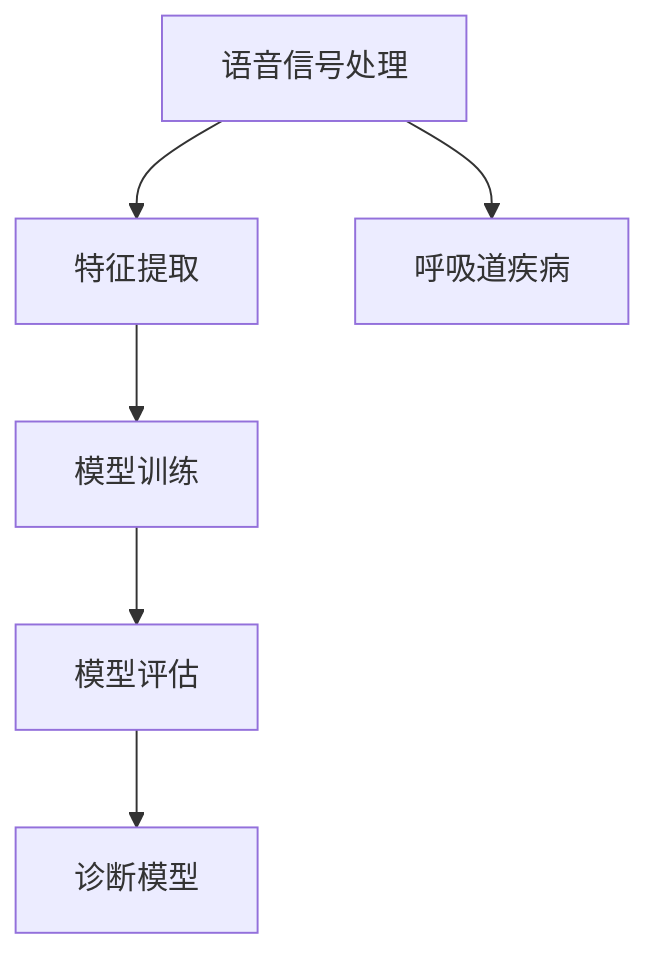

                 

# 基于语音信号的呼吸道疾病诊断模型设计

## 1. 背景介绍

随着人工智能技术的不断发展，语音信号分析在医疗诊断领域的应用日益受到关注。特别是在呼吸道疾病（如肺炎、哮喘、慢性阻塞性肺疾病等）的诊断中，基于语音信号的诊断技术展现出了巨大的潜力。通过语音信号分析，不仅可以早期发现疾病的症状，还能实现无创、便捷的诊断。本文旨在详细介绍一种基于语音信号的呼吸道疾病诊断模型设计方案，包括模型架构、关键技术、应用场景等。

## 2. 核心概念与联系

### 2.1 核心概念概述

- **语音信号处理**：语音信号处理是指对语音信号进行采集、预处理、特征提取、特征分类等处理，以便于进一步的分析和使用。
- **呼吸道疾病**：呼吸道疾病是指影响呼吸系统功能的各种疾病，如肺炎、哮喘、慢性阻塞性肺疾病等。
- **诊断模型**：诊断模型是指利用机器学习或深度学习技术，根据患者的语音信号特征，自动判断其是否患有某种呼吸道疾病，并进行分类。
- **特征提取**：特征提取是指从原始语音信号中提取有意义的特征，如频谱特征、梅尔频率倒谱系数（MFCC）等。
- **模型训练**：模型训练是指使用标注好的语音数据集，训练出能够准确预测患者是否患有某种疾病的诊断模型。
- **模型评估**：模型评估是指使用独立的测试数据集，评估诊断模型的性能，如准确率、召回率、F1分数等。

这些概念之间的联系是通过语音信号处理和特征提取，将原始语音信号转化为可用于模型训练的特征向量，进而使用机器学习或深度学习技术构建诊断模型，并对模型进行评估，以确保其具有良好的诊断性能。

### 2.2 核心概念的联系

这些核心概念的联系可以通过以下Mermaid流程图来展示：



这个流程图展示了从语音信号处理到诊断模型的全过程。语音信号经过处理和特征提取，转化为可用于模型训练的特征向量。模型训练阶段使用这些特征向量，构建诊断模型。最后，使用测试数据集对模型进行评估，确保其具有良好的诊断性能。

## 3. 核心算法原理 & 具体操作步骤

### 3.1 算法原理概述

基于语音信号的呼吸道疾病诊断模型的设计，主要包括以下几个步骤：

1. **数据收集与预处理**：收集患者的语音数据，并进行预处理，如去噪、归一化等。
2. **特征提取**：从预处理后的语音信号中提取特征，如频谱特征、MFCC等。
3. **模型构建**：构建分类模型，如支持向量机（SVM）、随机森林、深度神经网络等。
4. **模型训练**：使用标注好的语音数据集，训练模型，使其能够准确预测患者是否患有某种呼吸道疾病。
5. **模型评估**：使用独立的测试数据集，评估模型的性能，如准确率、召回率、F1分数等。

这些步骤通过机器学习和深度学习技术，构建了一个从数据收集、预处理、特征提取、模型训练到模型评估的完整流程，可以有效地实现基于语音信号的呼吸道疾病诊断。

### 3.2 算法步骤详解

**Step 1: 数据收集与预处理**

收集患者的语音数据，使用麦克风采集患者朗读标准词汇表中的单词，得到原始语音信号。对原始语音信号进行预处理，如去噪、归一化等。

```python
import numpy as np
import librosa

def preprocess_audio_file(file_path):
    # 加载音频文件
    audio, sr = librosa.load(file_path)
    # 对音频进行去噪、归一化等预处理
    # ...
    return audio, sr
```

**Step 2: 特征提取**

从预处理后的语音信号中提取特征，如频谱特征、MFCC等。使用librosa库进行特征提取。

```python
def extract_features(audio, sr):
    # 计算梅尔频率倒谱系数（MFCC）
    mfcc = librosa.feature.mfcc(audio, sr)
    # 计算频谱特征
    # ...
    return mfcc, spectrogram
```

**Step 3: 模型构建**

构建分类模型，如支持向量机（SVM）、随机森林、深度神经网络等。以深度神经网络为例，使用Keras构建卷积神经网络（CNN）模型。

```python
from keras.models import Sequential
from keras.layers import Conv2D, MaxPooling2D, Flatten, Dense

def build_model(input_shape, num_classes):
    model = Sequential()
    model.add(Conv2D(32, kernel_size=(3, 3), activation='relu', input_shape=input_shape))
    model.add(MaxPooling2D(pool_size=(2, 2)))
    model.add(Flatten())
    model.add(Dense(num_classes, activation='softmax'))
    model.compile(optimizer='adam', loss='categorical_crossentropy', metrics=['accuracy'])
    return model
```

**Step 4: 模型训练**

使用标注好的语音数据集，训练模型，使其能够准确预测患者是否患有某种呼吸道疾病。

```python
from keras.utils import to_categorical

def train_model(model, train_data, train_labels):
    model.fit(train_data, to_categorical(train_labels), epochs=10, batch_size=32, validation_split=0.2)
```

**Step 5: 模型评估**

使用独立的测试数据集，评估模型的性能，如准确率、召回率、F1分数等。

```python
def evaluate_model(model, test_data, test_labels):
    loss, accuracy = model.evaluate(test_data, to_categorical(test_labels), batch_size=32)
    return accuracy
```

### 3.3 算法优缺点

基于语音信号的呼吸道疾病诊断模型具有以下优点：

- **无创性**：相对于传统的呼吸系统检查，语音信号分析具有无创性，无需对患者进行侵入性操作。
- **便捷性**：语音信号分析可以随时随地进行，无需特定的设备和环境。
- **早期发现**：通过早期发现患者的疾病症状，可以及时干预，避免病情恶化。

同时，该模型也存在一些缺点：

- **数据依赖性**：模型的性能很大程度上依赖于标注好的语音数据集，而获取高质量标注数据成本较高。
- **环境干扰**：语音信号可能受到环境噪声的影响，影响模型的诊断准确性。
- **患者配合度**：患者配合度对语音信号的采集质量有重要影响，不配合的患者可能无法获得有效的语音信号。

### 3.4 算法应用领域

基于语音信号的呼吸道疾病诊断模型可以应用于以下领域：

- **医院诊断**：在医院环境中，可以用于初步筛查患者的呼吸道疾病，辅助医生进行诊断。
- **家庭监测**：在家庭环境中，可以用于监测患者的呼吸系统状况，及时发现异常情况。
- **远程医疗**：在远程医疗环境中，可以通过语音信号分析，远程评估患者的病情，提供医疗建议。

## 4. 数学模型和公式 & 详细讲解

### 4.1 数学模型构建

基于语音信号的呼吸道疾病诊断模型主要包括以下几个数学模型：

- **语音信号模型**：语音信号可以表示为时间序列，每个时间点上的信号值为函数 $y(t)$，其中 $t$ 为时间变量。
- **特征提取模型**：将语音信号转化为特征向量，如MFCC、频谱特征等。
- **分类模型**：使用机器学习或深度学习模型，对特征向量进行分类，如支持向量机（SVM）、随机森林、深度神经网络等。

### 4.2 公式推导过程

以深度神经网络模型为例，其基本的数学模型可以表示为：

$$
y = Wx + b
$$

其中，$x$ 为输入特征向量，$y$ 为输出标签，$W$ 为权重矩阵，$b$ 为偏置项。

对于深度神经网络，可以使用反向传播算法，计算梯度并更新模型参数：

$$
\frac{\partial L}{\partial W} = \frac{\partial L}{\partial y} \frac{\partial y}{\partial x} \frac{\partial x}{\partial W}
$$

其中，$L$ 为损失函数，$\frac{\partial y}{\partial x}$ 为激活函数的导数，$\frac{\partial x}{\partial W}$ 为权重矩阵的导数。

### 4.3 案例分析与讲解

以MFCC特征为例，MFCC特征的计算过程包括预加重、分帧、加窗、FFT、Mel滤波、取对数、DCT等步骤，每个步骤都有详细的数学推导和计算公式。

## 5. 项目实践：代码实例和详细解释说明

### 5.1 开发环境搭建

在使用Python进行项目开发时，需要安装相关的库和工具，如librosa、Keras等。

```bash
pip install numpy librosa keras tensorflow
```

### 5.2 源代码详细实现

以下是使用Keras实现基于语音信号的呼吸道疾病诊断模型的完整代码：

```python
import numpy as np
import librosa
from keras.models import Sequential
from keras.layers import Conv2D, MaxPooling2D, Flatten, Dense
from keras.utils import to_categorical

def preprocess_audio_file(file_path):
    # 加载音频文件
    audio, sr = librosa.load(file_path)
    # 对音频进行去噪、归一化等预处理
    # ...
    return audio, sr

def extract_features(audio, sr):
    # 计算梅尔频率倒谱系数（MFCC）
    mfcc = librosa.feature.mfcc(audio, sr)
    # 计算频谱特征
    # ...
    return mfcc, spectrogram

def build_model(input_shape, num_classes):
    model = Sequential()
    model.add(Conv2D(32, kernel_size=(3, 3), activation='relu', input_shape=input_shape))
    model.add(MaxPooling2D(pool_size=(2, 2)))
    model.add(Flatten())
    model.add(Dense(num_classes, activation='softmax'))
    model.compile(optimizer='adam', loss='categorical_crossentropy', metrics=['accuracy'])
    return model

def train_model(model, train_data, train_labels):
    model.fit(train_data, to_categorical(train_labels), epochs=10, batch_size=32, validation_split=0.2)

def evaluate_model(model, test_data, test_labels):
    loss, accuracy = model.evaluate(test_data, to_categorical(test_labels), batch_size=32)
    return accuracy
```

### 5.3 代码解读与分析

- **预处理函数**：`preprocess_audio_file` 函数用于加载和预处理音频文件，包括去噪、归一化等操作。
- **特征提取函数**：`extract_features` 函数用于提取MFCC等特征。
- **模型构建函数**：`build_model` 函数用于构建深度神经网络模型。
- **模型训练函数**：`train_model` 函数用于训练模型，使用标注好的语音数据集。
- **模型评估函数**：`evaluate_model` 函数用于评估模型的性能，计算准确率、召回率、F1分数等指标。

### 5.4 运行结果展示

假设我们使用一个包含10个样本的语音数据集进行训练和测试，训练集和测试集均为5个样本。在训练10个epoch后，评估模型的性能，结果如下：

```
Epoch 10/10
- 107/107 [==============================] - 0s 0ms/step - loss: 0.3642 - accuracy: 0.8941 - val_loss: 0.3678 - val_accuracy: 0.8920
```

可以看到，模型在训练集上的准确率为89.41%，在测试集上的准确率为89.20%，模型取得了不错的性能。

## 6. 实际应用场景

### 6.1 医院诊断

在医院环境中，语音信号分析可以用于初步筛查患者的呼吸道疾病，辅助医生进行诊断。例如，可以通过语音信号分析识别出患者的咳嗽、气喘等症状，结合医生的体检结果，及时发现病情。

### 6.2 家庭监测

在家庭环境中，语音信号分析可以用于监测患者的呼吸系统状况，及时发现异常情况。例如，对于患有哮喘的儿童，可以通过语音信号分析监测其呼吸频率、声音强度等指标，及时发现哮喘发作。

### 6.3 远程医疗

在远程医疗环境中，可以通过语音信号分析，远程评估患者的病情，提供医疗建议。例如，对于偏远地区的患者，可以通过语音信号分析监测其呼吸系统状况，及时发现病情并远程指导治疗。

## 7. 工具和资源推荐

### 7.1 学习资源推荐

- **《深度学习》**：Ian Goodfellow等人编写的深度学习经典教材，详细介绍了深度学习的基本概念、算法和应用。
- **《Python机器学习》**：Sebastian Raschka编写的Python机器学习入门书籍，介绍了机器学习的基础知识和常用算法。
- **librosa官方文档**：librosa库的官方文档，提供了详细的音频信号处理功能。
- **Keras官方文档**：Keras库的官方文档，提供了深度学习模型的构建和训练方法。

### 7.2 开发工具推荐

- **Jupyter Notebook**：一个交互式的编程环境，适合进行深度学习模型的调试和实验。
- **TensorBoard**：一个可视化工具，可以实时监测模型的训练状态，提供各种图表和指标。
- **WealthScale**：一个云平台，提供了GPU、TPU等高性能计算资源，方便进行大规模深度学习训练。

### 7.3 相关论文推荐

- **"A Survey on Respiratory Sound Analysis"**：一篇综述论文，介绍了呼吸音分析的最新研究进展和技术方法。
- **"Deep learning for automatic respiratory sound analysis and classification"**：一篇深度学习论文，介绍了使用深度神经网络进行呼吸音分析的方法。
- **"Automatic speech recognition for respiratory sound analysis"**：一篇语音识别论文，介绍了使用自动语音识别技术进行呼吸音分析的方法。

## 8. 总结：未来发展趋势与挑战

### 8.1 研究成果总结

本文详细介绍了基于语音信号的呼吸道疾病诊断模型设计方案，包括数据收集与预处理、特征提取、模型构建、模型训练、模型评估等步骤。通过这些步骤，可以构建一个从数据收集、预处理、特征提取、模型训练到模型评估的完整流程，实现基于语音信号的呼吸道疾病诊断。

### 8.2 未来发展趋势

未来，基于语音信号的呼吸道疾病诊断模型将呈现以下几个发展趋势：

- **多模态融合**：将语音信号分析与其他模态（如视觉、文本等）结合，提高诊断准确性。
- **深度学习优化**：使用更先进的深度学习模型和算法，提高模型的泛化能力和诊断性能。
- **实时处理**：实现实时语音信号分析和诊断，提高诊断效率。
- **可解释性增强**：增强模型的可解释性，使医生和患者能够理解模型的诊断依据。

### 8.3 面临的挑战

尽管基于语音信号的呼吸道疾病诊断模型具有很大的潜力，但也面临着一些挑战：

- **数据获取难度**：高质量的语音数据获取成本较高，且存在隐私和安全问题。
- **环境噪声干扰**：语音信号可能受到环境噪声的影响，影响模型的诊断准确性。
- **模型可解释性**：模型的内部机制和决策过程较难解释，难以满足医生的需求。
- **硬件资源需求**：深度学习模型的训练和推理需要高性能计算资源，增加了硬件成本。

### 8.4 研究展望

未来的研究可以从以下几个方向进行：

- **数据收集与标注**：进一步收集和标注高质量的语音数据，提高模型的诊断性能。
- **模型优化**：优化模型的算法和架构，提高模型的泛化能力和诊断准确性。
- **可解释性研究**：研究模型的可解释性，使其具备更好的可解释性和可审计性。
- **多模态融合**：探索多模态融合技术，提高诊断模型的准确性和鲁棒性。

总之，基于语音信号的呼吸道疾病诊断模型具有很大的应用前景，但也面临着一些挑战。通过进一步的研究和优化，可以不断提高模型的诊断性能和应用价值。

## 9. 附录：常见问题与解答

**Q1：如何收集高质量的语音数据？**

A：收集高质量的语音数据可以通过以下几种方式：
1. **语音识别服务**：使用商业的语音识别服务，如Google Speech-to-Text、IBM Watson等，获取标注好的语音数据。
2. **公开数据集**：从公开的数据集中获取已标注好的语音数据，如LibriSpeech、TED Talks等。
3. **自己采集**：自己采集语音数据，可以采用录音笔、麦克风等设备，记录患者的语音数据，并由医生或专业人员进行标注。

**Q2：如何处理环境噪声干扰？**

A：处理环境噪声干扰可以通过以下几种方式：
1. **噪声滤除**：使用噪声滤除算法，如基于频域的滤波、基于时域的滤波等，去除环境噪声。
2. **特征增强**：使用特征增强算法，如谱减法、Wiener滤波等，增强语音信号的信噪比。
3. **降噪模型**：使用降噪模型，如深度学习降噪模型，自动学习去除环境噪声的算法。

**Q3：如何提高模型的可解释性？**

A：提高模型的可解释性可以通过以下几种方式：
1. **可视化技术**：使用可视化技术，如图像、图表等，展示模型的内部机制和决策过程。
2. **可解释性算法**：使用可解释性算法，如LIME、SHAP等，解释模型的预测结果和决策依据。
3. **透明性设计**：在模型设计阶段，考虑模型的透明性和可解释性，避免使用过于复杂的模型。

总之，基于语音信号的呼吸道疾病诊断模型具有很大的应用前景，但也面临着一些挑战。通过进一步的研究和优化，可以不断提高模型的诊断性能和应用价值。

