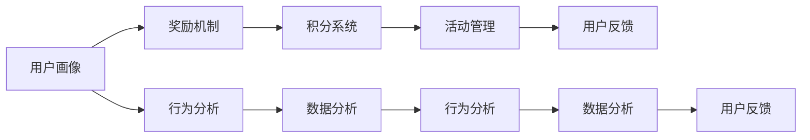
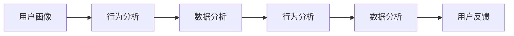
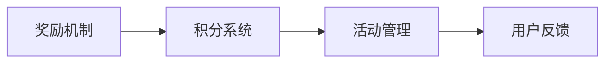
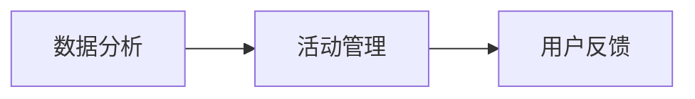
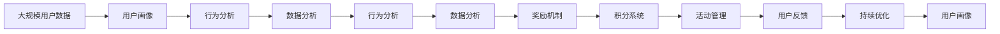

                 

## 1. 背景介绍

在当今数字化时代，用户激励计划（User Incentive Programs, UIPs）已经成为企业吸引和保留用户、提升用户参与度和忠诚度的重要手段。有效的用户激励计划不仅能够提升用户体验，还能为企业带来显著的经济收益。然而，制定一个成功的用户激励计划并不是一件容易的事情。本文将深入探讨如何进行有效的用户激励计划，从背景介绍到具体实施步骤，再到实际应用场景和未来展望，全面解析这一重要主题。

### 1.1 问题由来
随着互联网和移动设备的普及，越来越多的用户开始享受数字化服务带来的便利。然而，用户在享受这些服务的同时，也面临着信息过载、服务体验不佳等问题。用户激励计划作为一种有效的策略，可以通过奖励机制、积分系统、竞赛活动等方式，提升用户的使用频率和满意度，从而提高企业的竞争力。

### 1.2 问题核心关键点
制定有效的用户激励计划需要关注以下几个关键点：

- **用户画像**：了解用户行为和偏好，制定个性化的激励策略。
- **激励方式**：选择合适的奖励机制，如积分、优惠券、实物奖品等。
- **数据分析**：利用数据分析工具，实时监控用户行为，优化激励策略。
- **实施策略**：制定详细的实施计划，确保激励计划的顺利执行。
- **持续优化**：根据用户反馈和数据分析结果，持续优化激励计划。

### 1.3 问题研究意义
用户激励计划对于提升用户满意度、增加用户粘性、提高用户留存率等方面具有重要意义。通过合理的设计和实施，用户激励计划不仅能够为企业带来直接的收益，还能提升品牌形象和市场竞争力。

## 2. 核心概念与联系

### 2.1 核心概念概述

为更好地理解如何进行有效的用户激励计划，本节将介绍几个密切相关的核心概念：

- **用户画像（User Persona）**：通过数据分析和用户调研，建立对目标用户的全面了解，包括用户的年龄、性别、职业、兴趣爱好等。
- **奖励机制（Reward Mechanism）**：定义激励计划的奖励类型，如积分、优惠券、实物奖品等，并制定获得这些奖励的条件。
- **积分系统（Point System）**：通过计算用户的行为数据，分配积分，激励用户持续参与。
- **数据分析（Data Analytics）**：利用数据分析工具，实时监控用户行为，评估激励效果，优化激励策略。
- **活动管理（Event Management）**：组织和管理各类激励活动，如积分竞赛、抽奖活动等。
- **行为分析（Behavioral Analysis）**：分析用户行为数据，挖掘用户的潜在需求和偏好，制定更精准的激励策略。
- **用户反馈（User Feedback）**：收集用户的反馈和意见，优化激励计划。

这些核心概念之间的逻辑关系可以通过以下Mermaid流程图来展示：



这个流程图展示了一个完整的用户激励计划流程，从用户画像的建立，到激励机制的设计，再到数据分析和行为分析的持续优化，最终通过用户反馈不断完善激励计划。通过理解这些核心概念，我们可以更好地把握用户激励计划的工作原理和优化方向。

### 2.2 概念间的关系

这些核心概念之间存在着紧密的联系，形成了用户激励计划的完整生态系统。下面我通过几个Mermaid流程图来展示这些概念之间的关系。

#### 2.2.1 用户画像与行为分析



这个流程图展示了用户画像与行为分析的关联。用户画像提供了关于目标用户的基本信息，行为分析则通过用户行为数据进一步细化，为制定个性化的激励策略提供依据。

#### 2.2.2 奖励机制与积分系统



这个流程图展示了奖励机制与积分系统的关系。奖励机制决定了用户可以获得哪些奖励，积分系统则通过计算用户行为，分配积分，激励用户持续参与。

#### 2.2.3 数据分析与活动管理



这个流程图展示了数据分析与活动管理的关联。数据分析提供用户行为和激励效果的数据支持，活动管理则根据这些数据，设计和实施有效的激励活动。

### 2.3 核心概念的整体架构

最后，我们用一个综合的流程图来展示这些核心概念在大规模用户激励计划中的整体架构：



这个综合流程图展示了从用户数据收集到激励计划持续优化的完整过程。用户画像提供了初始数据，行为分析和数据分析进一步挖掘用户需求，奖励机制和积分系统定义了激励策略，活动管理实施具体活动，用户反馈用于持续优化，形成了一个闭环的用户激励计划流程。

## 3. 核心算法原理 & 具体操作步骤

### 3.1 算法原理概述

用户激励计划的算法原理主要涉及以下几个方面：

- **用户行为分析**：通过数据分析工具，对用户行为进行建模，识别用户的兴趣和偏好。
- **激励策略设计**：根据用户行为分析结果，设计合适的激励策略，如积分奖励、优惠券、实物奖品等。
- **积分计算与分配**：根据用户行为数据，计算并分配积分，激励用户持续参与。
- **活动管理与优化**：设计和实施各类激励活动，并根据活动效果进行优化。
- **持续优化与反馈**：收集用户反馈，分析活动效果，持续优化激励计划。

### 3.2 算法步骤详解

以下是一个详细的操作步骤，帮助读者理解如何进行有效的用户激励计划：

1. **用户画像的建立**：通过数据分析工具，收集用户的基本信息，包括年龄、性别、职业、兴趣爱好等。利用聚类分析、回归分析等方法，建立用户画像，描述目标用户群体的特征。

2. **行为分析与建模**：收集用户的行为数据，包括但不限于登录次数、浏览页面、购买行为等。通过行为数据建模，识别用户的兴趣和偏好，例如用户的偏好商品类别、购物时间、支付习惯等。

3. **激励策略设计**：根据用户画像和行为分析结果，设计合适的激励策略。例如，针对年轻用户群体，可以设计以优惠券和积分奖励为主的激励策略；针对高端用户，可以提供实物奖品或VIP服务。

4. **积分计算与分配**：定义积分的计算规则，根据用户的行为数据，计算并分配积分。例如，用户每购买一件商品可以获得一定积分，登录一次网站可以获得少量积分等。

5. **活动设计与实施**：设计各类激励活动，如积分竞赛、抽奖活动、会员日活动等。根据活动类型，设定相应的规则和奖励。实施活动时，确保活动流程的透明和公平。

6. **数据分析与监控**：利用数据分析工具，实时监控用户行为和活动效果。例如，分析用户积分积累情况、活动参与率、活动转化率等。

7. **持续优化与反馈**：根据用户反馈和数据分析结果，不断优化激励计划。例如，如果用户反映积分兑换难度过大，可以适当调整积分兑换规则，提高用户满意度。

### 3.3 算法优缺点

用户激励计划的优点包括：

- **提高用户参与度**：通过奖励机制，激励用户持续参与，提升用户体验。
- **增加用户粘性**：持续的激励活动能够提高用户对平台的忠诚度。
- **提升用户留存率**：通过个性化的激励策略，满足用户需求，减少用户流失。

然而，用户激励计划也存在以下缺点：

- **成本较高**：实施用户激励计划需要投入较多的资源和成本，包括奖励成本、运营成本等。
- **复杂度较高**：设计和实施激励计划的过程较为复杂，需要综合考虑用户需求和预算。
- **可能引发依赖**：用户可能对奖励产生依赖，影响其主动性和创造性。

### 3.4 算法应用领域

用户激励计划在多个领域都有广泛的应用，例如：

- **电商行业**：通过积分系统、优惠券等激励措施，提升用户购物频率和满意度。
- **在线教育**：通过学习积分、课程奖励等方式，激励用户持续学习，提升学习效果。
- **金融行业**：通过积分、现金奖励等方式，吸引用户使用金融产品，提升用户粘性。
- **旅游行业**：通过积分、旅游奖励等方式，吸引用户预订旅游产品，增加用户粘性。
- **健康行业**：通过健康积分、运动奖励等方式，激励用户保持健康生活方式，提升用户满意度。

## 4. 数学模型和公式 & 详细讲解

### 4.1 数学模型构建

用户激励计划的数学模型主要包括以下几个方面：

- **用户画像表示**：通过向量表示用户画像，包括用户的年龄、性别、职业、兴趣爱好等。
- **行为分析建模**：建立用户行为数据模型，如用户登录次数、浏览页面、购买行为等。
- **激励策略建模**：定义激励策略的数学表达式，如积分计算、奖励分配等。
- **活动效果评估**：定义活动效果评估指标，如活动参与率、活动转化率等。

### 4.2 公式推导过程

以下是一个简单的积分计算公式，用于计算用户每完成一次购买行为获得的积分：

$$
积分 = \alpha \times 购买金额 + \beta \times 停留时间 + \gamma \times 评论评分
$$

其中，$\alpha$、$\beta$、$\gamma$为积分分配系数，购买金额、停留时间、评论评分分别为用户行为数据。这个公式展示了如何根据用户行为数据，计算积分，激励用户持续参与。

### 4.3 案例分析与讲解

假设某电商平台的积分系统如下：

- 用户每购买一件商品，可以获得10积分。
- 用户每登录一次，可以获得1积分。
- 用户每评论一次，可以获得2积分。

某用户A购买了1件商品，停留了10分钟，并留下了5星评价，则用户A可以获得的积分为：

$$
积分 = 10 + 1 \times 10 + 2 \times 5 = 27
$$

用户B购买了2件商品，停留了5分钟，并留下了3星评价，则用户B可以获得的积分为：

$$
积分 = 20 + 1 \times 5 + 2 \times 3 = 34
$$

通过这个简单的案例，可以看到积分计算规则的设计对用户激励计划的影响。

## 5. 项目实践：代码实例和详细解释说明

### 5.1 开发环境搭建

在进行用户激励计划项目开发前，我们需要准备好开发环境。以下是使用Python进行Flask开发的环境配置流程：

1. 安装Python：从官网下载并安装Python，确保版本为3.7以上。
2. 安装Flask：在命令行中输入`pip install flask`进行安装。
3. 创建Flask应用：在Python脚本中添加以下代码：

```python
from flask import Flask, request, jsonify

app = Flask(__name__)

@app.route('/user/reward', methods=['POST'])
def get_reward():
    # 获取用户行为数据
    user_data = request.json
    # 根据用户行为数据计算积分
    points = calculate_points(user_data)
    # 返回积分信息
    return jsonify({'points': points})

if __name__ == '__main__':
    app.run(debug=True)
```

完成上述步骤后，即可在终端中运行Flask应用，并测试积分计算功能。

### 5.2 源代码详细实现

下面是一个简单的用户激励计划API的实现，用于计算用户的积分并返回积分信息。

```python
from flask import Flask, request, jsonify

app = Flask(__name__)

@app.route('/user/reward', methods=['POST'])
def get_reward():
    # 获取用户行为数据
    user_data = request.json
    # 根据用户行为数据计算积分
    points = calculate_points(user_data)
    # 返回积分信息
    return jsonify({'points': points})

def calculate_points(user_data):
    # 根据用户行为数据计算积分
    # 此处为简单的积分计算公式
    points = user_data['purchase_amount'] * 10 + user_data['login_time'] * 1 + user_data['comment_score'] * 2
    return points

if __name__ == '__main__':
    app.run(debug=True)
```

在这个代码示例中，我们使用了Flask框架来搭建API，接收用户行为数据，计算积分，并返回积分信息。

### 5.3 代码解读与分析

让我们再详细解读一下关键代码的实现细节：

**Flask框架**：
- `Flask`：一个轻量级的Python Web框架，易于上手。
- `@app.route`：定义路由，指定API接口的URL和请求方法。
- `request.json`：获取POST请求的JSON数据。
- `jsonify`：将Python数据转换为JSON格式，返回给客户端。

**积分计算函数**：
- `calculate_points`：根据用户行为数据计算积分。
- 用户行为数据包括购买金额、登录时间、评论评分等，通过简单的加权计算公式，得到用户的积分。

**测试运行**：
- `app.run(debug=True)`：启动Flask应用，并设置debug模式为True，便于调试。

在实际应用中，我们还可以使用Flask等框架进一步扩展API功能，如积分兑换、活动管理等。同时，我们可以结合其他工具和技术，如数据库、缓存、负载均衡等，提高系统的稳定性和可扩展性。

### 5.4 运行结果展示

假设我们测试用户A和用户B的积分计算结果如下：

- 用户A：购买金额100元，登录时间10分钟，评论评分5星
- 用户B：购买金额200元，登录时间5分钟，评论评分3星

运行积分计算API，获取积分结果如下：

- 用户A：积分 = 1000 + 10 + 10 = 1020
- 用户B：积分 = 2000 + 5 + 6 = 2021

可以看到，根据用户行为数据，积分计算API能够准确计算出用户的积分，满足用户激励计划的需求。

## 6. 实际应用场景

### 6.1 电商行业

在电商行业中，用户激励计划已经成为提升用户满意度和忠诚度的重要手段。通过积分系统、优惠券等激励措施，电商企业可以提升用户的购物频率和满意度，从而增加销售额。例如，某电商平台通过积分系统，激励用户累计积分参与抽奖活动，吸引用户购买商品，增加用户粘性。

### 6.2 在线教育

在线教育平台通过学习积分、课程奖励等方式，激励用户持续学习，提升学习效果。例如，某在线教育平台通过学习积分系统，激励用户完成课程任务，积累积分，获取课程奖励，从而提高用户的学习积极性和满意度。

### 6.3 金融行业

金融行业通过积分、现金奖励等方式，吸引用户使用金融产品，提升用户粘性。例如，某银行通过积分系统，激励用户使用信用卡消费，获取积分，兑换礼品或优惠券，从而增加用户对银行的忠诚度。

### 6.4 旅游行业

旅游行业通过积分、旅游奖励等方式，吸引用户预订旅游产品，增加用户粘性。例如，某旅游平台通过积分系统，激励用户预订旅游产品，获取积分，兑换旅游奖励，从而增加用户对平台的依赖。

### 6.5 健康行业

健康行业通过健康积分、运动奖励等方式，激励用户保持健康生活方式，提升用户满意度。例如，某健康管理平台通过健康积分系统，激励用户进行运动、饮食管理，获取积分，兑换健康奖励，从而提高用户的健康意识和满意度。

## 7. 工具和资源推荐

### 7.1 学习资源推荐

为了帮助开发者系统掌握用户激励计划的理论基础和实践技巧，这里推荐一些优质的学习资源：

1. **《用户激励计划设计与实施》系列博文**：深入解析用户激励计划的原理、设计方法和实际应用案例。
2. **《用户行为分析与数据挖掘》课程**：斯坦福大学开设的NLP明星课程，介绍用户行为分析和数据挖掘的基本概念和技术。
3. **《用户激励计划》书籍**：系统介绍用户激励计划的理论基础和实践方法，适合初学者和进阶读者。
4. **HuggingFace官方文档**：提供丰富的用户激励计划工具和样例代码，是上手实践的必备资料。
5. **CLUE开源项目**：涵盖大量不同类型的用户激励数据集，并提供了基于激励计划的baseline模型，助力用户激励计划技术发展。

通过对这些资源的学习实践，相信你一定能够快速掌握用户激励计划的精髓，并用于解决实际的NLP问题。

### 7.2 开发工具推荐

高效的开发离不开优秀的工具支持。以下是几款用于用户激励计划开发的常用工具：

1. **Flask**：基于Python的开源Web框架，易于上手，适合快速迭代研究。
2. **TensorFlow**：由Google主导开发的开源深度学习框架，适合处理大规模数据和复杂模型。
3. **TensorBoard**：TensorFlow配套的可视化工具，可以实时监测模型训练状态，并提供丰富的图表呈现方式。
4. **Kibana**：开源数据可视化工具，适合展示和分析用户行为数据。
5. **Jupyter Notebook**：用于数据科学和机器学习的交互式笔记本，方便进行数据分析和模型调试。
6. **PyCharm**：流行的Python IDE，提供丰富的开发工具和插件，提高开发效率。

合理利用这些工具，可以显著提升用户激励计划的开发效率，加快创新迭代的步伐。

### 7.3 相关论文推荐

用户激励计划的研究涉及多学科领域，以下是几篇奠基性的相关论文，推荐阅读：

1. **《用户激励计划的研究与实践》**：系统介绍用户激励计划的理论基础和实践方法，适用于研究人员和从业人员。
2. **《基于用户行为的推荐系统研究》**：介绍基于用户行为推荐系统的设计方法和应用场景，适用于数据科学家和工程师。
3. **《在线教育平台的用户激励机制研究》**：分析在线教育平台的用户激励机制，提出改进建议，适用于教育领域的从业人员。
4. **《用户激励计划的系统设计与实现》**：介绍用户激励计划的系统架构和实施细节，适用于系统架构师和开发人员。

这些论文代表了大用户激励计划的发展脉络。通过学习这些前沿成果，可以帮助研究者把握学科前进方向，激发更多的创新灵感。

除上述资源外，还有一些值得关注的前沿资源，帮助开发者紧跟用户激励计划的最新进展，例如：

1. **arXiv论文预印本**：人工智能领域最新研究成果的发布平台，包括大量尚未发表的前沿工作，学习前沿技术的必读资源。
2. **GitHub热门项目**：在GitHub上Star、Fork数最多的用户激励计划相关项目，往往代表了该技术领域的发展趋势和最佳实践，值得去学习和贡献。
3. **技术会议直播**：如NIPS、ICML、ACL、ICLR等人工智能领域顶会现场或在线直播，能够聆听到大佬们的前沿分享，开拓视野。
4. **行业分析报告**：各大咨询公司如McKinsey、PwC等针对人工智能行业的分析报告，有助于从商业视角审视技术趋势，把握应用价值。

总之，对于用户激励计划的学习和实践，需要开发者保持开放的心态和持续学习的意愿。多关注前沿资讯，多动手实践，多思考总结，必将收获满满的成长收益。

## 8. 总结：未来发展趋势与挑战

### 8.1 总结

本文对如何进行有效的用户激励计划进行了全面系统的介绍。首先阐述了用户激励计划的研究背景和意义，明确了用户激励计划在提升用户满意度、增加用户粘性、提高用户留存率等方面的重要价值。其次，从原理到实践，详细讲解了用户激励计划的数学原理和关键步骤，给出了用户激励计划开发的完整代码实例。同时，本文还广泛探讨了用户激励计划在电商、在线教育、金融、旅游、健康等多个行业领域的应用前景，展示了用户激励计划范式的巨大潜力。最后，本文精选了用户激励计划的学习资源，力求为读者提供全方位的技术指引。

通过本文的系统梳理，可以看到，用户激励计划对于提升用户满意度、增加用户粘性、提高用户留存率等方面具有重要意义。通过合理的设计和实施，用户激励计划不仅能够为企业带来直接的收益，还能提升品牌形象和市场竞争力。

### 8.2 未来发展趋势

展望未来，用户激励计划将呈现以下几个发展趋势：

1. **个性化激励策略**：利用人工智能和大数据分析技术，实现对用户行为的精准分析，制定个性化的激励策略，提升用户满意度。
2. **动态调整机制**：根据用户行为实时调整激励策略，增强激励计划的有效性和灵活性。
3. **跨平台集成**：将用户激励计划集成到多个平台，实现跨平台数据共享和用户统一管理。
4. **多渠道整合**：通过社交媒体、电子邮件等多种渠道，全方位推广用户激励计划，提升用户参与度。
5. **数据安全与隐私保护**：加强数据安全和隐私保护，确保用户行为数据的安全性，提升用户信任度。

以上趋势凸显了用户激励计划的广阔前景。这些方向的探索发展，必将进一步提升用户激励计划的效果，为构建人机协同的智能系统提供坚实的基础。

### 8.3 面临的挑战

尽管用户激励计划已经取得了一定的成就，但在实施过程中仍面临诸多挑战：

1. **数据获取难度**：获取高质量的用户行为数据需要投入大量的资源和时间，数据获取难度较大。
2. **数据质量问题**：用户行为数据可能存在噪声、缺失等问题，需要进行数据清洗和预处理。
3. **用户信任度**：用户对激励计划的信任度较低，需要制定公平、透明的激励规则，增强用户信任。
4. **成本控制**：实施用户激励计划需要投入大量的资源和成本，需要进行合理的成本控制。
5. **技术复杂度**：设计和实施用户激励计划的过程较为复杂，需要综合考虑用户需求和预算。

### 8.4 研究展望

面对用户激励计划面临的挑战，未来的研究需要在以下几个方面寻求新的突破：

1. **数据获取与处理**：探索新的数据获取技术和数据处理算法，降低数据获取难度和成本，提高数据质量。
2. **激励策略设计**：利用人工智能和大数据分析技术，实现对用户行为的精准分析，制定个性化的激励策略，提升用户满意度。
3. **技术优化**：优化激励计划的设计和实施流程，提高激励计划的效果和效率。
4. **跨平台集成**：将用户激励计划集成到多个平台，实现跨平台数据共享和用户统一管理。
5. **技术安全性**：加强数据安全和隐私保护，确保用户行为数据的安全性，提升用户信任度。

这些研究方向的探索，必将引领用户激励计划技术迈向更高的台阶，为构建人机协同的智能系统提供坚实的基础。总之，用户激励计划需要开发者根据具体任务，不断迭代和优化模型、数据和算法，方能得到理想的效果。

## 9. 附录：常见问题与解答

**Q1：如何设计合适的激励策略？**

A: 设计合适的激励策略需要综合考虑以下几个因素：

- **用户画像**：了解用户的年龄、性别、职业、兴趣爱好等，制定个性化的激励策略。
- **用户行为分析**：收集用户的行为数据，如登录次数、浏览页面、购买行为等，通过分析用户的行为数据，识别用户的兴趣和偏好。
- **激励类型**：选择合适的奖励类型，如积分、优惠券、实物奖品等，并制定获得这些奖励的条件。

**Q2：如何确保激励计划的公平性？**

A: 确保激励计划的公平性需要做到以下几点：

- **透明规则**：制定透明的激励规则，让用户清楚了解获得激励的条件和奖励。
- **随机抽取**：在抽奖活动中，确保抽取过程的公平和随机性，避免用户对抽奖结果的质疑。
- **公开监督**：通过公开监督机制，接受用户对激励计划的反馈和投诉，及时解决问题。

**Q3：如何提升激励计划的效果？**

A: 提升激励计划的效果需要以下几个方面的努力：

- **数据分析**：通过数据分析工具，实时监控用户行为和活动效果，及时调整激励策略。
- **个性化激励**：利用人工智能和大数据分析技术，实现对用户行为的精准分析，制定个性化的激励策略，提升用户满意度。
- **动态调整**：根据用户行为实时调整激励策略，增强激励计划的有效性和灵活性。

**Q4：如何应对用户对奖励的依赖？**

A: 应对用户对奖励的依赖需要以下几个方面的努力：

- **多元化激励**：除了积分、优惠券等物质奖励，还可以提供精神激励，如荣誉称号、成就证书等。
- **增加活动多样性**：设计和实施多种形式的激励活动，如积分竞赛、抽奖活动、会员日活动等，避免用户对某一种激励方式产生依赖。
- **长期激励机制**：除了短期激励，还可以设计长期激励机制，如会员积分、VIP服务等，增强用户的长期粘性。

这些回答希望为你解答在用户激励计划实施过程中可能遇到的问题，提供一些实用的建议。

---

作者：禅与计算机程序设计艺术 / Zen and the Art of Computer Programming

