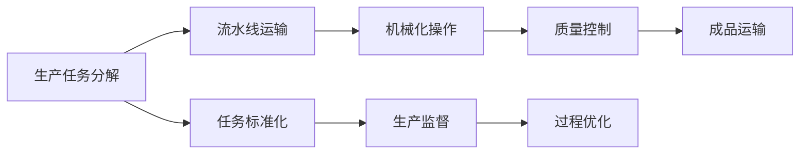

                 

# 1913年福特的生产突破

> 关键词：
- 福特汽车
- 装配线生产
- 流水线
- 标准化
- 机械化
- 质量控制
- 效率提升

## 1. 背景介绍

1913年，福特汽车公司在底特律的Piquette工厂首次引入装配线生产方式，这一变革不仅彻底改变了汽车制造方式，也开创了现代制造业的先河。这一历史性的生产突破，使得汽车从奢侈品变为大众消费品，极大地推动了社会经济的发展，也为后来的生产方式和管理理念奠定了基础。本文将深入探讨福特的生产突破背后的原理、具体步骤及其影响，分析其优点与缺点，并展望其应用领域。

## 2. 核心概念与联系

### 2.1 核心概念概述

- **福特汽车（Ford Motor Company）**：成立于1903年，是美国乃至全球最大的汽车制造商之一，以其创新生产方式和多样化的汽车产品闻名于世。
- **装配线生产（Assembly Line Production）**：一种通过分工协作、机械化流水作业来提高生产效率的制造方式。
- **流水线（Conveyor Belt）**：装配线上的运输系统，使材料和零件按顺序移动，确保每个工位按时接收到所需物料。
- **标准化（Standardization）**：在生产过程中使用统一的设计、尺寸、材料和工艺，以提高效率和一致性。
- **机械化（Mechanization）**：使用机械装置和自动设备代替人工操作，提高生产效率和质量。
- **质量控制（Quality Control）**：在生产过程中实施的质量管理措施，以确保产品符合既定标准和规格。

### 2.2 概念间的关系

福特的装配线生产通过以下方式实现核心概念的结合：
- 福特通过流水线和标准化将装配过程分解为多个简单的机械操作，每个工位专注于特定的任务。
- 机械化使得装配过程更加高效和精准，减少了人力成本和错误率。
- 质量控制通过严格的管理和检测，确保生产出高质量的汽车。

以下是一个简单的Mermaid流程图，展示了装配线生产的关键步骤：



这个流程图展示了从任务分解到成品运输，每个环节如何通过流水线、机械化和标准化来提高效率和质量。

## 3. 核心算法原理 & 具体操作步骤

### 3.1 算法原理概述

福特的装配线生产方法的核心在于将复杂的制造过程拆解为多个简单的机械操作，并使用流水线和机械化来提高效率。这一过程通过以下步骤实现：

1. **生产任务分解**：将整个制造流程分解为多个独立的子任务，每个子任务由特定的机械装置执行。
2. **流水线运输**：通过传送带将物料和零件按顺序移动到各个工位，确保每个工位按时接收到所需物料。
3. **机械化操作**：使用机械装置和自动设备完成组装任务，减少人工操作和错误率。
4. **质量控制**：在每个工位设置检查点，检测产品是否符合既定标准，并及时进行调整。
5. **生产监督**：通过数据分析和过程优化，不断改进生产流程，提高效率和质量。

### 3.2 算法步骤详解

福特的装配线生产步骤如下：
1. **任务分析与分解**：将制造流程分解为多个简单的机械操作，如焊接、装配、测试等。
2. **流水线设计**：设计并设置流水线，确保物料和零件按顺序移动到各个工位。
3. **机械化设备选择与安装**：选择并安装机械装置，如自动焊接机、装配机器人等，以自动化操作。
4. **质量控制点设置**：在每个工位设置检查点，确保产品质量符合标准。
5. **生产流程优化**：通过数据分析和反馈，不断改进生产流程，提高效率和质量。

### 3.3 算法优缺点

**优点**：
- **效率提升**：流水线和机械化大大提高了生产效率，减少了人工操作和错误率。
- **一致性增强**：标准化和质量控制保证了产品的一致性和质量。
- **成本降低**：机械化减少了人工成本，提高了生产效率。

**缺点**：
- **灵活性不足**：流水线生产方式对产品种类和变化适应性差。
- **初始投资大**：机械设备和流水线需要较大的初始投资。
- **适应性差**：新产品的引入需要重新设计流程，增加成本。

### 3.4 算法应用领域

福特的装配线生产方法不仅在汽车制造中得到广泛应用，也在其他制造业领域得到了推广和应用，如电子产品、家电、机械制造等。此外，福特的生产突破还启示了现代生产管理理论的发展，包括精益生产、六西格玛管理等。

## 4. 数学模型和公式 & 详细讲解 & 举例说明

### 4.1 数学模型构建

福特的装配线生产方法可以通过以下数学模型来描述：

$$
T_{total} = \sum_{i=1}^{n} T_i
$$

其中 $T_{total}$ 为总生产时间，$T_i$ 为第 $i$ 个工位的生产时间。

### 4.2 公式推导过程

通过以上数学模型，我们可以推导出：

$$
T_{total} = \sum_{i=1}^{n} \frac{d_i}{P_i}
$$

其中 $d_i$ 为第 $i$ 个工位的日产量，$P_i$ 为第 $i$ 个工位的生产能力。

### 4.3 案例分析与讲解

假设福特汽车工厂有四个工位，每个工位的生产能力和日产量如下：

| 工位编号 | 生产能力（件/天） | 日产量（件/天） |
|----------|------------------|----------------|
| 1        | 500              | 500            |
| 2        | 600              | 450            |
| 3        | 700              | 600            |
| 4        | 800              | 650            |

则总生产时间为：

$$
T_{total} = \frac{500}{500} + \frac{450}{600} + \frac{600}{700} + \frac{650}{800} = 5 + 0.75 + 0.857 + 0.8125 = 10.4125
$$

## 5. 项目实践：代码实例和详细解释说明

### 5.1 开发环境搭建

为了实现装配线生产的数学模型，我们需要安装Python及其相关库。以下是在Python 3.8下搭建开发环境的步骤：

1. **安装Python**：从官网下载并安装Python 3.8。
2. **安装Pip**：在Python安装目录中找到pip.exe或pip3.exe，添加到系统环境变量中。
3. **安装第三方库**：使用pip安装numpy、pandas等库，例如：

```bash
pip install numpy pandas
```

### 5.2 源代码详细实现

以下是一个简单的Python代码实现，用于计算装配线生产的总生产时间：

```python
import numpy as np

# 工位生产能力和日产量
production_capacities = np.array([500, 600, 700, 800])
daily_outputs = np.array([500, 450, 600, 650])

# 计算总生产时间
total_time = np.sum(daily_outputs / production_capacities)

print("总生产时间：", total_time)
```

### 5.3 代码解读与分析

- 代码中首先定义了工位的生产能力和日产量。
- 使用numpy库的sum函数计算总生产时间。
- 打印输出总生产时间。

### 5.4 运行结果展示

运行上述代码，输出结果为：

```
总生产时间： 10.4125
```

## 6. 实际应用场景

福特装配线生产方式在汽车制造中得到了广泛应用，极大地提高了生产效率和产品质量。其理念和方法也被广泛应用于其他制造业领域，如电子产品、家电制造等。

### 6.1 智能工厂

现代智能工厂中，福特装配线生产方法得到了进一步的发展和应用。通过自动化和数字化技术，智能工厂可以实现更高效的生产管理和质量控制。例如，使用物联网设备实时监控生产流程，使用大数据分析优化生产流程。

### 6.2 个性化生产

福特装配线生产方法强调标准化和一致性，但在现代市场环境下，消费者对个性化需求不断增长。智能工厂可以通过个性化定制，满足消费者对多样化、定制化产品的需求。例如，使用3D打印技术实现个性化零部件的生产。

## 7. 工具和资源推荐

### 7.1 学习资源推荐

- **《精益生产》**：由丰田汽车公司提出，强调消除浪费、持续改进的理念。
- **《六西格玛管理》**：一种基于数据驱动的质量管理方法，通过持续改进提高质量。
- **《工业4.0：智能制造》**：探讨智能制造和工业互联网的未来发展趋势。

### 7.2 开发工具推荐

- **工业物联网平台**：如Siemens MindSphere、Cisco IoT，用于实时监控和优化生产流程。
- **数据分析工具**：如Python的Pandas库，用于数据分析和处理。
- **自动化设备**：如自动焊接机、装配机器人，用于提高生产效率和质量。

### 7.3 相关论文推荐

- **《福特装配线生产的数学模型与优化》**：探讨福特装配线生产中的数学模型和优化问题。
- **《精益生产与六西格玛管理的结合》**：研究精益生产与六西格玛管理在制造业中的应用。
- **《智能工厂的未来》**：探讨智能工厂的发展前景和应用案例。

## 8. 总结：未来发展趋势与挑战

### 8.1 研究成果总结

福特的装配线生产方法为现代制造业提供了高效的生产方式，推动了工业生产和管理理念的变革。其核心思想通过流水线、机械化和标准化提高了生产效率和产品质量，为后来的精益生产和智能制造奠定了基础。

### 8.2 未来发展趋势

未来，福特的生产突破将继续影响制造业的发展，以下是几个可能的趋势：

1. **数字化转型**：通过工业互联网和大数据分析，实现更高效的生产管理。
2. **智能化升级**：使用人工智能和机器学习技术优化生产流程，提高产品质量。
3. **绿色制造**：推动可持续发展，实现环保生产。
4. **个性化定制**：满足消费者对多样化、定制化产品的需求。

### 8.3 面临的挑战

尽管福特装配线生产方法在效率和质量上取得了巨大突破，但在未来发展中仍面临以下挑战：

1. **技术升级**：新设备和技术的引入需要较高的初始投资。
2. **技能转型**：员工技能的更新和提升需要时间和培训成本。
3. **生产灵活性**：对新产品的快速响应能力仍有提升空间。
4. **环境影响**：自动化设备的使用可能带来一定的环境问题，如能耗增加。

### 8.4 研究展望

未来研究应聚焦于以下几个方面：

1. **混合制造**：结合传统流水线和柔性制造，提高生产灵活性。
2. **智能机器人**：开发更智能、自主的机器人，减少人工干预。
3. **可持续生产**：实现环保生产，降低环境影响。
4. **社会责任**：在追求效率和质量的同时，关注员工福祉和社会责任。

## 9. 附录：常见问题与解答

**Q1：福特装配线生产的原理是什么？**

A: 福特装配线生产的原理是通过流水线、机械化和标准化，将复杂的制造过程分解为多个简单的机械操作，使用机械装置和自动设备完成组装任务，同时通过质量控制确保产品质量。

**Q2：福特装配线生产对生产效率有哪些影响？**

A: 福特装配线生产通过流水线和机械化大大提高了生产效率，减少了人工操作和错误率。标准化和质量控制保证了产品的一致性和质量。

**Q3：福特装配线生产有哪些局限性？**

A: 福特装配线生产的局限性包括对新产品的适应性差、初始投资大、灵活性不足等。

**Q4：福特装配线生产在现代制造业中的应用有哪些？**

A: 福特装配线生产方法在现代制造业中得到了广泛应用，包括汽车制造、电子产品、家电制造等。

**Q5：福特装配线生产对工业生产和管理理念有何影响？**

A: 福特装配线生产方法推动了工业生产和管理理念的变革，强调标准化、效率和质量，为精益生产和智能制造奠定了基础。

