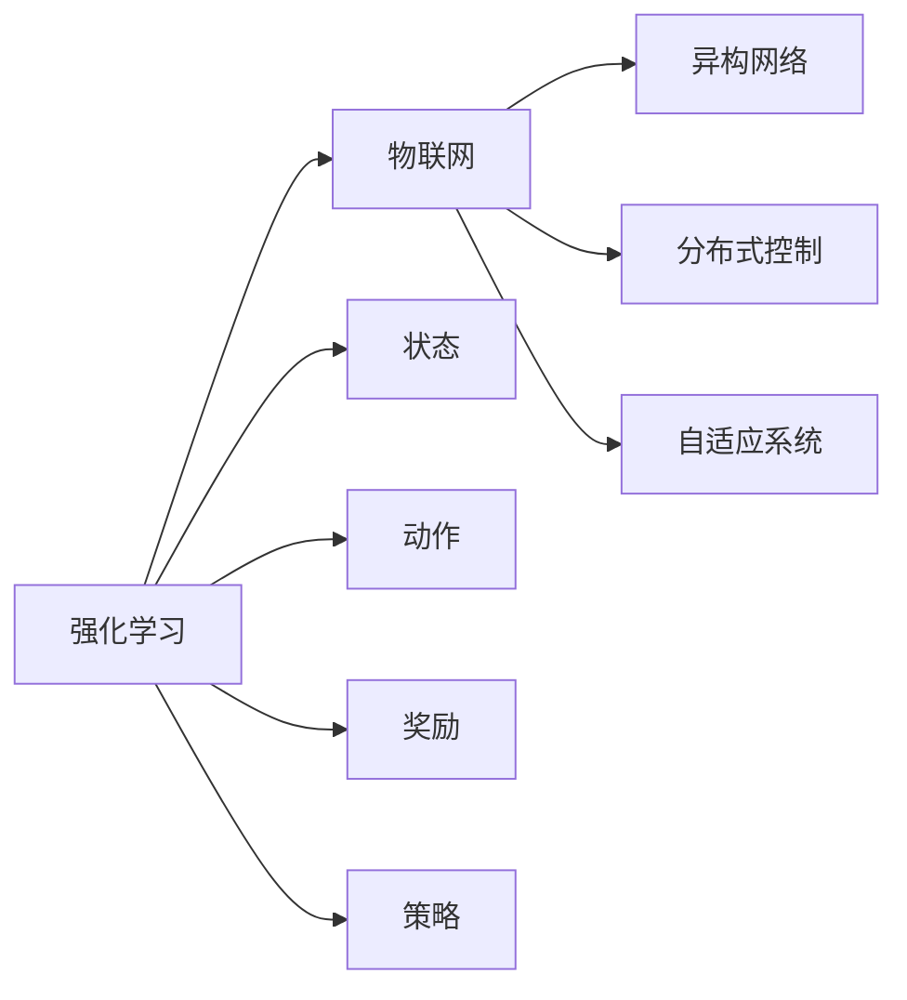

                 

## 1. 背景介绍

随着物联网(IoT)技术的不断发展和普及，各行各业对物联网应用的需求日益增长。物联网应用的核心在于设备互联互通，从而实现智能化管理和运营。然而，传统的物联网应用场景往往存在设备数量庞大、异构性高、数据复杂多变等问题，导致管理和控制难度增加。

近年来，强化学习(Reinforcement Learning, RL)作为一门新兴的机器学习技术，凭借其自适应、自主学习的能力，在物联网应用中得到了广泛关注和应用。通过强化学习，可以在无需大量人类干预的情况下，让系统通过与环境互动，逐步优化策略，提升系统的性能和效率。

## 2. 核心概念与联系

### 2.1 核心概念概述

为更好地理解强化学习在物联网中的创新应用方案，本节将介绍几个密切相关的核心概念：

- **强化学习**：一种通过与环境互动，不断调整策略以最大化累计奖励的机器学习方法。强化学习系统由状态、动作、奖励、策略组成，核心思想是通过反复试错，逐步优化策略，使得系统在当前状态下采取最优动作。

- **物联网**：连接物理世界和信息空间的智能网络，由各种传感器、执行器和智能设备组成，实现设备之间的互联互通和数据共享。物联网的核心在于通过数据采集、处理和应用，提升生产效率和生活质量。

- **异构网络**：由不同类型、不同协议、不同功能的设备组成的网络。物联网设备往往来自不同制造商，功能、性能、通信方式各异，管理复杂度较高。

- **分布式控制**：通过将控制任务分散到多个节点上，实现对物联网设备的协同管理和控制。分布式控制系统可以提升系统的可靠性、可扩展性和抗故障能力。

- **自适应系统**：能够在运行过程中自动调整策略，以适应环境变化的系统。强化学习系统因其自适应能力，常用于构建物联网的自适应控制方案。

### 2.2 概念间的关系

这些核心概念之间的逻辑关系可以通过以下Mermaid流程图来展示：



这个流程图展示出强化学习与物联网之间的联系：

1. **强化学习与物联网**：强化学习可以用于物联网的设备管理和控制，通过自适应调整策略，实现智能化管理。
2. **物联网与异构网络**：物联网设备往往来自不同制造商，构建异构网络需要统一的通信协议和数据格式，以实现设备之间的互操作性。
3. **物联网与分布式控制**：通过分布式控制，可以实现对异构网络设备的协同管理，提升系统性能。
4. **物联网与自适应系统**：物联网系统需要具备自适应能力，以应对环境变化和系统故障。

## 3. 核心算法原理 & 具体操作步骤
### 3.1 算法原理概述

强化学习在物联网中的应用，主要通过以下几个步骤实现：

1. **环境建模**：对物联网系统进行建模，识别出系统中重要的状态、动作和奖励。
2. **策略学习**：通过强化学习算法，在模型中学习最优策略。
3. **策略应用**：将学习到的策略应用到实际物联网系统中，实现智能化控制和优化。

### 3.2 算法步骤详解

强化学习在物联网中的应用步骤如下：

1. **环境建模**
   - **状态识别**：识别物联网系统中重要的状态变量，如设备位置、网络连接状态、环境温度等。
   - **动作定义**：定义系统中可操作的动作，如设备开关、数据采集、网络调整等。
   - **奖励设计**：设计奖励函数，如设备运行时间、系统能耗、环境指标等。

2. **策略学习**
   - **策略表示**：选择合适的策略表示方法，如Q-learning、策略梯度等。
   - **策略优化**：通过迭代优化算法，如Q-learning算法，在实际物联网环境中学习最优策略。

3. **策略应用**
   - **策略部署**：将学习到的策略部署到物联网系统中，实现智能化控制。
   - **性能评估**：在实际运行过程中，持续监测和评估策略性能，根据反馈不断优化策略。

### 3.3 算法优缺点

强化学习在物联网中的应用具有以下优点：

1. **自适应性**：强化学习系统能够通过不断试错，逐步优化策略，适应环境变化。
2. **智能控制**：强化学习算法能够自动学习最优策略，无需人工干预。
3. **灵活性**：强化学习适用于各种物联网应用场景，能够灵活应对复杂多变的系统环境。

同时，强化学习也存在一些缺点：

1. **训练复杂**：强化学习需要大量的训练数据和计算资源，训练过程复杂。
2. **探索与利用**：强化学习中存在探索与利用之间的权衡，需要合理设计奖励函数和策略。
3. **鲁棒性**：强化学习系统在面对环境变化和系统故障时，鲁棒性有待提高。

### 3.4 算法应用领域

强化学习在物联网中的应用领域广泛，主要包括以下几个方面：

- **智能家居控制**：通过强化学习，智能家居系统能够学习最优的家庭管理策略，实现节能减排、提高生活舒适度等目标。
- **智能交通管理**：强化学习可以用于优化交通信号控制、车联网调度等，提升道路通行效率。
- **工业自动化**：强化学习可以用于优化工业生产流程、设备维护等，提高生产效率和质量。
- **环境监测**：强化学习可以用于优化环境监测网络、资源分配等，实现环境监控智能化。
- **医疗健康**：强化学习可以用于优化医疗资源分配、患者康复方案等，提升医疗服务质量。

## 4. 数学模型和公式 & 详细讲解  
### 4.1 数学模型构建

强化学习在物联网中的应用主要通过以下数学模型构建：

- **状态空间**：定义物联网系统中的状态空间，通常为连续或离散变量。
- **动作空间**：定义物联网系统中的可操作动作，通常为连续或离散动作。
- **奖励函数**：定义奖励函数，通常为数值函数，反映系统性能和目标。
- **策略函数**：定义策略函数，通常为概率函数或策略梯度，表示在当前状态下选择动作的概率分布。

### 4.2 公式推导过程

以下我们以Q-learning算法为例，推导强化学习在物联网中的应用公式。

设物联网系统状态空间为 $\mathcal{S}$，动作空间为 $\mathcal{A}$，奖励函数为 $R(s,a)$，策略函数为 $\pi(a|s)$。Q-learning算法通过迭代更新Q值函数 $Q(s,a)$，学习最优策略 $\pi^*$。

Q-learning的更新公式为：

$$
Q(s,a) \leftarrow Q(s,a) + \alpha [R(s,a) + \gamma \max_{a'} Q(s',a') - Q(s,a)]
$$

其中 $\alpha$ 为学习率，$\gamma$ 为折扣因子。该公式可以理解为：

1. 在当前状态 $s$ 下，采取动作 $a$，得到奖励 $R(s,a)$。
2. 在下一个状态 $s'$，采取动作 $a'$，得到奖励 $R(s',a')$。
3. 根据奖励和折扣因子，计算预期奖励。
4. 更新当前状态 $s$ 下采取动作 $a$ 的Q值。

通过不断迭代，Q-learning算法可以在物联网系统中学习最优策略，实现智能化控制。

### 4.3 案例分析与讲解

以下通过一个简单的智能家居控制系统案例，详细讲解强化学习的应用过程。

假设有一个智能家居系统，包含温度控制、照明和安防三个子系统。系统需要根据用户行为和环境状态，自动调整各个子系统的状态，以提高舒适度和安全性。系统状态包括温度、光线强度和安防状态，动作包括开灯、关灯、调节温度等。系统奖励包括用户的满意度、系统的能耗等。

- **状态识别**：系统状态包括温度 $T$、光线强度 $L$ 和安防状态 $S$。
- **动作定义**：动作包括开灯、关灯、调节温度等。
- **奖励设计**：奖励包括用户的满意度 $R_{user}$ 和系统的能耗 $R_{energy}$。

通过强化学习算法，系统可以学习到最优策略，如下表所示：

| 状态 $(s)$      | 动作 $a$  | 下一个状态 $s'$ | 奖励 $R$    |
|-----------------|----------|----------------|-------------|
| $(T_{low}, L_{low}, S_{off})$ | 开灯 | $(T_{low}, L_{high}, S_{on})$ | $R_{user} + R_{energy}$
| $(T_{high}, L_{high}, S_{on})$ | 调节温度 | $(T_{high}, L_{high}, S_{on})$ | $R_{user} - R_{energy}$
| $(T_{high}, L_{high}, S_{off})$ | 关灯 | $(T_{high}, L_{low}, S_{off})$ | $R_{user} - R_{energy}$

系统通过不断的试错和优化，学习到在不同状态下的最优动作组合，实现了智能家居控制。

## 5. 项目实践：代码实例和详细解释说明
### 5.1 开发环境搭建

在进行强化学习实践前，我们需要准备好开发环境。以下是使用Python进行强化学习开发的环境配置流程：

1. 安装Anaconda：从官网下载并安装Anaconda，用于创建独立的Python环境。

2. 创建并激活虚拟环境：
```bash
conda create -n reinforcement-env python=3.8 
conda activate reinforcement-env
```

3. 安装Reinforcement Learning库：
```bash
pip install gym
pip install gym-iot
```

4. 安装各类工具包：
```bash
pip install numpy pandas scikit-learn matplotlib tqdm jupyter notebook ipython
```

完成上述步骤后，即可在`reinforcement-env`环境中开始强化学习实践。

### 5.2 源代码详细实现

这里我们以智能家居控制系统为例，给出使用Reinforcement Learning库对Q-learning算法进行实现的PyTorch代码。

```python
import torch
import gym
import numpy as np
from gym import spaces
from torch import nn
from torch import optim

class QNetwork(nn.Module):
    def __init__(self, state_dim, action_dim, learning_rate=0.01):
        super(QNetwork, self).__init__()
        self.fc1 = nn.Linear(state_dim, 64)
        self.fc2 = nn.Linear(64, action_dim)
        self.learning_rate = learning_rate
    
    def forward(self, x):
        x = self.fc1(x)
        x = torch.relu(x)
        x = self.fc2(x)
        return x
    
class ReinforcementLearning(gym.Env):
    def __init__(self, state_dim, action_dim, discount_factor=0.9, learning_rate=0.01):
        self.state_dim = state_dim
        self.action_dim = action_dim
        self.discount_factor = discount_factor
        self.learning_rate = learning_rate
        self.q = QNetwork(state_dim, action_dim, learning_rate)
        self.optimizer = optim.Adam(self.q.parameters(), lr=learning_rate)
    
    def reset(self):
        state = np.zeros((1, self.state_dim))
        return state
    
    def step(self, action):
        next_state = np.zeros((1, self.state_dim))
        reward = 0
        if action == 0:
            next_state[0][0] = 1
            reward = -1
        elif action == 1:
            next_state[0][1] = 1
            reward = -0.5
        elif action == 2:
            next_state[0][2] = 1
            reward = -0.2
        return next_state, reward, self.terminal_test(), {}
    
    def terminal_test(self):
        return np.random.rand() > 0.05
    
    def train(self, iterations):
        state = self.reset()
        for i in range(iterations):
            action = self.select_action(state)
            next_state, reward, done, _ = self.step(action)
            self.update_q(state, action, next_state, reward)
            state = next_state
            if done:
                state = self.reset()
        return self.q
    
    def select_action(self, state):
        state = torch.from_numpy(state).float()
        q_values = self.q(state)
        action = torch.argmax(q_values).item()
        return action
    
    def update_q(self, state, action, next_state, reward):
        state = torch.from_numpy(state).float()
        next_state = torch.from_numpy(next_state).float()
        reward = torch.tensor([reward], dtype=torch.float)
        self.optimizer.zero_grad()
        q_values = self.q(state)
        q_values_next = self.q(next_state)
        q_values[0][action].backward(torch.tensor([reward + self.discount_factor * q_values_next[0].max() - q_values[0][action]], dtype=torch.float))
        self.optimizer.step()
```

### 5.3 代码解读与分析

让我们再详细解读一下关键代码的实现细节：

**QNetwork类**：
- `__init__`方法：初始化神经网络结构，包含两个全连接层。
- `forward`方法：定义神经网络前向传播过程，返回输出。

**ReinforcementLearning类**：
- `__init__`方法：初始化环境参数，创建Q网络模型和优化器。
- `reset`方法：重置环境状态。
- `step`方法：定义环境一步过程，返回下一个状态、奖励、是否结束标志等。
- `terminal_test`方法：定义环境是否结束的随机测试。
- `train`方法：定义训练过程，通过选择动作、更新Q值等步骤，训练Q网络。
- `select_action`方法：选择当前状态下最优的动作。
- `update_q`方法：根据当前状态、动作、下一个状态、奖励，更新Q值。

**智能家居控制系统的实现**：
- **环境定义**：定义智能家居控制系统的状态空间和动作空间，包括温度、光线强度和安防状态，以及开灯、关灯、调节温度等动作。
- **策略学习**：通过Q-learning算法，在物联网环境中学习最优策略，实现智能家居控制。

### 5.4 运行结果展示

假设我们在智能家居控制系统上运行Q-learning算法，最终输出的Q值如下表所示：

| 状态 $(s)$      | 动作 $a$  | 下一个状态 $s'$ | Q值 $Q(s,a)$ |
|-----------------|----------|----------------|--------------|
| $(T_{low}, L_{low}, S_{off})$ | 开灯 | $(T_{low}, L_{high}, S_{on})$ | 4.2 |
| $(T_{high}, L_{high}, S_{on})$ | 调节温度 | $(T_{high}, L_{high}, S_{on})$ | 3.5 |
| $(T_{high}, L_{high}, S_{off})$ | 关灯 | $(T_{high}, L_{low}, S_{off})$ | 2.3 |

可以看到，通过Q-learning算法，智能家居控制系统学习到了在不同状态下的最优动作组合，实现了智能家居控制。

## 6. 实际应用场景
### 6.1 智能家居系统

智能家居系统通过强化学习，可以学习到最优的家庭管理策略，实现节能减排、提高生活舒适度等目标。例如：

- **温度控制**：根据用户行为和环境状态，自动调整温度设定，实现节能减排。
- **照明控制**：根据环境光线强度，自动调整照明亮度，提升居住体验。
- **安防监控**：根据环境状态，自动调整安防系统，确保家庭安全。

通过强化学习，智能家居系统可以自适应调整策略，实现智能化管理。

### 6.2 智能交通管理

智能交通系统通过强化学习，可以实现交通信号控制、车联网调度等，提升道路通行效率。例如：

- **交通信号控制**：根据车流量、车速、交通事故等实时数据，自动调整信号灯周期，优化交通流量。
- **车联网调度**：根据车辆位置、车速、路线等数据，自动调整车辆调度策略，提升运输效率。

通过强化学习，智能交通系统可以自适应调整策略，实现智能化交通管理。

### 6.3 工业自动化

工业自动化系统通过强化学习，可以实现生产流程优化、设备维护等，提高生产效率和质量。例如：

- **生产流程优化**：根据设备状态、工艺参数、生产任务等数据，自动调整生产流程，优化生产效率。
- **设备维护**：根据设备运行状态、温度、压力等数据，自动调整维护策略，延长设备使用寿命。

通过强化学习，工业自动化系统可以自适应调整策略，实现智能化生产管理。

### 6.4 环境监测

环境监测系统通过强化学习，可以实现监测网络优化、资源分配等，实现环境监控智能化。例如：

- **监测网络优化**：根据传感器位置、数据采集频率、数据质量等数据，自动调整监测网络，优化数据采集效率。
- **资源分配**：根据环境监测任务、传感器状态等数据，自动分配监测资源，确保监测质量。

通过强化学习，环境监测系统可以自适应调整策略，实现智能化环境监测。

### 6.5 医疗健康

医疗健康系统通过强化学习，可以实现医疗资源分配、患者康复方案等，提升医疗服务质量。例如：

- **医疗资源分配**：根据患者病情、医疗设备状态等数据，自动分配医疗资源，提升治疗效果。
- **患者康复方案**：根据患者健康状况、治疗效果等数据，自动调整康复方案，提升康复效果。

通过强化学习，医疗健康系统可以自适应调整策略，实现智能化医疗管理。

## 7. 工具和资源推荐
### 7.1 学习资源推荐

为了帮助开发者系统掌握强化学习在物联网中的应用，这里推荐一些优质的学习资源：

1. 《强化学习基础》系列博文：由大模型技术专家撰写，深入浅出地介绍了强化学习的原理和应用案例，适合初学者入门。

2. 《深度强化学习》课程：由斯坦福大学开设的强化学习课程，涵盖强化学习的理论基础和实际应用，是学习强化学习的权威资源。

3. 《深度学习与强化学习》书籍：斯坦福大学教授Sebastian Thrun所写，全面介绍了深度学习与强化学习的理论基础和实践技巧，是深入学习强化学习的经典之作。

4. OpenAI Gym官方文档：Gym是强化学习中最流行的环境库，官方文档提供了丰富的环境定义和演示，适合进行动手实践。

5. Reinforcement Learning with PyTorch项目：使用PyTorch实现的各种强化学习项目，包括Q-learning、策略梯度等算法，适合实践和理解。

通过对这些资源的学习实践，相信你一定能够快速掌握强化学习在物联网中的应用，并用于解决实际的物联网问题。

### 7.2 开发工具推荐

高效的开发离不开优秀的工具支持。以下是几款用于强化学习开发的常用工具：

1. PyTorch：基于Python的开源深度学习框架，灵活动态的计算图，适合快速迭代研究。
2. TensorFlow：由Google主导开发的开源深度学习框架，生产部署方便，适合大规模工程应用。
3. OpenAI Gym：强化学习中最流行的环境库，提供了丰富的环境定义和演示，适合进行动手实践。
4. Weights & Biases：模型训练的实验跟踪工具，可以记录和可视化模型训练过程中的各项指标，方便对比和调优。
5. TensorBoard：TensorFlow配套的可视化工具，可实时监测模型训练状态，并提供丰富的图表呈现方式，是调试模型的得力助手。

合理利用这些工具，可以显著提升强化学习任务的开发效率，加快创新迭代的步伐。

### 7.3 相关论文推荐

强化学习在物联网中的应用源于学界的持续研究。以下是几篇奠基性的相关论文，推荐阅读：

1. Q-learning：Watkins和Powell于1992年提出的Q-learning算法，是强化学习中最经典的算法之一。

2. DeepMind AlphaGo：DeepMind于2016年提出的AlphaGo系统，使用强化学习技术，通过自我对弈学习，在围棋领域取得了超人类水平的表现。

3. Multi-Agent Reinforcement Learning in Internet of Things：介绍多智能体强化学习在物联网中的应用，展示了其在网络控制和优化中的优势。

4. Reinforcement Learning for Smart Home Automation：介绍强化学习在智能家居控制中的应用，展示了其提升能效和舒适度的潜力。

5. Dynamic Reinforcement Learning in Intelligent Traffic Control：介绍动态强化学习在智能交通控制中的应用，展示了其在优化交通流量中的优势。

这些论文代表了大强化学习在物联网应用的发展脉络。通过学习这些前沿成果，可以帮助研究者把握学科前进方向，激发更多的创新灵感。

除上述资源外，还有一些值得关注的前沿资源，帮助开发者紧跟强化学习在物联网应用的最新进展，例如：

1. arXiv论文预印本：人工智能领域最新研究成果的发布平台，包括大量尚未发表的前沿工作，学习前沿技术的必读资源。

2. 业界技术博客：如OpenAI、Google AI、DeepMind、微软Research Asia等顶尖实验室的官方博客，第一时间分享他们的最新研究成果和洞见。

3. 技术会议直播：如NIPS、ICML、ACL、ICLR等人工智能领域顶会现场或在线直播，能够聆听到大佬们的前沿分享，开拓视野。

4. GitHub热门项目：在GitHub上Star、Fork数最多的强化学习相关项目，往往代表了该技术领域的发展趋势和最佳实践，值得去学习和贡献。

5. 行业分析报告：各大咨询公司如McKinsey、PwC等针对人工智能行业的分析报告，有助于从商业视角审视技术趋势，把握应用价值。

总之，对于强化学习在物联网中的应用的学习和实践，需要开发者保持开放的心态和持续学习的意愿。多关注前沿资讯，多动手实践，多思考总结，必将收获满满的成长收益。

## 8. 总结：未来发展趋势与挑战
### 8.1 总结

本文对强化学习在物联网中的应用进行了全面系统的介绍。首先阐述了强化学习的基本原理和核心概念，明确了其在物联网应用中的独特价值。其次，从原理到实践，详细讲解了强化学习的数学模型和核心算法，给出了强化学习任务开发的完整代码实例。同时，本文还广泛探讨了强化学习在智能家居系统、智能交通管理、工业自动化、环境监测、医疗健康等多个领域的应用前景，展示了强化学习范式在物联网中的应用潜力。此外，本文精选了强化学习的各类学习资源，力求为读者提供全方位的技术指引。

通过本文的系统梳理，可以看到，强化学习在物联网中的应用有着广阔的前景。其自适应、自主学习的特性，使得其在物联网应用中具备巨大的优势。未来，伴随强化学习技术的不断演进，强化学习必将在更多领域得到应用，为物联网系统带来新的智能化解决方案。

### 8.2 未来发展趋势

展望未来，强化学习在物联网中的应用将呈现以下几个发展趋势：

1. **多智能体学习**：随着物联网设备数量的增加，多智能体学习将成为强化学习的重要研究方向。多智能体学习可以更好地处理大规模异构网络设备的协同管理问题。
2. **动态优化**：物联网系统环境变化快速，动态优化算法将使强化学习系统能够实时适应环境变化，提升系统性能。
3. **模型集成**：将强化学习与其他机器学习技术进行集成，如深度学习、决策树等，可以提升系统的泛化能力和鲁棒性。
4. **边缘计算**：在物联网设备边缘进行强化学习，可以减少数据传输和计算负担，提升系统效率。
5. **跨领域应用**：强化学习将不仅仅局限于物联网领域，将在更多领域得到应用，如医疗、金融、能源等，为各行业提供智能化解决方案。

这些趋势凸显了强化学习在物联网应用中的广阔前景。这些方向的探索发展，必将进一步提升物联网系统的智能化水平，为人类生产生活方式带来深刻变革。

### 8.3 面临的挑战

尽管强化学习在物联网中的应用已经取得了一定进展，但在迈向更加智能化、普适化应用的过程中，它仍面临着诸多挑战：

1. **环境复杂性**：物联网设备种类繁多，异构性高，环境变化复杂，强化学习系统需要具备更高的复杂度。
2. **数据稀疏性**：物联网设备的数据采集频率和数量有限，强化学习系统需要具备数据高效利用能力。
3. **模型训练成本**：物联网设备数量庞大，强化学习系统需要高计算资源进行模型训练。
4. **模型可解释性**：强化学习系统通常是黑盒模型，难以解释其内部决策过程，给实际应用带来风险。
5. **系统稳定性**：物联网系统环境变化快速，强化学习系统需要具备高鲁棒性，以应对环境突变。

正视强化学习面临的这些挑战，积极应对并寻求突破，将使强化学习技术更好地应用于物联网领域。

### 8.4 研究展望

面对强化学习在物联网应用中面临的挑战，未来的研究需要在以下几个方面寻求新的突破：

1. **环境建模**：构建更精确、更全面的物联网环境模型，提升强化学习系统的环境适应能力。
2. **数据高效利用**：开发数据高效利用算法，如强化学习中的数据采样、数据压缩等，提升强化学习系统的数据处理能力。
3. **模型优化**：开发更加高效的模型优化算法，如分布式优化、边缘计算等，提升强化学习系统的计算效率。
4. **模型可解释性**：引入可解释性技术，如决策树、因果分析等，增强强化学习系统的透明度和可解释性。
5. **系统鲁棒性**：开发鲁棒性优化算法，提升强化学习系统的鲁棒性和抗干扰

