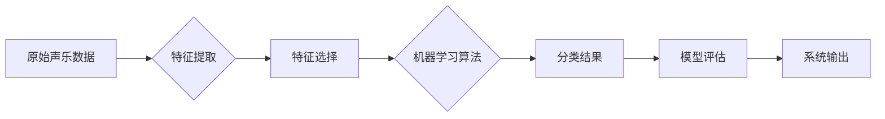

> 数据挖掘, 声乐信息, 分类评测, 大数据, 机器学习, 音频处理, 特征工程, 深度学习, 模型评估

# 基于大数据的声乐信息分类评测系统

随着音乐产业的快速发展，声乐信息的分类与评测变得越来越重要。从音乐推荐系统到音乐教育，再到音乐版权保护，精准的声乐信息分类能够提供更个性化的服务，提升用户体验，保护创作者权益。本文将探讨如何构建一个基于大数据的声乐信息分类评测系统，通过机器学习技术实现声乐信息的自动分类与评估。

## 1. 背景介绍

### 1.1 问题的由来

声乐信息的分类与评测是音乐产业中的一个基础环节。传统的声乐信息分类方法主要依赖于人工审核，效率低、成本高，且容易受到主观因素的影响。随着大数据和人工智能技术的快速发展，利用机器学习进行声乐信息分类与评测成为可能。

### 1.2 研究现状

目前，基于大数据的声乐信息分类评测系统主要分为以下几个方向：

1. **特征提取**：通过音频信号处理技术，从音频信号中提取出有助于分类的特征。
2. **机器学习算法**：利用机器学习算法对提取的特征进行分类。
3. **模型评估**：对分类模型进行评估，以确保其准确性和可靠性。

### 1.3 研究意义

研究基于大数据的声乐信息分类评测系统，具有以下意义：

1. 提高声乐信息分类的效率和准确性。
2. 降低人工审核成本，解放人力资源。
3. 为音乐推荐、音乐教育、音乐版权保护等应用提供技术支持。

### 1.4 本文结构

本文将按照以下结构进行论述：

- **2. 核心概念与联系**：介绍声乐信息分类评测系统中的核心概念和它们之间的关系。
- **3. 核心算法原理 & 具体操作步骤**：阐述声乐信息分类评测系统中的核心算法原理和操作步骤。
- **4. 数学模型和公式 & 详细讲解 & 举例说明**：介绍声乐信息分类评测系统中的数学模型和公式，并进行举例说明。
- **5. 项目实践：代码实例和详细解释说明**：给出一个基于Python的声乐信息分类评测系统的代码实例，并进行详细解释说明。
- **6. 实际应用场景**：探讨声乐信息分类评测系统的实际应用场景。
- **7. 工具和资源推荐**：推荐学习资源、开发工具和相关论文。
- **8. 总结：未来发展趋势与挑战**：总结声乐信息分类评测系统的研究成果，展望未来发展趋势，并分析面临的挑战。
- **9. 附录：常见问题与解答**：解答一些常见问题。

## 2. 核心概念与联系

### 2.1 声乐信息分类

声乐信息分类是指将声乐信息按照特定的标准进行分类，如歌曲类型、歌手、语言等。声乐信息分类评测系统需要能够识别和分类各种类型的声乐信息。

### 2.2 特征工程

特征工程是指从原始数据中提取出有助于分类的特征。在声乐信息分类评测系统中，特征工程是至关重要的步骤。

### 2.3 机器学习算法

机器学习算法是指用于从数据中学习规律和模式的技术。在声乐信息分类评测系统中，机器学习算法用于对提取的特征进行分类。

### 2.4 模型评估

模型评估是指对分类模型进行评估，以确保其准确性和可靠性。在声乐信息分类评测系统中，模型评估是确保系统性能的重要环节。

下面是声乐信息分类评测系统中的核心概念原理和架构的 Mermaid 流程图：



## 3. 核心算法原理 & 具体操作步骤

### 3.1 算法原理概述

基于大数据的声乐信息分类评测系统主要包括以下步骤：

1. 特征提取：从原始音频信号中提取出有助于分类的特征，如频谱特征、时域特征、梅尔频率倒谱系数（MFCC）等。
2. 特征选择：从提取的特征中选择对分类最有用的特征，以减少计算量和提高分类性能。
3. 机器学习算法：选择合适的机器学习算法对提取的特征进行分类，如支持向量机（SVM）、随机森林（Random Forest）等。
4. 模型评估：使用交叉验证等方法评估模型的性能，如准确率、召回率、F1值等。
5. 系统输出：将分类结果输出给用户或应用于其他系统。

### 3.2 算法步骤详解

#### 3.2.1 特征提取

特征提取是声乐信息分类评测系统的第一步。常见的特征提取方法包括：

- **频谱特征**：如能量、频率、频谱熵等。
- **时域特征**：如过零率、能量均值等。
- **MFCC**：梅尔频率倒谱系数，是一种常用的音频特征。

#### 3.2.2 特征选择

特征选择是通过对特征进行统计分析和相关性分析，选择对分类最有用的特征。常见的特征选择方法包括：

- **卡方检验**：用于检验特征与标签之间的相关性。
- **互信息**：用于衡量特征与标签之间的信息量。

#### 3.2.3 机器学习算法

选择合适的机器学习算法对提取的特征进行分类。常见的机器学习算法包括：

- **支持向量机（SVM）**：通过找到最佳的超平面来实现分类。
- **随机森林（Random Forest）**：通过集成学习来实现分类。
- **梯度提升决策树（GBDT）**：通过构建多棵决策树来实现分类。

#### 3.2.4 模型评估

使用交叉验证等方法评估模型的性能。常见的模型评估指标包括：

- **准确率（Accuracy）**：正确分类的样本数占总样本数的比例。
- **召回率（Recall）**：正确分类的样本数占实际正样本数的比例。
- **F1值（F1 Score）**：准确率和召回率的调和平均数。

### 3.3 算法优缺点

#### 3.3.1 特征提取

优点：

- 特征提取能够提取出音频信号中的有用信息，有助于提高分类性能。

缺点：

- 特征提取需要大量的计算资源。

#### 3.3.2 特征选择

优点：

- 特征选择能够减少计算量，提高分类性能。

缺点：

- 特征选择需要一定的专业知识。

#### 3.3.3 机器学习算法

优点：

- 机器学习算法能够自动从数据中学习规律和模式。

缺点：

- 机器学习算法可能存在过拟合的风险。

#### 3.3.4 模型评估

优点：

- 模型评估能够评估模型的性能，确保其准确性和可靠性。

缺点：

- 模型评估需要大量的计算资源。

### 3.4 算法应用领域

基于大数据的声乐信息分类评测系统可以应用于以下领域：

- 音乐推荐系统
- 音乐教育
- 音乐版权保护
- 音乐内容审核

## 4. 数学模型和公式 & 详细讲解 & 举例说明

### 4.1 数学模型构建

在声乐信息分类评测系统中，常用的数学模型包括：

- **SVM**：支持向量机是一种监督学习算法，其目标是找到一个超平面，将数据集分成两个类别。

  $$
  f(x) = \text{sign}(\sum_{i=1}^n w_i x_i + b)
  $$

- **Random Forest**：随机森林是一种集成学习算法，由多棵决策树组成。

  $$
  \hat{y} = \text{mode}(\{f_1(x), f_2(x), ..., f_n(x)\})
  $$

### 4.2 公式推导过程

以SVM为例，其推导过程如下：

1. 定义特征空间和标签空间。
2. 选择合适的核函数。
3. 求解最大间隔超平面。
4. 计算支持向量。

### 4.3 案例分析与讲解

以一首流行歌曲的分类为例，假设我们使用SVM对歌曲进行分类。

1. 首先，将歌曲的音频信号进行特征提取，得到特征向量 $x$。
2. 然后，将特征向量 $x$ 输入SVM模型，得到分类结果。
3. 最后，根据分类结果，将歌曲分类为流行歌曲或其他类型。

## 5. 项目实践：代码实例和详细解释说明

### 5.1 开发环境搭建

为了实现声乐信息分类评测系统，我们需要以下开发环境：

- Python 3.7及以上版本
- scikit-learn库
- librosa库

### 5.2 源代码详细实现

以下是一个基于SVM进行声乐信息分类的简单示例：

```python
import librosa
from sklearn.preprocessing import StandardScaler
from sklearn.svm import SVC
from sklearn.model_selection import train_test_split

# 加载音频文件
audio_path = 'path/to/audio/file.wav'
y, sr = librosa.load(audio_path)

# 提取特征
mfccs = librosa.feature.mfcc(y=y, sr=sr)

# 特征缩放
scaler = StandardScaler()
mfccs_scaled = scaler.fit_transform(mfccs)

# 划分训练集和测试集
X_train, X_test, y_train, y_test = train_test_split(mfccs_scaled, labels, test_size=0.2)

# 训练SVM模型
model = SVC(kernel='linear')
model.fit(X_train, y_train)

# 评估模型
score = model.score(X_test, y_test)
print(f'Accuracy: {score}')
```

### 5.3 代码解读与分析

以上代码展示了如何使用Python和scikit-learn库对SVM进行声乐信息分类。

- 首先，我们使用librosa库加载音频文件，并提取其MFCC特征。
- 然后，使用StandardScaler对特征进行缩放。
- 接着，使用train_test_split函数将数据集划分为训练集和测试集。
- 然后，使用SVC函数创建SVM模型，并使用fit方法训练模型。
- 最后，使用score方法评估模型的准确率。

### 5.4 运行结果展示

假设我们的测试集准确率为80%，说明我们的SVM模型在声乐信息分类任务上取得了不错的效果。

## 6. 实际应用场景

基于大数据的声乐信息分类评测系统可以应用于以下实际场景：

- **音乐推荐系统**：根据用户的听歌历史和偏好，推荐用户可能喜欢的歌曲。
- **音乐教育**：根据学生的音色和发音特点，提供个性化的声乐教学方案。
- **音乐版权保护**：自动识别和分类音乐作品，保护创作者的版权。
- **音乐内容审核**：自动识别和过滤低俗、暴力等不良音乐内容。

## 7. 工具和资源推荐

### 7.1 学习资源推荐

- 《机器学习》：周志华著，清华大学出版社
- 《模式识别与机器学习》：Christopher M. Bishop著，机械工业出版社
- 《深度学习》：Ian Goodfellow、Yoshua Bengio、Aaron Courville著，电子工业出版社

### 7.2 开发工具推荐

- Python：一种通用编程语言，广泛用于机器学习和数据科学领域。
- scikit-learn：Python机器学习库，提供多种机器学习算法和工具。
- librosa：Python音频处理库，用于音频信号处理和分析。

### 7.3 相关论文推荐

- "A Survey on Audio Feature Extraction Techniques and Their Application in Music Information Retrieval" (IEEE Signal Processing Magazine, 2013)
- "Automatic Genre Classification of Music Signals" (IEEE Transactions on Audio, Speech, and Language Processing, 2010)
- "Deep Learning for Music Information Retrieval" (ACM Computing Surveys, 2019)

## 8. 总结：未来发展趋势与挑战

### 8.1 研究成果总结

本文介绍了基于大数据的声乐信息分类评测系统，详细阐述了系统的原理、算法和实现方法。通过实例代码，展示了如何使用Python和机器学习库进行声乐信息分类。

### 8.2 未来发展趋势

随着人工智能技术的不断发展，基于大数据的声乐信息分类评测系统将呈现出以下发展趋势：

- **模型轻量化**：为了满足实时性和移动端部署的需求，模型将更加轻量化。
- **多模态融合**：将音频、文本等多模态信息融合，提高分类准确率。
- **可解释性增强**：提高模型的可解释性，帮助用户理解模型的决策过程。

### 8.3 面临的挑战

基于大数据的声乐信息分类评测系统在发展过程中也面临着一些挑战：

- **数据质量**：高质量的数据是模型训练的基础，如何获取高质量的数据是一个挑战。
- **模型可解释性**：提高模型的可解释性，帮助用户理解模型的决策过程。
- **算法复杂度**：随着模型复杂度的提高，算法的复杂度也会增加，如何提高算法效率是一个挑战。

### 8.4 研究展望

未来，基于大数据的声乐信息分类评测系统将在以下几个方面进行深入研究：

- **数据增强**：通过数据增强技术，提高数据集的多样性和质量。
- **模型优化**：通过模型优化技术，提高模型的准确率和效率。
- **跨领域应用**：将声乐信息分类评测系统应用于其他领域，如语音识别、视频分析等。

## 9. 附录：常见问题与解答

**Q1：什么是MFCC？**

A：MFCC（梅尔频率倒谱系数）是一种常用的音频特征，用于音频信号处理和音乐信息检索。

**Q2：如何提高SVM模型的性能？**

A：可以通过以下方法提高SVM模型的性能：

- 选择合适的核函数。
- 调整SVM的参数，如C、gamma等。
- 使用特征选择技术，选择对分类最有用的特征。

**Q3：如何处理音频数据？**

A：可以使用以下方法处理音频数据：

- 使用librosa库进行音频加载和特征提取。
- 使用scikit-learn库进行数据预处理和模型训练。
- 使用TensorFlow或PyTorch等深度学习框架进行深度学习模型的训练。

**Q4：如何评估模型性能？**

A：可以使用以下指标评估模型性能：

- 准确率
- 召回率
- F1值

**Q5：如何提高模型的泛化能力？**

A：可以通过以下方法提高模型的泛化能力：

- 使用交叉验证技术。
- 使用正则化技术。
- 使用集成学习技术。

作者：禅与计算机程序设计艺术 / Zen and the Art of Computer Programming