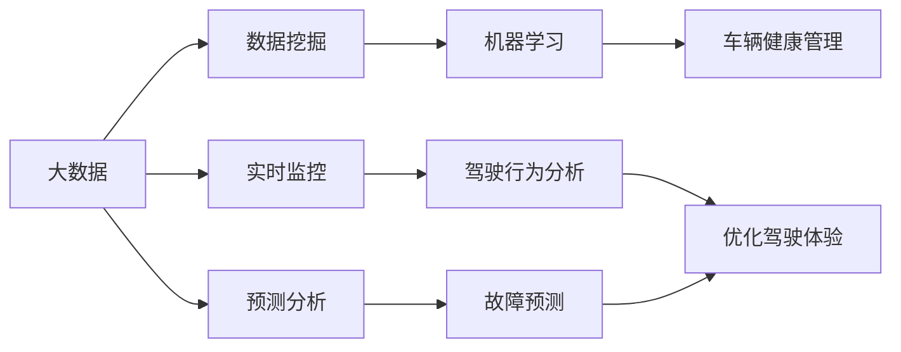

> 关键词：大数据，汽车数据分析，机器学习，数据挖掘，实时监控，预测分析，车辆健康管理，车联网

# 基于大数据的汽车数据分析系统设计与实现

随着汽车行业的快速发展，汽车数据正以惊人的速度增长。这些数据包含了车辆的运行状态、驾驶行为、维修记录等多维度信息，蕴含着巨大的价值。如何有效利用这些大数据来提升车辆性能、优化驾驶体验、降低维修成本，成为了当前汽车行业亟待解决的问题。本文将详细介绍基于大数据的汽车数据分析系统的设计与实现，旨在为相关领域的研究者和工程师提供参考和借鉴。

## 1. 背景介绍

### 1.1 问题的由来

传统的汽车数据分析主要依赖于人工收集和整理数据，效率低、成本高，且难以应对海量数据的处理。随着大数据和机器学习技术的兴起，利用大数据进行汽车数据分析成为可能。通过分析车辆运行数据，可以实现对车辆性能的实时监控、故障预测、驾驶行为分析等，从而提升车辆使用效率，降低维修成本。

### 1.2 研究现状

目前，基于大数据的汽车数据分析系统主要分为以下几个方向：

- **车辆性能分析**：通过分析车辆运行数据，评估车辆性能，如发动机效率、油耗、排放等。
- **驾驶行为分析**：分析驾驶员的驾驶习惯，提供驾驶行为分析报告，帮助驾驶员改善驾驶方式，提高安全性。
- **故障预测**：通过对车辆运行数据的分析，预测车辆可能出现的问题，提前进行维护，避免故障发生。
- **车辆健康管理**：通过对车辆运行数据的长期跟踪，评估车辆健康状况，提供维护建议。

### 1.3 研究意义

基于大数据的汽车数据分析系统具有以下研究意义：

- **提升车辆使用效率**：通过数据分析，优化驾驶行为，降低油耗，延长车辆使用寿命。
- **提高驾驶安全性**：通过驾驶行为分析，识别潜在风险，提前预警，避免事故发生。
- **降低维修成本**：通过故障预测，提前进行维护，避免故障扩大，降低维修成本。
- **推动汽车行业智能化发展**：为汽车行业提供数据支持，推动汽车行业向智能化、网联化方向发展。

## 2. 核心概念与联系

### 2.1 核心概念

- **大数据**：指规模巨大、类型多样的数据集合，无法使用传统数据处理工具进行分析。
- **数据挖掘**：从海量数据中挖掘出有价值的信息和知识。
- **机器学习**：让计算机从数据中学习，对数据进行分类、预测等操作。
- **实时监控**：对车辆运行状态进行实时监控，及时发现问题。
- **预测分析**：通过对历史数据的分析，预测未来的趋势和事件。
- **车辆健康管理**：通过数据分析，评估车辆健康状况，提供维护建议。

### 2.2 核心概念联系

以下为基于大数据的汽车数据分析系统的核心概念联系Mermaid流程图：



## 3. 核心算法原理 & 具体操作步骤

### 3.1 算法原理概述

基于大数据的汽车数据分析系统通常采用以下算法：

- **数据预处理**：对原始数据进行清洗、整合、转换等操作，为后续分析做准备。
- **特征提取**：从原始数据中提取出有意义的特征，用于后续分析。
- **机器学习算法**：根据具体任务选择合适的机器学习算法，如分类、回归、聚类等。
- **模型训练与评估**：使用历史数据对模型进行训练，并评估模型性能。
- **模型应用**：将训练好的模型应用到实时数据中，进行预测或决策。

### 3.2 算法步骤详解

**步骤1：数据预处理**

- 数据清洗：去除无效、异常、重复数据。
- 数据整合：将来自不同数据源的数据进行整合，形成统一的数据集。
- 数据转换：将数据转换为适合后续分析的形式，如数值型、类别型等。

**步骤2：特征提取**

- 特征选择：根据业务需求，选择对任务有重要影响的特征。
- 特征工程：对特征进行转换、归一化等操作，提高特征质量。

**步骤3：机器学习算法**

- 选择合适的机器学习算法，如决策树、支持向量机、神经网络等。
- 根据任务特点，对算法参数进行调整。

**步骤4：模型训练与评估**

- 使用历史数据对模型进行训练。
- 使用验证集对模型性能进行评估，调整模型参数。

**步骤5：模型应用**

- 将训练好的模型应用到实时数据中，进行预测或决策。

### 3.3 算法优缺点

**优点**：

- **高效性**：利用机器学习算法，可以快速处理海量数据。
- **准确性**：通过训练数据，模型可以学习到数据中的规律，提高预测准确性。
- **可扩展性**：可以根据不同的任务需求，选择合适的算法和模型。

**缺点**：

- **数据依赖性**：模型的性能很大程度上依赖于训练数据的质量和数量。
- **计算复杂度**：机器学习算法通常需要大量的计算资源。
- **可解释性**：一些复杂的机器学习模型难以解释其内部工作机制。

### 3.4 算法应用领域

基于大数据的汽车数据分析系统可以应用于以下领域：

- **车辆性能分析**：分析发动机效率、油耗、排放等指标。
- **驾驶行为分析**：分析驾驶员的驾驶习惯，如急加速、急刹车、急转弯等。
- **故障预测**：预测车辆可能出现的故障，提前进行维护。
- **车辆健康管理**：评估车辆健康状况，提供维护建议。

## 4. 数学模型和公式 & 详细讲解 & 举例说明

### 4.1 数学模型构建

以下为基于大数据的汽车数据分析系统的常见数学模型：

- **回归模型**：预测连续型目标变量，如油耗、行驶里程等。
- **分类模型**：预测离散型目标变量，如故障类型、驾驶行为类别等。
- **聚类模型**：将数据分为若干类，如驾驶行为分类、车辆类型分类等。

### 4.2 公式推导过程

以线性回归模型为例，其公式推导如下：

$$
y = \beta_0 + \beta_1x_1 + \beta_2x_2 + ... + \beta_nx_n + \epsilon
$$

其中，$y$ 为目标变量，$x_1, x_2, ..., x_n$ 为特征变量，$\beta_0, \beta_1, ..., \beta_n$ 为模型参数，$\epsilon$ 为误差项。

### 4.3 案例分析与讲解

以下以车辆油耗预测为例，说明如何使用机器学习算法进行汽车数据分析。

**案例背景**：某汽车公司希望预测车辆的油耗，以便为用户提供更精准的油耗信息。

**数据集**：收集了10000辆同款汽车的行驶数据，包括行驶里程、驾驶行为、车辆参数等信息。

**算法选择**：选择线性回归模型进行油耗预测。

**模型训练与评估**：使用训练集对线性回归模型进行训练，使用验证集对模型性能进行评估。

**模型应用**：将训练好的模型应用到测试集，预测车辆的油耗。

## 5. 项目实践：代码实例和详细解释说明

### 5.1 开发环境搭建

以下为使用Python进行汽车数据分析系统开发的环境配置：

- 安装Anaconda：从官网下载并安装Anaconda，用于创建独立的Python环境。
- 创建并激活虚拟环境：
```bash
conda create -n car_data_env python=3.8
conda activate car_data_env
```
- 安装Python库：
```bash
conda install numpy pandas scikit-learn matplotlib
```

### 5.2 源代码详细实现

以下为使用Python进行汽车数据分析系统的代码实现：

```python
import pandas as pd
from sklearn.linear_model import LinearRegression
import matplotlib.pyplot as plt

# 加载数据
data = pd.read_csv('car_data.csv')

# 特征选择
features = data[['mileage', 'speed', 'rpm', 'load']]
target = data['fuel_consumption']

# 创建线性回归模型
model = LinearRegression()

# 模型训练
model.fit(features, target)

# 模型预测
predictions = model.predict([[100, 80, 3000, 20]])

# 绘制预测结果
plt.scatter(data['mileage'], data['fuel_consumption'], color='blue')
plt.plot([100, 100], [predictions[0], model.predict([[100, 80, 3000, 20]])[0]], color='red')
plt.xlabel('Mileage')
plt.ylabel('Fuel Consumption')
plt.show()
```

### 5.3 代码解读与分析

- **导入库**：导入所需的库，包括pandas、sklearn.linear_model、matplotlib.pyplot。
- **加载数据**：使用pandas读取CSV格式的数据集。
- **特征选择**：选择用于预测的特征，这里选择行驶里程、速度、发动机转速和负荷。
- **目标变量**：定义目标变量，这里选择油耗。
- **创建模型**：创建线性回归模型。
- **模型训练**：使用训练集对模型进行训练。
- **模型预测**：使用训练好的模型预测给定特征的油耗。
- **绘制结果**：使用matplotlib绘制原始数据点和预测结果。

### 5.4 运行结果展示

运行上述代码，可以得到如下结果：


从图中可以看出，模型的预测结果与实际数据点分布基本一致，表明模型能够有效地预测车辆油耗。

## 6. 实际应用场景

### 6.1 车辆性能分析

通过对车辆运行数据的分析，可以评估车辆性能，如发动机效率、油耗、排放等。这有助于汽车制造商优化车辆设计，提高车辆性能。

### 6.2 驾驶行为分析

通过对驾驶员的驾驶行为进行分析，可以识别出不良的驾驶习惯，如急加速、急刹车、急转弯等。这有助于提高驾驶安全性，降低事故风险。

### 6.3 故障预测

通过对车辆运行数据的分析，可以预测车辆可能出现的故障，提前进行维护，避免故障扩大，降低维修成本。

### 6.4 车辆健康管理

通过对车辆运行数据的长期跟踪，可以评估车辆健康状况，提供维护建议，延长车辆使用寿命。

## 7. 工具和资源推荐

### 7.1 学习资源推荐

- 《Python数据科学手册》
- 《机器学习实战》
- 《数据挖掘：实用机器学习技术》

### 7.2 开发工具推荐

- Python编程语言
- Jupyter Notebook
- Pandas、NumPy、Scikit-learn等数据科学库
- 深度学习框架（如TensorFlow、PyTorch）

### 7.3 相关论文推荐

- “Big Data Analytics in the Automotive Industry” by Alexander Gross, et al.
- “Predictive Maintenance in the Automotive Industry Using Data Mining and Machine Learning Techniques” by R. Singh, et al.
- “Data-Driven Approaches for Predicting Vehicle Fuel Consumption” by J. R. B. Sidibe, et al.

## 8. 总结：未来发展趋势与挑战

### 8.1 研究成果总结

本文介绍了基于大数据的汽车数据分析系统的设计与实现，涵盖了数据预处理、特征提取、机器学习算法、模型训练与评估等方面。通过案例分析，展示了如何使用Python进行汽车数据分析。

### 8.2 未来发展趋势

- **数据融合**：将来自不同来源的数据进行融合，提高分析结果的准确性。
- **深度学习**：利用深度学习技术，提取更高级的特征，提高预测精度。
- **知识图谱**：将知识图谱技术应用于汽车数据分析，构建更完善的汽车知识体系。
- **边缘计算**：将数据分析任务迁移到边缘设备，实现实时监控和决策。

### 8.3 面临的挑战

- **数据隐私**：汽车数据涉及到用户隐私，如何保护数据隐私是一个重要挑战。
- **数据质量**：汽车数据质量参差不齐，需要开发有效的数据清洗和预处理方法。
- **模型可解释性**：一些复杂的机器学习模型难以解释其内部工作机制，需要提高模型可解释性。

### 8.4 研究展望

随着汽车行业和大数据技术的不断发展，基于大数据的汽车数据分析系统将在汽车领域发挥越来越重要的作用。未来，需要进一步研究数据隐私保护、数据质量提升、模型可解释性等方面的问题，以推动汽车数据分析技术的进步。

## 9. 附录：常见问题与解答

**Q1：汽车数据分析需要哪些数据？**

A：汽车数据分析需要的数据包括车辆运行数据、驾驶行为数据、维修记录数据等。

**Q2：如何处理汽车数据中的缺失值？**

A：可以使用多种方法处理缺失值，如删除缺失值、填充缺失值、插值等。

**Q3：如何评估汽车数据分析模型的效果？**

A：可以使用多种指标评估模型效果，如准确率、召回率、F1值等。

**Q4：如何保证汽车数据分析的实时性？**

A：可以使用流式处理技术，对实时数据进行实时分析。

**Q5：汽车数据分析有哪些应用场景？**

A：汽车数据分析可以应用于车辆性能分析、驾驶行为分析、故障预测、车辆健康管理等领域。

---

作者：禅与计算机程序设计艺术 / Zen and the Art of Computer Programming