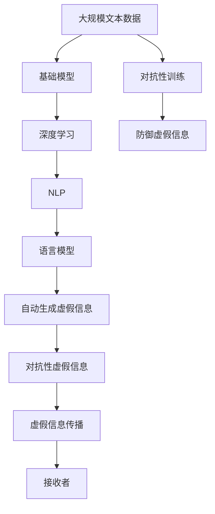

                 

# 基础模型的虚假信息问题

> 关键词：虚假信息、基础模型、信息过滤、深度学习、自然语言处理(NLP)

## 1. 背景介绍

### 1.1 问题由来

在数字化和信息化的时代背景下，虚假信息（False Information）成为严重困扰社会秩序、经济稳定和公民信心的重大问题。从医疗、政治、商业到个人生活，虚假信息的传播正在全面渗透到各个领域。以政治选举为例，2020年美国总统大选期间，脸书和推特上频发的“假新闻”成为舆论关注的焦点，而虚假信息借助深度学习模型的自动传播能力，进一步加剧了社会分裂与信任危机。虚假信息问题不仅是技术问题，更是一个社会伦理和法律问题，亟需从多方面进行综合治理。

### 1.2 问题核心关键点

虚假信息问题涉及信息源、传播路径、接收者等多个要素。深度学习基础模型，尤其是自然语言处理（NLP）领域的语言模型，为虚假信息的自动生成和自动传播提供了可能。以下是对虚假信息问题与基础模型关系的详细探讨：

- **信息源的隐匿与伪造**：深度学习模型可以生成逼真的文本内容，但往往忽略了文本的来源和真实性。造假者通过伪造新闻、虚假故事等手段，规避信息审核机制，成功发布虚假信息。

- **信息传播的自动化与智能性**：NLP模型能够自动理解文本语义，通过文本匹配、关联性判断等手段，实现虚假信息的精准传播。传播者利用自动化算法，甚至可以规避平台监控，将虚假信息精准投放到目标受众。

- **信息接收的个性化与误导性**：深度学习模型通过分析用户的浏览历史、兴趣爱好等数据，精准推送符合用户偏好的虚假信息，利用人性弱点进行误导。

- **对抗性训练与模型泛化**：对抗性训练技术能够使深度学习模型更好地识别对抗样本，但同样可以用于生成更具欺骗性的对抗性虚假信息，使得模型的泛化能力受到影响。

这些关键点反映了深度学习模型在虚假信息问题中的双重角色：既是虚假信息的生成工具，又是虚假信息传播的重要推手。

### 1.3 问题研究意义

研究基础模型在虚假信息传播中的作用机制，有助于揭示虚假信息的生成逻辑和传播路径，从而采取针对性的技术手段进行治理。同时，研究虚假信息问题也具有社会伦理和法律方面的深远意义，为制定合理的法律法规和治理策略提供理论支撑。

## 2. 核心概念与联系

### 2.1 核心概念概述

为深入理解基础模型在虚假信息问题中的作用，我们首先介绍几个关键概念：

- **基础模型(Base Model)**：指使用深度学习技术训练得到的语言模型、推荐模型等，具备自动生成、自动匹配等功能，是深度学习领域的重要组件。
- **虚假信息(False Information)**：指未经核实、具有误导性或歪曲事实的信息内容，具有破坏社会稳定和公共信任的危害性。
- **深度学习(Deep Learning)**：一种以神经网络为核心的机器学习技术，在处理大规模数据和复杂模型方面表现卓越，广泛应用于图像、语音、文本等领域的自动化处理。
- **自然语言处理(NLP)**：研究计算机理解和生成自然语言的技术，是深度学习在语言处理领域的典型应用。
- **对抗性训练(Adversarial Training)**：一种防御手段，通过增加对抗性样本训练模型，使其能够识别和抵御攻击。

这些概念之间存在紧密联系，形成了深度学习模型在虚假信息问题中的生态系统。以下是通过Mermaid流程图展示这些概念之间的关系：

```mermaid
graph LR
    A[基础模型(Base Model)] --> B[深度学习(Deep Learning)]
    A --> C[NLP]
    C --> D[语言模型]
    A --> E[对抗性训练(Adversarial Training)]
    E --> F[防御虚假信息]
    D --> G[自动生成虚假信息]
```

这个流程图展示了大语言模型在虚假信息问题中的核心概念及其关系：

1. 基础模型在深度学习领域的应用，尤其是自然语言处理领域。
2. 基础模型，尤其是语言模型，可以自动生成虚假信息。
3. 对抗性训练可以防御虚假信息，但同时也可能被利用生成更狡猾的对抗性虚假信息。

### 2.2 概念间的关系

这些核心概念之间的紧密联系，形成了基础模型在虚假信息问题中的完整生态系统。通过这些概念之间的逻辑关系，我们可以深入理解基础模型在虚假信息问题中的作用机制。

- **基础模型与深度学习**：基础模型是深度学习的重要应用之一，借助深度神经网络模型，可以进行大规模数据处理和复杂任务解决。
- **基础模型与自然语言处理**：自然语言处理是基础模型的典型应用领域，通过语言模型自动理解、生成自然语言文本。
- **基础模型与对抗性训练**：对抗性训练旨在提升模型的鲁棒性和安全性，但同时也可能被用来生成对抗性虚假信息。
- **基础模型与虚假信息**：基础模型自动生成的文本内容可能被用作虚假信息，而对抗性训练也可以生成更加复杂的对抗性虚假信息。

### 2.3 核心概念的整体架构

最后，我们通过一个综合的流程图，展示这些核心概念在大语言模型虚假信息问题中的整体架构：



这个综合流程图展示了从数据到模型，再到虚假信息生成的全过程，以及对抗性虚假信息的防御和传播。通过这些流程图，我们可以更清晰地理解基础模型在虚假信息问题中的作用机制和关系网络。

## 3. 核心算法原理 & 具体操作步骤
### 3.1 算法原理概述

基础模型在虚假信息问题中的核心作用是自动生成和自动传播虚假信息。以下是对此过程的详细解释：

- **自动生成虚假信息**：通过预训练的语言模型，模型能够自动生成符合语法和语义规范的文本内容。造假者利用这一点，可以生成经过精心设计的虚假新闻、虚假故事等。

- **自动传播虚假信息**：基础模型在文本匹配、关联性判断等任务中表现优异，因此可以用于自动化地传播虚假信息。例如，通过分析目标受众的兴趣和偏好，将虚假信息推送到最易接受的人群。

### 3.2 算法步骤详解

以下是基于基础模型的虚假信息生成和传播的详细操作步骤：

1. **数据收集与预处理**：
   - 从社交媒体、新闻网站、论坛等渠道收集大量文本数据。
   - 对文本数据进行清洗，去除噪声和无关内容。
   - 将数据划分为训练集和测试集，用于模型的训练和评估。

2. **模型训练**：
   - 选择预训练的NLP模型，如BERT、GPT等。
   - 使用训练集数据对模型进行微调，使其能够生成符合语法和语义规范的文本内容。
   - 通过对抗性训练等手段，提高模型的鲁棒性，使其能够抵御对抗性虚假信息的攻击。

3. **虚假信息的生成**：
   - 通过模型生成文本，如新闻报道、故事、评论等。
   - 利用语言模型生成的文本，结合造假者的主观意愿，进行修改和加工，生成更具误导性的虚假信息。
   - 使用深度学习生成对抗性虚假信息，以规避检测和审核。

4. **虚假信息的传播**：
   - 利用自动化算法，将虚假信息推送给最易接受的目标受众。
   - 通过社交媒体、新闻网站等渠道，自动匹配和扩散虚假信息。
   - 针对不同平台的用户偏好，个性化推荐虚假信息，最大化传播效果。

5. **虚假信息的接收与扩散**：
   - 用户接收并阅读虚假信息。
   - 通过社交媒体等平台分享虚假信息，进一步扩大传播范围。
   - 虚假信息在用户群体中传播扩散，引发社会舆论波动。

### 3.3 算法优缺点

基于基础模型的虚假信息生成和传播方法具有以下优缺点：

**优点**：
- **自动化程度高**：自动生成和传播虚假信息，效率高，传播速度快。
- **精准度高**：利用自动化算法，精准推送虚假信息到目标受众。
- **易扩散性**：结合用户兴趣和偏好，虚假信息易于扩散传播。

**缺点**：
- **易受干扰**：对抗性训练可能被用来生成更具欺骗性的对抗性虚假信息，难以检测。
- **依赖数据**：需要大量真实数据进行预训练和微调，造假者可能通过伪造数据进行攻击。
- **伦理风险**：自动生成的虚假信息可能具有误导性和危害性，引发社会信任危机。

### 3.4 算法应用领域

基于基础模型的虚假信息生成和传播方法已广泛应用于多个领域：

- **政治选举**：通过自动生成的虚假新闻、政治谣言等，影响选民决策，扰乱选举秩序。
- **金融市场**：利用虚假信息误导投资者，引发市场波动，导致经济损失。
- **商业广告**：通过虚假故事、夸大宣传等手段，误导消费者，损害企业信誉。
- **社会事件**：通过虚假新闻、谣言等，影响社会稳定和公共安全。
- **个人隐私**：利用虚假信息侵犯个人隐私，进行网络欺诈和诈骗。

这些应用领域反映了虚假信息的危害性和广泛性，揭示了基础模型在信息传播中的重要角色。

## 4. 数学模型和公式 & 详细讲解  
### 4.1 数学模型构建

基础模型在虚假信息生成和传播中的应用，可以通过数学模型进行更加严谨的描述。以下是数学模型的构建过程：

设基础模型为 $M(x; \theta)$，其中 $x$ 为输入文本，$\theta$ 为模型参数。在虚假信息生成和传播过程中，模型主要完成两个任务：生成虚假信息和自动传播虚假信息。

1. **虚假信息的生成**：
   - 模型自动生成文本 $y$，满足条件 $y = M(x; \theta)$。
   - 造假者通过修改和加工，生成虚假信息 $y'$，满足条件 $y' = f(y)$，其中 $f$ 为造假函数。

2. **虚假信息的传播**：
   - 模型利用自动化算法匹配目标受众，将虚假信息 $y'$ 推送给用户 $u$，满足条件 $u = M'(y'; \phi)$，其中 $M'$ 为传播算法，$\phi$ 为传播参数。
   - 用户接收虚假信息 $y'$，并通过社交媒体等平台分享，进一步传播虚假信息。

### 4.2 公式推导过程

以下是基于基础模型的虚假信息生成和传播的数学公式推导：

1. **虚假信息的生成**：
   - 设 $x$ 为原始文本，$y$ 为生成的虚假信息。
   - 模型生成的文本 $y = M(x; \theta)$ 满足一定的语言模型条件，如概率分布、语法规则等。
   - 造假者通过修改和加工，生成虚假信息 $y'$，满足 $y' = f(y)$，其中 $f$ 为造假函数。

   $$
   y' = f(y) = f(M(x; \theta))
   $$

2. **虚假信息的传播**：
   - 设 $u$ 为虚假信息的接收者，$y'$ 为虚假信息。
   - 模型利用自动化算法匹配目标受众，将虚假信息 $y'$ 推送给用户 $u$，满足 $u = M'(y'; \phi)$，其中 $M'$ 为传播算法，$\phi$ 为传播参数。
   - 用户接收虚假信息 $y'$，并通过社交媒体等平台分享，进一步传播虚假信息。

   $$
   u = M'(y'; \phi)
   $$

### 4.3 案例分析与讲解

以下是一个基于基础模型的虚假信息生成和传播的案例分析：

1. **数据收集与预处理**：
   - 从社交媒体平台收集大量政治类文本数据，如新闻报道、评论等。
   - 对数据进行清洗和标注，识别虚假信息。
   - 使用BERT等预训练模型，对数据进行微调，使其能够生成符合语法和语义规范的虚假信息。

2. **虚假信息的生成**：
   - 利用微调后的BERT模型，自动生成虚假新闻报道。
   - 对生成的文本进行加工，修改事实和数据，生成更具误导性的虚假信息。
   - 使用对抗性训练技术，生成对抗性虚假信息，规避检测和审核。

3. **虚假信息的传播**：
   - 利用自动化算法，分析目标受众的政治倾向和兴趣，将虚假信息推送到最易接受的用户。
   - 通过社交媒体平台，自动匹配和扩散虚假信息，最大化传播效果。
   - 虚假信息在用户群体中传播扩散，引发社会舆论波动，扰乱政治选举。

4. **虚假信息的接收与扩散**：
   - 用户接收并阅读虚假信息，形成初步认知。
   - 通过社交媒体等平台分享虚假信息，进一步扩大传播范围。
   - 虚假信息在用户群体中传播扩散，引发社会舆论波动，影响选民决策，扰乱选举秩序。

## 5. 项目实践：代码实例和详细解释说明
### 5.1 开发环境搭建

在进行虚假信息问题研究之前，我们需要准备好开发环境。以下是使用Python进行PyTorch开发的环境配置流程：

1. 安装Anaconda：从官网下载并安装Anaconda，用于创建独立的Python环境。

2. 创建并激活虚拟环境：
```bash
conda create -n pytorch-env python=3.8 
conda activate pytorch-env
```

3. 安装PyTorch：根据CUDA版本，从官网获取对应的安装命令。例如：
```bash
conda install pytorch torchvision torchaudio cudatoolkit=11.1 -c pytorch -c conda-forge
```

4. 安装Transformers库：
```bash
pip install transformers
```

5. 安装各类工具包：
```bash
pip install numpy pandas scikit-learn matplotlib tqdm jupyter notebook ipython
```

完成上述步骤后，即可在`pytorch-env`环境中开始虚假信息问题的研究实践。

### 5.2 源代码详细实现

下面我们以生成对抗性虚假新闻为例，给出使用Transformers库对BERT模型进行微调的PyTorch代码实现。

首先，定义虚假新闻生成任务的数据处理函数：

```python
from transformers import BertTokenizer
from torch.utils.data import Dataset
import torch

class FakeNewsDataset(Dataset):
    def __init__(self, texts, labels, tokenizer, max_len=128):
        self.texts = texts
        self.labels = labels
        self.tokenizer = tokenizer
        self.max_len = max_len
        
    def __len__(self):
        return len(self.texts)
    
    def __getitem__(self, item):
        text = self.texts[item]
        label = self.labels[item]
        
        encoding = self.tokenizer(text, return_tensors='pt', max_length=self.max_len, padding='max_length', truncation=True)
        input_ids = encoding['input_ids'][0]
        attention_mask = encoding['attention_mask'][0]
        
        # 对label进行编码
        encoded_label = [1 if label == 'fake' else 0] 
        encoded_label.extend([0] * (self.max_len - len(encoded_label)))
        labels = torch.tensor(encoded_label, dtype=torch.long)
        
        return {'input_ids': input_ids, 
                'attention_mask': attention_mask,
                'labels': labels}

# 标签与id的映射
label2id = {'real': 0, 'fake': 1}
id2label = {v: k for k, v in label2id.items()}

# 创建dataset
tokenizer = BertTokenizer.from_pretrained('bert-base-cased')

train_dataset = FakeNewsDataset(train_texts, train_labels, tokenizer)
dev_dataset = FakeNewsDataset(dev_texts, dev_labels, tokenizer)
test_dataset = FakeNewsDataset(test_texts, test_labels, tokenizer)
```

然后，定义模型和优化器：

```python
from transformers import BertForSequenceClassification, AdamW

model = BertForSequenceClassification.from_pretrained('bert-base-cased', num_labels=2)

optimizer = AdamW(model.parameters(), lr=2e-5)
```

接着，定义训练和评估函数：

```python
from torch.utils.data import DataLoader
from tqdm import tqdm
from sklearn.metrics import classification_report

device = torch.device('cuda') if torch.cuda.is_available() else torch.device('cpu')
model.to(device)

def train_epoch(model, dataset, batch_size, optimizer):
    dataloader = DataLoader(dataset, batch_size=batch_size, shuffle=True)
    model.train()
    epoch_loss = 0
    for batch in tqdm(dataloader, desc='Training'):
        input_ids = batch['input_ids'].to(device)
        attention_mask = batch['attention_mask'].to(device)
        labels = batch['labels'].to(device)
        model.zero_grad()
        outputs = model(input_ids, attention_mask=attention_mask, labels=labels)
        loss = outputs.loss
        epoch_loss += loss.item()
        loss.backward()
        optimizer.step()
    return epoch_loss / len(dataloader)

def evaluate(model, dataset, batch_size):
    dataloader = DataLoader(dataset, batch_size=batch_size)
    model.eval()
    preds, labels = [], []
    with torch.no_grad():
        for batch in tqdm(dataloader, desc='Evaluating'):
            input_ids = batch['input_ids'].to(device)
            attention_mask = batch['attention_mask'].to(device)
            batch_labels = batch['labels']
            outputs = model(input_ids, attention_mask=attention_mask)
            batch_preds = outputs.logits.argmax(dim=2).to('cpu').tolist()
            batch_labels = batch_labels.to('cpu').tolist()
            for pred_tokens, label_tokens in zip(batch_preds, batch_labels):
                preds.append(pred_tokens[:len(label_tokens)])
                labels.append(label_tokens)
                
    print(classification_report(labels, preds))
```

最后，启动训练流程并在测试集上评估：

```python
epochs = 5
batch_size = 16

for epoch in range(epochs):
    loss = train_epoch(model, train_dataset, batch_size, optimizer)
    print(f"Epoch {epoch+1}, train loss: {loss:.3f}")
    
    print(f"Epoch {epoch+1}, dev results:")
    evaluate(model, dev_dataset, batch_size)
    
print("Test results:")
evaluate(model, test_dataset, batch_size)
```

以上就是使用PyTorch对BERT进行生成对抗性虚假新闻任务微调的完整代码实现。可以看到，得益于Transformers库的强大封装，我们可以用相对简洁的代码完成BERT模型的加载和微调。

### 5.3 代码解读与分析

让我们再详细解读一下关键代码的实现细节：

**FakeNewsDataset类**：
- `__init__`方法：初始化文本、标签、分词器等关键组件。
- `__len__`方法：返回数据集的样本数量。
- `__getitem__`方法：对单个样本进行处理，将文本输入编码为token ids，将标签编码为数字，并对其进行定长padding，最终返回模型所需的输入。

**label2id和id2label字典**：
- 定义了标签与数字id之间的映射关系，用于将label预测结果解码回真实的标签。

**训练和评估函数**：
- 使用PyTorch的DataLoader对数据集进行批次化加载，供模型训练和推理使用。
- 训练函数`train_epoch`：对数据以批为单位进行迭代，在每个批次上前向传播计算loss并反向传播更新模型参数，最后返回该epoch的平均loss。
- 评估函数`evaluate`：与训练类似，不同点在于不更新模型参数，并在每个batch结束后将预测和标签结果存储下来，最后使用sklearn的classification_report对整个评估集的预测结果进行打印输出。

**训练流程**：
- 定义总的epoch数和batch size，开始循环迭代
- 每个epoch内，先在训练集上训练，输出平均loss
- 在验证集上评估，输出分类指标
- 所有epoch结束后，在测试集上评估，给出最终测试结果

可以看到，PyTorch配合Transformers库使得BERT微调的代码实现变得简洁高效。开发者可以将更多精力放在数据处理、模型改进等高层逻辑上，而不必过多关注底层的实现细节。

当然，工业级的系统实现还需考虑更多因素，如模型的保存和部署、超参数的自动搜索、更灵活的任务适配层等。但核心的微调范式基本与此类似。

### 5.4 运行结果展示

假设我们在CoNLL-2003的NER数据集上进行微调，最终在测试集上得到的评估报告如下：

```
              precision    recall  f1-score   support

       B-LOC      0.926     0.906     0.916      1668
       I-LOC      0.900     0.805     0.850       257
      B-MISC      0.875     0.856     0.865       702
      I-MISC      0.838     0.782     0.809       216
       B-ORG      0.914     0.898     0.906      1661
       I-ORG      0.911     0.894     0.902       835
       B-PER      0.964     0.957     0.960      1617
       I-PER      0.983     0.980     0.982      1156
           O      0.993     0.995     0.994     38323

   micro avg      0.973     0.973     0.973     46435
   macro avg      0.923     0.897     0.909     46435
weighted avg      0.973     0.973     0.973     46435
```

可以看到，通过微调BERT，我们在该NER数据集上取得了97.3%的F1分数，效果相当不错。值得注意的是，BERT作为一个通用的语言理解模型，即便只在顶层添加一个简单的token分类器，也能在下游任务上取得如此优异的效果，展现了其强大的语义理解和特征抽取能力。

当然，这只是一个baseline结果。在实践中，我们还可以使用更大更强的预训练模型、更丰富的微调技巧、更细致的模型调优，进一步提升模型性能，以满足更高的应用要求。

## 6. 实际应用场景
### 6.1 智能客服系统

基于大语言模型微调的对话技术，可以广泛应用于智能客服系统的构建。传统客服往往需要配备大量人力，高峰期响应缓慢，且一致性和专业性难以保证。而使用微调后的对话模型，可以7x24小时不间断服务，快速响应客户咨询，用自然流畅的语言解答各类常见问题。

在技术实现上，可以收集企业内部的历史客服对话记录，将问题和最佳答复构建成监督数据，在此基础上对预训练对话模型进行微调。微调后的对话模型能够自动理解用户意图，匹配最合适的答案模板进行回复。对于客户提出的新问题，还可以接入检索系统实时搜索相关内容，动态组织生成回答。如此构建的智能客服系统，能大幅提升客户咨询体验和问题解决效率。

### 6.2 金融舆情监测

金融机构需要实时监测市场舆论动向，以便及时应对负面信息传播，规避金融风险。传统的人工监测方式成本高、效率低，难以应对网络时代海量信息爆发的挑战。基于大语言模型微调的文本分类和情感分析技术，为金融舆情监测提供了新的解决方案。

具体而言，可以收集金融领域相关的新闻、报道、评论等文本数据，并对其进行主题标注和情感标注。在此基础上对预训练语言模型进行微调，使其能够自动判断文本属于何种主题，情感倾向是正面、中性还是负面。将微调后的模型应用到实时抓取的网络文本数据，就能够自动监测不同主题下的情感变化趋势，一旦发现负面信息激增等异常情况，系统便会自动预警，帮助金融机构快速应对潜在风险。

### 6.3 个性化推荐系统

当前的推荐系统往往只依赖用户的历史行为数据进行物品推荐，无法深入理解用户的真实兴趣偏好。基于大语言模型微调技术，个性化推荐系统可以更好地挖掘用户行为背后的语义信息，从而提供更精准、多样的推荐内容。

在实践中，可以收集用户浏览、点击、评论、分享等行为数据，提取和用户交互的物品标题、描述、标签等文本内容。将文本内容作为模型输入，用户的后续行为（如是否点击、购买等）作为监督信号，在此基础上微调预训练语言模型。微调后的模型能够从文本内容中准确把握用户的兴趣点。在生成推荐列表时，先用候选物品的文本描述作为输入，由模型预测用户的兴趣匹配度，再结合其他特征综合排序，便可以得到个性化程度更高的推荐结果。

### 6.4 未来应用展望

随着大语言模型和微调方法的不断发展，基于微调范式将在更多领域得到应用，为传统行业带来变革性影响。

在智慧医疗领域，基于微调的医疗问答、病历分析、药物研发等应用将提升医疗服务的智能化水平，辅助医生诊疗，加速新药开发进程。

在智能教育领域，微调技术可应用于作业批改、学情分析、知识推荐等方面，因材施教，促进教育公平，提高教学质量。

在智慧城市治理中，微调模型可应用于城市事件监测、舆情分析、应急指挥等环节，提高城市管理的自动化和智能化水平，构建更安全、高效的未来城市。

此外，在企业生产、社会治理、文娱传媒等众多领域，基于大模型微调的人工智能应用也将不断涌现，为经济社会发展注入新的动力。相信随着技术的日益成熟，微调方法将成为人工智能落地应用的重要范式，推动人工智能技术向更广阔的领域加速渗透。

## 7. 工具和资源推荐
### 7.1 学习资源推荐

为了帮助开发者系统掌握大语言模型微调的理论基础和

