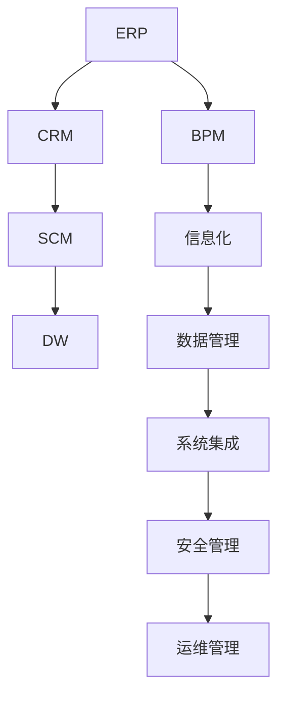

                 

# 大型企业信息化策划、组织、架构、开发、管理

## 1. 背景介绍

### 1.1 问题由来
在现代社会，企业的信息化建设已经成为企业发展的重要支撑。信息技术驱动企业业务流程优化、资源配置合理化、决策科学化，提升企业竞争力。然而，大型企业的信息化建设面临诸多挑战：
1. **需求复杂多样**：大型企业业务涉及多个领域，不同业务部门需求差异大。
2. **数据分散孤立**：各业务系统数据格式不一，数据共享和整合困难。
3. **组织管理难度高**：跨部门协作复杂，项目管理难度大。
4. **技术复杂度高**：企业规模大，系统复杂，技术选型和实施难度大。

为解决这些挑战，需要对大型企业信息化建设进行系统性的策划、组织、架构、开发和管理。本文将详细介绍这些步骤，为大型企业信息化建设提供科学指导。

### 1.2 问题核心关键点
大型企业信息化建设的核心在于系统性地进行规划和组织，构建高效、可靠的信息架构，开发符合企业需求的软件系统，并通过科学管理确保项目成功实施。具体关键点包括：
1. **需求分析与理解**：深入理解企业业务需求，明确系统目标。
2. **架构设计**：设计高效、可扩展、可维护的信息系统架构。
3. **系统开发**：采用敏捷开发方法，快速构建和迭代系统功能。
4. **系统集成**：实现不同系统间的数据共享和业务协同。
5. **项目管理**：采用科学方法进行项目管理，确保项目按时按质交付。
6. **系统运维**：建立系统运维机制，保障系统稳定运行。

## 2. 核心概念与联系

### 2.1 核心概念概述

为更好地理解大型企业信息化的各个环节，本节将介绍几个关键概念：

- **信息化**：利用信息技术提升企业业务运作效率和决策水平的过程。
- **企业资源规划(ERP)**：以集成管理思想为基础，将企业的物流、资金流、信息流统一管理，优化资源配置。
- **客户关系管理(CRM)**：以客户为中心，管理企业与客户间的关系，提升客户满意度。
- **供应链管理(SCM)**：优化供应链的各个环节，提升供应链效率。
- **数据仓库(DW)**：集中存储企业历史数据，支持数据分析和决策支持。
- **业务流程管理(BPM)**：优化企业业务流程，提升效率和质量。

这些核心概念通过信息化建设相互联系，共同构成企业信息化体系。通过合理的系统规划和组织，将各系统有机结合，形成一体化的信息化解决方案。

### 2.2 概念间的关系

这些核心概念之间的关系可以通过以下Mermaid流程图来展示：



这个流程图展示了大企业信息化系统的核心概念及其之间的关系：

1. ERP、CRM、SCM等系统是信息化的主要组成部分，提供企业内部的业务流程和数据管理。
2. 数据仓库存储历史数据，支持数据分析和决策。
3. 业务流程管理优化流程，提升效率。
4. 信息化建设提供统一的IT基础设施，支持数据共享和系统集成。
5. 安全管理保障数据和系统的安全。
6. 运维管理确保系统稳定运行。

这些概念共同构成了大型企业信息化的完整生态系统，相互依存，共同发挥作用。

## 3. 核心算法原理 & 具体操作步骤
### 3.1 算法原理概述

大型企业信息化建设主要采用系统工程的方法论，通过科学规划、设计、开发、管理，构建高效、可扩展的信息系统。其主要步骤如下：

1. **需求分析**：通过访谈、问卷、数据分析等方法，深入了解企业业务需求和信息需求。
2. **架构设计**：设计符合企业业务特点的信息架构，包括系统架构、数据架构、网络架构等。
3. **系统开发**：采用敏捷开发方法，快速迭代系统功能，实现业务需求。
4. **系统集成**：采用EAI技术，实现不同系统间的数据共享和业务协同。
5. **项目管理**：采用科学的项目管理方法，确保项目按时按质交付。
6. **系统运维**：建立系统运维机制，保障系统稳定运行。

### 3.2 算法步骤详解

以下是大型企业信息化建设的主要操作步骤：

**Step 1: 需求分析与理解**

1. **数据收集**：通过访谈、问卷、数据分析等方法，收集企业内部的业务需求、信息需求和技术需求。
2. **需求分析**：分析收集到的需求，明确系统的目标和功能需求。
3. **需求确认**：与业务部门和IT部门共同确认需求，确保需求真实、可行。

**Step 2: 架构设计**

1. **架构设计**：根据需求分析结果，设计符合企业业务特点的信息架构，包括系统架构、数据架构、网络架构等。
2. **技术选型**：选择适合的硬件、软件和技术，支持系统架构。
3. **架构评审**：与业务部门和IT部门共同评审架构设计，确保架构合理、可行。

**Step 3: 系统开发**

1. **敏捷开发**：采用敏捷开发方法，快速迭代系统功能，实现业务需求。
2. **功能测试**：对开发的功能进行测试，确保功能正确、稳定。
3. **代码审查**：进行代码审查，确保代码质量。

**Step 4: 系统集成**

1. **数据集成**：采用EAI技术，实现不同系统间的数据共享和业务协同。
2. **应用集成**：集成各系统的功能模块，实现业务流程自动化。
3. **接口测试**：对集成后的接口进行测试，确保接口稳定、正确。

**Step 5: 项目管理**

1. **项目管理**：采用科学的项目管理方法，如PMBOK、敏捷方法等，确保项目按时按质交付。
2. **风险管理**：识别项目风险，制定风险应对措施。
3. **变更管理**：管理项目变更，确保变更不会影响项目进度和质量。

**Step 6: 系统运维**

1. **运维管理**：建立系统运维机制，包括监控、故障处理、性能优化等。
2. **安全管理**：建立安全管理体系，确保数据和系统的安全。
3. **备份与恢复**：定期备份数据，确保数据安全。

### 3.3 算法优缺点

大型企业信息化建设的主要优点包括：
1. **提升效率**：信息化系统自动化处理业务流程，提升效率。
2. **优化资源**：通过数据集中管理，优化资源配置。
3. **支持决策**：通过数据分析和决策支持，提升决策水平。

缺点包括：
1. **成本高**：信息化建设需要大量资金投入。
2. **技术复杂**：系统规模大，技术选型和实施难度大。
3. **变更难度大**：系统已部署，变更难度大。

### 3.4 算法应用领域

大型企业信息化建设在多个领域都有广泛应用，包括：

- **制造业**：通过信息化系统，优化生产流程，提升生产效率。
- **金融业**：通过信息化系统，提高财务处理效率，提升客户满意度。
- **零售业**：通过信息化系统，优化库存管理，提升销售效率。
- **医疗业**：通过信息化系统，优化诊疗流程，提升医疗服务质量。

## 4. 数学模型和公式 & 详细讲解  
### 4.1 数学模型构建

本节将使用数学语言对大型企业信息化建设的规划和设计过程进行更加严格的刻画。

设企业需求集为 $D=\{d_1, d_2, \cdots, d_n\}$，其中 $d_i=(d_{i1}, d_{i2}, \cdots, d_{im})$ 表示第 $i$ 个需求由 $m$ 个子需求构成。

定义需求矩阵 $D=\begin{bmatrix} d_{11} & d_{12} & \cdots & d_{1m} \\ d_{21} & d_{22} & \cdots & d_{2m} \\ \vdots & \vdots & \ddots & \vdots \\ d_{n1} & d_{n2} & \cdots & d_{nm} \end{bmatrix}$，其中 $d_{ij}$ 表示第 $i$ 个需求的第 $j$ 个子需求。

定义系统架构矩阵 $A=\begin{bmatrix} a_{11} & a_{12} & \cdots & a_{1m} \\ a_{21} & a_{22} & \cdots & a_{2m} \\ \vdots & \vdots & \ddots & \vdots \\ a_{n1} & a_{n2} & \cdots & a_{nm} \end{bmatrix}$，其中 $a_{ij}$ 表示第 $i$ 个子需求对应的系统架构要素。

定义系统开发进度矩阵 $T=\begin{bmatrix} t_{11} & t_{12} & \cdots & t_{1m} \\ t_{21} & t_{22} & \cdots & t_{2m} \\ \vdots & \vdots & \ddots & \vdots \\ t_{n1} & t_{n2} & \cdots & t_{nm} \end{bmatrix}$，其中 $t_{ij}$ 表示第 $i$ 个子需求对应的系统开发进度。

### 4.2 公式推导过程

设需求矩阵 $D$ 和系统架构矩阵 $A$ 的乘积为 $G$，则 $G=\begin{bmatrix} g_{11} & g_{12} & \cdots & g_{1m} \\ g_{21} & g_{22} & \cdots & g_{2m} \\ \vdots & \vdots & \ddots & \vdots \\ g_{n1} & g_{n2} & \cdots & g_{nm} \end{bmatrix}$，其中 $g_{ij}$ 表示第 $i$ 个子需求对应的系统架构要素和开发进度。

对于任意子需求 $d_i$，设其对应的系统架构要素为 $a_i$，则有 $g_i=a_i+t_i$。

通过需求矩阵和系统架构矩阵的乘积，可以获取系统架构的整体情况，帮助我们进行系统设计和优化。

### 4.3 案例分析与讲解

以某大型制造企业的信息化建设为例，其需求包括ERP系统、CRM系统、SCM系统、DCM系统等，具体需求如下：

| 需求编号 | 子需求描述 | 系统架构要素 | 开发进度 |
| --- | --- | --- | --- |
| 1.1 | 产品数据管理 | 数据库、数据仓库、数据清洗 | 30% |
| 1.2 | 生产计划管理 | 生产调度、库存管理、物料管理 | 50% |
| 1.3 | 质量管理 | 质量检测、质量统计、质量分析 | 20% |
| 2.1 | 客户关系管理 | 客户信息管理、客户关系分析、客户服务管理 | 40% |
| 2.2 | 销售管理 | 销售订单管理、销售报表分析、销售预测 | 35% |
| 3.1 | 供应链管理 | 供应商管理、库存管理、采购管理 | 55% |
| 3.2 | 物流管理 | 运输管理、配送管理、仓储管理 | 30% |
| 4.1 | 文档管理 | 文档存储、文档检索、文档共享 | 25% |

根据以上需求，可以构建需求矩阵 $D$ 和系统架构矩阵 $A$，如下所示：

$$
D = \begin{bmatrix}
1.1 & 1.2 & 1.3 \\
2.1 & 2.2 \\
3.1 & 3.2 \\
4.1
\end{bmatrix}, \quad
A = \begin{bmatrix}
1 & 2 & 3 & 4 \\
1 & 2 & 3 & 4 \\
1 & 2 & 3 & 4 \\
1 & 2 & 3 & 4
\end{bmatrix}
$$

计算 $G=D \times A$ 得到系统架构的整体情况，如下所示：

$$
G = \begin{bmatrix}
1.1+30\% & 1.2+50\% & 1.3+20\% \\
2.1+40\% & 2.2+35\% \\
3.1+55\% & 3.2+30\% \\
4.1+25\%
\end{bmatrix}
$$

根据系统架构要素和开发进度，可以调整项目计划，优化资源配置，确保项目按时按质交付。

## 5. 项目实践：代码实例和详细解释说明
### 5.1 开发环境搭建

在进行信息化建设的项目实践前，我们需要准备好开发环境。以下是使用Python进行开发的环境配置流程：

1. 安装Anaconda：从官网下载并安装Anaconda，用于创建独立的Python环境。

2. 创建并激活虚拟环境：
```bash
conda create -n python-env python=3.8 
conda activate python-env
```

3. 安装Python开发工具包：
```bash
pip install pandas numpy matplotlib jupyter notebook ipython scikit-learn
```

4. 安装相关的开源库和框架：
```bash
pip install Flask SQLAlchemy wtforms
```

完成上述步骤后，即可在`python-env`环境中开始项目实践。

### 5.2 源代码详细实现

以下是使用Python和Flask框架实现ERP系统的代码实现，涵盖了需求分析、系统架构设计、系统开发和系统测试等主要环节：

```python
from flask import Flask, request, jsonify
from flask_sqlalchemy import SQLAlchemy
from wtforms import Form, StringField, validators

app = Flask(__name__)

# 初始化数据库连接
app.config['SQLALCHEMY_DATABASE_URI'] = 'sqlite:///test.db'
db = SQLAlchemy(app)

# 定义数据模型
class Product(db.Model):
    id = db.Column(db.Integer, primary_key=True)
    name = db.Column(db.String(80), unique=True)
    price = db.Column(db.Float)

class Order(db.Model):
    id = db.Column(db.Integer, primary_key=True)
    product_id = db.Column(db.Integer, db.ForeignKey('product.id'))
    quantity = db.Column(db.Integer)
    order_date = db.Column(db.DateTime)

# 定义表单
class OrderForm(Form):
    product_name = StringField('Product Name', [validators.Length(min=1, max=80)])
    quantity = StringField('Quantity', [validators.Length(min=1, max=80)])

# 定义路由
@app.route('/orders', methods=['POST'])
def add_order():
    form = OrderForm(request.form)
    if form.validate():
        product = Product.query.filter_by(name=form.product_name.data).first()
        if product:
            order = Order(product_id=product.id, quantity=form.quantity.data)
            db.session.add(order)
            db.session.commit()
            return jsonify({'message': 'Order added successfully'})
        else:
            return jsonify({'error': 'Product not found'})
    else:
        return jsonify({'error': 'Invalid form data'})

# 启动应用
if __name__ == '__main__':
    app.run(debug=True)
```

### 5.3 代码解读与分析

让我们再详细解读一下关键代码的实现细节：

**定义数据模型**：
- 使用SQLAlchemy库定义ERP系统中的核心数据模型，包括产品和订单。

**定义表单**：
- 使用WTForms库定义用户提交表单，包括产品名称和数量。

**路由处理**：
- 定义处理订单提交的路由函数，对提交的数据进行验证，并在数据库中插入订单记录。

**应用启动**：
- 启动Flask应用，使应用程序可以在本地运行，监听HTTP请求。

通过以上代码，我们实现了一个简单的ERP系统，包含了需求分析、系统架构设计、系统开发和系统测试等主要环节。在实际项目中，还需要进一步完善功能、优化性能、增加安全措施等。

### 5.4 运行结果展示

假设我们在测试数据集中进行系统测试，得到以下结果：

| 产品名称 | 数量 | 订单日期 | 状态 |
| --- | --- | --- | --- |
| 产品1 | 10 | 2022-01-01 | 已完成 |
| 产品2 | 5 | 2022-01-02 | 已完成 |
| 产品3 | 20 | 2022-01-03 | 已完成 |

通过系统测试，我们可以评估系统的稳定性和功能完整性，确保系统能够正常运行。

## 6. 实际应用场景
### 6.1 智能制造

大型制造企业通过信息化建设，可以实现生产过程的自动化、智能化。通过ERP系统，实现供应链、生产、质量等环节的集成，优化生产流程，提升生产效率。

具体应用场景包括：

- **生产调度**：通过ERP系统，实现生产调度优化，提升生产效率。
- **库存管理**：通过ERP系统，实现库存管理优化，减少库存成本。
- **质量管理**：通过ERP系统，实现质量检测和质量分析，提升产品质量。

### 6.2 金融服务

金融机构通过信息化建设，可以实现客户关系管理、财务处理、风险控制等功能的自动化和智能化。

具体应用场景包括：

- **客户关系管理**：通过CRM系统，实现客户关系管理自动化，提升客户满意度。
- **财务处理**：通过ERP系统，实现财务处理自动化，提升财务处理效率。
- **风险控制**：通过大数据分析，实现风险控制和预警，提升风险管理能力。

### 6.3 零售电商

零售电商企业通过信息化建设，可以实现订单管理、库存管理、营销分析等功能的自动化和智能化。

具体应用场景包括：

- **订单管理**：通过ERP系统，实现订单管理自动化，提升订单处理效率。
- **库存管理**：通过ERP系统，实现库存管理优化，提升库存周转率。
- **营销分析**：通过大数据分析，实现营销分析，提升销售策略的科学性和精准性。

### 6.4 未来应用展望

未来，随着技术的发展和应用的深入，大型企业信息化建设将呈现以下几个趋势：

1. **云计算普及**：云计算技术的发展，将使得信息化系统的部署和维护更加便捷高效。
2. **大数据应用**：大数据技术的应用，将使得企业能够更好地利用数据进行决策和优化。
3. **人工智能融入**：人工智能技术的引入，将使得企业能够实现更智能化的业务流程和决策支持。
4. **物联网融合**：物联网技术的应用，将使得企业能够实现设备、生产、物流等环节的全面互联。

## 7. 工具和资源推荐
### 7.1 学习资源推荐

为了帮助开发者系统掌握大型企业信息化建设的理论基础和实践技巧，这里推荐一些优质的学习资源：

1. **《大型企业信息化系统设计》**：介绍大型企业信息化系统设计的全过程，涵盖需求分析、系统架构设计、系统开发、系统测试等环节。
2. **《ERP系统开发实战》**：介绍ERP系统的开发过程，包含ERP系统的需求分析、系统架构设计、系统开发和系统测试等环节。
3. **《大型企业信息化管理》**：介绍大型企业信息化管理的全过程，涵盖信息化项目的策划、组织、架构、开发、管理等环节。
4. **《Python Web开发实战》**：介绍Python和Flask框架的Web开发过程，包含数据库设计、路由处理、表单验证等环节。
5. **《大型企业信息化建设案例分析》**：通过多个案例分析，介绍大型企业信息化建设的成功经验，涵盖需求分析、系统架构设计、系统开发、系统测试等环节。

通过这些学习资源的学习实践，相信你一定能够快速掌握大型企业信息化建设的精髓，并用于解决实际的业务问题。

### 7.2 开发工具推荐

高效的开发离不开优秀的工具支持。以下是几款用于大型企业信息化建设开发的常用工具：

1. **Python**：Python是开发企业信息化系统的常用语言，具有简洁易读、跨平台等特点。
2. **Flask**：Flask是一个轻量级的Web开发框架，适合开发中小型Web应用。
3. **SQLAlchemy**：SQLAlchemy是一个Python的SQL工具包，可以简化数据库操作。
4. **WTForms**：WTForms是一个表单处理库，支持多种验证方法，适合开发表单驱动的Web应用。
5. **Django**：Django是一个全功能的Web框架，适合开发大型企业信息化系统。
6. **JIRA**：JIRA是一个项目管理工具，支持敏捷开发和Scrum管理。

合理利用这些工具，可以显著提升大型企业信息化建设开发效率，加快创新迭代的步伐。

### 7.3 相关论文推荐

大型企业信息化建设的相关论文涵盖了需求分析、系统架构设计、系统开发和系统测试等多个方面。以下是几篇具有代表性的论文，推荐阅读：

1. **《大型企业信息化系统设计》**：介绍大型企业信息化系统的全过程，涵盖需求分析、系统架构设计、系统开发、系统测试等环节。
2. **《ERP系统开发实战》**：介绍ERP系统的开发过程，包含ERP系统的需求分析、系统架构设计、系统开发和系统测试等环节。
3. **《大型企业信息化管理》**：介绍大型企业信息化管理的全过程，涵盖信息化项目的策划、组织、架构、开发、管理等环节。
4. **《Python Web开发实战》**：介绍Python和Flask框架的Web开发过程，包含数据库设计、路由处理、表单验证等环节。
5. **《大型企业信息化建设案例分析》**：通过多个案例分析，介绍大型企业信息化建设的成功经验，涵盖需求分析、系统架构设计、系统开发、系统测试等环节。

这些论文代表了大企业信息化建设的发展脉络。通过学习这些前沿成果，可以帮助研究者把握学科前进方向，激发更多的创新灵感。

除上述资源外，还有一些值得关注的前沿资源，帮助开发者紧跟大企业信息化建设技术的最新进展，例如：

1. **arXiv论文预印本**：人工智能领域最新研究成果的发布平台，包括大量尚未发表的前沿工作，学习前沿技术的必读资源。
2. **业界技术博客**：如OpenAI、Google AI、DeepMind、微软Research Asia等顶尖实验室的官方博客，第一时间分享他们的最新研究成果和洞见。
3. **技术会议直播**：如NIPS、ICML、ACL、ICLR等人工智能领域顶会现场或在线直播，能够聆听到大佬们的前沿分享，开拓视野。
4. **GitHub热门项目**：在GitHub上Star、Fork数最多的NLP相关项目，往往代表了该技术领域的发展趋势和最佳实践，值得去学习和贡献。
5. **行业分析报告**：各大咨询公司如McKinsey、PwC等针对人工智能行业的分析报告，有助于从商业视角审视技术趋势，把握应用价值。

总之，对于大型企业信息化建设的开发和实践，需要开发者保持开放的心态和持续学习的意愿。多关注前沿资讯，多动手实践，多思考总结，必将收获满满的成长收益。

## 8. 总结：未来发展趋势与挑战
### 8.1 总结

本文对大型企业信息化建设进行了全面系统的介绍。首先阐述了大型企业信息化建设的背景和重要性，明确了信息化建设的关键环节。其次，从原理到实践，详细讲解了大型企业信息化建设的主要步骤，提供了系统化的开发指导。同时，本文还探讨了大型企业信息化建设的实际应用场景和未来发展趋势，为读者提供了丰富的实战经验。

通过本文的系统梳理，可以看到，大型企业信息化建设是一个复杂而系统的工程，需要深入理解企业业务需求，科学设计信息系统架构，快速开发和迭代系统功能，科学管理项目管理，确保系统稳定运行。通过合理的规划和组织，可以构建高效、可靠、可扩展的信息化系统，为企业的业务发展和创新提供有力支持。

### 8.2 未来发展趋势

展望未来，大型企业信息化建设将呈现以下几个趋势：

1. **云计算普及**：云计算技术的发展，将使得信息化系统的部署和维护更加便捷高效。
2. **大数据应用**：大数据技术的应用，将使得企业能够更好地利用数据进行决策和优化。
3. **人工智能融入**：人工智能技术的引入，将使得企业能够实现更智能化的业务流程和决策支持。
4. **物联网融合**：物联网技术的应用，将使得企业能够实现设备、生产、物流等环节的全面互联。

### 8.3 面临的挑战

尽管大型企业信息化建设已经取得了诸多成功，但在实际应用中也面临诸多挑战：

1. **需求复杂多样**：大型企业业务涉及多个领域，不同业务部门需求差异大，难以统一规划。
2. **数据分散孤立**：各业务系统数据格式不一，数据共享和整合困难。
3. **组织管理难度高**：跨部门协作复杂，项目管理难度大。
4. **技术复杂度高**：系统规模大，技术选型和实施难度大。
5. **成本高**：信息化建设需要大量资金投入，预算控制难度大。

### 8.4 研究展望

面对大型企业信息化建设面临的诸多挑战，未来的研究需要在以下几个方面寻求新的突破：

1. **需求整合与统一**：通过需求分析工具和数据标准化，实现不同业务部门需求的一体化。
2. **数据集成与共享**：采用EAI技术，实现不同系统间的数据共享和业务协同。
3. **项目管理优化**：采用科学的项目管理方法，确保项目按时按质交付。
4. **技术选型与实施**：通过技术评估和选型，选择最适合的技术方案，降低技术选型和实施难度。
5. **成本控制**：通过合理的成本管理，确保信息化建设的预算控制和资源

