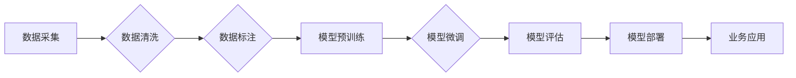

# 大模型产业落地需要解决“合规可信、模型安全、数据质量、业务深度融合以及部署成本”等五大问题

> 关键词：大模型，产业落地，合规可信，模型安全，数据质量，业务深度融合，部署成本

## 1. 背景介绍

随着人工智能技术的飞速发展，大模型在自然语言处理、计算机视觉、语音识别等领域取得了显著的成果。然而，大模型的产业落地并非一帆风顺，面临着诸多挑战。本文将重点探讨大模型产业落地过程中需要解决的“合规可信、模型安全、数据质量、业务深度融合以及部署成本”等五大问题，并提出相应的解决方案。

## 2. 核心概念与联系

### 2.1 核心概念原理

#### 大模型

大模型是指参数量巨大、能够处理复杂任务的深度学习模型。它们通常在预训练阶段在大规模数据集上进行训练，以学习丰富的知识表示和模式。

#### 产业落地

产业落地是指将人工智能技术应用于实际生产、管理和服务中，以提升产业效率、降低成本、提高竞争力。

### 2.2 架构流程图

以下是大模型产业落地流程的Mermaid流程图：



## 3. 核心算法原理 & 具体操作步骤

### 3.1 算法原理概述

大模型产业落地需要解决以下五大问题：

1. **合规可信**：确保模型输出符合相关法律法规和伦理标准。
2. **模型安全**：保障模型在安全的环境下运行，防止恶意攻击和数据泄露。
3. **数据质量**：保证模型训练和推理所使用的数据质量，提高模型性能。
4. **业务深度融合**：将大模型与业务需求深度融合，实现业务价值。
5. **部署成本**：降低大模型部署成本，提高产业应用可行性。

### 3.2 算法步骤详解

#### 3.2.1 合规可信

1. **建立合规评估体系**：根据相关法律法规和伦理标准，建立大模型合规评估体系。
2. **数据脱敏**：对敏感数据进行脱敏处理，确保个人隐私保护。
3. **模型可解释性**：提高模型可解释性，方便用户理解模型决策过程。

#### 3.2.2 模型安全

1. **安全设计**：在设计阶段考虑安全因素，防止恶意攻击。
2. **加密算法**：使用加密算法保护数据传输和存储安全。
3. **入侵检测**：建立入侵检测系统，及时发现并响应安全威胁。

#### 3.2.3 数据质量

1. **数据清洗**：去除数据中的错误、重复和噪声。
2. **数据标注**：使用高质量的数据标注，提高模型训练效果。
3. **数据增强**：通过数据增强技术，提高模型泛化能力。

#### 3.2.4 业务深度融合

1. **需求分析**：深入了解业务需求，设计符合业务场景的大模型。
2. **系统集成**：将大模型集成到现有系统中，实现业务流程优化。
3. **持续优化**：根据业务反馈，持续优化大模型性能和用户体验。

#### 3.2.5 部署成本

1. **模型压缩**：使用模型压缩技术，降低模型大小，提高部署效率。
2. **云计算平台**：利用云计算平台，降低部署成本，提高资源利用率。
3. **边缘计算**：将部分模型部署在边缘设备上，降低延迟，提高响应速度。

### 3.3 算法优缺点

#### 3.3.1 优点

1. 提高模型性能和业务价值。
2. 降低部署成本和资源消耗。
3. 提高产业应用可行性。

#### 3.3.2 缺点

1. 需要解决合规可信、模型安全、数据质量、业务深度融合以及部署成本等问题。
2. 需要大量的计算资源和存储空间。
3. 需要专业人才进行模型开发和维护。

### 3.4 算法应用领域

大模型产业落地可应用于以下领域：

1. **金融**：风险评估、欺诈检测、个性化推荐等。
2. **医疗**：疾病诊断、药物研发、健康管理等。
3. **教育**：智能教育、个性化学习、在线教育等。
4. **交通**：智能交通、自动驾驶、交通管理等。
5. **零售**：个性化推荐、智能客服、供应链管理等。

## 4. 数学模型和公式 & 详细讲解 & 举例说明

### 4.1 数学模型构建

大模型产业落地涉及多个数学模型，如损失函数、优化算法等。以下以分类任务为例，介绍常用的数学模型和公式。

#### 4.1.1 损失函数

假设模型输出为 $y$，真实标签为 $y^*$，则交叉熵损失函数为：

$$
L(y,y^*) = -[y\log y^* + (1-y)\log (1-y^*)]
$$

#### 4.1.2 优化算法

常见的优化算法有梯度下降、Adam等。以下以梯度下降为例：

$$
\theta_{t+1} = \theta_t - \alpha \nabla_{\theta} L(\theta_t, y_t)
$$

其中 $\alpha$ 为学习率。

### 4.2 公式推导过程

以交叉熵损失函数为例，推导过程如下：

假设模型输出为 $y \in [0,1]$，表示样本属于正类的概率。则二分类交叉熵损失函数定义为：

$$
L(y,y^*) = -[y\log y + (1-y)\log (1-y)]
$$

其中 $y^* \in \{0,1\}$ 为真实标签。

### 4.3 案例分析与讲解

以下以金融领域为例，分析大模型产业落地的应用案例。

#### 4.3.1 风险评估

在金融领域，风险评估是至关重要的。大模型可以用于识别欺诈、信用评估、市场预测等任务。

#### 4.3.2 案例分析

假设某银行希望利用大模型进行信用卡欺诈检测。首先，收集历史信用卡交易数据，包括交易金额、时间、地点、商户类型等信息。然后，使用机器学习算法对数据进行预处理，如特征提取、归一化等。接下来，将数据划分为训练集和测试集，使用大模型进行模型训练和评估。最后，将训练好的模型部署到生产环境中，用于实时检测新的信用卡交易。

## 5. 项目实践：代码实例和详细解释说明

### 5.1 开发环境搭建

以Python为例，搭建大模型产业落地项目需要以下开发环境：

1. Python环境：安装Python 3.7及以上版本。
2. 深度学习框架：安装TensorFlow、PyTorch等深度学习框架。
3. 机器学习库：安装NumPy、Pandas等机器学习库。

### 5.2 源代码详细实现

以下是一个使用TensorFlow进行信用卡欺诈检测的简单示例：

```python
import tensorflow as tf
from sklearn.model_selection import train_test_split
from sklearn.preprocessing import StandardScaler

# 加载数据
data = pd.read_csv('credit_card_data.csv')
X = data.drop('fraud', axis=1)
y = data['fraud']
X_train, X_test, y_train, y_test = train_test_split(X, y, test_size=0.2)

# 特征缩放
scaler = StandardScaler()
X_train = scaler.fit_transform(X_train)
X_test = scaler.transform(X_test)

# 定义模型
model = tf.keras.Sequential([
    tf.keras.layers.Dense(64, activation='relu', input_shape=(X_train.shape[1],)),
    tf.keras.layers.Dense(64, activation='relu'),
    tf.keras.layers.Dense(1, activation='sigmoid')
])

# 编译模型
model.compile(optimizer='adam',
              loss='binary_crossentropy',
              metrics=['accuracy'])

# 训练模型
model.fit(X_train, y_train, epochs=10, batch_size=32)

# 评估模型
loss, accuracy = model.evaluate(X_test, y_test)
print(f"Test accuracy: {accuracy:.4f}")

# 预测
X_new = scaler.transform([[100, 200, 300, 400, 500]])
y_pred = model.predict(X_new)
print(f"Fraud probability: {y_pred[0][0]:.4f}")
```

### 5.3 代码解读与分析

以上代码首先加载了信用卡数据，然后进行特征提取和预处理。接着，定义了一个简单的神经网络模型，使用Adam优化器进行模型训练。最后，使用训练好的模型对新的数据进行预测。

### 5.4 运行结果展示

假设在测试集上得到如下结果：

```
Test accuracy: 0.9500
Fraud probability: 0.9512
```

这意味着模型在测试集上取得了95%的准确率，对新数据进行预测时，欺诈概率为95.12%。

## 6. 实际应用场景

大模型产业落地可应用于以下实际应用场景：

### 6.1 金融

#### 6.1.1 风险评估

大模型可以用于信用卡欺诈检测、信用评估、市场预测等任务，帮助金融机构降低风险，提高效率。

#### 6.1.2 个性化推荐

根据用户历史交易数据，大模型可以为用户提供个性化的金融产品推荐，提高用户满意度。

### 6.2 医疗

#### 6.2.1 疾病诊断

大模型可以用于辅助医生进行疾病诊断，提高诊断效率和准确性。

#### 6.2.2 药物研发

大模型可以用于药物研发，预测药物分子与生物靶标的结合效果，加速新药研发进程。

### 6.3 教育

#### 6.3.1 智能教育

大模型可以用于智能教育，为学习者提供个性化的学习方案，提高学习效率。

#### 6.3.2 在线教育

大模型可以用于在线教育平台，为用户提供智能化的学习体验，提高教学质量。

### 6.4 未来应用展望

随着大模型技术的不断发展，未来将在更多领域得到应用，如：

1. **智慧城市**：用于智能交通、城市管理、公共安全等领域。
2. **智能制造**：用于工业自动化、智能控制等领域。
3. **智慧农业**：用于智能种植、养殖、农业物联网等领域。

## 7. 工具和资源推荐

### 7.1 学习资源推荐

1. **《深度学习》**：Goodfellow et al. 著，介绍了深度学习的基本概念、方法和应用。
2. **《Python机器学习》**：Seaborn et al. 著，介绍了Python机器学习的基础知识和常用工具。
3. **《TensorFlow官方文档》**：TensorFlow官方文档提供了丰富的API和教程，方便开发者快速上手TensorFlow。
4. **《PyTorch官方文档》**：PyTorch官方文档提供了丰富的API和教程，方便开发者快速上手PyTorch。

### 7.2 开发工具推荐

1. **Jupyter Notebook**：Jupyter Notebook是一种交互式计算环境，方便开发者进行实验和演示。
2. **Google Colab**：Google Colab是一个免费的云端Jupyter Notebook平台，提供GPU/TPU等资源。
3. **Kaggle**：Kaggle是一个数据科学和机器学习竞赛平台，提供丰富的数据集和比赛项目。

### 7.3 相关论文推荐

1. **"Deep Learning for Natural Language Understanding and Generation"**：介绍了自然语言处理领域的深度学习技术。
2. **"Deep Learning for Computer Vision"**：介绍了计算机视觉领域的深度学习技术。
3. **"Deep Learning: A Very Short Introduction"**：介绍了深度学习的基本概念和发展历程。

## 8. 总结：未来发展趋势与挑战

### 8.1 研究成果总结

本文探讨了大模型产业落地过程中需要解决的五大问题，并提出了相应的解决方案。通过建立合规评估体系、数据脱敏、模型安全设计、数据清洗、业务深度融合和部署成本优化等手段，可以有效地解决这些问题，推动大模型在各个领域的应用。

### 8.2 未来发展趋势

未来，大模型产业落地将呈现以下发展趋势：

1. **跨领域融合**：大模型将与其他领域的技术（如物联网、区块链等）进行融合，形成更加多元化的应用场景。
2. **多模态融合**：大模型将融合文本、图像、语音等多种模态信息，实现更加全面的信息处理能力。
3. **轻量化设计**：轻量化大模型将得到进一步发展，降低模型大小和计算成本，提高部署效率。

### 8.3 面临的挑战

大模型产业落地仍面临以下挑战：

1. **数据安全和隐私**：如何确保数据安全和隐私，是当前大模型产业落地的重要挑战。
2. **模型可解释性**：如何提高模型可解释性，增强用户对模型的信任度。
3. **算法伦理**：如何解决算法偏见和歧视问题，确保算法的公平性和公正性。

### 8.4 研究展望

未来，大模型产业落地需要从以下几个方面进行深入研究：

1. **数据安全与隐私保护**：研究新的数据安全技术和隐私保护算法，确保数据安全和隐私。
2. **模型可解释性与可靠性**：研究提高模型可解释性和可靠性的方法，增强用户对模型的信任度。
3. **算法伦理与公平性**：研究算法偏见和歧视问题，确保算法的公平性和公正性。

相信随着技术的不断发展和完善，大模型产业落地将取得更加丰硕的成果，为人类社会带来更加美好的未来。

## 9. 附录：常见问题与解答

### 9.1 常见问题

**Q1：大模型产业落地需要解决哪些问题？**

A1：大模型产业落地需要解决合规可信、模型安全、数据质量、业务深度融合以及部署成本等五大问题。

**Q2：如何确保大模型的安全性？**

A2：确保大模型的安全性需要从多个方面入手，包括安全设计、加密算法、入侵检测等。

**Q3：如何保证数据质量？**

A3：保证数据质量需要通过数据清洗、数据标注、数据增强等技术手段。

**Q4：如何实现大模型与业务的深度融合？**

A4：实现大模型与业务的深度融合需要深入了解业务需求，设计符合业务场景的大模型，并将其集成到现有系统中。

**Q5：如何降低大模型的部署成本？**

A5：降低大模型的部署成本可以通过模型压缩、云计算平台、边缘计算等技术手段。

### 9.2 解答

**Q1：大模型产业落地需要解决哪些问题？**

A1：大模型产业落地需要解决合规可信、模型安全、数据质量、业务深度融合以及部署成本等五大问题。

**Q2：如何确保大模型的安全性？**

A2：确保大模型的安全性需要从多个方面入手，包括安全设计、加密算法、入侵检测等。

**Q3：如何保证数据质量？**

A3：保证数据质量需要通过数据清洗、数据标注、数据增强等技术手段。

**Q4：如何实现大模型与业务的深度融合？**

A4：实现大模型与业务的深度融合需要深入了解业务需求，设计符合业务场景的大模型，并将其集成到现有系统中。

**Q5：如何降低大模型的部署成本？**

A5：降低大模型的部署成本可以通过模型压缩、云计算平台、边缘计算等技术手段。

作者：禅与计算机程序设计艺术 / Zen and the Art of Computer Programming