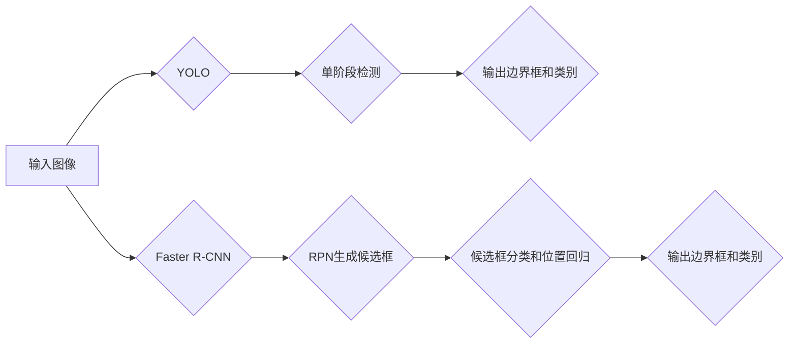

> 关键词：目标识别，YOLO，FasterR-CNN，深度学习，实时检测，目标检测，计算机视觉

# 基于YOLO和FasterR-CNN的目标识别算法研究

## 1. 背景介绍

随着计算机视觉技术的飞速发展，目标识别在安防监控、自动驾驶、智能交通等领域扮演着越来越重要的角色。目标识别的核心是目标检测，即从图像或视频中定位和识别图像中的物体。近年来，基于深度学习的目标检测算法取得了显著的突破，其中YOLO（You Only Look Once）和Faster R-CNN（Region-based Convolutional Neural Networks）是两个最具代表性的算法。

YOLO以其出色的实时性在工业和安防领域得到广泛应用，而Faster R-CNN则在准确率上达到了当时的最优水平。本文将深入探讨YOLO和Faster R-CNN的原理、实现方法和实际应用，并分析两者的优缺点及未来发展趋势。

## 2. 核心概念与联系

### 2.1 核心概念

#### YOLO
YOLO是一种单阶段目标检测算法，意味着它直接预测每个边界框（Bounding Box）的位置和类别概率，而无需进行区域提议（Region Proposal）。

#### Faster R-CNN
Faster R-CNN是一种两阶段目标检测算法，首先通过选择性搜索（Selective Search）或区域提议网络（Region Proposal Network，RPN）生成候选边界框，然后对每个候选框进行分类和位置回归。

### 2.2 架构的 Mermaid 流程图



## 3. 核心算法原理 & 具体操作步骤

### 3.1 算法原理概述

#### YOLO
YOLO通过将输入图像划分为多个grid cells，并在每个cell中预测边界框和类别概率。它使用卷积神经网络（CNN）提取图像特征，并通过共享的深度网络对所有的cells进行预测。

#### Faster R-CNN
Faster R-CNN由三个主要部分组成：RPN生成候选框、候选框分类和位置回归、非极大值抑制（NMS）。

### 3.2 算法步骤详解

#### YOLO
1. 将输入图像划分为SxS的grid cells。
2. 对每个cell，预测B个边界框和C个类别概率。
3. 对每个边界框，预测其中心点坐标和宽高，并计算置信度。
4. 应用NMS去除重叠的边界框。

#### Faster R-CNN
1. 使用RPN生成候选框。
2. 对每个候选框，使用ROI Pooling提取特征。
3. 使用Fast R-CNN对ROI特征进行分类和位置回归。
4. 应用NMS去除重叠的边界框。

### 3.3 算法优缺点

#### YOLO
**优点**：
- 实时性高，适合实时目标检测任务。
- 计算效率高，适合部署在资源受限的设备上。

**缺点**：
- 精度相对较低，尤其是在小物体检测和复杂背景中。
- 需要更多的计算资源。

#### Faster R-CNN
**优点**：
- 准确率较高，适合对检测精度要求较高的任务。

**缺点**：
- 实时性较差，不适合实时目标检测任务。
- 计算效率低，不适合部署在资源受限的设备上。

### 3.4 算法应用领域

YOLO和Faster R-CNN在许多领域都有广泛应用，例如：

- 安防监控
- 自动驾驶
- 智能交通
- 医学图像分析

## 4. 数学模型和公式 & 详细讲解 & 举例说明

### 4.1 数学模型构建

YOLO和Faster R-CNN都使用CNN作为基础模型，下面以YOLO为例进行说明。

#### 卷积神经网络（CNN）
CNN是一种前馈神经网络，由卷积层、池化层和全连接层组成。

$$
h_{l+1}(x) = \sigma(W_l \cdot h_l + b_l)
$$

其中，$h_l$ 是第l层的激活，$W_l$ 是第l层的权重，$b_l$ 是第l层的偏置，$\sigma$ 是激活函数。

#### YOLO
YOLO使用SxS的grid cells，每个cell预测B个边界框和C个类别概率。

$$
\text{output} = \begin{bmatrix}
x_{ij} & y_{ij} & w_{ij} & h_{ij} & \text{class1}_{ij} & \dots & \text{classC}_{ij} & \text{obj}_{ij}
\end{bmatrix}
$$

其中，$(x_{ij}, y_{ij})$ 是边界框中心点坐标，$(w_{ij}, h_{ij})$ 是边界框宽高，$\text{classC}_{ij}$ 是第C个类别的概率，$\text{obj}_{ij}$ 是对象存在概率。

### 4.2 公式推导过程

YOLO的损失函数由边界框损失、置信度损失和类别损失组成。

$$
L = L_{box} + L_{conf} + L_{class}
$$

其中，

$$
L_{box} = \frac{1}{N}\sum_{i=1}^N \left[\frac{1}{5} \left(\sqrt{(x_t - x_{ij})^2 + (y_t - y_{ij})^2} + \frac{1}{2} \log \frac{w_t + h_t}{w_{ij} + h_{ij}} + \frac{1}{2} \log \frac{w_t - h_t}{w_{ij} - h_{ij}}\right)^2\right]
$$

$$
L_{conf} = \frac{1}{N}\sum_{i=1}^N \left[\left(\sigma - \text{obj}_{ij}\right)^2\right]
$$

$$
L_{class} = \frac{1}{N}\sum_{i=1}^N \left[\left(\sigma_{class1} - \text{class1}_{ij}\right)^2 + \left(\sigma_{class2} - \text{class2}_{ij}\right)^2 + \dots + \left(\sigma_{classC} - \text{classC}_{ij}\right)^2\right]
$$

### 4.3 案例分析与讲解

以下是一个简单的YOLO检测过程：

1. 输入图像经过CNN提取特征。
2. 每个cell预测边界框和类别概率。
3. 应用NMS去除重叠的边界框。
4. 输出最终的检测结果。

## 5. 项目实践：代码实例和详细解释说明

### 5.1 开发环境搭建

1. 安装TensorFlow或PyTorch等深度学习框架。
2. 下载预训练的YOLO或Faster R-CNN模型。
3. 准备测试图像。

### 5.2 源代码详细实现

以下是一个使用YOLO进行目标检测的简单示例：

```python
import cv2
import numpy as np
from tensorflow.keras.models import load_model

# 加载预训练模型
model = load_model('yolo.h5')

# 读取测试图像
image = cv2.imread('test.jpg')

# 预处理图像
image = cv2.resize(image, (416, 416))
image = image / 255.0

# 预测
predictions = model.predict(np.expand_dims(image, axis=0))

# 解析预测结果
boxes = predictions[:, :4]
confidences = predictions[:, 4]
class_ids = predictions[:, 5]

# 应用NMS
boxes, confidences, class_ids = nms(boxes, confidences, class_ids, 0.5)

# 绘制检测框
for box, confidence, class_id in zip(boxes, confidences, class_ids):
    cv2.rectangle(image, (int(box[0]), int(box[1])), (int(box[2]), int(box[3])), (0, 255, 0), 2)

# 显示检测结果
cv2.imshow('Image', image)
cv2.waitKey(0)
```

### 5.3 代码解读与分析

以上代码展示了如何使用TensorFlow加载YOLO模型，并对图像进行目标检测。首先，加载预训练模型，然后读取测试图像并进行预处理。接着，使用模型进行预测，并解析预测结果。最后，应用NMS去除重叠的边界框，并绘制检测框。

### 5.4 运行结果展示

运行上述代码后，会显示一个带有检测框的测试图像。

## 6. 实际应用场景

YOLO和Faster R-CNN在许多实际应用场景中都取得了成功，以下是一些例子：

- 安防监控：实时检测视频中的异常行为，如打架、吸烟等。
- 自动驾驶：检测道路上的车辆、行人、障碍物等，确保行车安全。
- 智能交通：识别交通标志、行驶方向等，实现智能交通管理。
- 医学图像分析：检测图像中的病变、器官等，辅助医生进行诊断。

## 7. 工具和资源推荐

### 7.1 学习资源推荐

- 《深度学习》
- 《目标检测：原理与实战》
- YOLO和Faster R-CNN的论文和代码

### 7.2 开发工具推荐

- TensorFlow或PyTorch等深度学习框架
- OpenCV等计算机视觉库

### 7.3 相关论文推荐

- YOLO：You Only Look Once: Unified, Real-Time Object Detection
- Faster R-CNN: Faster R-CNN: Towards Real-Time Object Detection with Region Proposal Networks

## 8. 总结：未来发展趋势与挑战

### 8.1 研究成果总结

YOLO和Faster R-CNN是目标检测领域的两个重要算法，分别代表了单阶段和两阶段检测方法。它们在实时性和准确性之间取得了平衡，并在许多实际应用场景中取得了成功。

### 8.2 未来发展趋势

- 单阶段检测算法的准确性将进一步提高，与两阶段检测算法的差距将缩小。
- 基于深度学习的目标检测算法将更加高效，能够适应更广泛的硬件平台。
- 目标检测算法将与其他人工智能技术（如语义分割、实例分割）进行融合，构建更加复杂的计算机视觉系统。

### 8.3 面临的挑战

- 检测精度和速度之间的平衡是一个挑战，需要在算法设计和硬件优化上寻求新的突破。
- 目标检测算法的泛化能力需要进一步提升，以适应更多样化的场景和任务。
- 目标检测算法的鲁棒性和可解释性需要加强，以应对各种干扰和异常情况。

### 8.4 研究展望

随着深度学习技术的不断发展，目标检测算法将取得更大的突破，为人工智能在各个领域的应用提供更加强大的支持。

## 9. 附录：常见问题与解答

**Q1：YOLO和Faster R-CNN的主要区别是什么？**

A：YOLO是一种单阶段检测算法，直接预测边界框和类别概率，而Faster R-CNN是一种两阶段检测算法，首先通过RPN生成候选框，然后对每个候选框进行分类和位置回归。

**Q2：如何选择YOLO和Faster R-CNN？**

A：如果实时性是关键需求，可以选择YOLO。如果检测精度更重要，可以选择Faster R-CNN。

**Q3：如何提高目标检测算法的准确性？**

A：可以通过以下方法提高目标检测算法的准确性：
- 使用更大的预训练模型。
- 使用更多的训练数据。
- 使用更有效的数据增强方法。
- 使用更先进的算法模型。

**Q4：目标检测算法在哪些领域有应用？**

A：目标检测算法在安防监控、自动驾驶、智能交通、医学图像分析等领域有广泛应用。

---

作者：禅与计算机程序设计艺术 / Zen and the Art of Computer Programming