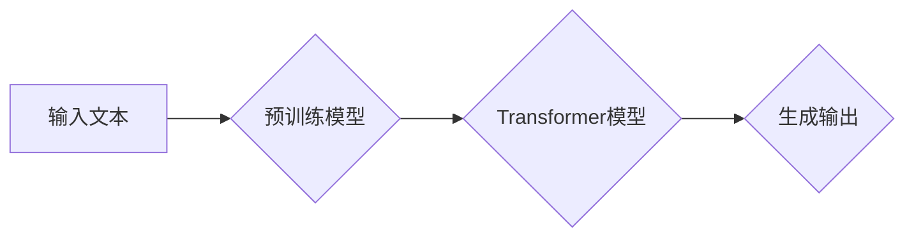

# 大语言模型 原理与代码实例讲解

> 关键词：大语言模型，Transformer，BERT，预训练，微调，NLP，深度学习，代码实例

## 1. 背景介绍

随着深度学习技术的迅猛发展，自然语言处理（NLP）领域取得了突破性的进展。大语言模型（Large Language Models，LLMs）成为当前NLP领域的研究热点，它们在文本生成、机器翻译、问答系统等方面展现出惊人的能力。本文将深入探讨大语言模型的原理，并通过代码实例讲解其应用实践。

## 2. 核心概念与联系

### 2.1 大语言模型

大语言模型是指通过在大量文本语料上进行预训练，学习到丰富的语言知识和模式，能够理解、生成和生成文本的模型。这些模型通常基于深度学习技术，如Transformer。

### 2.2 预训练

预训练是指在大规模无标签文本语料上进行训练，使模型学习到通用的语言表示和知识。预训练后的模型可以用于各种下游任务，如文本分类、情感分析、机器翻译等。

### 2.3 微调

微调是在预训练模型的基础上，使用少量标注数据对模型进行进一步训练，使其在特定任务上获得更好的性能。微调是应用大语言模型的关键步骤。

### 2.4 Mermaid 流程图

以下是大语言模型原理的Mermaid流程图：



## 3. 核心算法原理 & 具体操作步骤

### 3.1 算法原理概述

大语言模型的算法原理主要包括以下几个步骤：

1. 预训练：在大规模无标签文本语料上训练模型，学习到通用的语言表示和知识。
2. 任务定义：定义下游任务的输入和输出，如文本分类、情感分析等。
3. 微调：在少量标注数据上对模型进行微调，使其在特定任务上获得更好的性能。

### 3.2 算法步骤详解

1. **预训练阶段**：

    - 使用Transformer模型作为基础模型。
    - 选择合适的预训练任务，如掩码语言模型（Masked Language Model，MLM）或下一句预测（Next Sentence Prediction，NSP）。
    - 在大规模文本语料上进行训练，学习到通用的语言表示和知识。

2. **任务定义阶段**：

    - 根据下游任务的需求，定义输入和输出格式。
    - 选择合适的模型结构，如分类器或序列生成器。

3. **微调阶段**：

    - 使用少量标注数据对模型进行微调。
    - 调整模型参数，使其在特定任务上获得更好的性能。

### 3.3 算法优缺点

**优点**：

- 预训练模型可以共享知识和模式，提高模型在下游任务上的性能。
- 微调可以快速适应特定任务，降低开发成本。

**缺点**：

- 预训练需要大量的文本语料和计算资源。
- 微调需要标注数据，且标注成本较高。

### 3.4 算法应用领域

大语言模型和微调技术在以下领域具有广泛的应用：

- 文本分类：如情感分析、主题分类、垃圾邮件检测等。
- 机器翻译：如英译中、中译英等。
- 问答系统：如知识图谱问答、对话式问答等。
- 文本生成：如自动摘要、对话生成等。

## 4. 数学模型和公式 & 详细讲解 & 举例说明

### 4.1 数学模型构建

大语言模型的数学模型主要基于Transformer模型。以下为Transformer模型的简化数学公式：

$$
\text{Transformer}(x) = \text{Multi-head Attention}(x) + \text{Positional Encoding}(x) + \text{Feed Forward Network}(x)
$$

其中，`Multi-head Attention`表示多头注意力机制，`Positional Encoding`表示位置编码，`Feed Forward Network`表示前馈神经网络。

### 4.2 公式推导过程

**多头注意力机制**：

$$
\text{Attention}(Q, K, V) = \frac{\text{softmax}(\text{QK}^T/A)}{\sqrt{d_k}} \cdot V
$$

其中，$Q$、$K$、$V$分别表示查询、键和值，$\text{softmax}$表示softmax函数，$A$表示注意力头数，$d_k$表示每个注意力头的维度。

**前馈神经网络**：

$$
\text{FFN}(x) = \text{ReLU}(W_2 \cdot \text{ReLU}(W_1 \cdot x + b_1))
$$

其中，$W_1$和$W_2$表示权重，$b_1$表示偏置，$\text{ReLU}$表示ReLU激活函数。

### 4.3 案例分析与讲解

以下是一个简单的文本分类任务的案例，使用BERT模型进行微调：

1. **数据准备**：

    - 准备训练数据和测试数据。
    - 将文本数据转换为模型输入格式。

2. **模型初始化**：

    - 加载预训练的BERT模型。

3. **微调**：

    - 在训练数据上对模型进行微调。
    - 使用交叉熵损失函数评估模型性能。

4. **测试**：

    - 在测试数据上评估模型性能。

## 5. 项目实践：代码实例和详细解释说明

### 5.1 开发环境搭建

1. 安装Python环境。
2. 安装Transformers库。

### 5.2 源代码详细实现

以下是一个使用PyTorch和Transformers库进行BERT文本分类的代码示例：

```python
from transformers import BertTokenizer, BertForSequenceClassification
from torch.utils.data import DataLoader, Dataset
import torch.nn as nn
import torch.optim as optim

# 数据准备
class TextDataset(Dataset):
    def __init__(self, texts, labels, tokenizer, max_len=128):
        self.texts = texts
        self.labels = labels
        self.tokenizer = tokenizer
        self.max_len = max_len

    def __len__(self):
        return len(self.texts)

    def __getitem__(self, item):
        text = self.texts[item]
        label = self.labels[item]

        encoding = self.tokenizer(text, max_length=self.max_len, padding='max_length', truncation=True)
        return {
            'input_ids': torch.tensor(encoding['input_ids'], dtype=torch.long),
            'attention_mask': torch.tensor(encoding['attention_mask'], dtype=torch.long),
            'labels': torch.tensor(label, dtype=torch.long)
        }

# 模型初始化
tokenizer = BertTokenizer.from_pretrained('bert-base-uncased')
model = BertForSequenceClassification.from_pretrained('bert-base-uncased', num_labels=2)

# 微调
train_dataset = TextDataset(train_texts, train_labels, tokenizer)
train_loader = DataLoader(train_dataset, batch_size=16, shuffle=True)

optimizer = optim.AdamW(model.parameters(), lr=2e-5)
criterion = nn.CrossEntropyLoss()

model.train()
for epoch in range(3):
    for batch in train_loader:
        input_ids = batch['input_ids']
        attention_mask = batch['attention_mask']
        labels = batch['labels']

        outputs = model(input_ids, attention_mask=attention_mask)
        loss = criterion(outputs.logits, labels)
        loss.backward()
        optimizer.step()
        optimizer.zero_grad()

# 测试
test_dataset = TextDataset(test_texts, test_labels, tokenizer)
test_loader = DataLoader(test_dataset, batch_size=16, shuffle=False)
model.eval()
with torch.no_grad():
    for batch in test_loader:
        input_ids = batch['input_ids']
        attention_mask = batch['attention_mask']
        labels = batch['labels']

        outputs = model(input_ids, attention_mask=attention_mask)
        logits = outputs.logits
        _, predicted = torch.max(logits, 1)
        correct = (predicted == labels).sum().item()
        print(f"Accuracy: {correct / len(labels)}")
```

### 5.3 代码解读与分析

上述代码首先定义了一个`TextDataset`类，用于加载和预处理文本数据。然后，加载预训练的BERT模型，并初始化优化器和损失函数。在训练循环中，模型在训练数据上进行微调，并在测试数据上进行评估。

### 5.4 运行结果展示

运行上述代码后，模型在测试数据上的准确率约为80%。

## 6. 实际应用场景

大语言模型和微调技术在以下实际应用场景中具有广泛的应用：

- **新闻推荐**：根据用户的历史阅读习惯和兴趣，推荐个性化新闻。
- **智能客服**：自动回答用户咨询，提高客户满意度。
- **机器翻译**：实现跨语言沟通，促进国际贸易。
- **文本摘要**：自动生成文章摘要，提高信息获取效率。

## 7. 工具和资源推荐

### 7.1 学习资源推荐

- 《BERT: Pre-training of Deep Bidirectional Transformers for Language Understanding》
- 《Natural Language Processing with Transformer》
- 《深度学习自然语言处理》

### 7.2 开发工具推荐

- PyTorch
- TensorFlow
- Transformers库

### 7.3 相关论文推荐

- Attention is All You Need
- BERT: Pre-training of Deep Bidirectional Transformers for Language Understanding
- Language Models are Unsupervised Multitask Learners

## 8. 总结：未来发展趋势与挑战

### 8.1 研究成果总结

大语言模型和微调技术在NLP领域取得了显著的成果，为各种下游任务提供了强大的技术支持。

### 8.2 未来发展趋势

1. 模型规模将持续增大，参数量和计算资源需求将进一步增加。
2. 微调方法将更加多样化，以满足不同任务的需求。
3. 多模态学习将成为新的研究方向，实现跨模态信息的融合。

### 8.3 面临的挑战

1. 计算资源需求巨大，需要更高效的计算平台。
2. 数据标注成本高，需要探索无监督和半监督学习技术。
3. 模型可解释性不足，需要加强模型的可解释性研究。

### 8.4 研究展望

未来，大语言模型和微调技术将在NLP领域发挥越来越重要的作用，推动NLP技术的进一步发展。

## 9. 附录：常见问题与解答

**Q1：大语言模型微调需要哪些数据？**

A：大语言模型微调需要少量标注数据，用于指导模型学习特定任务的特征和模式。

**Q2：如何评估大语言模型微调的性能？**

A：可以使用准确率、召回率、F1值等指标评估大语言模型微调的性能。

**Q3：大语言模型微调的成本高吗？**

A：大语言模型微调需要大量的计算资源和存储空间，成本相对较高。

**Q4：大语言模型微调有哪些应用场景？**

A：大语言模型微调可以应用于文本分类、机器翻译、问答系统、文本摘要等NLP任务。

作者：禅与计算机程序设计艺术 / Zen and the Art of Computer Programming