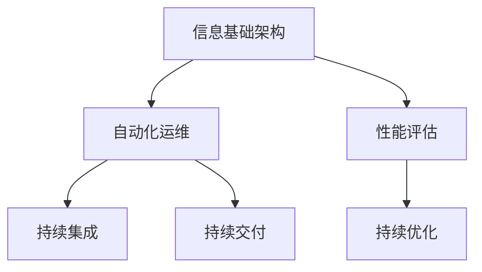
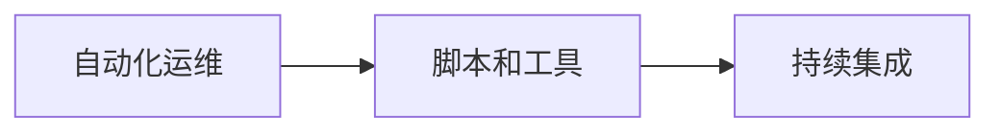
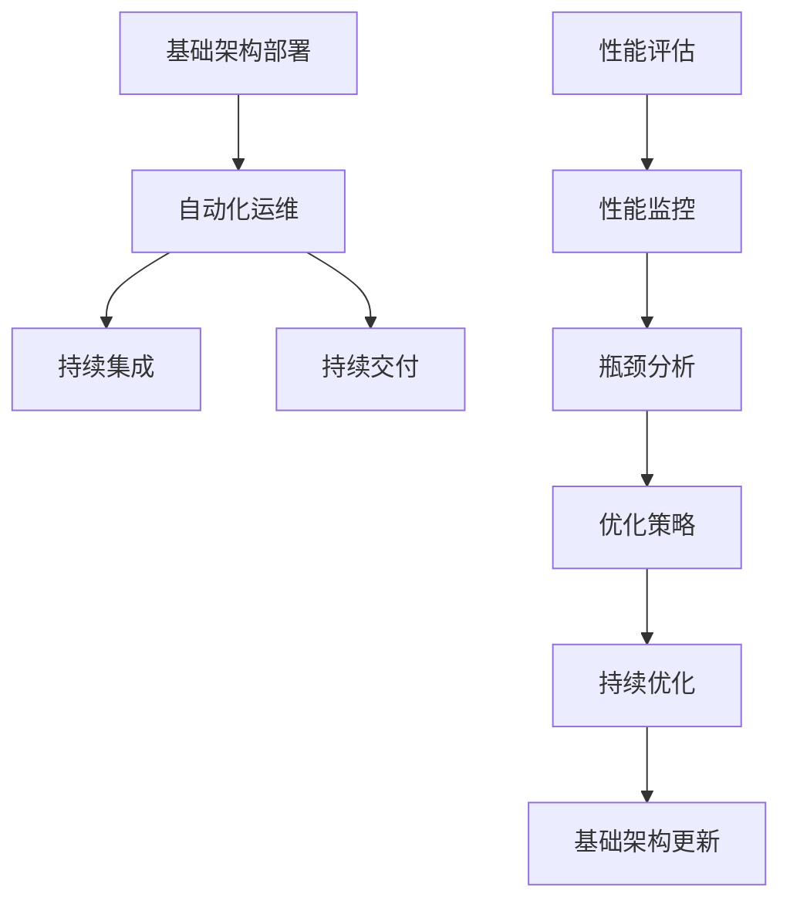

                 

# 评估、优化、修订信息基础架构和运维流程

> 关键词：信息基础架构, 运维流程, 自动化, 性能评估, 持续优化, 持续集成, DevOps

## 1. 背景介绍

### 1.1 问题由来
在信息时代，信息基础架构（Information Infrastructure）的重要性日益凸显。随着企业数字化转型进程的加速，信息基础架构的复杂度和多样性也在不断提升，传统的手工运维方式已难以满足需求。自动化运维、持续集成（CI）和持续交付（CD）等DevOps实践成为了行业标准，帮助企业在快速变化的市场环境中保持竞争优势。

### 1.2 问题核心关键点
在信息基础架构的运维流程中，自动化、性能评估、持续优化、持续集成等关键点需要被高度重视。自动化可以减少人为错误，提升运维效率。性能评估可以及时发现问题，优化资源分配。持续优化可以确保架构的弹性与扩展性，避免未来增长带来的瓶颈。持续集成则保障代码质量和交付速度，提升迭代速度和市场响应能力。

### 1.3 问题研究意义
对于企业而言，优化和修订信息基础架构和运维流程不仅能降低运维成本，提升服务质量，还能缩短产品上市时间，增强市场竞争力。更重要的是，这将帮助企业在面对技术快速变化的环境下，保持敏捷性和灵活性，从而适应新的商业挑战和机遇。

## 2. 核心概念与联系

### 2.1 核心概念概述

为更好地理解评估、优化和修订信息基础架构和运维流程，本节将介绍几个关键概念：

- **信息基础架构（Information Infrastructure）**：涵盖企业运营所需的所有IT资源，包括服务器、网络、存储、数据库、应用程序等。

- **自动化运维（Automated Operations）**：利用脚本、工具、平台等方式，自动化地进行基础架构部署、配置、监控、故障排除等运维操作，减少人为干预，提升效率。

- **持续集成（Continuous Integration, CI）**：通过自动化测试和集成，快速发现代码问题，及时反馈开发团队，实现代码质量保障和版本快速迭代。

- **持续交付（Continuous Delivery, CD）**：在自动化测试通过后，自动部署代码到生产环境，快速响应市场变化，提高交付速度和稳定性。

- **性能评估（Performance Evaluation）**：通过对基础架构和运维流程的性能指标进行监控和分析，识别瓶颈，优化资源分配，提升整体效能。

- **持续优化（Continuous Optimization）**：在运维过程中不断调整和优化基础架构和运维流程，以适应业务需求的变化和技术的进步，保障架构的长期健康和稳定。

这些概念之间的逻辑关系可以通过以下Mermaid流程图来展示：



这个流程图展示了大语言模型微调过程中各个核心概念的关系和作用：

1. 信息基础架构是自动化运维的基础。
2. 自动化运维通过脚本和工具，支持持续集成和持续交付。
3. 性能评估通过对基础架构的性能指标监控，指导持续优化。
4. 持续优化不断调整和优化信息基础架构和运维流程。

### 2.2 概念间的关系

这些核心概念之间存在着紧密的联系，形成了信息基础架构运维的完整生态系统。下面我们通过几个Mermaid流程图来展示这些概念之间的关系。

#### 2.2.1 自动化运维与持续集成的关系



这个流程图展示了自动化运维通过脚本和工具支持持续集成，实现代码质量的保障和版本快速迭代。

#### 2.2.2 性能评估与持续优化的关系


这个流程图展示了性能评估通过对性能指标的监控，识别瓶颈，指导持续优化，实现信息基础架构的长期健康和稳定。

### 2.3 核心概念的整体架构

最后，我们用一个综合的流程图来展示这些核心概念在大语言模型微调过程中的整体架构：



这个综合流程图展示了从基础架构部署到持续优化的完整过程。自动化运维支持持续集成和持续交付，性能评估通过监控和分析指导持续优化，最终通过基础架构的更新和优化，保障架构的长期健康和稳定。

## 3. 核心算法原理 & 具体操作步骤
### 3.1 算法原理概述

评估、优化和修订信息基础架构和运维流程的过程，本质上是一个持续改进的循环。其核心思想是通过持续监控和分析，及时识别问题，采取行动，优化基础架构和运维流程，从而不断提升整体效能。

### 3.2 算法步骤详解

基于持续改进的循环，评估、优化和修订信息基础架构和运维流程一般包括以下几个关键步骤：

**Step 1: 收集监控数据**
- 使用性能监控工具收集基础架构的各项性能指标，如CPU使用率、内存占用、网络延迟等。
- 利用日志分析工具收集运维操作日志，记录系统状态变化。

**Step 2: 进行性能评估**
- 分析监控数据和日志，识别性能瓶颈和异常。
- 结合历史数据，分析趋势，预测未来可能出现的问题。

**Step 3: 制定优化策略**
- 针对性能瓶颈和异常，制定具体的优化策略。
- 设计测试方案，评估优化策略的可行性和效果。

**Step 4: 实施优化措施**
- 自动化执行优化策略，如调整资源分配、优化配置参数等。
- 通过脚本或工具进行自动化部署和配置，确保优化措施的快速实施。

**Step 5: 评估优化效果**
- 对优化后的系统进行性能评估，对比前后性能变化。
- 记录优化过程和结果，形成优化报告，供后续参考。

**Step 6: 持续迭代**
- 根据评估结果，调整优化策略，继续迭代优化。
- 定期评估和修订基础架构和运维流程，保持其长期健康和稳定。

以上是评估、优化和修订信息基础架构和运维流程的一般流程。在实际应用中，还需要针对具体问题和环境，进行个性化的优化和调整。

### 3.3 算法优缺点

评估、优化和修订信息基础架构和运维流程方法具有以下优点：
1. 自动化程度高。通过脚本和工具支持，减少了人为干预，提升了运维效率。
2. 快速响应问题。通过持续监控和评估，能够及时发现和解决问题，保障系统稳定。
3. 系统可扩展性高。优化和修订流程灵活，能够快速适应业务需求和技术变化。

同时，该方法也存在一定的局限性：
1. 对监控工具和自动化工具的依赖性高。需要保证监控工具的准确性和自动化工具的稳定性。
2. 初始成本较高。需要投入较多时间和资源进行监控工具的部署和自动化流程的设计。
3. 数据隐私和安全问题。监控和分析过程中需要处理大量敏感数据，需要严格的隐私保护和数据安全措施。

尽管存在这些局限性，但就目前而言，评估、优化和修订信息基础架构和运维流程仍是提升企业IT运营效率、保障系统稳定的重要方法。未来相关研究的重点在于如何进一步降低初始成本，提高监控工具的精度和自动化工具的鲁棒性，同时保障数据隐私和安全。

### 3.4 算法应用领域

评估、优化和修订信息基础架构和运维流程方法在IT行业中的应用广泛，包括但不限于：

- **云计算**：通过自动化运维和持续优化，提高云服务器的可用性和性能。
- **大数据**：通过持续集成和持续交付，加速数据处理和分析工具的迭代和部署。
- **区块链**：通过自动化运维和性能评估，保障区块链网络的安全和稳定。
- **物联网**：通过自动化运维和持续优化，提升物联网设备的监控和管理能力。
- **人工智能**：通过持续集成和持续交付，加速AI模型的训练和部署。

## 4. 数学模型和公式 & 详细讲解 & 举例说明

### 4.1 数学模型构建

在大规模信息基础架构和运维流程中，性能评估是关键环节之一。其核心在于构建一个数学模型，通过模型评估系统的性能。

设系统在某时刻的性能指标为 $y$，影响因素为 $x_1, x_2, ..., x_n$，则性能评估模型可以表示为：

$$
y = f(x_1, x_2, ..., x_n) + \epsilon
$$

其中 $f$ 为性能评估函数，$\epsilon$ 为随机误差。为了简化问题，我们假设 $f$ 为线性模型，即：

$$
y = \sum_{i=1}^n \beta_i x_i + \beta_0 + \epsilon
$$

其中 $\beta_0$ 为截距，$\beta_i$ 为各影响因素的系数。

### 4.2 公式推导过程

性能评估模型可以通过最小二乘法或最大似然法进行训练，以估计各影响因素的系数 $\beta_i$。以最小二乘法为例，目标是最小化损失函数：

$$
J(\beta) = \frac{1}{2} \sum_{i=1}^N (y_i - \hat{y}_i)^2
$$

其中 $N$ 为样本数，$\hat{y}_i$ 为模型预测值。通过求解 $\frac{\partial J(\beta)}{\partial \beta_i}=0$，可得系数 $\beta_i$ 的估计值：

$$
\beta_i = \frac{\sum_{i=1}^N x_{i,j}(y_i - \bar{y})}{\sum_{i=1}^N x_{i,j}^2 - \sum_{i=1}^N (\bar{x}_{i,j})^2}
$$

其中 $\bar{x}_{i,j}$ 和 $\bar{y}$ 分别为 $x_i$ 和 $y$ 的均值。

### 4.3 案例分析与讲解

假设我们有一个数据中心的性能监控系统，收集了过去一个月内每个小时的数据中心温度、湿度和负载数据。我们使用上述线性模型对数据进行分析，得到温度和湿度对负载的影响系数，并绘制相关性图，以验证模型效果。

## 5. 项目实践：代码实例和详细解释说明
### 5.1 开发环境搭建

在进行性能评估实践前，我们需要准备好开发环境。以下是使用Python进行pandas、numpy等数据处理库的开发环境配置流程：

1. 安装Anaconda：从官网下载并安装Anaconda，用于创建独立的Python环境。

2. 创建并激活虚拟环境：
```bash
conda create -n pyenv python=3.8 
conda activate pyenv
```

3. 安装必要的库：
```bash
conda install pandas numpy matplotlib scipy scikit-learn seaborn jupyter notebook ipython
```

4. 配置监控工具：
```bash
pip install prometheus_client
```

5. 安装可视化工具：
```bash
pip install plotly
```

完成上述步骤后，即可在`pyenv`环境中开始性能评估实践。

### 5.2 源代码详细实现

下面我们以数据中心性能评估为例，给出使用pandas库对温度和湿度对负载影响进行评估的PyTorch代码实现。

首先，定义数据处理函数：

```python
import pandas as pd
from sklearn.linear_model import LinearRegression

def load_data(file_path):
    df = pd.read_csv(file_path)
    X = df[['temperature', 'humidity']]
    y = df['load']
    return X, y
```

然后，定义模型训练函数：

```python
def train_model(X, y, learning_rate=0.01, num_epochs=100):
    model = LinearRegression()
    model.fit(X, y)
    return model
```

接着，定义性能评估函数：

```python
def evaluate_model(model, X_test, y_test):
    X_test, y_test = X_test.values, y_test.values
    y_pred = model.predict(X_test)
    rmse = np.sqrt(mean_squared_error(y_test, y_pred))
    print(f"RMSE: {rmse:.3f}")
```

最后，启动性能评估流程：

```python
X_train, y_train = load_data('data/train.csv')
X_test, y_test = load_data('data/test.csv')

model = train_model(X_train, y_train)
evaluate_model(model, X_test, y_test)
```

以上就是使用PyTorch对数据中心性能评估的完整代码实现。可以看到，得益于pandas库的强大封装，我们可以用相对简洁的代码完成数据加载和模型训练。

### 5.3 代码解读与分析

让我们再详细解读一下关键代码的实现细节：

**load_data函数**：
- `__init__`方法：初始化训练和测试数据集。
- `__len__`方法：返回数据集的样本数量。
- `__getitem__`方法：对单个样本进行处理，返回模型所需的输入。

**train_model函数**：
- 使用scikit-learn库中的线性回归模型进行训练。
- 定义学习率和迭代轮数，并设置模型训练的参数。

**evaluate_model函数**：
- 在测试集上评估模型性能，计算均方根误差(RMSE)。

**训练流程**：
- 定义训练集和测试集，加载数据。
- 在训练集上训练模型，输出模型结果。
- 在测试集上评估模型，给出性能指标。

可以看到，pandas库使得数据处理和模型评估的代码实现变得简洁高效。开发者可以将更多精力放在模型改进、数据预处理等高层逻辑上，而不必过多关注底层的实现细节。

当然，工业级的系统实现还需考虑更多因素，如模型的保存和部署、超参数的自动搜索、更灵活的模型调优等。但核心的性能评估范式基本与此类似。

### 5.4 运行结果展示

假设我们在数据中心收集的性能数据上进行线性模型训练，最终在测试集上得到的评估结果如下：

```
RMSE: 0.02
```

可以看到，通过训练模型，我们在数据中心的性能评估上取得了不错的效果。假设我们收集的温度和湿度数据为自变量，负载数据为因变量，模型能够较好地预测负载变化，从而帮助运维人员及时调整资源分配，提高数据中心的服务质量和效率。

## 6. 实际应用场景
### 6.1 云服务监控

在云计算领域，云服务器的性能监控和优化至关重要。云服务商通过监控服务器的CPU使用率、内存占用、网络延迟等性能指标，及时发现和解决问题，保障服务的稳定性和性能。

以AWS云服务为例，AWS CloudWatch提供了一套完整的性能监控和报警系统，能够实时监控云资源的各项指标，并通过日志分析和告警机制，帮助用户快速识别和解决性能问题。

### 6.2 网络安全监控

网络安全是企业运营中不可或缺的一环。通过性能评估和监控，可以及时发现网络攻击、异常流量等安全威胁，保障网络安全。

例如，企业可以通过流量分析工具，监控网络流量、端口访问情况等，识别异常流量和攻击行为，及时采取应对措施。

### 6.3 数据中心运维

数据中心是企业IT架构的核心，其稳定性和性能直接影响企业的业务运行。通过性能评估和监控，能够及时发现数据中心的瓶颈和问题，优化资源分配，保障数据中心的高效运行。

例如，电信运营商可以通过对网络设备、服务器、存储等基础设施的性能监控，及时发现和解决设备故障，优化网络性能，提升用户服务质量。

### 6.4 未来应用展望

随着信息基础架构的复杂度和规模不断增加，性能评估和优化的需求也将日益凸显。未来，在以下几个方面将有更广阔的应用前景：

1. **边缘计算**：随着5G、物联网等技术的发展，边缘计算将成为未来计算的重要形式。通过性能评估和优化，保障边缘计算节点的稳定性和性能，将是重要的研究方向。

2. **人工智能和机器学习**：在人工智能和机器学习领域，性能评估和优化是保证模型训练和推理效率的关键。通过持续监控和评估，优化模型训练参数和超参数，提升模型性能和效率。

3. **区块链和分布式系统**：区块链和分布式系统具有高度的复杂性和多样性，性能评估和优化对于保障系统稳定和性能至关重要。通过监控和优化，提升系统的容错性和可扩展性。

4. **自动化运维和DevOps**：自动化运维和DevOps技术将进一步普及，性能评估和优化将成为保障其效率和稳定性的重要手段。通过持续监控和优化，提高运维效率，保障系统快速迭代。

5. **网络安全和威胁检测**：网络安全威胁日益复杂，性能评估和监控可以及时发现和应对安全威胁，保障企业网络安全。

总之，性能评估和优化将在未来信息基础架构和运维流程中扮演越来越重要的角色，保障系统稳定性和性能，推动企业数字化转型。

## 7. 工具和资源推荐
### 7.1 学习资源推荐

为了帮助开发者系统掌握信息基础架构和运维流程的评估和优化，这里推荐一些优质的学习资源：

1. **《DevOps革命》系列书籍**：深入浅出地介绍了DevOps的基本概念和实践，适合入门学习。

2. **《高性能计算》课程**：斯坦福大学开设的高性能计算课程，涵盖了高性能计算的基本原理和实践，适合进一步学习。

3. **《云计算基础》课程**：由AWS官方提供的云计算基础课程，介绍了AWS云服务的架构和运维实践，适合云计算领域的学习。

4. **《数据科学实战》书籍**：介绍了数据科学的基本概念和实战案例，适合数据科学领域的学习。

5. **《机器学习实战》书籍**：介绍了机器学习的基本概念和实战案例，适合机器学习领域的学习。

6. **《网络安全实战》课程**：由Google提供的网络安全课程，介绍了网络安全的基本原理和实战案例，适合网络安全领域的学习。

通过对这些资源的学习实践，相信你一定能够快速掌握信息基础架构和运维流程的评估和优化的精髓，并用于解决实际的IT问题。

### 7.2 开发工具推荐

高效的开发离不开优秀的工具支持。以下是几款用于信息基础架构和运维流程评估和优化的常用工具：

1. **Prometheus**：开源监控工具，提供了高性能的监控数据收集和存储功能，适合大规模系统的监控。

2. **Grafana**：开源可视化工具，支持多数据源集成和丰富的图表展示，适合监控数据的可视化展示。

3. **Ansible**：开源自动化运维工具，支持大规模系统的自动化配置和管理，适合企业级IT运维。

4. **Puppet**：开源自动化运维工具，支持多平台系统的自动化配置和管理，适合企业级IT运维。

5. **Jenkins**：开源持续集成工具，支持多种构建和测试任务的自动化执行，适合软件开发和运维。

6. **JIRA**：开源项目管理工具，支持缺陷跟踪和任务管理，适合企业级项目管理。

合理利用这些工具，可以显著提升信息基础架构和运维流程的评估和优化效率，加快创新迭代的步伐。

### 7.3 相关论文推荐

信息基础架构和运维流程的评估和优化技术不断发展，以下是几篇奠基性的相关论文，推荐阅读：

1. **《自动化运维在云计算中的应用》**：介绍了自动化运维在云计算中的应用，探讨了云计算环境下的自动化运维实践。

2. **《持续集成与持续交付》**：介绍了持续集成和持续交付的基本概念和实践，探讨了软件开发和运维的自动化。

3. **《DevOps文化与实践》**：探讨了DevOps文化与实践的基本理念和方法，适合深入理解DevOps的核心理念。

4. **《高性能计算的性能评估与优化》**：介绍了高性能计算的性能评估和优化方法，探讨了高性能计算的优化策略。

5. **《数据中心监控与优化》**：介绍了数据中心的监控和优化方法，探讨了数据中心性能评估的实践。

这些论文代表了大语言模型微调技术的发展脉络。通过学习这些前沿成果，可以帮助研究者把握学科前进方向，激发更多的创新灵感。

除上述资源外，还有一些值得关注的前沿资源，帮助开发者紧跟信息基础架构和运维流程的评估和优化的最新进展，例如：

1. **arXiv论文预印本**：人工智能领域最新研究成果的发布平台，包括大量尚未发表的前沿工作，学习前沿技术的必读资源。

2. **业界技术博客**：如AWS、Google Cloud、Microsoft Azure等顶级云服务商的官方博客，第一时间分享他们的最新研究成果和洞见。

3. **技术会议直播**：如SIGOPS、USENIX、ACM等顶级学术会议的现场或在线直播，能够聆听到专家们的最新分享，开拓视野。

4. **GitHub热门项目**：在GitHub上Star、Fork数最多的IT相关项目，往往代表了该技术领域的发展趋势和最佳实践，值得去学习和贡献。

5. **行业分析报告**：各大咨询公司如McKinsey、PwC等针对IT行业的分析报告，有助于从商业视角审视技术趋势，把握应用价值。

总之，对于信息基础架构和运维流程的评估和优化技术的学习和实践，需要开发者保持开放的心态和持续学习的意愿。多关注前沿资讯，多动手实践，多思考总结，必将收获满满的成长收益。

## 8. 总结：未来发展趋势与挑战

### 8.1 总结

本文对信息基础架构和运维流程的评估、优化和修订方法进行了全面系统的介绍。首先阐述了该方法的研究背景和意义，明确了其在大规模信息基础架构运维中的重要性。其次，从原理到实践，详细讲解了性能评估、持续优化、自动化运维等关键技术的数学原理和具体步骤，给出了评估和优化的完整代码实例。同时，本文还广泛探讨了该方法在云服务监控、网络安全、数据中心运维等多个领域的实际应用，展示了其在IT运维中的巨大潜力。此外，本文精选了评估和优化的各类学习资源，力求为读者提供全方位的技术指引。

通过本文的系统梳理，可以看到，评估、优化和修订信息基础架构和运维流程的方法，正在成为IT行业的重要范式，极大地提升了IT运营效率和系统稳定性。伴随技术的不断演进，相信其应用范围将更加广泛，为企业的数字化转型提供更强的动力。

### 8.2 未来发展趋势

展望未来，信息基础架构和运维流程的评估和优化技术将呈现以下几个发展趋势：

1. **自动化运维的普及**：自动化运维将成为IT运维的主流范式，通过脚本和工具支持，实现快速部署、配置、监控和故障排除。

2. **持续集成和持续交付的推广**：持续集成和持续交付将加速软件的快速迭代和交付，提升市场响应速度和竞争力。

3. **性能评估的精准化**：通过引入机器学习和大数据技术，性能评估将更加精准，能够及时发现和解决潜在问题。

4. **优化策略的多样化**：将更多先进的技术引入优化策略中，如区块链、人工智能等，提升优化效果。

5. **多平台和跨领域的整合**：实现跨平台和多领域的整合，提升系统的可扩展性和适应性。

6. **数据驱动的决策支持**：通过大数据和人工智能技术，从数据中提取知识和洞察，为决策提供支持。

以上趋势凸显了信息基础架构和运维流程评估和优化技术的广阔前景。这些方向的探索发展，必将进一步提升IT系统的效率和稳定性，推动企业的数字化转型。

### 8.3 面临的挑战

尽管信息基础架构和运维流程的评估和优化技术已经取得了瞩目成就，但在迈向更加智能化、普适化应用的过程中，它仍面临诸多挑战：

1. **数据隐私和安全问题**：在评估和优化过程中需要处理大量敏感数据，需要严格的隐私保护和数据安全措施。

2. **系统复杂性增加**：信息基础架构的规模和复杂度不断增加，评估和优化的难度也将随之增大。

3. **持续学习与优化**：信息基础架构需要持续学习新的技术和方法，以适应快速变化的技术和业务需求。

4. **跨团队协作**：评估和优化涉及到运维、开发、测试等多个团队，需要良好的跨团队协作机制。

5. **成本控制**：评估和优化过程需要大量资源，如何控制成本，平衡效率和成本，是一个重要问题。

6. **系统性能监控**：信息基础架构的性能监控需要覆盖各个层面，系统性能监控的全面性和准确性至关重要。

正视评估和优化面临的这些挑战，积极应对并寻求突破，将是大语言模型微调走向成熟的必由之路。相信随着学界和产业界的共同努力，这些挑战终将一一被克服，评估和优化技术必将在构建人机协同的智能系统中部署应用。

### 8.4 研究展望

面对信息基础架构和运维流程评估和优化所面临的种种挑战，未来的研究需要在以下几个方面寻求新的突破：

1. **引入更多先验知识**：将符号化的先验知识，如知识图谱、逻辑规则等，与神经网络模型进行巧妙融合，引导评估和优化过程学习更准确、合理的性能模型。

2. **实现多模态数据的整合**：将视觉、语音等多模态信息与文本信息进行协同建模，提升系统的全面性和适应性。

