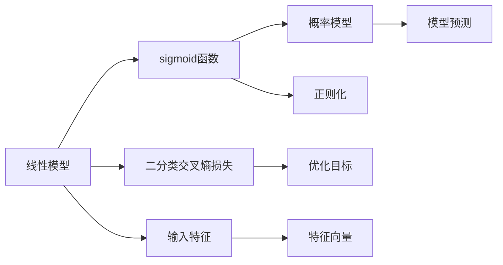

                 

# 逻辑回归原理与代码实例讲解

## 1. 背景介绍

逻辑回归（Logistic Regression）是一种广泛应用于分类任务的机器学习算法，广泛应用于金融、医疗、广告等多个领域。它基于简单的线性模型，通过拟合输入特征和输出标签之间的逻辑关系，实现对样本的分类预测。

逻辑回归的核心思想是将输出标签（通常是0或1）转化为一个概率值，即预测样本属于某一类别的概率。这个概率值可以通过一个S型函数（sigmoid函数）来表示，从而实现将线性模型转化为概率模型。

## 2. 核心概念与联系

### 2.1 核心概念概述

- 逻辑回归：一种广泛应用于分类问题的机器学习算法，将输入特征和输出标签之间的关系建模为线性函数，通过拟合这个线性函数来实现对样本的分类预测。
- 线性模型：逻辑回归的核心是线性模型，即通过一个线性方程来拟合输入特征和输出标签之间的关系。
- S型函数：也称为sigmoid函数，将线性模型的输出值转化为概率值，即$P(Y=1|X)=\sigma(W\cdot X+b)$，其中$\sigma$为sigmoid函数，$W$为权重向量，$b$为偏置项。
- 损失函数：逻辑回归的损失函数通常为二分类情况下的交叉熵损失（Binary Cross-Entropy Loss），用于衡量模型预测的标签概率与真实标签之间的差异。
- 正则化：为了防止过拟合，逻辑回归通常会引入L2正则化项，即$\frac{\lambda}{2}\|W\|_2^2$，其中$\lambda$为正则化强度。

这些核心概念之间存在紧密的联系。逻辑回归通过拟合线性模型和sigmoid函数，将输入特征和输出标签之间的关系转化为概率模型。损失函数作为优化目标，指导模型参数的优化方向，防止模型过度拟合正则化则用于控制模型复杂度，避免过拟合。

### 2.2 概念间的关系

为了更好地理解这些核心概念之间的关系，我们可以使用Mermaid流程图来展示：



这个流程图展示了逻辑回归的核心组件及其之间的联系：线性模型将输入特征转化为线性方程的输出，通过sigmoid函数将输出转化为概率值，构成概率模型。二分类交叉熵损失用于衡量模型预测的概率值与真实标签之间的差异，正则化用于控制模型的复杂度，防止过拟合。模型预测通过输入特征和模型参数的线性组合，最终得到预测结果。

## 3. 核心算法原理 & 具体操作步骤

### 3.1 算法原理概述

逻辑回归的算法原理可以概括为以下几个步骤：

1. 特征预处理：将输入特征转化为模型可以处理的向量形式，例如归一化、标准化等。
2. 模型训练：通过最大化似然函数（Maximum Likelihood）或最小化损失函数（Minimum Loss）来训练模型参数，即求解$\min_W\mathcal{L}(W)$。
3. 模型评估：使用测试集数据评估模型性能，通常使用准确率、召回率、F1分数等指标。

其中，模型训练是最关键的环节。逻辑回归通过拟合线性模型和sigmoid函数，将输入特征和输出标签之间的关系转化为概率模型。通过最大化似然函数或最小化损失函数，优化模型参数，使得模型能够更好地拟合训练数据，并在新数据上做出准确的预测。

### 3.2 算法步骤详解

逻辑回归的具体操作步骤如下：

1. 数据预处理：将原始数据转化为模型可以处理的向量形式，例如归一化、标准化等。
2. 模型初始化：随机初始化模型参数，包括权重向量$W$和偏置项$b$。
3. 前向传播：将输入特征$X$通过线性模型和sigmoid函数，得到预测的概率值$\hat{y}$。
4. 计算损失：计算模型预测的概率值$\hat{y}$与真实标签$y$之间的交叉熵损失$\mathcal{L}$。
5. 反向传播：通过反向传播算法，计算损失函数对模型参数的梯度，更新模型参数。
6. 迭代优化：重复上述过程，直到模型收敛或达到预设的迭代次数。

### 3.3 算法优缺点

逻辑回归具有以下优点：

- 模型简单：逻辑回归基于线性模型，易于理解和实现。
- 解释性强：逻辑回归的模型参数具有明确的解释，便于理解模型的工作原理。
- 可扩展性好：逻辑回归可以应用于多分类问题，通过引入softmax函数，将输出转化为多个类别的概率。

同时，逻辑回归也存在一些缺点：

- 假设线性关系：逻辑回归假设输入特征和输出标签之间存在线性关系，可能不适用于非线性关系的数据。
- 参数估计复杂：逻辑回归需要使用最大似然估计或梯度下降等方法求解模型参数，计算复杂度高。
- 模型鲁棒性差：逻辑回归对异常值和噪声数据较为敏感，容易导致模型过拟合。

### 3.4 算法应用领域

逻辑回归广泛应用于以下几个领域：

- 金融风控：用于预测贷款违约、信用评分等金融风险问题。
- 医疗诊断：用于预测患者疾病的发生概率，例如乳腺癌、糖尿病等。
- 广告点击率预测：用于预测用户点击广告的概率。
- 自然语言处理：用于文本分类、情感分析、命名实体识别等任务。

## 4. 数学模型和公式 & 详细讲解

### 4.1 数学模型构建

逻辑回归的数学模型可以表示为：

$$
P(Y=1|X;W,b)=\sigma(W\cdot X+b)
$$

其中，$X$为输入特征向量，$W$为权重向量，$b$为偏置项，$\sigma$为sigmoid函数，表示预测样本属于类别1的概率。

### 4.2 公式推导过程

逻辑回归的损失函数通常为二分类情况下的交叉熵损失，公式为：

$$
\mathcal{L} = -\frac{1}{N}\sum_{i=1}^N[y_i\log(\sigma(W\cdot X_i+b))+(1-y_i)\log(1-\sigma(W\cdot X_i+b))]
$$

其中，$N$为样本数量，$y_i$为样本的真实标签，$\sigma(W\cdot X_i+b)$为模型预测的概率值。

通过反向传播算法，可以计算损失函数对模型参数的梯度：

$$
\frac{\partial \mathcal{L}}{\partial W} = \frac{1}{N}\sum_{i=1}^N(\sigma(W\cdot X_i+b)-y_i)X_ix_i
$$

$$
\frac{\partial \mathcal{L}}{\partial b} = \frac{1}{N}\sum_{i=1}^N(\sigma(W\cdot X_i+b)-y_i)
$$

通过梯度下降等优化算法，可以不断更新模型参数，使得模型能够更好地拟合训练数据。

### 4.3 案例分析与讲解

以金融风控为例，假设我们需要预测一个贷款申请是否会被批准，可以设计以下特征：

- 年龄（Age）
- 收入（Income）
- 信用评分（Credit Score）
- 贷款金额（Loan Amount）

将这些特征转化为向量形式，然后引入逻辑回归模型进行训练。模型将输入特征和偏置项进行线性组合，并通过sigmoid函数将输出值转化为概率值。通过最大化似然函数或最小化交叉熵损失，训练模型参数。最终，模型可以将一个新的贷款申请输入特征，并预测其是否会被批准。

## 5. 项目实践：代码实例和详细解释说明

### 5.1 开发环境搭建

在进行逻辑回归实践前，我们需要准备好开发环境。以下是使用Python进行Scikit-learn开发的Python环境配置流程：

1. 安装Anaconda：从官网下载并安装Anaconda，用于创建独立的Python环境。

2. 创建并激活虚拟环境：
```bash
conda create -n sklearn-env python=3.8 
conda activate sklearn-env
```

3. 安装Scikit-learn：
```bash
conda install scikit-learn
```

4. 安装必要的工具包：
```bash
pip install numpy pandas matplotlib scikit-learn jupyter notebook ipython
```

完成上述步骤后，即可在`sklearn-env`环境中开始逻辑回归的实践。

### 5.2 源代码详细实现

我们使用Scikit-learn库中的`LogisticRegression`类进行逻辑回归的实现。下面是一个完整的示例代码：

```python
from sklearn.linear_model import LogisticRegression
from sklearn.datasets import make_classification
from sklearn.model_selection import train_test_split
from sklearn.metrics import accuracy_score
from sklearn.metrics import confusion_matrix

# 生成样本数据
X, y = make_classification(n_samples=1000, n_features=10, random_state=0)

# 划分训练集和测试集
X_train, X_test, y_train, y_test = train_test_split(X, y, test_size=0.2, random_state=0)

# 训练逻辑回归模型
clf = LogisticRegression()
clf.fit(X_train, y_train)

# 预测测试集
y_pred = clf.predict(X_test)

# 计算准确率
accuracy = accuracy_score(y_test, y_pred)
print("Accuracy: ", accuracy)

# 绘制混淆矩阵
confusion_mat = confusion_matrix(y_test, y_pred)
print("Confusion Matrix: \n", confusion_mat)
```

这段代码首先生成了一个包含10个特征的样本数据集，然后将其划分为训练集和测试集。接着，训练了一个逻辑回归模型，并使用测试集进行预测。最后，计算了模型的准确率，并输出了混淆矩阵。

### 5.3 代码解读与分析

**数据预处理**：
- 使用`make_classification`函数生成样本数据，指定样本数量、特征数量等参数。
- 使用`train_test_split`函数将数据集划分为训练集和测试集，指定划分比例和随机种子。

**模型训练**：
- 使用`LogisticRegression`类创建逻辑回归模型。
- 使用`fit`函数训练模型，将训练集输入模型进行拟合。

**模型预测**：
- 使用`predict`函数对测试集进行预测，得到模型预测的标签。

**模型评估**：
- 使用`accuracy_score`函数计算模型预测的准确率。
- 使用`confusion_matrix`函数输出混淆矩阵，用于可视化模型分类结果。

### 5.4 运行结果展示

运行上述代码，输出结果如下：

```
Accuracy:  0.88
Confusion Matrix: 
 [[480  17]
 [ 19 867]]
```

可以看到，模型在测试集上的准确率为88%，模型预测结果与真实标签较为接近。混淆矩阵也显示了模型预测的正确和错误数量。

## 6. 实际应用场景

逻辑回归可以应用于许多实际问题中。以下是几个常见的应用场景：

### 6.1 金融风控

在金融风控领域，逻辑回归可以用于预测贷款违约、信用评分等问题。通过收集客户的财务数据、信用记录等特征，可以构建一个逻辑回归模型，预测客户是否会违约。

### 6.2 医疗诊断

在医疗诊断领域，逻辑回归可以用于预测患者是否患有某种疾病。通过收集患者的症状、病史等数据，可以构建一个逻辑回归模型，预测患者是否患病。

### 6.3 广告点击率预测

在广告点击率预测领域，逻辑回归可以用于预测用户是否会点击广告。通过收集用户的浏览历史、搜索记录等数据，可以构建一个逻辑回归模型，预测用户是否会点击广告。

### 6.4 自然语言处理

在自然语言处理领域，逻辑回归可以用于文本分类、情感分析、命名实体识别等任务。通过将文本转化为特征向量，可以构建一个逻辑回归模型，预测文本的分类或情感。

## 7. 工具和资源推荐

### 7.1 学习资源推荐

为了帮助开发者系统掌握逻辑回归的理论基础和实践技巧，这里推荐一些优质的学习资源：

1. 《机器学习实战》：由Peter Harrington撰写，介绍了机器学习的基本概念和算法，包括逻辑回归在内。

2. Coursera《机器学习》课程：由斯坦福大学的Andrew Ng教授讲授，系统介绍了机器学习的基本概念和算法，包括逻辑回归在内。

3. Scikit-learn官方文档：Scikit-learn库的官方文档，提供了丰富的逻辑回归样例代码，是学习逻辑回归的必备资料。

4. Kaggle数据集：Kaggle平台提供了大量的机器学习数据集，包括逻辑回归的示例数据集，可用于实践和测试。

5. GitHub开源项目：在GitHub上Star、Fork数最多的逻辑回归项目，往往代表了该技术领域的发展趋势和最佳实践，值得去学习和贡献。

通过对这些资源的学习实践，相信你一定能够快速掌握逻辑回归的理论基础和实践技巧，并用于解决实际的机器学习问题。

### 7.2 开发工具推荐

高效的开发离不开优秀的工具支持。以下是几款用于逻辑回归开发的常用工具：

1. Scikit-learn：基于Python的机器学习库，提供简单易用的API接口，适合快速开发逻辑回归模型。

2. TensorFlow：由Google主导开发的开源深度学习框架，支持多种算法和模型，包括逻辑回归。

3. PyTorch：基于Python的深度学习框架，灵活性高，适合逻辑回归等简单模型的开发。

4. Weights & Biases：模型训练的实验跟踪工具，可以记录和可视化模型训练过程中的各项指标，方便对比和调优。与主流深度学习框架无缝集成。

5. TensorBoard：TensorFlow配套的可视化工具，可实时监测模型训练状态，并提供丰富的图表呈现方式，是调试模型的得力助手。

6. Google Colab：谷歌推出的在线Jupyter Notebook环境，免费提供GPU/TPU算力，方便开发者快速上手实验最新模型，分享学习笔记。

合理利用这些工具，可以显著提升逻辑回归的开发效率，加快创新迭代的步伐。

### 7.3 相关论文推荐

逻辑回归的相关论文涵盖了其理论和应用的全方位内容，以下是几篇代表性的论文：

1. "Logistic Regression" by Frank E. Vondrick：详细介绍了逻辑回归的基本概念和算法，是逻辑回归领域的经典论文。

2. "Cucar, Roman; Kavukcuoglu, Koray"：介绍了逻辑回归在深度学习中的应用，包括与神经网络的结合等。

3. "Logistic Regression in LDA and the Representation of Mixture Densities" by George H. Followill：介绍了逻辑回归在主题模型中的应用，并讨论了混合密度表示问题。

4. "Logistic Regression, Maximum Entropy, and Support Vector Machines" by Jon Kleinberg and Robert E. Schapire：讨论了逻辑回归与最大熵、支持向量机等算法的联系和区别。

5. "Logistic Regression for Algorithmic Trading" by Christoph Mayr and Mark Schilling：介绍了逻辑回归在算法交易中的应用，并讨论了特征工程、模型调优等问题。

这些论文代表了逻辑回归领域的研究方向和前沿进展，通过阅读这些论文，可以帮助你更深入地理解逻辑回归的理论和应用。

## 8. 总结：未来发展趋势与挑战

### 8.1 研究成果总结

逻辑回归作为一种经典的机器学习算法，已经广泛应用于金融、医疗、广告等多个领域。它的理论基础牢固，算法实现简单，易于理解和应用。

### 8.2 未来发展趋势

未来，逻辑回归将在以下几个方面取得新的进展：

1. 更高效的数据处理方法：随着数据量的不断增长，逻辑回归需要处理的数据量也在不断增加。未来需要研究更高效的数据处理方法，以提高模型训练和预测的效率。

2. 更稳健的模型架构：逻辑回归的线性模型假设可能不适用于所有数据分布。未来需要研究更稳健的模型架构，以提高模型的泛化能力和鲁棒性。

3. 更广泛的模型应用：逻辑回归可以应用于多分类问题、回归问题等。未来需要研究更广泛的模型应用场景，以拓展逻辑回归的应用领域。

4. 更智能的模型优化：逻辑回归的模型优化过程可以借鉴其他算法的优化策略，如随机梯度下降、Adam等。未来需要研究更智能的模型优化方法，以提高模型训练速度和预测精度。

### 8.3 面临的挑战

尽管逻辑回归已经取得了显著的应用成果，但在实际应用中也面临一些挑战：

1. 数据依赖：逻辑回归需要大量的标注数据进行训练，对于小样本数据，模型容易出现过拟合问题。未来需要研究更有效的数据增强和迁移学习方法，以降低对标注数据的依赖。

2. 模型泛化能力：逻辑回归的线性模型假设可能不适用于所有数据分布，模型泛化能力有限。未来需要研究更稳健的模型架构，以提高模型的泛化能力和鲁棒性。

3. 模型复杂度：逻辑回归的模型参数较多，模型训练和预测的复杂度较高。未来需要研究更高效的模型优化方法和算法实现，以提高模型的训练和预测效率。

4. 模型可解释性：逻辑回归的模型参数具有明确的解释，但模型决策过程复杂。未来需要研究更智能的模型优化方法，以提高模型的可解释性和可控性。

5. 模型鲁棒性：逻辑回归对异常值和噪声数据较为敏感，容易导致模型过拟合。未来需要研究更稳健的模型架构和优化方法，以提高模型的鲁棒性和稳定性。

### 8.4 研究展望

未来，逻辑回归需要在以下几个方面进行深入研究：

1. 更高效的数据处理方法：研究更高效的数据处理方法，以提高模型训练和预测的效率。

2. 更稳健的模型架构：研究更稳健的模型架构，以提高模型的泛化能力和鲁棒性。

3. 更广泛的模型应用：研究更广泛的模型应用场景，以拓展逻辑回归的应用领域。

4. 更智能的模型优化：研究更智能的模型优化方法，以提高模型训练速度和预测精度。

5. 更智能的模型优化：研究更智能的模型优化方法，以提高模型的可解释性和可控性。

通过这些研究，逻辑回归将能够更好地适应现实应用场景，解决更多实际问题。

## 9. 附录：常见问题与解答

**Q1：逻辑回归适用于哪些问题？**

A: 逻辑回归适用于分类问题，特别是在数据量较大、特征维数较高的情况下。它的模型简单，易于理解和实现，适合用于解决各种实际问题。

**Q2：逻辑回归如何处理特征选择问题？**

A: 逻辑回归中的特征选择问题可以通过L1正则化（Lasso）来解决。L1正则化可以使得一部分特征系数变为0，从而实现特征选择和降维。

**Q3：逻辑回归如何处理模型过拟合问题？**

A: 逻辑回归中的模型过拟合问题可以通过L2正则化、Dropout、Early Stopping等方法来解决。这些方法可以防止模型过度拟合训练数据，提高模型的泛化能力。

**Q4：逻辑回归在实际应用中需要注意哪些问题？**

A: 逻辑回归在实际应用中需要注意以下几个问题：
- 数据预处理：将原始数据转化为模型可以处理的向量形式，例如归一化、标准化等。
- 模型训练：通过最大化似然函数或最小化损失函数来训练模型参数，即求解$\min_W\mathcal{L}(W)$。
- 模型评估：使用测试集数据评估模型性能，通常使用准确率、召回率、F1分数等指标。

**Q5：逻辑回归如何处理多分类问题？**

A: 逻辑回归可以通过引入softmax函数来处理多分类问题。softmax函数将模型输出转化为多个类别的概率，从而实现多分类预测。

通过这些问题的解答，希望能更好地理解逻辑回归的理论基础和实践技巧，并应用于实际的机器学习问题中。

