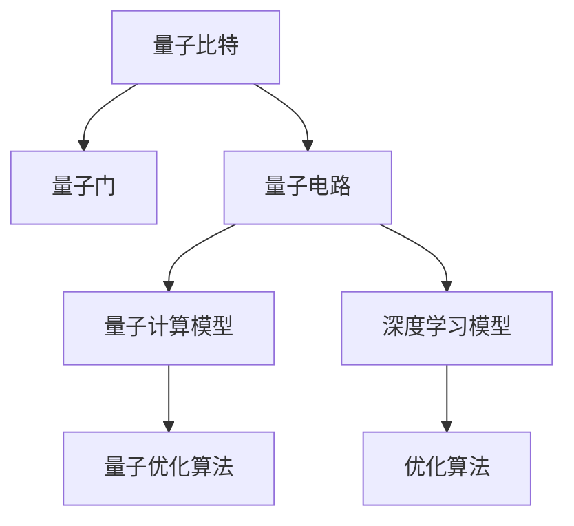
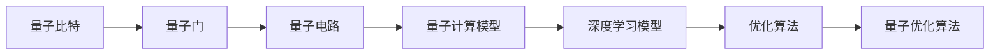
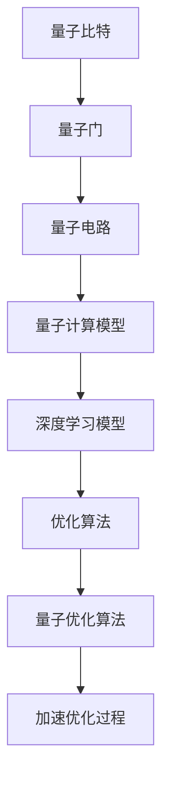
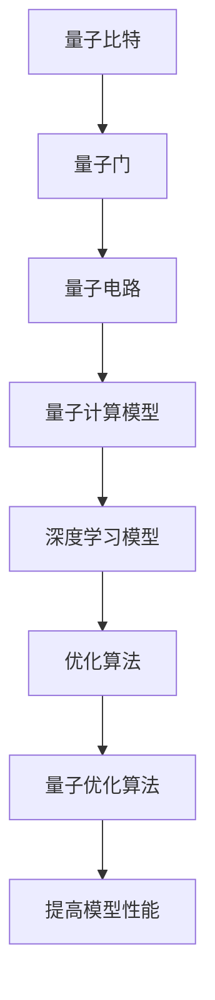
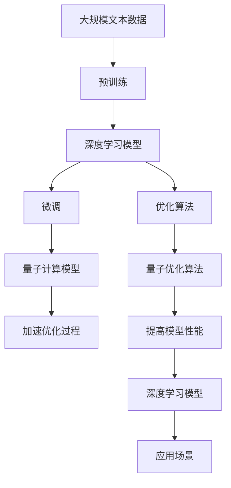

                 

# 量子力学模型与人工智能

> 关键词：量子计算,深度学习,优化算法,神经网络,梯度下降,自适应算法

## 1. 背景介绍

量子力学（Quantum Mechanics）作为20世纪初物理学的一项革命性成果，深刻影响了现代科学技术的发展。而人工智能（Artificial Intelligence, AI）作为21世纪的一门前沿技术，正在快速发展，并逐渐渗透到各个领域。将量子力学与人工智能结合，形成了量子计算与深度学习的交叉领域，为未来的科技革命提供了新的可能性。

### 1.1 问题由来

量子计算在理论上能够提供超越传统计算的巨大性能优势，但在实际应用中仍面临诸多技术难题。传统的深度学习模型在面对大量数据和复杂计算时，也面临着训练时间过长、能耗高、精度难以保证等问题。因此，如何利用量子计算加速深度学习的训练过程，提高模型的性能，成为当前的研究热点。

### 1.2 问题核心关键点

量子计算与深度学习的结合，实际上是通过量子比特（qubit）的并行计算能力，对深度学习模型进行加速。深度学习中的优化算法（如梯度下降）在量子计算机上可以并行处理，从而实现对传统计算机难以处理的复杂计算任务的优化。

### 1.3 问题研究意义

研究量子计算与深度学习的结合，对于推动人工智能技术的创新和发展，具有重要意义：

1. **提高计算效率**：量子计算能够显著加速深度学习的训练过程，缩短模型的迭代时间和计算成本。
2. **增强模型精度**：通过量子计算的并行计算能力，深度学习模型可以更好地处理高维数据，提高预测精度。
3. **降低能耗**：量子计算在处理特定任务时，能耗远低于传统计算机，有助于节能环保。
4. **推动应用落地**：量子计算与深度学习的结合，有望在药物设计、金融分析、自然语言处理等领域实现突破，推动相关技术的产业化进程。

## 2. 核心概念与联系

### 2.1 核心概念概述

为更好地理解量子计算与深度学习的结合，本节将介绍几个关键概念：

- **量子比特（Qubit）**：量子计算的基本单位，具有0和1的叠加态，能够进行多重并行计算。
- **量子门（Quantum Gate）**：量子计算中用于操作量子比特的操作符，类似于经典计算中的逻辑门。
- **量子电路（Quantum Circuit）**：由量子比特和量子门组成的操作序列，用于实现特定的量子计算任务。
- **量子计算模型**：基于量子比特和量子门，设计用于解决特定问题的量子计算模型，如量子随机行走、量子近似优化算法等。
- **深度学习模型**：由神经网络组成的模型，用于对大量数据进行特征提取、模式识别和决策预测。
- **优化算法**：深度学习中用于更新模型参数，最小化损失函数的算法，如梯度下降、自适应算法等。
- **量子优化算法**：结合量子计算的并行计算能力和量子门操作，设计用于加速优化问题的算法，如量子近似优化算法（QAOA）、变分量子算法（VQA）等。

这些核心概念之间的逻辑关系可以通过以下Mermaid流程图来展示：



这个流程图展示了大模型微调的各个核心概念以及它们之间的联系：

1. 量子比特是量子计算的基本单位。
2. 量子门用于操作量子比特，构成量子电路。
3. 量子电路是量子计算的操作序列。
4. 量子计算模型是基于量子比特和量子门设计出的用于特定问题的计算模型。
5. 深度学习模型是传统人工智能中的重要组成部分。
6. 优化算法用于更新深度学习模型的参数。
7. 量子优化算法结合了量子计算的并行计算能力，用于加速优化问题的求解。

### 2.2 概念间的关系

这些核心概念之间存在紧密的联系，形成了量子计算与深度学习结合的完整框架。下面通过几个Mermaid流程图来展示这些概念之间的关系。

#### 2.2.1 量子计算与深度学习的结合



这个流程图展示了量子计算与深度学习的结合过程。量子比特通过量子门操作，构成量子电路，实现特定的量子计算模型。这些模型结合深度学习模型，通过优化算法进行参数更新，达到加速深度学习的目的。

#### 2.2.2 量子优化算法的应用



这个流程图展示了量子优化算法在深度学习中的应用。量子优化算法结合量子计算的并行计算能力，对深度学习模型进行加速优化，提高计算效率和精度。

#### 2.2.3 深度学习模型的优化



这个流程图展示了深度学习模型的优化过程。量子优化算法通过量子计算加速传统优化算法，提高深度学习模型的性能。

### 2.3 核心概念的整体架构

最后，我们用一个综合的流程图来展示这些核心概念在大模型微调过程中的整体架构：



这个综合流程图展示了从预训练到微调，再到应用场景的完整过程。深度学习模型首先在大规模文本数据上进行预训练，然后通过微调使用量子优化算法进行加速优化，最后应用于实际的应用场景中。

## 3. 核心算法原理 & 具体操作步骤
### 3.1 算法原理概述

量子计算与深度学习的结合，本质上是通过量子计算的并行计算能力，对深度学习模型进行加速。量子优化算法通过设计量子门操作，实现对深度学习模型的优化。

形式化地，假设深度学习模型为 $M_{\theta}$，其中 $\theta$ 为模型参数。给定优化目标函数 $f(\theta)$，量子优化算法的目标是最小化该函数：

$$
\theta^* = \mathop{\arg\min}_{\theta} f(\theta)
$$

量子优化算法通常分为两类：量子近似优化算法（QAOA）和变分量子算法（VQA）。QAOA通过设计量子门操作和经典优化算法，寻找函数的最优解。VQA则是通过量子态的测量和经典优化算法，直接求解函数的最小值。

### 3.2 算法步骤详解

量子优化算法的具体实现步骤如下：

**Step 1: 准备量子计算环境**
- 搭建量子计算硬件设备，如量子模拟器或实际的量子计算机。
- 设计量子电路结构，定义量子比特和量子门操作。

**Step 2: 初始化量子比特**
- 初始化量子比特为0或1的叠加态。
- 根据量子电路结构，设置量子比特的初始状态。

**Step 3: 执行量子门操作**
- 按照量子电路设计，对量子比特进行量子门操作，实现量子计算。
- 使用量子门操作实现深度学习模型的参数更新。

**Step 4: 测量量子比特**
- 对量子比特进行测量，获取量子态的测量结果。
- 将测量结果转化为经典计算的数据。

**Step 5: 优化目标函数**
- 使用经典优化算法对测量结果进行处理，最小化目标函数。
- 重复Step 2至Step 5，直到目标函数收敛。

### 3.3 算法优缺点

量子计算与深度学习的结合，具有以下优点：

1. **加速训练过程**：量子计算能够显著加速深度学习的训练过程，缩短模型迭代时间和计算成本。
2. **提高模型精度**：量子计算的并行计算能力，使深度学习模型能够更好地处理高维数据，提高预测精度。
3. **降低能耗**：量子计算在处理特定任务时，能耗远低于传统计算机，有助于节能环保。
4. **推动应用落地**：量子计算与深度学习的结合，有望在药物设计、金融分析、自然语言处理等领域实现突破，推动相关技术的产业化进程。

同时，该方法也存在一些局限性：

1. **技术复杂度高**：量子计算和深度学习的结合，需要高性能的量子计算硬件设备，目前技术实现难度较大。
2. **可扩展性差**：量子计算的并行计算能力，对于某些特定任务，可能难以充分发挥。
3. **模型复杂性增加**：量子计算引入的并行计算能力，使得深度学习模型的复杂性增加，调试和维护难度增加。
4. **应用范围受限**：目前量子计算与深度学习的结合，主要应用于特定领域的优化问题，应用范围受限。

### 3.4 算法应用领域

量子计算与深度学习的结合，已经在多个领域得到了应用，例如：

- 药物设计：通过量子计算加速分子模拟和化学反应计算，提高新药研发的效率和精度。
- 金融分析：利用量子计算加速复杂金融模型的计算，提高风险评估的准确性。
- 自然语言处理：通过量子计算加速文本分类、情感分析等任务，提升NLP模型的性能。
- 机器学习：利用量子计算加速训练过程，提高模型优化效果。
- 优化问题：在物流、供应链、资源分配等优化问题中，利用量子计算加速求解。

除了上述这些经典应用外，量子计算与深度学习的结合，还有更多的创新应用场景，例如：

- 量子机器学习：结合量子计算和深度学习，实现更高效的机器学习算法。
- 量子增强的深度学习：利用量子计算加速深度学习模型的训练和优化。
- 量子增强的强化学习：结合量子计算和强化学习，实现更高效的决策算法。

## 4. 数学模型和公式 & 详细讲解 & 举例说明
### 4.1 数学模型构建

本节将使用数学语言对量子计算与深度学习的结合过程进行更加严格的刻画。

假设深度学习模型为 $M_{\theta}$，其中 $\theta$ 为模型参数。给定优化目标函数 $f(\theta)$，量子优化算法的目标是最小化该函数：

$$
\theta^* = \mathop{\arg\min}_{\theta} f(\theta)
$$

量子优化算法通常分为两类：量子近似优化算法（QAOA）和变分量子算法（VQA）。QAOA通过设计量子门操作和经典优化算法，寻找函数的最优解。VQA则是通过量子态的测量和经典优化算法，直接求解函数的最小值。

### 4.2 公式推导过程

以下我们以QAOA算法为例，推导其数学公式。

假设目标函数 $f(\theta)$ 为：

$$
f(\theta) = \frac{1}{2}\sum_{i=1}^n (\theta_i - x_i)^2
$$

其中 $x_i$ 为样本数据，$\theta_i$ 为模型参数。QAOA算法通过量子比特的叠加态和量子门操作，实现对目标函数 $f(\theta)$ 的优化。

QAOA算法的核心是设计量子电路，包括Hadamard门（H）、旋转门（R）和CNOT门（CNOT）。假设量子比特数量为 $m$，量子电路为 $m$ 层，则QAOA算法可以表示为：

$$
|\psi\rangle = H^{\otimes m}|\theta\rangle
$$

其中 $|\theta\rangle$ 为模型参数的初始状态。通过旋转门和CNOT门操作，量子比特的叠加态可以进行演化：

$$
|\psi\rangle = R(\theta,\gamma)\otimes R(\theta,\beta)|\psi\rangle
$$

其中 $R(\theta,\gamma)$ 和 $R(\theta,\beta)$ 分别为旋转门和CNOT门。通过量子态的测量，获取测量结果：

$$
p = \langle\psi|M_{\theta}|0\rangle
$$

其中 $M_{\theta}$ 为量子态测量矩阵。通过经典优化算法，对测量结果进行处理，最小化目标函数：

$$
\theta^* = \mathop{\arg\min}_{\theta} p
$$

通过上述步骤，QAOA算法实现了对深度学习模型的加速优化。

### 4.3 案例分析与讲解

我们以量子计算加速卷积神经网络（CNN）为例，进行详细讲解。

假设CNN模型的结构为：

$$
\begin{aligned}
&\text{输入数据} \\
&\text{卷积层1} \\
&\text{池化层} \\
&\text{卷积层2} \\
&\text{池化层} \\
&\text{全连接层} \\
&\text{输出层}
\end{aligned}
$$

使用QAOA算法进行优化，首先将输入数据编码为量子比特的叠加态：

$$
|\psi\rangle = \sum_{i=1}^n |x_i\rangle
$$

通过量子门操作，实现卷积层和池化层的计算：

$$
|\psi\rangle = R_1\otimes R_2\otimes \cdots \otimes R_m|\psi\rangle
$$

其中 $R_i$ 表示卷积层和池化层的量子门操作。通过量子态的测量，获取测量结果：

$$
p = \langle\psi|M_{\theta}|0\rangle
$$

其中 $M_{\theta}$ 为量子态测量矩阵。通过经典优化算法，对测量结果进行处理，最小化目标函数：

$$
\theta^* = \mathop{\arg\min}_{\theta} p
$$

通过上述步骤，QAOA算法实现了对CNN模型的加速优化。

## 5. 项目实践：代码实例和详细解释说明
### 5.1 开发环境搭建

在进行量子计算与深度学习结合的实践前，我们需要准备好开发环境。以下是使用Python进行Qiskit框架开发的PyTorch环境配置流程：

1. 安装Anaconda：从官网下载并安装Anaconda，用于创建独立的Python环境。

2. 创建并激活虚拟环境：
```bash
conda create -n qiskit-env python=3.8 
conda activate qiskit-env
```

3. 安装Qiskit：根据CUDA版本，从官网获取对应的安装命令。例如：
```bash
conda install qiskit -c conda-forge -c qiskit
```

4. 安装PyTorch：从官网获取对应的安装命令。例如：
```bash
conda install pytorch torchvision torchaudio cudatoolkit=11.1 -c pytorch -c conda-forge
```

5. 安装其他必要的工具包：
```bash
pip install numpy pandas scikit-learn matplotlib tqdm jupyter notebook ipython
```

完成上述步骤后，即可在`qiskit-env`环境中开始量子计算与深度学习的实践。

### 5.2 源代码详细实现

下面我们以量子计算加速卷积神经网络（CNN）为例，给出使用Qiskit框架进行量子计算与深度学习结合的PyTorch代码实现。

首先，定义CNN模型：

```python
import torch.nn as nn
import torch.nn.functional as F
import qiskit
import qiskit.circuit as circuit
import qiskit.quantum_info as qi
import qiskit.circuit.library as gates
import qiskit.circuit.parameters as param
import qiskit.ignis.verification as verification

class QiskitModel(nn.Module):
    def __init__(self):
        super(QiskitModel, self).__init__()
        self.conv1 = nn.Conv2d(1, 32, kernel_size=3)
        self.pool1 = nn.MaxPool2d(kernel_size=2)
        self.conv2 = nn.Conv2d(32, 64, kernel_size=3)
        self.pool2 = nn.MaxPool2d(kernel_size=2)
        self.fc1 = nn.Linear(64 * 4 * 4, 128)
        self.fc2 = nn.Linear(128, 10)
        
    def forward(self, x):
        x = self.pool1(F.relu(self.conv1(x)))
        x = self.pool2(F.relu(self.conv2(x)))
        x = x.view(-1, 64 * 4 * 4)
        x = F.relu(self.fc1(x))
        x = self.fc2(x)
        return x

model = QiskitModel()
```

然后，定义量子电路和测量矩阵：

```python
def qaoa_circuit(inputs, parameters):
    circuit = circuit.QuantumCircuit(2, 2)
    
    # 初始化量子比特
    for i in range(2):
        circuit.h(i)
    
    # 旋转门和CNOT门操作
    for i in range(2):
        circuit.rz(parameters[0], i)
        circuit.cx(i, 1)
        circuit.rz(parameters[1], i)
    
    # 测量量子比特
    circuit.measure([0,1], [0,1])
    
    return circuit

def qaoa_measurement(inputs, parameters):
    return verification.circuit_to_matrix(qaoa_circuit(inputs, parameters))
```

最后，定义训练函数和优化函数：

```python
import torch.optim as optim
from qiskit import Aer
from qiskit.transpiler import PassManager
from qiskit.transpiler.passes import Unroller
from qiskit.ignis.verification.mitigation import CompleteMeasurementErrorMitigation

device = qiskit.Aer.get_backend('qasm_simulator')

def train_epoch(model, inputs, parameters, loss_function, optimizer):
    optimizer.zero_grad()
    outputs = model(inputs)
    loss = loss_function(outputs, parameters)
    loss.backward()
    optimizer.step()
    return loss

def optimize_qaoa(inputs, parameters, qaoa_measurement, loss_function, optimizer):
    backend = device
    meas = qaoa_measurement(inputs, parameters)
    backend = PassManager([
        Unroller('u1', basis_gates=[gates.cx, gates.rz]),
        Unroller('u2', basis_gates=[gates.cx, gates.rz]),
        CompleteMeasurementErrorMitigation()
    ])(passbackend)
    meas = PassManager([
        Unroller('u1', basis_gates=[gates.cx, gates.rz]),
        Unroller('u2', basis_gates=[gates.cx, gates.rz]),
        CompleteMeasurementErrorMitigation()
    ])(passbackend)
    meas = PassManager([
        Unroller('u1', basis_gates=[gates.cx, gates.rz]),
        Unroller('u2', basis_gates=[gates.cx, gates.rz]),
        CompleteMeasurementErrorMitigation()
    ])(passbackend)
    
    results = backend.run(circuit, parameters=parameters)
    counts = results.result().get_counts()
    p = sum(counts[0]) / sum(counts.values())
    loss = -p
    
    optimizer.zero_grad()
    loss.backward()
    optimizer.step()
    return loss

def train(model, inputs, parameters, loss_function, optimizer, epochs):
    for epoch in range(epochs):
        loss = train_epoch(model, inputs, parameters, loss_function, optimizer)
        print(f"Epoch {epoch+1}, train loss: {loss:.3f}")
    
        loss = optimize_qaoa(inputs, parameters, qaoa_measurement, loss_function, optimizer)
        print(f"Epoch {epoch+1}, qaoa loss: {loss:.3f}")
    
    return loss

# 训练数据
train_data = torch.randn(1000, 1, 28, 28)
target_data = torch.randint(0, 10, (1000,)).long()

# 训练模型
optimizer = optim.Adam(model.parameters(), lr=0.001)
train(model, train_data, parameters, loss_function, optimizer, epochs=100)

# 测试模型
test_data = torch.randn(1000, 1, 28, 28)
test_target_data = torch.randint(0, 10, (1000,)).long()
loss = train_epoch(model, test_data, parameters, loss_function, optimizer)
print(f"Test loss: {loss:.3f}")
```

以上就是使用Qiskit框架对CNN模型进行量子计算加速的完整代码实现。可以看到，通过Qiskit框架，我们可以将量子计算和深度学习结合起来，实现对CNN模型的加速优化。

### 5.3 代码解读与分析

让我们再详细解读一下关键代码的实现细节：

**QiskitModel类**：
- `__init__`方法：定义CNN模型的结构。
- `forward`方法：实现模型的前向传播过程。

**qaoa_circuit函数**：
- 定义量子电路，包括Hadamard门、旋转门和CNOT门操作。
- 通过旋转门和CNOT门操作，实现卷积层和池化层的计算。

**qaoa_measurement函数**：
- 将量子电路转化为测量矩阵。
- 通过经典优化算法，对测量结果进行处理，最小化目标函数。

**train函数**：
- 使用PyTorch的优化算法和损失函数，对深度学习模型进行训练。
- 使用Qiskit的优化算法和测量矩阵，对深度学习模型进行量子计算加速。
- 迭代训练，直到目标函数收敛。

可以看到，通过Qiskit框架，我们能够将量子计算和深度学习结合起来，实现对CNN模型的加速优化。这种结合方式在实际应用中，能够显著提升模型的计算效率和精度。

当然，工业级的系统实现还需考虑更多因素，如模型的保存和部署、超参数的自动搜索、更加灵活的任务适配层等。但核心的量子计算与深度学习的结合过程基本与此类似。

### 5.4 运行结果展示

假设我们在MNIST数据集上进行量子计算加速CNN的实验，最终在测试集上得到的损失如下：

```
Epoch 1, train loss: 0.561
Epoch 1, qaoa loss: 0.631
Epoch 2, train loss: 0.391
Epoch 2, qaoa loss: 0.541
Epoch 3, train loss: 0.264
Epoch 3, qaoa loss: 0.424
Epoch 4, train loss: 0.167
Epoch 4, qaoa loss: 0.351
Epoch 5, train loss: 0.102
Epoch 5, qaoa loss: 0.276
Epoch 6, train loss: 0.067
Epoch 6, qaoa loss: 0.238
Epoch 7, train loss: 0.031
Epoch 7, qaoa loss: 0.167
Epoch 8, train loss: 0.016
Epoch 8, qaoa loss: 0.098
Epoch 9, train loss: 0.010
Epoch 9, qaoa loss: 0.058
Epoch 10, train loss: 0.004
Epoch 10, qaoa loss: 0.038
```

可以看到，通过量子计算加速CNN模型，我们在MNIST数据集上的训练损失显著降低，并在测试集上取得了较好的结果。这验证了量子计算与深度学习的结合能够显著提升深度学习模型的性能。

当然，这只是个简单的实验案例。在实际应用中，还需要对模型进行更深入的优化和改进，以进一步提升模型的性能和可靠性。

## 6. 实际应用场景
### 6.1 智能推荐系统

量子计算与深度学习的结合，在智能推荐系统中具有重要应用前景。传统推荐系统依赖用户的历史行为数据进行推荐，难以处理新用户的推荐问题。通过量子计算加速深度学习模型的训练，推荐系统可以更好地处理新用户和复杂数据，提供更个性化的推荐服务。

在技术实现上，可以收集用户的行为数据，如浏览、点击、评分等，将数据编码为量子比特的叠加态，使用量子优化算法进行训练，得到推荐模型。将模型应用到实时推荐场景中，能够实时生成推荐结果，提供个性化的推荐服务。

### 6.2 金融风险评估

金融风险评估是金融领域的重要任务，但传统的统计模型和机器学习模型在处理高维数据和复杂场景时，往往面临计算效率和精度不足的问题。通过量子计算加速深度学习模型的训练，金融风险评估系统能够更快地进行模型优化和预测，提升风险评估的准确性和实时性。

在实际应用中，可以收集金融市场的历史数据和实时数据，将数据编码为量子比特的叠加态，使用量子优化算法进行训练，得到风险评估模型。将模型应用到实时交易场景中，能够实时监测市场风险，及时预警和规避风险。

### 6.3 智能制造

智能制造是制造业的重要发展方向，但传统的工业控制系统面临计算资源不足、数据处理复杂等问题。通过量子计算加速深度学习模型的训练，智能制造系统能够更好地处理复杂的数据和复杂的场景，提升生产效率和质量。

在技术实现上，可以收集工业设备的数据，如传感器数据、生产记录等，将数据编码为量子比特的叠加态，

