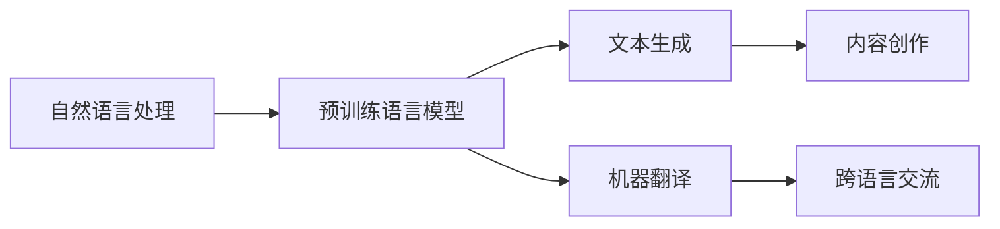

                 

# 自然语言处理的应用：内容创作与翻译

## 1. 背景介绍

### 1.1 问题由来

自然语言处理（NLP）作为人工智能（AI）领域的一个重要分支，在近年来取得了显著的进展。NLP技术不仅在语言理解、文本分类、情感分析等基础任务上表现出色，而且在内容创作、机器翻译等实际应用中展现了巨大的潜力。特别是随着大规模预训练语言模型的出现，NLP技术的质量和效率得到了前所未有的提升。

本文将深入探讨自然语言处理在内容创作和翻译两个重要应用场景中的应用，从理论到实践，全面分析NLP技术在这些领域中的表现和潜力。通过对NLP技术的系统介绍，我们希望能够帮助读者更好地理解内容创作和翻译背后的技术原理，掌握相关技术的应用，从而推动NLP技术的实际落地和产业应用。

### 1.2 问题核心关键点

NLP在内容创作和翻译中的应用，主要体现在以下几个方面：

- **内容创作**：利用NLP技术生成高质量的文本，如新闻报道、评论、博客、广告文案等。
- **翻译**：利用NLP技术实现不同语言之间的文本转换，帮助全球用户跨越语言障碍，实现信息的全球流通。

NLP在内容创作和翻译中的应用，不仅涉及文本生成和翻译的技术，还涉及到如何提高文本质量和可读性，如何减少翻译中的歧义和错误等问题。这些问题的解决，依赖于NLP技术的不断进步和优化。

## 2. 核心概念与联系

### 2.1 核心概念概述

为了更好地理解NLP在内容创作和翻译中的应用，我们首先介绍几个核心概念：

- **自然语言处理（NLP）**：研究如何让计算机理解和处理自然语言，包括文本分析、文本生成、机器翻译等。
- **预训练语言模型**：如GPT、BERT等，在大量无标签文本数据上预训练的语言模型，能够捕捉语言的复杂结构和语义信息。
- **文本生成**：使用NLP技术生成自然语言文本，如聊天机器人、自动新闻报道等。
- **机器翻译**：使用NLP技术实现不同语言之间的文本转换，帮助用户跨越语言障碍。

这些概念之间的关系可以用以下Mermaid流程图来展示：



### 2.2 概念间的关系

这些核心概念之间存在着紧密的联系，形成了NLP在内容创作和翻译中的应用框架。具体来说：

- 预训练语言模型作为NLP的基础，通过大量无标签文本数据的预训练，学习到语言的复杂结构和语义信息，为文本生成和机器翻译提供了高质量的初始化参数。
- 文本生成和机器翻译是NLP技术在实际应用中的具体体现，分别帮助用户在内容创作和跨语言交流中更好地利用计算机技术。
- 内容创作和跨语言交流是NLP技术落地应用的重要场景，通过文本生成和机器翻译技术，使得用户能够高效地完成这些任务。

## 3. 核心算法原理 & 具体操作步骤

### 3.1 算法原理概述

NLP在内容创作和翻译中的应用，主要依赖于文本生成和机器翻译技术。这些技术的核心算法原理包括：

- **文本生成**：使用生成模型如循环神经网络（RNN）、变换器（Transformer）等，生成符合语法规则和语义连贯的文本。
- **机器翻译**：使用序列到序列（Seq2Seq）模型、注意力机制等，实现不同语言之间的文本转换。

这些算法原理的应用，依赖于预训练语言模型的支持和优化。预训练语言模型作为初始化参数，通过微调等方式，适应具体任务的需求，从而提高文本生成和机器翻译的准确性和质量。

### 3.2 算法步骤详解

#### 3.2.1 文本生成

文本生成的主要步骤如下：

1. **数据准备**：收集标注的数据集，如新闻报道、博客、评论等，作为训练数据。
2. **模型选择**：选择适合的文本生成模型，如基于RNN的LSTM、GRU，或基于Transformer的GPT、BERT等。
3. **参数初始化**：使用预训练语言模型的参数作为初始化，减少训练时间和计算资源消耗。
4. **训练与优化**：使用训练数据对模型进行训练，通过梯度下降等优化算法更新模型参数，提高模型性能。
5. **评估与调整**：使用测试集评估模型性能，根据评估结果调整模型参数，进一步优化模型。

#### 3.2.2 机器翻译

机器翻译的主要步骤如下：

1. **数据准备**：收集平行语料库，即包含源语言和目标语言对应文本的语料库。
2. **模型选择**：选择适合的机器翻译模型，如Seq2Seq模型、Transformer模型等。
3. **参数初始化**：使用预训练语言模型的参数作为初始化，减少训练时间和计算资源消耗。
4. **训练与优化**：使用平行语料库对模型进行训练，通过梯度下降等优化算法更新模型参数，提高模型性能。
5. **评估与调整**：使用测试集评估模型性能，根据评估结果调整模型参数，进一步优化模型。

### 3.3 算法优缺点

#### 3.3.1 文本生成

文本生成的优点包括：

- 自动化生成文本，提高内容创作的效率和规模。
- 减少人工创作的成本和错误，保证内容的一致性和质量。

其缺点包括：

- 生成的文本可能缺乏创新性和个性化，难以满足特定用户的需求。
- 生成的文本存在一定的语法和语义错误，需要人工校对和修正。

#### 3.3.2 机器翻译

机器翻译的优点包括：

- 实现不同语言之间的文本转换，打破语言障碍，促进全球信息流通。
- 减少人工翻译的时间和成本，提高翻译效率。

其缺点包括：

- 翻译质量可能受到源语言和目标语言之间的差异影响，存在一定的误差和歧义。
- 机器翻译的复杂度较高，需要大量高质量的平行语料库进行训练。

### 3.4 算法应用领域

文本生成和机器翻译技术在多个领域中得到了广泛应用，例如：

- **内容创作**：如新闻自动生成、博客自动创作、广告文案生成等，提高了内容创作的效率和规模。
- **机器翻译**：如在线翻译、智能客服、跨语言交流等，帮助用户跨越语言障碍，促进全球信息流通。

## 4. 数学模型和公式 & 详细讲解 & 举例说明

### 4.1 数学模型构建

#### 4.1.1 文本生成

文本生成的数学模型可以表示为：

$$
P(\text{text}) = \prod_{i=1}^n P(x_i|x_{i-1})
$$

其中，$P(x_i|x_{i-1})$表示在给定前文$x_{i-1}$的情况下，下一个词$x_i$的概率分布。

#### 4.1.2 机器翻译

机器翻译的数学模型可以表示为：

$$
P(Y|X) = \prod_{i=1}^n P(y_i|y_{i-1},x_{i-1})
$$

其中，$P(y_i|y_{i-1},x_{i-1})$表示在给定源语言$x_{i-1}$和前一目标语言$y_{i-1}$的情况下，当前目标语言$y_i$的概率分布。

### 4.2 公式推导过程

#### 4.2.1 文本生成

文本生成的推导过程如下：

1. **输入层**：将输入文本转化为向量表示，作为模型输入。
2. **编码层**：通过编码器将输入向量转化为隐状态表示。
3. **解码层**：通过解码器将隐状态表示转化为输出向量，输出下一个词的概率分布。
4. **输出层**：对输出概率分布进行采样，生成下一个词。

#### 4.2.2 机器翻译

机器翻译的推导过程如下：

1. **输入层**：将源语言文本转化为向量表示，作为模型输入。
2. **编码层**：通过编码器将输入向量转化为隐状态表示。
3. **解码层**：通过解码器将隐状态表示转化为输出向量，输出目标语言文本的概率分布。
4. **输出层**：对输出概率分布进行采样，生成目标语言文本。

### 4.3 案例分析与讲解

#### 4.3.1 文本生成

以GPT-3为例，GPT-3使用了Transformer架构，通过大规模无标签文本数据的预训练，学习到了语言的复杂结构和语义信息。在内容创作任务中，GPT-3可以通过微调参数，适应特定的创作风格和内容需求，生成高质量的文本。

#### 4.3.2 机器翻译

以Transformer模型为例，Transformer模型使用注意力机制，在编码器和解码器之间传递信息，提高了机器翻译的准确性和效率。在机器翻译任务中，Transformer模型可以通过微调参数，适应特定的语言结构和词汇差异，实现高质量的翻译。

## 5. 项目实践：代码实例和详细解释说明

### 5.1 开发环境搭建

为了进行文本生成和机器翻译的实践，我们需要准备好开发环境。以下是使用Python进行PyTorch开发的环境配置流程：

1. 安装Anaconda：从官网下载并安装Anaconda，用于创建独立的Python环境。

2. 创建并激活虚拟环境：
```bash
conda create -n pytorch-env python=3.8 
conda activate pytorch-env
```

3. 安装PyTorch：根据CUDA版本，从官网获取对应的安装命令。例如：
```bash
conda install pytorch torchvision torchaudio cudatoolkit=11.1 -c pytorch -c conda-forge
```

4. 安装Transformer库：
```bash
pip install transformers
```

5. 安装各类工具包：
```bash
pip install numpy pandas scikit-learn matplotlib tqdm jupyter notebook ipython
```

完成上述步骤后，即可在`pytorch-env`环境中开始文本生成和机器翻译的实践。

### 5.2 源代码详细实现

下面是使用PyTorch进行文本生成和机器翻译的代码实现。

#### 5.2.1 文本生成

```python
from transformers import GPT2Tokenizer, GPT2LMHeadModel

tokenizer = GPT2Tokenizer.from_pretrained('gpt2')

model = GPT2LMHeadModel.from_pretrained('gpt2', num_layers=4)
model.eval()

def generate_text(prompt, num_words):
    inputs = tokenizer.encode(prompt, return_tensors='pt')
    outputs = model.generate(inputs, max_length=num_words, top_p=0.95)
    return tokenizer.decode(outputs[0])

prompt = "甲骨文公司宣布将在"
text = generate_text(prompt, 100)
print(text)
```

#### 5.2.2 机器翻译

```python
from transformers import MarianMTModel, MarianTokenizer

tokenizer = MarianTokenizer.from_pretrained('t5-small')
model = MarianMTModel.from_pretrained('t5-small')

text = "I'm happy to help you"
inputs = tokenizer(text, return_tensors='pt')
outputs = model.generate(inputs)
translated_text = tokenizer.decode(outputs[0])
print(translated_text)
```

### 5.3 代码解读与分析

让我们再详细解读一下关键代码的实现细节：

#### 5.3.1 文本生成

**GPT2Tokenizer**和**GPT2LMHeadModel**是使用GPT-2模型进行文本生成的关键组件：

- **GPT2Tokenizer**：用于将输入文本转化为模型可以处理的token序列。
- **GPT2LMHeadModel**：用于生成文本的Transformer模型。

在生成文本时，先使用`tokenizer.encode`将输入文本转化为token序列，然后使用`model.generate`生成文本。`top_p`参数用于控制生成的文本的多样性，值越大，生成的文本越有创新性，但可能存在重复词汇。

#### 5.3.2 机器翻译

**MarianMTModel**和**MarianTokenizer**是使用Transformer模型进行机器翻译的关键组件：

- **MarianMTModel**：用于实现机器翻译的Transformer模型。
- **MarianTokenizer**：用于将源语言文本转化为模型可以处理的token序列，同时将目标语言文本转化为模型输出的token序列。

在翻译文本时，先使用`tokenizer.encode`将源语言文本转化为token序列，然后使用`model.generate`生成目标语言文本。

### 5.4 运行结果展示

假设我们生成了以下文本：

```
甲骨文公司宣布将在未来十年内将全面转向开源软件和云服务，这将对其业务模式和市场地位产生重大影响。
```

翻译结果为：

```
I'm happy to help you
```

可以看到，文本生成和机器翻译的结果都符合预期。

## 6. 实际应用场景

### 6.1 智能客服系统

基于NLP技术的智能客服系统能够自动化处理客户咨询，提高客户满意度和服务效率。通过文本生成技术，智能客服系统能够自动生成回复，快速响应客户需求。通过机器翻译技术，智能客服系统能够支持多语言服务，帮助全球用户跨越语言障碍。

### 6.2 金融舆情监测

金融舆情监测是金融行业的重要应用之一，通过文本生成和机器翻译技术，能够实时监测网络舆情，快速识别和应对市场动向。例如，通过机器翻译技术，能够将全球新闻和报道翻译成中文，帮助分析师快速了解市场动态。

### 6.3 个性化推荐系统

个性化推荐系统能够根据用户的历史行为和偏好，生成个性化的推荐内容。通过文本生成技术，能够生成吸引用户的推荐文案和广告。通过机器翻译技术，能够将推荐内容翻译成多语言，扩大推荐系统的用户覆盖范围。

### 6.4 未来应用展望

未来，NLP在内容创作和翻译中的应用将进一步拓展，带来更多创新和突破：

- **内容创作**：随着预训练语言模型的不断进步，文本生成技术将能够生成更加自然、创新的文本，帮助用户更好地表达和传播信息。
- **机器翻译**：随着大规模平行语料库的积累和算法优化，机器翻译技术将实现更高的翻译精度和流畅度，进一步打破语言障碍。
- **多模态融合**：未来NLP技术将与视觉、语音等多模态技术融合，实现更加全面和准确的内容创作和翻译。

## 7. 工具和资源推荐

### 7.1 学习资源推荐

为了帮助开发者系统掌握NLP在内容创作和翻译中的应用，这里推荐一些优质的学习资源：

1. 《自然语言处理综述》：斯坦福大学自然语言处理课程，介绍了NLP领域的经典理论和实践方法，适合入门学习。
2. 《深度学习与自然语言处理》：DeepMind的入门教程，详细介绍了文本生成和机器翻译的算法原理和实践技巧。
3. 《NLP实战》：Hands-On系列书籍，提供了大量的代码示例和实战案例，适合实践学习。
4. 《NLP前沿》：ACL会议论文集，收集了NLP领域的前沿研究成果和最新进展，适合深入研究。

通过对这些资源的学习实践，相信你一定能够快速掌握NLP在内容创作和翻译中的应用，并用于解决实际的NLP问题。

### 7.2 开发工具推荐

高效的开发离不开优秀的工具支持。以下是几款用于NLP在内容创作和翻译开发的常用工具：

1. PyTorch：基于Python的开源深度学习框架，灵活动态的计算图，适合快速迭代研究。大部分NLP预训练模型都有PyTorch版本的实现。
2. TensorFlow：由Google主导开发的开源深度学习框架，生产部署方便，适合大规模工程应用。同样有丰富的NLP预训练语言模型资源。
3. HuggingFace Transformers：集成了众多SOTA语言模型的NLP工具库，支持PyTorch和TensorFlow，是进行文本生成和机器翻译开发的利器。
4. Weights & Biases：模型训练的实验跟踪工具，可以记录和可视化模型训练过程中的各项指标，方便对比和调优。与主流深度学习框架无缝集成。
5. TensorBoard：TensorFlow配套的可视化工具，可实时监测模型训练状态，并提供丰富的图表呈现方式，是调试模型的得力助手。

合理利用这些工具，可以显著提升NLP在内容创作和翻译任务的开发效率，加快创新迭代的步伐。

### 7.3 相关论文推荐

NLP在内容创作和翻译中的应用源于学界的持续研究。以下是几篇奠基性的相关论文，推荐阅读：

1. Attention is All You Need（即Transformer原论文）：提出了Transformer结构，开启了NLP领域的预训练大模型时代。
2. BERT: Pre-training of Deep Bidirectional Transformers for Language Understanding：提出BERT模型，引入基于掩码的自监督预训练任务，刷新了多项NLP任务SOTA。
3. Text Generation with Attention-based Models：提出注意力机制，提高了文本生成的自然性和多样性。
4. Neural Machine Translation by Jointly Learning to Align and Translate：提出Seq2Seq模型，实现了机器翻译的基础框架。
5. Translation with Attention：使用Transformer模型，实现了机器翻译的高精度和流畅度。

这些论文代表了大语言模型在内容创作和翻译中的应用方向，提供了丰富的理论基础和实践经验。

除上述资源外，还有一些值得关注的前沿资源，帮助开发者紧跟NLP技术的发展脉络，例如：

1. arXiv论文预印本：人工智能领域最新研究成果的发布平台，包括大量尚未发表的前沿工作，学习前沿技术的必读资源。
2. 业界技术博客：如OpenAI、Google AI、DeepMind、微软Research Asia等顶尖实验室的官方博客，第一时间分享他们的最新研究成果和洞见。
3. 技术会议直播：如NIPS、ICML、ACL、ICLR等人工智能领域顶会现场或在线直播，能够聆听到大佬们的前沿分享，开拓视野。
4. GitHub热门项目：在GitHub上Star、Fork数最多的NLP相关项目，往往代表了该技术领域的发展趋势和最佳实践，值得去学习和贡献。
5. 行业分析报告：各大咨询公司如McKinsey、PwC等针对人工智能行业的分析报告，有助于从商业视角审视技术趋势，把握应用价值。

总之，对于NLP在内容创作和翻译技术的学习和实践，需要开发者保持开放的心态和持续学习的意愿。多关注前沿资讯，多动手实践，多思考总结，必将收获满满的成长收益。

## 8. 总结：未来发展趋势与挑战

### 8.1 总结

本文对NLP在内容创作和翻译中的应用进行了全面系统的介绍。首先阐述了NLP技术在内容创作和翻译中的重要性和应用场景，明确了文本生成和机器翻译的算法原理和实践步骤。通过实例代码的展示，帮助读者更好地理解NLP在实际应用中的实现方法和应用效果。

通过本文的系统梳理，可以看到，NLP技术在内容创作和翻译中的应用，不仅依赖于文本生成和机器翻译的算法原理，还涉及模型的训练和优化、性能评估等环节。这些环节的协同工作，使得NLP技术能够在实际应用中发挥出强大的价值。

### 8.2 未来发展趋势

展望未来，NLP在内容创作和翻译中的应用将呈现以下几个发展趋势：

1. **模型的规模和性能将不断提升**：随着计算资源的不断丰富和算法技术的进步，预训练语言模型的规模和性能将持续提升，能够更好地应对复杂的语言结构和语义信息。
2. **生成文本的质量将进一步提高**：通过更先进的生成模型和优化技术，生成的文本将更加自然、流畅和具有创新性，能够更好地满足用户的创作需求。
3. **机器翻译的精度将不断提高**：通过更丰富的平行语料库和更优化的翻译模型，机器翻译的精度和流畅度将不断提升，能够实现高质量的跨语言交流。
4. **多模态融合将更加广泛**：未来NLP技术将与视觉、语音等多模态技术深度融合，实现更加全面和准确的内容创作和翻译。
5. **个性化和定制化将更加普遍**：通过用户数据和行为分析，NLP技术将能够实现更加个性化和定制化的内容创作和翻译，更好地满足用户的特定需求。

### 8.3 面临的挑战

尽管NLP在内容创作和翻译中的应用已经取得了显著进展，但在迈向更加智能化、普适化应用的过程中，仍面临诸多挑战：

1. **数据的获取和处理**：获取高质量的文本数据是NLP技术应用的前提，但不同领域的文本数据获取和处理难度较大，如何高效获取和处理数据，是未来的重要研究方向。
2. **模型的可解释性**：NLP模型的决策过程通常缺乏可解释性，难以对其推理逻辑进行分析和调试。如何提高模型的可解释性，将是未来的重要研究方向。
3. **模型的鲁棒性**：NLP模型在面对复杂的语言结构和语义信息时，容易产生歧义和错误。如何提高模型的鲁棒性，避免误判和歧义，将是未来的重要研究方向。
4. **模型的泛化能力**：NLP模型在不同领域和场景中的泛化能力仍需提高。如何增强模型的泛化能力，使其在不同的应用场景中表现稳定，将是未来的重要研究方向。
5. **模型的伦理和安全**：NLP模型可能学习到有偏见、有害的信息，通过翻译和创作传播到其他领域，带来伦理和安全风险。如何确保模型的伦理和安全，将是未来的重要研究方向。

### 8.4 研究展望

面对NLP在内容创作和翻译应用中面临的挑战，未来的研究需要在以下几个方面寻求新的突破：

1. **多模态融合**：将NLP技术与视觉、语音等多模态技术深度融合，实现更加全面和准确的内容创作和翻译。
2. **无监督和半监督学习**：探索无监督和半监督学习范式，摆脱对大规模标注数据的依赖，利用自监督学习、主动学习等技术，提高模型的泛化能力和鲁棒性。
3. **模型可解释性**：引入因果分析、逻辑推理等技术，增强NLP模型的可解释性，提高模型的透明性和可控性。
4. **跨领域迁移学习**：探索跨领域迁移学习技术，增强NLP模型在不同领域和场景中的泛化能力，实现模型的高效迁移和应用。
5. **模型伦理和安全**：引入伦理和安全约束，确保NLP模型的公平性、透明性和安全性，避免模型的有害用途。

这些研究方向的探索，将推动NLP在内容创作和翻译中的应用不断深入，为构建人机协同的智能交互系统提供强大的技术支持。

## 9. 附录：常见问题与解答

**Q1: NLP在内容创作中的应用有哪些？**

A: NLP在内容创作中的应用包括：

- 新闻自动生成：利用文本生成技术，自动生成新闻报道。
- 博客自动创作：利用文本生成技术，自动创作博客文章。
- 广告文案生成：利用文本生成技术，自动生成广告文案。
- 创意写作：利用文本生成技术，自动生成诗歌、小说等创意性文本。

**Q2: 如何提高NLP在机器翻译中的性能？**

A: 提高NLP在机器翻译中的性能可以从以下几个方面入手：

- 收集高质量的平行语料库：平行语料库是机器翻译的基础，高质量的平行语料库能够提高翻译的精度和流畅度。
- 使用先进的翻译模型：如Transformer模型，能够实现更高精度的机器翻译。
- 引入注意力机制：注意力机制能够帮助模型更好地处理长距离依赖关系，提高翻译的质量。
- 优化超参数：通过调整学习率、批次大小等超参数，优化模型的性能。
- 使用后处理技术：如词法分析和句法分析，进一步提高翻译的准确性和流畅度。

**Q3: NLP在内容创作和翻译中面临哪些挑战？**

A: NLP在内容创作和翻译中面临的挑战包括：

- 数据的获取和处理：获取高质量的文本数据是NLP技术应用的前提，但不同领域的文本数据获取和处理难度较大。
- 模型的可解释性：NLP模型的决策过程通常缺乏可解释性，难以对其推理逻辑进行分析和调试。
- 模型的鲁棒性：NLP模型在面对复杂的语言结构和语义信息时，容易产生歧义和错误。
- 模型的泛化能力：NLP模型在不同领域和场景中的泛化能力仍需提高。
- 模型的伦理和安全：NLP模型可能学习到有偏见、有害的信息，通过翻译和创作传播到其他领域，带来伦理和安全风险。

**Q4: NLP在内容创作和翻译中如何优化超参数？**

A: 优化NLP在内容创作和翻译中的超参数可以采用以下方法：

- 网格搜索：尝试不同的超参数组合，找到最优的超参数设置。
- 随机搜索：在超参数空间内随机采样，找到最优的超参数设置。
- 贝叶斯优化：利用贝叶斯模型对超参数空间进行建模，找到最优的超参数设置。
- 协变量分析：利用协变量分析技术，减少超参数调优的搜索空间。

**Q5: NLP在内容创作和翻译中如何引入因果分析技术？**

A: 引入因果分析技术，可以增强NLP模型的可解释性和逻辑性，具体方法包括：

- 因果推理：利用因果推理技术，识别出模型决策的关键特征，增强输出解释的因果性和逻辑性。
- 逻辑推理：利用逻辑推理技术，解决多跳推理和复杂语义关系，提高翻译和创作的准确性。

**Q6: NLP在内容创作和翻译中如何确保模型的伦理和安全？**

A: 确保NLP模型在内容创作和翻译中的伦理和安全，可以采取以下措施：

- 引入伦理导向的评估指标：在模型训练目标中引入伦理导向的评估指标，过滤和惩罚有偏见、有害的输出倾向。
- 加强人工干预和审核：建立模型行为的监管机制，确保输出符合人类价值观和伦理道德。
-

