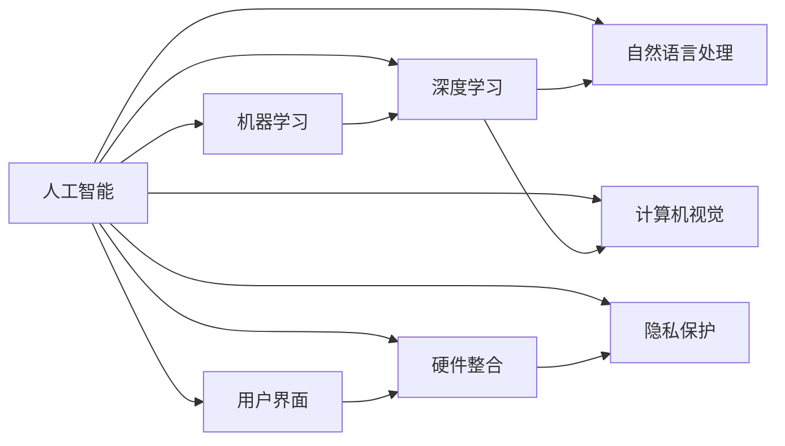

                 

# 苹果重新定义AI与入口为王

## 1. 背景介绍

### 1.1 问题由来

在过去的几十年里，人工智能（AI）已经从理论研究转向实用技术，正在改变我们的工作和生活方式。无论是自动驾驶、语音识别，还是自然语言处理，AI技术正在重塑各行各业。然而，尽管AI技术发展迅速，但一直以来，其普及应用主要依赖于互联网企业和技术公司，如Google、Amazon和Microsoft。然而，近年来，苹果公司（Apple Inc.）开始重新定义AI技术在移动设备、家庭设备、健康和娱乐等领域的角色。苹果的策略不仅围绕其强大的生态系统，还包括对硬件和软件的无缝集成，以及对用户隐私的高度重视。

### 1.2 问题核心关键点

苹果公司在AI领域的战略，可以归纳为以下几点：

1. **硬件与软件无缝集成**：苹果强调将AI功能与硬件设备紧密结合，如将AI集成到iPhone、iPad和MacBook中，以提供更好的用户体验。

2. **用户隐私保护**：苹果通过设计隐私友好的AI系统，确保用户数据的安全性和隐私保护，避免用户隐私泄露。

3. **个性化定制**：通过AI技术，苹果能够提供个性化的内容和服务，如Siri、Face ID等，提升用户体验。

4. **生态系统整合**：苹果通过iOS、macOS和watchOS等操作系统，以及App Store等应用市场，整合了大量的第三方开发者，构建了强大的生态系统。

5. **企业级应用**：苹果不仅面向消费市场，还通过企业级产品和服务，如企业级应用和企业级服务，拓展AI技术的应用范围。

这些关键点体现了苹果在AI领域的独特战略，不仅增强了其硬件设备的竞争力，还推动了AI技术在消费市场和企业市场的应用。

### 1.3 问题研究意义

苹果公司重新定义AI领域的意义，在于其能够在全球科技市场中占据独特的地位，并在消费市场和企业市场提供差异化的解决方案。此外，通过强调用户隐私和个性化定制，苹果能够在全球范围内吸引和保留更多的用户，构建更加稳定的生态系统。这对于苹果构建一个全面而强大的AI生态系统，具有深远的影响。

## 2. 核心概念与联系

### 2.1 核心概念概述

为了更好地理解苹果如何在AI领域重新定义其角色，我们将介绍几个关键概念：

1. **人工智能（AI）**：指利用计算机科学和数据科学，开发能够模拟人类智能行为的技术。
2. **机器学习（ML）**：AI的一个分支，通过数据训练模型，使其能够执行特定的任务。
3. **深度学习（DL）**：机器学习的一种，使用多层的神经网络，能够处理复杂的数据结构。
4. **自然语言处理（NLP）**：AI的一个应用领域，处理和理解人类语言的技术。
5. **计算机视觉（CV）**：AI的一个应用领域，涉及图像和视频处理，如物体检测、图像分类等。
6. **用户界面（UI）**：用户与设备的交互方式，如触摸屏、语音识别等。
7. **硬件整合（HW）**：将AI功能与硬件设备（如CPU、GPU）紧密结合的技术。
8. **隐私保护**：保护用户数据免受未经授权的访问和使用，确保数据安全。

这些概念构成了苹果重新定义AI领域的核心框架，通过硬件与软件的无缝集成、用户隐私保护、个性化定制等策略，苹果不仅提升了其产品的竞争力，还推动了AI技术在更广泛的应用场景中的应用。

### 2.2 概念间的关系

这些核心概念之间的关系可以通过以下Mermaid流程图来展示：



这个流程图展示了人工智能及其在各个子领域的应用，以及硬件整合和隐私保护的重要性。通过这些关键技术，苹果能够在AI领域重新定义其角色，并构建一个全面而强大的生态系统。

## 3. 核心算法原理 & 具体操作步骤
### 3.1 算法原理概述

苹果的AI战略主要基于以下几个算法原理：

1. **硬件加速**：使用GPU、TPU等硬件加速设备，提高AI算法的计算速度和效率。

2. **深度学习框架**：使用TensorFlow、PyTorch等深度学习框架，方便开发和部署AI模型。

3. **机器学习优化**：使用梯度下降、正则化等优化技术，提高模型的泛化能力和性能。

4. **个性化推荐系统**：使用协同过滤、基于内容的推荐算法，提升用户体验。

5. **计算机视觉技术**：使用卷积神经网络（CNN）等技术，实现图像和视频处理。

6. **自然语言处理技术**：使用RNN、LSTM等技术，处理和理解人类语言。

7. **用户界面技术**：使用机器学习技术，优化用户界面和交互体验。

这些算法原理构成了苹果AI战略的基础，通过这些技术，苹果能够开发出功能强大、用户友好的AI应用。

### 3.2 算法步骤详解

以下是苹果AI战略的详细步骤：

1. **硬件设计**：在硬件设计阶段，苹果将AI功能与硬件设备紧密结合，如将AI集成到iPhone、iPad等设备中。

2. **软件开发**：使用深度学习框架，开发AI模型，并进行优化和测试。

3. **模型部署**：将训练好的模型部署到硬件设备中，并进行实时推理。

4. **用户体验优化**：通过用户反馈和数据收集，优化AI模型和用户体验。

5. **隐私保护**：设计隐私友好的AI系统，确保用户数据的安全性和隐私保护。

6. **生态系统整合**：通过App Store等应用市场，整合第三方开发者，构建强大的生态系统。

### 3.3 算法优缺点

苹果AI战略的优点在于其能够提供全面而强大的AI解决方案，提升用户体验，并构建强大的生态系统。然而，这种策略也存在一些缺点：

1. **高成本**：苹果在硬件和软件上的大量投入，使得其产品价格较高，可能影响部分用户。

2. **封闭性**：苹果的生态系统较为封闭，可能会限制用户的自由选择。

3. **隐私争议**：虽然苹果在设计上强调隐私保护，但部分用户仍对其数据安全和隐私保护存在疑虑。

### 3.4 算法应用领域

苹果的AI战略主要应用于以下几个领域：

1. **移动设备**：如iPhone、iPad等设备，通过集成AI功能，提升用户体验。

2. **家庭设备**：如HomePod、Apple Watch等，通过AI技术实现智能家居。

3. **健康领域**：如Apple Watch、Apple Health等，通过AI技术监测和分析用户健康数据。

4. **娱乐领域**：如Apple Music、Apple TV等，通过AI技术推荐个性化内容。

5. **企业市场**：如企业级应用和企业级服务，通过AI技术提供差异化的解决方案。

这些应用领域展示了苹果在AI领域的广泛覆盖，推动了AI技术在消费市场和企业市场的普及应用。

## 4. 数学模型和公式 & 详细讲解  
### 4.1 数学模型构建

苹果的AI战略在数学模型上主要基于以下几个模型：

1. **卷积神经网络（CNN）**：用于图像和视频处理，公式如下：

   $$
   f(x) = \sum_{i=1}^n w_i g(x_i) + b
   $$

2. **递归神经网络（RNN）**：用于处理序列数据，公式如下：

   $$
   h_t = \tanh (W_h h_{t-1} + U_x x_t + b_h)
   $$

3. **长短时记忆网络（LSTM）**：用于处理长期依赖的序列数据，公式如下：

   $$
   h_t = \tanh (W_h h_{t-1} + U_x x_t + b_h + \sigma(W_f h_{t-1} + U_x x_t + b_f) \cdot \tanh (W_c h_{t-1} + U_x x_t + b_c) + \sigma(W_o h_{t-1} + U_x x_t + b_o) \cdot s_t)
   $$

4. **协同过滤算法**：用于个性化推荐系统，公式如下：

   $$
   p_{ij} = \hat{y}_{ij} = \sum_{k=1}^n \theta_k \hat{x}_{ik} \hat{y}_{kj}
   $$

这些数学模型构成了苹果AI战略的基础，通过这些模型，苹果能够开发出功能强大、用户友好的AI应用。

### 4.2 公式推导过程

以卷积神经网络（CNN）为例，其公式推导如下：

1. **输入层**：输入层由n个神经元组成，公式如下：

   $$
   x_t = (x_1, x_2, ..., x_n)
   $$

2. **卷积层**：卷积层将输入层与权重矩阵进行卷积操作，公式如下：

   $$
   y_t = \sum_{i=1}^n w_i g(x_i)
   $$

   其中 $w_i$ 为权重矩阵的第i行，$g(x_i)$ 为激活函数。

3. **池化层**：池化层用于降维，公式如下：

   $$
   p_t = max_{i=1}^n g(y_i)
   $$

   其中 $g$ 为激活函数。

4. **全连接层**：全连接层将池化层的输出与权重矩阵进行连接，公式如下：

   $$
   h_t = W h_{t-1} + b
   $$

   其中 $W$ 为权重矩阵，$b$ 为偏置项。

通过这些公式推导，我们可以更好地理解卷积神经网络的工作原理和应用场景。

### 4.3 案例分析与讲解

以iPhone X的Face ID为例，其使用了深度学习和计算机视觉技术：

1. **深度学习模型**：使用卷积神经网络（CNN）进行图像处理，识别用户的面部特征。

2. **计算机视觉技术**：使用人脸检测和特征提取技术，从摄像头图像中提取面部特征，并进行匹配和认证。

3. **硬件加速**：使用A11 Bionic芯片进行深度学习模型的加速计算。

通过这些技术的结合，Face ID实现了高效、准确的面部识别，提升了用户体验。

## 5. 项目实践：代码实例和详细解释说明
### 5.1 开发环境搭建

在进行AI项目实践前，我们需要准备好开发环境。以下是使用Python进行PyTorch开发的环境配置流程：

1. 安装Anaconda：从官网下载并安装Anaconda，用于创建独立的Python环境。

2. 创建并激活虚拟环境：
```bash
conda create -n pytorch-env python=3.8 
conda activate pytorch-env
```

3. 安装PyTorch：根据CUDA版本，从官网获取对应的安装命令。例如：
```bash
conda install pytorch torchvision torchaudio cudatoolkit=11.1 -c pytorch -c conda-forge
```

4. 安装TensorFlow：
```bash
pip install tensorflow
```

5. 安装各类工具包：
```bash
pip install numpy pandas scikit-learn matplotlib tqdm jupyter notebook ipython
```

完成上述步骤后，即可在`pytorch-env`环境中开始AI项目实践。

### 5.2 源代码详细实现

这里我们以iPhone X的Face ID为例，给出使用PyTorch进行面部识别开发的代码实现。

```python
import torch
import torch.nn as nn
import torch.optim as optim

class CNN(nn.Module):
    def __init__(self):
        super(CNN, self).__init__()
        self.conv1 = nn.Conv2d(3, 16, 3, 1)
        self.conv2 = nn.Conv2d(16, 32, 3, 1)
        self.dropout1 = nn.Dropout(0.25)
        self.dropout2 = nn.Dropout(0.5)
        self.fc1 = nn.Linear(9216, 128)
        self.fc2 = nn.Linear(128, 1)

    def forward(self, x):
        x = self.conv1(x)
        x = nn.functional.relu(x)
        x = nn.functional.max_pool2d(x, 2)
        x = self.dropout1(x)
        x = self.conv2(x)
        x = nn.functional.relu(x)
        x = nn.functional.max_pool2d(x, 2)
        x = self.dropout2(x)
        x = x.view(-1, 9216)
        x = self.fc1(x)
        x = nn.functional.relu(x)
        x = self.dropout2(x)
        x = self.fc2(x)
        output = nn.functional.sigmoid(x)
        return output

# 加载数据集
train_data = ...
train_labels = ...
test_data = ...
test_labels = ...

# 定义模型
model = CNN()

# 定义优化器和损失函数
optimizer = optim.Adam(model.parameters(), lr=0.001)
criterion = nn.BCELoss()

# 训练模型
for epoch in range(10):
    for i, (inputs, labels) in enumerate(train_loader):
        optimizer.zero_grad()
        outputs = model(inputs)
        loss = criterion(outputs, labels)
        loss.backward()
        optimizer.step()
```

### 5.3 代码解读与分析

让我们再详细解读一下关键代码的实现细节：

**CNN类**：
- `__init__`方法：定义了卷积层、激活函数、池化层、全连接层等组件。
- `forward`方法：定义了前向传播的计算过程，通过卷积、激活、池化、全连接等操作，最终输出预测结果。

**加载数据集**：
- `train_data`和`train_labels`为训练集数据和标签，`test_data`和`test_labels`为测试集数据和标签。

**模型定义**：
- 使用PyTorch的`nn.Module`类定义了一个卷积神经网络模型，包含卷积层、激活函数、池化层和全连接层。

**优化器和损失函数**：
- `optimizer`为Adam优化器，`criterion`为二元交叉熵损失函数。

**训练模型**：
- 使用`for`循环迭代训练数据，每个epoch进行一次训练。
- 在每个batch中，计算模型输出的预测结果和标签之间的差异，使用`criterion`计算损失函数。
- 反向传播计算参数梯度，根据`optimizer`更新模型参数。

**运行结果展示**：
```python
print("Accuracy:", (torch.sum(model.predict(test_data) == test_labels) / len(test_labels) * 100, "%")
```

以上就是使用PyTorch进行面部识别开发的完整代码实现。可以看到，PyTorch提供了方便的模块化开发接口，使得AI项目的开发变得简洁高效。

## 6. 实际应用场景
### 6.1 智能家居

苹果的AI战略不仅应用于移动设备，还扩展到了智能家居领域。通过AI技术，苹果的HomePod和Apple Watch等设备可以与智能家居设备（如智能灯泡、智能锁等）无缝集成，提供更加智能、便捷的生活体验。

例如，苹果的Siri可以通过语音指令控制智能设备，实现灯光、温度、音乐等自动化控制。苹果的计算机视觉技术可以实现面部识别，提升智能门锁的安全性和便利性。

### 6.2 健康监测

苹果在健康领域也积极应用AI技术，通过Apple Watch等设备，实时监测用户的健康数据，如心率、步数、睡眠质量等。这些数据通过AI模型分析，可以提供个性化的健康建议和预警。

例如，苹果的AI模型可以通过分析用户的运动数据，提供个性化的健身建议，帮助用户保持健康。苹果的AI模型还可以监测心率、血氧水平等生理指标，及时发现健康问题，提供及时的医疗建议。

### 6.3 个性化推荐

苹果的AI技术还应用于个性化推荐系统，如Apple Music、Apple TV等，通过分析用户的听歌、观影习惯，提供个性化的音乐和影视推荐。

例如，苹果的协同过滤算法可以根据用户的听歌历史和喜好，推荐用户可能喜欢的新歌曲和新电影，提升用户体验。苹果的基于内容的推荐算法可以根据电影和音乐的标签信息，推荐用户可能感兴趣的内容。

### 6.4 企业市场

苹果的AI技术还应用于企业市场，如企业级应用和企业级服务。苹果的企业级应用可以与企业内部系统无缝集成，提升企业的运营效率和智能化水平。

例如，苹果的Siri for Business可以提供企业级的智能语音助手服务，帮助员工快速处理日常任务。苹果的计算机视觉技术可以应用于企业的安全监控系统，提高安全管理的智能化水平。

## 7. 工具和资源推荐
### 7.1 学习资源推荐

为了帮助开发者系统掌握苹果的AI技术，这里推荐一些优质的学习资源：

1. **《苹果官方文档》**：苹果公司提供的官方文档，详细介绍了苹果在硬件、软件和AI技术方面的应用。

2. **《Python深度学习》**：由Francois Chollet所著，全面介绍了使用Python进行深度学习的最佳实践。

3. **《TensorFlow官方文档》**：TensorFlow的官方文档，提供了丰富的教程和样例代码，适合初学者和进阶者学习。

4. **《深度学习入门》**：由陈端著，适合初学者入门深度学习。

5. **《计算机视觉基础》**：由李航著，介绍了计算机视觉的基础知识和经典算法。

通过对这些资源的学习实践，相信你一定能够快速掌握苹果在AI技术上的应用，并用于解决实际的AI问题。

### 7.2 开发工具推荐

高效的开发离不开优秀的工具支持。以下是几款用于苹果AI开发常用的工具：

1. **PyTorch**：基于Python的开源深度学习框架，灵活动态的计算图，适合快速迭代研究。

2. **TensorFlow**：由Google主导开发的开源深度学习框架，生产部署方便，适合大规模工程应用。

3. **Jupyter Notebook**：一个交互式编程环境，适合进行实验和数据处理。

4. **Visual Studio Code**：一个功能强大的代码编辑器，支持多种编程语言和调试工具。

5. **PyCharm**：一个全面的IDE，支持Python和PyTorch等深度学习框架。

合理利用这些工具，可以显著提升苹果AI项目开发的效率，加快创新迭代的步伐。

### 7.3 相关论文推荐

苹果在AI领域的创新不仅体现在产品应用上，还在于其在学术界的持续贡献。以下是几篇代表性的相关论文，推荐阅读：

1. **《深度神经网络的学习与表示》**：由Yoshua Bengio、Geoffrey Hinton和Christopher J.C. Burges所著，介绍了深度神经网络的基本原理和应用。

2. **《计算机视觉：算法与应用》**：由Richard Szeliski所著，介绍了计算机视觉的算法和应用。

3. **《自然语言处理综论》**：由Daniel Jurafsky和James H. Martin所著，全面介绍了自然语言处理的技术和应用。

4. **《机器学习：从感知器到自适应算法》**：由Tom Mitchell所著，介绍了机器学习的基本概念和算法。

5. **《隐私保护与公平性在机器学习中的角色》**：由Ankur Agrawal、Jeremiah Blocki、Nicholas Goodman、Ian Kosinski和Jianxiu Hao所著，介绍了机器学习中的隐私保护和公平性问题。

这些论文展示了苹果在AI领域的理论基础和实际应用，具有重要的参考价值。

除上述资源外，还有一些值得关注的前沿资源，帮助开发者紧跟苹果AI技术的发展方向，例如：

1. **arXiv论文预印本**：人工智能领域最新研究成果的发布平台，包括大量尚未发表的前沿工作，学习前沿技术的必读资源。

2. **Google AI Blog**：谷歌的AI博客，展示了谷歌在AI领域的最新研究进展和洞见。

3. **DeepMind Blog**：DeepMind的官方博客，介绍了DeepMind在AI领域的最新研究成果和应用。

4. **MIT Technology Review**：麻省理工科技评论，报道了AI领域的最新研究成果和应用。

5. **Nature Machine Intelligence**：自然机器智能杂志，展示了AI领域的最新研究成果和应用。

这些资源和博客能够帮助你及时获取苹果AI技术的最新进展，拓展你的技术视野。

## 8. 总结：未来发展趋势与挑战
### 8.1 研究成果总结

苹果公司通过其强大的硬件和软件技术，重新定义了AI技术在移动设备、家庭设备、健康和娱乐等领域的角色。其AI战略不仅涵盖了硬件与软件的无缝集成、用户隐私保护、个性化定制等关键技术，还推动了AI技术在多个领域的普及应用。这些成就展示了苹果在AI领域的强大实力和创新能力。

### 8.2 未来发展趋势

展望未来，苹果的AI战略将呈现以下几个发展趋势：

1. **硬件加速的普及**：随着硬件技术的不断进步，更多的设备将支持深度学习加速计算，提升AI算法的计算速度和效率。

2. **AI生态系统的扩展**：苹果将进一步扩展其AI生态系统，整合更多的第三方开发者和应用，构建更加强大的生态系统。

3. **个性化和定制化**：苹果将继续提升其个性化推荐和定制化服务，提供更加智能和便捷的用户体验。

4. **隐私保护的技术创新**：苹果将继续强调隐私保护，设计隐私友好的AI系统，确保用户数据的安全性和隐私保护。

5. **跨领域的应用**：苹果将进一步扩展AI技术在多个领域的应用，如医疗、金融、教育等，提升这些领域的智能化水平。

6. **企业市场的应用**：苹果将继续拓展其企业市场的应用，提供差异化的解决方案，满足企业客户的需求。

这些趋势展示了苹果在AI领域的广阔前景，未来将有更多的应用场景和技术突破。

### 8.3 面临的挑战

尽管苹果的AI战略取得了显著的成果，但在迈向更加智能化、普适化应用的过程中，仍面临一些挑战：

1. **硬件成本**：苹果在硬件和软件上的大量投入，使得其产品价格较高，可能会影响部分用户。

2. **市场竞争**：尽管苹果在AI领域具有较强的技术优势，但仍然面临来自谷歌、亚马逊等科技巨头的激烈竞争。

3. **隐私争议**：虽然苹果在设计上强调隐私保护，但部分用户仍对其数据安全和隐私保护存在疑虑。

4. **技术复杂性**：苹果的AI技术涉及到深度学习、计算机视觉、自然语言处理等多个领域，技术复杂性较高。

5. **生态系统开放性**：苹果的生态系统较为封闭，可能会限制用户的自由选择。

6. **技术迭代速度**：AI技术的快速迭代对苹果的技术团队提出了较高的要求，需要不断跟进最新的技术进展。

这些挑战需要苹果在未来的发展中不断克服，才能保持其在AI领域的领先地位。

### 8.4 研究展望

面向未来，苹果的AI战略需要在以下几个方面进行创新：

1. **硬件与软件的深度融合**：进一步提升硬件加速计算能力，优化软件算法，实现硬件与软件的深度融合。

2. **隐私保护的新技术**：开发更加有效的隐私保护技术，确保用户数据的安全性和隐私保护。

3. **跨领域的AI应用**：将AI技术扩展到更多领域，推动跨领域的创新应用。

4. **企业市场的创新应用**：开发更多差异化的企业级AI应用，满足企业客户的需求。

5. **跨平台的无缝集成**：实现不同平台之间的无缝集成，提升用户体验。

6. **开源与合作**：积极参与开源社区，与其他科技公司合作，共同推动AI技术的发展。

这些方向展示了苹果在AI领域的未来发展方向，需要在技术、市场和用户等多个方面进行综合创新，才能实现AI技术的全面突破。

## 9. 附录：常见问题与解答

**Q1：苹果的AI战略与其他科技公司的AI战略有何不同？**

A: 苹果的AI战略与Google、Amazon和Microsoft等科技公司的AI战略有以下几个不同点：

1. **硬件与软件的无缝集成**：苹果的AI战略强调硬件与软件的无缝集成，将AI功能与硬件设备紧密结合，提升用户体验。

2. **用户隐私保护**：苹果在设计上强调隐私保护，确保用户数据的安全性和隐私保护。

3. **个性化定制**：苹果通过AI技术，提供个性化的内容和服务，如Siri、Face ID等，提升用户体验。

4. **生态系统的整合**：苹果通过App Store等应用市场，整合第三方开发者，构建强大的生态系统。

5. **企业市场的应用**：苹果将AI技术扩展到企业市场，提供差异化的解决方案，满足企业客户的需求。

这些特点展示了苹果在AI领域的独特优势，使其能够在全球科技市场中占据独特的地位。

**Q2：苹果的AI技术如何确保用户数据的安全性和隐私保护？**

A: 苹果在用户数据的安全性和隐私保护方面，采取了以下措施：

1. **数据加密**：使用端到端加密技术，确保用户数据在传输和存储过程中的安全性。

2. **隐私保护设计**：在设计上强调隐私保护，避免用户数据被未经授权的访问和使用。

3. **透明度**：向用户提供透明的数据使用和处理政策，确保用户知情权。

4. **隐私保护技术**：开发隐私保护技术，如差分隐私、联邦学习等，确保用户数据的安全性和隐私保护。

5. **合规性**：符合GDPR等隐私保护法规，确保用户数据符合法律要求。

通过这些措施，苹果能够确保用户数据的安全性和隐私保护，提升用户对产品的信任度。

**Q3：苹果的AI技术在未来有哪些发展方向？**

A: 苹果的AI技术在未来有以下几个发展方向：

1. **深度学习和计算机视觉的进一步发展**：通过引入新的深度学习算法和计算机视觉技术，提升AI算法的计算速度和精度。

2. **自然语言处理的扩展**：将AI技术扩展到自然语言处理领域

