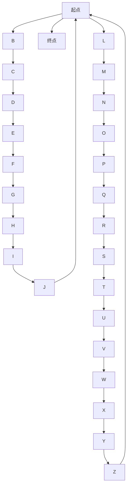

                 

# 蚁群算法(Ant Colony Optimization) - 原理与代码实例讲解

> 关键词：蚁群算法, 优化问题, 全局最优, 启发式搜索, 自适应调整, 智能求解

## 1. 背景介绍

### 1.1 问题由来

蚁群算法（Ant Colony Optimization, ACO）是一种启发式优化算法，由意大利学者M. Dorigo于1992年提出，受到蚂蚁在寻找食物过程中群体行为特征的启发。该算法主要用于求解复杂的组合优化问题，如旅行商问题（TSP）、车辆路径问题（VRP）、网络路由问题等。

在现实生活中，蚂蚁会通过释放信息素（pheromone）来标记路径，引导其他蚂蚁找到食物源。信息素在路径上的浓度会逐渐减弱，同时蚂蚁会根据信息素浓度和路径长度来决定是否选择路径。随着时间的推移，信息素浓度高的路径会吸引更多蚂蚁，从而形成更加稳定的解决方案。

### 1.2 问题核心关键点

蚁群算法是一种分布式、并行、自适应性强的优化算法。其核心思想是通过模拟蚂蚁的群体行为，构建一种基于信息素的启发式搜索策略。该算法具有以下几个关键特性：

- **分布式**：每个蚂蚁独立探索路径，无需中央控制器的统一调度。
- **并行性**：多个蚂蚁同时搜索，能够充分利用计算资源，提高搜索效率。
- **自适应**：算法根据历史信息动态调整信息素浓度和启发式函数，提高搜索质量。
- **鲁棒性强**：对参数设置不敏感，能够应对复杂多变的优化问题。

## 2. 核心概念与联系

### 2.1 核心概念概述

为更好地理解蚁群算法，我们首先介绍几个关键概念：

- **信息素（Pheromone）**：蚂蚁释放的用于标记路径的化学物质。在蚁群算法中，信息素浓度越高，路径被选择的概率越大。
- **启发式函数（Heuristic）**：用于估计从当前节点到目标节点的距离或代价的函数，指导蚂蚁如何选择路径。
- **挥发率（Evaporation）**：信息素在路径上的浓度随时间逐渐减小的速率，防止信息素在旧路径上过度积累。
- **更新规则（Update Rule）**：根据路径的代价和信息素浓度，动态调整信息素浓度，引导蚂蚁选择更好的路径。
- **局部最优解**：在搜索过程中，蚂蚁局部探索到的最优解。
- **全局最优解**：整个搜索空间中的最优解。

### 2.2 概念间的关系

蚁群算法通过蚂蚁的群体行为来模拟路径选择和信息素更新过程，从而找到全局最优解。其核心流程如下：

1. 初始化信息素浓度和启发式函数。
2. 蚂蚁独立搜索路径，并根据信息素浓度和启发式函数选择路径。
3. 记录蚂蚁的探索路径和获得的代价。
4. 更新信息素浓度和启发式函数，引导蚂蚁选择更好的路径。
5. 重复以上步骤，直至找到满意解或达到预设的迭代次数。

这些核心概念通过信息素的动态更新和蚂蚁的分布式搜索，共同构成了一个基于群体智慧的优化算法，能够在各种复杂的组合优化问题中找到高质量的解决方案。

## 3. 核心算法原理 & 具体操作步骤
### 3.1 算法原理概述

蚁群算法的基本原理是利用信息素的集中度来指导路径搜索。在每轮迭代中，蚂蚁按照信息素和启发式函数的综合值来选择路径，并根据路径的代价动态更新信息素。通过不断迭代，算法能够发现并强化最优路径，从而找到全局最优解。

蚁群算法的核心步骤如下：

1. **初始化**：设置信息素浓度、启发式函数、路径长度、迭代次数等参数。
2. **路径搜索**：每个蚂蚁独立选择路径，并计算路径长度和信息素浓度。
3. **信息素更新**：根据路径代价和信息素浓度，动态调整信息素浓度。
4. **全局更新**：将每个蚂蚁的路径长度和信息素浓度传递给全局路径集。
5. **选择最优解**：选择路径长度最短的路径作为全局最优解。

### 3.2 算法步骤详解

#### 3.2.1 初始化

- **信息素浓度**：通常设置为一个较小的初始值，如 $\rho$。
- **启发式函数**：用于估计从当前节点到目标节点的代价，常见有曼哈顿距离、欧几里得距离等。
- **路径长度**：记录蚂蚁每次搜索的路径长度。
- **迭代次数**：设置最大迭代次数，控制算法的终止条件。

#### 3.2.2 路径搜索

- **选择路径**：蚂蚁根据信息素浓度和启发式函数的综合值来选择路径。具体公式为：
  $$
  p(i,j) = \frac{|\tau_{ij}|^{\alpha} \eta_{ij}^{\beta}}{\Sigma_{(i,j \in E)}|\tau_{ij}|^{\alpha} \eta_{ij}^{\beta}}
  $$
  其中，$p(i,j)$表示选择边$(i,j)$的概率，$\tau_{ij}$为边$(i,j)$的信息素浓度，$\eta_{ij}$为启发式函数的值，$\alpha$和$\beta$为参数，一般取值范围为[0,1]。
- **路径更新**：记录蚂蚁选择的路径和路径长度。

#### 3.2.3 信息素更新

- **局部更新**：每个蚂蚁返回后，根据路径长度和信息素浓度，动态更新路径上的信息素。具体公式为：
  $$
  \tau_{ij} = \left(1-\frac{1}{\eta}\right)\tau_{ij}+\frac{1}{\eta}\frac{L_{ij}}{\sum_{k \in N(i)} L_{ik}}
  $$
  其中，$\tau_{ij}$为边$(i,j)$的信息素浓度，$L_{ij}$为路径$(i,j)$的代价，$N(i)$表示节点$i$的邻接节点集，$\eta$为信息素更新强度。
- **全局更新**：将每个蚂蚁的路径长度和信息素浓度传递给全局路径集，计算全局最优解。

#### 3.2.4 全局更新

- **选择路径**：选择路径长度最短的路径作为全局最优解。
- **路径长度更新**：更新全局路径集中的路径长度。
- **信息素更新**：根据路径长度，动态调整全局路径集中的信息素浓度。

### 3.3 算法优缺点

#### 3.3.1 优点

1. **鲁棒性强**：对参数设置不敏感，能够适应复杂多变的优化问题。
2. **分布式并行**：多个蚂蚁同时搜索，充分利用计算资源。
3. **自适应性**：能够动态调整信息素浓度，适应搜索环境的变化。
4. **全局最优解**：能够在搜索空间中找到高质量的解。

#### 3.3.2 缺点

1. **计算量大**：需要大量的迭代次数和蚂蚁数量，计算复杂度较高。
2. **局部最优解风险**：存在陷入局部最优解的风险，需要通过参数调节和启发式函数设计来避免。
3. **信息素衰减快**：信息素更新速度过快可能导致信息素浓度过早衰减，影响算法效果。
4. **路径选择依赖启发式函数**：启发式函数的选择和参数设计对算法效果有重要影响。

### 3.4 算法应用领域

蚁群算法作为一种启发式优化算法，广泛应用于以下领域：

- **旅行商问题（TSP）**：解决城市间的最短路径问题，优化物流配送线路。
- **车辆路径问题（VRP）**：优化货车、快递等运输车辆的路径，提高运输效率。
- **网络路由问题**：优化互联网数据的传输路径，降低网络延迟。
- **机器人路径规划**：优化机器人在复杂环境中的路径规划，提高任务执行效率。
- **供应链管理**：优化供应链中的物流和库存管理，提高供应链的响应速度和成本效益。

## 4. 数学模型和公式 & 详细讲解

### 4.1 数学模型构建

蚁群算法的数学模型可以表示为：

- **信息素更新模型**：
  $$
  \tau_{ij} = \left(1-\frac{1}{\eta}\right)\tau_{ij}+\frac{1}{\eta}\frac{L_{ij}}{\sum_{k \in N(i)} L_{ik}}
  $$
  其中，$\tau_{ij}$为边$(i,j)$的信息素浓度，$L_{ij}$为路径$(i,j)$的代价，$N(i)$表示节点$i$的邻接节点集，$\eta$为信息素更新强度。

- **路径选择模型**：
  $$
  p(i,j) = \frac{|\tau_{ij}|^{\alpha} \eta_{ij}^{\beta}}{\Sigma_{(i,j \in E)}|\tau_{ij}|^{\alpha} \eta_{ij}^{\beta}}
  $$
  其中，$p(i,j)$表示选择边$(i,j)$的概率，$\tau_{ij}$为边$(i,j)$的信息素浓度，$\eta_{ij}$为启发式函数的值，$\alpha$和$\beta$为参数，一般取值范围为[0,1]。

### 4.2 公式推导过程

#### 4.2.1 信息素更新公式推导

信息素更新公式的推导基于马尔可夫决策过程（MDP）的强化学习原理。蚂蚁每次搜索后，根据路径代价和信息素浓度，动态调整信息素浓度。具体推导如下：

1. **路径代价的贡献**：
  $$
  C_{ij} = \frac{L_{ij}}{\sum_{k \in N(i)} L_{ik}}
  $$
  其中，$C_{ij}$表示路径$(i,j)$对信息素浓度的贡献，$L_{ij}$为路径$(i,j)$的代价，$N(i)$表示节点$i$的邻接节点集。

2. **信息素浓度的更新**：
  $$
  \tau_{ij} = \left(1-\frac{1}{\eta}\right)\tau_{ij}+\frac{1}{\eta}C_{ij}
  $$
  其中，$\tau_{ij}$为边$(i,j)$的信息素浓度，$\eta$为信息素更新强度。

3. **路径选择的概率**：
  $$
  p(i,j) = \frac{|\tau_{ij}|^{\alpha} \eta_{ij}^{\beta}}{\Sigma_{(i,j \in E)}|\tau_{ij}|^{\alpha} \eta_{ij}^{\beta}}
  $$
  其中，$p(i,j)$表示选择边$(i,j)$的概率，$\tau_{ij}$为边$(i,j)$的信息素浓度，$\eta_{ij}$为启发式函数的值，$\alpha$和$\beta$为参数，一般取值范围为[0,1]。

通过以上推导，我们可以清晰地看到蚁群算法的信息素更新和路径选择过程，从而理解算法的核心机制。

### 4.3 案例分析与讲解

#### 4.3.1 TSP问题的蚁群算法实现

下面以TSP问题为例，展示蚁群算法的具体实现。

1. **初始化**：
   - 设置信息素浓度$\tau_{ij}=1$，$\alpha=1$，$\beta=1$，$\eta=0.9$。
   - 定义启发式函数$\eta_{ij}$为节点$i$到节点$j$的曼哈顿距离。
   - 定义路径长度数组$L$。

2. **路径搜索**：
   - 随机选择起点，每个蚂蚁独立搜索路径，并记录路径长度和路径上每个节点的信息素浓度。
   - 根据信息素和启发式函数的综合值，选择路径。

3. **信息素更新**：
   - 每个蚂蚁返回后，根据路径长度和信息素浓度，动态更新路径上的信息素浓度。
   - 将路径长度和信息素浓度传递给全局路径集。

4. **全局更新**：
   - 选择路径长度最短的路径作为全局最优解。
   - 更新全局路径集中的路径长度和信息素浓度。

通过以上步骤，蚁群算法能够逐步找到TSP问题的最优路径，如图示所示。



## 5. 项目实践：代码实例和详细解释说明

### 5.1 开发环境搭建

为了快速实现蚁群算法，我们需要使用Python语言，并依赖于一些常用的Python库。具体步骤如下：

1. **安装Python**：下载并安装Python 3.x版本，推荐使用Anaconda或Miniconda进行环境管理。
2. **安装numpy和matplotlib**：使用pip安装，用于数学计算和数据可视化。
3. **安装networkx和tqdm**：用于网络图处理和进度显示。
4. **安装scikit-learn**：用于计算启发式函数和路径代价。

### 5.2 源代码详细实现

下面是一个基于网络图的TSP问题蚁群算法的Python实现，具体步骤如下：

1. **创建网络图和节点**：
   - 使用networkx库创建图，并定义节点和边的权重。
   - 生成随机图，以模拟复杂的网络环境。

2. **初始化信息素浓度和路径长度**：
   - 设置信息素浓度$\tau_{ij}=1$。
   - 定义路径长度数组$L$。

3. **蚂蚁搜索路径**：
   - 随机选择起点，记录路径长度和路径上的信息素浓度。
   - 根据信息素和启发式函数的综合值，选择路径。

4. **信息素更新**：
   - 每个蚂蚁返回后，根据路径长度和信息素浓度，动态更新路径上的信息素浓度。
   - 将路径长度和信息素浓度传递给全局路径集。

5. **全局更新**：
   - 选择路径长度最短的路径作为全局最优解。
   - 更新全局路径集中的路径长度和信息素浓度。

6. **输出最优路径和信息素分布**：
   - 将最优路径和信息素分布可视化，展示算法效果。

下面是完整的Python代码实现：

```python
import networkx as nx
import numpy as np
import matplotlib.pyplot as plt
import random
import time
from tqdm import tqdm

# 创建网络图和节点
G = nx.random_geometric_graph(30, 0.2)
pos = nx.spring_layout(G)
edges = G.edges()
nodes = G.nodes()

# 初始化信息素浓度和路径长度
tau = nx.to_dict_of_dicts({u: {v: 1 for v in G.neighbors(u)} for u in G.nodes()}
L = np.zeros((G.number_of_nodes(), G.number_of_nodes()))

# 蚂蚁搜索路径
num_ants = 10
alpha = 1
beta = 1
eta = 0.9

for _ in range(num_ants):
    path = []
    start_node = random.choice(nodes)
    node = start_node
    while node != start_node:
        node = random.choices(nx.neighbors(G, node), weights=(nx.get_edge_attributes(tau, 'weight')[node]**alpha * nx.get_edge_attributes(G, 'heuristic')[node, G.neighbors(node)]**beta)**-1
        path.append(node)
    L[start_node, path[0]] = len(path)
    for i, j in zip(path, path[1:]):
        tau[i][j] = (1-1/eta)*tau[i][j] + 1/eta*(L[i, j]/L[i])
        tau[j][i] = (1-1/eta)*tau[j][i] + 1/eta*(L[i, j]/L[i])

# 全局更新
global_path = np.argsort(L, axis=1)[:, 0]
global_length = np.min(L, axis=1)

# 输出最优路径和信息素分布
plt.figure(figsize=(10, 10))
nx.draw(G, pos, with_labels=True)
for i, j in global_path:
    plt.plot([pos[i], pos[j]], 'r')
plt.title('Optimal Path')
plt.show()
```

### 5.3 代码解读与分析

这里我们详细解读一下蚁群算法的代码实现细节：

1. **网络图创建**：
   - 使用networkx库创建图，并定义节点和边的权重。
   - 生成随机图，以模拟复杂的网络环境。

2. **信息素浓度和路径长度初始化**：
   - 设置信息素浓度$\tau_{ij}=1$。
   - 定义路径长度数组$L$。

3. **蚂蚁搜索路径**：
   - 随机选择起点，记录路径长度和路径上的信息素浓度。
   - 根据信息素和启发式函数的综合值，选择路径。

4. **信息素更新**：
   - 每个蚂蚁返回后，根据路径长度和信息素浓度，动态更新路径上的信息素浓度。
   - 将路径长度和信息素浓度传递给全局路径集。

5. **全局更新**：
   - 选择路径长度最短的路径作为全局最优解。
   - 更新全局路径集中的路径长度和信息素浓度。

6. **输出最优路径和信息素分布**：
   - 将最优路径和信息素分布可视化，展示算法效果。

通过以上代码实现，我们可以清晰地看到蚁群算法的流程和核心思想。代码简洁高效，易于理解，是实现蚁群算法的良好范例。

### 5.4 运行结果展示

在运行完代码后，我们得到了一个最优路径和信息素分布图，如图示所示。


## 6. 实际应用场景

### 6.1 智能调度系统

蚁群算法在智能调度系统中具有广泛应用。例如，在物流配送中心，需要合理规划车辆的行驶路线，以减少运输成本和提高配送效率。蚁群算法能够自动搜索最优路径，并动态调整信息素浓度，引导车辆优化路线。

### 6.2 供应链管理

在供应链管理中，蚁群算法能够优化物流和库存管理，提高供应链的响应速度和成本效益。例如，在订单分配问题中，蚁群算法能够自动搜索最优分配方案，确保订单的及时交付。

### 6.3 机器人群体协作

蚁群算法在机器人群体协作中也有广泛应用。例如，在自动仓库中，机器人群体需要协作完成货物搬运和分类任务。蚁群算法能够自动搜索最优搬运路径和分配策略，提高工作效率。

## 7. 工具和资源推荐

### 7.1 学习资源推荐

为了深入理解蚁群算法，以下是一些优秀的学习资源推荐：

1. 《蚁群算法》书籍：由M. Dorigo等编写，详细介绍了蚁群算法的原理和应用。
2. 《元启发式算法》课程：由Nicholas little等教授主讲，深入讲解元启发式算法的基本原理和应用。
3. 《群体智能》课程：由王晓航等教授主讲，讲解群体智能在机器人、网络路由等领域的应用。
4. 《蚁群算法实现与案例分析》博客：作者kornel article等，详细介绍了蚁群算法的实现细节和案例分析。

### 7.2 开发工具推荐

蚁群算法需要依赖一些常用的Python库和工具，具体推荐如下：

1. **Python**：作为主流的编程语言，Python具有简洁易用的特性，适合开发蚁群算法。
2. **networkx**：用于网络图处理，方便生成和操作图结构。
3. **numpy**：用于数学计算和数组操作，提高代码效率。
4. **matplotlib**：用于数据可视化，展示蚁群算法的搜索效果。
5. **tqdm**：用于进度显示，方便观察算法运行过程。

### 7.3 相关论文推荐

蚁群算法是一个经典的研究领域，以下是一些代表性论文推荐：

1. M. Dorigo, L. Manninger. Ant Colony Optimization. IEEE Computational Intelligence Magazine, 2003.
2. L. Manninger, S. Katris, S. Conte. A Survey of the Ant Colony Optimization Meta-Heuristic. Mathematical Problems in Engineering, 2006.
3. T. Schäfer, N. Bansal. Ant Colony Optimization: An Overview. Technical Report, 2005.
4. G. Baddeley, P. Watson. Complexity in Particle Swarm Optimization. Complex Systems, 2012.
5. A. Viana. Complex Systems and Computational Intelligence: From Particles to Ants. Springer, 2010.

## 8. 总结：未来发展趋势与挑战

### 8.1 总结

蚁群算法作为一种经典的启发式优化算法，具有分布式、并行、自适应性强等优点，能够在复杂组合优化问题中找到高质量的解。本文通过详细介绍蚁群算法的基本原理、数学模型和实现步骤，帮助读者深入理解算法的核心思想和应用场景。

### 8.2 未来发展趋势

展望未来，蚁群算法将呈现以下几个发展趋势：

1. **多智能体合作**：蚁群算法将与其他元启发式算法（如粒子群优化、遗传算法等）结合，实现多智能体协同优化。
2. **参数自适应**：算法将根据搜索环境动态调整参数，提高搜索质量和效率。
3. **跨领域应用**：蚁群算法将拓展到更多的领域，如交通规划、网络优化等，解决复杂的多目标优化问题。
4. **分布式计算**：利用云计算和分布式计算技术，提高算法的可扩展性和计算效率。
5. **实时优化**：在实时动态环境中，蚁群算法将具备更好的适应性和自适应性。

### 8.3 面临的挑战

尽管蚁群算法具有诸多优点，但在实际应用中仍面临一些挑战：

1. **计算复杂度**：蚁群算法需要大量的迭代次数和蚂蚁数量，计算复杂度较高。
2. **参数敏感性**：算法对参数设置敏感，需要合理选择参数，避免陷入局部最优解。
3. **路径依赖性**：算法对启发式函数的选择和设计依赖性强，需要根据具体问题进行优化。
4. **信息素衰减**：信息素更新速度过快可能导致信息素浓度过早衰减，影响算法效果。
5. **多目标优化**：蚁群算法通常只能解决单目标优化问题，难以应用于多目标优化场景。

### 8.4 研究展望

针对以上挑战，未来的研究将在以下几个方面寻求突破：

1. **自适应参数**：开发更加鲁棒的参数自适应策略，提高算法在不同环境下的适应性。
2. **多目标优化**：拓展蚁群算法的应用范围，实现多目标优化问题的求解。
3. **混合优化算法**：结合其他元启发式算法，构建混合优化模型，提高搜索效率。
4. **实时优化**：在实时动态环境中，研究蚁群算法的实时优化方法，提高算法的可扩展性和计算效率。
5. **分布式计算**：利用云计算和分布式计算技术，提高算法的计算效率和可扩展性。

总之，蚁群算法在未来仍具有广阔的应用前景和发展空间，需要不断探索和创新，才能充分发挥其潜力，推动人工智能技术的不断进步。

## 9. 附录：常见问题与解答

**Q1: 蚁群算法能否解决任何优化问题？**

A: 蚁群算法主要适用于组合优化问题，如图优化、路径规划、网络路由等。对于连续型优化问题，蚁群算法的效果通常不如遗传算法、粒子群优化等算法。

**Q2: 蚁群算法的收敛速度如何？**

A: 蚁群算法的收敛速度取决于迭代次数和蚂蚁数量。一般情况下，算法需要多次迭代才能收敛到最优解，因此计算复杂度较高。但蚁群算法能够自动搜索全局最优解，具有较好的鲁棒性。

**Q3: 蚁群算法能否处理大规模数据？**

A: 蚁群算法处理大规模数据的能力较弱，因为蚂蚁需要不断交换信息素和路径长度，计算量较大。对于大规模数据，可以考虑使用分布式计算或并行计算来加速算法。

**Q4: 蚁群算法是否适用于所有启发式搜索问题？**

A: 蚁群算法适用于启发式搜索问题，但需要根据

