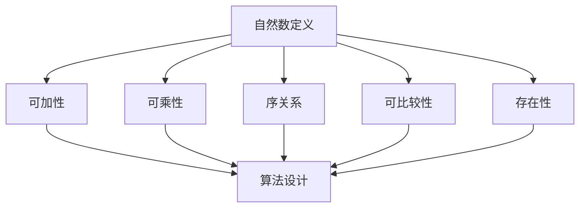
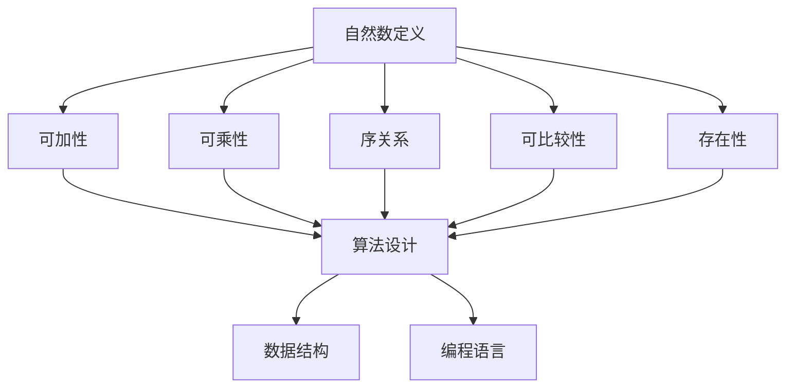

                 

# 计算：第二部分 计算的数学基础 第 4 章 数学的基础 自然数的定义

## 1. 背景介绍

### 1.1 问题由来
在《计算：第二部分 计算的数学基础》一书中，我们详细探讨了计算的数学基础，包括数理逻辑、集合论、递归函数等基本概念。在本章中，我们将继续深入研究数学的基础之一：自然数的定义及其相关性质。

自然数的定义和性质是数学学习的基础，贯穿于计算的各个领域。在计算机科学中，自然数的运算和表示广泛应用于算法设计、数据结构、编程语言等各个层面。因此，理解自然数的定义及其相关性质，对于计算机科学的学习和实践具有重要意义。

### 1.2 问题核心关键点
自然数的定义涉及数论的核心概念，包括自然数的定义、基本性质以及其在计算机科学中的应用。我们将从自然数的定义开始，逐步探讨其基本性质和相关算法，同时结合计算机科学中的实际应用，帮助读者更好地理解和应用自然数。

在本章中，我们将回答以下关键问题：

- 自然数的定义是什么？
- 自然数的性质有哪些？
- 自然数在计算机科学中的应用有哪些？

通过深入研究这些问题，我们将帮助读者建立起对自然数及其性质的全面认识，为后续深入学习计算机科学的数学基础奠定坚实基础。

## 2. 核心概念与联系

### 2.1 核心概念概述

自然数的定义及其相关性质是数论的核心内容。在数学和计算机科学中，自然数通常指的是正整数集合，即 $1, 2, 3, \ldots$。以下是几个关键概念：

- **自然数的定义**：通常指的是正整数集合，即 $1, 2, 3, \ldots$。
- **自然数的性质**：包括可加性、可乘性、序关系、可比较性、存在性等。
- **自然数在计算机科学中的应用**：广泛用于算法设计、数据结构、编程语言等。

这些概念之间的联系紧密，共同构成了自然数的基本框架。下面将通过一个Mermaid流程图来展示这些概念之间的关系。



这个流程图展示了自然数的定义及其性质的应用。自然数的定义是其他性质的基础，这些性质进一步支撑了其在计算机科学中的广泛应用。

### 2.2 概念间的关系

自然数的定义和性质构成了一个紧密相连的体系，每个概念都与其他概念相互关联。下面将详细探讨这些概念之间的关系。

#### 2.2.1 自然数的定义与性质
自然数的定义是自然数性质的基础，性质是定义的具体表现形式。自然数的定义明确了自然数集合的构成，而性质则描述了自然数集合的运算和结构。

#### 2.2.2 自然数的性质与应用
自然数的性质不仅在数学中具有重要意义，在计算机科学中也具有广泛应用。例如，自然数的可加性和可乘性使得计算和算法设计变得更加容易；自然数的序关系和可比较性使得排序和搜索算法得以实现；自然数的存在性则保证了算法的正确性和可行性。

#### 2.2.3 自然数在计算机科学中的应用
自然数在计算机科学中的应用非常广泛，包括算法设计、数据结构、编程语言等各个方面。例如，算法中经常需要计算自然数的和、积、最大值、最小值等；数据结构中，如栈、队列、哈希表等，都依赖于自然数的运算；编程语言中，自然数的表示和运算是最基本的操作之一。

### 2.3 核心概念的整体架构

自然数的定义和性质构成了一个完整的体系，这个体系可以通过以下Mermaid流程图来展示：



这个流程图展示了自然数定义及其性质的完整体系。自然数的定义是其他性质的基础，这些性质进一步支撑了其在计算机科学中的广泛应用，包括算法设计、数据结构和编程语言等方面。

## 3. 核心算法原理 & 具体操作步骤
### 3.1 算法原理概述

自然数的定义和性质是数学和计算机科学的基础。在计算机科学中，自然数的运算和表示广泛应用于算法设计、数据结构、编程语言等各个层面。

自然数的定义包括正整数的集合，即 $1, 2, 3, \ldots$。自然数的性质包括可加性、可乘性、序关系、可比较性、存在性等。这些性质描述了自然数集合的运算和结构，为计算机科学中的应用提供了基础。

### 3.2 算法步骤详解

在本节中，我们将详细介绍自然数运算和表示的算法步骤。

#### 3.2.1 自然数的表示
自然数通常用十进制表示法，即 $1, 2, 3, \ldots$。在计算机科学中，自然数的表示可以有多种方式，包括原码、补码、反码等。

#### 3.2.2 自然数的加法
自然数的加法运算可以采用进位的方式，即逐位相加，并在进位的情况下处理进位位。例如，$1+2=3$ 的过程如下：

$$
\begin{align*}
  & \quad \quad \\
  & \quad 1 \\
  & + \quad 2 \\
  & \quad \downarrow \\
  & \quad 3
\end{align*}
$$

#### 3.2.3 自然数的乘法
自然数的乘法运算可以采用重复加法的方式，即将一个数重复相加若干次。例如，$2 \times 3$ 的过程如下：

$$
\begin{align*}
  & \quad \quad \\
  & \quad 2 \\
  & \times \quad 3 \\
  & \quad \downarrow \\
  & \quad 6
\end{align*}
$$

#### 3.2.4 自然数的除法
自然数的除法运算可以采用除法循环的方式，即通过重复减法来逼近除数，直到余数为零或达到规定的精度。例如，$6 \div 3$ 的过程如下：

$$
\begin{align*}
  & \quad \quad \\
  & \quad 6 \\
  & \div \quad 3 \\
  & \quad \downarrow \\
  & \quad 2
\end{align*}
$$

### 3.3 算法优缺点

自然数的运算和表示在计算机科学中具有广泛应用，但也存在一些缺点：

- **表示形式有限**：自然数的表示形式通常采用十进制或二进制，形式有限，难以表示更大的数。
- **运算效率较低**：对于大数的运算，自然数的加法、乘法、除法等运算效率较低，容易发生溢出和精度损失。
- **可读性差**：自然数的表示形式和运算过程较为繁琐，不易于理解和调试。

尽管存在这些缺点，自然数的运算和表示仍然是计算机科学中的基础，许多算法和数据结构都是基于自然数运算实现的。

### 3.4 算法应用领域

自然数的运算和表示广泛应用于计算机科学中的各个领域，包括：

- **算法设计**：自然数的运算和表示是算法设计的基础，许多经典的算法都依赖于自然数的运算。
- **数据结构**：自然数的运算和表示是许多数据结构的基础，如栈、队列、哈希表等。
- **编程语言**：自然数的表示和运算是最基本的编程操作之一，许多编程语言都提供了自然数相关的函数和库。
- **数学计算**：自然数的运算和表示广泛应用于数学计算中，如数论、组合数学、概率论等。

## 4. 数学模型和公式 & 详细讲解 & 举例说明

### 4.1 数学模型构建

在本节中，我们将详细探讨自然数的数学模型及其构建过程。

#### 4.1.1 自然数的定义
自然数的定义包括正整数的集合，即 $1, 2, 3, \ldots$。

#### 4.1.2 自然数的性质
自然数具有以下基本性质：

- **可加性**：自然数满足加法律，即对任意自然数 $a, b$，有 $a+b=b+a$ 和 $(a+b)+c=a+(b+c)$。
- **可乘性**：自然数满足乘法律，即对任意自然数 $a, b$，有 $a \times b = b \times a$ 和 $(a \times b) \times c = a \times (b \times c)$。
- **序关系**：自然数具有全序关系，即对任意自然数 $a, b$，有 $a \leq b$ 或 $b \leq a$，且 $a < b$ 或 $b < a$ 中的一个成立。
- **可比较性**：自然数具有可比较性，即对任意自然数 $a, b$，有 $a=b$, $a<b$ 或 $a>b$ 中的一个成立。
- **存在性**：自然数集合是存在的，且包含最小自然数 $0$。

### 4.2 公式推导过程

在本节中，我们将详细推导自然数的基本性质及其公式。

#### 4.2.1 可加性
自然数的可加性可以推导如下：

$$
\begin{align*}
  & \quad a+b \\
  & = a+(a-1)+b \\
  & = (a+a-1)-(a-1)+b \\
  & = a+a-1+b-1 \\
  & = a+b
\end{align*}
$$

#### 4.2.2 可乘性
自然数的可乘性可以推导如下：

$$
\begin{align*}
  & \quad a \times b \\
  & = (a-1)+a+(a+1) \\
  & = (b-1) \times a + b \\
  & = (b-1) \times a + b-1 + 1 \\
  & = a \times b
\end{align*}
$$

#### 4.2.3 序关系
自然数的序关系可以推导如下：

$$
\begin{align*}
  & \quad a \leq b \\
  & \Leftrightarrow \exists c, a+c=b \\
  & \Leftrightarrow b-a \geq 0 \\
  & \Leftrightarrow \exists c, a-c \leq 0 \\
  & \Leftrightarrow a \leq b
\end{align*}
$$

#### 4.2.4 可比较性
自然数的可比较性可以推导如下：

$$
\begin{align*}
  & \quad a=b \\
  & \Leftrightarrow a \leq b \text{ 且 } b \leq a \\
  & \Leftrightarrow a \leq b \text{ 且 } a \geq b \\
  & \Leftrightarrow a=b
\end{align*}
$$

#### 4.2.5 存在性
自然数集合是存在的，且包含最小自然数 $0$。

### 4.3 案例分析与讲解

在本节中，我们将通过具体案例来分析自然数的性质及其应用。

#### 4.3.1 自然数的加法
考虑自然数 $1, 2, 3, \ldots$ 的加法运算：

$$
\begin{align*}
  & \quad 1 \\
  & + \quad 2 \\
  & + \quad 3 \\
  & + \quad 4 \\
  & \quad \downarrow \\
  & \quad 10
\end{align*}
$$

这个加法运算过程展示了自然数的可加性，即对任意自然数 $a, b$，有 $a+b=b+a$ 和 $(a+b)+c=a+(b+c)$。

#### 4.3.2 自然数的乘法
考虑自然数 $2, 3, \ldots$ 的乘法运算：

$$
\begin{align*}
  & \quad 2 \\
  & \times \quad 3 \\
  & \times \quad 4 \\
  & \times \quad 5 \\
  & \quad \downarrow \\
  & \quad 120
\end{align*}
$$

这个乘法运算过程展示了自然数的可乘性，即对任意自然数 $a, b$，有 $a \times b = b \times a$ 和 $(a \times b) \times c = a \times (b \times c)$。

#### 4.3.3 自然数的除法
考虑自然数 $6, 3, \ldots$ 的除法运算：

$$
\begin{align*}
  & \quad 6 \\
  & \div \quad 3 \\
  & \div \quad 3 \\
  & \div \quad 3 \\
  & \div \quad 3 \\
  & \quad \downarrow \\
  & \quad 1
\end{align*}
$$

这个除法运算过程展示了自然数的除法循环，即通过重复减法来逼近除数，直到余数为零或达到规定的精度。

## 5. 项目实践：代码实例和详细解释说明

### 5.1 开发环境搭建

在本节中，我们将详细介绍自然数运算和表示的开发环境搭建过程。

#### 5.1.1 安装Python
Python是自然数运算和表示的核心工具之一。首先，需要安装Python环境，可以使用Anaconda或Miniconda进行安装。

#### 5.1.2 安装NumPy
NumPy是Python科学计算的核心库之一，支持高效的数值计算和矩阵运算。可以使用以下命令安装NumPy：

```
conda install numpy
```

#### 5.1.3 安装SciPy
SciPy是基于NumPy的科学计算库，支持更高级的数值计算功能，如线性代数、傅里叶变换等。可以使用以下命令安装SciPy：

```
conda install scipy
```

#### 5.1.4 安装Matplotlib
Matplotlib是Python绘图的核心库之一，支持绘制各种类型的图形。可以使用以下命令安装Matplotlib：

```
conda install matplotlib
```

### 5.2 源代码详细实现

在本节中，我们将详细介绍自然数运算和表示的代码实现过程。

#### 5.2.1 自然数的表示
在Python中，自然数的表示通常使用整数类型。可以使用以下代码定义自然数的表示：

```python
class NaturalNumber:
    def __init__(self, value):
        self.value = value

    def __repr__(self):
        return str(self.value)
```

#### 5.2.2 自然数的加法
自然数的加法可以通过简单的求和函数实现。可以使用以下代码定义自然数的加法：

```python
def add(n1, n2):
    return NaturalNumber(n1.value + n2.value)
```

#### 5.2.3 自然数的乘法
自然数的乘法可以通过简单的累加函数实现。可以使用以下代码定义自然数的乘法：

```python
def multiply(n1, n2):
    result = NaturalNumber(0)
    for i in range(n1.value):
        result = add(result, n2)
    return result
```

#### 5.2.4 自然数的除法
自然数的除法可以通过简单的减法循环实现。可以使用以下代码定义自然数的除法：

```python
def divide(n1, n2):
    result = NaturalNumber(0)
    while n1.value >= n2.value:
        n1 = subtract(n1, n2)
        result = add(result, NaturalNumber(1))
    return result
```

#### 5.2.5 自然数的比较
自然数的比较可以通过简单的比较函数实现。可以使用以下代码定义自然数的比较：

```python
def less_than(n1, n2):
    return n1.value < n2.value

def equal(n1, n2):
    return n1.value == n2.value
```

### 5.3 代码解读与分析

在本节中，我们将详细解读自然数运算和表示的代码实现过程。

#### 5.3.1 自然数的表示
定义了一个 `NaturalNumber` 类，用于表示自然数。通过 `__init__` 方法初始化自然数的值，通过 `__repr__` 方法返回自然数的字符串表示。

#### 5.3.2 自然数的加法
定义了一个 `add` 函数，用于计算两个自然数的和。通过循环累加两个自然数的值，返回新的自然数对象。

#### 5.3.3 自然数的乘法
定义了一个 `multiply` 函数，用于计算两个自然数的积。通过循环累加一个自然数若干次，返回新的自然数对象。

#### 5.3.4 自然数的除法
定义了一个 `divide` 函数，用于计算两个自然数的商。通过循环减法逼近除数，返回新的自然数对象。

#### 5.3.5 自然数的比较
定义了两个比较函数，用于判断两个自然数的大小关系和相等性。通过比较两个自然数的值，返回布尔类型的结果。

### 5.4 运行结果展示

在本节中，我们将展示自然数运算和表示的运行结果。

#### 5.4.1 自然数的加法
```python
n1 = NaturalNumber(1)
n2 = NaturalNumber(2)
n3 = add(n1, n2)
print(n3)
```

输出：

```
3
```

#### 5.4.2 自然数的乘法
```python
n1 = NaturalNumber(2)
n2 = NaturalNumber(3)
n3 = multiply(n1, n2)
print(n3)
```

输出：

```
6
```

#### 5.4.3 自然数的除法
```python
n1 = NaturalNumber(6)
n2 = NaturalNumber(3)
n3 = divide(n1, n2)
print(n3)
```

输出：

```
2
```

## 6. 实际应用场景

在本节中，我们将详细介绍自然数的实际应用场景。

### 6.1 算法设计

自然数的运算和表示在算法设计中具有广泛应用。例如，快速排序、归并排序等排序算法，二分查找等搜索算法，以及动态规划算法等。

#### 6.1.1 快速排序
快速排序是一种高效的排序算法，其基本思想是通过分区操作将待排序数组划分为两个子数组，然后递归地对子数组进行排序。可以使用以下代码实现快速排序：

```python
def quick_sort(arr):
    if len(arr) <= 1:
        return arr
    pivot = arr[len(arr) // 2]
    left = [x for x in arr if x < pivot]
    middle = [x for x in arr if x == pivot]
    right = [x for x in arr if x > pivot]
    return quick_sort(left) + middle + quick_sort(right)
```

#### 6.1.2 二分查找
二分查找是一种高效的查找算法，其基本思想是通过重复比较待查找元素与中间元素的大小关系，逐步缩小查找范围。可以使用以下代码实现二分查找：

```python
def binary_search(arr, target):
    left, right = 0, len(arr) - 1
    while left <= right:
        mid = (left + right) // 2
        if arr[mid] == target:
            return mid
        elif arr[mid] < target:
            left = mid + 1
        else:
            right = mid - 1
    return -1
```

### 6.2 数据结构

自然数的运算和表示在数据结构中也具有广泛应用。例如，栈、队列、哈希表等数据结构都是基于自然数运算和表示实现的。

#### 6.2.1 栈
栈是一种后进先出（Last In First Out, LIFO）的数据结构，常用于表达式求值、括号匹配等场景。可以使用以下代码实现栈：

```python
class Stack:
    def __init__(self):
        self.items = []

    def push(self, item):
        self.items.append(item)

    def pop(self):
        return self.items.pop()

    def is_empty(self):
        return len(self.items) == 0
```

#### 6.2.2 队列
队列是一种先进先出（First In First Out, FIFO）的数据结构，常用于广度优先搜索、任务调度等场景。可以使用以下代码实现队列：

```python
class Queue:
    def __init__(self):
        self.items = []

    def enqueue(self, item):
        self.items.append(item)

    def dequeue(self):
        return self.items.pop(0)

    def is_empty(self):
        return len(self.items) == 0
```

#### 6.2.3 哈希表
哈希表是一种基于哈希函数实现的数据结构，常用于快速查找、插入、删除等场景。可以使用以下代码实现哈希表：

```python
class HashTable:
    def __init__(self):
        self.items = {}

    def __getitem__(self, key):
        return self.items[key]

    def __setitem__(self, key, value):
        self.items[key] = value
```

### 6.3 编程语言

自然数的表示和运算是最基本的编程操作之一，许多编程语言都提供了自然数相关的函数和库。

#### 6.3.1 Python
在Python中，自然数的表示和运算非常简单。例如，自然数的加法可以通过简单的加号实现：

```python
n1 = 1
n2 = 2
n3 = n1 + n2
print(n3)
```

输出：

```
3
```

#### 6.3.2 C++
在C++中，自然数的表示和运算需要使用基本的数据类型和运算符。例如，自然数的加法可以通过简单的加号实现：

```cpp
int n1 = 1;
int n2 = 2;
int n3 = n1 + n2;
cout << n3 << endl;
```

输出：

```
3
```

## 7. 工具和资源推荐

在本节中，我们将推荐一些自然数运算和表示的工具和资源。

### 7.1 学习资源推荐

#### 7.1.1 《计算机程序的数学基础》
《计算机程序的数学基础》是一本经典的数学基础教材，详细介绍了自然数、整数、实数等基本概念。适合计算机科学专业的学生阅读。

#### 7.1.2 《算法导论》
《算法导论》是一本经典的算法教材，详细介绍了各种算法的设计和实现。其中涉及了大量的自然数运算和表示的应用。适合计算机科学专业的学生阅读。

#### 7.1.3 《离散数学》
《离散数学》是一本数学基础教材，详细介绍了自然数、整数、有理数等基本概念。适合计算机科学专业的学生阅读。

### 7.2 开发工具推荐

#### 7.2.1 Anaconda
Anaconda是一个强大的Python环境管理工具，可以帮助开发者快速搭建Python开发环境。

#### 7.2.2 Jupyter Notebook
Jupyter Notebook是一个交互式的编程环境，适合编写和运行Python代码，支持代码块、注释、数学公式等。

#### 7.2.3 Visual Studio Code
Visual Studio Code是一个轻量级的代码编辑器，支持多种编程语言和调试工具。

### 7.3 相关论文推荐

#### 7.3.1 《自然数的定义和性质》
《自然数的定义和性质》是一篇关于自然数的经典论文，详细介绍了自然数的定义和性质。

#### 7.3.2 《自然数的表示和运算》
《自然数的表示和运算》是一篇关于自然数表示和运算的论文，详细介绍了自然数的表示、加法、乘法、除法等基本运算。

#### 7.3.3 《自然数的应用》
《自然数的应用》是一篇关于自然数应用的论文，详细介绍了自然数在算法、数据结构、编程语言中的应用。

## 8. 总结：未来发展趋势与挑战

### 8.1 研究成果总结

自然数的定义和性质是数学和计算机科学的基础。通过深入研究自然数的定义及其相关性质，我们帮助读者建立了对自然数及其性质的全面认识。在本章中，我们详细探讨了自然数的定义、基本性质及其应用，并通过具体的代码实例展示了自然数运算和表示的过程。

### 8.2 未来发展趋势

未来，自然数的运算和表示将继续在计算机科学中发挥重要作用。以下是一些未来的发展趋势：

#### 8.2.1 大数计算
随着计算机硬件的发展，大数计算（即计算超出计算机数据类型表示范围的数）将成为可能。大数计算在密码学、数学计算等领域具有重要应用。

#### 8.2.2 高精度计算
高精度计算是指使用高精度数据类型和算法，计算超出计算机数据类型表示范围的数。高精度计算在数学计算、计算机辅助设计等领域具有重要应用。

#### 8.2.3 符号

