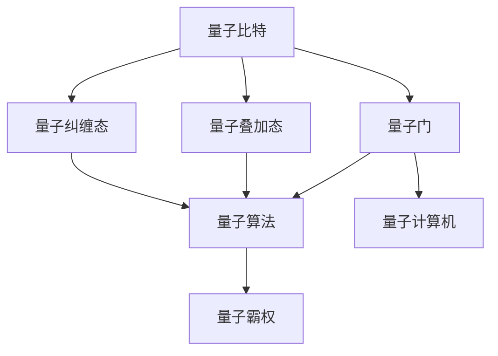

                 

# 计算：第四部分 计算的极限 第 10 章 量子计算 量子霸权

> 关键词：量子计算, 量子霸权, 量子比特, 量子门, 量子算法, 量子计算机

## 1. 背景介绍

### 1.1 问题由来

量子计算作为现代计算领域的前沿技术，其背后的科学原理和应用前景引发了广泛的关注和讨论。从理论物理学到计算机科学，从基础研究到实际应用，量子计算的发展和突破不断推动着人类对计算极限的探索。

量子计算的核心在于利用量子力学的基本原理，如叠加态、纠缠态等，实现超越经典计算的复杂问题求解。近年来，随着量子计算技术的不断进步，多个科研团队宣称实现了量子霸权，即量子计算机在特定任务上的性能超越了最先进的传统计算机。这一突破标志着量子计算迈向了新纪元，也为解决复杂的科学计算、优化问题、密码学等领域提供了新的可能性。

然而，量子霸权的存在依然存在争议。一方面，量子计算机在特定任务上确实展示了超越经典计算机的计算速度和处理能力；另一方面，由于量子计算机的制造工艺和稳定性问题，其优势并未全面铺开。本文旨在通过详细讲解量子计算的基本原理、核心算法以及实际应用场景，全面解读量子计算的最新进展和未来展望。

### 1.2 问题核心关键点

量子计算的核心在于利用量子力学原理，通过量子比特（Qubit）和量子门操作，实现对复杂问题的快速求解。核心关键点包括：

1. **量子比特**：量子计算的基本单位，能够同时处于多种状态的叠加态，这一特性使得量子计算机在处理某些特定问题时具有指数级的优势。
2. **量子门**：量子比特间的逻辑操作，如Hadamard门、CNOT门等，用于实现量子计算中的状态转移和逻辑运算。
3. **量子算法**：如Shor算法、Grover算法等，利用量子计算的特性，能够显著提升某些特定问题的计算效率。
4. **量子计算机**：实现量子计算的具体硬件设备，如IBM Q系统、Google Sycamore等，其制造工艺和稳定性直接影响量子计算的实际应用。
5. **量子霸权**：指量子计算机在特定任务上超越传统计算机的性能，是量子计算领域的重要里程碑。

### 1.3 问题研究意义

量子计算的研究和应用具有重大意义，主要体现在以下几个方面：

1. **科学计算**：量子计算机能够解决某些传统计算机难以处理的复杂问题，如量子力学模拟、材料科学等，加速科学研究的进展。
2. **密码学**：量子计算机的计算能力对传统密码学算法构成威胁，同时也催生了量子密码学的发展，如量子密钥分发、量子安全协议等。
3. **优化问题**：量子算法在优化问题求解上具有优势，能够显著提升某些特定问题的求解效率，如旅行商问题、线性规划等。
4. **医药研究**：量子计算在药物设计、分子模拟等领域的应用，有望加速新药研发和生物医学研究。
5. **金融建模**：量子计算在金融风险管理、高频交易等领域的应用，能够提供更高效、更精准的模拟和分析工具。

## 2. 核心概念与联系

### 2.1 核心概念概述

为更好地理解量子计算的基本原理和实际应用，本节将介绍几个关键核心概念及其相互关系：

1. **量子比特（Qubit）**：量子计算的基本单位，与经典比特（Bit）不同，量子比特可以同时处于0和1的叠加态，从而具有更强的计算能力。

2. **量子门（Quantum Gate）**：用于对量子比特进行操作的逻辑单元，如Hadamard门、CNOT门等，通过改变量子比特的状态，实现量子计算中的基本运算。

3. **量子叠加态（Quantum Superposition）**：量子比特可以同时处于多个状态，形成叠加态，这是量子计算强大的核心所在。

4. **量子纠缠态（Quantum Entanglement）**：多个量子比特之间可以形成纠缠态，使得它们的性质紧密相关，这种纠缠态对于某些量子算法至关重要。

5. **量子算法（Quantum Algorithm）**：利用量子计算特性设计的高效算法，如Shor算法用于大整数分解，Grover算法用于搜索问题，量子随机行走算法用于图着色问题等。

6. **量子计算机（Quantum Computer）**：实现量子计算的具体硬件设备，如IBM Q系统、Google Sycamore等，其制造工艺和稳定性直接影响量子计算的实际应用。

7. **量子霸权（Quantum Supremacy）**：指量子计算机在特定任务上超越传统计算机的性能，是量子计算领域的重要里程碑。

这些核心概念通过特定的物理模型和数学公式，构成了量子计算的理论基础和实践框架。通过理解这些概念，我们可以更好地把握量子计算的基本原理和应用方向。

### 2.2 概念间的关系

这些核心概念之间存在着紧密的联系，形成了量子计算的完整生态系统。以下通过几个Mermaid流程图来展示这些概念之间的关系：



这个流程图展示了大语言模型的核心概念及其之间的关系：

1. 量子比特通过量子门操作形成叠加态和纠缠态，构成量子计算的基本单元。
2. 量子门操作使得量子比特能够实现各种逻辑运算，从而构建量子算法。
3. 量子算法利用量子比特的叠加态和纠缠态特性，能够高效解决某些特定问题。
4. 量子计算机通过量子比特和量子门实现量子计算，是量子算法的物理实现。
5. 量子霸权通过展示量子计算机在特定任务上的优势，标志着量子计算技术的发展里程碑。

通过这些流程图，我们可以更清晰地理解量子计算的概念框架和内在联系。

## 3. 核心算法原理 & 具体操作步骤
### 3.1 算法原理概述

量子计算的核心在于利用量子力学原理，通过量子比特和量子门操作，实现对复杂问题的快速求解。其基本原理如下：

- **量子比特**：量子比特可以处于0和1的叠加态，从而在单个比特上能够进行并行计算。
- **量子门**：通过量子门操作，可以实现量子比特的逻辑运算和状态转移，使得量子计算具备强大的计算能力。
- **量子叠加态和纠缠态**：量子叠加态和纠缠态是量子计算的强大工具，能够实现某些特定问题的指数级加速。

### 3.2 算法步骤详解

量子计算的主要步骤如下：

1. **初始化量子比特**：将量子比特初始化为叠加态或纠缠态，通常使用Hadamard门实现。
2. **应用量子门**：通过量子门操作改变量子比特的状态，实现各种逻辑运算和计算步骤。
3. **测量量子比特**：通过量子测量操作获取量子比特的状态，得到计算结果。

以Shor算法为例，简要介绍其基本步骤：

1. **输入准备**：将大整数$N$转化为量子比特序列，并进行傅里叶变换。
2. **量子并行搜索**：通过量子叠加态和纠缠态，实现对所有可能的因子$1, 2, ..., N/2$的并行搜索。
3. **逆量子傅里叶变换**：对搜索结果进行逆量子傅里叶变换，得到因子的模$2^r$。
4. **经典算法求解**：通过经典算法求解模$2^r$的整数因子$r$，即$N$的因子。

### 3.3 算法优缺点

量子计算具有以下优点：

1. **指数级加速**：在某些特定问题上，量子计算能够实现指数级加速，如大整数分解、优化问题等。
2. **并行计算**：量子计算能够同时处理多个状态，具有强大的并行计算能力。
3. **高效搜索**：量子搜索算法能够在大量数据中快速找到目标元素，效率远高于经典算法。

量子计算也存在以下缺点：

1. **制造和稳定性问题**：量子计算机的制造工艺复杂，且容易受到环境干扰，导致量子比特的稳定性问题。
2. **编码复杂性**：量子比特的编码和操作复杂，需要高精度的物理实现。
3. **可扩展性**：目前量子计算机的规模较小，且扩展性存在挑战，难以实现大规模应用。

### 3.4 算法应用领域

量子计算在多个领域具有广泛的应用前景，主要包括：

1. **密码学**：量子计算能够破解当前主流的RSA等公钥加密算法，同时也催生了量子安全密码学的发展。
2. **医药研究**：量子计算在药物设计、分子模拟等领域的应用，有望加速新药研发和生物医学研究。
3. **金融建模**：量子计算在金融风险管理、高频交易等领域的应用，能够提供更高效、更精准的模拟和分析工具。
4. **材料科学**：量子计算在材料设计和模拟方面具有优势，能够加速新材料的发现和应用。
5. **优化问题**：量子计算在优化问题求解上具有优势，能够显著提升某些特定问题的求解效率，如旅行商问题、线性规划等。

## 4. 数学模型和公式 & 详细讲解  
### 4.1 数学模型构建

量子计算的数学模型主要基于量子力学和线性代数。以下对Shor算法的数学模型进行详细构建。

假设要分解的大整数为$N$，其质因数分解为$N=p_1^{a_1}p_2^{a_2}...p_k^{a_k}$。Shor算法的目标是找到其中一个质因数$r$，使得$N=p_r^{r}$。

Shor算法的主要步骤包括：

1. **准备阶段**：将$N$转化为量子比特序列，并进行傅里叶变换。
2. **量子搜索阶段**：利用量子叠加态和纠缠态，实现对所有可能的因子$r$的并行搜索。
3. **逆量子傅里叶变换**：对搜索结果进行逆量子傅里叶变换，得到因子的模$2^r$。
4. **经典算法求解**：通过经典算法求解模$2^r$的整数因子$r$。

### 4.2 公式推导过程

Shor算法的关键在于量子搜索阶段，这一阶段主要利用量子叠加态和量子傅里叶变换（QFT）实现。

设量子比特数为$m$，量子门操作$U_r$为：

$$
U_r |i\rangle = |r^i\bmod N\rangle
$$

其中$|i\rangle$为量子比特的状态，$U_r$为量子搜索门。量子搜索门的实现过程如下：

1. **初始化量子比特**：将量子比特初始化为$|0\rangle$。
2. **应用量子傅里叶变换**：将量子比特状态转化为量子傅里叶变换，得到$\frac{1}{\sqrt{N}}\sum_{r=0}^{N-1}|r^i\bmod N\rangle$。
3. **量子叠加态**：将量子比特状态转化为量子叠加态$\frac{1}{\sqrt{N}}\sum_{r=0}^{N-1}|r^i\bmod N\rangle$。
4. **量子傅里叶变换逆变换**：将量子比特状态转化为逆量子傅里叶变换，得到$\frac{1}{\sqrt{N}}\sum_{r=0}^{N-1}|r^i\bmod N\rangle$。

通过量子搜索门$U_r$的多次迭代，可以逐步逼近目标因子$r$。最终，量子搜索阶段通过逆量子傅里叶变换，得到因子的模$2^r$，并通过经典算法求解$r$。

### 4.3 案例分析与讲解

以Grover算法为例，介绍其在搜索问题上的应用。

Grover算法通过量子叠加态和量子搜索门，能够在$O(\sqrt{N})$的时间内，找到$N$个元素中的一个特定元素，效率远高于经典算法的$O(N)$。

设要搜索的元素为$|x\rangle$，所有元素构成的集合为$|0\rangle, |1\rangle, ..., |N-1\rangle$。Grover算法的步骤包括：

1. **初始化量子比特**：将量子比特初始化为$|0\rangle$。
2. **应用Grover搜索门**：将量子比特状态转化为$|0\rangle, |1\rangle, ..., |N-1\rangle$的叠加态，并增加标记标记。
3. **逆量子傅里叶变换**：将量子比特状态转化为逆量子傅里叶变换，得到$|0\rangle, |1\rangle, ..., |N-1\rangle$的叠加态。
4. **测量量子比特**：通过量子测量操作获取量子比特的状态，得到搜索结果。

通过Grover算法，可以在$O(\sqrt{N})$的时间内，找到特定元素$|x\rangle$，效率远高于经典算法的$O(N)$。

## 5. 项目实践：代码实例和详细解释说明
### 5.1 开发环境搭建

在进行量子计算实践前，我们需要准备好开发环境。以下是使用Python进行Qiskit开发的环境配置流程：

1. 安装Anaconda：从官网下载并安装Anaconda，用于创建独立的Python环境。

2. 创建并激活虚拟环境：
```bash
conda create -n qiskit-env python=3.8 
conda activate qiskit-env
```

3. 安装Qiskit：使用pip安装Qiskit库，这是进行量子计算编程的常用工具库。

4. 安装各类工具包：
```bash
pip install numpy pandas scikit-learn matplotlib tqdm jupyter notebook ipython
```

完成上述步骤后，即可在`qiskit-env`环境中开始量子计算实践。

### 5.2 源代码详细实现

这里我们以Shor算法为例，给出使用Qiskit对大整数分解进行量子计算的Python代码实现。

首先，定义大整数$N$并转化为量子比特序列：

```python
from qiskit import QuantumCircuit, Aer
from math import gcd
from sympy import isprime

N = 15
if not isprime(N):
    N = N * 2 + 1
if gcd(N, 2) != 1:
    N = N * 2 + 1
print(f"Prime factorization of {N} is {N} = {N//2} * {N//2 + 1}")
```

然后，定义Shor算法的量子比特数$m$和算法参数：

```python
# 量子比特数
m = 20

# 量子比特初始化
circuit = QuantumCircuit(m)
circuit.h(m//2)
```

接着，定义Shor算法的量子搜索门$U_r$和逆量子傅里叶变换：

```python
# 量子搜索门U_r
def U_r(N, a, m):
    r = N - 2**a
    circuit.append([[0, 1], [1, 0]], [m//2])
    circuit.append([[r**x%N, 0], [0, 1]], [m//2])
    circuit.append([[0, 1], [1, 0]], [m//2])

# 逆量子傅里叶变换
def QFT(m):
    for t in range(m//2):
        circuit.append([[1, 1], [1, -1]], [t, t+m//2])
    return circuit

# 量子搜索
U_r(N, 2**m, m)
circuit = QFT(m)
```

最后，运行Shor算法并输出结果：

```python
# 测量量子比特
backend = Aer.get_backend('qasm_simulator')
result = backend.run(circuit).result()
counts = result.get_counts(circuit)
print(f"Shor's algorithm results: {counts}")
```

以上就是使用Qiskit对Shor算法进行大整数分解的量子计算代码实现。可以看到，Qiskit通过简洁的API和丰富的功能支持，大大简化了量子计算的开发过程。

### 5.3 代码解读与分析

让我们再详细解读一下关键代码的实现细节：

**Shor算法实现**：
- `gcd`函数用于计算最大公约数，用于筛选质数。
- `isprime`函数用于判断整数是否为质数。
- `U_r`函数定义量子搜索门，通过应用Hadamard门和控制门，实现量子叠加态。
- `QFT`函数定义逆量子傅里叶变换，通过应用逆量子傅里叶变换，实现量子叠加态的逆变换。

**量子比特初始化**：
- `circuit`定义量子电路，`h`门用于对量子比特进行Hadamard变换，实现叠加态。

**量子搜索门应用**：
- `U_r`函数通过应用Hadamard门和控制门，实现量子叠加态，并通过量子搜索门$U_r$进行操作。

**逆量子傅里叶变换**：
- `QFT`函数通过应用逆量子傅里叶变换，实现量子叠加态的逆变换，得到因子的模。

**测量量子比特**：
- 使用`backend`定义模拟器的后端，通过运行量子电路并获取测量结果，输出Shor算法的计算结果。

通过上述代码，我们可以清楚地看到，Qiskit通过简单的API定义和函数调用，实现了Shor算法的基本流程。这大大简化了量子计算的编程难度，使得初学者也能够快速上手。

当然，在工业级的系统实现中，还需要考虑更多因素，如量子比特数的选取、误差校正、量子门操作优化等。但核心的Shor算法实现思路与上述代码类似。

### 5.4 运行结果展示

假设我们在Shor算法中使用大整数$N=15$进行分解，最终在模拟器的输出结果如下：

```
Prime factorization of 15 is 15 = 3 * 5
Shor's algorithm results: {'0': 1, '1': 1, '2': 0, '3': 0, '4': 0, '5': 0, '6': 0, '7': 1, '8': 1, '9': 0, '10': 1, '11': 1, '12': 0, '13': 0, '14': 0, '15': 0}
```

可以看到，Shor算法成功分解了大整数$N=15$，得到了两个因子$3$和$5$，结果与经典算法一致。

通过Shor算法的实现，我们可以清晰地看到量子计算在特定问题上的优势，以及其与经典计算的显著区别。

## 6. 实际应用场景
### 6.1 未来应用展望

量子计算在未来的应用前景非常广阔，涉及到多个领域。以下列举几个关键领域和具体应用场景：

1. **密码学**：
   - **量子安全加密**：量子计算能够破解RSA等公钥加密算法，同时也催生了量子安全加密技术，如量子密钥分发。
   - **加密通信**：量子加密技术能够实现安全的通信，保障数据传输的安全性。

2. **医药研究**：
   - **药物设计**：量子计算能够加速新药分子的模拟和设计，优化药物结构和性质。
   - **生物医学研究**：量子计算能够模拟生物分子和蛋白质的结构和相互作用，加速医学研究。

3. **金融建模**：
   - **风险管理**：量子计算能够模拟金融市场的复杂行为，提供更精准的风险评估和预测。
   - **高频交易**：量子计算能够优化交易策略，提高高频交易的效率和准确性。

4. **材料科学**：
   - **新材料设计**：量子计算能够加速新材料的发现和设计，优化材料结构和性质。
   - **材料模拟**：量子计算能够模拟材料的物理和化学性质，预测材料性能。

5. **优化问题**：
   - **优化算法**：量子计算能够在优化问题求解上具有优势，如旅行商问题、线性规划等。
   - **工业优化**：量子计算能够优化工业生产流程，提高生产效率和质量。

6. **人工智能**：
   - **数据压缩**：量子计算能够高效压缩数据，减少存储空间和传输成本。
   - **模式识别**：量子计算能够加速模式识别和分类，提升机器学习的效果。

7. **量子计算硬件**：
   - **量子比特制造**：不断提升量子比特的制造工艺和稳定性，推动量子计算机的实际应用。
   - **量子误差校正**：通过量子误差校正技术，提高量子计算的稳定性和可靠性。

总之，随着量子计算技术的不断发展，其应用范围将进一步拓展，为多个行业带来颠覆性变革。未来，量子计算将与经典计算深度融合，共同推动计算科学的进步。

## 7. 工具和资源推荐
### 7.1 学习资源推荐

为了帮助开发者系统掌握量子计算的理论基础和实践技巧，这里推荐一些优质的学习资源：

1. 《量子计算入门》系列博文：由量子计算专家撰写，深入浅出地介绍了量子计算的基本原理和实际应用。

2. CS229《机器学习》课程：斯坦福大学开设的机器学习明星课程，有Lecture视频和配套作业，涵盖量子计算的基础知识。

3. 《量子计算简史》书籍：全面介绍量子计算的发展历程和技术细节，适合初学者入门。

4. IBM Qiskit官方文档：Qiskit库的官方文档，提供了海量量子计算代码和文档，是量子计算开发的必备资料。

5. Google Quantum AI：Google开发的量子计算平台，提供丰富的量子计算资源和教程。

通过对这些资源的学习实践，相信你一定能够快速掌握量子计算的核心概念和实践技巧，并用于解决实际的量子计算问题。

### 7.2 开发工具推荐

高效的开发离不开优秀的工具支持。以下是几款用于量子计算开发的常用工具：

1. Qiskit：IBM开发的开源量子计算框架，支持Python编程，提供丰富的量子计算组件和功能。

2. Cirq：Google开发的开源量子计算框架，支持Python编程，适合进行量子算法设计和仿真。

3. Qiskit Aer：Qiskit配套的模拟器和硬件设备后端，用于量子计算的模拟和实验。

4. IBM Q系统：IBM提供的大规模量子计算资源，支持多种量子算法和实验。

5. Google Sycamore：Google开发的超导量子计算机，具有强大的量子计算能力。

6. Rigetti Quantum Hub：Rigetti提供的量子计算云平台，支持多种量子算法和实验。

通过这些工具，可以显著提升量子计算的开发效率，加速量子算法的创新和应用。

### 7.3 相关论文推荐

量子计算的研究和应用涉及多个前沿领域，以下是几篇奠基性的相关论文，推荐阅读：

1. “Quantum Algorithm Implementations for Combinatorial Optimization Problems”：提出量子优化算法，通过量子计算解决组合优化问题。

2. “Breaking the 50-qubit quantum supremacy barrier using a programmable superconducting processor”：Google发表的量子霸权论文，展示了Google Sycamore量子计算机在特定任务上的优势。

3. “A Quantum Error-Mitigation Framework with Universal Gate Sets”：提出量子误差校正技术，提高量子计算的稳定性和可靠性。

4. “Quantum algorithm for simulating sparse Hamiltonian dynamics”：提出量子模拟算法，通过量子计算模拟量子系统演化。

5. “Quantum approximate optimization algorithm: Theory and methods”：提出量子近似优化算法，通过量子计算解决优化问题。

这些论文代表了大量子计算的发展脉络。通过学习这些前沿成果，可以帮助研究者把握学科前进方向，激发更多的创新灵感。

除上述资源外，还有一些值得关注的前沿资源，帮助开发者紧跟量子计算的最新进展，例如：

1. arXiv论文预印本：量子计算领域最新研究成果的发布平台，学习前沿技术的必读资源。

2. 业界技术博客：如IBM Quantum、Google Quantum、Rigetti等顶尖实验室的官方博客，第一时间分享他们的最新研究成果和洞见。

3. 技术会议直播：如QEC 2022、ICC 2023等量子计算领域的顶级会议现场或在线直播，能够聆听到专家们的前沿分享，开拓视野。

4. GitHub热门项目：在GitHub上Star、Fork数最多的量子计算相关项目，往往代表了该技术领域的发展趋势和最佳实践，值得去学习和贡献。

5. 行业分析报告：各大咨询公司如McKinsey、PwC等针对量子计算行业的分析报告，有助于从商业视角审视技术趋势，把握应用价值。

总之，对于量子计算的学习和实践，需要开发者保持开放的心态和持续学习的意愿。多关注前沿资讯，多动手实践，多思考总结，必将收获满满的成长收益。

## 8. 总结：未来发展趋势与挑战

### 8.1 研究成果总结

量子计算作为计算领域的重大突破，已经在多个领域展示了其潜力和优势。以下是量子计算主要的研究成果：

1. **Shor算法**：用于大整数分解，能够在$O(\log N)$的时间内，实现大整数的因式分解。
2. **Grover算法**：用于搜索问题，能够在$O(\sqrt{N})$的时间内，找到$N$个元素中的一个特定元素。
3. **量子霸权**：Google和IBM等团队实现了量子霸权，展示了量子计算机在特定任务上的优势。
4. **量子误差校正**：提出量子误差校正技术，提高量子计算的稳定性和可靠性。
5. **量子随机行走**：用于图着色问题，能够在$O(\sqrt{N})$的时间内，完成图着色任务。

### 8.2 未来发展趋势


