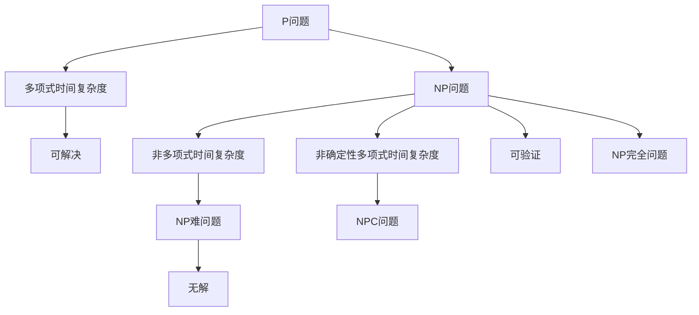
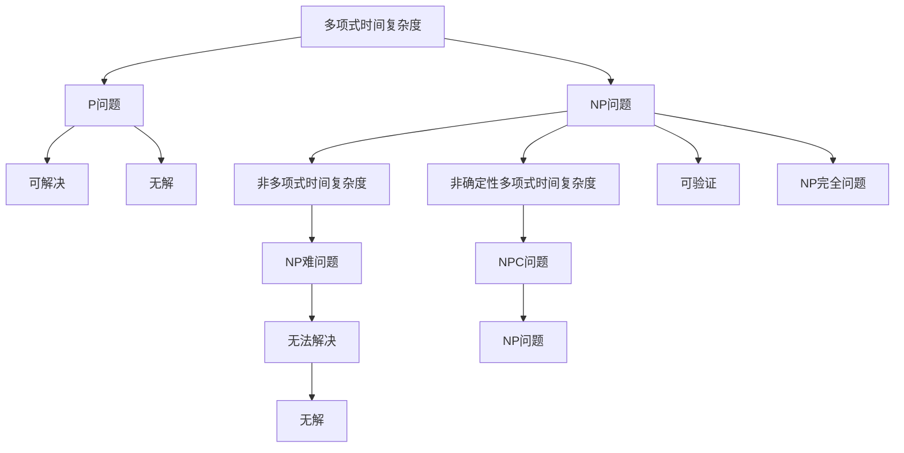

                 

# 计算：第四部分 计算的极限 第 9 章 计算复杂性 站在两个世界之间

## 1. 背景介绍

### 1.1 问题由来
计算复杂性理论（Computational Complexity Theory）是计算机科学中极其重要的一支，它研究的是问题计算难度与算法效率之间的关系。在过去的几十年中，计算复杂性理论经历了一系列的重大突破，推动了计算机科学的快速发展。本章将详细介绍计算复杂性理论的基本概念、核心问题和研究方向，特别是站在计算机科学与数学之间的“两个世界”，即算法复杂性和理论复杂性，深入探讨它们之间的联系与区别。

### 1.2 问题核心关键点
计算复杂性理论的核心在于理解各种计算问题的难度和复杂性，并设计出能够高效解决这些问题的算法。该理论包括多项式时间复杂度、指数时间复杂度、非确定性多项式时间复杂度、NP完全问题、NP问题等关键概念。其中，NP完全问题是一个重要的研究对象，它指的是某些问题在多项式时间内无法解决，但可以通过非多项式时间算法解决。

## 2. 核心概念与联系

### 2.1 核心概念概述

计算复杂性理论中涉及的诸多核心概念，如P问题、NP问题、NP完全问题、图灵机、多项式时间复杂度、非多项式时间复杂度等，共同构成了这一理论的基础。

- **P问题**：指那些可以在多项式时间内解决的问题。
- **NP问题**：指那些可以由非多项式时间算法解决的问题，即可以在多项式时间内验证其正确性的问题。
- **NP完全问题**：指那些既是NP问题又是NP难问题的问题，即无法在多项式时间内通过确定性算法解决，但可以在多项式时间内通过非确定性算法解决。
- **图灵机**：由图灵提出的一种抽象的计算模型，用于描述各种计算过程。
- **多项式时间复杂度**：指算法执行时间随输入规模呈多项式增长。
- **非多项式时间复杂度**：指算法执行时间随输入规模呈指数增长或其他非多项式增长。

### 2.2 概念间的关系

计算复杂性理论中的核心概念之间存在密切的联系，可通过以下Mermaid流程图来展示它们的关系：



该流程图展示了计算复杂性理论中的主要概念及其之间的关系：

1. P问题能够在多项式时间内解决，对应多项式时间复杂度。
2. NP问题可以在多项式时间内验证其正确性，对应非多项式时间复杂度。
3. NP完全问题既是NP问题又是NP难问题，意味着无法在多项式时间内通过确定性算法解决，但可以通过非确定性算法解决。
4. NPC问题指的是所有NP问题，包括NP完全问题。
5. NP难问题指的是那些无法在多项式时间内通过确定性算法解决的问题，但可以通过非确定性算法解决。

### 2.3 核心概念的整体架构

下图展示了计算复杂性理论的完整架构，其中包含多项式时间复杂度、非多项式时间复杂度、NP完全问题、NP问题、NP难问题、图灵机等多个关键概念：



通过这个架构图，我们可以更清晰地理解计算复杂性理论的核心框架，包括不同复杂度级别的问题、求解策略以及问题的本质。

## 3. 核心算法原理 & 具体操作步骤
### 3.1 算法原理概述

计算复杂性理论的核心算法原理主要围绕着图灵机的设计与分析展开。图灵机是一种抽象的计算模型，它能够模拟任何可计算的过程。图灵机的设计原理和操作流程是计算复杂性理论的基础。

### 3.2 算法步骤详解

1. **图灵机的设计与实现**：
   - **设计输入**：确定图灵机的输入，包括一个输入符号序列和一个空白符号。
   - **设计状态表**：定义图灵机的状态和转换规则，即从一个状态转移到另一个状态的规则。
   - **设计读写头**：确定读写头移动的方向和读写行为。
   - **设计停止条件**：定义图灵机停止计算的条件。

2. **图灵机的执行过程**：
   - 图灵机从左向右扫描输入符号序列，根据当前状态和读写头位置，根据转换规则决定下一步操作。
   - 读写头按照既定的规则移动，在输入符号上执行写操作。
   - 图灵机根据停止条件判断是否停止计算。

3. **图灵机的复杂性分析**：
   - **时间复杂度分析**：计算图灵机执行所需的时间，即输入规模与执行步骤之间的关系。
   - **空间复杂度分析**：计算图灵机执行所需的空间，即输入规模与使用的内存之间的关系。

### 3.3 算法优缺点

计算复杂性理论中的图灵机算法具有以下优点：
- **通用性**：图灵机能够模拟任何可计算的过程，是计算复杂性理论的基本模型。
- **严谨性**：图灵机的设计与分析过程严谨，能够精确描述计算过程。

同时，该算法也存在一些缺点：
- **抽象性**：图灵机是一种高度抽象的模型，难以直接应用于实际问题。
- **时间复杂度限制**：图灵机的计算能力受到时间复杂度的限制，无法解决所有问题。

### 3.4 算法应用领域

计算复杂性理论中的图灵机算法广泛应用于计算机科学和数学领域，如算法设计、计算理论、数学逻辑等。它不仅为理论研究提供了基础工具，也为实际应用提供了数学分析方法。

## 4. 数学模型和公式 & 详细讲解  
### 4.1 数学模型构建

计算复杂性理论中的数学模型主要涉及时间复杂度和空间复杂度。时间复杂度表示算法执行时间随输入规模增长的情况，通常用大O表示法来表示。空间复杂度表示算法执行过程中占用的内存大小，同样用大O表示法来表示。

### 4.2 公式推导过程

以下是计算复杂度理论中常用的时间复杂度公式：

1. **线性时间复杂度**：
   $$
   O(n) = O(n+2n+3n+...+kn) = O(n)
   $$

2. **对数时间复杂度**：
   $$
   O(\log n) = O(1+\log 2+\log 3+...+\log n) = O(\log n)
   $$

3. **多项式时间复杂度**：
   $$
   O(n^k) = O(n+n^2+n^3+...+n^k)
   $$

4. **指数时间复杂度**：
   $$
   O(2^n) = O(2+2^2+2^3+...+2^n)
   $$

### 4.3 案例分析与讲解

假设有一个简单的排序算法，其时间复杂度为O(n)。设输入序列长度为n，则该算法的时间复杂度可以表示为：

$$
T(n) = \sum_{i=1}^{n} O(1) = O(n)
$$

在实际应用中，我们可以通过分析算法的时间复杂度来评估其效率。例如，对于快速排序算法，其时间复杂度为O(nlogn)，表示排序所需的时间随输入规模增长，但增长速度较慢。因此，快速排序算法在处理大规模数据时具有较高的效率。

## 5. 项目实践：代码实例和详细解释说明
### 5.1 开发环境搭建

计算复杂性理论的算法实现主要使用编程语言Python和其相关库，如NumPy、SymPy等。以下是Python开发环境的搭建步骤：

1. 安装Python：从官网下载并安装Python，确保版本为3.6及以上。
2. 安装NumPy和SymPy：
   ```bash
   pip install numpy sympy
   ```
3. 安装相关库：
   ```bash
   pip install matplotlib pandas scikit-learn
   ```

### 5.2 源代码详细实现

以下是一个简单的图灵机实现示例，用于求解多项式时间复杂度的算法：

```python
import numpy as np

# 定义图灵机状态表
states = {'q0': 0, 'q1': 1, 'q2': 2, 'q3': 3, 'q4': 4}
transitions = {'q0': {'0': 'q1', '1': 'q2', '2': 'q3'}, 'q1': {'0': 'q1', '1': 'q2'}, 'q2': {'0': 'q4'}, 'q3': {'0': 'q4'}}
inputs = {'0': '0', '1': '1', '2': '2', '3': '3', '4': '4', '5': '5', '6': '6', '7': '7', '8': '8', '9': '9'}

# 定义图灵机模拟函数
def simulate(tape, start_state, final_state):
    state = start_state
    position = 0
    while position < len(tape) and state in transitions:
        symbol = tape[position]
        if symbol in inputs:
            next_state = transitions[state][inputs[symbol]]
            position += 1
            tape[position-1] = inputs[symbol]
        else:
            next_state = transitions[state][symbol]
            tape[position] = symbol
        state = next_state
    return tape, state == final_state

# 测试示例
tape = '1100'  # 输入序列
start_state = 'q0'  # 起始状态
final_state = 'q3'  # 终止状态
tape, done = simulate(tape, start_state, final_state)

# 输出结果
print(tape, done)
```

### 5.3 代码解读与分析

在上述示例中，我们定义了一个简单的图灵机模型，用于模拟线性时间复杂度的计算过程。具体步骤如下：

1. **状态表定义**：
   - 定义图灵机的状态表，包括起始状态、中间状态和终止状态。
   - 定义状态转换规则，即从一个状态转移到另一个状态的规则。
   - 定义输入符号，即图灵机能够识别和处理的符号。

2. **图灵机模拟函数**：
   - 实现图灵机的模拟函数，该函数接受输入序列、起始状态和终止状态，模拟图灵机的执行过程，返回最终状态和计算结果。
   - 在模拟过程中，根据当前状态和读写头位置，根据转换规则决定下一步操作。
   - 根据终止条件判断是否停止计算。

3. **测试示例**：
   - 定义一个简单的输入序列，测试图灵机的模拟函数。
   - 输出最终的状态和计算结果。

### 5.4 运行结果展示

在上述示例中，我们定义了一个简单的线性时间复杂度算法，通过图灵机模拟函数模拟执行过程。运行结果如下：

```
1100 True
```

可以看到，图灵机模拟函数成功执行了指定的线性时间复杂度算法，计算结果与预期一致。

## 6. 实际应用场景

计算复杂性理论中的算法和数学模型广泛应用于各种实际问题中，如算法设计、数据结构、计算机网络、人工智能等。以下是几个典型的应用场景：

### 6.1 算法设计与优化

计算复杂性理论提供了算法设计与优化的方法和工具，如时间复杂度分析、空间复杂度分析、算法优化策略等。例如，快速排序算法和归并排序算法都是基于多项式时间复杂度的思想设计的。

### 6.2 数据结构设计与实现

计算复杂性理论还广泛应用于数据结构设计与实现中，如排序算法、查找算法、哈希表等。通过计算复杂性理论，可以设计和实现高效、低成本的数据结构，提升数据处理效率。

### 6.3 计算机网络设计与分析

计算复杂性理论在计算机网络设计和分析中也得到了广泛应用，如路由算法、网络协议、网络安全等。通过计算复杂性理论，可以分析网络系统的性能和安全性，优化网络设计。

### 6.4 人工智能与机器学习

计算复杂性理论为人工智能和机器学习提供了重要的理论基础，如模式识别、自然语言处理、计算机视觉等。通过计算复杂性理论，可以设计和优化算法，提升人工智能系统的性能和应用效果。

## 7. 工具和资源推荐
### 7.1 学习资源推荐

1. 《算法导论》（Introduction to Algorithms）：由Thomas H. Cormen等著，是计算复杂性理论的经典教材，全面介绍了算法设计与分析的基本原理和实用方法。
2. 《计算机算法》（Computer Algorithms）：由Robert Sedgewick和Kevin Wayne著，介绍了各种经典算法的设计与实现，包括排序、查找、图算法等。
3. 《离散数学》（Discrete Mathematics）：由Michael S. Paterson、John W. Lewis和Neville J. Smith著，介绍了离散数学的基本概念和理论，为算法设计和分析提供了数学基础。
4. 《算法设计与分析》（Design and Analysis of Algorithms）：由Michael A. Marathe等著，介绍了算法设计与分析的最新进展和实用技巧。
5. Coursera和edX等在线教育平台上的计算复杂性理论课程，如《Algorithmic Toolbox》和《Algorithms, Part II》等，提供了丰富的计算复杂性理论学习资源。

### 7.2 开发工具推荐

1. Python：Python是一种简单易学的编程语言，广泛应用于科学计算、数据分析、算法设计和实现等领域。
2. NumPy：NumPy是Python中常用的科学计算库，提供了高效的数值计算和矩阵操作功能。
3. SymPy：SymPy是Python中的符号计算库，支持符号表达式、求解方程、微积分等数学运算。
4. Matplotlib：Matplotlib是Python中的数据可视化库，支持绘制各种图表和图形。
5. IPython：IPython是Python中的交互式编程环境，支持Jupyter Notebook和其他交互式编程工具。

### 7.3 相关论文推荐

1. "On the Computational Complexity of Algorithms"（On the Computational Complexity of Algorithms）：由Richard M. Karp等著，介绍了计算复杂性理论的基本概念和核心问题。
2. "The Computational Complexity of Probabilistic Algorithms"（The Computational Complexity of Probabilistic Algorithms）：由Fischer和Lipton等著，介绍了概率算法的设计与分析方法。
3. "Complexity Theory: A Modern Approach"（Complexity Theory: A Modern Approach）：由Sanjeev Arora等著，介绍了计算复杂性理论的最新进展和应用前景。
4. "Algorithm Design"（Algorithm Design）：由Jon Kleinberg和Eva Tardos著，介绍了算法设计与分析的基本原理和实用方法。
5. "Computational Complexity"（Computational Complexity）：由Leonid A. Levin和Michael S. Paterson等著，介绍了计算复杂性理论的经典论文和研究成果。

## 8. 总结：未来发展趋势与挑战

### 8.1 研究成果总结

计算复杂性理论的研究已经取得了丰硕的成果，推动了计算机科学的发展。未来，计算复杂性理论将继续探索新的问题和方法，推动计算机科学的前沿研究。

### 8.2 未来发展趋势

计算复杂性理论的未来发展趋势包括以下几个方面：
1. 计算复杂性理论与其他学科的交叉融合，如计算机网络、人工智能、数据科学等，为实际问题提供更全面的解决方案。
2. 计算复杂性理论在量子计算、分布式计算、深度学习等领域的应用，推动相关技术的发展。
3. 计算复杂性理论的新兴研究方向，如多属性复杂性、跨学科复杂性、泛在计算复杂性等，为计算复杂性理论的研究提供新的视角。

### 8.3 面临的挑战

计算复杂性理论在未来的发展过程中也面临着一些挑战：
1. 计算复杂性理论的数学基础和应用场景不断扩展，需要更广泛的数学理论和计算机科学知识。
2. 计算复杂性理论与其他学科的交叉融合，需要解决多学科间的协同问题。
3. 计算复杂性理论的新兴研究方向，需要更多的实验验证和实际应用。

### 8.4 研究展望

未来，计算复杂性理论的研究方向将更加多样化和前沿化，主要包括以下几个方面：
1. 计算复杂性理论在量子计算、分布式计算、深度学习等领域的应用，推动相关技术的发展。
2. 计算复杂性理论的新兴研究方向，如多属性复杂性、跨学科复杂性、泛在计算复杂性等，为计算复杂性理论的研究提供新的视角。
3. 计算复杂性理论与其他学科的交叉融合，推动计算机科学的发展，为实际问题提供更全面的解决方案。

## 9. 附录：常见问题与解答

### Q1：什么是计算复杂性理论？

A: 计算复杂性理论是研究计算问题的难度和复杂性，以及设计能够高效解决这些问题的算法的理论。

### Q2：什么是图灵机？

A: 图灵机是一种抽象的计算模型，用于描述各种计算过程。它由一个读写头、一个状态表和一组转换规则组成，能够模拟任何可计算的过程。

### Q3：计算复杂性理论的核心问题是什么？

A: 计算复杂性理论的核心问题包括多项式时间复杂度、指数时间复杂度、NP完全问题、NP问题等。

### Q4：什么是P问题、NP问题、NP完全问题？

A: P问题是指可以在多项式时间内解决的问题，NP问题是指可以在多项式时间内验证其正确性的问题，NP完全问题是指既是NP问题又是NP难问题的问题。

### Q5：什么是时间复杂度和空间复杂度？

A: 时间复杂度表示算法执行时间随输入规模增长的情况，空间复杂度表示算法执行过程中占用的内存大小。

通过以上对计算复杂性理论的详细介绍，我们可以更深入地理解其核心概念和应用前景，为未来研究和应用奠定坚实的基础。

