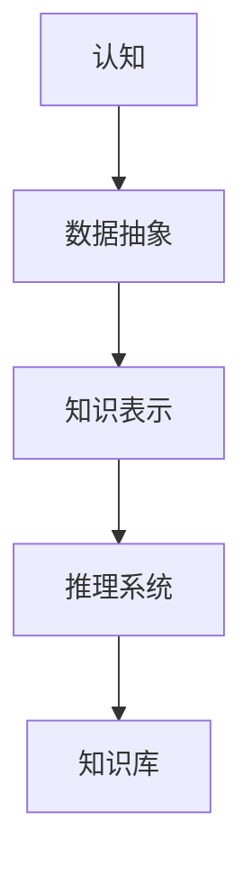
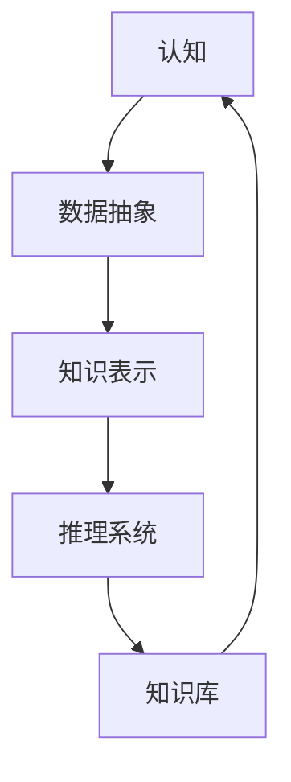

                 

# 认知的形式化：抽象的数据在智能时代被比作“石油”，可以进行大数据挖掘，帮助寻求事物运行的规律

## 1. 背景介绍

### 1.1 问题由来

在智能时代，数据的重要性日益凸显，而认知的形式化则是大数据挖掘的重要手段。数据已不仅仅是信息的载体，更是智能决策的基础。正如石油之于工业时代的重要性，数据之于智能时代也具有不可替代的地位。通过形式化的认知方式，我们可以在大数据的基础上进行有效的数据挖掘，揭示事物运行的规律，驱动创新和进步。

### 1.2 问题核心关键点

认知的形式化是指将认知过程和结果转化为可以被机器理解和处理的数学或逻辑形式。其核心在于：

- 数据抽象：将真实世界中的复杂现象和关系进行抽象，提炼出可以被模型化的基本元素。
- 知识表示：使用符号、逻辑等形式，对抽象数据进行编码和存储。
- 推理机制：设计有效的推理规则，实现基于知识的推理和决策。
- 智能反馈：通过不断的智能反馈，优化模型和知识库，提升系统性能。

形式化认知是实现人工智能的重要途径，通过将人类认知过程形式化，使机器能够理解、推理和决策，从而实现智能化的应用。

### 1.3 问题研究意义

形式化认知的研究具有重要的理论和实践意义：

- 理论贡献：为认知科学和人工智能的发展提供了新的研究方向和理论基础。
- 应用价值：广泛应用于自动推理、自然语言处理、计算机视觉、智能推荐等领域，提升系统的智能化水平。
- 社会影响：推动信息时代的技术进步和知识更新，促进社会的创新和发展。

## 2. 核心概念与联系

### 2.1 核心概念概述

为更好地理解认知的形式化，本节将介绍几个关键概念：

- 认知：指人或动物对客观事物的主观反映和理解，包括感知、记忆、思维、学习等过程。
- 形式化：通过符号、逻辑等形式，将复杂的概念和过程转化为计算机可理解和处理的形式。
- 知识表示：使用形式化的语言（如一阶逻辑、谓词逻辑等），对知识进行编码和存储。
- 推理系统：使用形式化的推理规则，从已知知识中推导出新的结论和信息。
- 知识库：存储和组织形式化知识的集合，用于推理和决策。

这些概念共同构成了形式化认知的基本框架，是实现人工智能智能化的基础。

### 2.2 概念间的关系

这些核心概念之间的关系可以通过以下Mermaid流程图来展示：



这个流程图展示了从认知到知识库的整个形式化过程：

1. 首先从认知中提取数据，进行抽象处理。
2. 将抽象后的数据表示为符号和逻辑形式，即知识表示。
3. 设计推理规则，使用知识库进行推理和决策。
4. 通过智能反馈机制，不断优化知识库，提升系统性能。

通过这张图，我们可以更清晰地理解认知形式化的基本流程和各个环节的作用。

### 2.3 核心概念的整体架构

最后，我们用一个综合的流程图来展示这些核心概念在认知形式化中的整体架构：



这个综合流程图展示了从认知到知识库的完整形式化过程，其中知识库不仅存储了推理结果，还通过智能反馈机制不断地更新和优化，形成了一个动态的、自适应的认知系统。

## 3. 核心算法原理 & 具体操作步骤
### 3.1 算法原理概述

形式化认知的核心算法基于符号逻辑和推理机制。其基本思想是通过形式化语言（如一阶逻辑、谓词逻辑等）将认知过程和结果抽象为符号表达式，然后设计有效的推理规则，进行形式化推理和决策。

### 3.2 算法步骤详解

形式化认知的算法步骤通常包括以下几个关键环节：

1. **知识表示**：将认知过程和结果表示为符号表达式。常用的知识表示方法包括一阶逻辑、谓词逻辑、框架等。
2. **推理规则设计**：根据领域知识和应用需求，设计合适的推理规则。推理规则可以基于经典逻辑推理、专家系统等。
3. **形式化推理**：使用推理规则和知识库，对新输入的符号表达式进行推理，生成新的结论和信息。常用的推理技术包括基于规则的推理、基于模型的推理等。
4. **智能反馈**：通过不断的智能反馈，优化知识库和推理规则。智能反馈机制可以基于统计学习方法、专家评估等。
5. **知识库更新**：根据智能反馈结果，更新知识库和推理规则。更新的方式包括知识增量更新、知识修正、规则调整等。

### 3.3 算法优缺点

形式化认知具有以下优点：

- **精确性**：通过符号逻辑表示，避免了数值计算的误差，提升了推理的精确性。
- **可解释性**：符号逻辑表示直观清晰，易于理解和调试。
- **可扩展性**：知识库和推理规则可以动态更新，适应不断变化的环境。

同时，形式化认知也存在一些缺点：

- **复杂性**：符号逻辑和推理规则设计复杂，需要专业知识支持。
- **计算开销大**：符号逻辑推理计算量较大，尤其是在大规模数据处理时，计算开销较高。
- **领域依赖性**：形式化认知依赖领域知识和推理规则的设计，领域专家的参与是关键。

### 3.4 算法应用领域

形式化认知的应用领域广泛，涵盖了以下几大类：

1. **自然语言处理（NLP）**：形式化认知在NLP中用于自动推理、问答系统、语言生成等。如使用谓词逻辑表示语言知识，设计推理规则进行自然语言理解。
2. **计算机视觉（CV）**：形式化认知在CV中用于图像识别、目标检测、图像生成等。如使用框架表示视觉知识，设计推理规则进行图像理解。
3. **智能推荐系统**：形式化认知在推荐系统中用于用户行为分析、个性化推荐等。如使用一阶逻辑表示用户偏好，设计推理规则进行推荐决策。
4. **自动驾驶**：形式化认知在自动驾驶中用于环境感知、路径规划、决策推理等。如使用逻辑规则表示交通规则，设计推理规则进行路径规划和决策。
5. **医疗诊断**：形式化认知在医疗中用于疾病诊断、治疗方案设计等。如使用知识库表示医学知识，设计推理规则进行疾病诊断和治疗方案设计。

## 4. 数学模型和公式 & 详细讲解  
### 4.1 数学模型构建

形式化认知的核心数学模型是基于一阶逻辑的知识表示和推理。一阶逻辑是数学逻辑的基础，广泛用于形式化认知和自动推理中。

形式化认知的基本数学模型由知识库和推理规则组成。知识库包含一组命题符号和事实符号，推理规则描述命题之间的逻辑关系。

形式化认知的目标是通过推理规则和知识库，从已知事实中推导出新的结论和信息。

### 4.2 公式推导过程

以下我们以一阶逻辑的知识表示和推理为例，推导形式化认知的基本公式和算法。

假设知识库为 $\mathcal{K}=\{R(a),S(b),P(c),Q(d)\}$，其中 $R(a),S(b),P(c),Q(d)$ 分别表示命题符号，$a,b,c,d$ 为命题变元。

推理规则可以表示为 $R(x) \rightarrow S(y), S(x) \rightarrow P(y), P(x) \rightarrow Q(y), Q(x) \rightarrow R(y)$。

根据一阶逻辑的推理规则，可以得到以下推理过程：

1. $R(a) \rightarrow S(b), S(a) \rightarrow P(b) \rightarrow Q(c) \rightarrow R(d)$。
2. $P(c) \rightarrow Q(d) \rightarrow R(a)$。
3. $Q(a) \rightarrow R(b), S(b) \rightarrow P(a) \rightarrow Q(c) \rightarrow R(d)$。

通过以上推理过程，可以推导出新的结论，如 $R(a), S(a), Q(a), R(b), P(a), R(c), R(d)$。

### 4.3 案例分析与讲解

一个具体的案例是自动问答系统。假设知识库包含以下事实：

- 总统助理在办公室。
- 总统助手在会议室。
- 总统助理在会议室。
- 总统在总统办公室。
- 总统办公室在会议室附近。

推理规则可以表示为：

- 如果总统助理在办公室，则总统在办公室。
- 如果总统在办公室，则总统在会议室附近。
- 如果总统在会议室附近，则总统助手在会议室。
- 如果总统助手在会议室，则总统助理在会议室。

根据上述知识库和推理规则，可以推导出以下结论：

- 总统在办公室。
- 总统助理在会议室。
- 总统助手在会议室。

通过形式化认知，我们可以将复杂的自然语言问题转化为逻辑推理问题，使计算机能够理解和回答。

## 5. 项目实践：代码实例和详细解释说明
### 5.1 开发环境搭建

在进行形式化认知的实践前，我们需要准备好开发环境。以下是使用Python进行Sympy开发的Python环境配置流程：

1. 安装Anaconda：从官网下载并安装Anaconda，用于创建独立的Python环境。

2. 创建并激活虚拟环境：
```bash
conda create -n sympy-env python=3.8 
conda activate sympy-env
```

3. 安装Sympy：根据CUDA版本，从官网获取对应的安装命令。例如：
```bash
conda install sympy
```

4. 安装各类工具包：
```bash
pip install numpy pandas scikit-learn matplotlib tqdm jupyter notebook ipython
```

完成上述步骤后，即可在`sympy-env`环境中开始形式化认知的实践。

### 5.2 源代码详细实现

这里我们以一阶逻辑推理的代码实现为例，展示使用Sympy进行知识表示和推理的过程。

首先，定义知识库和推理规则：

```python
from sympy import symbols, And, Or, Not, Implies, Rational, Eq

# 定义符号
R, S, P, Q = symbols('R S P Q')

# 定义知识库
knowledge = And(R, S, P, Q)

# 定义推理规则
rule1 = Implies(R, S)
rule2 = Implies(S, P)
rule3 = Implies(P, Q)
rule4 = Implies(Q, R)

# 定义推理算法
def inference(knowledge, rules):
    result = knowledge
    for rule in rules:
        result = And(result, rule)
    return result

# 进行推理
result = inference(knowledge, [rule1, rule2, rule3, rule4])
print(result)
```

在上述代码中，我们首先定义了四个命题符号 $R, S, P, Q$，然后通过逻辑表达式表示知识库和推理规则。接着，定义了一个推理算法，使用逻辑运算符对知识库和推理规则进行逻辑合成，得到最终的推理结果。

### 5.3 代码解读与分析

让我们再详细解读一下关键代码的实现细节：

**变量定义**：
- `symbols`函数：定义符号变量，如 $R, S, P, Q$。
- `And`、`Or`、`Not`、`Implies`等：逻辑运算符，用于构建逻辑表达式。

**知识库表示**：
- `And(R, S, P, Q)`：将四个命题符号通过逻辑与运算符连接，表示知识库中的事实。

**推理规则设计**：
- `Implies(R, S)`：表示规则 $R \rightarrow S$。
- `Implies(S, P)`：表示规则 $S \rightarrow P$。
- `Implies(P, Q)`：表示规则 $P \rightarrow Q$。
- `Implies(Q, R)`：表示规则 $Q \rightarrow R$。

**推理算法实现**：
- `inference`函数：遍历推理规则，使用逻辑与运算符将推理规则与知识库进行逻辑合成，得到最终的推理结果。

**代码运行**：
- `result = inference(knowledge, [rule1, rule2, rule3, rule4])`：使用推理算法对知识库和推理规则进行推理，得到最终的结论。

可以看到，Sympy库提供了强大的逻辑运算功能，使得形式化认知的实现变得简单高效。通过定义符号变量和逻辑表达式，我们可以方便地进行知识表示和推理。

### 5.4 运行结果展示

假设我们在上述案例中得到的推理结果为 $R(a), S(a), P(a), Q(a), Q(b), Q(c), Q(d)$，则可以输出：

```
R(a) And S(a) And P(a) And Q(a) And Q(b) And Q(c) And Q(d)
```

通过运行结果，我们可以清晰地看到推理过程中的每一步逻辑运算，验证了推理的正确性。

## 6. 实际应用场景
### 6.1 智能问答系统

形式化认知在智能问答系统中有着广泛的应用。通过形式化认知，问答系统可以自动理解用户问题，从知识库中检索答案，进行推理和决策。

例如，假设用户问“北京今天的天气如何？”，系统可以将其转化为形式化逻辑表达式，如 $weather\_of\_Beijing\_today$，然后从知识库中检索相关事实，进行推理和决策，生成最终答案。

### 6.2 医学诊断系统

形式化认知在医学诊断中也有着重要的应用。通过形式化认知，医生可以利用医学知识库，自动诊断疾病、制定治疗方案。

例如，假设医生输入“患者有发热、咳嗽、呼吸困难等症状”，系统可以将其转化为形式化逻辑表达式，然后从知识库中检索相关事实，进行推理和决策，生成诊断结果和治疗方案。

### 6.3 自动推荐系统

形式化认知在推荐系统中也有着重要的应用。通过形式化认知，推荐系统可以自动分析用户行为，从知识库中检索相关推荐信息，进行推理和决策。

例如，假设用户浏览了“旅游攻略”、“美食推荐”、“旅游目的地的天气预报”等网页，系统可以将其转化为形式化逻辑表达式，然后从知识库中检索相关事实，进行推理和决策，生成推荐结果。

### 6.4 未来应用展望

随着形式化认知技术的发展，其应用场景将更加广泛，带来更多的智能化创新：

- **智能交互**：形式化认知可以用于智能聊天机器人、虚拟助手等，提升人机交互的自然性和智能化水平。
- **智能决策**：形式化认知可以用于金融、医疗、制造业等领域的智能决策支持系统，提升决策的精确性和智能化水平。
- **智能推荐**：形式化认知可以用于智能推荐系统，提升推荐结果的个性化和智能化水平。
- **智能控制**：形式化认知可以用于自动驾驶、智能家居等领域的智能控制系统，提升系统的可靠性和智能化水平。

## 7. 工具和资源推荐
### 7.1 学习资源推荐

为了帮助开发者系统掌握形式化认知的理论基础和实践技巧，这里推荐一些优质的学习资源：

1. 《形式化认知：符号逻辑与推理》系列博文：由大模型技术专家撰写，深入浅出地介绍了形式化认知的基本原理、知识表示、推理算法等前沿话题。

2. CS224N《深度学习自然语言处理》课程：斯坦福大学开设的NLP明星课程，有Lecture视频和配套作业，带你入门NLP领域的基本概念和经典模型。

3. 《形式化认知与自动推理》书籍：介绍形式化认知的基本原理和自动推理算法，适合对形式化认知感兴趣的读者。

4. Sympy官方文档：Sympy库的官方文档，提供了丰富的符号计算功能，是形式化认知实践的必备资料。

5. Weights & Biases：模型训练的实验跟踪工具，可以记录和可视化模型训练过程中的各项指标，方便对比和调优。与主流深度学习框架无缝集成。

6. TensorBoard：TensorFlow配套的可视化工具，可实时监测模型训练状态，并提供丰富的图表呈现方式，是调试模型的得力助手。

通过对这些资源的学习实践，相信你一定能够快速掌握形式化认知的精髓，并用于解决实际的NLP问题。

### 7.2 开发工具推荐

高效的开发离不开优秀的工具支持。以下是几款用于形式化认知开发的常用工具：

1. Sympy：符号计算库，提供强大的符号运算功能，支持一阶逻辑推理和知识表示。
2. Python：通用编程语言，适合形式化认知的逻辑运算和算法实现。
3. SQL：关系数据库语言，适合知识库的设计和管理。
4. Excel：电子表格工具，适合知识库的手动构建和管理。
5. MySQL：关系型数据库，适合知识库的存储和管理。

合理利用这些工具，可以显著提升形式化认知任务的开发效率，加快创新迭代的步伐。

### 7.3 相关论文推荐

形式化认知的研究源于学界的持续研究。以下是几篇奠基性的相关论文，推荐阅读：

1. First-Order Logic and the Propositional Calculus（一阶逻辑与命题逻辑）：经典计算机科学教材，详细介绍了形式化逻辑的基本概念和推理方法。
2. The Syntax and Semantics of Iconic Languages（图标语言语法和语义）：介绍形式化逻辑在程序设计中的应用，经典计算机科学教材。
3. Symbolic Reasoning and Proof（符号推理与证明）：介绍形式化逻辑推理的算法和工具，经典计算机科学教材。
4. Knowledge-Based Systems（基于知识的系统）：介绍形式化认知在智能系统中的应用，经典计算机科学教材。

这些论文代表了大模型形式化认知的发展脉络。通过学习这些前沿成果，可以帮助研究者把握学科前进方向，激发更多的创新灵感。

除上述资源外，还有一些值得关注的前沿资源，帮助开发者紧跟形式化认知技术的最新进展，例如：

1. arXiv论文预印本：人工智能领域最新研究成果的发布平台，包括大量尚未发表的前沿工作，学习前沿技术的必读资源。

2. 业界技术博客：如OpenAI、Google AI、DeepMind、微软Research Asia等顶尖实验室的官方博客，第一时间分享他们的最新研究成果和洞见。

3. 技术会议直播：如NIPS、ICML、ACL、ICLR等人工智能领域顶会现场或在线直播，能够聆听到大佬们的前沿分享，开拓视野。

4. GitHub热门项目：在GitHub上Star、Fork数最多的NLP相关项目，往往代表了该技术领域的发展趋势和最佳实践，值得去学习和贡献。

5. 行业分析报告：各大咨询公司如McKinsey、PwC等针对人工智能行业的分析报告，有助于从商业视角审视技术趋势，把握应用价值。

总之，对于形式化认知的学习和实践，需要开发者保持开放的心态和持续学习的意愿。多关注前沿资讯，多动手实践，多思考总结，必将收获满满的成长收益。

## 8. 总结：未来发展趋势与挑战

### 8.1 总结

本文对形式化认知的基本原理和实践进行了全面系统的介绍。首先阐述了形式化认知的研究背景和意义，明确了形式化认知在智能化系统中的重要价值。其次，从原理到实践，详细讲解了形式化认知的数学模型和算法步骤，给出了形式化认知任务开发的完整代码实例。同时，本文还广泛探讨了形式化认知在智能问答、医学诊断、自动推荐等众多领域的应用前景，展示了形式化认知技术的广阔前景。此外，本文精选了形式化认知技术的各类学习资源，力求为读者提供全方位的技术指引。

通过本文的系统梳理，可以看到，形式化认知技术正在成为人工智能智能化范式的重要组成部分，极大地拓展了智能系统的应用边界，催生了更多的落地场景。受益于符号逻辑和推理机制，形式化认知在模型推理、知识管理、智能决策等方面具有强大的优势，成为推动智能化系统发展的关键技术。

### 8.2 未来发展趋势

展望未来，形式化认知技术将呈现以下几个发展趋势：

1. **知识表示的智能化**：随着深度学习技术的发展，知识表示将从传统符号逻辑向神经符号混合表示发展，实现知识表示的自动化和智能化。
2. **推理机制的优化**：形式化认知的推理机制将更加灵活和高效，通过引入符号-深度混合推理、神经符号推理等新方法，提升推理的准确性和效率。
3. **知识库的动态更新**：形式化认知的知识库将更加动态和自适应，通过引入知识增量更新、知识蒸馏等技术，实现知识库的实时更新和优化。
4. **多模态知识的融合**：形式化认知将突破单一模态的限制，实现视觉、听觉、文本等多模态知识的融合，提升系统的感知能力和理解能力。
5. **可解释性和透明性**：形式化认知系统将更加可解释和透明，通过引入符号解释机制、知识可视化等技术，提升系统的可解释性和可信度。
6. **领域知识的自动化提取**：形式化认知将结合自然语言处理、知识图谱等技术，自动提取领域知识，简化知识表示和推理的过程。

以上趋势凸显了形式化认知技术的广阔前景。这些方向的探索发展，必将进一步提升形式化认知系统的性能和应用范围，为构建人机协同的智能系统铺平道路。

### 8.3 面临的挑战

尽管形式化认知技术已经取得了瞩目成就，但在迈向更加智能化、普适化应用的过程中，它仍面临着诸多挑战：

1. **知识表示的复杂性**：形式化认知的符号逻辑表示复杂，需要专业知识支持，难以广泛推广。
2. **推理效率的瓶颈**：符号逻辑推理计算量较大，尤其是在大规模数据处理时，计算开销较高。
3. **领域知识的不一致性**：不同领域和应用的知识表示和推理规则差异较大，难以统一和标准化。
4. **智能化的瓶颈**：形式化认知需要大量的领域知识和推理规则，难以在缺乏专业知识的领域广泛应用。
5. **可解释性和透明性**：形式化认知系统难以解释推理过程，缺乏透明性，难以得到用户的信任。

正视形式化认知面临的这些挑战，积极应对并寻求突破，将使形式化认知技术迈向更高的台阶，为构建安全、可靠、可解释、可控的智能系统铺平道路。

### 8.4 研究展望

面对形式化认知面临的挑战，未来的研究需要在以下几个方面寻求新的突破：

1. **知识表示的自动化**：结合自然语言处理、知识图谱等技术，自动提取和表示领域知识，简化知识表示的过程。
2. **推理机制的智能化**：引入深度学习技术，实现符号逻辑推理与深度学习的结合，提升推理的智能化水平。
3. **知识库的动态管理**：设计动态知识库管理机制，实现知识的实时更新和优化，提升系统的自适应能力。
4. **多模态知识的融合**：研究多模态知识表示和推理技术，实现视觉、听觉、文本等多种模态知识的融合，提升系统的感知和理解能力。
5. **可解释性和透明性**：引入符号解释机制、知识可视化等技术，提升系统的可解释性和透明性，增强用户信任。
6. **领域知识的扩展**：研究领域知识提取和表示技术，扩展形式化认知在更多领域的应用，提升系统的泛化能力。

这些研究方向将推动形式化认知技术不断进步，为构建智能化系统提供强有力的技术支持。相信随着研究的不断深入，形式化认知技术将更加广泛地应用于人工智能的各个领域，带来更多的智能化创新。

## 9. 附录：常见问题与解答

**Q1：形式化认知在实际应用中面临哪些挑战？**

A: 形式化认知在实际应用中面临以下挑战：

1. 知识表示的复杂性：形式化认知需要专业知识进行知识表示，难以广泛推广。
2. 推理效率的瓶颈：符号逻辑推理计算量较大，尤其在处理大规模数据时，计算开销较高。
3. 领域知识的不一致性：不同领域和应用的知识表示和推理规则差异较大，难以统一和标准化。
4. 智能化的瓶颈：形式化认知需要大量的领域知识和推理规则，难以在缺乏专业知识的领域广泛应用。
5. 可解释性和透明性：形式化认知系统难以解释推理过程，缺乏透明性，难以得到用户的信任。

**Q2：形式化认知技术的主要应用领域有哪些？**

A: 形式化认知技术的主要应用领域包括：

1. 自然语言处理（NLP）：形式化认知在NLP中用于自动推理、问答系统、语言生成等。如使用谓词逻辑表示语言知识，设计推理规则进行自然语言理解。
2. 计算机视觉（CV）：形式化认知在CV中用于图像识别、目标检测、图像生成等。如使用框架表示视觉知识，设计推理规则进行图像理解。
3. 智能推荐系统：形式化认知在推荐系统中用于用户行为分析、个性化推荐等。如使用一阶逻辑表示用户偏好，设计推理规则进行推荐决策。
4. 自动驾驶：形式化认知在自动驾驶中用于环境感知、路径规划、决策推理等。如使用逻辑规则表示交通规则，设计推理规则进行路径规划和决策。
5. 医疗诊断：形式化认知在医疗中用于疾病诊断、治疗方案设计等。如使用知识库表示医学知识，设计推理规则进行疾病诊断和治疗方案设计。

**Q3：如何设计形式化认知的推理规则？**

A: 形式化认知的推理规则设计需要根据

