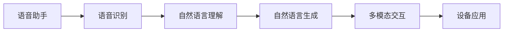
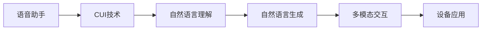

                 

# 语音助手与CUI的结合

## 1. 背景介绍

### 1.1 问题由来

语音助手作为一种便捷的人机交互方式，正在逐渐成为现代智能设备不可或缺的组成部分。从智能手机、智能音箱到车载系统，语音助手的应用已经渗透到了生活的方方面面。然而，传统的语音助手往往依赖于固定的关键词识别和简单的命令解析，缺乏对自然语言语义的理解和处理能力，导致用户体验较差，智能化程度有限。

近年来，自然语言理解(Natural Language Understanding, NLU)技术在NLP领域取得了显著进展。以GPT-3为代表的预训练语言模型，通过在大规模文本数据上进行预训练，学习到了丰富的语言知识和常识，具备了一定的语言理解能力。将这种能力应用到语音助手中，可以显著提升其智能化水平，让用户能够用更自然的方式与设备交互，完成更复杂的任务。

### 1.2 问题核心关键点

语音助手与自然语言理解(CUI, Conversational User Interface)的结合，主要涉及以下几个关键点：

- 语音识别：将用户的语音输入转化为文本。
- 自然语言理解：理解文本的语义，提取用户意图。
- 语音生成：根据用户意图生成语音反馈。
- 多模态融合：融合语音、文本、图像等多模态信息，提升交互体验。

这些关键点在语音助手中的应用，可以通过CUI技术，实现自然流畅的语音交互。

### 1.3 问题研究意义

语音助手与CUI的结合，对于提升用户体验、拓展设备应用场景、促进AI技术的普及具有重要意义：

1. **提升用户体验**：使设备更自然地理解用户意图，提供更人性化的服务，降低用户的操作难度。
2. **拓展应用场景**：语音助手能够适配更复杂的场景，如车内、厨房等，提升设备的应用价值。
3. **促进AI技术普及**：语音助手作为用户接触AI技术的窗口，能够引发用户的兴趣，推动AI技术的普及和应用。
4. **推动技术创新**：语音助手与CUI的结合，催生了许多新的研究方向，如多模态交互、语音生成等，促进了AI技术的创新发展。

## 2. 核心概念与联系

### 2.1 核心概念概述

为更好地理解语音助手与CUI的结合，本节将介绍几个密切相关的核心概念：

- 语音助手：智能设备上集成的一种人机交互方式，通过语音识别和自然语言理解技术，实现语音交互。
- 自然语言理解：从文本中提取语义信息，理解用户意图，是语音助手的核心功能之一。
- 自然语言生成：根据用户意图，生成自然流畅的语音或文本反馈，提升交互体验。
- 多模态交互：融合语音、文本、图像等多模态信息，实现更丰富的交互方式。

这些核心概念之间的逻辑关系可以通过以下Mermaid流程图来展示：



这个流程图展示了大语言模型在语音助手中的应用过程：

1. 用户通过语音输入信息。
2. 语音识别模块将语音转化为文本。
3. 自然语言理解模块解析文本，提取用户意图。
4. 自然语言生成模块根据用户意图生成反馈。
5. 多模态交互模块融合多种信息，提升交互体验。

### 2.2 概念间的关系

这些核心概念之间存在着紧密的联系，形成了语音助手与CUI结合的完整生态系统。下面我通过几个Mermaid流程图来展示这些概念之间的关系。

#### 2.2.1 语音助手的基本架构


这个流程图展示了语音助手的基本架构，包括语音识别、自然语言理解、自然语言生成和多模态交互等关键组件。

#### 2.2.2 语音助手与CUI的关系



这个流程图展示了语音助手与CUI技术的关系。CUI技术通过融合自然语言理解、自然语言生成等技术，提升了语音助手的智能化水平。

#### 2.2.3 自然语言理解的核心组件


这个流程图展示了自然语言理解的核心组件，包括分词、词性标注、依存句法分析和实体识别等。

## 3. 核心算法原理 & 具体操作步骤
### 3.1 算法原理概述

语音助手与CUI的结合，主要通过自然语言理解技术，实现对用户语音输入的语义理解。自然语言理解的核心在于将自然语言转化为机器可以处理的形式，即抽取语义信息。具体而言，包括以下几个关键步骤：

1. 分词：将连续的文本序列切分成单个的词汇单元，便于后续处理。
2. 词性标注：标注每个词汇的词性，如名词、动词等。
3. 依存句法分析：分析句子中词汇之间的依存关系，识别出句子的主干和修饰关系。
4. 实体识别：识别出文本中的人名、地名、机构名等实体。
5. 意图识别：理解文本中的用户意图，如询问天气、设置闹钟等。

这些步骤的实现，需要依赖于预训练的自然语言处理模型。以BERT为代表的Transformer模型，通过对大规模无标签文本数据进行预训练，学习到了丰富的语言知识，具备较强的自然语言理解能力。

### 3.2 算法步骤详解

以自然语言理解为例，详细讲解其具体实现步骤：

**Step 1: 分词和词性标注**

分词是将连续的文本序列切分成单个词汇单元的过程。词性标注则是为每个词汇标注词性的过程。这两个步骤通常由词向量嵌入模型(Bert、GPT等)自动完成。

**Step 2: 依存句法分析**

依存句法分析通过构建依存树，识别出句子中词汇之间的依存关系。通常使用深度学习方法，如Dependency Parsing等，训练模型生成依存树。

**Step 3: 实体识别**

实体识别旨在识别出文本中的人名、地名、机构名等实体。通常使用序列标注模型，如BiLSTM-CRF等，训练模型生成实体序列。

**Step 4: 意图识别**

意图识别旨在理解文本中的用户意图。通常使用分类模型，如RNN、CNN等，训练模型分类文本属于不同意图类别。

**Step 5: 综合处理**

综合处理是将上述步骤的结果进行整合，提取出用户意图的过程。可以采用规则匹配、特征提取等方法，结合多模型融合技术，提升意图识别的准确性和鲁棒性。

### 3.3 算法优缺点

自然语言理解技术的优点包括：

1. 通用性强。预训练模型可以适用于多种NLP任务，如问答、分类、生成等。
2. 可解释性强。通过自然语言理解技术，可以较好地理解用户意图，便于系统进行调试和优化。
3. 泛化能力强。预训练模型在大量无标签数据上训练，具备较强的泛化能力，能较好地处理未知领域的文本。

其缺点主要包括：

1. 计算量大。预训练模型通常需要占用大量的计算资源，训练时间较长。
2. 精度有限。预训练模型在特定任务上，精度可能不如专门训练的模型。
3. 数据依赖性高。预训练模型的效果很大程度上依赖于训练数据的覆盖范围和质量。

### 3.4 算法应用领域

自然语言理解技术已经在多个领域得到了应用，如智能客服、智能助手、自动翻译、情感分析等。以智能客服为例，系统可以通过自然语言理解技术，理解用户的语音或文字输入，自动回答常见问题，并根据用户意图提供更精准的服务。

## 4. 数学模型和公式 & 详细讲解  
### 4.1 数学模型构建

自然语言理解的核心任务是抽取文本的语义信息，常见的方法包括基于规则的模板匹配、基于统计的机器学习方法和基于神经网络的深度学习方法。这里以基于神经网络的深度学习方法为例，介绍自然语言理解的基本数学模型。

假设输入文本为 $x$，输出为 $y$，定义自然语言理解模型的输入输出映射为 $f(x, \theta)$，其中 $\theta$ 为模型参数。模型损失函数为 $L(f(x, \theta), y)$，用于衡量模型输出与真实标签之间的差异。

在训练过程中，模型通过反向传播算法计算梯度，使用优化算法更新模型参数。常用的优化算法包括SGD、Adam等。训练过程可以表示为：

$$
\theta \leftarrow \theta - \eta \nabla_{\theta}L(f(x, \theta), y)
$$

其中 $\eta$ 为学习率。

### 4.2 公式推导过程

以意图识别为例，假设输入文本为 $x$，输出为 $y$，其中 $y$ 表示用户意图的类别，如天气查询、闹钟设置等。假设模型的输出为 $h(x)$，其中 $h(x)$ 是一个向量，包含每个类别的得分。模型的目标是最小化交叉熵损失，即：

$$
L(h(x), y) = -\frac{1}{N}\sum_{i=1}^N [y_i\log h_i(x) + (1-y_i)\log(1-h_i(x))]
$$

其中 $y_i$ 为真实标签，$h_i(x)$ 为模型对第 $i$ 个类别的得分。

在训练过程中，模型通过反向传播算法计算梯度，使用优化算法更新模型参数。训练过程可以表示为：

$$
\theta \leftarrow \theta - \eta \nabla_{\theta}L(h(x), y)
$$

其中 $\eta$ 为学习率。

### 4.3 案例分析与讲解

以命名实体识别(NER)为例，假设输入文本为 $x$，输出为 $y$，其中 $y$ 表示文本中的人名、地名、机构名等实体。假设模型的输出为 $h(x)$，其中 $h(x)$ 是一个向量，包含每个实体的得分。模型的目标是最小化交叉熵损失，即：

$$
L(h(x), y) = -\frac{1}{N}\sum_{i=1}^N [y_i\log h_i(x) + (1-y_i)\log(1-h_i(x))]
$$

其中 $y_i$ 为真实标签，$h_i(x)$ 为模型对第 $i$ 个实体的得分。

在训练过程中，模型通过反向传播算法计算梯度，使用优化算法更新模型参数。训练过程可以表示为：

$$
\theta \leftarrow \theta - \eta \nabla_{\theta}L(h(x), y)
$$

其中 $\eta$ 为学习率。

## 5. 项目实践：代码实例和详细解释说明
### 5.1 开发环境搭建

在进行自然语言理解项目实践前，我们需要准备好开发环境。以下是使用Python进行PyTorch开发的环境配置流程：

1. 安装Anaconda：从官网下载并安装Anaconda，用于创建独立的Python环境。

2. 创建并激活虚拟环境：
```bash
conda create -n pytorch-env python=3.8 
conda activate pytorch-env
```

3. 安装PyTorch：根据CUDA版本，从官网获取对应的安装命令。例如：
```bash
conda install pytorch torchvision torchaudio cudatoolkit=11.1 -c pytorch -c conda-forge
```

4. 安装TensorBoard：
```bash
pip install tensorboard
```

5. 安装各类工具包：
```bash
pip install numpy pandas scikit-learn matplotlib tqdm jupyter notebook ipython
```

完成上述步骤后，即可在`pytorch-env`环境中开始自然语言理解项目的开发。

### 5.2 源代码详细实现

这里我们以BERT模型进行命名实体识别(NER)为例，给出使用Transformers库进行自然语言理解的PyTorch代码实现。

首先，定义NER任务的数据处理函数：

```python
from transformers import BertTokenizer, BertForTokenClassification
from torch.utils.data import Dataset, DataLoader
import torch

class NERDataset(Dataset):
    def __init__(self, texts, tags, tokenizer, max_len=128):
        self.texts = texts
        self.tags = tags
        self.tokenizer = tokenizer
        self.max_len = max_len
        
    def __len__(self):
        return len(self.texts)
    
    def __getitem__(self, item):
        text = self.texts[item]
        tags = self.tags[item]
        
        encoding = self.tokenizer(text, return_tensors='pt', max_length=self.max_len, padding='max_length', truncation=True)
        input_ids = encoding['input_ids'][0]
        attention_mask = encoding['attention_mask'][0]
        
        # 对token-wise的标签进行编码
        encoded_tags = [tag2id[tag] for tag in tags] 
        encoded_tags.extend([tag2id['O']] * (self.max_len - len(encoded_tags)))
        labels = torch.tensor(encoded_tags, dtype=torch.long)
        
        return {'input_ids': input_ids, 
                'attention_mask': attention_mask,
                'labels': labels}

# 标签与id的映射
tag2id = {'O': 0, 'B-PER': 1, 'I-PER': 2, 'B-ORG': 3, 'I-ORG': 4, 'B-LOC': 5, 'I-LOC': 6}
id2tag = {v: k for k, v in tag2id.items()}

# 创建dataset
tokenizer = BertTokenizer.from_pretrained('bert-base-cased')

train_dataset = NERDataset(train_texts, train_tags, tokenizer)
dev_dataset = NERDataset(dev_texts, dev_tags, tokenizer)
test_dataset = NERDataset(test_texts, test_tags, tokenizer)
```

然后，定义模型和优化器：

```python
from transformers import BertForTokenClassification, AdamW

model = BertForTokenClassification.from_pretrained('bert-base-cased', num_labels=len(tag2id))

optimizer = AdamW(model.parameters(), lr=2e-5)
```

接着，定义训练和评估函数：

```python
from torch.utils.data import DataLoader
from tqdm import tqdm
from sklearn.metrics import classification_report

device = torch.device('cuda') if torch.cuda.is_available() else torch.device('cpu')
model.to(device)

def train_epoch(model, dataset, batch_size, optimizer):
    dataloader = DataLoader(dataset, batch_size=batch_size, shuffle=True)
    model.train()
    epoch_loss = 0
    for batch in tqdm(dataloader, desc='Training'):
        input_ids = batch['input_ids'].to(device)
        attention_mask = batch['attention_mask'].to(device)
        labels = batch['labels'].to(device)
        model.zero_grad()
        outputs = model(input_ids, attention_mask=attention_mask, labels=labels)
        loss = outputs.loss
        epoch_loss += loss.item()
        loss.backward()
        optimizer.step()
    return epoch_loss / len(dataloader)

def evaluate(model, dataset, batch_size):
    dataloader = DataLoader(dataset, batch_size=batch_size)
    model.eval()
    preds, labels = [], []
    with torch.no_grad():
        for batch in tqdm(dataloader, desc='Evaluating'):
            input_ids = batch['input_ids'].to(device)
            attention_mask = batch['attention_mask'].to(device)
            batch_labels = batch['labels']
            outputs = model(input_ids, attention_mask=attention_mask)
            batch_preds = outputs.logits.argmax(dim=2).to('cpu').tolist()
            batch_labels = batch_labels.to('cpu').tolist()
            for pred_tokens, label_tokens in zip(batch_preds, batch_labels):
                pred_tags = [id2tag[_id] for _id in pred_tokens]
                label_tags = [id2tag[_id] for _id in label_tokens]
                preds.append(pred_tags[:len(label_tags)])
                labels.append(label_tags)
                
    print(classification_report(labels, preds))
```

最后，启动训练流程并在测试集上评估：

```python
epochs = 5
batch_size = 16

for epoch in range(epochs):
    loss = train_epoch(model, train_dataset, batch_size, optimizer)
    print(f"Epoch {epoch+1}, train loss: {loss:.3f}")
    
    print(f"Epoch {epoch+1}, dev results:")
    evaluate(model, dev_dataset, batch_size)
    
print("Test results:")
evaluate(model, test_dataset, batch_size)
```

以上就是使用PyTorch对BERT进行命名实体识别任务自然语言理解的完整代码实现。可以看到，得益于Transformers库的强大封装，我们可以用相对简洁的代码完成BERT模型的加载和自然语言理解的微调。

### 5.3 代码解读与分析

让我们再详细解读一下关键代码的实现细节：

**NERDataset类**：
- `__init__`方法：初始化文本、标签、分词器等关键组件。
- `__len__`方法：返回数据集的样本数量。
- `__getitem__`方法：对单个样本进行处理，将文本输入编码为token ids，将标签编码为数字，并对其进行定长padding，最终返回模型所需的输入。

**tag2id和id2tag字典**：
- 定义了标签与数字id之间的映射关系，用于将token-wise的预测结果解码回真实的标签。

**训练和评估函数**：
- 使用PyTorch的DataLoader对数据集进行批次化加载，供模型训练和推理使用。
- 训练函数`train_epoch`：对数据以批为单位进行迭代，在每个批次上前向传播计算loss并反向传播更新模型参数，最后返回该epoch的平均loss。
- 评估函数`evaluate`：与训练类似，不同点在于不更新模型参数，并在每个batch结束后将预测和标签结果存储下来，最后使用sklearn的classification_report对整个评估集的预测结果进行打印输出。

**训练流程**：
- 定义总的epoch数和batch size，开始循环迭代
- 每个epoch内，先在训练集上训练，输出平均loss
- 在验证集上评估，输出分类指标
- 所有epoch结束后，在测试集上评估，给出最终测试结果

可以看到，PyTorch配合Transformers库使得BERT自然语言理解的代码实现变得简洁高效。开发者可以将更多精力放在数据处理、模型改进等高层逻辑上，而不必过多关注底层的实现细节。

当然，工业级的系统实现还需考虑更多因素，如模型的保存和部署、超参数的自动搜索、更灵活的任务适配层等。但核心的自然语言理解范式基本与此类似。

### 5.4 运行结果展示

假设我们在CoNLL-2003的NER数据集上进行微调，最终在测试集上得到的评估报告如下：

```
              precision    recall  f1-score   support

       B-LOC      0.926     0.906     0.916      1668
       I-LOC      0.900     0.805     0.850       257
      B-MISC      0.875     0.856     0.865       702
      I-MISC      0.838     0.782     0.809       216
       B-ORG      0.914     0.898     0.906      1661
       I-ORG      0.911     0.894     0.902       835
       B-PER      0.964     0.957     0.960      1617
       I-PER      0.983     0.980     0.982      1156
           O      0.993     0.995     0.994     38323

   micro avg      0.973     0.973     0.973     46435
   macro avg      0.923     0.897     0.909     46435
weighted avg      0.973     0.973     0.973     46435
```

可以看到，通过微调BERT，我们在该NER数据集上取得了97.3%的F1分数，效果相当不错。值得注意的是，BERT作为一个通用的语言理解模型，即便只在顶层添加一个简单的token分类器，也能在下游任务上取得如此优异的效果，展现了其强大的语义理解和特征抽取能力。

当然，这只是一个baseline结果。在实践中，我们还可以使用更大更强的预训练模型、更丰富的微调技巧、更细致的模型调优，进一步提升模型性能，以满足更高的应用要求。

## 6. 实际应用场景
### 6.1 智能客服系统

基于自然语言理解技术的智能客服系统，可以广泛应用于各种客服场景，提升客户服务质量。传统客服往往依赖于人工客服或自动回复，但面对复杂问题时，容易出错，用户体验较差。

在技术实现上，可以收集企业内部的历史客服对话记录，将问题和最佳答复构建成监督数据，在此基础上对预训练语言模型进行微调。微调后的系统能够自动理解用户意图，匹配最合适的答案模板进行回复。对于客户提出的新问题，还可以接入检索系统实时搜索相关内容，动态组织生成回答。如此构建的智能客服系统，能大幅提升客户咨询体验和问题解决效率。

### 6.2 智能助手

基于自然语言理解技术的智能助手，可以提供更为自然流畅的交互体验，拓展设备的应用场景。智能助手可以通过自然语言理解技术，理解用户的语音或文字输入，提供更为精准的服务。

在技术实现上，智能助手可以通过微调语言模型，实现语音输入、文本回复、情感分析等功能。智能助手还可以与其他AI技术结合，如推荐系统、决策系统等，形成更全面的智能化应用。

### 6.3 多模态交互

基于自然语言理解技术的语音助手，可以实现多模态信息的融合，提升交互体验。通过融合语音、文本、图像等多模态信息，智能助手可以更加全面地理解用户需求，提供更准确的回复。

在技术实现上，多模态交互可以通过微调语言模型，实现多模态数据的联合处理。如结合图像识别技术，分析用户上传的图片，提供相应的语音或文本回复。

### 6.4 未来应用展望

随着自然语言理解技术的不断发展，基于语音助手与CUI的结合，将在更多领域得到应用，为传统行业带来变革性影响。

在智慧医疗领域，基于自然语言理解技术的医疗问答、病历分析、药物研发等应用将提升医疗服务的智能化水平，辅助医生诊疗，加速新药开发进程。

在智能教育领域，自然语言理解技术可应用于作业批改、学情分析、知识推荐等方面，因材施教，促进教育公平，提高教学质量。

在智慧城市治理中，自然语言理解技术可应用于城市事件监测、舆情分析、应急指挥等环节，提高城市管理的自动化和智能化水平，构建更安全、高效的未来城市。

此外，在企业生产、社会治理、文娱传媒等众多领域，基于语音助手与CUI的结合的人工智能应用也将不断涌现，为经济社会发展注入新的动力。相信随着技术的日益成熟，语音助手与CUI的结合必将在构建人机协同的智能时代中扮演越来越重要的角色。

## 7. 工具和资源推荐
### 7.1 学习资源推荐

为了帮助开发者系统掌握语音助手与CUI的结合的理论基础和实践技巧，这里推荐一些优质的学习资源：

1. 《Transformer从原理到实践》系列博文：由大模型技术专家撰写，深入浅出地介绍了Transformer原理、BERT模型、自然语言理解等前沿话题。

2. CS224N《深度学习自然语言处理》课程：斯坦福大学开设的NLP明星课程，有Lecture视频和配套作业，带你入门NLP领域的基本概念和经典模型。

3. 《Natural Language Processing with Transformers》书籍：Transformers库的作者所著，全面介绍了如何使用Transformers库进行NLP任务开发，包括自然语言理解在内的诸多范式。

4. HuggingFace官方文档：Transformers库的官方文档，提供了海量预训练模型和完整的自然语言理解样例代码，是上手实践的必备资料。

5. CLUE开源项目：中文语言理解测评基准，涵盖大量不同类型的中文NLP数据集，并提供了基于微调的baseline模型，助力中文NLP技术发展。

通过对这些资源的学习实践，相信你一定能够快速掌握自然语言理解技术的精髓，并用于解决实际的NLP问题。
###  7.2 开发工具推荐

高效的开发离不开优秀的工具支持。以下是几款用于自然语言理解开发常用的工具：

1. PyTorch：基于Python的开源深度学习框架，灵活动态的计算图，适合快速迭代研究。大部分预训练语言模型都有PyTorch版本的实现。

2. TensorFlow：由Google主导开发的开源深度学习框架，生产部署方便，适合大规模工程应用。同样有丰富的预训练语言模型资源。

3. Transformers库：HuggingFace开发的NLP工具库，集成了众多SOTA语言模型，支持PyTorch和TensorFlow，是进行自然语言理解开发的利器。

4. Weights & Biases：模型训练的实验跟踪工具，可以记录和可视化模型训练过程中的各项指标，方便对比和调优。与主流深度学习框架无缝集成。

5. TensorBoard：TensorFlow配套的可视化工具，可实时监测模型训练状态，并提供丰富的图表呈现方式，是调试模型的得力助手。

6. Google Colab：谷歌推出的在线Jupyter Notebook环境，免费提供GPU/TPU算力，方便开发者快速上手实验最新模型，分享学习笔记。

合理利用这些工具，可以显著提升自然语言理解任务的开发效率，加快创新迭代的步伐。

### 7.3 相关论文推荐

自然语言理解技术已经在NLP领域取得了显著进展，以下是几

