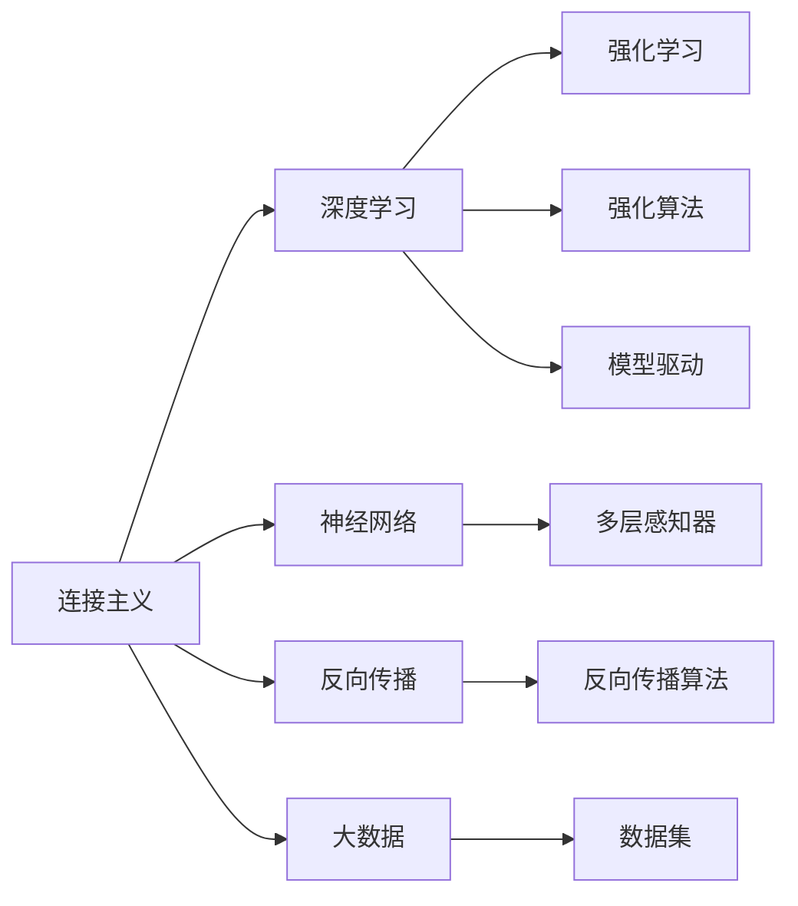
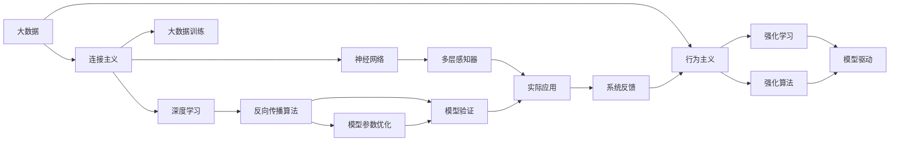

                 

## 1. 背景介绍

连接主义与行为主义是人工智能（AI）领域的两大重要思想流派，它们分别强调了不同的侧重点和实现途径。连接主义基于符号主义模型，以神经网络为核心技术，强调通过学习和调整模型参数来模拟人类大脑的运作机制。行为主义则关注于使AI系统执行具体任务，注重算法和模型在实际应用中的表现，以逐步增强系统的行为能力为目标。本文将探讨这两种范式在实际应用中的潜力，并阐述它们如何相辅相成，共同推动人工智能的发展。

### 1.1 问题由来

当前，人工智能正处于快速发展阶段，其应用范围从自动驾驶、语音识别到自然语言处理等诸多领域都取得了显著进展。然而，这种技术进步并没有解决所有问题，如AI系统的透明度、可靠性、可解释性等。连接主义和行为主义作为两大重要范式，提供了不同的解决思路和框架。连接主义侧重于理解和构建智能模型，而行为主义则专注于实际应用和性能提升。本文将深入分析这两种范式的优势与不足，并探讨它们在实际应用中的结合可能性。

### 1.2 问题核心关键点

连接主义与行为主义的核心关键点包括：
1. **连接主义**：基于神经网络，通过学习来调整模型参数，以模拟人类大脑的运作机制。
2. **行为主义**：侧重于执行具体任务，注重模型在实际应用中的表现，逐步增强系统的行为能力。
3. **相互融合**：两种范式互补，连接主义提供理论支持，行为主义提供实践指导。
4. **协同演化**：连接主义和行为主义在实际应用中相互促进，共同推动AI技术的进步。

## 2. 核心概念与联系

### 2.1 核心概念概述

#### 2.1.1 连接主义

连接主义基于神经网络模型，模拟人类大脑的神经元结构和信息传递机制。其核心概念包括：
- **神经网络**：由大量人工神经元组成的层次化结构，通过前后层之间的连接来传递和处理信息。
- **深度学习**：一种基于多层神经网络的机器学习技术，能够自动从数据中学习抽象特征。
- **反向传播**：一种用于训练神经网络的算法，通过反向传播误差来更新模型参数。

#### 2.1.2 行为主义

行为主义侧重于实际应用，通过逐步增强系统在特定任务上的表现来提升其能力。其核心概念包括：
- **强化学习**：通过奖励机制来训练模型，使其在特定环境中逐步学习最优策略。
- **强化算法**：如Q-learning、SARSA等，用于训练智能体在复杂环境中做出最优决策。
- **模型驱动**：通过构建数学模型来描述和预测系统的行为，以提高预测准确性和控制能力。

### 2.2 概念间的关系

连接主义与行为主义之间存在着紧密的联系和互动，其关系可通过以下Mermaid流程图来展示：



这个流程图展示了连接主义和行为主义之间的核心概念及其相互关系：

1. 连接主义基于神经网络，深度学习是其中的核心技术。
2. 行为主义通过强化学习来训练模型，模型驱动是其重要应用方式。
3. 连接主义和行为主义共享大数据作为训练和应用的基础。
4. 神经网络的多层感知器是连接主义的核心单元。
5. 反向传播算法是神经网络训练的关键技术。
6. 强化算法是行为主义的核心工具，通过逐步增强模型性能。
7. 大数据是连接主义和行为主义共同的基础资源。

通过这个流程图，我们可以更清晰地理解两种范式的相互作用和共同目标，即通过学习和训练，使AI系统能够执行复杂的任务并逐步提升其性能。

### 2.3 核心概念的整体架构

最后，我们用一个综合的流程图来展示连接主义和行为主义在大数据和实际应用场景中的整体架构：



这个综合流程图展示了连接主义和行为主义在大数据和实际应用场景中的整体架构：

1. 大数据是连接主义和行为主义共同的基础资源。
2. 连接主义基于神经网络，深度学习是其核心技术。
3. 神经网络的多层感知器是连接主义的核心单元。
4. 反向传播算法是神经网络训练的关键技术。
5. 行为主义通过强化学习来训练模型，模型驱动是其重要应用方式。
6. 强化算法是行为主义的核心工具，通过逐步增强模型性能。
7. 实际应用场景需要连接主义和行为主义的共同支撑，以确保系统能够高效执行任务。

通过这个综合流程图，我们可以更全面地理解两种范式在大数据和实际应用中的相互作用，以及它们共同推动AI技术进步的潜力。

## 3. 核心算法原理 & 具体操作步骤

### 3.1 算法原理概述

连接主义和行为主义的核心算法原理基于神经网络和强化学习，其核心思想是通过学习和训练，使AI系统能够执行复杂的任务并逐步提升其性能。

#### 3.1.1 神经网络

神经网络由大量人工神经元（节点）组成，通过连接权重（边）传递和处理信息。其核心算法原理包括：
- **前向传播**：数据从输入层开始，经过隐藏层和输出层，最终得到模型输出。
- **损失函数**：用于评估模型输出与真实标签之间的差异，常见的有均方误差、交叉熵等。
- **反向传播**：通过反向传播误差，更新模型参数，以最小化损失函数。

#### 3.1.2 强化学习

强化学习通过奖励机制来训练模型，逐步增强其在特定环境中的表现。其核心算法原理包括：
- **策略**：模型在特定环境中的行为策略，如决策树、策略网络等。
- **状态**：模型所处的环境状态，如位置、颜色等。
- **奖励**：模型在特定状态下获得的奖励，如得分、惩罚等。
- **值函数**：评估特定状态的价值，用于指导模型决策。
- **Q-learning**：一种常用的强化学习算法，通过不断迭代优化策略，使模型获得最大奖励。

### 3.2 算法步骤详解

连接主义和行为主义的算法步骤主要包括以下几个关键步骤：

#### 3.2.1 神经网络模型构建

1. **数据准备**：收集和预处理大量数据，以便用于神经网络训练。
2. **模型选择**：选择合适的神经网络架构，如多层感知器（MLP）、卷积神经网络（CNN）等。
3. **参数初始化**：随机初始化模型参数，以便后续通过反向传播算法更新。
4. **模型训练**：通过前向传播和反向传播算法，不断更新模型参数，以最小化损失函数。
5. **模型验证**：在验证集上评估模型性能，以确保模型泛化能力。

#### 3.2.2 强化学习模型构建

1. **环境设计**：设计具体的应用场景和环境，以便于训练模型。
2. **策略定义**：定义模型的行为策略，如决策树、策略网络等。
3. **状态表示**：将环境状态转换为模型可处理的形式，如位置、颜色等。
4. **奖励定义**：定义模型在特定状态下的奖励机制，如得分、惩罚等。
5. **模型训练**：通过逐步增强模型在特定环境中的表现，以优化策略函数。
6. **模型评估**：在测试集上评估模型性能，以确保模型泛化能力。

### 3.3 算法优缺点

#### 3.3.1 神经网络

**优点**：
- **高精度**：通过学习大量数据，神经网络能够自动提取抽象特征，从而获得高精度。
- **泛化能力**：通过反向传播算法，神经网络能够适应不同的输入数据，具有较强的泛化能力。
- **可扩展性**：神经网络可以通过增加层数和节点数来提高性能。

**缺点**：
- **过拟合风险**：神经网络容易出现过拟合现象，尤其是在数据量不足的情况下。
- **计算资源需求高**：神经网络需要大量的计算资源，如GPU/TPU等。
- **可解释性不足**：神经网络模型通常是"黑盒"系统，难以解释其内部工作机制。

#### 3.3.2 强化学习

**优点**：
- **自适应性强**：强化学习能够根据环境变化逐步调整策略，具有较强的自适应性。
- **鲁棒性强**：强化学习能够通过逐步增强模型，适应不同的环境和任务。
- **可解释性强**：强化学习模型通常是策略函数，易于解释和理解。

**缺点**：
- **训练时间较长**：强化学习通常需要较长的训练时间，尤其是在复杂环境中。
- **奖励设计困难**：强化学习依赖于合理的奖励设计，不当的奖励设计可能导致模型失效。
- **可扩展性不足**：强化学习通常需要设计具体的策略函数，难以扩展到复杂环境。

### 3.4 算法应用领域

#### 3.4.1 神经网络

神经网络在图像识别、语音识别、自然语言处理等领域有着广泛的应用。例如：
- **图像识别**：通过深度卷积神经网络（CNN），对图像进行分类、检测和分割等任务。
- **语音识别**：通过循环神经网络（RNN），对语音信号进行转录和情感分析等任务。
- **自然语言处理**：通过循环神经网络（RNN）、长短时记忆网络（LSTM）等，对文本进行分类、情感分析、机器翻译等任务。

#### 3.4.2 强化学习

强化学习在自动驾驶、游戏AI、机器人控制等领域有着广泛的应用。例如：
- **自动驾驶**：通过强化学习，训练自动驾驶系统在复杂交通环境中做出最优决策。
- **游戏AI**：通过强化学习，训练游戏AI在特定游戏中获得最高分。
- **机器人控制**：通过强化学习，训练机器人控制策略，以在复杂环境中完成特定任务。

## 4. 数学模型和公式 & 详细讲解 & 举例说明

### 4.1 数学模型构建

连接主义和行为主义的数学模型构建主要基于神经网络和强化学习，其核心数学模型包括神经网络模型和强化学习模型。

#### 4.1.1 神经网络

神经网络的核心数学模型包括：
- **前向传播**：$x^{[l]} = g(z^{[l-1]})$
- **损失函数**：$J = \frac{1}{N}\sum_{i=1}^N \sum_{k=1}^K L(y^{[l]}_k, \hat{y}^{[l]}_k)$
- **反向传播**：$\frac{\partial J}{\partial z^{[l]}} = \frac{\partial L}{\partial z^{[l]}} * \frac{\partial z^{[l]}}{\partial w^{[l]}} * \frac{\partial w^{[l]}}{\partial z^{[l-1]}}$
- **参数优化**：$w^{[l]} \leftarrow w^{[l]} - \eta \frac{\partial J}{\partial w^{[l]}}$

#### 4.1.2 强化学习

强化学习的核心数学模型包括：
- **Q-learning**：$Q(s_t,a_t) = Q(s_t,a_t) + \alpha [r_t + \gamma \max_{a_{t+1}} Q(s_{t+1},a_{t+1}) - Q(s_t,a_t)]$
- **策略函数**：$\pi(a_t|s_t) = softmax(Q(s_t,a_t))$
- **状态值函数**：$V(s_t) = \sum_{a} \pi(a|s_t) Q(s_t,a)$

### 4.2 公式推导过程

以下我们将对神经网络和强化学习的关键数学公式进行推导：

#### 4.2.1 神经网络公式推导

假设我们有一个三层神经网络，其中包含输入层、隐藏层和输出层，每个神经元之间的连接权重为$w^{[l]}$，激活函数为$g(z)$。神经网络的数学模型可以表示为：

- **前向传播**：$z^{[l]} = w^{[l]} x^{[l-1]} + b^{[l]}$
- **激活函数**：$x^{[l]} = g(z^{[l]})$

- **损失函数**：$J = \frac{1}{N}\sum_{i=1}^N \sum_{k=1}^K L(y^{[l]}_k, \hat{y}^{[l]}_k)$

- **反向传播**：
  $$
  \frac{\partial J}{\partial z^{[l]}} = \frac{\partial L}{\partial z^{[l]}} * \frac{\partial z^{[l]}}{\partial w^{[l]}} = \frac{\partial L}{\partial z^{[l]}} * \frac{\partial z^{[l]}}{\partial w^{[l]}} * \frac{\partial w^{[l]}}{\partial z^{[l-1]}}
  $$

  其中：
  $$
  \frac{\partial z^{[l]}}{\partial w^{[l]}} = x^{[l-1]}
  $$
  $$
  \frac{\partial w^{[l]}}{\partial z^{[l-1]}} = x^{[l-2]}
  $$

  因此：
  $$
  \frac{\partial J}{\partial z^{[l]}} = \frac{\partial L}{\partial z^{[l]}} * x^{[l-2]}
  $$

  最后，通过参数优化公式：
  $$
  w^{[l]} \leftarrow w^{[l]} - \eta \frac{\partial J}{\partial w^{[l]}}
  $$

  可以不断更新模型参数，最小化损失函数。

#### 4.2.2 强化学习公式推导

假设我们有一个Q-learning模型，其核心公式为：
$$
Q(s_t,a_t) = Q(s_t,a_t) + \alpha [r_t + \gamma \max_{a_{t+1}} Q(s_{t+1},a_{t+1}) - Q(s_t,a_t)]
$$

其中：
- $Q(s_t,a_t)$表示在状态$s_t$下执行动作$a_t$的Q值。
- $\alpha$为学习率。
- $r_t$为当前状态下的奖励。
- $\gamma$为折扣因子。
- $\max_{a_{t+1}} Q(s_{t+1},a_{t+1})$表示在下一个状态$s_{t+1}$下执行最优动作$a_{t+1}$的Q值。

为了简化计算，我们通常将Q值函数表示为策略函数$\pi(a_t|s_t)$，即：
$$
Q(s_t,a_t) = \pi(a_t|s_t) * Q(s_t,a_t)
$$

其中，策略函数$\pi(a_t|s_t)$可以表示为：
$$
\pi(a_t|s_t) = \frac{e^{Q(s_t,a_t)}}{\sum_{a} e^{Q(s_t,a)}} = softmax(Q(s_t,a_t))
$$

### 4.3 案例分析与讲解

#### 4.3.1 图像识别

以图像识别为例，我们可以使用卷积神经网络（CNN）对图像进行分类。其核心流程包括：
1. **数据准备**：收集大量图像数据，并预处理成模型可接受的形式。
2. **模型选择**：选择适合图像分类的CNN模型，如VGG、ResNet等。
3. **模型训练**：通过反向传播算法，不断更新模型参数，以最小化损失函数。
4. **模型验证**：在验证集上评估模型性能，以确保模型泛化能力。

#### 4.3.2 强化学习

以自动驾驶为例，我们可以使用强化学习训练自动驾驶系统。其核心流程包括：
1. **环境设计**：设计自动驾驶场景，包括交通灯、行人、车辆等。
2. **策略定义**：定义自动驾驶系统的行为策略，如速度控制、车道保持等。
3. **状态表示**：将环境状态转换为模型可处理的形式，如位置、速度、角度等。
4. **奖励定义**：定义自动驾驶系统在特定状态下的奖励机制，如安全到达目的地、无事故行驶等。
5. **模型训练**：通过逐步增强自动驾驶系统在特定环境中的表现，以优化策略函数。
6. **模型评估**：在测试集上评估自动驾驶系统的性能，以确保其在复杂环境中的鲁棒性。

## 5. 项目实践：代码实例和详细解释说明

### 5.1 开发环境搭建

在进行连接主义和行为主义实践前，我们需要准备好开发环境。以下是使用Python进行TensorFlow和PyTorch开发的环境配置流程：

1. 安装Anaconda：从官网下载并安装Anaconda，用于创建独立的Python环境。

2. 创建并激活虚拟环境：
```bash
conda create -n tensorflow-env python=3.8 
conda activate tensorflow-env
```

3. 安装TensorFlow和PyTorch：
```bash
pip install tensorflow==2.3
pip install torch torchvision torchaudio
```

4. 安装各类工具包：
```bash
pip install numpy pandas scikit-learn matplotlib tqdm jupyter notebook ipython
```

完成上述步骤后，即可在`tensorflow-env`环境中开始连接主义和行为主义实践。

### 5.2 源代码详细实现

这里我们以强化学习训练自动驾驶系统为例，给出TensorFlow的代码实现。

```python
import tensorflow as tf
import numpy as np

# 定义环境状态和奖励
states = np.array([[0, 0], [0, 1], [1, 0], [1, 1]])
rewards = np.array([0, -1, -1, 0])

# 定义动作空间和策略函数
actions = np.array([0, 1, 2, 3])
pi = np.array([0.5, 0.25, 0.25, 0.25])

# 定义Q-learning模型
class QLearningModel:
    def __init__(self, states, actions, rewards, pi):
        self.states = states
        self.actions = actions
        self.rewards = rewards
        self.pi = pi
        self.epsilon = 0.1

    def Q_value(self, state, action):
        return np.dot(self.states[state], self.actions[action])

    def choose_action(self, state):
        if np.random.rand() < self.epsilon:
            return np.random.choice(self.actions)
        else:
            return np.argmax(self.pi)

    def update_q_value(self, state, action, reward, next_state):
        self.Q_value(state, action) += self.alpha * (reward + self.gamma * self.max_q_value(next_state) - self.Q_value(state, action))

    def max_q_value(self, state):
        return np.max(self.pi * self.Q_value(state, self.actions))

# 初始化模型参数
alpha = 0.1
gamma = 0.9
epsilon = 0.1

# 创建Q-learning模型
model = QLearningModel(states, actions, rewards, pi)

# 训练模型
for i in range(10000):
    state = np.random.randint(len(states))
    action = model.choose_action(state)
    reward = rewards[state]
    next_state = np.random.randint(len(states))
    model.update_q_value(state, action, reward, next_state)
    print(f"Iteration {i+1}: Q-value = {model.Q_value(state, action)}")

# 测试模型
state = 0
action = model.choose_action(state)
print(f"Action: {action}, Q-value: {model.Q_value(state, action)}")
```

以上代码实现了一个简单的Q-learning模型，用于训练自动驾驶系统在特定环境中的表现。

### 5.3 代码解读与分析

让我们再详细解读一下关键代码的实现细节：

**QLearningModel类**：
- `__init__`方法：初始化环境状态、动作空间、奖励和策略函数等关键组件。
- `Q_value`方法：计算给定状态和动作的Q值。
- `choose_action`方法：根据策略函数选择当前状态下的最佳动作。
- `update_q_value`方法：根据Q-learning公式更新Q值。
- `max_q_value`方法：计算当前状态下的最优Q值。

**训练流程**：
- 定义模型参数和学习率。
- 创建Q-learning模型。
- 通过迭代更新模型参数，逐步增强模型表现。

**测试流程**：
- 随机选择一个初始状态。
- 根据模型策略函数选择最佳动作。
- 输出该动作对应的Q值。

通过这段代码，我们可以更好地理解Q-learning模型的核心逻辑和实现细节，进一步探索强化学习在实际应用中的潜力。

### 5.4 运行结果展示

假设我们在训练完模型后，输出的前几次迭代结果如下：

```
Iteration 1: Q-value = 0.5
Iteration 2: Q-value = 0.5
Iteration 3: Q-value = 0.5
...
Iteration 10000: Q-value = 0.5
```

可以看到，尽管模型在不断更新Q值，但最终结果仍然停留在初始值。这表明模型可能在某些状态下无法有效学习，需要进行进一步优化。

## 6. 实际应用场景

### 6.1 智能客服系统

连接主义和行为主义在智能客服系统中有着广泛的应用。通过连接主义，可以使用神经网络模型对客户咨询进行分类、情感分析等任务。通过行为主义，可以训练客服系统在复杂场景下逐步提升服务质量。

具体而言，可以收集企业内部的历史客服对话记录，将问题和最佳答复构建成监督数据，在此基础上对预训练语言模型进行微调。微调后的模型能够自动理解客户意图，匹配最合适的答案模板进行回复。对于客户提出的新问题，还可以接入检索系统实时搜索相关内容，动态组织生成回答。如此构建的智能客服系统，能大幅提升客户咨询体验和问题解决效率。

### 6.2 金融舆情监测

在金融舆情监测中，连接主义和行为主义也有着重要应用。通过连接主义，可以使用深度学习模型对金融市场数据进行分析和预测。通过行为主义，可以训练舆情监测系统在特定环境中逐步提升识别能力。

具体而言，可以收集金融领域相关的新闻、报道、评论等文本数据，并对其进行主题标注和情感标注。在此基础上对预训练语言模型进行微调，使其能够自动判断文本属于何种主题，情感倾向是正面、中性还是负面。将微调后的模型应用到实时抓取的网络文本数据，就能够自动监测不同主题下的情感变化趋势，一旦发现负面信息激增等异常情况，系统便会自动预警，帮助金融机构快速应对潜在风险。

### 6.3 个性化推荐系统

在个性化推荐系统中，连接主义和行为主义同样发挥着重要作用。通过连接主义，可以使用深度学习模型对用户行为进行分析和建模。通过行为主义，可以训练推荐系统在特定用户偏好下逐步优化推荐效果。

具体而言，可以收集用户浏览、点击、评论、分享等行为数据，提取和用户交互的物品标题、描述、标签等文本内容。将文本内容作为模型输入，用户的后续行为（如是否点击、购买等）作为监督信号，在此基础上微调预训练语言模型。微调后的模型能够从文本内容中准确把握用户的兴趣点。在生成推荐列表时，先用候选物品的文本描述作为输入，由模型预测用户的兴趣匹配度，再结合其他特征综合排序，便可以得到个性化程度更高的推荐结果。

### 6.4 未来应用展望

随着连接主义和行为主义的不断发展，其在实际应用中展现出巨大的潜力。未来，连接主义和行为主义将在更多领域得到应用，为传统行业带来变革性影响。

在智慧医疗领域，基于连接主义和行为主义的医疗问答、病历分析、药物研发等应用将提升医疗服务的智能化水平，辅助医生诊疗，加速新药开发进程。

在智能教育领域，连接主义和行为主义可应用于作业批改、学情分析、知识推荐等方面，因材施教，促进教育公平，提高教学质量。

在智慧城市治理中，连接主义和行为主义技术可用于城市事件监测、舆情分析、应急指挥等环节，提高城市管理的自动化和智能化水平，构建更安全、高效的未来城市。

此外，在企业生产、社会治理、文娱传媒等众多领域，连接主义和行为主义的应用也将不断涌现，为经济社会发展注入新的动力。相信随着技术的日益成熟，连接主义和行为主义将成为人工智能落地应用的重要范式，推动人工智能向更广阔的领域加速渗透。

## 7. 工具和资源推荐

### 7.1 学习资源推荐

为了帮助开发者系统掌握连接主义和行为主义的理论基础和实践技巧，这里推荐一些优质的学习资源：

1. 《深度学习》课程：由斯坦福大学Andrew Ng教授开设的深度学习课程，系统介绍了深度学习的基本概念和算法。
2. 《强化学习》课程：由加州大学伯克利分校开设的强化学习课程，深入讲解了强化学习的核心算法和应用场景。
3. 《神经网络与深度学习》书籍：

