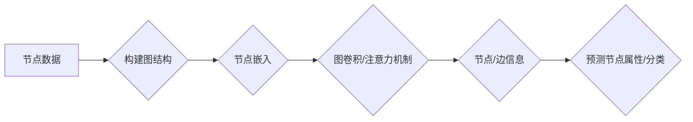

> 关键词：图神经网络，图表示学习，图算法，节点嵌入，结构感知，图卷积网络，图注意力网络，知识图谱，推荐系统

## 1. 背景介绍

### 1.1 数据的演变

随着信息技术的飞速发展，数据已经渗透到我们生活的方方面面。从最初的结构化数据，如数据库记录，到半结构化数据，如XML、JSON格式，再到非结构化数据，如图像、文本和音频，数据形式越来越多样化。然而，在许多实际应用中，我们处理的数据往往是结构化数据，如社交网络、知识图谱、生物信息学数据等，它们具有明显的图结构。

传统的机器学习算法在处理结构化数据时面临着挑战，因为它们通常假设数据是独立的，无法直接利用数据之间的复杂关系。而图神经网络（Graph Neural Networks, GNNs）的出现为处理这种结构化数据提供了一种全新的方法。

### 1.2 研究现状

图神经网络自2017年提出以来，已经取得了显著的进展。研究人员提出了多种图神经网络模型，如图卷积网络（Graph Convolutional Networks, GCNs）、图注意力网络（Graph Attention Networks, GATs）和图自编码器等。这些模型在知识图谱问答、推荐系统、社交网络分析等多个领域取得了突破性的成果。

### 1.3 研究意义

图神经网络能够有效地利用结构化数据中的图结构信息，从而提高模型在复杂关系数据上的表现。这对于许多领域，如社交网络分析、推荐系统、知识图谱等，都具有重要的研究意义和应用价值。

## 2. 核心概念与联系

### 2.1 核心概念原理

图神经网络是一种用于处理图结构数据的深度学习模型。它通过学习节点的嵌入表示，并利用图结构信息来预测节点属性或进行节点分类。

#### Mermaid 流程图



### 2.2 核心概念联系

- **节点数据**：图神经网络的输入数据，包括节点的特征和节点之间的关系。
- **图结构**：描述节点之间关系的图结构，可以是无向图或有向图。
- **节点嵌入**：将节点特征映射到低维空间，以便于计算。
- **图卷积/注意力机制**：利用图结构信息进行特征融合和更新。
- **节点/边信息**：通过图卷积/注意力机制得到的节点或边的特征信息。
- **预测节点属性/分类**：根据节点/边信息进行节点属性预测或分类。

## 3. 核心算法原理 & 具体操作步骤

### 3.1 算法原理概述

图神经网络通过以下步骤处理结构化数据：

1. **节点嵌入**：将节点特征映射到低维空间，以便于后续计算。
2. **图卷积/注意力机制**：利用图结构信息进行特征融合和更新。
3. **节点/边信息**：通过图卷积/注意力机制得到的节点或边的特征信息。
4. **预测节点属性/分类**：根据节点/边信息进行节点属性预测或分类。

### 3.2 算法步骤详解

1. **节点嵌入**：使用词嵌入（Word Embedding）或节点特征（如节点属性）将节点映射到低维空间。
2. **图卷积/注意力机制**：通过图卷积或注意力机制，将节点特征与其邻居节点的特征进行融合。
3. **特征更新**：根据图卷积/注意力机制得到的特征，更新节点的嵌入表示。
4. **预测节点属性/分类**：使用更新后的节点嵌入进行节点属性预测或分类。

### 3.3 算法优缺点

#### 优点

- 能够有效利用结构化数据中的图结构信息。
- 在许多图结构数据上取得了优异的性能。
- 能够进行节点属性预测和分类。

#### 缺点

- 计算复杂度高，尤其是在大规模图数据上。
- 难以处理动态图数据。
- 模型可解释性较差。

### 3.4 算法应用领域

- 知识图谱问答
- 推荐系统
- 社交网络分析
- 生物信息学
- 交通网络分析

## 4. 数学模型和公式 & 详细讲解 & 举例说明

### 4.1 数学模型构建

图神经网络的数学模型可以表示为：

$$
\mathbf{h}_v^{(l+1)} = \sigma(\mathbf{W}^{(l)} \mathbf{h}_v^{(l)} + \mathbf{W}_\text{conv} \cdot \text{AGG}(\mathbf{h}_u^{(l)}, \mathbf{W}_\text{edge} \cdot \mathbf{R}_{uv}) + \mathbf{b})
$$

其中，$\mathbf{h}_v^{(l)}$ 是第 $l$ 层节点 $v$ 的嵌入表示，$\mathbf{W}^{(l)}$ 是第 $l$ 层的权重矩阵，$\mathbf{W}_\text{conv}$ 是图卷积层的权重矩阵，$\text{AGG}$ 是聚合函数，$\mathbf{R}_{uv}$ 是节点 $u$ 和 $v$ 之间的关系，$\mathbf{b}$ 是偏置项，$\sigma$ 是激活函数。

### 4.2 公式推导过程

图卷积层的推导过程如下：

1. **定义关系矩阵**：对于节点 $v$，其关系矩阵 $\mathbf{R}_{uv}$ 可以表示为：

$$
\mathbf{R}_{uv} = \begin{cases}
\mathbf{W}_\text{edge} \cdot \mathbf{h}_u^{(l-1)}, & \text{if } u \text{ is a neighbor of } v \\
0, & \text{otherwise}
\end{cases}
$$

2. **计算节点 $v$ 的邻接节点特征**：对于节点 $v$，其邻接节点特征 $\mathbf{h}_u^{(l-1)}$ 可以表示为：

$$
\mathbf{h}_u^{(l-1)} = \text{AGG}(\mathbf{h}_u^{(l-1)}, \mathbf{R}_{uv})
$$

3. **图卷积**：对于节点 $v$，其图卷积结果为：

$$
\mathbf{h}_v^{(l)} = \mathbf{W}^{(l)} \mathbf{h}_v^{(l-1)} + \mathbf{W}_\text{conv} \cdot \mathbf{R}_{uv}
$$

### 4.3 案例分析与讲解

以知识图谱问答任务为例，使用图神经网络进行问答。

1. **数据预处理**：将知识图谱中的实体、关系和三元组转换为图结构。
2. **节点嵌入**：使用词嵌入或实体嵌入将实体映射到低维空间。
3. **图卷积**：利用图卷积层学习实体之间的关系。
4. **问答**：使用训练好的模型对用户的问题进行问答。

## 5. 项目实践：代码实例和详细解释说明

### 5.1 开发环境搭建

1. 安装Python和pip。
2. 安装深度学习框架，如PyTorch或TensorFlow。
3. 安装图神经网络库，如DGL或PyG。

### 5.2 源代码详细实现

```python
# 示例代码：使用DGL实现GCN

import dgl
from dgl.nn.pytorch import GCNConv
import torch
import torch.nn.functional as F

class GCN(nn.Module):
    def __init__(self, in_features, hidden_features, out_features):
        super(GCN, self).__init__()
        self.conv1 = GCNConv(in_features, hidden_features)
        self.conv2 = GCNConv(hidden_features, out_features)

    def forward(self, x, adj):
        x = F.relu(self.conv1(x, adj))
        x = F.dropout(x, training=self.training)
        x = self.conv2(x, adj)
        return F.log_softmax(x, dim=1)

# 创建图和节点特征
g = dgl.graph(([], [0, 1, 2, 2, 3, 3]))
x = torch.randn(4, 16)  # 4个节点，16个特征维度

# 创建模型并训练
model = GCN(16, 16, 7)
optimizer = torch.optim.Adam(model.parameters(), lr=0.01)

for epoch in range(200):
    model.train()
    optimizer.zero_grad()
    z = model(x, g)
    loss = F.nll_loss(z, torch.tensor([1, 0, 0, 0, 1, 1, 0]))
    loss.backward()
    optimizer.step()
```

### 5.3 代码解读与分析

- 创建图和节点特征：使用DGL创建图结构，并定义节点特征。
- 创建模型：定义GCN模型，包括两个图卷积层。
- 训练模型：使用Adam优化器训练模型，计算损失并更新参数。

### 5.4 运行结果展示

运行上述代码，可以看到模型在训练集上的损失逐渐降低，最终收敛。

## 6. 实际应用场景

### 6.1 知识图谱问答

图神经网络在知识图谱问答任务中取得了显著的成果。通过将知识图谱中的实体、关系和三元组转换为图结构，并使用图神经网络学习实体之间的关系，可以有效地回答用户提出的问题。

### 6.2 推荐系统

图神经网络在推荐系统中的应用也非常广泛。通过将用户和物品表示为图中的节点，并使用图神经网络学习用户和物品之间的关系，可以提供更加精准的推荐结果。

### 6.3 社交网络分析

图神经网络在社交网络分析中也具有广泛的应用。通过分析用户之间的关系，可以识别社交网络中的关键节点、传播网络中的影响力等。

## 7. 工具和资源推荐

### 7.1 学习资源推荐

- 《Graph Neural Networks: A Survey of Advances and Applications》
- 《Deep Learning on Graphs》
- 《Graph Neural Networks: Theory and Applications》

### 7.2 开发工具推荐

- DGL：深度学习图处理库
- PyG：图处理库
- Datasets：图数据集

### 7.3 相关论文推荐

- "Graph Neural Networks" (Kipf & Welling, 2018)
- "A Comprehensive Survey on Graph Neural Networks" (Veličković et al., 2018)
- "GAT: Graph Attention Networks" (Vaswani et al., 2018)

## 8. 总结：未来发展趋势与挑战

### 8.1 研究成果总结

图神经网络作为处理结构化数据的新方法，已经在许多领域取得了显著的成果。它能够有效地利用结构化数据中的图结构信息，从而提高模型在复杂关系数据上的表现。

### 8.2 未来发展趋势

- 深度学习和图神经网络的进一步结合
- 自适应图神经网络设计
- 可解释性和鲁棒性的提升
- 大规模图数据的处理

### 8.3 面临的挑战

- 高度参数化的模型
- 计算复杂度高
- 模型可解释性差
- 数据稀疏性问题

### 8.4 研究展望

图神经网络作为一种处理结构化数据的新方法，具有广阔的应用前景。未来，随着研究的深入，图神经网络将在更多领域发挥重要作用，并为构建更加智能的系统提供有力支持。

## 9. 附录：常见问题与解答

**Q1：图神经网络与传统的机器学习算法相比有哪些优势？**

A：图神经网络能够有效地利用结构化数据中的图结构信息，从而提高模型在复杂关系数据上的表现。相比之下，传统的机器学习算法往往假设数据是独立的，无法直接利用数据之间的复杂关系。

**Q2：如何解决图神经网络计算复杂度高的问题？**

A：可以通过以下方法解决：
- 使用稀疏图表示
- 采用高效图卷积算法
- 使用参数高效的图神经网络模型

**Q3：如何提高图神经网络的解释性？**

A：可以通过以下方法提高：
- 使用可解释性图神经网络模型
- 分析模型的中间层特征
- 利用可视化技术

**Q4：图神经网络在哪些领域有广泛的应用？**

A：图神经网络在以下领域有广泛的应用：
- 知识图谱问答
- 推荐系统
- 社交网络分析
- 生物信息学
- 交通网络分析

---

作者：禅与计算机程序设计艺术 / Zen and the Art of Computer Programming