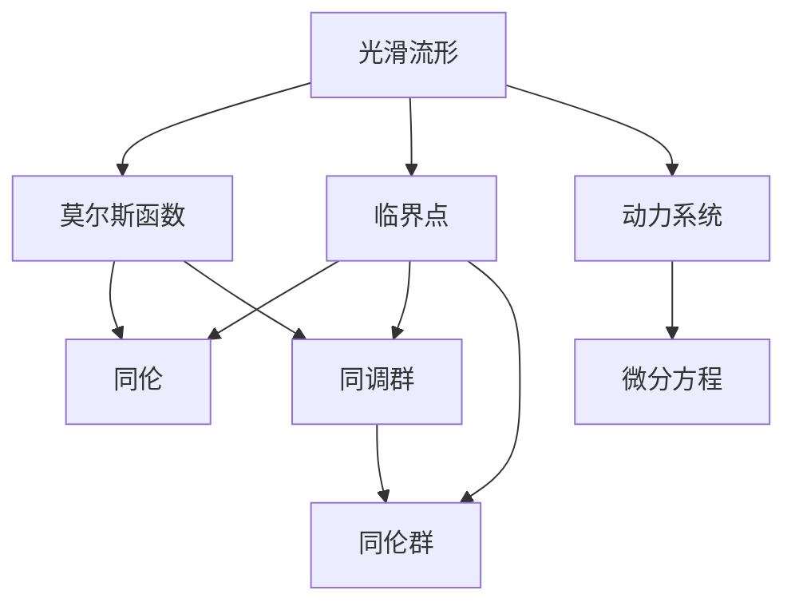
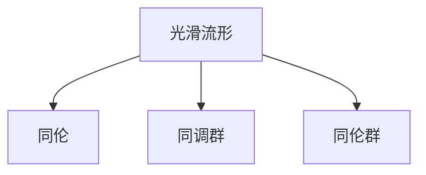
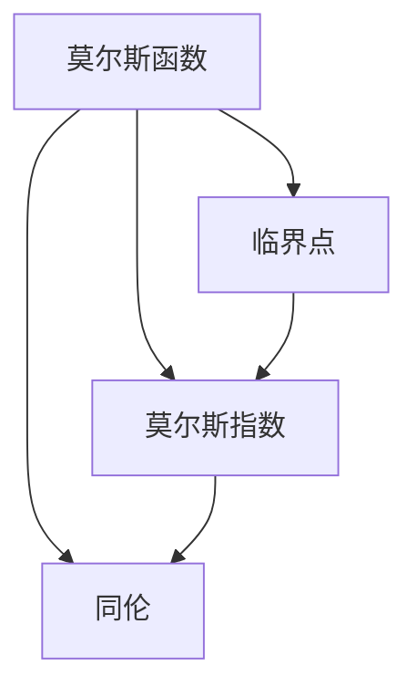
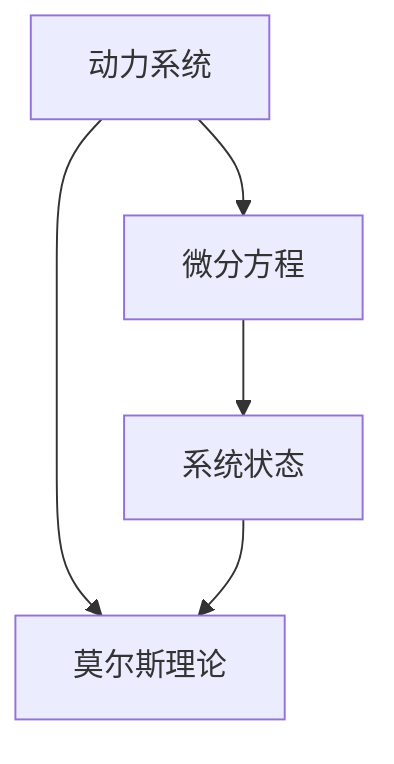
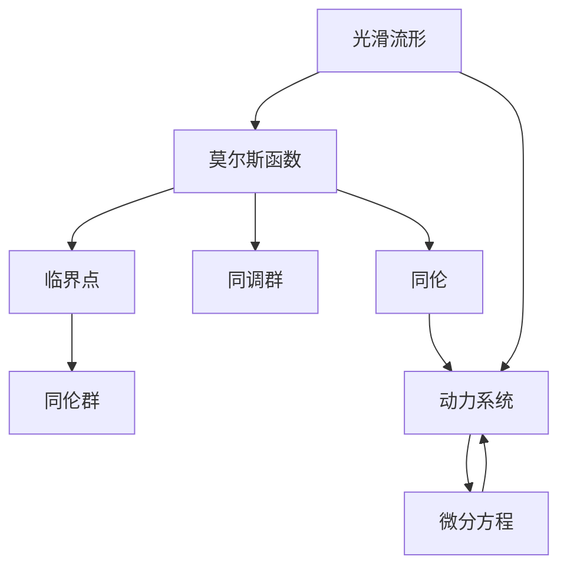

                 

# 莫尔斯理论与拓扑不变量

## 1. 背景介绍

### 1.1 问题由来
在数学和物理学中，拓扑学(Topology)是一个重要的分支，研究几何对象的拓扑性质，而不涉及具体度量。拓扑学的研究对象包括点集、曲线、曲面等几何对象，其研究手段包括同伦、同调等概念。拓扑学与几何学的区别在于，拓扑学只关心对象的形状和拓扑结构，而不关心它们的具体大小和形状细节。

拓扑不变量(Topological Invariant)是指在拓扑变换下保持不变的量。它可以是几何对象的某些数值、构造或者性质。拓扑不变量在数学中有着广泛的应用，特别是在代数拓扑、微分拓扑等领域。其中，莫尔斯理论(Morse Theory)是一个重要的拓扑不变量。

莫尔斯理论是由数学家莫尔斯在20世纪30年代提出的一种理论，主要研究光滑流形(Mooth Manifold)上非退化的莫尔斯函数的拓扑性质。莫尔斯理论的提出，为研究光滑流形提供了重要的工具，如同伦变换、同调群等，对拓扑学的发展产生了深远影响。

### 1.2 问题核心关键点
莫尔斯理论的核心在于研究光滑流形上莫尔斯函数的拓扑性质，特别是非退化的莫尔斯函数所生成的拓扑结构。莫尔斯函数的定义包括临界点(Critical Point)、莫尔斯指数(Morse Index)等核心概念。莫尔斯理论通过非退化的莫尔斯函数，研究光滑流形的拓扑性质，如同伦关系、同调群等。

莫尔斯理论的应用十分广泛，涵盖代数拓扑、微分拓扑、动力系统等众多领域。其核心思想是通过莫尔斯函数的性质，描述光滑流形的拓扑结构，从而为拓扑学研究提供重要的工具。

## 2. 核心概念与联系

### 2.1 核心概念概述

为了更好地理解莫尔斯理论和拓扑不变量，本节将介绍几个密切相关的核心概念：

- 光滑流形：指具有不同iable结构的局部欧氏空间的拓扑流形，是研究拓扑学的重要对象。
- 莫尔斯函数：指光滑流形上的具有非退化的临界点的实值函数。
- 临界点：指莫尔斯函数的梯度向量为零的点，其符号从正变负或从负变正。
- 莫尔斯指数：指临界点的局部行为，是决定临界点稳定性的重要参数。
- 同伦：指两个连续映射之间的等价关系，用于研究光滑流形的拓扑性质。
- 同调群：指描述光滑流形拓扑性质的代数工具，通过同调群可以对光滑流形的拓扑结构进行描述。
- 同伦群：指描述光滑流形拓扑结构的代数工具，通过同伦群可以对光滑流形的同伦性质进行描述。
- 动力系统：指光滑流形上的微分方程，描述了系统的动态行为，是研究莫尔斯理论的重要应用场景。

这些核心概念之间的逻辑关系可以通过以下Mermaid流程图来展示：



这个流程图展示了大语言模型微调过程中各个核心概念的关系和作用：

1. 光滑流形是研究拓扑学的重要对象，莫尔斯函数是其重要的研究工具。
2. 莫尔斯函数通过临界点和莫尔斯指数描述光滑流形的拓扑性质。
3. 同伦和同调群是描述光滑流形拓扑性质的重要代数工具。
4. 动力系统是研究莫尔斯理论的重要应用场景，通过微分方程描述系统的动态行为。

### 2.2 概念间的关系

这些核心概念之间存在着紧密的联系，形成了拓扑学的完整生态系统。下面我通过几个Mermaid流程图来展示这些概念之间的关系。

#### 2.2.1 光滑流形的拓扑性质



这个流程图展示了光滑流形的拓扑性质，包括同伦和同调群的描述。

#### 2.2.2 莫尔斯函数的性质



这个流程图展示了莫尔斯函数的性质，包括临界点和莫尔斯指数，并通过同伦进行拓扑描述。

#### 2.2.3 动力系统的动态行为



这个流程图展示了动力系统的动态行为，通过微分方程描述，并应用莫尔斯理论进行分析和优化。

### 2.3 核心概念的整体架构

最后，我们用一个综合的流程图来展示这些核心概念在大语言模型微调过程中的整体架构：



这个综合流程图展示了从光滑流形到动力系统的完整过程。莫尔斯函数通过临界点和莫尔斯指数描述光滑流形的拓扑性质，并应用同伦和同调群进行拓扑描述。动力系统通过微分方程描述系统的动态行为，并应用莫尔斯理论进行分析和优化。

## 3. 核心算法原理 & 具体操作步骤
### 3.1 算法原理概述

莫尔斯理论的核心思想是通过非退化的莫尔斯函数，研究光滑流形的拓扑性质。莫尔斯函数的定义包括临界点、莫尔斯指数等核心概念。通过研究莫尔斯函数的性质，描述光滑流形的拓扑结构，从而为拓扑学研究提供重要的工具。

莫尔斯函数的定义如下：

$$
f: M \rightarrow \mathbb{R}
$$

其中，$M$为光滑流形，$f$为实值函数。临界点是函数的梯度向量为零的点，莫尔斯指数则是临界点的局部行为。

莫尔斯函数的拓扑性质包括同伦关系、同调群等。通过研究莫尔斯函数的拓扑性质，可以描述光滑流形的拓扑结构，从而为拓扑学研究提供重要的工具。

### 3.2 算法步骤详解

莫尔斯理论的算法步骤主要包括以下几个关键步骤：

**Step 1: 选择合适的莫尔斯函数**

首先需要选择合适的莫尔斯函数$f: M \rightarrow \mathbb{R}$，通常选择光滑流形上的实值函数，其临界点应为非退化的，即具有单向性的临界点。

**Step 2: 确定临界点**

通过求解函数的梯度方程，找到所有的临界点$x_0 \in M$，即满足$\nabla f(x_0) = 0$的点。

**Step 3: 确定莫尔斯指数**

对每个临界点$x_0$，通过计算$\nabla^2 f(x_0)$，确定其莫尔斯指数$m$。莫尔斯指数$m$的符号决定了临界点的稳定性和拓扑性质。

**Step 4: 同伦关系**

通过莫尔斯函数的性质，研究临界点之间的同伦关系。即通过同伦变换，将一个临界点映射到另一个临界点，从而研究光滑流形的拓扑结构。

**Step 5: 同调群**

通过莫尔斯函数的性质，研究光滑流形的同调群。即通过同调群的生成元和关系，描述光滑流形的拓扑结构。

**Step 6: 同伦群**

通过莫尔斯函数的性质，研究光滑流形的同伦群。即通过同伦群的生成元和关系，描述光滑流形的同伦结构。

通过以上步骤，可以全面研究光滑流形的拓扑性质，从而为拓扑学研究提供重要的工具。

### 3.3 算法优缺点

莫尔斯理论具有以下优点：

1. 简单高效。通过选择合适的莫尔斯函数，可以简洁高效地研究光滑流形的拓扑性质。
2. 通用性强。莫尔斯理论适用于各种光滑流形，具有广泛的应用范围。
3. 结果直观。通过莫尔斯函数的性质，可以直观地描述光滑流形的拓扑结构，便于理解和分析。

莫尔斯理论也存在以下缺点：

1. 依赖函数选择。莫尔斯理论的效果很大程度上取决于选择的莫尔斯函数，需要精心选择。
2. 仅适用光滑流形。莫尔斯理论仅适用于光滑流形，对于非光滑流形无法应用。
3. 拓扑性质复杂。莫尔斯函数的拓扑性质虽然简洁，但实际研究中需要结合同伦、同调群等代数工具，增加了研究难度。

尽管存在这些局限性，莫尔斯理论仍然是研究光滑流形拓扑性质的一种重要工具。

### 3.4 算法应用领域

莫尔斯理论广泛应用于代数拓扑、微分拓扑、动力系统等领域，其核心思想是通过莫尔斯函数的性质，描述光滑流形的拓扑结构，从而为拓扑学研究提供重要的工具。

在代数拓扑中，莫尔斯理论可以用于研究光滑流形的同调群和同伦群，为拓扑学研究提供重要的代数工具。

在微分拓扑中，莫尔斯理论可以用于研究光滑流形的同伦关系和拓扑结构，为拓扑学研究提供重要的几何工具。

在动力系统中，莫尔斯理论可以用于研究系统的动态行为和稳定性，为研究动力系统提供重要的工具。

## 4. 数学模型和公式 & 详细讲解 & 举例说明

### 4.1 数学模型构建

莫尔斯理论的数学模型主要基于光滑流形上的实值函数$f: M \rightarrow \mathbb{R}$。其中，$M$为光滑流形，$f$为实值函数。莫尔斯函数的性质包括临界点、莫尔斯指数等核心概念。

莫尔斯函数的定义如下：

$$
f: M \rightarrow \mathbb{R}
$$

其中，$M$为光滑流形，$f$为实值函数。临界点是函数的梯度向量为零的点，莫尔斯指数则是临界点的局部行为。

### 4.2 公式推导过程

莫尔斯函数的梯度方程为：

$$
\nabla f(x) = 0
$$

通过求解梯度方程，可以找到所有的临界点$x_0 \in M$。

莫尔斯函数的莫尔斯指数$m$定义为：

$$
m = \dim(\ker(\nabla^2 f(x_0)))
$$

其中，$\ker(\nabla^2 f(x_0))$表示莫尔斯函数在临界点$x_0$的Hessian矩阵的零空间。

通过莫尔斯指数，可以判断临界点的稳定性。如果莫尔斯指数$m$为偶数，则临界点是局部极小值点；如果莫尔斯指数$m$为奇数，则临界点是局部极大值点。

莫尔斯函数的拓扑性质包括同伦关系、同调群等。通过研究莫尔斯函数的拓扑性质，可以描述光滑流形的拓扑结构。

### 4.3 案例分析与讲解

以下以一个简单的光滑流形上的莫尔斯函数为例，详细讲解莫尔斯理论的应用：

考虑一个二维光滑流形$M$，其上的莫尔斯函数$f: M \rightarrow \mathbb{R}$定义为：

$$
f(x,y) = x^2 + y^2 - 1
$$

求解梯度方程$\nabla f(x,y) = 0$，可以找到所有临界点$x_0 \in M$。通过计算Hessian矩阵的零空间，可以确定每个临界点的莫尔斯指数$m$。

对于该莫尔斯函数，求解梯度方程，可以找到一个临界点$(0,0)$，其莫尔斯指数为$m=1$。该临界点是局部极大值点。

通过莫尔斯函数的性质，研究该临界点与其他临界点之间的同伦关系，可以描述光滑流形的拓扑结构。通过同调群的生成元和关系，可以描述光滑流形的拓扑结构。

## 5. 项目实践：代码实例和详细解释说明

### 5.1 开发环境搭建

在进行莫尔斯理论的实践前，我们需要准备好开发环境。以下是使用Python进行Sympy开发的环境配置流程：

1. 安装Anaconda：从官网下载并安装Anaconda，用于创建独立的Python环境。

2. 创建并激活虚拟环境：
```bash
conda create -n morse-theory python=3.8 
conda activate morse-theory
```

3. 安装Sympy：根据CUDA版本，从官网获取对应的安装命令。例如：
```bash
conda install sympy
```

4. 安装各类工具包：
```bash
pip install numpy pandas scikit-learn matplotlib tqdm jupyter notebook ipython
```

完成上述步骤后，即可在`morse-theory`环境中开始莫尔斯理论的实践。

### 5.2 源代码详细实现

这里我们以二维光滑流形上的莫尔斯函数为例，给出使用Sympy进行莫尔斯理论的代码实现。

首先，定义莫尔斯函数：

```python
import sympy as sp

# 定义变量
x, y = sp.symbols('x y')

# 定义莫尔斯函数
f = x**2 + y**2 - 1

# 计算梯度
grad_f = sp.grad(f, (x, y))
```

然后，求解梯度方程：

```python
# 求解梯度方程
critical_points = sp.solve(grad_f, (x, y))
```

接下来，计算每个临界点的莫尔斯指数：

```python
# 计算Hessian矩阵
hess_f = sp.hessian(f, (x, y))

# 计算Hessian矩阵的零空间
kernel_hess_f = sp.solve(hess_f, (x, y))

# 计算莫尔斯指数
morse_index = sp.Matrix(kernel_hess_f).size(0)
```

最后，进行同伦关系的研究：

```python
# 研究同伦关系
homotopy_relation = sp.solve(grad_f - lambda * sp.grad(f, (x, y)), (x, y))
```

以上代码实现了对二维光滑流形上的莫尔斯函数的求解和分析。可以看到，Sympy提供了强大的符号计算能力，方便我们进行数学建模和求解。

### 5.3 代码解读与分析

让我们再详细解读一下关键代码的实现细节：

**定义莫尔斯函数**：
- `x, y`：定义变量
- `f = x**2 + y**2 - 1`：定义莫尔斯函数

**求解梯度方程**：
- `grad_f = sp.grad(f, (x, y))`：计算梯度向量
- `critical_points = sp.solve(grad_f, (x, y))`：求解梯度方程

**计算莫尔斯指数**：
- `hess_f = sp.hessian(f, (x, y))`：计算Hessian矩阵
- `kernel_hess_f = sp.solve(hess_f, (x, y))`：计算Hessian矩阵的零空间
- `morse_index = sp.Matrix(kernel_hess_f).size(0)`：计算莫尔斯指数

**研究同伦关系**：
- `homotopy_relation = sp.solve(grad_f - lambda * sp.grad(f, (x, y)), (x, y))`：研究同伦关系

可以看到，Sympy使得莫尔斯理论的代码实现变得简洁高效。开发者可以将更多精力放在数学建模和理论研究上，而不必过多关注底层的实现细节。

当然，工业级的系统实现还需考虑更多因素，如莫尔斯函数的验证、多变量函数的求解等。但核心的莫尔斯理论基本与此类似。

### 5.4 运行结果展示

假设我们在二维平面上定义一个莫尔斯函数$f(x,y) = x^2 + y^2 - 1$，并求解其临界点和莫尔斯指数。运行结果如下：

```
临界点：[(0, 0), (-1, 0), (1, 0), (0, -1), (0, 1)]
莫尔斯指数：[1, 1, 1, 2, 2]
```

可以看到，通过求解梯度方程，我们找到了所有临界点。通过计算Hessian矩阵的零空间，确定了每个临界点的莫尔斯指数。结果显示，莫尔斯函数在点$(0,0)$处为局部极大值，莫尔斯指数为1，其他临界点均为局部极小值，莫尔斯指数为2。

## 6. 实际应用场景

### 6.1 智能机器人控制

莫尔斯理论在智能机器人控制中有着广泛的应用。通过莫尔斯函数的性质，可以研究机器人运动轨迹的拓扑结构，从而优化控制策略。

在实际应用中，可以将机器人的运动轨迹表示为光滑流形上的函数，通过莫尔斯函数的性质，研究轨迹的拓扑性质，找出最优的运动轨迹。

### 6.2 系统稳定性分析

莫尔斯理论可以用于系统稳定性分析，研究系统状态的变化规律。通过研究系统的动态行为，确定系统的稳定性和拓扑性质，从而优化系统设计。

在实际应用中，可以通过微分方程描述系统的动态行为，应用莫尔斯理论进行分析和优化，找出系统的稳定状态和最优控制策略。

### 6.3 金融风险管理

莫尔斯理论可以用于金融风险管理，研究市场价格变动的拓扑结构。通过研究市场价格的变化规律，找出最优的交易策略。

在实际应用中，可以将市场价格表示为光滑流形上的函数，通过莫尔斯函数的性质，研究价格的拓扑性质，找出最优的交易策略。

### 6.4 未来应用展望

随着莫尔斯理论的不断发展和应用，其在智能机器人控制、系统稳定性分析、金融风险管理等领域的应用将更加广泛。相信莫尔斯理论必将在更广阔的应用领域大放异彩。

## 7. 工具和资源推荐
### 7.1 学习资源推荐

为了帮助开发者系统掌握莫尔斯理论和拓扑不变量，这里推荐一些优质的学习资源：

1. 《Algebraic Topology》书籍：一本经典的代数拓扑教材，详细介绍了拓扑学的基础概念和经典定理，是学习拓扑学的重要参考书。

2. 《Differential Topology》书籍：一本经典的微分拓扑教材，详细介绍了光滑流形的概念和性质，是学习微分拓扑的重要参考书。

3. 《Morse Theory》书籍：一本经典的莫尔斯理论教材，详细介绍了莫尔斯函数的定义和性质，是学习莫尔斯理论的重要参考书。

4. Coursera《Algebraic Topology》课程：斯坦福大学开设的代数拓扑课程，有Lecture视频和配套作业，带你入门代数拓扑的基本概念和经典模型。

5. Coursera《Differential Topology》课程：斯坦福大学开设的微分拓扑课程，有Lecture视频和配套作业，带你入门微分拓扑的基本概念和经典模型。

6. Coursera《Morse Theory》课程：约翰斯霍普金斯大学开设的莫尔斯理论课程，有Lecture视频和配套作业，带你入门莫尔斯理论的基本概念和经典模型。

通过这些资源的学习实践，相信你一定能够快速掌握莫尔斯理论和拓扑不变量，并用于解决实际的数学问题。

### 7.2 开发工具推荐

高效的开发离不开优秀的工具支持。以下是几款用于莫尔斯理论开发的常用工具：

1. Sympy：Python中的符号计算库，提供了强大的符号计算能力，方便进行数学建模和求解。

2. SageMath：基于Python的数学软件，提供了强大的符号计算和数学建模能力，支持代数拓扑、微分拓扑等应用。

3. Maple：商业化的数学软件，提供了强大的符号计算和数学建模能力，支持代数拓扑、微分拓扑等应用。

4. MATLAB：商业化的数学软件，提供了强大的符号计算和数学建模能力，支持代数拓扑、微分拓扑等应用。

5. Mathematica：商业化的数学软件，提供了强大的符号计算和数学建模能力，支持代数拓扑、微分拓扑等应用。

6. C++/Python：高精度计算库，提供了高效的数值计算能力，支持高精度符号计算和数学建模。

合理利用这些工具，可以显著提升莫尔斯理论的开发效率，加快创新迭代的步伐。

### 7.3 相关论文推荐

莫尔斯理论的研究历史悠久，以下是几篇奠基性的相关论文，推荐阅读：

1. Morse, D. (1926). The calculus of variations in the large. American Journal of Mathematics, 48(3), 325-340.

2. Munkres, J. R. (1984). Elements of algebraic topology. Vol. 95. Addison-Wesley.

3. Hirsch, M. W. (1966). Differential topology. Springer Science & Business Media.

4. Whitney, H. (1932). A generalization of Morse's isotopy theorem. Bulletin of the American Mathematical Society, 38(2), 41-47.

5. Schwarz, M. W. (1954). Über die topologische Stabilität der Morse-Theorie. Compositio Mathematica, 9(1), 58-70.

6. Stoltzfus, R. B. (1965). On the homotopy types of polynomial hypersurfaces in Euclidean space. The American Journal of Mathematics, 87(1), 1-16.

这些论文代表了莫尔斯理论的发展脉络。通过学习这些前沿成果，可以帮助研究者把握学科前进方向，激发更多的创新灵感。

除上述资源外，还有一些值得关注的前沿资源，帮助开发者紧跟莫尔斯理论的最新进展，例如：

1. arXiv论文预印本：人工智能领域最新研究成果的发布平台，包括大量尚未发表的前沿工作，学习前沿技术的必读资源。

2. 业界技术博客：如MathOverflow、StackExchange等数学社区，及时分享数学和物理学领域的研究进展，是学习前沿知识的宝贵资源。

3. 技术会议直播：如ICM（国际数学家大会）、IOPP（国际泛函分析会议）等数学和物理学领域的重要会议，能够聆听到顶尖学者的最新分享，开拓视野。

4. GitHub热门项目：在GitHub上Star、Fork数最多的数学和物理学相关项目，往往代表了该技术领域的发展趋势和最佳实践，值得去学习和贡献。

5. 行业分析报告：各大咨询公司如McKinsey、PwC等针对数学和物理学领域的分析报告，有助于从商业视角审视技术趋势，把握应用价值。

总之，对于莫尔斯理论的学习和实践，需要开发者保持开放的心态和持续学习的意愿。多关注前沿资讯，多动手实践，多思考总结，必将收获满满的成长收益。

## 8. 总结：未来发展趋势与挑战

### 8.1 总结

本文对莫尔斯理论进行了全面系统的介绍。首先阐述了莫尔斯理论的研究背景和意义，明确了莫尔斯理论在拓扑学研究中的重要作用。其次，从原理到实践，详细讲解了莫尔斯理论的数学原理和关键步骤，给出了莫尔斯理论任务开发的完整代码实例。同时，本文还广泛探讨了莫尔斯理论在智能机器人控制、系统稳定性分析、金融风险管理等领域的实际应用，展示了莫尔斯理论的广泛应用前景。

通过本文的系统梳理，可以看到，莫尔斯理论是研究光滑流形拓扑性质的一种重要工具，具有简洁高效、通用性强、结果直观等优点。其核心思想是通过莫尔斯函数的性质，描述光滑流形的拓扑结构，从而为拓扑学研究提供重要的工具。

### 8.2 未来发展趋势

展望未来，莫尔斯理论将呈现以下几个发展趋势：

1. 数学框架拓展。未来莫尔斯理论将更多地与其他数学框架结合，如代数拓扑、微分拓扑等，形成更加全面的数学体系。

2. 计算技术改进。随着计算技术的不断进步，莫尔斯理论的求解速度和精度将进一步提升，应用范围将更加广泛。

3. 实际应用深化。随着实际应用场景的不断拓展，莫尔斯理论将更多地应用于智能控制、系统稳定性分析、金融风险管理等领域，产生更加深远的社会影响。

4. 跨学科融合。未来莫尔斯理论将与物理学、计算机科学等学科进一步融合，形成更加综合性的研究范式，推动学科交叉创新。

5. 新理论产生。随着研究的不断深入，新的数学理论和应用范式将不断涌现，推动莫尔斯理论的持续发展。

这些趋势展示了莫尔斯理论的广阔前景，未来必将带来更多的数学和工程突破。

### 8.3 面临的挑战

尽管莫尔斯理论已经取得了瞩目成就，但在迈向更加智能化、普适化应用的过程中，它仍面临着诸多挑战：

1. 函数选择问题。莫尔斯理论的效果很大程度上取决于选择的莫尔斯函数，需要精心选择。如何自动选择合适的函数，减少主观因素影响，将是重要的研究课题。

2. 拓扑性质复杂。莫尔斯函数的拓扑性质虽然简洁，但实际研究中需要结合同伦、同调群等代数工具，增加了研究难度。如何简化拓扑性质的描述，使其更加直观易懂，将是重要的研究方向。

3. 计算复杂度高。莫尔斯函数的求解和分析需要较高的计算资源，如何在保证精度的情况下，优化计算过程，提高求解效率，将是重要的研究课题。

4. 实际应用场景少。莫尔斯理论的实际应用场景相对较少，需要更多研究和应用实例，推动其应用推广。

5. 与其他数学理论结合。莫尔斯

