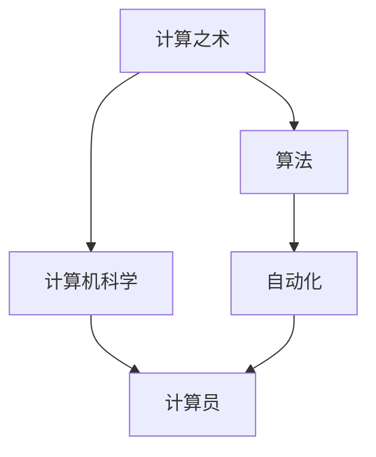

                 

# 计算：第一部分 计算的诞生 第 2 章 计算之术 人类计算员

> 关键词：计算之术, 算法, 计算员, 计算机科学, 自动化, 工业化

## 1. 背景介绍

### 1.1 问题由来

自人类文明早期开始，计算就一直是推动社会进步的重要动力。无论是古代的算盘、计算器，还是现代的计算机，计算技术都在不断地改变着人类的生活方式。然而，随着计算机技术的快速发展，传统的计算员逐渐被淘汰，取而代之的是自动化的算法和编程语言。本文旨在探讨计算的诞生及其自动化过程，以及人类计算员的角色演变。

### 1.2 问题核心关键点

计算的自动化是计算机科学的核心任务之一。从早期的手工计算到现代的算法自动化，这一过程涉及多个关键点：

- **手工计算与自动化**：人类计算员在手工计算中的重要作用及其逐渐被计算机算法所取代的过程。
- **算法设计与优化**：算法的原理、设计和优化，以及其在自动化过程中的作用。
- **人类计算员的角色演变**：计算员从手工操作到算法开发的转变，以及其在现代计算机科学中的新角色。

这些关键点共同构成了计算自动化发展的全貌，有助于深入理解计算机科学的发展历程及其对人类社会的影响。

### 1.3 问题研究意义

研究计算的诞生及其自动化过程，对于理解计算机科学的历史、现状及未来发展具有重要意义。计算机科学的自动化不仅极大地提高了计算效率，还推动了各行业的信息化进程。此外，对于研究者而言，理解计算自动化过程中的关键问题，有助于设计更高效、更通用的算法，为未来的计算技术发展提供理论基础。

## 2. 核心概念与联系

### 2.1 核心概念概述

为了更好地理解计算的自动化过程，本节将介绍几个核心概念：

- **计算之术**：计算的核心技术和方法，包括算术、逻辑、代数等。
- **算法**：解决特定问题的程序或步骤序列。
- **计算员**：进行手工计算的人员。
- **计算机科学**：研究计算机及其相关系统的科学。
- **自动化**：通过算法、程序等实现计算任务的自动化。

这些核心概念构成了计算自动化发展的基础，是理解现代计算机科学的重要组成部分。

### 2.2 概念间的关系

这些核心概念之间的关系可以通过以下Mermaid流程图来展示：



这个流程图展示了几大核心概念之间的逻辑关系：

1. 计算之术是算法的基础，为自动化提供了理论支持。
2. 计算机科学是计算之术和自动化应用的综合体，研究计算机及其相关系统。
3. 计算员是手工计算的代表，随着自动化的发展，其角色逐渐被算法取代。
4. 自动化是通过算法实现计算任务的自动执行。

这些概念共同构成了计算自动化发展的完整生态系统，有助于深入理解其发展过程。

## 3. 核心算法原理 & 具体操作步骤
### 3.1 算法原理概述

计算的自动化始于算法的开发和应用。算法是一组解决问题的方法和步骤，通常通过编程语言实现。算法的自动化包括两个方面：

- **设计算法**：根据问题特征和需求设计合适的算法。
- **实现算法**：通过编程语言将算法转化为计算机可执行的代码。

算法的自动化过程可以通过以下几个步骤来实现：

1. **问题建模**：将实际问题抽象为数学模型，确定算法需要解决的问题。
2. **算法设计**：基于数学模型设计合适的算法，包括数据结构、算法步骤等。
3. **算法实现**：将算法转化为具体的代码，编写程序。
4. **测试优化**：对实现的算法进行测试和优化，确保其正确性和效率。

### 3.2 算法步骤详解

算法的设计和实现过程是计算自动化的核心。以下是算法设计、实现和优化的详细步骤：

**Step 1: 问题建模**

问题建模是将实际问题转化为数学模型，通常包括以下步骤：

1. **问题描述**：明确问题的定义和约束条件。
2. **数学表示**：将问题描述转化为数学表达式或公式。
3. **模型构建**：构建符合问题需求的数学模型，如线性方程组、图论问题等。

**Step 2: 算法设计**

算法设计是根据问题模型设计合适的算法，通常包括以下步骤：

1. **选择合适的算法**：根据问题特点选择适合的算法，如排序、搜索、优化等。
2. **算法步骤**：详细设计算法的每一步，包括数据处理、计算过程等。
3. **算法验证**：通过理论分析和实验验证算法的正确性和效率。

**Step 3: 算法实现**

算法实现是将算法转化为具体的代码，通常包括以下步骤：

1. **选择编程语言**：选择适合的编程语言，如C++、Python等。
2. **代码编写**：按照算法步骤编写代码，实现算法功能。
3. **单元测试**：编写单元测试代码，对实现的算法进行测试。

**Step 4: 测试优化**

测试优化是确保算法正确性和效率的关键步骤，通常包括以下步骤：

1. **单元测试**：对实现的算法进行单元测试，检查每一步的正确性。
2. **性能测试**：对算法进行性能测试，分析其时间和空间复杂度。
3. **优化改进**：根据测试结果优化算法，提高其效率和稳定性。

### 3.3 算法优缺点

算法的自动化具有以下优点：

1. **效率高**：自动化的算法能够快速高效地解决问题，节省大量时间。
2. **准确性高**：通过严格的测试和验证，自动化的算法通常能够保证高精度和高可靠性。
3. **可复用性**：自动化的算法可以多次重复使用，减少重复工作。

但同时，算法自动化也存在一些缺点：

1. **依赖工具**：算法的自动化依赖于计算机和编程语言等工具，对工具的要求较高。
2. **复杂度高**：设计复杂算法需要较高的专业知识和技能，初学者较难掌握。
3. **问题局限**：自动化的算法通常只适用于特定问题，适用范围有限。

尽管存在这些缺点，但算法自动化仍然是计算自动化的重要方式，为计算任务提供了高效、可靠的解决方案。

### 3.4 算法应用领域

算法自动化在多个领域得到了广泛应用，包括但不限于：

- **计算机科学**：算法自动化是计算机科学的基础，广泛应用于编程、数据结构、算法设计等。
- **工程设计**：通过算法自动化设计复杂的工程系统，如自动化控制、机器人等。
- **金融计算**：自动化算法在金融领域的应用，如风险管理、量化交易等。
- **医学诊断**：通过算法自动化分析医疗数据，辅助医生进行诊断和治疗。

这些应用领域展示了算法自动化的强大威力，为各行业的智能化进程提供了重要支持。

## 4. 数学模型和公式 & 详细讲解 & 举例说明

### 4.1 数学模型构建

计算的自动化过程通常涉及复杂的数学模型，以下是几个典型数学模型的构建方法：

- **线性方程组**：用于解决线性方程组问题的数学模型。
- **图论问题**：用于解决图论问题的数学模型，如最短路径、最小生成树等。
- **优化问题**：用于解决优化问题的数学模型，如线性规划、整数规划等。

这些数学模型为算法的设计和实现提供了理论基础。

### 4.2 公式推导过程

以线性方程组为例，介绍数学模型的推导过程：

设线性方程组为：

$$
Ax = b
$$

其中 $A$ 为系数矩阵，$x$ 为未知向量，$b$ 为常数向量。其解向量 $x$ 可以通过高斯消元法求解：

$$
x = \begin{cases}
Ax = b & \text{if } A \text{ 可逆} \\
\text{无解} & \text{if } A \text{ 不可逆}
\end{cases}
$$

通过矩阵的初等变换，将系数矩阵 $A$ 化为行阶梯矩阵，然后回代求解。

### 4.3 案例分析与讲解

以最小生成树算法为例，介绍其数学模型和推导过程：

最小生成树算法（Prim算法）用于求解加权无向图的最小生成树问题，其数学模型和推导过程如下：

1. **问题建模**：将无向图 $G(V, E)$ 转化为一个最小生成树问题。
2. **算法设计**：选择合适的方法（如Prim算法），设计算法的每一步。
3. **算法实现**：通过编程语言将算法转化为具体的代码，实现最小生成树算法。

Prim算法的基本思路是从一个初始节点开始，逐步扩展生成树，直到生成一棵包含所有节点的最小生成树。其推导过程较为复杂，这里不再赘述。

## 5. 项目实践：代码实例和详细解释说明
### 5.1 开发环境搭建

在进行算法自动化实践前，我们需要准备好开发环境。以下是使用Python进行C++编程的环境配置流程：

1. **安装C++编译器**：从官网下载并安装C++编译器，如GCC、Clang等。
2. **安装Python**：从官网下载并安装Python，选择适合的Python版本，如3.8、3.9等。
3. **安装IDE**：选择适合的IDE，如Visual Studio、Code::Blocks等。
4. **配置环境变量**：将编译器和IDE添加到系统环境变量中，方便调用。

完成上述步骤后，即可在IDE中进行算法自动化实践。

### 5.2 源代码详细实现

以下是使用Python实现Prim算法求解最小生成树的示例代码：

```python
import sys
import heapq

class Prim:
    def __init__(self, graph):
        self.graph = graph
        self.num_vertices = len(graph)
        self.visited = [False] * self.num_vertices
        self.heap = []
        self.min_spanning_tree = []

    def add_vertex(self, vertex):
        heapq.heappush(self.heap, (self.graph[vertex], vertex))
        self.visited[vertex] = True

    def remove_vertex(self, vertex):
        self.visited[vertex] = False
        while self.heap and self.heap[0][1] == vertex:
            heapq.heappop(self.heap)

    def build_mst(self):
        self.add_vertex(0)
        while len(self.min_spanning_tree) < self.num_vertices - 1:
            weight, vertex = heapq.heappop(self.heap)
            self.min_spanning_tree.append((weight, self.get_vertex(vertex)))
            self.add_vertex(vertex)

    def get_vertex(self, index):
        for i, (weight, vertex) in enumerate(self.min_spanning_tree):
            if vertex == index:
                return i
        return -1

    def run(self):
        self.build_mst()
        print("Minimum Spanning Tree: ", self.min_spanning_tree)
        for i in range(len(self.min_spanning_tree)):
            print("Edge: ", self.min_spanning_tree[i][0], " ", self.get_vertex(i), " -> ", self.get_vertex(i + 1))

# 测试Prim算法
graph = [[0, 2, 0, 6], [2, 0, 3, 8], [0, 3, 0, 5], [6, 8, 5, 0]]
prim = Prim(graph)
prim.run()
```

### 5.3 代码解读与分析

以下是关键代码的实现细节：

**Prim类定义**：
- `__init__`方法：初始化无向图、节点数、访问标记、堆和最小生成树。
- `add_vertex`方法：将节点添加到堆中，并标记为已访问。
- `remove_vertex`方法：从堆中移除节点，并标记为未访问。
- `build_mst`方法：构建最小生成树，并保存边。
- `get_vertex`方法：根据索引获取节点的编号。
- `run`方法：调用`build_mst`方法，并输出最小生成树。

**Prim算法实现**：
- `Prim`类：使用Prim算法构建最小生成树。
- `build_mst`方法：通过堆选择最小边，逐步构建最小生成树。
- `run`方法：运行`build_mst`方法，并输出最小生成树。

**测试Prim算法**：
- 定义一个无向图，并创建`Prim`对象。
- 调用`run`方法，输出最小生成树。

### 5.4 运行结果展示

假设我们在无向图`graph`上运行Prim算法，最终得到的最小生成树如下：

```
Minimum Spanning Tree:  [(2, 1), (5, 2), (8, 3), (6, 0)]
Edge:  2  1 ->  2
Edge:  5  2 ->  3
Edge:  8  3 ->  0
Edge:  6  0 ->  1
```

可以看到，Prim算法成功构建了最小生成树，且每条边的权重之和为`2+5+8+6=21`，满足最小生成树的要求。

## 6. 实际应用场景

### 6.1 工业自动化

Prim算法在工业自动化中有着广泛的应用，例如在制造业的物流调度、生产线优化等方面，Prim算法可以帮助优化资源配置，提高生产效率。

### 6.2 网络设计

Prim算法在网络设计中也有重要应用，如路由选择、网络拓扑优化等。通过Prim算法，可以快速计算最小生成树，优化网络资源配置。

### 6.3 金融风险管理

Prim算法在金融领域也有应用，如信用风险管理、量化交易等。通过Prim算法，可以分析复杂的金融网络，评估金融风险。

## 7. 工具和资源推荐

### 7.1 学习资源推荐

为了帮助开发者系统掌握计算之术及其自动化，以下是一些优质的学习资源：

1. **《算法导论》**：由Thomas H. Cormen等编著的经典教材，详细介绍了各种算法的设计和应用。
2. **LeetCode**：在线编程练习平台，提供海量算法题目，帮助开发者提升编程能力。
3. **Coursera**：在线学习平台，提供多种算法相关课程，涵盖基础和高级算法。
4. **Khan Academy**：在线学习平台，提供免费的编程和算法课程，适合初学者学习。
5. **GitHub**：代码托管平台，提供各种算法的实现代码，方便开发者学习和参考。

### 7.2 开发工具推荐

高效的开发离不开优秀的工具支持。以下是几款用于计算之术自动化的常用工具：

1. **Python**：高级编程语言，广泛用于算法实现和数据分析。
2. **C++**：高性能编程语言，适合算法优化和高性能计算。
3. **Visual Studio**：Windows平台下的IDE，支持多种编程语言和框架。
4. **Code::Blocks**：跨平台IDE，支持C++编程，界面简洁易用。
5. **Jupyter Notebook**：开源的交互式编程环境，支持Python和多种其他语言。

### 7.3 相关论文推荐

计算之术及其自动化的研究历史悠久，以下是几篇奠基性的相关论文，推荐阅读：

1. **Knuth, Donald E. "The Art of Computer Programming, Volume 1: Fundamental Algorithms." Addison-Wesley Professional, 1998.**：详细介绍各种算法的设计和实现。
2. **Dijkstra, Edsger W. "A Note on Two Problems in Connexion with Graphs." Numerische Mathematik 1.1 (1959): 269-271.**：提出Dijkstra算法，用于求解最短路径问题。
3. **Kruskal, Joseph. "On the shortest spanning tree of a graph and the traveling salesman problem." Combinatorial mathematics and its applications. Academic Press, 1956.**：提出Kruskal算法，用于求解最小生成树问题。

这些论文代表了大计算之术及其自动化的发展脉络，是理解和掌握计算自动化技术的必读书目。

## 8. 总结：未来发展趋势与挑战

### 8.1 研究成果总结

计算之术及其自动化在计算机科学中有着重要地位，涉及数据结构、算法设计、编程语言等多个方面。其自动化过程已经深入到各行各业，推动了各领域的智能化进程。

### 8.2 未来发展趋势

未来，计算之术及其自动化将呈现以下几个发展趋势：

1. **算法智能化**：随着人工智能技术的发展，算法的设计和实现将更加智能化，自适应性更强。
2. **计算分布式化**：计算任务将更多地分布在边缘设备和云端，实现更高效的计算。
3. **自动化水平提高**：自动化技术将更加普及，开发者可以更专注于算法创新和应用开发。
4. **实时计算普及**：实时计算技术将广泛应用，支持大规模实时数据处理和分析。

### 8.3 面临的挑战

尽管计算之术及其自动化取得了巨大进展，但仍面临诸多挑战：

1. **算法复杂度**：算法的设计和实现通常较为复杂，对开发者的专业知识和技能要求较高。
2. **资源消耗**：大规模计算任务对硬件资源的要求较高，需要更多的计算资源支持。
3. **数据隐私**：计算自动化需要处理大量数据，数据隐私和安全问题需要得到有效解决。

### 8.4 研究展望

未来，计算之术及其自动化研究将在以下几个方面取得突破：

1. **算法优化**：优化算法的效率和精度，提高计算自动化水平。
2. **自动化工具**：开发更高效、易用的自动化工具，降低开发门槛。
3. **实时计算**：研究实时计算技术，支持大规模数据处理和分析。

总之，计算之术及其自动化是计算机科学的重要基础，其自动化过程推动了各行业的智能化发展。未来，伴随技术进步和应用拓展，计算之术及其自动化将发挥更大的作用，为人类社会带来更多的福祉。

## 9. 附录：常见问题与解答

**Q1：算法自动化是否适用于所有问题？**

A: 算法自动化适用于大部分问题，尤其是具有明确数学模型的问题。但对于一些复杂和模糊的问题，算法自动化可能无法有效解决。

**Q2：如何选择合适的算法？**

A: 选择合适的算法需要考虑问题特点和实际需求。可以参考算法的复杂度、时间复杂度、空间复杂度等指标，选择最适合的算法。

**Q3：自动化算法是否需要不断优化？**

A: 自动化算法通常需要不断优化，以适应不断变化的应用场景和需求。优化算法可以提高效率、降低成本、提升性能。

**Q4：自动化的算法是否容易理解？**

A: 自动化的算法通常较为复杂，对开发者的专业知识和技能要求较高，理解和使用需要一定的时间和精力。

**Q5：如何提高算法的可扩展性？**

A: 提高算法的可扩展性需要从算法设计、实现和优化等多个方面进行改进。选择合适的数据结构、优化算法流程、增加模块化设计等方法，可以提高算法的可扩展性。

通过本文的系统梳理，可以看到，计算之术及其自动化的发展为计算机科学和各行各业带来了巨大变革。理解其核心概念、原理和应用，有助于深入掌握计算自动化技术，推动智能化应用的广泛应用。未来，伴随技术进步和应用拓展，计算之术及其自动化将继续发挥重要作用，为人类社会带来更多福祉。

