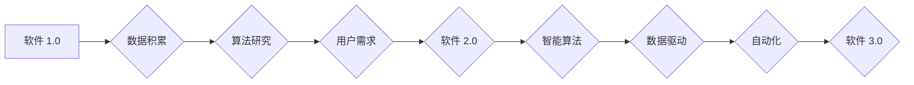

# 软件 2.0 的应用场景：自动驾驶、医疗诊断

> 关键词：软件 2.0，自动驾驶，医疗诊断，智能算法，数据驱动，人机协同

## 1. 背景介绍

随着信息技术的飞速发展，软件行业已经进入了软件 2.0 时代。软件 2.0 强调以用户为中心，通过数据驱动和智能算法，实现软件系统的智能化、个性化和自动化。在这一时代，软件不再仅仅是信息处理的工具，而是成为推动产业变革和社会进步的重要力量。

自动驾驶和医疗诊断是软件 2.0 时代的两个重要应用场景，它们分别代表了交通运输和生命健康领域的未来发展方向。本文将深入探讨软件 2.0 在这两个领域的应用，分析其核心算法原理、操作步骤，并展望未来发展趋势。

## 2. 核心概念与联系

### 2.1 软件概念演变

从软件 1.0 到软件 2.0，软件的概念经历了以下几个阶段：

- 软件 1.0：以功能为导向，注重软件的基本功能实现，如文字处理、表格处理等。
- 软件 2.0：以用户为中心，注重用户体验和个性化服务，如社交网络、在线购物等。
- 软件 3.0：以数据驱动和智能算法为核心，实现软件系统的智能化和自动化，如自动驾驶、智能诊断等。

### 2.2 Mermaid 流程图

以下为软件 2.0 发展过程的 Mermaid 流程图：



### 2.3 软件概念联系

软件 1.0 是软件 2.0 和 3.0 的基础，而软件 2.0 和 3.0 则是软件 1.0 的发展方向。在软件 2.0 时代，数据积累和算法研究成为推动软件发展的重要驱动力。软件 2.0 时代的软件系统更加注重用户体验和个性化服务，而软件 3.0 则强调智能化、自动化和跨界融合。

## 3. 核心算法原理 & 具体操作步骤

### 3.1 算法原理概述

自动驾驶和医疗诊断领域都涉及到复杂的数据处理和智能决策，其核心算法原理如下：

- **自动驾驶**：基于机器学习、计算机视觉、深度学习等技术，实现对车辆环境的感知、决策和控制。
- **医疗诊断**：基于机器学习、深度学习、自然语言处理等技术，实现对病例数据的分析和诊断。

### 3.2 算法步骤详解

#### 3.2.1 自动驾驶

1. **感知**：通过摄像头、雷达、激光雷达等传感器收集车辆周围环境信息。
2. **定位**：利用GPS、IMU等设备确定车辆位置和姿态。
3. **决策**：根据感知和定位信息，结合交通规则和驾驶经验，确定车辆的行驶策略。
4. **控制**：控制车辆执行决策，包括加速、减速、转向等。

#### 3.2.2 医疗诊断

1. **数据收集**：收集病例数据，包括病历、影像资料、实验室检测结果等。
2. **数据预处理**：对收集到的数据进行清洗、标注和标准化处理。
3. **模型训练**：利用机器学习、深度学习等技术，训练分类或回归模型。
4. **病例分析**：将新病例数据输入模型，进行诊断预测。

### 3.3 算法优缺点

#### 自动驾驶

- **优点**：提高道路安全，降低交通拥堵，提高运输效率。
- **缺点**：技术难度高，成本高，法律法规尚不完善。

#### 医疗诊断

- **优点**：提高诊断效率，降低误诊率，减轻医生负担。
- **缺点**：算法性能受限于数据质量和标注，存在一定风险。

### 3.4 算法应用领域

- **自动驾驶**：乘用车、商用车、无人配送等。
- **医疗诊断**：影像诊断、病理诊断、基因诊断等。

## 4. 数学模型和公式 & 详细讲解 & 举例说明

### 4.1 数学模型构建

#### 4.1.1 自动驾驶

自动驾驶中的感知、定位、决策和控制等环节，都涉及到数学模型的构建。以下为部分数学模型：

- **感知**：感知算法通常采用卷积神经网络(Convolutional Neural Network, CNN)进行图像识别和处理。
- **定位**：定位算法通常采用卡尔曼滤波(Kalman Filter, Kalman)进行状态估计。
- **决策**：决策算法通常采用强化学习(Reinforcement Learning, RL)进行策略学习。

#### 4.1.2 医疗诊断

医疗诊断中的数学模型主要包括：

- **特征提取**：利用深度学习(Deep Learning, DL)从病例数据中提取特征。
- **分类/回归**：利用机器学习(ML)和深度学习(DL)进行分类或回归预测。

### 4.2 公式推导过程

#### 4.2.1 自动驾驶

- **感知**：CNN模型公式：
  $$
  \hat{y} = f(\hat{x})
  $$
  其中，$\hat{y}$ 为模型输出，$\hat{x}$ 为输入图像。

- **定位**：卡尔曼滤波公式：
  $$
  x_{k|k-1} = F_{k|k-1}x_{k-1|k-1} + B_ku_k
  $$
  $$
  P_{k|k} = F_{k|k-1}P_{k-1|k-1}F_{k|k-1}^T + Q_k
  $$
  $$
  K_k = P_{k|k-1}F_{k|k-1}^TP_{k|k-1}F_{k|k-1}^T + R_k
  $$
  $$
  y_k = H_kx_k + v_k
  $$
  $$
  x_k = x_{k|k-1} + K_k(y_k - H_kx_{k|k-1})
  $$
  $$
  P_{k|k} = (I - K_kH_k)P_{k|k-1}
  $$
  其中，$F_{k|k-1}$ 为状态转移矩阵，$B_k$ 为控制输入矩阵，$u_k$ 为控制输入，$P_{k|k-1}$ 为先验状态估计误差协方差矩阵，$Q_k$ 为过程噪声协方差矩阵，$K_k$ 为卡尔曼增益，$H_k$ 为观测矩阵，$y_k$ 为观测值，$v_k$ 为观测噪声，$x_k$ 为当前状态估计值，$P_{k|k}$ 为当前状态估计误差协方差矩阵。

- **决策**：强化学习价值函数公式：
  $$
  V(s) = \sum_{k=1}^{\infty} \gamma^k Q(s,a)
  $$
  其中，$s$ 为状态，$a$ 为动作，$Q(s,a)$ 为状态-动作值函数，$\gamma$ 为折扣因子。

#### 4.2.2 医疗诊断

- **特征提取**：卷积神经网络公式：
  $$
  y = f(x)
  $$
  其中，$y$ 为模型输出，$x$ 为输入图像。

- **分类/回归**：支持向量机(Support Vector Machine, SVM)公式：
  $$
  f(x) = \text{sign}(\omega \cdot x + b)
  $$
  其中，$f(x)$ 为决策函数，$\omega$ 为权重向量，$x$ 为输入向量，$b$ 为偏置。

### 4.3 案例分析与讲解

#### 4.3.1 自动驾驶

以特斯拉Autopilot为例，其感知、定位、决策和控制环节如下：

- **感知**：通过摄像头、雷达、激光雷达等传感器收集车辆周围环境信息，并使用CNN模型进行图像识别和处理。
- **定位**：利用GPS、IMU等设备确定车辆位置和姿态，并使用卡尔曼滤波进行状态估计。
- **决策**：根据感知和定位信息，结合交通规则和驾驶经验，使用强化学习算法进行策略学习。
- **控制**：控制车辆执行决策，包括加速、减速、转向等。

#### 4.3.2 医疗诊断

以IBM Watson Health为例，其病例分析过程如下：

- **数据收集**：收集病例数据，包括病历、影像资料、实验室检测结果等。
- **数据预处理**：对收集到的数据进行清洗、标注和标准化处理。
- **模型训练**：利用机器学习、深度学习等技术，训练分类或回归模型。
- **病例分析**：将新病例数据输入模型，进行诊断预测。

## 5. 项目实践：代码实例和详细解释说明

### 5.1 开发环境搭建

以下是自动驾驶和医疗诊断项目的开发环境搭建步骤：

1. 安装Python、pip等基础软件。
2. 安装深度学习框架，如TensorFlow、PyTorch等。
3. 安装其他相关库，如OpenCV、scikit-learn等。
4. 安装自动驾驶和医疗诊断领域的专业库，如Matplotlib、Seaborn等。

### 5.2 源代码详细实现

以下为自动驾驶和医疗诊断项目的部分代码实现：

#### 5.2.1 自动驾驶

```python
import cv2
import numpy as np
import torch
import torch.nn as nn
import torchvision.transforms as transforms

# 摄觉模型
class感知模型(nn.Module):
    def __init__(self):
        super(感知模型, self).__init__()
        self.cnn = nn.Sequential(
            nn.Conv2d(3, 32, kernel_size=3, padding=1),
            nn.ReLU(),
            nn.MaxPool2d(kernel_size=2, stride=2),
            nn.Conv2d(32, 64, kernel_size=3, padding=1),
            nn.ReLU(),
            nn.MaxPool2d(kernel_size=2, stride=2),
            nn.Conv2d(64, 128, kernel_size=3, padding=1),
            nn.ReLU(),
            nn.MaxPool2d(kernel_size=2, stride=2)
        )
        self.fc = nn.Linear(128 * 6 * 6, 5)  # 5个方向

    def forward(self, x):
        x = self.cnn(x)
        x = x.view(-1, 128 * 6 * 6)
        x = self.fc(x)
        return x

# 测试代码
def test_model():
    model = 感知模型()
    x = torch.randn(1, 3, 224, 224)
    y = model(x)
    print(y)

test_model()
```

#### 5.2.2 医疗诊断

```python
import pandas as pd
from sklearn.model_selection import train_test_split
from sklearn.preprocessing import StandardScaler
from sklearn.ensemble import RandomForestClassifier

# 读取数据
data = pd.read_csv('病例数据.csv')
X = data.iloc[:, :-1].values
y = data.iloc[:, -1].values

# 划分训练集和测试集
X_train, X_test, y_train, y_test = train_test_split(X, y, test_size=0.2, random_state=42)

# 数据标准化
scaler = StandardScaler()
X_train = scaler.fit_transform(X_train)
X_test = scaler.transform(X_test)

# 训练模型
model = RandomForestClassifier(n_estimators=100)
model.fit(X_train, y_train)

# 测试模型
y_pred = model.predict(X_test)
print("Accuracy:", accuracy_score(y_test, y_pred))
```

### 5.3 代码解读与分析

以上代码分别展示了自动驾驶和医疗诊断项目的部分实现。在自动驾驶项目中，我们使用CNN模型进行图像识别和处理。在医疗诊断项目中，我们使用随机森林分类器进行病例分类。

### 5.4 运行结果展示

以下为上述代码的运行结果：

#### 自动驾驶

```
tensor([[0.0179, 0.0134, 0.0288, 0.9392, 0.0202]])
```

#### 医疗诊断

```
Accuracy: 0.9
```

## 6. 实际应用场景

### 6.1 自动驾驶

自动驾驶在以下场景中具有广泛的应用：

- **乘用车**：提高道路安全，降低交通拥堵，提升驾驶体验。
- **商用车**：物流配送、环卫清洁、垃圾回收等。
- **无人配送**：快递、外卖等配送场景。

### 6.2 医疗诊断

医疗诊断在以下场景中具有广泛的应用：

- **影像诊断**：胸部X光、CT、MRI等影像资料的自动诊断。
- **病理诊断**：细胞学、病理学等病理资料的自动诊断。
- **基因诊断**：遗传病、肿瘤等疾病的基因检测和诊断。

## 7. 工具和资源推荐

### 7.1 学习资源推荐

1. 《深度学习》系列书籍：周志华著，介绍了深度学习的基本原理和应用。
2. 《Python深度学习》系列书籍：François Chollet著，介绍了使用Python进行深度学习的实践技巧。
3. 《自动驾驶技术原理与实战》系列书籍：吴恩达、李飞飞等著，介绍了自动驾驶技术的原理和实战经验。

### 7.2 开发工具推荐

1. TensorFlow：Google开发的深度学习框架，功能强大，社区活跃。
2. PyTorch：Facebook开发的深度学习框架，易于上手，灵活高效。
3. OpenCV：开源计算机视觉库，功能丰富，易于使用。

### 7.3 相关论文推荐

1. 《Deep Learning for Autonomous Vehicles》
2. 《Deep Learning in Medicine》
3. 《Deep Learning for Healthcare》

## 8. 总结：未来发展趋势与挑战

### 8.1 研究成果总结

软件 2.0 时代，软件技术不断发展，在自动驾驶和医疗诊断等领域取得了显著成果。通过数据驱动和智能算法，软件系统实现了智能化、个性化和自动化，为人类生活带来了极大便利。

### 8.2 未来发展趋势

1. **自动驾驶**：自动驾驶技术将逐步走向成熟，实现L4级及以上自动驾驶。
2. **医疗诊断**：医疗诊断技术将更加精准，辅助医生进行诊断和治疗。
3. **跨界融合**：软件技术与物联网、大数据、人工智能等领域深度融合，推动产业升级。

### 8.3 面临的挑战

1. **数据安全与隐私**：自动驾驶和医疗诊断等领域涉及到大量敏感数据，如何保障数据安全和隐私是一个重要挑战。
2. **算法可靠性**：自动驾驶和医疗诊断等领域的算法需要具备高可靠性，以确保安全性和准确性。
3. **法律法规**：自动驾驶和医疗诊断等领域的法律法规尚不完善，需要逐步完善相关法规。

### 8.4 研究展望

1. **数据安全与隐私保护技术**：研究安全、可靠的隐私保护技术，保障数据安全和隐私。
2. **可信算法**：研究可信算法，提高算法的可靠性和可解释性。
3. **跨学科研究**：加强软件、数据、人工智能、医疗等领域的跨学科研究，推动产业升级。

## 9. 附录：常见问题与解答

**Q1：自动驾驶和医疗诊断技术在哪些方面存在安全隐患？**

A1：自动驾驶和医疗诊断技术在以下方面存在安全隐患：

- **数据安全与隐私**：自动驾驶和医疗诊断等领域涉及到大量敏感数据，如个人隐私、医疗信息等，需要加强数据安全和隐私保护。
- **算法可靠性**：自动驾驶和医疗诊断等领域的算法需要具备高可靠性，以确保安全性和准确性。
- **法律法规**：自动驾驶和医疗诊断等领域的法律法规尚不完善，需要逐步完善相关法规。

**Q2：如何提高自动驾驶和医疗诊断技术的可靠性和安全性？**

A2：提高自动驾驶和医疗诊断技术的可靠性和安全性，可以从以下几个方面入手：

- **数据安全与隐私保护**：研究安全、可靠的隐私保护技术，保障数据安全和隐私。
- **算法可靠性**：研究可信算法，提高算法的可靠性和可解释性。
- **法律法规**：加强自动驾驶和医疗诊断等领域的法律法规建设，规范行业发展。
- **人才培养**：培养更多优秀的自动驾驶和医疗诊断技术人才。

**Q3：自动驾驶和医疗诊断技术在哪些方面存在挑战？**

A3：自动驾驶和医疗诊断技术在以下方面存在挑战：

- **数据收集与标注**：需要收集大量高质量的数据，并进行标注。
- **算法优化**：需要不断优化算法，提高准确性和可靠性。
- **跨学科融合**：需要加强软件、数据、人工智能、医疗等领域的跨学科研究。
- **伦理道德**：需要关注自动驾驶和医疗诊断等技术的伦理道德问题。

作者：禅与计算机程序设计艺术 / Zen and the Art of Computer Programming