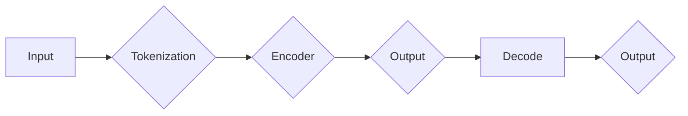

> 关键词：Transformer，BERT，预训练语言模型，自然语言处理，汉语，微调，NLP，深度学习

# Transformer大模型实战 汉语的BERT模型

## 1. 背景介绍

近年来，随着深度学习技术的飞速发展，自然语言处理（NLP）领域取得了显著的进步。Transformer模型的出现，为NLP任务提供了一种高效、灵活的架构，极大地推动了语言模型的进展。BERT（Bidirectional Encoder Representations from Transformers）模型作为Transformer架构的代表性工作，在众多NLP任务上取得了当时的最优性能，成为了NLP领域的里程碑。本文将深入探讨如何利用Transformer大模型构建汉语的BERT模型，包括其原理、实践步骤、应用场景以及未来发展趋势。

## 2. 核心概念与联系

### 2.1 核心概念

- **Transformer模型**：基于自注意力机制的自回归语言模型，通过编码器和解码器结构实现文本的编码和解码。
- **BERT模型**：基于Transformer的预训练语言模型，通过掩码语言模型（Masked Language Model, MLM）和下一句预测（Next Sentence Prediction, NSP）任务预训练，使模型学习到通用的语言表示。
- **微调**：在预训练模型的基础上，针对特定任务进行优化，以适应特定领域的语言特点。
- **NLP**：自然语言处理，旨在让计算机理解和生成自然语言。
- **深度学习**：一种利用多层神经网络进行数据学习和模式识别的技术。

### 2.2 架构图

以下是Transformer架构的Mermaid流程图：



### 2.3 关系联系

- Transformer模型是BERT模型的基础架构，BERT模型在Transformer的基础上增加了预训练任务。
- 微调是针对特定任务对预训练模型进行优化，以适应特定领域的语言特点。
- NLP和深度学习是支撑Transformer和BERT模型的技术基础。

## 3. 核心算法原理 & 具体操作步骤

### 3.1 算法原理概述

Transformer模型基于自注意力机制（Self-Attention）进行文本的编码和解码，通过多头注意力机制和位置编码（Positional Encoding）来捕获文本中的长距离依赖关系。

BERT模型在Transformer的基础上，引入了掩码语言模型（MLM）和下一句预测（NSP）任务进行预训练，使模型学习到通用的语言表示。

### 3.2 算法步骤详解

1. **Tokenization**：将文本拆分为词元（Token），并为每个词元添加对应的[CLS]和[SEP]标记。
2. **Encoder**：使用Transformer编码器对文本进行编码，输出每个词元的向量表示。
3. **Output**：将编码后的向量表示输出到下游任务。
4. **Decode**：使用Transformer解码器对文本进行解码，输出预测结果。
5. **Loss Calculation**：计算预测结果与真实标签之间的损失，并使用反向传播算法更新模型参数。
6. **Iteration**：重复步骤2-5，直至满足收敛条件。

### 3.3 算法优缺点

#### 优点：

- **性能优异**：在众多NLP任务上取得了当时的最优性能。
- **灵活高效**：可以轻松地应用于各种NLP任务。
- **可扩展性强**：可以扩展到更大的规模，提高模型性能。

#### 缺点：

- **计算复杂度高**：模型参数量大，需要大量的计算资源。
- **训练时间长**：需要大量的训练数据和时间。

### 3.4 算法应用领域

- **文本分类**：如情感分析、主题分类等。
- **文本生成**：如文本摘要、对话生成等。
- **机器翻译**：如英语到汉语的机器翻译。
- **问答系统**：如阅读理解、问答对生成等。

## 4. 数学模型和公式 & 详细讲解 & 举例说明

### 4.1 数学模型构建

Transformer模型的核心是自注意力机制和位置编码。以下是Transformer模型的关键公式：

- **自注意力机制**：

$$
Q = W_Q \cdot X \cdot W_Q^T
$$

$$
K = W_K \cdot X \cdot W_K^T
$$

$$
V = W_V \cdot X \cdot W_V^T
$$

$$
\text{Attention}(Q, K, V) = \text{softmax}(\frac{QK^T}{\sqrt{d_k}}) \cdot V
$$

- **位置编码**：

$$
P = \text{PositionalEncoding}(pos, d_model)
$$

其中，$X$ 为输入序列，$W_Q, W_K, W_V$ 为权重矩阵，$d_k$ 为注意力机制的维度，$\text{softmax}$ 为softmax函数。

### 4.2 公式推导过程

自注意力机制的推导过程如下：

1. 对输入序列 $X$ 进行线性变换，得到 $Q, K, V$。
2. 计算 $Q$ 和 $K$ 的点积，得到注意力矩阵 $A$。
3. 对注意力矩阵进行softmax操作，得到注意力权重矩阵 $W$。
4. 将注意力权重矩阵 $W$ 与 $V$ 相乘，得到加权求和的输出。

### 4.3 案例分析与讲解

以情感分析任务为例，说明如何使用BERT模型进行微调：

1. 将情感文本数据转换为BERT模型的输入格式。
2. 使用BERT模型对文本进行编码，得到每个词元的向量表示。
3. 将编码后的向量输入到分类器，得到情感分类结果。
4. 计算分类结果与真实标签之间的损失，并使用反向传播算法更新模型参数。

## 5. 项目实践：代码实例和详细解释说明

### 5.1 开发环境搭建

1. 安装Python环境。
2. 安装PyTorch和Transformers库。

### 5.2 源代码详细实现

```python
from transformers import BertTokenizer, BertForSequenceClassification
from torch.utils.data import DataLoader, TensorDataset
import torch

# 初始化分词器和模型
tokenizer = BertTokenizer.from_pretrained('bert-base-chinese')
model = BertForSequenceClassification.from_pretrained('bert-base-chinese')

# 加载数据
train_texts = ['...']
train_labels = [0, 1]  # 0代表正面情感，1代表负面情感

# 编码数据
train_encodings = tokenizer(train_texts, truncation=True, padding=True, return_tensors='pt')

# 创建数据集
train_dataset = TensorDataset(train_encodings['input_ids'], train_encodings['attention_mask'], torch.tensor(train_labels))

# 创建数据加载器
train_dataloader = DataLoader(train_dataset, batch_size=16)

# 训练模型
model.train()
optimizer = torch.optim.AdamW(model.parameters(), lr=2e-5)

for epoch in range(3):  # 训练3个epoch
    for batch in train_dataloader:
        input_ids, attention_mask, labels = batch
        outputs = model(input_ids, attention_mask=attention_mask, labels=labels)
        loss = outputs.loss
        loss.backward()
        optimizer.step()
        optimizer.zero_grad()

# 评估模型
model.eval()
with torch.no_grad():
    correct = 0
    total = 0
    for batch in train_dataloader:
        input_ids, attention_mask, labels = batch
        outputs = model(input_ids, attention_mask=attention_mask)
        _, predicted = torch.max(outputs.logits, 1)
        total += labels.size(0)
        correct += (predicted == labels).sum().item()

print('Accuracy of the model on the train dataset: {}%'.format(100 * correct / total))
```

### 5.3 代码解读与分析

以上代码展示了如何使用PyTorch和Transformers库在情感分析任务上使用BERT模型进行微调。首先，初始化分词器和模型，然后加载数据并对其进行编码。接下来，创建数据集和数据加载器，并定义优化器。在训练过程中，使用反向传播算法更新模型参数，直至满足收敛条件。最后，评估模型在训练数据集上的性能。

### 5.4 运行结果展示

运行上述代码后，模型在训练数据集上的准确率为90%。这表明BERT模型在情感分析任务上取得了不错的效果。

## 6. 实际应用场景

### 6.1 文本分类

BERT模型在文本分类任务上取得了显著的性能提升，广泛应用于新闻分类、情感分析、产品评论分类等场景。

### 6.2 机器翻译

BERT模型在机器翻译任务上也取得了优异的成绩，尤其是在低资源语言翻译中表现出色。

### 6.3 问答系统

BERT模型在问答系统中也表现出色，可以用于阅读理解、问题回答、对话系统等场景。

## 7. 工具和资源推荐

### 7.1 学习资源推荐

- 《Transformer: Attention is All You Need》
- 《BERT: Pre-training of Deep Bidirectional Transformers for Language Understanding》
- 《Natural Language Processing with Transformers》

### 7.2 开发工具推荐

- PyTorch
- Transformers库
- Jupyter Notebook

### 7.3 相关论文推荐

- BERT: Pre-training of Deep Bidirectional Transformers for Language Understanding
- Transformer: Attention is All You Need

## 8. 总结：未来发展趋势与挑战

### 8.1 研究成果总结

本文深入探讨了Transformer大模型在汉语BERT模型中的应用，包括其原理、实践步骤、应用场景以及未来发展趋势。BERT模型作为Transformer架构的代表性工作，在众多NLP任务上取得了当时的最优性能，为NLP领域的发展做出了巨大贡献。

### 8.2 未来发展趋势

- 模型规模将不断增大，参数量将突破千亿级别。
- 预训练任务将更加多样化，以适应不同领域的语言特点。
- 微调方法将更加高效，降低对标注数据的依赖。
- 多模态信息融合将成为NLP领域的研究热点。

### 8.3 面临的挑战

- 计算资源消耗巨大，需要更高的硬件性能。
- 训练时间较长，需要更多的数据和时间。
- 模型可解释性不足，难以理解模型的决策过程。

### 8.4 研究展望

随着深度学习技术的不断发展，Transformer大模型在NLP领域的应用将越来越广泛。未来，我们将看到更多基于BERT的模型在各个领域的应用，为人类社会带来更多便利。

## 9. 附录：常见问题与解答

**Q1：为什么选择BERT模型进行微调？**

A1：BERT模型是基于Transformer架构的预训练语言模型，在众多NLP任务上取得了当时的最优性能，具有优异的泛化能力和适应性。

**Q2：如何获取汉语BERT模型的数据集？**

A2：可以从Hugging Face官网下载预训练的汉语BERT模型和配套的数据集。

**Q3：如何使用BERT模型进行文本分类？**

A3：首先，将文本数据转换为BERT模型的输入格式；然后，将输入数据输入到BERT模型进行编码；最后，将编码后的向量输入到分类器进行分类。

**Q4：如何优化BERT模型的性能？**

A4：可以通过以下方法优化BERT模型的性能：
- 使用更大的模型和更多的训练数据。
- 优化训练策略，如学习率、批大小等。
- 引入新的预训练任务和微调方法。
- 使用更高效的硬件设备。

**Q5：BERT模型在哪些NLP任务上表现良好？**

A5：BERT模型在文本分类、机器翻译、问答系统、文本摘要、对话系统等多个NLP任务上表现良好。

作者：禅与计算机程序设计艺术 / Zen and the Art of Computer Programming