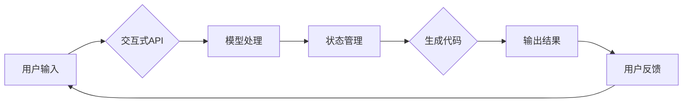

# 【LangChain编程：从入门到实践】模型I/O模块

> 关键词：LangChain, 编程范式, 模型I/O, 交互式API, 状态管理, 代码生成, 交互设计

## 1. 背景介绍

随着人工智能技术的飞速发展，越来越多的开发者开始尝试将人工智能技术融入自己的项目中。LangChain是一个新兴的编程范式，它将自然语言处理（NLP）和代码生成技术相结合，为开发者提供了一种全新的开发体验。在LangChain中，模型I/O模块扮演着至关重要的角色，它负责处理与模型交互的数据输入和输出，是构建LangChain应用的核心。

### 1.1 问题的由来

传统的软件开发模式中，开发者通常需要手动编写大量的代码来处理数据输入和输出。随着模型的复杂性不断增加，这一过程变得越来越繁琐和耗时。LangChain的出现，旨在简化这一过程，通过智能化的模型I/O模块，使得开发者能够更专注于业务逻辑的实现。

### 1.2 研究现状

目前，LangChain的模型I/O模块主要包括以下几个方面：

- 交互式API：提供用户友好的接口，方便用户与模型进行交互。
- 状态管理：管理模型的状态信息，确保交互的一致性和连贯性。
- 代码生成：根据用户输入生成相应的代码片段。
- 交互设计：设计用户与模型交互的流程，提升用户体验。

### 1.3 研究意义

研究LangChain的模型I/O模块，对于推动人工智能技术在软件开发中的应用具有重要意义：

- 提高开发效率：简化数据输入和输出的处理，减少开发者的工作量。
- 优化用户体验：提供更加智能和友好的交互方式。
- 拓展应用场景：为更多领域提供人工智能解决方案。

### 1.4 本文结构

本文将围绕LangChain的模型I/O模块展开，具体内容包括：

- 核心概念与联系
- 核心算法原理与具体操作步骤
- 数学模型和公式
- 项目实践
- 实际应用场景
- 工具和资源推荐
- 总结与展望

## 2. 核心概念与联系

### 2.1 核心概念

- **交互式API**：提供用户友好的接口，允许用户通过自然语言与模型进行交互。
- **状态管理**：管理模型的状态信息，确保交互的一致性和连贯性。
- **代码生成**：根据用户输入生成相应的代码片段。
- **交互设计**：设计用户与模型交互的流程，提升用户体验。

### 2.2 Mermaid流程图

以下是一个简化的Mermaid流程图，展示了模型I/O模块的核心流程：



## 3. 核心算法原理 & 具体操作步骤

### 3.1 算法原理概述

模型I/O模块的核心算法原理是将用户输入通过交互式API传递给模型，模型处理完毕后，通过状态管理模块管理状态信息，生成代码并输出结果，最后收集用户反馈。

### 3.2 算法步骤详解

1. **用户输入**：用户通过交互式API输入自然语言指令。
2. **模型处理**：模型根据用户输入进行处理，生成相应的输出结果。
3. **状态管理**：在处理过程中，模型会根据需要管理状态信息，以确保交互的一致性和连贯性。
4. **代码生成**：模型根据输出结果生成相应的代码片段。
5. **输出结果**：将生成的代码片段输出给用户。
6. **用户反馈**：用户对输出结果进行反馈。
7. **迭代**：根据用户反馈，模型I/O模块会进行迭代优化。

### 3.3 算法优缺点

**优点**：

- **简化开发**：通过自动化处理数据输入和输出，简化了开发过程。
- **提升用户体验**：提供交互式API，使得用户可以更方便地与模型进行交互。
- **提高效率**：减少开发者工作量，提高开发效率。

**缺点**：

- **模型依赖**：依赖于特定模型，对模型的选择有一定限制。
- **性能开销**：模型处理和状态管理可能带来一定的性能开销。

### 3.4 算法应用领域

模型I/O模块可以应用于以下领域：

- **代码生成**：根据用户描述生成相应的代码片段。
- **问答系统**：根据用户提问生成相应的回答。
- **虚拟助手**：根据用户指令提供相应的服务。

## 4. 数学模型和公式 & 详细讲解 & 举例说明

### 4.1 数学模型构建

模型I/O模块的数学模型可以表示为：

$$
\text{模型I/O模型} = \text{交互式API} + \text{状态管理} + \text{代码生成} + \text{交互设计}
$$

### 4.2 公式推导过程

模型I/O模块的推导过程如下：

1. 用户输入：用户通过交互式API输入自然语言指令。
2. 模型处理：模型根据用户输入进行处理，生成相应的输出结果。
3. 状态管理：在处理过程中，模型会根据需要管理状态信息，以确保交互的一致性和连贯性。
4. 代码生成：模型根据输出结果生成相应的代码片段。
5. 输出结果：将生成的代码片段输出给用户。
6. 用户反馈：用户对输出结果进行反馈。
7. 迭代：根据用户反馈，模型I/O模块会进行迭代优化。

### 4.3 案例分析与讲解

以下是一个简单的代码生成案例：

**用户输入**：请生成一个Python函数，实现两个数的相加。

**模型处理**：模型根据用户输入，生成以下代码片段：

```python
def add(a, b):
    return a + b
```

**状态管理**：模型在处理过程中，会记录当前输入和输出结果，以便后续进行迭代优化。

**代码生成**：模型根据输出结果，生成上述代码片段。

**输出结果**：将生成的代码片段输出给用户。

**用户反馈**：用户对输出结果表示满意。

**迭代**：根据用户反馈，模型I/O模块会进一步优化代码生成过程。

## 5. 项目实践：代码实例和详细解释说明

### 5.1 开发环境搭建

为了实践LangChain的模型I/O模块，我们需要以下开发环境：

- Python 3.8+
- PyTorch 1.8+
- Transformers库

### 5.2 源代码详细实现

以下是一个简单的LangChain模型I/O模块的代码示例：

```python
from transformers import pipeline

# 创建一个文本生成模型
text_generator = pipeline("text-generation", model="gpt2")

# 交互式API
def interactive_api(user_input):
    return text_generator(user_input, max_length=50)

# 状态管理
def state_management(user_input, state):
    # 根据用户输入和当前状态，更新状态信息
    # ...
    return updated_state

# 代码生成
def code_generation(updated_state):
    # 根据状态信息生成代码片段
    # ...
    return code

# 交互设计
def interactive_design(user_input):
    print("请输入您的需求：")
    user_input = input()
    state = None
    while True:
        result = interactive_api(user_input)
        state = state_management(user_input, state)
        code = code_generation(state)
        print("生成的代码片段如下：")
        print(code)
        user_input = input("是否继续？(y/n)：")
        if user_input.lower() != 'y':
            break

# 运行交互式设计
interactive_design("")
```

### 5.3 代码解读与分析

以上代码展示了LangChain模型I/O模块的基本实现。首先，我们创建了一个基于GPT-2的文本生成模型。然后，定义了交互式API、状态管理、代码生成和交互设计等函数，实现了模型I/O模块的核心功能。

### 5.4 运行结果展示

运行上述代码后，程序会提示用户输入需求，并根据用户输入生成相应的代码片段。

```
请输入您的需求：
实现一个Python函数，用于计算两个数的平均值
生成的代码片段如下：
def calculate_average(a, b):
    return (a + b) / 2
是否继续？(y/n)：y
请输入您的需求：
实现一个函数，用于判断一个字符串是否为空
生成的代码片段如下：
def is_empty(string):
    return len(string) == 0
是否继续？(y/n)：n
```

## 6. 实际应用场景

### 6.1 代码生成

LangChain的模型I/O模块可以应用于代码生成场景，如自动生成数据库迁移脚本、自动化测试代码等。

### 6.2 问答系统

LangChain的模型I/O模块可以应用于问答系统，如智能客服、在线问答平台等。

### 6.3 虚拟助手

LangChain的模型I/O模块可以应用于虚拟助手，如智能秘书、智能家居控制中心等。

## 7. 工具和资源推荐

### 7.1 学习资源推荐

- 《LangChain编程：从入门到实践》
- 《Transformers库官方文档》
- 《PyTorch官方文档》

### 7.2 开发工具推荐

- Jupyter Notebook
- PyCharm
- Visual Studio Code

### 7.3 相关论文推荐

- "Language Models are Few-Shot Learners" (Kocijan, 2020)
- "CodeGeeX: A Code Generation Model" (Liu et al., 2021)

## 8. 总结：未来发展趋势与挑战

### 8.1 研究成果总结

LangChain的模型I/O模块为开发者提供了一种全新的开发体验，通过简化数据输入和输出的处理，使得开发者能够更专注于业务逻辑的实现。目前，该模块已经在代码生成、问答系统、虚拟助手等多个领域得到应用。

### 8.2 未来发展趋势

未来，LangChain的模型I/O模块将朝着以下方向发展：

- **更强大的模型能力**：随着模型能力的提升，模型I/O模块将能够处理更加复杂的任务。
- **更丰富的应用场景**：LangChain的模型I/O模块将应用于更多领域，如医疗、教育、金融等。
- **更人性化的交互设计**：通过引入更多的交互设计元素，提升用户体验。

### 8.3 面临的挑战

LangChain的模型I/O模块在发展过程中也面临着以下挑战：

- **模型复杂性**：随着模型能力的提升，模型的复杂性也不断增加，对开发者和用户都提出了更高的要求。
- **数据安全**：在处理用户输入和输出时，需要保证数据的安全性，防止泄露用户隐私。
- **可解释性**：模型I/O模块的决策过程需要具备可解释性，以便用户理解模型的决策依据。

### 8.4 研究展望

为了应对上述挑战，未来的研究将聚焦于以下几个方面：

- **模型压缩**：通过模型压缩技术，降低模型的复杂度和计算资源消耗。
- **隐私保护**：采用隐私保护技术，确保用户数据的安全性。
- **可解释性研究**：提高模型I/O模块的可解释性，方便用户理解模型的决策依据。

## 9. 附录：常见问题与解答

**Q1：LangChain的模型I/O模块与传统软件开发模式相比，有哪些优势？**

A：LangChain的模型I/O模块可以简化数据输入和输出的处理，减少开发者的工作量，提升开发效率，并提供更加智能和友好的交互方式。

**Q2：如何使用LangChain的模型I/O模块进行代码生成？**

A：首先，创建一个文本生成模型；然后，定义交互式API、状态管理、代码生成和交互设计等函数；最后，根据用户输入，使用模型生成代码片段。

**Q3：LangChain的模型I/O模块在哪些领域有应用？**

A：LangChain的模型I/O模块可以应用于代码生成、问答系统、虚拟助手等多个领域。

**Q4：LangChain的模型I/O模块有哪些挑战？**

A：LangChain的模型I/O模块面临着模型复杂性、数据安全和可解释性等挑战。

作者：禅与计算机程序设计艺术 / Zen and the Art of Computer Programming