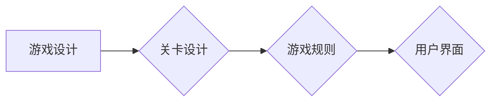
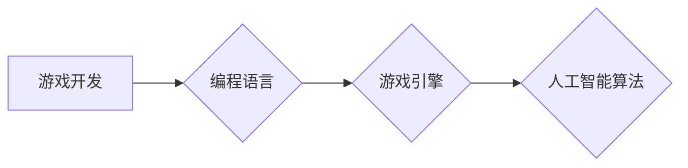

# 推箱子游戏的设计与实现

> 关键词：推箱子游戏，游戏设计，游戏开发，人工智能，算法，图形用户界面，游戏引擎

## 1. 背景介绍

推箱子（Tetris）是一款经典的单人益智游戏，玩家需要操控一个小方块（称为“推箱子”）在迷宫般的关卡中移动，将箱子推到目标位置。这款游戏简单易懂，但需要玩家运用逻辑思维和策略规划来解决问题。随着技术的发展，推箱子游戏也被赋予了更多的功能和挑战，例如引入多种角色、障碍物和特殊功能。本文将探讨推箱子游戏的设计与实现，包括游戏逻辑、人工智能算法、图形用户界面和游戏引擎的搭建。

## 2. 核心概念与联系

### 2.1 游戏设计

推箱子游戏的核心概念包括：

- **关卡设计**：设计迷宫的布局，包括起始点、终点、箱子、障碍物等。
- **游戏规则**：定义玩家如何操作推箱子，以及如何判断游戏胜利或失败。
- **用户界面**：设计直观易用的用户界面，包括游戏画面、操作控制、提示信息等。

Mermaid流程图：



### 2.2 游戏开发

游戏开发涉及以下核心概念：

- **编程语言**：选择合适的编程语言进行开发，如C++、C#、Python等。
- **游戏引擎**：使用游戏引擎简化开发流程，如Unity、Unreal Engine等。
- **人工智能算法**：设计算法使推箱子游戏更具挑战性，如路径规划、状态空间搜索等。

Mermaid流程图：



## 3. 核心算法原理 & 具体操作步骤

### 3.1 算法原理概述

推箱子游戏中的核心算法包括：

- **状态空间搜索**：通过搜索所有可能的移动来找到解决方案。
- **启发式搜索**：使用启发式函数评估当前状态的好坏，指导搜索过程。
- **路径规划**：规划从起始点到终点的最优路径。

### 3.2 算法步骤详解

#### 3.2.1 状态空间搜索

状态空间搜索是一种在所有可能的状态中寻找解的方法。在推箱子游戏中，每个状态可以表示为：

- 玩家的位置
- 推箱子的位置
- 箱子目标位置
- 关卡布局

搜索算法如A*搜索、ID-A*搜索等，可以根据启发式函数评估当前状态，指导搜索过程。

#### 3.2.2 启发式搜索

启发式搜索通过评估当前状态与目标状态之间的距离来指导搜索过程。常见的启发式函数包括：

- 曼哈顿距离
- 启发式函数h(n) = g(n) + h(n)

其中，g(n)是当前状态到起始状态的代价，h(n)是当前状态到目标状态的启发式估计。

#### 3.2.3 路径规划

路径规划是设计从起始点到终点的最优路径。在推箱子游戏中，可以使用图搜索算法如A*搜索来规划路径。

### 3.3 算法优缺点

#### 优点

- 状态空间搜索和启发式搜索可以找到最优或近似最优解。
- 路径规划可以快速找到从起点到终点的最优路径。

#### 缺点

- 状态空间搜索的计算复杂度较高，尤其是在关卡复杂时。
- 启发式搜索的性能取决于启发式函数的设计。

### 3.4 算法应用领域

推箱子游戏中的算法可以应用于其他需要路径规划和搜索问题的领域，如机器人路径规划、物流调度等。

## 4. 数学模型和公式 & 详细讲解 & 举例说明

### 4.1 数学模型构建

推箱子游戏可以用以下数学模型表示：

- 状态空间：所有可能的状态集合。
- 动作空间：所有可能动作集合。
- 转移函数：给定当前状态和动作，得到下一个状态。
- 目标函数：评估当前状态的好坏。

### 4.2 公式推导过程

#### 启发式函数h(n)

假设状态n到目标状态的目标函数为h(n)。则启发式函数可以表示为：

$$
h(n) = g(n) + h(n)
$$

其中，g(n)是当前状态到起始状态的代价。

#### 曼哈顿距离

曼哈顿距离是指从当前状态到目标状态的水平和垂直距离之和。

$$
d = |x_1 - x_2| + |y_1 - y_2|
$$

### 4.3 案例分析与讲解

假设有一个简单的推箱子关卡：

```
S: Start
E: End
#: Wall
B: Box
. : Empty

S#B.#
.###.
.BE..
```

我们需要找到从起始点到终点的路径，使得箱子B到达目标位置E。

使用A*搜索算法，我们可以通过以下步骤找到最优路径：

1. 初始化开放列表和封闭列表。
2. 将起始状态加入开放列表。
3. 循环执行以下步骤：
   - 从开放列表中选出F值最小的状态n。
   - 如果n是目标状态，则找到最优路径。
   - 将n从开放列表中移除，加入封闭列表。
   - 对于n的每个相邻状态，计算G值和F值，如果该状态不在封闭列表中，则将其加入开放列表。
4. 当找到目标状态时，从目标状态回溯到起始状态，得到最优路径。

## 5. 项目实践：代码实例和详细解释说明

### 5.1 开发环境搭建

以下是一个使用Python和Pygame库实现推箱子游戏的开发环境搭建示例：

```bash
pip install pygame
```

### 5.2 源代码详细实现

以下是一个简单的推箱子游戏实现示例：

```python
import pygame
import random

# 初始化游戏
pygame.init()
screen = pygame.display.set_mode((800, 600))
clock = pygame.time.Clock()

# 游戏对象
class Player(pygame.sprite.Sprite):
    def __init__(self, x, y):
        super().__init__()
        self.image = pygame.Surface((50, 50))
        self.image.fill((255, 0, 0))
        self.rect = self.image.get_rect()
        self.rect.topleft = (x, y)
        self.speed = 5

    def update(self, event):
        if event.type == pygame.KEYDOWN:
            if event.key == pygame.K_LEFT:
                self.rect.move_ip(-self.speed, 0)
            elif event.key == pygame.K_RIGHT:
                self.rect.move_ip(self.speed, 0)
            elif event.key == pygame.K_UP:
                self.rect.move_ip(0, -self.speed)
            elif event.key == pygame.K_DOWN:
                self.rect.move_ip(0, self.speed)

# 游戏循环
running = True
while running:
    for event in pygame.event.get():
        if event.type == pygame.QUIT:
            running = False
        elif event.type == pygame.KEYDOWN:
            player.update(event)

    screen.fill((0, 0, 0))
    player.draw(screen)
    pygame.display.flip()
    clock.tick(60)

pygame.quit()
```

### 5.3 代码解读与分析

以上代码定义了一个简单的推箱子游戏，包括玩家对象和游戏循环。玩家对象可以通过键盘方向键进行移动，并在屏幕上绘制。

### 5.4 运行结果展示

运行上述代码后，将看到一个简单的推箱子游戏界面，玩家可以控制红色方块移动，将蓝色方块推到黄色框框中。

## 6. 实际应用场景

推箱子游戏可以应用于以下实际场景：

- **教育**：作为编程入门的教学工具，帮助学生理解编程概念和算法原理。
- **娱乐**：作为休闲游戏，提供趣味性和挑战性的游戏体验。
- **心理学**：用于研究人类解决问题的思维过程。

## 7. 工具和资源推荐

### 7.1 学习资源推荐

- 《游戏编程模式》
- 《游戏引擎设计》
- 《人工智能：一种现代的方法》

### 7.2 开发工具推荐

- Pygame
- Unity
- Unreal Engine

### 7.3 相关论文推荐

- 《A*搜索算法》
- 《启发式搜索》
- 《路径规划算法》

## 8. 总结：未来发展趋势与挑战

### 8.1 研究成果总结

本文介绍了推箱子游戏的设计与实现，包括游戏设计、游戏开发、人工智能算法和图形用户界面。通过Python和Pygame库，我们可以轻松实现一个简单的推箱子游戏。

### 8.2 未来发展趋势

- 引入更多角色和元素，丰富游戏玩法。
- 使用人工智能技术提高游戏难度和挑战性。
- 结合虚拟现实(VR)和增强现实(AR)技术，提供沉浸式游戏体验。

### 8.3 面临的挑战

- 设计富有创意和挑战性的关卡。
- 优化游戏性能，提高游戏体验。
- 确保游戏的可玩性和公平性。

### 8.4 研究展望

推箱子游戏作为一款经典的益智游戏，具有广泛的应用前景。未来，随着技术的发展，推箱子游戏将更加丰富多样，为玩家带来更多乐趣和挑战。

## 9. 附录：常见问题与解答

**Q1：如何设计富有创意的推箱子关卡？**

A1：设计富有创意的推箱子关卡需要考虑以下几个方面：

- 关卡布局：设计合理的迷宫布局，使关卡既有挑战性，又富有趣味性。
- 元素组合：引入多种角色、障碍物和特殊功能，丰富游戏玩法。
- 难度梯度：设计不同难度的关卡，满足不同玩家的需求。

**Q2：如何提高游戏性能？**

A2：提高游戏性能可以从以下几个方面入手：

- 优化算法：选择高效的算法，如A*搜索算法，提高搜索效率。
- 优化数据结构：使用合适的数据结构，如哈希表，提高数据访问速度。
- 优化图形渲染：使用高效的图形渲染技术，如贴图技术，提高渲染速度。

**Q3：如何确保游戏的可玩性和公平性？**

A3：确保游戏的可玩性和公平性可以从以下几个方面入手：

- 丰富的游戏元素：提供多种游戏元素，满足不同玩家的需求。
- 难度梯度：设计不同难度的关卡，确保游戏难度适中。
- 公平的游戏机制：确保游戏规则公平，避免玩家作弊。

作者：禅与计算机程序设计艺术 / Zen and the Art of Computer Programming