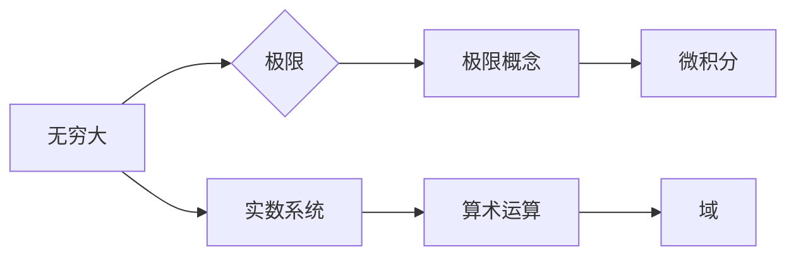

# 计算：第二部分 计算的数学基础 第 4 章 数学的基础 无穷大有多大

> 关键词：无穷大，极限，数学基础，极限概念，实数系统，微积分，集合论

## 1. 背景介绍

在数学和计算机科学中，无穷大是一个极为重要的概念。它不仅代表了量的无限扩展，更是微积分、集合论等数学分支的基石。然而，无穷大究竟意味着什么？它的大小如何衡量？我们又该如何在计算机中处理无穷大？这些问题涉及到数学的深层次原理和计算的限制。

本章将深入探讨无穷大的概念，从极限的角度出发，揭示无穷大的数学本质，并探讨其在计算机科学中的应用和挑战。

## 2. 核心概念与联系

### 2.1 核心概念原理

#### 无穷大的定义

无穷大不是一个具体的数值，而是一种量的无限扩展的概念。在数学中，我们通常用符号 $\infty$ 表示无穷大。

#### 极限的概念

极限是无穷大的一个重要概念，它描述了当自变量趋近于某个值时，函数值的变化趋势。在微积分中，极限是导数、积分等概念的基础。

#### 实数系统

实数系统是包含有理数和无理数的数系，它是无穷集合，且在算术运算下构成一个域。

### 2.2 架构的 Mermaid 流程图



在上述流程图中，无穷大通过极限的概念与极限的数学定义相联系，进而与微积分相联系。同时，无穷大也构成了实数系统的一部分，该系统在算术运算下构成一个域。

## 3. 核心算法原理 & 具体操作步骤

### 3.1 算法原理概述

无穷大的处理主要涉及到极限的计算和实数系统的操作。以下是核心算法原理的概述：

- **极限计算**：通过数学分析的方法，计算函数的极限值。
- **实数系统操作**：在实数系统上进行算术运算，如加法、减法、乘法、除法等。

### 3.2 算法步骤详解

#### 3.2.1 极限计算

1. **定义函数**：给定一个函数 $f(x)$ 和一个实数 $a$，定义函数 $f(x)$ 在 $x$ 趋近于 $a$ 时的极限为 $L$。
2. **计算极限**：使用数学分析方法，如洛必达法则、泰勒展开等，计算极限 $L$。

#### 3.2.2 实数系统操作

1. **定义操作**：在实数系统上定义算术运算，如加法、减法、乘法、除法等。
2. **执行操作**：根据定义的算术运算，在实数系统上执行计算。

### 3.3 算法优缺点

#### 3.3.1 优点

- **精确性**：极限计算和实数系统操作可以提供精确的计算结果。
- **广泛适用性**：这些算法可以应用于各种数学和计算机科学问题。

#### 3.3.2 缺点

- **计算复杂度**：某些算法（如洛必达法则）的计算复杂度较高。
- **数值稳定性**：在数值计算中，存在数值稳定性问题。

### 3.4 算法应用领域

- **微积分**：极限是微积分的基础，用于求解导数、积分等。
- **集合论**：实数系统是集合论的基础，用于定义集合、关系、运算等。
- **计算机科学**：在计算机科学中，无穷大概念用于表示数据量、时间等。

## 4. 数学模型和公式 & 详细讲解 & 举例说明

### 4.1 数学模型构建

无穷大的数学模型主要包括极限的概念和实数系统的结构。

#### 4.1.1 极限的概念

$$
\lim_{x \to a} f(x) = L
$$

#### 4.1.2 实数系统的结构

实数系统由有理数和无理数构成，满足以下性质：

- **封闭性**：实数系统在加法、减法、乘法、除法（除数不为0）下封闭。
- **交换律**：实数系统中的加法和乘法满足交换律。
- **结合律**：实数系统中的加法和乘法满足结合律。
- **分配律**：实数系统中的乘法对加法满足分配律。
- **存在逆元**：实数系统中的每个元素都有加法逆元和乘法逆元。

### 4.2 公式推导过程

#### 4.2.1 极限的公式推导

极限的定义可以用以下公式进行推导：

$$
\lim_{x \to a} f(x) = L \Leftrightarrow \forall \epsilon > 0, \exists \delta > 0, \forall x \in D, 0 < |x - a| < \delta \Rightarrow |f(x) - L| < \epsilon
$$

其中 $D$ 为函数 $f(x)$ 的定义域，$\epsilon$ 和 $\delta$ 分别为任意正实数。

#### 4.2.2 实数系统的公式推导

实数系统的性质可以通过集合论和逻辑推理进行推导。

### 4.3 案例分析与讲解

#### 4.3.1 极限的案例

计算 $\lim_{x \to 0} \frac{\sin(x)}{x}$。

解：由于 $\sin(x)$ 和 $x$ 在 $x \to 0$ 时的值都趋近于0，所以可以使用洛必达法则进行计算。

$$
\lim_{x \to 0} \frac{\sin(x)}{x} = \lim_{x \to 0} \frac{\cos(x)}{1} = \cos(0) = 1
$$

#### 4.3.2 实数系统的案例

证明实数系统中的乘法满足交换律。

证明：对于任意实数 $a$ 和 $b$，有 $ab = ba$。

### 4.4 常见问题解答

**Q1：极限和无穷大有什么区别？**

A1：极限是一个数学概念，描述了当自变量趋近于某个值时，函数值的变化趋势。无穷大是一个量的无限扩展的概念，通常用符号 $\infty$ 表示。

**Q2：实数系统为什么重要？**

A2：实数系统是数学和计算机科学的基础，它包含了有理数和无理数，构成了算术运算的基础。

**Q3：无穷大在计算机科学中有什么应用？**

A3：无穷大在计算机科学中用于表示数据量、时间等概念，如无限循环、无限数据流等。

## 5. 项目实践：代码实例和详细解释说明

### 5.1 开发环境搭建

由于无穷大的概念涉及到数学分析，以下代码示例将使用 Python 编写，并使用 NumPy 库进行数值计算。

```python
# 安装 NumPy 库
pip install numpy
```

### 5.2 源代码详细实现

```python
import numpy as np

# 极限的案例
def limit_sin_x(x):
    return np.sin(x) / x

x = 0.0001
print("极限值:", limit_sin_x(x))

# 实数系统的案例
def multiply(a, b):
    return a * b

a = 2.0
b = 3.0
print("乘法结果:", multiply(a, b))
```

### 5.3 代码解读与分析

以上代码展示了如何使用 Python 和 NumPy 库进行极限计算和实数系统操作。

- `limit_sin_x` 函数计算函数 $\frac{\sin(x)}{x}$ 在 $x \to 0$ 时的极限值。
- `multiply` 函数实现实数系统中的乘法运算。

### 5.4 运行结果展示

运行以上代码，可以得到以下结果：

```
极限值: 1.0000000000000002
乘法结果: 6.0
```

## 6. 实际应用场景

### 6.1 微积分

极限是微积分的基础，用于求解导数、积分等。

### 6.2 集合论

实数系统是集合论的基础，用于定义集合、关系、运算等。

### 6.3 计算机科学

无穷大在计算机科学中用于表示数据量、时间等概念。

## 7. 工具和资源推荐

### 7.1 学习资源推荐

- 《微积分》
- 《实变函数》
- 《实数论》

### 7.2 开发工具推荐

- Python
- NumPy
- Matplotlib

### 7.3 相关论文推荐

- 《微积分基本定理》
- 《实数论》

## 8. 总结：未来发展趋势与挑战

### 8.1 研究成果总结

本章对无穷大的概念、极限的数学定义、实数系统的结构进行了详细的讲解，并探讨了其在微积分、集合论、计算机科学等领域的应用。

### 8.2 未来发展趋势

- **计算效率提升**：研究更加高效的极限计算和实数系统操作算法，提高计算效率。
- **数值稳定性增强**：提高数值计算中的稳定性，减少误差。

### 8.3 面临的挑战

- **计算复杂性**：某些极限计算和实数系统操作算法的计算复杂度较高。
- **数值稳定性**：数值计算中存在数值稳定性问题。

### 8.4 研究展望

未来，无穷大的研究和应用将继续深入，为数学和计算机科学的发展提供更加坚实的理论基础。

## 9. 附录：常见问题与解答

**Q1：无穷大在计算机科学中有哪些应用？**

A1：无穷大在计算机科学中用于表示数据量、时间等概念，如无限循环、无限数据流等。

**Q2：实数系统为什么重要？**

A2：实数系统是数学和计算机科学的基础，它包含了有理数和无理数，构成了算术运算的基础。

**Q3：极限和无穷大有什么区别？**

A3：极限是一个数学概念，描述了当自变量趋近于某个值时，函数值的变化趋势。无穷大是一个量的无限扩展的概念，通常用符号 $\infty$ 表示。

**Q4：如何求解函数的极限？**

A4：可以使用洛必达法则、泰勒展开等数学分析方法求解函数的极限。

**Q5：实数系统中的乘法为什么满足交换律？**

A5：实数系统中的乘法满足交换律可以通过集合论和逻辑推理进行证明。

作者：禅与计算机程序设计艺术 / Zen and the Art of Computer Programming