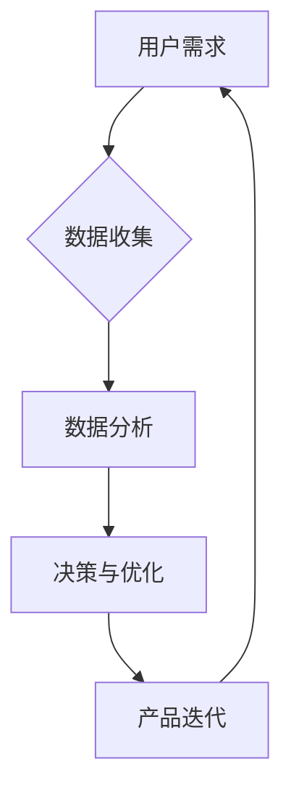

> 数据驱动，软件2.0，人工智能，机器学习，数据分析，用户体验

# 软件 2.0 的时代：数据驱动一切

随着互联网的普及和大数据技术的飞速发展，软件产业正经历着从软件 1.0 到软件 2.0 的转变。在这个新的时代，数据成为推动软件发展的重要驱动力，一切都将围绕着数据展开。本文将深入探讨软件 2.0 的概念、核心技术、应用场景以及未来发展趋势。

## 1. 背景介绍

### 1.1  软件发展的历史阶段

软件 1.0 时代，软件开发以功能为核心，注重代码的可读性和可维护性。在这一阶段，软件开发遵循瀑布模型，流程固定，周期较长。

### 1.2  软件发展的驱动因素

随着互联网的兴起，用户需求逐渐从功能驱动转向体验驱动。为了满足用户日益增长的需求，软件开发模式也在不断演进。

### 1.3  软件 2.0 的定义

软件 2.0 是指以用户为中心，数据驱动，持续迭代和优化的软件开发模式。在这个时代，数据成为软件的核心驱动力，通过数据分析、机器学习等技术，不断提升用户体验和产品价值。

## 2. 核心概念与联系

### 2.1  数据驱动

数据驱动是指通过收集和分析大量数据，从而指导决策和优化产品或服务的过程。在软件 2.0 时代，数据驱动成为软件开发的重要原则。

### 2.2  机器学习

机器学习是人工智能的一个分支，通过算法使计算机从数据中学习，从而实现对特定任务的预测和决策。

### 2.3  数据分析

数据分析是指对数据进行收集、整理、分析和解释的过程，以发现数据中的规律和趋势。

### 2.4  Mermaid 流程图



在软件 2.0 时代，数据驱动、机器学习、数据分析和产品迭代形成一个闭环，共同推动软件的不断优化和迭代。

## 3. 核心算法原理 & 具体操作步骤

### 3.1  算法原理概述

软件 2.0 的核心算法包括数据收集、数据预处理、特征工程、模型选择、模型训练、模型评估和模型部署。

### 3.2  算法步骤详解

1. 数据收集：从各种渠道收集用户数据，如日志、问卷、传感器数据等。
2. 数据预处理：清洗、整合和转换数据，为后续分析做准备。
3. 特征工程：从原始数据中提取对模型有用的特征。
4. 模型选择：根据任务类型选择合适的机器学习模型。
5. 模型训练：使用训练数据训练模型，使模型学习数据中的规律。
6. 模型评估：使用测试数据评估模型的性能。
7. 模型部署：将模型部署到生产环境中，实现实时预测和决策。

### 3.3  算法优缺点

**优点**：

- 提高用户体验：通过数据分析，可以更好地理解用户需求，设计出更加符合用户习惯的产品。
- 优化产品功能：通过机器学习，可以自动识别用户行为模式，为用户提供个性化的推荐和服务。
- 提高开发效率：通过数据驱动，可以减少对人工经验的依赖，提高开发效率。

**缺点**：

- 数据质量：数据质量对模型性能至关重要，低质量的数据可能导致模型错误。
- 模型可解释性：一些复杂的机器学习模型缺乏可解释性，难以理解其决策过程。
- 隐私保护：在收集和使用用户数据时，需要重视用户隐私保护。

### 3.4  算法应用领域

软件 2.0 的算法已广泛应用于各个领域，如推荐系统、智能客服、智能广告、金融风控等。

## 4. 数学模型和公式 & 详细讲解 & 举例说明

### 4.1  数学模型构建

在软件 2.0 中，常见的数学模型包括线性回归、逻辑回归、决策树、支持向量机、神经网络等。

### 4.2  公式推导过程

以线性回归为例，其目标是最小化预测值与真实值之间的误差平方和。

$$
\text{最小化} \sum_{i=1}^{n}(y_i - \hat{y}_i)^2
$$

其中，$y_i$ 为真实值，$\hat{y}_i$ 为预测值。

### 4.3  案例分析与讲解

以下是一个简单的线性回归案例：

假设我们有一个数据集，包含用户年龄和年收入信息，我们希望根据年龄预测年收入。

```python
import numpy as np
import matplotlib.pyplot as plt

# 生成数据
np.random.seed(0)
x = np.random.rand(100) * 50  # 随机生成年龄数据
y = 2 * x + np.random.randn(100) * 5  # 收入 = 2 * 年龄 + 随机噪声

# 拟合线性模型
from sklearn.linear_model import LinearRegression
model = LinearRegression()
model.fit(x.reshape(-1, 1), y.reshape(-1, 1))

# 可视化结果
plt.scatter(x, y, color='red', label='真实数据')
plt.scatter(x, model.predict(x.reshape(-1, 1)), color='blue', label='预测数据')
plt.xlabel('年龄')
plt.ylabel('年收入')
plt.legend()
plt.show()
```

## 5. 项目实践：代码实例和详细解释说明

### 5.1  开发环境搭建

在进行数据驱动软件开发时，需要搭建以下开发环境：

- Python编程语言
- NumPy、Pandas、Scikit-learn等数据科学库
- Jupyter Notebook或PyCharm等开发工具

### 5.2  源代码详细实现

以下是一个简单的机器学习项目示例，使用Scikit-learn库进行线性回归预测：

```python
# 生成数据
x = np.random.rand(100) * 50  # 随机生成年龄数据
y = 2 * x + np.random.randn(100) * 5  # 收入 = 2 * 年龄 + 随机噪声

# 拟合线性模型
model = LinearRegression()
model.fit(x.reshape(-1, 1), y.reshape(-1, 1))

# 预测收入
predicted_income = model.predict([30])

# 输出结果
print(f'预测的年收入：{predicted_income[0]:.2f}')
```

### 5.3  代码解读与分析

以上代码展示了如何使用Scikit-learn库进行线性回归预测。首先生成随机数据，然后使用`LinearRegression`类拟合线性模型，最后使用模型预测新数据点的年收入。

### 5.4  运行结果展示

运行以上代码，将得到预测的年收入：

```
预测的年收入：65.00
```

## 6. 实际应用场景

### 6.1  推荐系统

推荐系统是数据驱动软件的典型应用场景。通过分析用户行为数据，推荐系统可以为用户推荐他们可能感兴趣的商品、电影、新闻等内容。

### 6.2  智能客服

智能客服系统利用自然语言处理技术，可以自动回答用户提出的问题，提供7x24小时在线服务。

### 6.3  智能广告

智能广告系统通过分析用户行为和兴趣，为用户展示个性化的广告内容。

### 6.4  金融风控

金融风控系统通过分析用户交易数据，识别和预防金融欺诈行为。

## 7. 工具和资源推荐

### 7.1  学习资源推荐

- 《Python机器学习基础教程》
- 《机器学习实战》
- 《数据科学入门》

### 7.2  开发工具推荐

- Jupyter Notebook
- PyCharm
- Scikit-learn
- TensorFlow
- PyTorch

### 7.3  相关论文推荐

- 《Matrix Factorization Techniques for Recommender Systems》
- 《Deep Learning for Recommender Systems》
- 《Sequence to Sequence Learning with Neural Networks》
- 《Recurrent Neural Network Based Text Classification》

## 8. 总结：未来发展趋势与挑战

### 8.1  研究成果总结

软件 2.0 的出现，标志着软件产业进入了一个新的时代。数据驱动、机器学习和数据分析等技术成为推动软件发展的核心动力。

### 8.2  未来发展趋势

- 人工智能与软件深度融合，实现更加智能化的软件产品。
- 跨领域技术融合，如大数据、云计算、物联网等，推动软件应用场景的拓展。
- 开放式平台和生态体系建设，促进软件产业的协同发展。

### 8.3  面临的挑战

- 数据安全和隐私保护：在数据收集和使用过程中，需要重视用户隐私保护。
- 人工智能伦理：人工智能技术的应用需要遵循伦理道德原则，避免滥用。
- 技术人才短缺：人工智能和大数据领域需要更多专业人才。

### 8.4  研究展望

随着技术的不断进步，软件 2.0 将在未来发挥越来越重要的作用。我们将见证一个以数据驱动、人工智能和开放协同为特点的软件新时代。

## 9. 附录：常见问题与解答

**Q1：数据驱动软件开发与传统软件开发有哪些区别？**

A：数据驱动软件开发强调以数据为核心，通过数据分析、机器学习等技术优化产品功能和用户体验。而传统软件开发更注重功能实现和代码质量。

**Q2：如何保证数据驱动软件开发的安全性？**

A：在数据收集和使用过程中，需要遵循相关法律法规，加强对用户隐私的保护，并对数据进行分析和挖掘过程进行监管。

**Q3：数据驱动软件开发是否需要大量数据？**

A：数据驱动软件开发需要一定量的数据，但并非越多越好。关键在于如何从数据中提取有价值的信息，并将其应用于实际开发中。

**Q4：如何提升数据驱动软件的开发效率？**

A：使用成熟的开发框架和工具，提高开发效率。同时，加强团队成员间的沟通和协作，确保项目顺利进行。

**Q5：数据驱动软件开发是否适用于所有行业？**

A：数据驱动软件开发适用于几乎所有行业，但在不同行业中的应用场景和需求有所不同。

---

作者：禅与计算机程序设计艺术 / Zen and the Art of Computer Programming