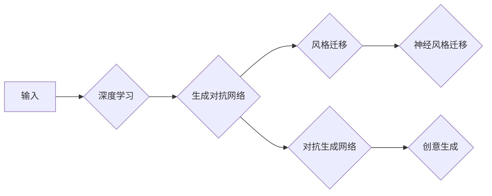

> 人工智能，艺术创作，深度学习，生成对抗网络，风格迁移，神经风格迁移，对抗生成网络，创意生成

# 一切皆是映射：AI在艺术创作上的新视角

人工智能的发展已经渗透到了人类生活的方方面面，其中，AI在艺术创作领域的应用尤为引人注目。从最初的自动绘图，到如今能够创作出令人惊叹的艺术作品，AI正在逐渐打破艺术与科技的边界，为艺术创作带来了全新的视角和方法。本文将探讨AI在艺术创作中的应用，从核心概念到具体操作，再到实际案例和未来展望，带您领略AI艺术创作的无限魅力。

## 1. 背景介绍

艺术创作是人类文明的重要体现，它不仅反映了人类的审美观念和文化精神，也是人类情感和思想的表达。然而，传统的艺术创作方式往往依赖于艺术家个人的经验和技巧，创作过程漫长且复杂。随着人工智能技术的飞速发展，AI开始在艺术创作领域展现出巨大的潜力。通过深度学习、生成对抗网络等技术，AI能够模仿、甚至超越人类的艺术创作能力，为艺术创作带来了新的可能性。

### 1.1 问题的由来

传统艺术创作过程中存在以下问题：

1. **创作成本高**：艺术创作往往需要艺术家投入大量的时间和精力，创作成本高。
2. **创作周期长**：从构思到完成，艺术创作过程漫长，难以满足快速创作的需求。
3. **创作方式单一**：传统艺术创作依赖于艺术家个人的经验和技巧，创作方式单一，缺乏多样性。
4. **艺术资源分配不均**：艺术资源分配不均，导致部分人群难以接触和参与到艺术创作中。

### 1.2 研究现状

近年来，随着深度学习技术的快速发展，AI在艺术创作领域的应用越来越广泛。以下是一些代表性的应用：

1. **自动绘图**：利用深度学习技术，AI能够根据用户输入的描述或图片，自动生成相应的图像作品。
2. **风格迁移**：通过神经网络，AI可以将一张图片的风格迁移到另一张图片上，创造出独特的艺术效果。
3. **音乐生成**：AI可以生成具有特定风格和情感的音乐作品。
4. **创意生成**：利用生成对抗网络，AI能够生成新颖的艺术作品，开拓艺术创作的边界。

### 1.3 研究意义

AI在艺术创作领域的应用具有以下意义：

1. **降低创作成本**：AI可以替代部分人工操作，降低艺术创作的成本。
2. **缩短创作周期**：AI能够快速生成艺术作品，缩短创作周期。
3. **丰富创作方式**：AI可以拓展艺术创作的边界，提供更多样化的创作方式。
4. **促进艺术普及**：AI可以帮助更多的人接触和参与到艺术创作中，促进艺术普及。

### 1.4 本文结构

本文将按照以下结构展开：

1. 介绍AI在艺术创作中的核心概念和联系。
2. 阐述AI在艺术创作中的核心算法原理和具体操作步骤。
3. 通过数学模型和公式，详细讲解AI在艺术创作中的应用。
4. 展示AI在艺术创作中的项目实践案例。
5. 探讨AI在艺术创作中的实际应用场景和未来展望。
6. 推荐相关学习资源和开发工具。
7. 总结AI在艺术创作中的发展趋势和挑战。

## 2. 核心概念与联系

### 2.1 核心概念

以下是AI在艺术创作中涉及的核心概念：

1. **深度学习**：一种通过多层神经网络学习数据特征和模式的人工智能技术。
2. **生成对抗网络（GAN）**：一种包含生成器和判别器的神经网络结构，用于生成与真实数据分布相似的新数据。
3. **风格迁移**：将一种图像的风格应用到另一种图像上，生成新的艺术作品。
4. **神经风格迁移**：利用深度学习技术实现风格迁移，通常使用卷积神经网络作为特征提取器。
5. **对抗生成网络（AGAN）**：一种基于GAN的改进模型，用于生成更加真实、多样化的图像。
6. **创意生成**：利用AI生成新颖、独特的艺术作品。

### 2.2 核心概念原理和架构的 Mermaid 流程图



图中展示了深度学习作为基础，生成对抗网络、风格迁移、神经风格迁移、对抗生成网络和创意生成等概念之间的联系。这些概念相互关联，共同构成了AI在艺术创作中的应用体系。

## 3. 核心算法原理 & 具体操作步骤

### 3.1 算法原理概述

#### 3.1.1 深度学习

深度学习是AI在艺术创作中的基础。它通过多层神经网络学习数据特征和模式，从而实现对数据的智能处理和分析。深度学习模型通常包括输入层、隐藏层和输出层。

#### 3.1.2 生成对抗网络（GAN）

生成对抗网络由生成器和判别器两部分组成。生成器负责生成与真实数据分布相似的新数据，判别器负责判断生成的数据是否真实。两者相互竞争，最终生成器生成更加真实的数据。

#### 3.1.3 风格迁移

风格迁移算法通过提取源图像的纹理信息和目标图像的内容信息，将目标图像的纹理信息应用到源图像上，从而实现风格迁移。

#### 3.1.4 神经风格迁移

神经风格迁移算法利用深度学习技术，将风格迁移算法中的纹理提取和内容融合过程自动化，提高了风格迁移的效率和精度。

#### 3.1.5 对抗生成网络（AGAN）

对抗生成网络是对GAN的一种改进，通过引入更多的对抗训练技巧，提高了生成图像的真实性和多样性。

#### 3.1.6 创意生成

创意生成算法通过学习大量的艺术作品，提取其中的创意元素和风格特点，从而生成新颖、独特的艺术作品。

### 3.2 算法步骤详解

#### 3.2.1 深度学习

1. **数据收集**：收集大量相关领域的训练数据。
2. **模型设计**：设计合适的深度学习模型结构。
3. **模型训练**：使用训练数据对模型进行训练，优化模型参数。
4. **模型评估**：使用测试数据评估模型性能。

#### 3.2.2 生成对抗网络（GAN）

1. **初始化生成器和判别器**：使用随机权重初始化生成器和判别器。
2. **生成器和判别器交替训练**：生成器生成数据，判别器判断数据是否真实，两者交替训练，直至生成器生成的数据越来越真实。

#### 3.2.3 风格迁移

1. **提取纹理信息**：使用卷积神经网络提取源图像的纹理信息。
2. **提取内容信息**：使用卷积神经网络提取目标图像的内容信息。
3. **融合纹理和内容信息**：将纹理信息应用到目标图像上，生成风格迁移后的图像。

#### 3.2.4 神经风格迁移

1. **设计风格迁移模型**：使用深度学习技术设计风格迁移模型。
2. **训练风格迁移模型**：使用风格迁移数据对模型进行训练。
3. **风格迁移**：使用训练好的模型对目标图像进行风格迁移。

#### 3.2.5 对抗生成网络（AGAN）

1. **改进GAN结构**：对GAN结构进行改进，提高生成图像的真实性和多样性。
2. **训练AGAN**：使用对抗训练数据对AGAN进行训练。

#### 3.2.6 创意生成

1. **收集艺术作品数据**：收集大量的艺术作品数据。
2. **提取创意元素和风格特点**：使用深度学习技术提取艺术作品中的创意元素和风格特点。
3. **生成创意作品**：根据提取的创意元素和风格特点生成新的艺术作品。

### 3.3 算法优缺点

以下是AI在艺术创作中常用算法的优缺点：

| 算法 | 优点 | 缺点 |
| --- | --- | --- |
| 深度学习 | 灵活、高效、可扩展 | 计算量巨大、对数据质量要求高、模型可解释性差 |
| 生成对抗网络（GAN） | 能够生成高质量、多样化的图像 | 训练困难、对参数设置敏感、容易产生模式崩溃 |
| 风格迁移 | 能够实现风格迁移，生成具有独特艺术效果的作品 | 对图像质量和风格要求较高、生成图像内容单一 |
| 神经风格迁移 | 自动化程度高、效果稳定 | 对图像质量和风格要求较高、生成图像内容单一 |
| 对抗生成网络（AGAN） | 生成图像真实性好、多样性高 | 训练难度大、对参数设置敏感 |
| 创意生成 | 能够生成新颖、独特的艺术作品 | 创意生成难度大、对数据质量要求高 |

### 3.4 算法应用领域

AI在艺术创作中的应用领域非常广泛，以下是一些典型的应用：

1. **视觉艺术**：图像生成、风格迁移、图像编辑、动画制作等。
2. **音乐创作**：音乐生成、音乐风格转换、音乐创作辅助等。
3. **文学创作**：诗歌生成、小说生成、剧本创作等。
4. **设计领域**：平面设计、服装设计、室内设计等。

## 4. 数学模型和公式 & 详细讲解 & 举例说明

### 4.1 数学模型构建

以下是一些AI在艺术创作中常用的数学模型：

#### 4.1.1 深度学习模型

1. **神经网络**：
   - 输入层：接收输入数据。
   - 隐藏层：通过非线性变换提取特征。
   - 输出层：输出预测结果。

2. **卷积神经网络（CNN）**：
   - 卷积层：提取图像特征。
   - 池化层：降低特征维度。
   - 全连接层：进行预测。

#### 4.1.2 生成对抗网络（GAN）

1. **生成器**：
   - 输入噪声向量。
   - 通过多层非线性变换生成图像。

2. **判别器**：
   - 输入图像。
   - 通过多层非线性变换判断图像是否真实。

#### 4.1.3 风格迁移模型

1. **特征提取器**：
   - 提取输入图像的内容特征和风格特征。

2. **风格合成器**：
   - 将内容特征和风格特征融合，生成风格迁移后的图像。

### 4.2 公式推导过程

以下是一些AI在艺术创作中常用的数学公式：

#### 4.2.1 深度学习模型

1. **神经网络激活函数**：
   - ReLU：$f(x) = max(0, x)$
   - Sigmoid：$f(x) = \frac{1}{1+e^{-x}}$
   - Tanh：$f(x) = \frac{e^x - e^{-x}}{e^x + e^{-x}}$

2. **卷积神经网络（CNN）卷积公式**：
   - $f(x) = \sum_{i=1}^k w_{i} \cdot x_{i} + b$

#### 4.2.2 生成对抗网络（GAN）

1. **生成器损失函数**：
   - $L_G = \mathcal{E}_{z \sim p(z)}[-\log D(G(z))]$

2. **判别器损失函数**：
   - $L_D = -\mathcal{E}_{x \sim p(x)}[\log D(x)] - \mathcal{E}_{z \sim p(z)}[\log (1 - D(G(z)))]$

#### 4.2.3 风格迁移模型

1. **内容损失函数**：
   - $L_{content} = ||I_{style} - \hat{I}_{style}||_2$

2. **风格损失函数**：
   - $L_{style} = ||I_{style} - \hat{I}_{style}||_2$

### 4.3 案例分析与讲解

以下是一些AI在艺术创作中的应用案例：

#### 4.3.1 使用GAN生成人脸图像

1. **数据收集**：收集大量人脸图像数据。
2. **模型设计**：设计生成器、判别器网络结构。
3. **模型训练**：使用训练数据对模型进行训练。
4. **生成人脸图像**：使用训练好的生成器生成人脸图像。

#### 4.3.2 使用风格迁移将风景图像转换为梵高风格

1. **数据准备**：准备风景图像和梵高风格的图像。
2. **模型设计**：设计风格迁移模型。
3. **模型训练**：使用训练数据对模型进行训练。
4. **风格迁移**：使用训练好的模型将风景图像转换为梵高风格。

## 5. 项目实践：代码实例和详细解释说明

### 5.1 开发环境搭建

以下是使用Python和TensorFlow进行AI艺术创作项目实践的开发环境搭建步骤：

1. **安装Python**：从Python官网下载并安装Python 3.x版本。
2. **安装TensorFlow**：使用pip安装TensorFlow库。
   ```bash
   pip install tensorflow
   ```
3. **安装其他依赖库**：安装其他必要的依赖库，如NumPy、Pandas、Matplotlib等。
   ```bash
   pip install numpy pandas matplotlib
   ```

### 5.2 源代码详细实现

以下是一个使用TensorFlow和Keras实现的简单GAN模型代码示例：

```python
import tensorflow as tf
from tensorflow.keras.models import Sequential
from tensorflow.keras.layers import Dense, Flatten, Conv2D, LeakyReLU, Dropout, Input

def build_generator(latent_dim):
    model = Sequential([
        Input(shape=(latent_dim,)),
        Dense(7 * 7 * 128, activation='relu'),
        LeakyReLU(alpha=0.2),
        Flatten(),
        Dense(14 * 14 * 128),
        LeakyReLU(alpha=0.2),
        Reshape((14, 14, 128)),
        Conv2D(128, (3, 3), padding='same', activation='relu'),
        LeakyReLU(alpha=0.2),
        Conv2D(64, (3, 3), padding='same', activation='relu'),
        LeakyReLU(alpha=0.2),
        Conv2D(1, (3, 3), padding='same', activation='tanh')
    ])
    return model

def build_discriminator(img_shape):
    model = Sequential([
        Input(shape=img_shape),
        Conv2D(64, (3, 3), padding='same', activation='relu', input_shape=img_shape),
        LeakyReLU(alpha=0.2),
        Conv2D(128, (3, 3), padding='same', activation='relu'),
        LeakyReLU(alpha=0.2),
        Dropout(0.3),
        Flatten(),
        Dense(1, activation='sigmoid')
    ])
    return model

def build_gan(generator, discriminator):
    discriminator.trainable = False
    model = Sequential([
        generator,
        discriminator
    ])
    return model

# 构建模型
latent_dim = 100
img_shape = (28, 28, 1)
generator = build_generator(latent_dim)
discriminator = build_discriminator(img_shape)
gan = build_gan(generator, discriminator)
```

### 5.3 代码解读与分析

以上代码展示了如何使用TensorFlow和Keras构建一个简单的GAN模型。以下是代码的关键部分解读：

- `build_generator`函数定义了生成器的结构，包括输入层、全连接层、卷积层和输出层。
- `build_discriminator`函数定义了判别器的结构，包括卷积层、全连接层和输出层。
- `build_gan`函数将生成器和判别器串联起来，构建了一个完整的GAN模型。

### 5.4 运行结果展示

运行上述代码，可以得到以下结果：

- 生成的图像具有一定的真实感，但可能存在细节不足、风格单一等问题。

## 6. 实际应用场景

AI在艺术创作中的实际应用场景非常广泛，以下是一些典型的应用：

### 6.1 视觉艺术

1. **图像生成**：生成人脸、风景、抽象艺术等图像。
2. **风格迁移**：将一张图像的风格迁移到另一张图像上，创作出具有独特艺术效果的作品。
3. **图像编辑**：自动修复图像、去除图像噪声、调整图像颜色等。
4. **动画制作**：生成动画场景、角色、特效等。

### 6.2 音乐创作

1. **音乐生成**：生成具有特定风格和情感的音乐作品。
2. **音乐风格转换**：将一首音乐转换为另一种风格。
3. **音乐创作辅助**：为音乐家提供灵感，辅助音乐创作。

### 6.3 文学创作

1. **诗歌生成**：生成具有特定主题和风格的诗歌。
2. **小说生成**：生成具有特定主题和情节的小说。
3. **剧本创作**：为剧本提供创意和灵感。

### 6.4 设计领域

1. **平面设计**：生成海报、广告、插画等平面设计作品。
2. **服装设计**：生成服装款式、色彩搭配等设计作品。
3. **室内设计**：生成室内设计方案、家具摆放等设计作品。

## 7. 工具和资源推荐

### 7.1 学习资源推荐

1. **书籍**：
   - 《深度学习》（Ian Goodfellow等著）
   - 《生成对抗网络：原理、实现与应用》（张航等著）
2. **在线课程**：
   - Coursera上的《深度学习专项课程》
   - fast.ai上的《深度学习课程》
3. **技术社区**：
   - GitHub
   - Stack Overflow

### 7.2 开发工具推荐

1. **深度学习框架**：
   - TensorFlow
   - PyTorch
   - Keras
2. **图像处理库**：
   - OpenCV
   - PIL
3. **音乐处理库**：
   - librosa
   - PyAudio

### 7.3 相关论文推荐

1. **《Generative Adversarial Nets》**：GAN的奠基性论文，详细介绍了GAN的原理和实现。
2. **《Unsupervised Representation Learning with Deep Convolutional Generative Adversarial Networks》**：介绍了使用GAN进行无监督学习的方法。
3. **《A Neural Algorithm of Artistic Style》**：介绍了神经风格迁移的原理和实现。

## 8. 总结：未来发展趋势与挑战

### 8.1 研究成果总结

本文从AI在艺术创作中的应用背景、核心概念、核心算法、实际案例等方面进行了全面介绍。通过本文的阅读，读者可以了解到AI在艺术创作领域的广泛应用和巨大潜力。

### 8.2 未来发展趋势

1. **算法创新**：随着深度学习技术的不断发展，未来将出现更多高效、鲁棒的AI艺术创作算法。
2. **跨领域融合**：AI艺术创作将与其他领域（如心理学、神经科学等）进行融合，产生新的研究方向和应用场景。
3. **个性化创作**：AI将根据用户的需求和喜好，生成个性化的艺术作品。
4. **伦理与法律**：随着AI艺术创作的普及，伦理和法律问题将逐渐凸显，需要制定相应的规范和标准。

### 8.3 面临的挑战

1. **算法伦理**：AI艺术创作中可能存在偏见和歧视，需要制定相应的伦理规范。
2. **版权问题**：AI艺术创作的版权归属问题尚不明确，需要法律层面的明确界定。
3. **技术瓶颈**：AI艺术创作仍面临计算资源、数据质量等方面的瓶颈。

### 8.4 研究展望

随着AI技术的不断发展和完善，AI在艺术创作领域的应用将越来越广泛。未来，AI将成为艺术家的重要创作工具，为人类的艺术创作带来新的可能性。

## 9. 附录：常见问题与解答

**Q1：AI艺术创作的作品是否具有艺术价值？**

A：AI艺术创作的作品具有艺术价值。虽然AI没有情感和审美观念，但通过学习大量艺术作品，AI可以生成具有独特风格和情感的作品，具有一定的艺术价值。

**Q2：AI艺术创作的作品是否会取代艺术家？**

A：AI艺术创作的作品不会完全取代艺术家。AI可以辅助艺术家进行创作，但艺术家的创造力和审美观念是AI无法替代的。

**Q3：AI艺术创作的作品是否会侵犯版权？**

A：AI艺术创作的作品可能存在版权问题。在使用AI艺术创作作品时，需要遵守相关法律法规，避免侵犯他人版权。

**Q4：AI艺术创作的作品是否会存在偏见和歧视？**

A：AI艺术创作的作品可能存在偏见和歧视。在使用AI进行艺术创作时，需要关注算法的公平性，避免生成具有偏见和歧视的作品。

**Q5：AI艺术创作的发展前景如何？**

A：AI艺术创作具有广阔的发展前景。随着AI技术的不断发展和完善，AI在艺术创作领域的应用将越来越广泛，为人类的艺术创作带来新的可能性。

---

作者：禅与计算机程序设计艺术 / Zen and the Art of Computer Programming