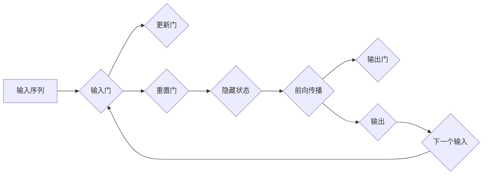

# 从零开始大模型开发与微调：什么是GRU

> 关键词：GRU, 循环神经网络, LSTM, 长短时记忆，序列模型，深度学习，自然语言处理，时间序列分析，机器学习

## 1. 背景介绍

随着深度学习技术的飞速发展，序列模型在自然语言处理（NLP）、时间序列分析等领域取得了显著的成果。其中，循环神经网络（RNN）及其变体在处理序列数据方面表现出色。GRU（Gated Recurrent Unit）是RNN的一种变体，它在捕捉序列中长距离依赖方面表现出比传统RNN更优越的性能。本文将从零开始，详细介绍GRU的核心概念、算法原理、实现步骤，并探讨其在实际应用中的前景。

## 2. 核心概念与联系

### 2.1 核心概念

#### 2.1.1 循环神经网络（RNN）

循环神经网络（RNN）是一种特殊的神经网络，它具有循环连接，允许信息在序列的不同时间步之间流动。RNN的核心思想是使用相同的神经网络结构处理序列中的每个元素，从而捕捉序列中的长期依赖关系。

#### 2.1.2 LSTM（Long Short-Term Memory）

LSTM是RNN的一种变体，它通过引入门控机制（包括输入门、遗忘门和输出门）来控制信息的流入、流出和保留，从而有效地捕捉长距离依赖关系。

#### 2.1.3 GRU（Gated Recurrent Unit）

GRU是LSTM的简化版，它通过引入更新门和重置门来替代LSTM的三个门控机制，简化了模型结构，同时保持了在捕捉长距离依赖方面的有效性。

### 2.2 Mermaid流程图

以下是一个简化的GRU流程图，展示了GRU在不同时间步的计算过程：



### 2.3 核心概念联系

GRU通过简化LSTM的架构，降低了模型的复杂度，同时保持了在捕捉长距离依赖方面的性能。GRU在实现上更加直观，计算效率更高，因此在许多NLP和时间序列分析任务中得到广泛应用。

## 3. 核心算法原理 & 具体操作步骤

### 3.1 算法原理概述

GRU通过更新门和重置门来控制信息的流动。更新门决定多少信息从上一个隐藏状态传递到当前隐藏状态，重置门则决定多少信息从上一个隐藏状态保留到当前隐藏状态。

### 3.2 算法步骤详解

#### 3.2.1 输入门（Update Gate）

输入门决定从输入序列中提取多少信息，用于更新当前隐藏状态。其计算公式如下：

$$
u_t = \sigma(W_u [h_{t-1}, x_t] + b_u)
$$

其中，$u_t$ 是更新门，$\sigma$ 是sigmoid激活函数，$W_u$ 是权重矩阵，$b_u$ 是偏置项，$h_{t-1}$ 是上一个隐藏状态，$x_t$ 是当前输入。

#### 3.2.2 重置门（Reset Gate）

重置门决定多少信息从上一个隐藏状态保留到当前隐藏状态。其计算公式如下：

$$
r_t = \sigma(W_r [h_{t-1}, x_t] + b_r)
$$

其中，$r_t$ 是重置门，其余参数与更新门相同。

#### 3.2.3 更新当前隐藏状态

当前隐藏状态 $h_t$ 通过以下公式计算：

$$
h_t = (1 - u_t) \cdot h_{t-1} + u_t \cdot \tanh(W \cdot (r_t \cdot h_{t-1} + W_x \cdot x_t) + b)
$$

其中，$W$ 是权重矩阵，$b$ 是偏置项，$\tanh$ 是双曲正切激活函数。

#### 3.2.4 输出门（Output Gate）

输出门决定当前隐藏状态中哪些信息用于生成当前输出。其计算公式如下：

$$
o_t = \sigma(W_o [h_t, x_t] + b_o)
$$

其中，$o_t$ 是输出门，其余参数与更新门相同。

#### 3.2.5 当前输出

当前输出 $y_t$ 通过以下公式计算：

$$
y_t = o_t \cdot \tanh(h_t)
$$

### 3.3 算法优缺点

#### 3.3.1 优点

- 简化模型结构，提高计算效率。
- 在捕捉长距离依赖方面具有与LSTM相当的性能。
- 更容易实现和调试。

#### 3.3.2 缺点

- 对于某些复杂的序列模型，GRU可能无法捕捉到足够的信息。
- 与LSTM相比，GRU的参数数量更少，可能无法完全捕捉复杂特征。

### 3.4 算法应用领域

GRU在以下领域得到广泛应用：

- 自然语言处理：文本分类、情感分析、机器翻译等。
- 时间序列分析：股票价格预测、天气预测等。
- 图像处理：视频分析、动作识别等。

## 4. 数学模型和公式 & 详细讲解 & 举例说明

### 4.1 数学模型构建

GRU的数学模型主要由以下部分组成：

- 权重矩阵 $W_u, W_r, W_x, W_o$
- 偏置项 $b_u, b_r, b_x, b_o$
- sigmoid激活函数
- 双曲正切激活函数

### 4.2 公式推导过程

GRU的公式推导过程已在3.2节中详细介绍。

### 4.3 案例分析与讲解

以下是一个简单的GRU示例，用于文本分类任务：

- 输入序列：["The", "cat", "sat", "on", "the", "mat"]
- 标签：1（表示猫）

我们将使用PyTorch框架实现GRU模型。

```python
import torch
import torch.nn as nn

class GRU(nn.Module):
    def __init__(self, input_size, hidden_size, output_size):
        super(GRU, self).__init__()
        self.hidden_size = hidden_size
        self.gru = nn.GRU(input_size, hidden_size, batch_first=True)
        self.fc = nn.Linear(hidden_size, output_size)

    def forward(self, x):
        h0 = torch.zeros(1, x.size(0), self.hidden_size).to(x.device)
        out, _ = self.gru(x, h0)
        out = self.fc(out[:, -1, :])
        return out

# 模型参数
input_size = 10
hidden_size = 20
output_size = 2

# 实例化模型
model = GRU(input_size, hidden_size, output_size)

# 输入数据
x = torch.randn(1, 5, input_size)

# 前向传播
output = model(x)
print(output)
```

## 5. 项目实践：代码实例和详细解释说明

### 5.1 开发环境搭建

为了实现GRU模型，我们需要以下开发环境：

- Python 3.x
- PyTorch 1.x
- Jupyter Notebook（可选）

### 5.2 源代码详细实现

以下是一个使用PyTorch实现GRU的完整代码示例：

```python
import torch
import torch.nn as nn

class GRU(nn.Module):
    def __init__(self, input_size, hidden_size, output_size):
        super(GRU, self).__init__()
        self.hidden_size = hidden_size
        self.gru = nn.GRU(input_size, hidden_size, batch_first=True)
        self.fc = nn.Linear(hidden_size, output_size)

    def forward(self, x):
        h0 = torch.zeros(1, x.size(0), self.hidden_size).to(x.device)
        out, _ = self.gru(x, h0)
        out = self.fc(out[:, -1, :])
        return out

# 模型参数
input_size = 10
hidden_size = 20
output_size = 2

# 实例化模型
model = GRU(input_size, hidden_size, output_size)

# 输入数据
x = torch.randn(1, 5, input_size)

# 前向传播
output = model(x)
print(output)
```

### 5.3 代码解读与分析

- `GRU` 类继承自 `nn.Module`，实现了 `__init__` 和 `forward` 方法。
- `__init__` 方法中，我们设置了隐藏层大小、GRU层和线性层。
- `forward` 方法中，我们首先创建了一个全零的初始隐藏状态 `h0`，然后通过GRU层和线性层进行前向传播，得到最终的输出。

### 5.4 运行结果展示

运行上述代码，将输出GRU模型在输入数据上的输出。由于输入数据是随机生成的，输出结果也将是随机的。

## 6. 实际应用场景

GRU在实际应用中非常广泛，以下是一些常见的应用场景：

- 文本分类：如情感分析、主题分类、意图识别等。
- 时间序列分析：如股票价格预测、天气预测等。
- 视频分析：如动作识别、事件检测等。

## 7. 工具和资源推荐

### 7.1 学习资源推荐

- 《深度学习》：由Ian Goodfellow、Yoshua Bengio和Aaron Courville合著，是深度学习领域的经典教材。
- 《PyTorch深度学习》：由Adrian Rosebrock和Lars Hagens合著，详细介绍了PyTorch框架的使用方法。
- Hugging Face官网：提供了大量的预训练模型和工具，方便开发者进行GRU模型的实践。

### 7.2 开发工具推荐

- Jupyter Notebook：用于数据探索、实验和可视化。
- PyTorch：用于深度学习模型开发和训练。
- Google Colab：提供免费的GPU和TPU资源，方便在线实验。

### 7.3 相关论文推荐

- "Sequence to Sequence Learning with Neural Networks"：介绍了序列到序列学习，为GRU模型的应用奠定了基础。
- "A Theoretically Grounded Application of Dropout in Recurrent Neural Networks"：介绍了Dropout在RNN中的应用，有助于提高模型的鲁棒性。

## 8. 总结：未来发展趋势与挑战

### 8.1 研究成果总结

GRU作为RNN的一种变体，在处理序列数据方面表现出色。它通过简化LSTM的架构，降低了模型的复杂度，同时保持了在捕捉长距离依赖方面的性能。

### 8.2 未来发展趋势

- 将GRU与其他神经网络结构相结合，如Transformer，构建更强大的序列模型。
- 探索GRU在多模态数据中的应用，如文本-图像序列分析。
- 研究更高效的GRU训练方法，提高模型的训练速度。

### 8.3 面临的挑战

- GRU在处理长序列数据时，可能存在梯度消失或梯度爆炸的问题。
- GRU的参数数量相对较多，训练过程中需要大量的计算资源。

### 8.4 研究展望

随着深度学习技术的不断发展，GRU将在更多领域得到应用，为序列数据分析和处理提供更强大的工具。

## 9. 附录：常见问题与解答

**Q1：GRU和LSTM有什么区别？**

A1：GRU是LSTM的简化版，通过引入更新门和重置门来替代LSTM的三个门控机制，简化了模型结构，同时保持了在捕捉长距离依赖方面的性能。

**Q2：GRU适用于哪些任务？**

A2：GRU在自然语言处理、时间序列分析、视频分析等领域得到广泛应用。

**Q3：如何解决GRU的梯度消失和梯度爆炸问题？**

A3：可以通过以下方法解决：
- 使用更小的学习率。
- 使用梯度裁剪技术。
- 使用残差连接。

**Q4：如何选择GRU的隐藏层大小？**

A4：隐藏层大小取决于具体任务和数据集。一般来说，隐藏层大小在几十到几百之间。

**Q5：GRU和Transformer相比有哪些优缺点？**

A5：与Transformer相比，GRU在计算效率方面具有优势，但在捕捉长距离依赖方面可能不如Transformer。此外，GRU的模型结构更简单，更容易实现和调试。

---

作者：禅与计算机程序设计艺术 / Zen and the Art of Computer Programming