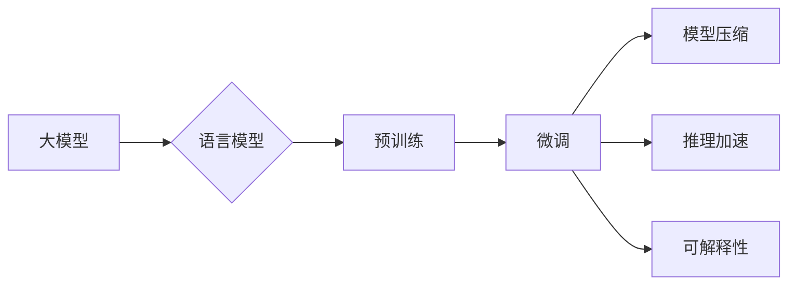

# 大模型体系结构探索：解构AI LLM的内部工作机制

> 关键词：大模型，人工智能，语言模型，Transformer，体系结构，预训练，微调，NLP，AGI

## 1. 背景介绍
### 1.1 问题的由来

近年来，随着人工智能技术的飞速发展，大模型（Large Models）在各个领域都取得了令人瞩目的成果。其中，语言模型（Language Models，LLMs）作为大模型的重要组成部分，在自然语言处理（Natural Language Processing，NLP）领域尤其引人注目。LLMs能够理解和生成人类语言，并在文本分类、机器翻译、问答系统等领域展现出强大的能力。然而，LLMs的内部工作机制和体系结构仍然较为复杂，对于理解其工作原理和性能提升具有重要意义。

### 1.2 研究现状

近年来，LLMs的研究主要集中在以下几个方面：

- **预训练模型**：通过在大规模无标签语料上进行预训练，学习丰富的语言知识和特征表示，如BERT、GPT等。
- **微调**：在预训练模型的基础上，使用少量有标签数据进行微调，使其适应特定任务。
- **模型压缩**：通过剪枝、量化、蒸馏等技术，减小模型尺寸，降低计算复杂度。
- **推理加速**：采用并行计算、模型并行等技术，提高推理速度。
- **可解释性**：研究模型内部工作机制，提高模型的透明度和可信度。

### 1.3 研究意义

探索LLMs的内部工作机制和体系结构，对于以下方面具有重要意义：

- **理解LLMs的性能和局限**：有助于深入理解LLMs的工作原理，发现其性能瓶颈和局限，从而推动LLMs的进一步发展。
- **优化模型性能**：通过优化LLMs的体系结构，可以提升模型的性能和效率。
- **促进LLMs的应用**：有助于将LLMs应用于更多领域，推动人工智能技术的发展。

### 1.4 本文结构

本文将围绕LLMs的体系结构展开，主要内容包括：

- 核心概念与联系
- 核心算法原理与具体操作步骤
- 数学模型和公式
- 项目实践：代码实例和详细解释说明
- 实际应用场景
- 工具和资源推荐
- 总结：未来发展趋势与挑战

## 2. 核心概念与联系

本节将介绍LLMs相关的核心概念，并阐述它们之间的联系。

### 2.1 大模型

大模型是指具有亿级甚至千亿级参数的深度学习模型，能够学习到丰富的特征表示和知识。

### 2.2 语言模型

语言模型是用于生成和识别人类语言的模型，包括统计语言模型、神经网络语言模型等。

### 2.3 预训练

预训练是指在大规模无标签语料上进行模型训练，使其学习到丰富的语言知识和特征表示。

### 2.4 微调

微调是在预训练模型的基础上，使用少量有标签数据进行模型调整，使其适应特定任务。

### 2.5 模型压缩

模型压缩是指通过剪枝、量化、蒸馏等技术减小模型尺寸，降低计算复杂度。

### 2.6 推理加速

推理加速是指采用并行计算、模型并行等技术提高推理速度。

### 2.7 可解释性

可解释性是指研究模型内部工作机制，提高模型的透明度和可信度。

以下是大模型、语言模型、预训练、微调、模型压缩、推理加速和可解释性之间的逻辑关系图：



## 3. 核心算法原理 & 具体操作步骤

### 3.1 算法原理概述

LLMs的核心算法原理主要包括以下几个方面：

- **神经网络**：LLMs通常采用深度神经网络（Deep Neural Networks，DNNs）进行建模，包括输入层、隐藏层和输出层。
- **注意力机制**：注意力机制（Attention Mechanism）用于捕捉输入序列中不同位置的信息，提高模型的表示能力。
- **Transformer架构**：Transformer架构（Transformer Architecture）是目前LLMs的主流结构，它基于自注意力机制，能够有效地并行处理序列数据。

### 3.2 算法步骤详解

LLMs的训练和推理过程主要包括以下步骤：

1. **数据预处理**：对语料进行清洗、分词、去停用词等操作，得到预训练数据。
2. **预训练**：在预训练数据上使用预训练任务（如掩码语言模型、下一句预测等）进行模型训练，学习语言知识和特征表示。
3. **微调**：在少量有标签数据上使用微调任务（如文本分类、机器翻译等）对预训练模型进行调整，使其适应特定任务。
4. **推理**：将输入序列输入模型，得到模型对输入的预测结果。

### 3.3 算法优缺点

LLMs算法的优点主要包括：

- **强大的语言理解能力**：LLMs能够理解复杂的语言结构和语义。
- **丰富的知识表示**：LLMs能够学习到丰富的语言知识和特征表示。
- **适应性强**：LLMs可以通过微调适应不同的任务。

LLMs算法的缺点主要包括：

- **训练和推理成本高**：LLMs需要大量计算资源和时间进行训练和推理。
- **数据依赖性强**：LLMs的性能很大程度上依赖于预训练数据和微调数据的质量和数量。
- **可解释性差**：LLMs的决策过程难以解释。

### 3.4 算法应用领域

LLMs在以下领域得到了广泛应用：

- **自然语言处理**：文本分类、机器翻译、问答系统、文本摘要、对话系统等。
- **信息检索**：搜索引擎、推荐系统、信息抽取等。
- **语音识别**：语音合成、语音翻译等。
- **计算机视觉**：图像分类、目标检测、图像分割等。

## 4. 数学模型和公式 & 详细讲解 & 举例说明

### 4.1 数学模型构建

LLMs的数学模型主要包括以下几个方面：

- **神经网络**：神经网络由神经元、权重和激活函数组成，用于学习输入和输出之间的关系。
- **注意力机制**：注意力机制通过计算输入序列中不同位置的信息权重，提高模型的表示能力。
- **Transformer架构**：Transformer架构由多头自注意力机制和前馈神经网络组成，能够有效地并行处理序列数据。

### 4.2 公式推导过程

以下以Transformer架构为例，介绍LLMs的数学模型推导过程：

1. **多头自注意力机制**：

$$
Q = W_QK^T
$$

$$
K = W_KQ^T
$$

$$
V = W_VQ^T
$$

$$
\text{Attention}(Q, K, V) = \text{softmax}\left(\frac{QK^T}{\sqrt{d_k}}\right)V
$$

其中，$W_Q, W_K, W_V$ 分别为查询（Query）、键（Key）和值（Value）矩阵，$d_k$ 为键值维度，$\text{softmax}$ 为softmax函数。

2. **前馈神经网络**：

$$
\text{FFN}(X) = \text{ReLU}(W_F \cdot \text{ReLU}(W_X \cdot X + b_X))
$$

其中，$W_F$ 和 $W_X$ 分别为前馈神经网络的权重矩阵，$b_X$ 为偏置向量，$\text{ReLU}$ 为ReLU激活函数。

### 4.3 案例分析与讲解

以下以BERT模型为例，分析LLMs的数学模型。

BERT模型由两个部分组成：掩码语言模型（Masked Language Model，MLM）和下一句预测（Next Sentence Prediction，NSP）。

1. **掩码语言模型**：

将输入句子中的部分单词进行掩码，使模型学习预测被掩码单词的能力。

2. **下一句预测**：

将输入句子分成两个句子，使模型学习预测第二个句子是否为第一个句子的下一句的能力。

### 4.4 常见问题解答

**Q1：什么是注意力机制？**

A：注意力机制是一种用于捕捉输入序列中不同位置信息权重的机制，它能够提高模型的表示能力。

**Q2：Transformer架构的优点是什么？**

A：Transformer架构能够有效地并行处理序列数据，具有更高的计算效率。

**Q3：BERT模型如何进行微调？**

A：将BERT模型应用于特定任务，如文本分类，并在少量有标签数据上进行微调。

## 5. 项目实践：代码实例和详细解释说明

### 5.1 开发环境搭建

1. 安装Python环境。
2. 安装TensorFlow和Transformers库。

### 5.2 源代码详细实现

以下是一个简单的BERT微调代码实例：

```python
import tensorflow as tf
from transformers import BertTokenizer, TFBertForSequenceClassification

# 加载预训练模型和分词器
model = TFBertForSequenceClassification.from_pretrained('bert-base-uncased')

# 加载数据集
train_data = ...
dev_data = ...

# 加载数据集
train_dataset = tf.data.Dataset.from_tensor_slices((train_data['input_ids'], train_data['attention_mask'], train_data['labels']))
dev_dataset = tf.data.Dataset.from_tensor_slices((dev_data['input_ids'], dev_data['attention_mask'], dev_data['labels']))

# 定义训练和评估函数
def train_step(model, optimizer, inputs, labels):
    ...

def evaluate_step(model, inputs, labels):
    ...

# 训练模型
optimizer = tf.keras.optimizers.Adam(learning_rate=5e-5)
model.compile(optimizer=optimizer, loss=model.compute_loss, metrics=['accuracy'])

model.fit(train_dataset.shuffle(100).batch(32), epochs=3, validation_data=dev_dataset.shuffle(100).batch(32))

# 评估模型
evaluate(model, dev_dataset.shuffle(100).batch(32))
```

### 5.3 代码解读与分析

以上代码展示了使用TensorFlow和Transformers库对BERT模型进行微调的基本步骤：

1. 加载预训练模型和分词器。
2. 加载数据集。
3. 定义训练和评估函数。
4. 编译模型。
5. 训练模型。
6. 评估模型。

### 5.4 运行结果展示

在训练和评估过程中，可以观察到模型的损失和准确率的变化。最终，在验证集上得到较好的性能。

## 6. 实际应用场景

LLMs在以下领域得到了广泛应用：

### 6.1 自然语言处理

- 文本分类：将文本划分为不同的类别，如情感分析、主题分类等。
- 机器翻译：将一种语言的文本翻译成另一种语言。
- 问答系统：根据用户的问题，从知识库中找到相应的答案。
- 文本摘要：将长文本压缩成简短的摘要。
- 对话系统：实现人机对话，如聊天机器人、智能客服等。

### 6.2 信息检索

- 搜索引擎：根据用户输入的关键词，从海量信息中找到相关内容。
- 推荐系统：根据用户的兴趣和行为，推荐相关内容。
- 信息抽取：从文本中提取出关键信息，如实体、关系等。

### 6.3 语音识别

- 语音合成：将文本转换为语音。
- 语音翻译：将一种语言的语音翻译成另一种语言的语音。

### 6.4 计算机视觉

- 图像分类：将图像划分为不同的类别，如物体分类、场景分类等。
- 目标检测：检测图像中的目标物体及其位置。
- 图像分割：将图像划分为不同的区域。

### 6.4 未来应用展望

LLMs在未来的应用前景十分广阔，以下是一些可能的应用领域：

- 智能驾驶：通过LLMs实现自动驾驶、智能交通管理等。
- 智能医疗：通过LLMs实现疾病诊断、药物研发等。
- 智能教育：通过LLMs实现个性化学习、智能辅导等。
- 智能家居：通过LLMs实现智能家居控制、智能家电等。

## 7. 工具和资源推荐

### 7.1 学习资源推荐

- 《深度学习自然语言处理》
- 《BERT技术解析》
- 《自然语言处理入门与实践》
- TensorFlow和PyTorch官方文档

### 7.2 开发工具推荐

- TensorFlow
- PyTorch
- Hugging Face Transformers库

### 7.3 相关论文推荐

- `Attention is All You Need`
- `BERT: Pre-training of Deep Bidirectional Transformers for Language Understanding`
- `Generative Pre-trained Transformers`
- `Transformers: State-of-the-Art Natural Language Processing with Transformers`

### 7.4 其他资源推荐

- arXiv
- GitHub
- OpenAI
- Google AI

## 8. 总结：未来发展趋势与挑战

### 8.1 研究成果总结

本文对LLMs的体系结构进行了探索，从核心概念、算法原理、项目实践等方面进行了详细介绍。通过本文的学习，读者可以深入了解LLMs的工作原理和应用场景。

### 8.2 未来发展趋势

LLMs的未来发展趋势主要包括以下几个方面：

- **模型规模和复杂度不断提升**：LLMs的规模和复杂度将不断增长，以学习更丰富的语言知识和特征表示。
- **模型并行和分布式训练**：为了解决大规模LLMs的训练和推理问题，模型并行和分布式训练将成为重要技术。
- **可解释性和可信度提升**：随着LLMs的应用越来越广泛，其可解释性和可信度将受到越来越多的关注。
- **多模态融合**：LLMs将与其他模态（如图像、语音等）进行融合，实现更全面的信息理解。

### 8.3 面临的挑战

LLMs在发展过程中也面临着以下挑战：

- **数据依赖性强**：LLMs的性能很大程度上依赖于预训练数据和微调数据的质量和数量。
- **训练和推理成本高**：大规模LLMs的训练和推理需要大量的计算资源和时间。
- **可解释性和可信度不足**：LLMs的决策过程难以解释，其可信度也受到质疑。
- **伦理和安全性问题**：LLMs可能存在偏见、歧视等伦理和安全性问题。

### 8.4 研究展望

为了应对LLMs面临的挑战，未来需要在以下几个方面进行深入研究：

- **数据质量和标注**：提高预训练数据和微调数据的质量，降低数据依赖性。
- **模型压缩和加速**：降低LLMs的训练和推理成本，提高模型效率。
- **可解释性和可信度**：提高LLMs的可解释性和可信度，增强用户信任。
- **伦理和安全性**：关注LLMs的伦理和安全性问题，避免潜在风险。

LLMs作为人工智能领域的重要发展方向，具有广阔的应用前景。通过不断探索和突破，LLMs将在各个领域发挥越来越重要的作用。

## 9. 附录：常见问题与解答

**Q1：什么是LLMs？**

A：LLMs是指用于生成和识别人类语言的模型，包括统计语言模型、神经网络语言模型等。

**Q2：预训练和微调的区别是什么？**

A：预训练是指在大规模无标签语料上进行模型训练，使其学习到丰富的语言知识和特征表示；微调是在预训练模型的基础上，使用少量有标签数据进行模型调整，使其适应特定任务。

**Q3：Transformer架构的优点是什么？**

A：Transformer架构能够有效地并行处理序列数据，具有更高的计算效率。

**Q4：BERT模型如何进行微调？**

A：将BERT模型应用于特定任务，如文本分类，并在少量有标签数据上进行微调。

**Q5：LLMs在哪些领域得到了广泛应用？**

A：LLMs在自然语言处理、信息检索、语音识别、计算机视觉等领域得到了广泛应用。

**Q6：LLMs的未来发展趋势是什么？**

A：LLMs的未来发展趋势主要包括模型规模和复杂度不断提升、模型并行和分布式训练、可解释性和可信度提升、多模态融合等。

**Q7：LLMs在发展过程中面临哪些挑战？**

A：LLMs在发展过程中面临着数据依赖性强、训练和推理成本高、可解释性和可信度不足、伦理和安全性问题等挑战。

**Q8：如何应对LLMs面临的挑战？**

A：为了应对LLMs面临的挑战，需要在数据质量、模型压缩、可解释性和可信度、伦理和安全性等方面进行深入研究。

**Q9：LLMs在哪些应用领域具有广阔的前景？**

A：LLMs在智能驾驶、智能医疗、智能教育、智能家居等领域具有广阔的应用前景。

**Q10：如何学习LLMs技术？**

A：可以通过学习相关书籍、论文、课程等方式学习LLMs技术，并积极参与实践项目，不断提高自己的技术水平。