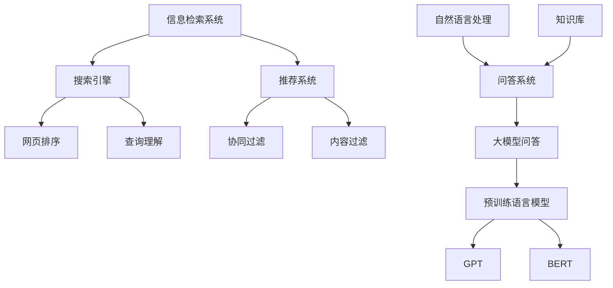
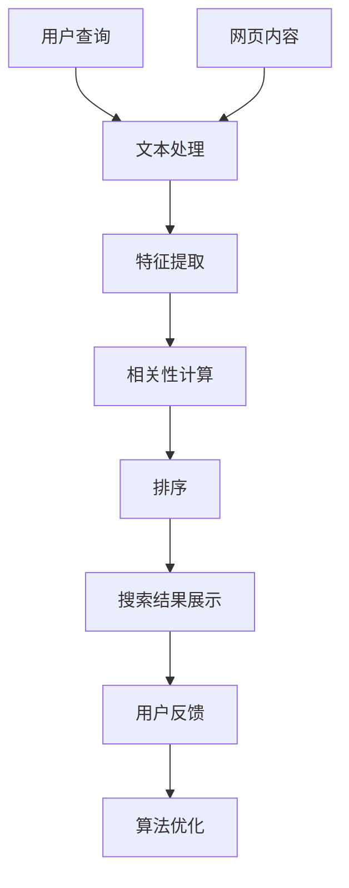
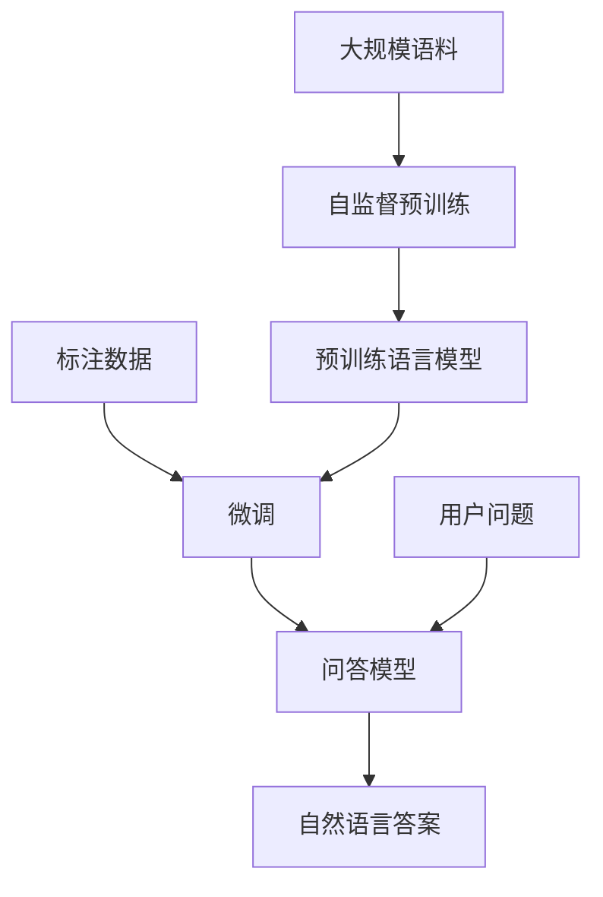

# 大模型问答机器人与搜索推荐的对比

## 1. 背景介绍

### 1.1 问题的由来

在当今信息时代,人们对于获取知识和解决问题的需求日益迫切。传统的搜索引擎虽然可以提供海量信息,但往往需要用户自行筛选和理解搜索结果,效率较低。而新兴的大模型问答系统则可以直接回答用户的自然语言问题,为用户带来更加便捷的体验。

然而,大模型问答系统和搜索推荐系统在原理、能力和应用场景上存在明显差异,了解它们的异同点对于选择合适的解决方案至关重要。本文将对比分析这两种系统,探讨它们的工作机制、优缺点以及适用场景,为读者提供全面的见解。

### 1.2 研究现状

搜索推荐系统经过多年的发展已相当成熟,主流搜索引擎如Google、Bing等都采用了高度优化的检索算法和排序策略,可以快速从海量数据中检索出相关信息。而大模型问答系统则是近年来兴起的一种新型人工智能技术,代表性的系统包括GPT-3、ChatGPT、谷歌的LaMDA等。

这些系统通过预训练大规模语料,学习自然语言的语义和上下文关系,从而具备了较强的问答能力。目前,大模型问答系统在一些特定领域已展现出优异的表现,但仍存在一些局限性和挑战。

### 1.3 研究意义

对比研究大模型问答系统和搜索推荐系统,可以帮助我们全面认识这两种技术的优缺点和适用场景,从而更好地利用它们解决实际问题。具体来说,本研究有以下意义:

1. 阐明两种系统的工作原理和关键技术,为读者提供必要的理论基础。
2. 评估两种系统在准确性、覆盖面、效率等方面的表现,指出它们的优缺点。
3. 探讨两种系统在不同应用场景下的适用性,为读者提供选择依据。
4. 分析两种系统的发展趋势和面临的挑战,为未来研究指明方向。

### 1.4 本文结构

本文共分为九个部分:

1. 背景介绍
2. 核心概念与联系
3. 核心算法原理与具体操作步骤
4. 数学模型和公式详细讲解与举例说明
5. 项目实践:代码实例和详细解释说明
6. 实际应用场景
7. 工具和资源推荐
8. 总结:未来发展趋势与挑战
9. 附录:常见问题与解答

## 2. 核心概念与联系

在深入探讨大模型问答系统和搜索推荐系统之前,我们需要先理解一些核心概念及它们之间的联系。

上图展示了信息检索系统、推荐系统、问答系统等概念之间的关系。

- **信息检索系统**是一类用于从大量数据中查找相关信息的系统,包括搜索引擎和推荐系统两大类。
- **搜索引擎**通过网页排序、查询理解等技术,从海量网页中检索出与用户查询相关的信息。
- **推荐系统**则基于协同过滤、内容过滤等算法,为用户推荐感兴趣的内容。
- **问答系统**属于自然语言处理的一个分支,旨在直接回答用户的自然语言问题。传统的问答系统需要依赖知识库,而**大模型问答系统**则通过预训练语言模型(如GPT、BERT等)直接生成答案。

大模型问答系统和搜索推荐系统虽然都属于信息检索系统的范畴,但在工作原理和应用场景上存在明显差异,我们将在后续章节中详细对比分析。

## 3. 核心算法原理与具体操作步骤

### 3.1 算法原理概述

#### 3.1.1 搜索推荐算法原理

搜索推荐系统主要包括以下几个核心部分:

1. **文本处理**:对网页内容和用户查询进行分词、去停用词等预处理。
2. **特征提取**:提取网页内容和查询的关键词、链接结构、点击率等特征。
3. **相关性计算**:基于特征,计算网页与查询的相关性得分。
4. **排序**:根据相关性得分对网页进行排序。
5. **反馈收集**:收集用户对搜索结果的反馈(点击、停留时间等),用于优化算法。

#### 3.1.2 大模型问答算法原理

大模型问答系统的核心是基于自注意力机制的预训练语言模型,如GPT、BERT等。这些模型通过自监督学习大量语料,学习自然语言的语义和上下文关系。在问答时,模型会根据问题和已学习的知识生成答案。

1. **预训练**:在大量无标注语料上进行自监督学习,获取语言的通用表示能力。
2. **微调**:在特定任务的标注数据上进行微调,使模型适应特定任务。
3. **生成**:输入问题,模型根据上下文生成自然语言形式的答案。

### 3.2 算法步骤详解

#### 3.2.1 搜索推荐算法步骤

1. **文本预处理**
   - 分词: 将文本按词语边界分割成单词序列
   - 去停用词: 移除语义含量较低的词语(如"的"、"了"等)
   - 词形还原: 将单词转换为词根形式(如"playing" → "play")

2. **特征提取**
   - 词袋模型(BOW): 统计文档中每个词的出现频率作为特征
   - TF-IDF: 考虑词频(TF)和逆文档频率(IDF),降低常见词权重
   - 主题模型(LDA): 发现文档的隐含主题作为特征
   - 词向量(Word2Vec): 将词映射到低维语义空间的向量

3. **相关性计算**
   - 布尔模型: 检查查询词是否出现在文档中
   - 向量空间模型: 计算查询向量与文档向量的相似度(如余弦相似度)
   - 概率模型: 计算文档生成查询的概率作为相关性分数
   - 学习排序: 基于特征构建模型直接学习文档与查询的相关性分数

4. **排序**
   - 根据相关性分数对文档进行排序
   - 可引入其他因素,如网页质量、热门程度等

5. **反馈收集与算法优化**
   - 收集用户对搜索结果的反馈(点击、停留时间等)
   - 基于反馈数据,优化特征提取、相关性计算等模块

#### 3.2.2 大模型问答算法步骤

1. **预训练**
   - 自监督学习目标: 掩蔽语言模型(MLM)、下一句预测(NSP)等
   - 编码器-解码器结构: 编码器捕获输入的上下文,解码器生成输出
   - 自注意力机制: 捕捉输入序列中任意两个位置的关系
   - 模型规模很大(如GPT-3有1750亿参数),需要大规模并行训练

2. **微调**
   - 在特定任务的标注数据上继续训练预训练模型
   - 根据任务设计合适的微调策略和损失函数
   - 常见的微调任务包括文本分类、阅读理解、生成式问答等

3. **生成**
   - 输入问题,模型根据上下文生成自然语言形式的答案
   - 通过beam search、top-k采样等策略提高生成质量
   - 可引入约束条件(如答案长度、关键词等)来控制生成

4. **评估**
   - 自动评估指标: BLEU、ROUGE、BERTScore等
   - 人工评估: 流畅性、一致性、信息质量等

5. **优化**
   - 根据评估结果,调整模型结构、训练策略等超参数
   - 增加训练数据,改善模型泛化能力

### 3.3 算法优缺点

#### 3.3.1 搜索推荐算法优缺点

**优点**:

- 可从海量数据中快速检索出相关信息
- 通过不断优化,检索质量不断提高
- 可根据用户反馈进行个性化推荐

**缺点**:

- 只能检索已有的结构化数据,难以回答开放性问题
- 检索质量依赖于特征工程,需要大量人工努力
- 面临冷启动、过度个性化等挑战

#### 3.3.2 大模型问答算法优缺点

**优点**:

- 具备较强的自然语言理解和生成能力
- 可直接回答开放性问题,无需事先构建知识库
- 模型通用,可应用于多种任务

**缺点**:

- 生成的答案可能不准确、不一致或缺乏逻辑
- 存在安全隐患,如生成有害内容
- 训练成本高,需要大量计算资源

### 3.4 算法应用领域

#### 3.4.1 搜索推荐算法应用

- 网络搜索引擎: 谷歌、必应等
- 电商产品推荐: 亚马逊、淘宝等
- 社交媒体内容推荐: 抖音、微博等
- 个性化新闻推荐: 今日头条、谷歌新闻等
- 广告投放: 根据用户兴趣推荐相关广告

#### 3.4.2 大模型问答算法应用

- 智能助手: 苹果Siri、亚马逊Alexa、OpenAI ChatGPT等
- 客户服务: 自动回复客户咨询
- 教育辅导: 解答学生提出的各种问题
- 内容创作: 自动生成文案、新闻、故事等
- 代码辅助: 回答编程问题,提供代码示例等

## 4. 数学模型和公式详细讲解与举例说明

### 4.1 数学模型构建

#### 4.1.1 搜索推荐系统数学模型

搜索推荐系统中常用的数学模型包括:

1. **布尔模型**

将文档表示为词集$D=\{w_1,w_2,...,w_n\}$,查询表示为词集$Q=\{q_1,q_2,...,q_m\}$。相关性函数为:

$$
\begin{aligned}
\text{Relevance}(D,Q) &= \begin{cases}
1, & \text{if }Q \subseteq D\
0, & \text{otherwise}
\end{cases}\
&= \prod_{q \in Q} \mathbb{1}_{q \in D}
\end{aligned}
$$

其中$\mathbb{1}$为指示函数。布尔模型简单,但过于严格。

2. **向量空间模型(VSM)**

将文档和查询表示为向量,相关性由它们的相似度决定,常用余弦相似度:

$$
\text{sim}_\text{cos}(\vec{d},\vec{q}) = \frac{\vec{d} \cdot \vec{q}}{\|\vec{d}\| \|\vec{q}\|} = \frac{\sum\limits_{i=1}^n d_i q_i}{\sqrt{\sum\limits_{i=1}^n d_i^2} \sqrt{\sum\limits_{i=1}^n q_i^2}}
$$