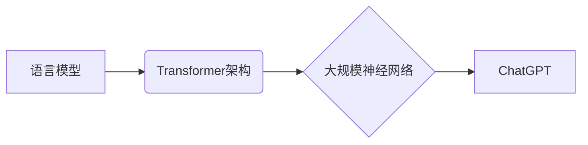

## 从ChatGPT到未来AI助手

> 关键词：ChatGPT, 语言模型, 大规模神经网络, 自然语言处理, 知识图谱, 增强现实, 人机交互, 认知计算

### 1. 背景介绍

近年来，人工智能（AI）技术取得了飞速发展，特别是深度学习的突破，使得自然语言处理（NLP）领域取得了令人瞩目的进展。ChatGPT，作为一款基于Transformer架构的强大语言模型，以其流畅自然的对话能力和广泛的知识应用而迅速走红，引发了人们对未来AI助手潜力的热烈讨论。

ChatGPT的出现标志着AI技术迈向了一个新的阶段，它不仅能够理解和生成人类语言，还能进行文本摘要、翻译、代码生成等多种复杂任务。这为构建更智能、更人性化的AI助手提供了强大的技术基础。

### 2. 核心概念与联系

#### 2.1 语言模型

语言模型是机器学习领域的一个重要分支，旨在学习和理解人类语言的结构和规律。它通过统计语言数据，预测下一个词出现的概率，从而生成流畅、连贯的文本。

#### 2.2 Transformer架构

Transformer是一种新型的神经网络架构，专门设计用于处理序列数据，例如文本。它引入了注意力机制，能够捕捉文本中不同词之间的长距离依赖关系，从而提升了语言模型的理解和生成能力。

#### 2.3 大规模神经网络

ChatGPT基于一个庞大的神经网络，包含数十亿个参数。这些参数通过训练数据进行微调，使得模型能够掌握丰富的语言知识和表达能力。

**核心概念与联系流程图**

### 3. 核心算法原理 & 具体操作步骤

#### 3.1 算法原理概述

ChatGPT的核心算法是基于Transformer架构的解码器网络。解码器网络接收一个输入序列，并根据其上下文信息生成下一个词的预测概率。

#### 3.2 算法步骤详解

1. **输入处理:** 将输入文本序列转换为数字向量，作为解码器网络的输入。
2. **编码器输出:** 将输入文本序列输入编码器网络，得到每个词的隐藏状态表示。
3. **注意力机制:** 解码器网络使用注意力机制，从编码器输出中获取与当前词相关的上下文信息。
4. **解码器网络:** 解码器网络根据注意力机制的输出和自身状态，预测下一个词的概率分布。
5. **输出生成:** 根据概率分布选择最可能的词，并将其添加到输出序列中。重复步骤4和5，直到生成完整的输出文本。

#### 3.3 算法优缺点

**优点:**

* 能够捕捉长距离依赖关系，生成更流畅、更自然的文本。
* 训练效率高，能够处理海量文本数据。
* 泛化能力强，能够应用于多种自然语言处理任务。

**缺点:**

* 参数量巨大，需要大量的计算资源进行训练和推理。
* 训练数据对模型性能有很大影响，需要高质量的训练数据。
* 难以解释模型的决策过程，缺乏透明度。

#### 3.4 算法应用领域

* **聊天机器人:** 与用户进行自然对话，提供信息和服务。
* **文本生成:** 生成各种类型的文本，例如文章、故事、诗歌等。
* **机器翻译:** 将文本从一种语言翻译成另一种语言。
* **代码生成:** 根据自然语言描述生成代码。
* **问答系统:** 回答用户提出的问题。

### 4. 数学模型和公式 & 详细讲解 & 举例说明

#### 4.1 数学模型构建

ChatGPT的核心数学模型是基于Transformer架构的解码器网络。解码器网络由多个编码层和解码层组成，每个层包含多层神经网络结构。

#### 4.2 公式推导过程

Transformer架构的核心是注意力机制。注意力机制通过计算每个词与其他词之间的相关性，赋予每个词不同的权重，从而捕捉文本中的长距离依赖关系。

注意力机制的计算公式如下：

$$
Attention(Q, K, V) = softmax(\frac{QK^T}{\sqrt{d_k}})V
$$

其中：

* $Q$：查询矩阵
* $K$：键矩阵
* $V$：值矩阵
* $d_k$：键向量的维度
* $softmax$：softmax函数

#### 4.3 案例分析与讲解

假设我们有一个句子：“我爱吃苹果”。

使用注意力机制，我们可以计算每个词与其他词之间的相关性。例如，“我”与“吃”之间的相关性较高，因为它们共同参与了动作的描述。

通过注意力机制，解码器网络能够更好地理解句子中的语义关系，从而生成更流畅、更自然的文本。

### 5. 项目实践：代码实例和详细解释说明

#### 5.1 开发环境搭建

ChatGPT的开发环境需要安装Python、PyTorch等深度学习框架。

#### 5.2 源代码详细实现

ChatGPT的源代码开源，可以从GitHub上下载。

#### 5.3 代码解读与分析

ChatGPT的代码主要包含以下部分：

* 数据预处理模块：将文本数据转换为数字向量。
* 模型定义模块：定义Transformer架构的解码器网络。
* 训练模块：使用训练数据训练模型参数。
* 推理模块：使用训练好的模型生成文本。

#### 5.4 运行结果展示

运行ChatGPT代码，可以生成各种类型的文本，例如对话、故事、诗歌等。

### 6. 实际应用场景

#### 6.1 聊天机器人

ChatGPT可以用于构建更智能、更人性化的聊天机器人，例如客服机器人、陪伴机器人等。

#### 6.2 文本生成

ChatGPT可以用于生成各种类型的文本，例如新闻报道、产品描述、广告文案等。

#### 6.3 教育领域

ChatGPT可以用于辅助教育，例如生成习题、提供个性化学习辅导等。

#### 6.4 未来应用展望

ChatGPT的未来应用前景广阔，例如：

* **增强现实:** 与增强现实技术结合，为用户提供更沉浸式的交互体验。
* **人机交互:** 构建更自然、更流畅的人机交互方式。
* **认知计算:** 研究人工智能的认知能力，例如推理、决策、学习等。

### 7. 工具和资源推荐

#### 7.1 学习资源推荐

* **书籍:**

    * 《深度学习》
    * 《自然语言处理》

* **在线课程:**

    * Coursera
    * edX

#### 7.2 开发工具推荐

* **Python:** 

* **PyTorch:** 深度学习框架
* **TensorFlow:** 深度学习框架

#### 7.3 相关论文推荐

* **Attention Is All You Need:** https://arxiv.org/abs/1706.03762

### 8. 总结：未来发展趋势与挑战

#### 8.1 研究成果总结

ChatGPT的出现标志着人工智能技术取得了新的突破，为构建更智能、更人性化的AI助手提供了强大的技术基础。

#### 8.2 未来发展趋势

* **模型规模进一步扩大:** 训练更大规模的语言模型，提升模型的理解和生成能力。
* **多模态学习:** 将文本、图像、音频等多种模态数据融合，构建更全面的AI助手。
* **可解释性增强:** 研究如何提高AI模型的透明度和可解释性，增强用户对模型决策的信任。

#### 8.3 面临的挑战

* **数据安全和隐私:** 训练大型语言模型需要海量数据，如何保证数据安全和隐私是一个重要挑战。
* **模型偏见:** 语言模型可能存在偏见，需要进行针对性的处理和缓解。
* **伦理问题:** AI技术的快速发展引发了伦理问题，例如AI的责任、透明度、公平性等，需要进行深入探讨和规范。

#### 8.4 研究展望

未来，人工智能技术将继续发展，AI助手将更加智能、更加人性化。

### 9. 附录：常见问题与解答

* **ChatGPT可以理解中文吗？**

   是的，ChatGPT可以理解和生成多种语言的文本，包括中文。

* **如何训练自己的ChatGPT模型？**

   需要准备大量的文本数据，并使用深度学习框架进行训练。

* **ChatGPT的代码开源吗？**

   是的，ChatGPT的源代码开源，可以从GitHub上下载。

作者：禅与计算机程序设计艺术 / Zen and the Art of Computer Programming 
