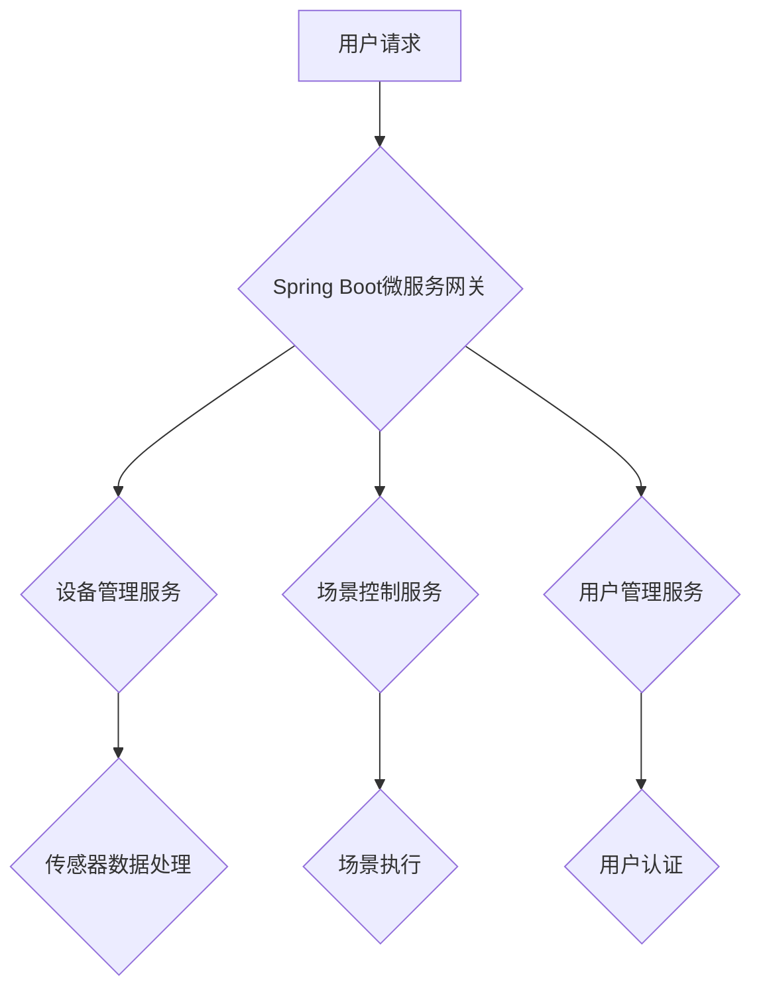

## 基于Java的智能家居设计：应用Spring Boot构建智能家居后端服务

> 关键词：智能家居、Spring Boot、Java、微服务、物联网、RESTful API、消息队列

## 1. 背景介绍

智能家居已成为现代生活的重要组成部分，它通过将各种智能设备连接到网络，实现对家居环境的自动化控制和智能化管理。智能家居系统通常由前端用户界面、后端服务和各种智能设备组成。后端服务是智能家居系统的核心，负责处理设备数据、用户请求和业务逻辑。

传统的智能家居后端服务往往采用 monolithic 架构，将所有功能模块集成在一个大型应用程序中。这种架构虽然简单易于开发，但随着系统规模的扩大，维护和扩展变得越来越困难。

微服务架构 emerged as a solution to address these challenges. 它将大型应用程序拆分成多个小型、独立的服务，每个服务负责特定的功能模块。微服务架构具有以下优点：

* **可扩展性:** 每个服务可以独立部署和扩展，无需影响其他服务。
* **可维护性:** 每个服务相对独立，因此更容易维护和更新。
* **技术多样性:** 每个服务可以使用不同的技术栈，以满足其特定需求。

## 2. 核心概念与联系

### 2.1 智能家居系统架构

智能家居系统通常采用三层架构：

* **感知层:** 包含各种传感器和执行器，负责收集环境数据和控制设备。
* **网络层:** 连接感知层和应用层，负责数据传输和设备通信。
* **应用层:** 提供用户界面和业务逻辑，负责处理用户请求和控制设备。

### 2.2 微服务架构

微服务架构将大型应用程序拆分成多个小型、独立的服务，每个服务负责特定的功能模块。微服务之间通过轻量级通信协议，例如 RESTful API 或消息队列，进行通信。

### 2.3 Spring Boot

Spring Boot 是一个基于 Spring Framework 的快速开发框架，它简化了构建微服务的开发过程。Spring Boot 提供了丰富的组件和工具，可以快速搭建微服务架构。

**Mermaid 流程图**



## 3. 核心算法原理 & 具体操作步骤

### 3.1 算法原理概述

智能家居系统中涉及多种算法，例如设备状态预测、场景识别、用户行为分析等。这些算法通常基于机器学习、数据挖掘和人工智能技术。

### 3.2 算法步骤详解

以设备状态预测为例，其算法步骤如下：

1. **数据采集:** 收集设备的历史使用数据，例如温度、湿度、灯光亮度等。
2. **数据预处理:** 对采集到的数据进行清洗、转换和特征提取。
3. **模型训练:** 使用机器学习算法，例如线性回归、决策树或神经网络，对预处理后的数据进行训练，建立设备状态预测模型。
4. **模型评估:** 使用测试数据评估模型的预测精度。
5. **模型部署:** 将训练好的模型部署到智能家居系统中，用于实时预测设备状态。

### 3.3 算法优缺点

* **优点:** 可以提高设备的运行效率、延长设备寿命、提供更精准的设备控制。
* **缺点:** 需要大量的训练数据、模型训练时间较长、模型精度受数据质量影响。

### 3.4 算法应用领域

* **设备故障预测:** 预判设备故障，及时进行维护。
* **设备使用优化:** 根据设备使用情况，优化设备运行参数。
* **场景自动化:** 根据用户行为和设备状态，自动执行场景。

## 4. 数学模型和公式 & 详细讲解 & 举例说明

### 4.1 数学模型构建

设备状态预测模型可以采用线性回归模型，其数学模型如下：

$$
y = \beta_0 + \beta_1x_1 + \beta_2x_2 +... + \beta_nx_n + \epsilon
$$

其中：

* $y$ 是预测的设备状态。
* $x_1, x_2,..., x_n$ 是设备的历史使用数据。
* $\beta_0, \beta_1, \beta_2,..., \beta_n$ 是模型参数。
* $\epsilon$ 是误差项。

### 4.2 公式推导过程

模型参数可以通过最小二乘法进行估计。最小二乘法旨在找到使模型预测值与实际值误差平方和最小的参数值。

### 4.3 案例分析与讲解

假设我们要预测空调的运行状态，其历史使用数据包括温度、湿度、时间等。我们可以使用线性回归模型，将这些数据作为输入，预测空调是否开启。

## 5. 项目实践：代码实例和详细解释说明

### 5.1 开发环境搭建

* JDK 11 或以上
* Maven 或 Gradle
* Spring Boot CLI 或 IDE

### 5.2 源代码详细实现

```java
@SpringBootApplication
public class SmartHomeBackendApplication {

    public static void main(String[] args) {
        SpringApplication.run(SmartHomeBackendApplication.class, args);
    }
}
```

### 5.3 代码解读与分析

* `@SpringBootApplication` 注解表示这是一个 Spring Boot 应用。
* `public static void main(String[] args)` 方法是应用程序的入口点。
* `SpringApplication.run(SmartHomeBackendApplication.class, args)` 方法启动 Spring Boot 应用。

### 5.4 运行结果展示

启动应用程序后，可以使用浏览器访问后端服务提供的 RESTful API。

## 6. 实际应用场景

### 6.1 场景控制

用户可以通过手机 App 或语音助手，控制智能家居设备的运行状态，例如开启空调、调节灯光亮度、关闭窗帘等。

### 6.2 设备管理

用户可以通过后端服务管理智能家居设备，例如添加设备、删除设备、查看设备状态等。

### 6.3 数据分析

后端服务可以收集和分析智能家居设备的数据，例如设备使用频率、能源消耗等，为用户提供个性化的建议和服务。

### 6.4 未来应用展望

* **人工智能增强:** 利用人工智能技术，实现更智能的场景控制、设备预测和用户行为分析。
* **边缘计算:** 将部分计算任务下沉到设备端，提高系统响应速度和实时性。
* **安全保障:** 加强数据安全和设备安全防护，保障用户隐私和财产安全。

## 7. 工具和资源推荐

### 7.1 学习资源推荐

* Spring Boot 官方文档: https://spring.io/projects/spring-boot
* Java EE 规范: https://jcp.org/en/jsr/detail?id=371

### 7.2 开发工具推荐

* IntelliJ IDEA
* Eclipse
* Visual Studio Code

### 7.3 相关论文推荐

* Martin Fowler. Microservices. 2014.
* Sam Newman. Building Microservices. 2015.

## 8. 总结：未来发展趋势与挑战

### 8.1 研究成果总结

基于 Java 的智能家居设计，利用 Spring Boot 构建微服务架构，可以实现智能家居系统的快速开发、灵活扩展和高效运行。

### 8.2 未来发展趋势

* **更智能的场景控制:** 利用人工智能技术，实现更智能的场景控制，例如根据用户情绪和环境变化自动调整灯光、温度等。
* **更安全的设备连接:** 加强设备安全认证和数据加密，保障用户隐私和财产安全。
* **更便捷的用户体验:** 提供更便捷的用户界面和交互方式，例如语音控制、手势识别等。

### 8.3 面临的挑战

* **系统复杂性:** 智能家居系统涉及多种设备、协议和算法，系统复杂性不断增加。
* **数据安全:** 智能家居系统收集大量用户数据，数据安全问题不容忽视。
* **标准化问题:** 目前智能家居行业缺乏统一的标准，导致设备互联互通性差。

### 8.4 研究展望

未来，智能家居系统将更加智能、安全和便捷。研究者将继续探索新的算法、技术和应用场景，推动智能家居行业的发展。

## 9. 附录：常见问题与解答

* **Q1: 如何选择合适的微服务框架？**

* **A1:** Spring Boot 是一个流行的微服务框架，它提供了丰富的组件和工具，可以快速搭建微服务架构。

* **Q2: 如何保证微服务之间的通信可靠性？**

* **A2:** 可以使用消息队列或服务发现机制，保证微服务之间的通信可靠性。

* **Q3: 如何进行智能家居系统的安全防护？**

* **A3:** 可以采用多层安全防护机制，例如设备认证、数据加密、入侵检测等。


作者：禅与计算机程序设计艺术 / Zen and the Art of Computer Programming 
