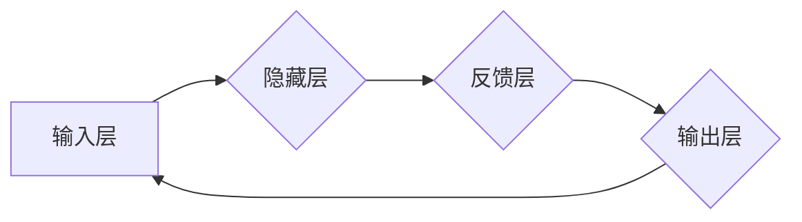

## 从零开始大模型开发与微调：反馈神经网络原理的激活函数

> 关键词：大模型、反馈神经网络、激活函数、微调、深度学习、模型开发

## 1. 背景介绍

近年来，深度学习在人工智能领域取得了突破性的进展，大模型作为深度学习的重要组成部分，在自然语言处理、计算机视觉、语音识别等领域展现出强大的应用潜力。然而，大模型的训练成本高昂，对算力和数据资源要求极高。因此，如何高效地开发和微调大模型成为一个重要的研究方向。

反馈神经网络（Feedback Neural Network，FNN）是一种特殊的深度学习网络结构，其核心特点是将网络的输出反馈到输入，形成一个闭环结构。这种反馈机制使得 FNN 能够学习更复杂的非线性关系，并具有更强的泛化能力。激活函数作为 FNN 中的重要组成部分，直接影响着网络的学习能力和性能。

本文将从零开始介绍大模型开发与微调的原理，重点探讨 FNN 中激活函数的作用，并结合具体的算法和代码实例，深入分析其工作机制和应用场景。

## 2. 核心概念与联系

### 2.1  大模型

大模型是指参数量达到数百万甚至数十亿的深度学习模型。它们通常在海量数据上进行预训练，并可以用于各种下游任务，例如文本生成、机器翻译、图像识别等。

### 2.2  反馈神经网络

FNN 是一种特殊的深度学习网络结构，其特点是将网络的输出反馈到输入，形成一个闭环结构。这种反馈机制使得 FNN 能够学习更复杂的非线性关系，并具有更强的泛化能力。

### 2.3  激活函数

激活函数是神经网络中一个重要的组成部分，它决定了神经元的输出是否被激活。不同的激活函数具有不同的特性，例如线性、非线性、可微性等。

**FNN 架构流程图**



## 3. 核心算法原理 & 具体操作步骤

### 3.1  算法原理概述

FNN 的核心算法原理是通过反馈机制学习网络的内部表示。网络的输出被反馈到输入，并与原始输入进行组合，形成新的输入。这种反馈过程不断重复，使得网络能够学习到更深层次的特征表示。

### 3.2  算法步骤详解

1. **初始化网络参数:** 随机初始化网络的权重和偏置。
2. **前向传播:** 将输入数据传递到网络中，计算每个神经元的输出。
3. **反馈:** 将网络的输出反馈到输入层。
4. **反向传播:** 计算误差，并根据误差反向传播更新网络参数。
5. **重复步骤 2-4:** 重复前向传播和反向传播的过程，直到网络收敛。

### 3.3  算法优缺点

**优点:**

* 能够学习更复杂的非线性关系。
* 具有更强的泛化能力。
* 可以用于各种下游任务。

**缺点:**

* 训练成本高昂。
* 容易出现梯度消失或爆炸问题。
* 需要大量的训练数据。

### 3.4  算法应用领域

FNN 广泛应用于以下领域:

* 自然语言处理: 文本生成、机器翻译、情感分析等。
* 计算机视觉: 图像识别、目标检测、图像分割等。
* 语音识别: 语音转文本、语音合成等。
* 控制系统: 机器人控制、无人驾驶等。

## 4. 数学模型和公式 & 详细讲解 & 举例说明

### 4.1  数学模型构建

FNN 的数学模型可以表示为一个多层感知机，其中每一层的神经元都使用激活函数进行非线性变换。

假设 FNN 有 L 层，第 l 层有 N_l 个神经元，则 FNN 的输出可以表示为：

$$
y = f_L(W_L * f_{L-1}(W_{L-1} *... * f_1(W_1 * x) + b_1) + b_L)
$$

其中：

* $x$ 是输入数据。
* $W_l$ 是第 l 层的权重矩阵。
* $b_l$ 是第 l 层的偏置向量。
* $f_l$ 是第 l 层的神经元激活函数。
* $y$ 是网络的输出。

### 4.2  公式推导过程

FNN 的训练过程是通过反向传播算法来实现的。反向传播算法的核心思想是通过计算误差梯度，反向传播到网络的每一层，并更新网络参数。

误差函数通常定义为预测值与真实值的差值，例如均方误差 (MSE)。

$$
E = \frac{1}{2} \sum_{i=1}^{N} (y_i - t_i)^2
$$

其中：

* $y_i$ 是预测值。
* $t_i$ 是真实值。
* $N$ 是样本数量。

根据误差函数，可以计算网络参数的梯度，并使用梯度下降算法更新网络参数。

### 4.3  案例分析与讲解

假设我们有一个简单的 FNN，用于预测房价。输入数据包括房屋面积、房间数量、地理位置等特征，输出是房屋价格。

我们可以使用反向传播算法训练这个 FNN，并通过调整网络参数，使得预测值与真实值之间的误差最小化。

## 5. 项目实践：代码实例和详细解释说明

### 5.1  开发环境搭建

为了实现 FNN 的开发和微调，我们需要搭建一个合适的开发环境。

* **操作系统:** Linux 或 macOS
* **编程语言:** Python
* **深度学习框架:** TensorFlow 或 PyTorch
* **其他工具:** Git、Jupyter Notebook

### 5.2  源代码详细实现

以下是一个使用 TensorFlow 实现简单的 FNN 的代码示例：

```python
import tensorflow as tf

# 定义模型
model = tf.keras.models.Sequential([
  tf.keras.layers.Dense(64, activation='relu', input_shape=(10,)),
  tf.keras.layers.Dense(32, activation='relu'),
  tf.keras.layers.Dense(1)
])

# 编译模型
model.compile(optimizer='adam', loss='mse')

# 训练模型
model.fit(x_train, y_train, epochs=10)

# 评估模型
loss = model.evaluate(x_test, y_test)
```

### 5.3  代码解读与分析

* **模型定义:** 使用 `tf.keras.models.Sequential` 创建一个顺序模型，并添加三个全连接层。
* **激活函数:** 使用 ReLU 激活函数，可以有效地解决梯度消失问题。
* **编译模型:** 使用 Adam 优化器和均方误差损失函数编译模型。
* **训练模型:** 使用 `model.fit` 方法训练模型，并指定训练数据、 epochs 等参数。
* **评估模型:** 使用 `model.evaluate` 方法评估模型在测试数据上的性能。

### 5.4  运行结果展示

训练完成后，我们可以使用测试数据评估模型的性能，并观察模型的预测结果。

## 6. 实际应用场景

### 6.1  自然语言处理

FNN 在自然语言处理领域有着广泛的应用，例如：

* **文本生成:** 使用 FNN 生成高质量的文本，例如新闻文章、小说、诗歌等。
* **机器翻译:** 使用 FNN 将文本从一种语言翻译成另一种语言。
* **情感分析:** 使用 FNN 分析文本的情感倾向，例如正面、负面、中性等。

### 6.2  计算机视觉

FNN 在计算机视觉领域也取得了显著的成果，例如：

* **图像识别:** 使用 FNN识别图像中的物体，例如人、车、猫等。
* **目标检测:** 使用 FNN 在图像中定位和识别目标，例如人脸检测、车牌识别等。
* **图像分割:** 使用 FNN 将图像分割成不同的区域，例如人体的分割、道路的分割等。

### 6.3  语音识别

FNN 在语音识别领域也发挥着重要作用，例如：

* **语音转文本:** 使用 FNN 将语音信号转换为文本。
* **语音合成:** 使用 FNN 将文本转换为语音信号。

### 6.4  未来应用展望

随着深度学习技术的不断发展，FNN 的应用场景将会更加广泛。例如：

* **自动驾驶:** 使用 FNN 构建自动驾驶系统的感知模块，例如道路识别、障碍物检测等。
* **医疗诊断:** 使用 FNN 分析医学图像，辅助医生进行诊断。
* **个性化推荐:** 使用 FNN 分析用户的行为数据，提供个性化的商品推荐。

## 7. 工具和资源推荐

### 7.1  学习资源推荐

* **书籍:**
    * Deep Learning by Ian Goodfellow, Yoshua Bengio, and Aaron Courville
    * Hands-On Machine Learning with Scikit-Learn, Keras & TensorFlow by Aurélien Géron
* **在线课程:**
    * TensorFlow Tutorials: https://www.tensorflow.org/tutorials
    * PyTorch Tutorials: https://pytorch.org/tutorials/

### 7.2  开发工具推荐

* **TensorFlow:** https://www.tensorflow.org/
* **PyTorch:** https://pytorch.org/
* **Keras:** https://keras.io/

### 7.3  相关论文推荐

* **AlexNet:** http://papers.nips.cc/paper/4824-imagenet-classification-with-deep-convolutional-neural-networks.pdf
* **ResNet:** http://arxiv.org/abs/1512.03385
* **BERT:** https://arxiv.org/abs/1810.04805

## 8. 总结：未来发展趋势与挑战

### 8.1  研究成果总结

FNN 在深度学习领域取得了显著的成果，并广泛应用于各种领域。

### 8.2  未来发展趋势

* **模型规模的进一步扩大:** 随着计算资源的不断提升，FNN 的模型规模将会进一步扩大，从而提升模型的性能。
* **训练效率的提升:** 研究人员将继续探索新的训练算法和方法，以提高 FNN 的训练效率。
* **模型解释性和可解释性的增强:** 如何更好地理解 FNN 的决策过程，并提高模型的可解释性，是未来研究的重要方向。

### 8.3  面临的挑战

* **训练成本:** FNN 的训练成本仍然很高，需要大量的计算资源和数据。
* **过拟合问题:** FNN 容易出现过拟合问题，需要采用有效的正则化技术来解决。
* **数据获取和标注:** FNN 的训练需要大量的标注数据，数据获取和标注成本较高。

### 8.4  研究展望

未来，FNN 将继续朝着更强大、更智能的方向发展。研究人员将继续探索新的模型架构、训练算法和应用场景，推动 FNN 技术的进步。

## 9. 附录：常见问题与解答

### 9.1  激活函数的选择

激活函数的选择对 FNN 的性能有重要影响。常用的激活函数包括 ReLU、Sigmoid、Tanh 等。

### 9.2  梯度消失和梯度爆炸问题

梯度消失和梯度爆炸问题是训练深层 FNN 时可能遇到的问题。可以使用 Batch Normalization、Dropout 等技术来缓解这些问题。

### 9.3  模型过拟合问题

模型过拟合是指模型在训练数据上表现很好，但在测试数据上表现较差。可以使用正则化技术、数据增强等方法来解决过拟合问题。


作者：禅与计算机程序设计艺术 / Zen and the Art of Computer Programming 
