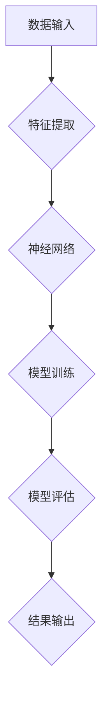

## 图灵奖得主的AI算法贡献

> 关键词：人工智能、深度学习、神经网络、算法设计、图灵奖、机器学习、计算机视觉

## 1. 背景介绍

人工智能（AI）作为科技发展的重要方向，近年来取得了令人瞩目的进展。从语音识别到图像生成，从自动驾驶到医疗诊断，AI技术已经渗透到我们生活的方方面面。这些突破性的进展离不开无数AI算法的不断创新和完善。图灵奖作为计算机科学领域最高荣誉，其得主们正是推动AI发展的重要力量，他们提出的算法不仅具有理论上的高度，也为实际应用提供了强大的工具。

本篇文章将从图灵奖得主的视角出发，探讨一些具有里程碑意义的AI算法，分析其核心概念、原理、应用以及未来发展趋势。

## 2. 核心概念与联系

### 2.1 深度学习

深度学习是机器学习的一个子领域，它利用多层神经网络来模拟人类大脑的学习过程。与传统机器学习方法相比，深度学习能够自动从海量数据中提取特征，从而实现更精准的预测和识别。

### 2.2 神经网络

神经网络是深度学习的基础，它由相互连接的神经元组成，每个神经元接收输入信号，对其进行处理，并输出信号。神经网络通过调整连接权重来学习数据模式，从而实现学习和预测。

### 2.3 算法设计

算法设计是AI算法的核心，它涉及如何构建和优化神经网络结构、训练方法以及损失函数等关键环节。优秀的算法设计能够显著提升模型的性能和效率。

**Mermaid 流程图**



## 3. 核心算法原理 & 具体操作步骤

### 3.1 算法原理概述

卷积神经网络（CNN）是一种专门用于处理图像数据的深度学习算法。它通过卷积操作来提取图像特征，并利用池化操作来降低数据维度，从而实现高效的图像识别和分类。

### 3.2 算法步骤详解

1. **数据预处理:** 将图像数据转换为适合CNN输入的格式，例如调整尺寸、归一化像素值等。
2. **卷积层:** 使用卷积核对图像进行卷积操作，提取图像局部特征。
3. **池化层:** 对卷积层的输出进行池化操作，例如最大池化或平均池化，降低数据维度并提高鲁棒性。
4. **全连接层:** 将池化层的输出连接到全连接层，进行分类或回归预测。
5. **损失函数:** 使用损失函数来衡量模型预测结果与真实标签之间的差异。
6. **反向传播:** 利用反向传播算法更新网络权重，降低损失函数值。
7. **模型训练:** 重复步骤5和6，直到模型性能达到预期水平。

### 3.3 算法优缺点

**优点:**

* 能够自动提取图像特征，无需人工特征工程。
* 对图像旋转、缩放等变换具有鲁棒性。
* 在图像识别、分类、目标检测等任务中表现出色。

**缺点:**

* 训练数据量较大，需要大量计算资源。
* 对小样本数据学习能力较弱。
* 模型解释性较差，难以理解模型决策过程。

### 3.4 算法应用领域

CNN在图像识别、分类、目标检测、图像分割、人脸识别、医疗影像分析等领域有着广泛的应用。

## 4. 数学模型和公式 & 详细讲解 & 举例说明

### 4.1 数学模型构建

CNN的数学模型主要基于线性变换、非线性激活函数和卷积操作。

* **线性变换:** 卷积核与图像进行卷积操作，相当于对图像进行线性变换。
* **非线性激活函数:** 将卷积层的输出通过非线性激活函数进行处理，例如ReLU函数，以增加模型的表达能力。
* **池化操作:** 对卷积层的输出进行最大池化或平均池化，降低数据维度并提高鲁棒性。

### 4.2 公式推导过程

**卷积操作公式:**

$$
y_{i,j} = \sum_{m=0}^{M-1} \sum_{n=0}^{N-1} x_{i+m,j+n} * w_{m,n}
$$

其中:

* $y_{i,j}$ 是卷积层的输出值。
* $x_{i+m,j+n}$ 是输入图像的像素值。
* $w_{m,n}$ 是卷积核的权重值。
* $M$ 和 $N$ 是卷积核的大小。

**ReLU激活函数公式:**

$$
f(x) = max(0, x)
$$

### 4.3 案例分析与讲解

假设我们有一个3x3的输入图像和一个3x3的卷积核，卷积操作的结果是一个新的图像，其大小取决于卷积核的大小和输入图像的大小。

## 5. 项目实践：代码实例和详细解释说明

### 5.1 开发环境搭建

使用Python语言和深度学习框架TensorFlow或PyTorch搭建开发环境。

### 5.2 源代码详细实现

```python
import tensorflow as tf

# 定义卷积神经网络模型
model = tf.keras.models.Sequential([
    tf.keras.layers.Conv2D(32, (3, 3), activation='relu', input_shape=(28, 28, 1)),
    tf.keras.layers.MaxPooling2D((2, 2)),
    tf.keras.layers.Conv2D(64, (3, 3), activation='relu'),
    tf.keras.layers.MaxPooling2D((2, 2)),
    tf.keras.layers.Flatten(),
    tf.keras.layers.Dense(10, activation='softmax')
])

# 编译模型
model.compile(optimizer='adam',
              loss='sparse_categorical_crossentropy',
              metrics=['accuracy'])

# 训练模型
model.fit(x_train, y_train, epochs=10)

# 评估模型
loss, accuracy = model.evaluate(x_test, y_test)
print('Test loss:', loss)
print('Test accuracy:', accuracy)
```

### 5.3 代码解读与分析

* 代码首先定义了一个卷积神经网络模型，包含卷积层、池化层和全连接层。
* 然后编译模型，选择优化器、损失函数和评价指标。
* 接着训练模型，使用训练数据进行训练。
* 最后评估模型，使用测试数据计算模型的损失和准确率。

### 5.4 运行结果展示

训练完成后，可以查看模型的损失和准确率，并使用模型对新的图像数据进行预测。

## 6. 实际应用场景

CNN在图像识别、分类、目标检测、图像分割、人脸识别、医疗影像分析等领域有着广泛的应用。

### 6.1 图像识别

CNN可以用于识别图像中的物体，例如人脸、车辆、动物等。

### 6.2 图像分类

CNN可以用于将图像分类到不同的类别，例如风景、人物、建筑等。

### 6.3 目标检测

CNN可以用于检测图像中的多个目标，并标注其位置和类别。

### 6.4 医疗影像分析

CNN可以用于分析医学影像数据，例如X光片、CT扫描、MRI扫描等，辅助医生诊断疾病。

### 6.5 未来应用展望

随着深度学习技术的不断发展，CNN在未来将有更广泛的应用场景，例如自动驾驶、机器人视觉、增强现实等。

## 7. 工具和资源推荐

### 7.1 学习资源推荐

* **书籍:**
    * 深度学习
    * 构建深度学习模型
* **在线课程:**
    * Coursera深度学习课程
    * Udacity深度学习工程师课程

### 7.2 开发工具推荐

* **深度学习框架:** TensorFlow, PyTorch
* **图像处理库:** OpenCV

### 7.3 相关论文推荐

* AlexNet: ImageNet Classification with Deep Convolutional Neural Networks
* VGGNet: Very Deep Convolutional Networks for Large-Scale Image Recognition
* ResNet: Deep Residual Learning for Image Recognition

## 8. 总结：未来发展趋势与挑战

### 8.1 研究成果总结

图灵奖得主的AI算法贡献推动了深度学习的发展，特别是CNN在图像识别领域的突破性进展。

### 8.2 未来发展趋势

* 模型效率提升: 探索更轻量级的模型架构，降低模型训练和推理的计算成本。
* 数据增强: 利用数据增强技术提高模型对小样本数据的学习能力。
* 模型解释性: 研究更有效的模型解释方法，提高模型的透明度和可信度。

### 8.3 面临的挑战

* 数据获取和标注: 训练高质量的深度学习模型需要大量的数据，数据获取和标注成本较高。
* 算法设计: 设计更有效的深度学习算法仍然是一个挑战，需要不断探索新的模型架构和训练方法。
* 伦理问题: 深度学习技术的应用引发了一些伦理问题，例如数据隐私、算法偏见等，需要认真思考和解决。

### 8.4 研究展望

未来，AI算法将继续朝着更智能、更安全、更可解释的方向发展，为人类社会带来更多福祉。

## 9. 附录：常见问题与解答

### 9.1 什么是卷积神经网络？

卷积神经网络是一种专门用于处理图像数据的深度学习算法，它通过卷积操作来提取图像特征，并利用池化操作来降低数据维度。

### 9.2 CNN的优势是什么？

CNN能够自动提取图像特征，无需人工特征工程。对图像旋转、缩放等变换具有鲁棒性。在图像识别、分类、目标检测等任务中表现出色。

### 9.3 如何训练CNN模型？

训练CNN模型需要使用深度学习框架，例如TensorFlow或PyTorch。需要准备训练数据，并使用优化器、损失函数和评价指标来训练模型。

### 9.4 CNN的应用场景有哪些？

CNN在图像识别、分类、目标检测、图像分割、人脸识别、医疗影像分析等领域有着广泛的应用。


作者：禅与计算机程序设计艺术 / Zen and the Art of Computer Programming 
