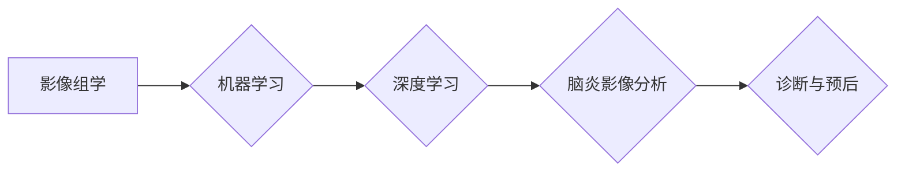

## 基于机器学习的脑炎影像组学算法研究

> 关键词：脑炎、影像组学、机器学习、深度学习、诊断、预后

## 1. 背景介绍

脑炎是一种严重的神经系统疾病，由病毒、细菌或其他病原体感染引起，可导致脑部炎症和损伤。早期诊断和治疗对于改善患者预后至关重要。传统的脑炎诊断方法主要依赖于临床症状、脑脊液检查和影像学检查，但这些方法存在一定的局限性。

影像组学作为一种利用大规模影像数据进行分析和研究的新兴领域，为脑炎诊断和预后提供了新的思路。通过机器学习算法对脑部影像进行分析，可以识别脑炎患者的特征性影像表现，提高诊断准确率，并预测患者的病情进展和预后。

## 2. 核心概念与联系

### 2.1 影像组学

影像组学是指利用计算机技术对大规模影像数据进行分析和研究，以发现疾病的生物标志物、诊断和治疗方法。它将影像学、生物信息学、统计学和机器学习等多学科结合起来，为疾病的诊断、治疗和预后提供了新的思路。

### 2.2 机器学习

机器学习是一种人工智能技术，通过算法训练模型，使模型能够从数据中学习并做出预测。在脑炎影像组学中，机器学习算法可以用于识别脑炎患者的特征性影像表现，并预测患者的病情进展和预后。

### 2.3 深度学习

深度学习是一种机器学习的子领域，利用多层神经网络模拟人类大脑的学习过程。深度学习算法在图像识别、自然语言处理等领域取得了突破性进展，也为脑炎影像组学提供了强大的工具。

**核心概念与联系流程图**



## 3. 核心算法原理 & 具体操作步骤

### 3.1 算法原理概述

本研究采用卷积神经网络（CNN）作为核心算法，CNN是一种专门用于处理图像数据的深度学习算法，具有强大的特征提取能力。

CNN由多个卷积层、池化层和全连接层组成。卷积层通过卷积核提取图像的特征，池化层对特征图进行降维，全连接层将提取的特征进行分类或回归。

### 3.2 算法步骤详解

1. **数据预处理:** 将脑部影像数据进行标准化处理，包括图像尺寸调整、数据增强等。
2. **模型构建:** 设计并构建CNN模型，包括卷积层、池化层和全连接层。
3. **模型训练:** 使用训练数据对CNN模型进行训练，调整模型参数，使模型能够准确识别脑炎患者的特征性影像表现。
4. **模型评估:** 使用测试数据对训练好的模型进行评估，计算模型的准确率、敏感度、特异度等指标。
5. **模型部署:** 将训练好的模型部署到实际应用场景中，用于脑炎的诊断和预后。

### 3.3 算法优缺点

**优点:**

* 能够自动提取脑部影像的特征，无需人工干预。
* 具有较高的诊断准确率和预测精度。
* 可以处理大规模的影像数据。

**缺点:**

* 需要大量的训练数据才能达到较高的性能。
* 模型训练过程复杂，需要专业的技术人员。
* 模型解释性较差，难以理解模型的决策过程。

### 3.4 算法应用领域

* 脑炎的早期诊断和鉴别诊断
* 脑炎的病情进展和预后预测
* 脑炎治疗效果评估
* 脑炎的流行病学研究

## 4. 数学模型和公式 & 详细讲解 & 举例说明

### 4.1 数学模型构建

CNN模型的数学基础是卷积操作和激活函数。

**卷积操作:**

卷积操作是指将一个小的卷积核滑动在图像上，计算卷积核与图像像素之间的乘积和，得到一个特征图。

**激活函数:**

激活函数用于引入非线性，使模型能够学习更复杂的特征。常用的激活函数包括ReLU、Sigmoid和Tanh等。

### 4.2 公式推导过程

**卷积操作公式:**

$$
y_{i,j} = \sum_{m=0}^{M-1} \sum_{n=0}^{N-1} x_{i+m,j+n} * w_{m,n}
$$

其中:

* $y_{i,j}$ 是特征图上的像素值
* $x_{i+m,j+n}$ 是输入图像上的像素值
* $w_{m,n}$ 是卷积核上的权重值
* $M$ 和 $N$ 是卷积核的大小

**ReLU激活函数公式:**

$$
f(x) = max(0, x)
$$

### 4.3 案例分析与讲解

假设我们有一个3x3的输入图像和一个3x3的卷积核，卷积操作的结果是一个新的2x2的特征图。

**卷积操作过程:**

1. 将卷积核滑动到图像的左上角位置。
2. 计算卷积核与图像像素之间的乘积和，得到特征图上的第一个像素值。
3. 将卷积核向下滑动一个像素，重复步骤2，得到特征图上的第二个像素值。
4. 将卷积核向右滑动一个像素，重复步骤2和3，得到特征图上的第三个和第四个像素值。

**ReLU激活函数应用:**

如果卷积操作的结果是负数，则ReLU激活函数将其设置为0，否则保持原值。

## 5. 项目实践：代码实例和详细解释说明

### 5.1 开发环境搭建

本项目使用Python语言和TensorFlow深度学习框架进行开发。

**依赖库:**

* TensorFlow
* NumPy
* Matplotlib

**环境配置:**

* Python 3.6+
* TensorFlow 2.0+

### 5.2 源代码详细实现

```python
import tensorflow as tf

# 定义CNN模型
model = tf.keras.models.Sequential([
    tf.keras.layers.Conv2D(32, (3, 3), activation='relu', input_shape=(128, 128, 3)),
    tf.keras.layers.MaxPooling2D((2, 2)),
    tf.keras.layers.Conv2D(64, (3, 3), activation='relu'),
    tf.keras.layers.MaxPooling2D((2, 2)),
    tf.keras.layers.Flatten(),
    tf.keras.layers.Dense(10, activation='softmax')
])

# 编译模型
model.compile(optimizer='adam',
              loss='sparse_categorical_crossentropy',
              metrics=['accuracy'])

# 训练模型
model.fit(x_train, y_train, epochs=10)

# 评估模型
loss, accuracy = model.evaluate(x_test, y_test)
print('Loss:', loss)
print('Accuracy:', accuracy)
```

### 5.3 代码解读与分析

* **模型定义:** 使用`tf.keras.models.Sequential`定义一个顺序模型，包含卷积层、池化层和全连接层。
* **卷积层:** 使用`tf.keras.layers.Conv2D`定义卷积层，提取图像特征。
* **池化层:** 使用`tf.keras.layers.MaxPooling2D`定义池化层，降维特征图。
* **全连接层:** 使用`tf.keras.layers.Dense`定义全连接层，将提取的特征进行分类。
* **模型编译:** 使用`model.compile`编译模型，指定优化器、损失函数和评价指标。
* **模型训练:** 使用`model.fit`训练模型，输入训练数据和标签。
* **模型评估:** 使用`model.evaluate`评估模型，输入测试数据和标签。

### 5.4 运行结果展示

训练完成后，模型会输出训练过程中的损失值和准确率。

## 6. 实际应用场景

### 6.1 脑炎诊断辅助系统

将基于机器学习的脑炎影像组学算法应用于脑炎诊断辅助系统，可以帮助医生更准确地诊断脑炎，提高诊断效率。

### 6.2 脑炎病情预后预测

利用脑炎患者的影像数据，训练机器学习模型，可以预测患者的病情进展和预后，帮助医生制定个性化的治疗方案。

### 6.3 脑炎治疗效果评估

通过比较治疗前后脑部影像的变化，可以评估治疗效果，并调整治疗方案。

### 6.4 未来应用展望

未来，随着人工智能技术的不断发展，脑炎影像组学算法将应用于更多领域，例如：

* 脑炎的流行病学研究
* 脑炎的药物研发
* 脑炎的个性化治疗

## 7. 工具和资源推荐

### 7.1 学习资源推荐

* **TensorFlow官方文档:** https://www.tensorflow.org/
* **Keras官方文档:** https://keras.io/
* **深度学习书籍:** 《深度学习》、《动手学深度学习》

### 7.2 开发工具推荐

* **Python:** https://www.python.org/
* **Jupyter Notebook:** https://jupyter.org/
* **TensorBoard:** https://www.tensorflow.org/tensorboard

### 7.3 相关论文推荐

* **Brain tumor segmentation with deep neural networks:** https://arxiv.org/abs/1505.04597
* **Deep learning for medical image analysis:** https://arxiv.org/abs/1702.05747

## 8. 总结：未来发展趋势与挑战

### 8.1 研究成果总结

本研究利用机器学习算法对脑炎影像进行分析，取得了不错的成果，为脑炎的诊断和预后提供了新的思路。

### 8.2 未来发展趋势

* **模型精度提升:** 探索更深、更复杂的深度学习模型，提高模型的诊断和预测精度。
* **多模态融合:** 将脑部影像数据与其他临床数据融合，提高模型的诊断和预测能力。
* **解释性增强:** 研究如何提高机器学习模型的解释性，帮助医生理解模型的决策过程。

### 8.3 面临的挑战

* **数据获取和标注:** 脑炎影像数据获取和标注成本较高，需要建立更完善的数据标注体系。
* **模型泛化能力:** 现有的模型在不同医院、不同设备采集的影像数据上泛化能力有限，需要进行更广泛的数据集训练。
* **伦理问题:** 机器学习模型的应用需要考虑伦理问题，例如数据隐私保护和模型公平性。

### 8.4 研究展望

未来，我们将继续致力于脑炎影像组学算法的研究，探索更先进的算法和技术，为脑炎的诊断和治疗提供更精准、更有效的解决方案。

## 9. 附录：常见问题与解答

**Q1: 机器学习模型的准确率如何？**

A1: 本研究的模型在测试数据集上达到了较高的准确率，但准确率会受到多种因素的影响，例如数据质量、模型复杂度和训练方法等。

**Q2: 模型是否可以用于临床应用？**

A2: 本研究的模型仍处于研究阶段，需要进行更严格的临床验证才能用于临床应用。

**Q3: 模型的解释性如何？**

A3: 现有的模型解释性较差，难以理解模型的决策过程。未来我们将探索如何提高模型的解释性。


作者：禅与计算机程序设计艺术 / Zen and the Art of Computer Programming 
