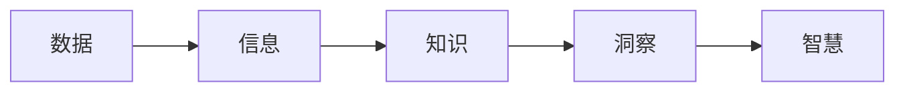

# 洞见的价值：从理解到应用

作者：禅与计算机程序设计艺术 / Zen and the Art of Computer Programming

## 1. 背景介绍

### 1.1 问题的由来

 在信息爆炸的时代，我们每天都被海量的数据包围着。从社交媒体上的帖子到金融市场的交易数据，再到科学研究领域的实验结果，数据无处不在。然而，数据本身并不能告诉我们太多信息，只有将数据转化为洞见，才能真正发挥其价值。

洞见是指对事物深刻的理解和领悟，它能够帮助我们发现隐藏在数据背后的规律、趋势和联系，从而做出更明智的决策。例如，通过分析用户的浏览历史和购买记录，电商平台可以洞察用户的消费偏好，进而推荐更精准的商品；通过分析交通流量和天气数据，城市管理者可以洞察交通拥堵的成因，进而制定更有效的交通疏导方案。

### 1.2 研究现状

 目前，洞察已经成为各个领域关注的焦点，并在商业、金融、医疗、教育等领域得到广泛应用。各种数据分析技术和工具也应运而生，例如数据挖掘、机器学习、深度学习等，为洞察的产生提供了强大的技术支持。

然而，洞察的产生并非易事，它需要多方面的知识和技能，包括数据分析、领域知识、逻辑思维、创造性思维等。此外，洞察的应用也面临着诸多挑战，例如如何将洞察转化为可执行的方案、如何评估洞察的价值等。

### 1.3 研究意义

 洞察的价值不言而喻，它能够帮助我们：

* **发现机遇:** 洞察可以帮助我们识别市场趋势、用户需求和潜在的商业机会。
* **降低风险:** 洞察可以帮助我们预测潜在的风险，并制定相应的应对策略。
* **优化决策:** 洞察可以为我们提供数据支持，帮助我们做出更明智的决策。
* **提升效率:** 洞察可以帮助我们优化流程、提高效率、降低成本。

### 1.4 本文结构

 本文将从以下几个方面探讨洞见的价值：

* 核心概念与联系：介绍洞察相关的核心概念，例如数据、信息、知识、智慧等，并阐述它们之间的联系。
* 核心算法原理 & 具体操作步骤：介绍常用的洞察获取方法，例如数据挖掘、机器学习等，并详细讲解其算法原理和操作步骤。
* 数学模型和公式 & 详细讲解 & 举例说明：介绍洞察相关的数学模型和公式，并结合实际案例进行详细讲解和举例说明。
* 项目实践：代码实例和详细解释说明：通过实际项目案例，演示如何利用Python等编程语言实现洞察的获取和应用。
* 实际应用场景：介绍洞察在各个领域的应用场景，例如商业、金融、医疗、教育等。
* 工具和资源推荐：推荐一些常用的洞察获取和应用工具、学习资源和相关论文。
* 总结：未来发展趋势与挑战：总结洞察的未来发展趋势和面临的挑战，并展望其发展前景。

## 2. 核心概念与联系

 在探讨洞察之前，我们需要先了解一些相关的核心概念，例如数据、信息、知识、智慧等，并理清它们之间的联系。

* **数据(Data):**  是指对客观事物的记录，是未经加工的原始素材，例如数字、文本、图像、音频、视频等。
* **信息(Information):** 是指经过加工处理后的数据，具有一定的意义和价值，能够消除不确定性，例如新闻报道、市场分析报告、科学研究论文等。
* **知识(Knowledge):** 是指对信息的理解和掌握，是对事物规律和联系的认识，例如经验法则、专业技能、科学理论等。
* **洞察(Insight):** 是指对事物深刻的理解和领悟，是对隐藏在数据背后的规律、趋势和联系的发现，例如市场趋势预测、用户行为分析、风险评估等。
* **智慧(Wisdom):** 是指对知识和洞察的综合运用，是最高层次的认知能力，能够指导我们做出最优决策，例如战略规划、创新思维、领导力等。

 数据、信息、知识、洞察和智慧之间存在着递进的关系，如下图所示：



 数据是信息、知识、洞察和智慧的基础，信息是对数据的加工处理，知识是对信息的理解和掌握，洞察是对知识的深化和升华，智慧是对知识和洞察的综合运用。

## 3. 核心算法原理 & 具体操作步骤

 洞察的获取方法有很多种，例如数据挖掘、机器学习、深度学习等。本节将介绍其中两种常用的方法：关联规则挖掘和决策树。

### 3.1 关联规则挖掘

#### 3.1.1 算法原理概述

 关联规则挖掘是一种常用的数据挖掘方法，用于发现数据集中不同项之间的关联关系。其基本思想是：如果两个或多个项在数据集中频繁地同时出现，则它们之间可能存在某种关联关系。

 例如，在超市的交易数据中，如果“啤酒”和“尿布”经常被一起购买，则可以认为它们之间存在关联关系，这种关系可以用关联规则“啤酒 -> 尿布”表示，表示购买啤酒的顾客很可能也会购买尿布。

#### 3.1.2 算法步骤详解

 关联规则挖掘的算法步骤如下：

1. **数据预处理:** 对原始数据进行清洗、转换和筛选，使其符合算法的要求。
2. **频繁项集挖掘:** 利用 Apriori 算法或 FP-Growth 算法等，挖掘数据集中频繁出现的项集，即支持度大于等于最小支持度的项集。
3. **关联规则生成:** 从频繁项集中生成关联规则，即置信度大于等于最小置信度的规则。
4. **规则评估和筛选:** 对生成的关联规则进行评估和筛选，例如根据规则的支持度、置信度、提升度等指标进行排序，选取最优的规则。

#### 3.1.3 算法优缺点

* **优点:** 算法简单易懂，易于实现，可以发现数据集中隐藏的关联关系。
* **缺点:** 对噪声数据敏感，容易产生冗余规则，计算量较大。

#### 3.1.4 算法应用领域

 关联规则挖掘广泛应用于以下领域：

* **零售业:** 分析顾客购买行为，进行商品推荐和交叉销售。
* **金融业:** 检测信用卡欺诈行为，识别洗钱活动。
* **医疗保健:** 发现疾病之间的关联关系，进行疾病预测和诊断。
* **互联网:** 进行用户行为分析，推荐个性化内容。

### 3.2 决策树

#### 3.2.1 算法原理概述

 决策树是一种常用的分类算法，它以树状结构表示分类规则，每个节点表示一个特征，每个分支表示一个特征取值，每个叶子节点表示一个类别。

 决策树的构建过程是一个递归的过程，从根节点开始，选择一个最优特征对数据进行划分，使得划分后的子集尽可能纯净，即属于同一类别的样本尽可能多。重复上述过程，直到满足停止条件为止。

#### 3.2.2 算法步骤详解

 决策树的构建算法有很多种，例如 ID3 算法、C4.5 算法、CART 算法等。其中，ID3 算法是最基本的决策树算法，其算法步骤如下：

1. **选择根节点:** 从所有特征中选择信息增益最大的特征作为根节点。
2. **创建分支:** 根据根节点特征的取值，创建相应的分支。
3. **递归构建子树:** 对每个分支节点，递归地调用步骤 1 和步骤 2，直到满足停止条件为止。

#### 3.2.3 算法优缺点

* **优点:** 算法简单易懂，易于实现，分类速度快，结果容易解释。
* **缺点:** 容易过拟合，对噪声数据敏感，处理连续特征的能力较弱。

#### 3.2.4 算法应用领域

 决策树广泛应用于以下领域：

* **金融业:** 进行信用评估、风险评估等。
* **医疗保健:** 进行疾病诊断、治疗方案选择等。
* **电子商务:** 进行商品推荐、用户行为分析等。
* **图像识别:** 进行目标检测、图像分类等。

## 4. 数学模型和公式 & 详细讲解 & 举例说明

### 4.1  数学模型构建

 在关联规则挖掘中，我们需要用到一些数学模型和公式来评估规则的质量，例如支持度、置信度、提升度等。

* **支持度(Support):**  表示规则在数据集中出现的频率，计算公式如下：

$$Support(X -> Y) = \frac{freq(X,Y)}{N}$$

 其中，$freq(X,Y)$ 表示项集 ${X,Y}$ 在数据集中出现的次数，$N$ 表示数据集的大小。

* **置信度(Confidence):**  表示规则的可靠程度，计算公式如下：

$$Confidence(X -> Y) = \frac{freq(X,Y)}{freq(X)}$$

 其中，$freq(X)$ 表示项集 $X$ 在数据集中出现的次数。

* **提升度(Lift):**  表示规则的有效程度，计算公式如下：

$$Lift(X -> Y) = \frac{Confidence(X -> Y)}{Support(Y)}$$

 其中，$Support(Y)$ 表示项集 $Y$ 在数据集中出现的频率。

### 4.2  公式推导过程

 以上公式的推导过程比较简单，这里不再赘述。

### 4.3  案例分析与讲解

 假设我们有一个超市的交易数据集，如下表所示：

| 交易编号 | 商品 |
|---|---|
| 1 | {面包, 牛奶} |
| 2 | {面包, 尿布, 啤酒, 鸡蛋} |
| 3 | {牛奶, 尿布, 啤酒, 可乐} |
| 4 | {面包, 牛奶, 尿布, 啤酒} |
| 5 | {面包, 牛奶, 尿布, 可乐} |

#### 4.3.1  计算支持度

 例如，我们要计算规则“{面包, 尿布} -> {啤酒}”的支持度，可以先计算出项集“{面包, 尿布, 啤酒}”在数据集中出现的次数为 2，数据集的大小为 5，则该规则的支持度为：

$$Support(\{面包, 尿布\} -> \{啤酒\}) = \frac{2}{5} = 0.4$$

#### 4.3.2  计算置信度

 接着，我们计算规则“{面包, 尿布} -> {啤酒}”的置信度，可以先计算出项集“{面包, 尿布}”在数据集中出现的次数为 3，则该规则的置信度为：

$$Confidence(\{面包, 尿布\} -> \{啤酒\}) = \frac{2}{3} \approx 0.67$$

#### 4.3.3  计算提升度

 最后，我们计算规则“{面包, 尿布} -> {啤酒}”的提升度，可以先计算出项集“{啤酒}”在数据集中出现的频率为 3/5=0.6，则该规则的提升度为：

$$Lift(\{面包, 尿布\} -> \{啤酒\}) = \frac{0.67}{0.6} \approx 1.12$$

### 4.4  常见问题解答

#### 4.4.1  如何选择合适的支持度和置信度阈值？

 支持度和置信度阈值的选择需要根据具体的应用场景和数据特点来确定。一般来说，支持度阈值越高，挖掘出的规则越少，但规则的可信度越高；置信度阈值越高，挖掘出的规则越可靠，但规则的数量可能较少。

#### 4.4.2  如何处理冗余规则？

 冗余规则是指那些可以从其他规则推导出来的规则。例如，如果规则“A -> B”和“B -> C”都成立，则规则“A -> C”就是一条冗余规则。处理冗余规则的方法有很多种，例如可以根据规则的支持度、置信度、提升度等指标进行排序，删除支持度、置信度、提升度较低的规则。

## 5. 项目实践：代码实例和详细解释说明

 本节将通过一个实际项目案例，演示如何利用 Python 语言实现关联规则挖掘。

### 5.1  开发环境搭建

 本项目需要用到 Python 3 和以下 Python 库：

* pandas
* mlxtend

 你可以使用 pip 命令安装这些库：

```
pip install pandas mlxtend
```

### 5.2  源代码详细实现

```python
import pandas as pd
from mlxtend.frequent_patterns import apriori
from mlxtend.frequent_patterns import association_rules