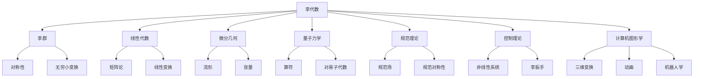

# 线性代数导引：李代数简介

## 1. 背景介绍

### 1.1 问题的由来

线性代数是数学的一个重要分支,在物理、工程、经济等许多领域都有广泛的应用。在现代数学中,线性代数不仅是一门基础课程,更是一种强大的数学工具,被广泛应用于各个数学分支。其中,李代数(Lie Algebra)作为线性代数的一个重要分支,在理论物理、控制理论、微分几何等领域扮演着关键角色。

李代数最初由挪威数学家索菲娅·李(Sophus Lie)在19世纪后期提出,用于研究连续李群(Lie Group)的无穷小变换。在此后的发展中,李代数不仅成为研究李群的有力工具,更成为了代数、几何、物理等多个领域的重要数学基础。

### 1.2 研究现状

近年来,随着科学技术的飞速发展,李代数在诸多领域得到了广泛的应用和研究。例如:

1. **量子力学**: 李代数在量子力学中扮演着核心角色,被用于描述量子系统的对称性和不变量。
2. **相对论**: 狭义相对论和广义相对论中的洛伦兹变换和广义协变性都与李群和李代数密切相关。
3. **粒子物理**: 标准模型中的规范理论和规范场都与李代数有着内在联系。
4. **控制理论**: 李代数在非线性控制系统的分析和设计中发挥着重要作用。
5. **计算机图形学**: 李群和李代数被广泛应用于三维变换、动画和机器人学等领域。

随着研究的不断深入,李代数在数学和物理学领域的应用也日益广泛,成为了当代科学研究的重要数学工具。

### 1.3 研究意义

李代数作为一种强大的数学工具,其研究意义主要体现在以下几个方面:

1. **理论基础**: 李代数为研究连续李群、微分几何、量子力学等领域奠定了坚实的数学基础。
2. **应用价值**: 李代数在物理学、控制理论、计算机图形学等领域有着广泛的应用,是解决实际问题的有力工具。
3. **数学工具**: 李代数为研究非线性系统、对称性和不变量提供了强有力的数学语言和方法。
4. **交叉学科**: 李代数的研究需要结合代数、几何、分析等多个数学分支,促进了不同领域的交叉融合。

总的来说,李代数不仅在理论层面具有重要意义,更为解决实际问题提供了有力的数学工具,是当代数学研究的重要组成部分。

### 1.4 本文结构

本文将全面介绍李代数的基本概念、理论基础和应用实践,内容安排如下:

1. 背景介绍
2. 核心概念与联系
3. 核心算法原理与具体操作步骤
4. 数学模型和公式详细讲解与举例说明
5. 项目实践:代码实例和详细解释说明
6. 实际应用场景
7. 工具和资源推荐
8. 总结:未来发展趋势与挑战
9. 附录:常见问题与解答

通过对李代数的系统学习,读者将全面掌握李代数的基本理论和应用,为进一步深入研究打下坚实基础。

## 2. 核心概念与联系

李代数是一个跨学科的数学概念,与许多数学分支和应用领域密切相关。下面将介绍李代数的核心概念及其与其他领域的联系:

1. **李群(Lie Group)**: 李代数最初由索菲娅·李提出,用于研究连续李群的无穷小变换。李群是一种连续变换群,具有平滑的结构,而李代数则描述了李群在单位元附近的局部线性近似。

2. **线性代数**: 李代数建立在线性代数的基础之上,是线性代数的一个重要分支。李代数中的许多概念和运算都源自线性代数,如矩阵论、线性变换等。

3. **微分几何**: 李代数与微分几何有着内在联系,被广泛应用于研究流形、张量场等概念。李代数为研究微分流形上的对称性和不变量提供了有力工具。

4. **量子力学**: 在量子力学中,李代数被用于描述量子系统的对称性和不变量,如算符的对易关系、对易子代数等。

5. **规范理论**: 粒子物理学中的规范理论和规范场都与李代数密切相关,规范对称性可以用李代数来描述。

6. **控制理论**: 李代数在非线性控制系统的分析和设计中发挥着重要作用,如李扳手(Lie Bracket)等概念。

7. **计算机图形学**: 在三维变换、动画和机器人学等领域,李群和李代数被广泛应用于描述刚体运动和关节运动。

可见,李代数不仅是一个重要的数学概念,更是连接多个学科领域的纽带,在理论研究和实际应用中扮演着关键角色。

## 3. 核心算法原理与具体操作步骤

### 3.1 算法原理概述

李代数的核心算法原理可以概括为以下几个方面:

1. **李代数的定义**: 李代数是一个向量空间,在其上定义了一种满足特定性质的二元运算,称为李括号(Lie Bracket)。

2. **李括号**: 李括号是李代数中最关键的二元运算,它满足双线性、反交换和雅可比恒等式等性质。

3. **生成元和根系**: 在李代数中,可以通过一组基本向量(生成元)及其李括号关系(根系)来唯一确定整个李代数的结构。

4. **李代数同构**: 两个李代数之间可以建立同构关系,即存在一个保留李括号运算的线性同构映射。

5. **李代数表示**: 李代数可以通过在向量空间上的线性变换来表示,这种表示方式与研究李群的表示论密切相关。

6. **指数映射**: 李代数与其对应的李群之间存在着指数映射,它将李代数元素映射到李群元素,是连接两者的重要桥梁。

7. **结构常数**: 结构常数描述了李代数生成元之间的李括号关系,是研究李代数结构的关键工具。

8. **理想和商代数**: 李代数中存在理想和商代数的概念,可以用于简化和分解复杂的李代数结构。

总的来说,李代数的核心算法原理包括了李括号运算、生成元和根系、同构映射、表示论、指数映射、结构常数等多个方面,为研究和应用李代数奠定了坚实的理论基础。

### 3.2 算法步骤详解

下面将详细介绍李代数核心算法的具体操作步骤:

1. **确定向量空间**: 首先需要确定一个底层的向量空间,通常选择实数域或复数域上的有限维向量空间。

2. **定义李括号**: 在向量空间上定义一个满足双线性、反交换和雅可比恒等式的二元运算,即李括号。具体操作是:
   - 对于任意向量 $\vec{x}$、$\vec{y}$ 和标量 $\alpha$、$\beta$,需要满足双线性性质:
     $$[\alpha\vec{x} + \beta\vec{y}, \vec{z}] = \alpha[\vec{x}, \vec{z}] + \beta[\vec{y}, \vec{z}]$$
   - 对于任意向量 $\vec{x}$、$\vec{y}$,需要满足反交换性:
     $$[\vec{x}, \vec{y}] = -[\vec{y}, \vec{x}]$$
   - 对于任意向量 $\vec{x}$、$\vec{y}$、$\vec{z}$,需要满足雅可比恒等式:
     $$[\vec{x}, [\vec{y}, \vec{z}]] + [\vec{y}, [\vec{z}, \vec{x}]] + [\vec{z}, [\vec{x}, \vec{y}]] = 0$$

3. **确定生成元和根系**: 选取一组基本向量作为生成元,通过计算它们之间的李括号关系来确定根系。

4. **计算结构常数**: 根据生成元之间的李括号关系,计算出对应的结构常数,它们完全描述了李代数的代数结构。

5. **建立同构映射**: 如果存在两个李代数之间的同构关系,可以建立一个保留李括号运算的线性同构映射。

6. **构造表示**: 在向量空间上选取一组线性变换,使它们在李括号运算下封闭,从而构造出李代数的表示。

7. **研究理想和商代数**: 对于复杂的李代数,可以找出其理想子代数,并研究对应的商代数,以简化问题。

8. **应用指数映射**: 利用指数映射,将李代数元素映射到对应的李群元素,从而将李代数的性质应用到李群的研究中。

9. **求解李代数方程**: 根据具体问题,建立相应的李代数方程,并利用上述步骤求解。

通过这一系列步骤,可以全面掌握李代数的核心算法原理,为进一步研究和应用李代数奠定基础。

### 3.3 算法优缺点

李代数作为一种重要的数学工具,在应用中具有以下优点:

1. **简洁性**: 李代数用简洁的代数语言描述了连续变换群的局部线性近似,大大简化了计算和分析。

2. **普适性**: 李代数可以应用于多个学科领域,如物理学、控制理论、计算机图形学等,具有极强的普适性。

3. **结构性**: 李代数具有清晰的代数结构,如生成元、根系、结构常数等,便于理解和操作。

4. **线性化**: 李代数为研究非线性系统提供了线性化的方法,使复杂问题更易于处理。

5. **对称性**: 李代数能够有效描述和研究各种对称性和不变量,是研究对称性的强有力工具。

然而,李代数也存在一些局限性和缺点:

1. **抽象性**: 李代数是一个高度抽象的数学概念,需要一定的数学基础和直觉才能充分理解。

2. **计算复杂性**: 在实际应用中,李代数的计算往往比较复杂,需要熟练掌握相关技巧和工具。

3. **线性近似**: 李代数只是连续变换群的局部线性近似,在某些情况下可能无法完全描述整个变换群。

4. **有限维限制**: 许多理论结果只适用于有限维李代数,对无限维情况的研究仍然是一个挑战。

5. **应用门槛**: 要熟练应用李代数,需要对相关数学理论和应用领域都有深入的理解,门槛较高。

总的来说,李代数是一种功能强大但也具有一定局限性的数学工具。在实际应用中,需要权衡利弊,结合具体问题选择合适的方法和工具。

### 3.4 算法应用领域

李代数作为一种重要的数学工具,在诸多领域都有广泛的应用,主要包括:

1. **物理学**:
   - 量子力学:李代数在量子力学中扮演核心角色,被用于描述量子系统的对称性和不变量。
   - 相对论:洛伦兹变换和广义协变性都与李群和李代数密切相关。
   - 规范理论:标准模型中的规范理论和规范场都与李代数有着内在联系。
   - 弦理