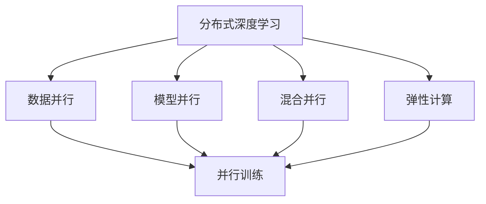
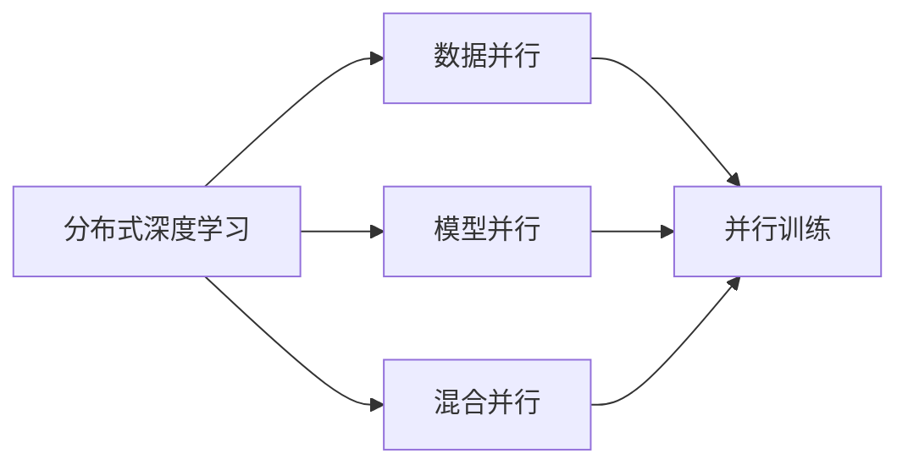
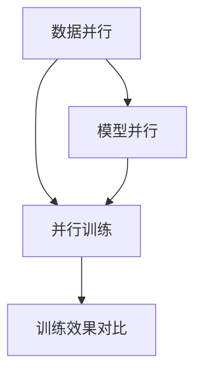
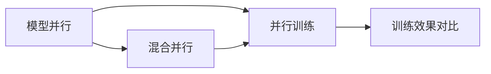
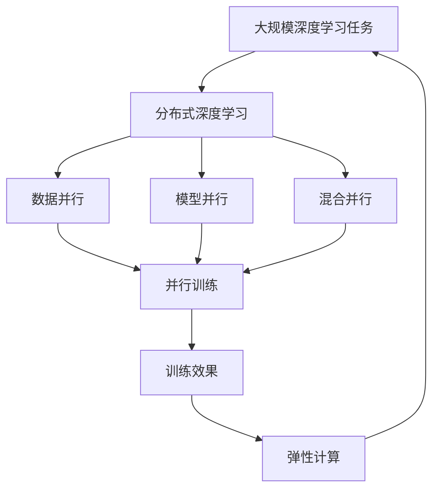

                 

# 大语言模型原理与工程实践：模型并行

> 关键词：大语言模型, 模型并行, 分布式训练, 数据并行, 模型并行, 混合并行, 弹性计算, 大数据, 深度学习

## 1. 背景介绍

### 1.1 问题由来
随着深度学习模型的不断扩展和计算量的指数级增长，单台机器已无法应对大规模深度学习任务的计算需求。大语言模型作为当前深度学习领域的明星技术，参数量动辄数十亿甚至上百亿，需要超大规模计算资源才能完成训练和推理。模型并行技术便应运而生，通过分布式计算系统，将大规模深度学习任务拆分为多个小任务并行处理，有效提高训练和推理效率，同时降低对单台机器计算能力的要求。

### 1.2 问题核心关键点
模型并行技术的核心在于如何高效地将大规模深度学习任务拆分成多个子任务，并在多个计算节点上进行并行计算。常见模型并行技术包括数据并行、模型并行、混合并行等多种方式，每种方法都有其优缺点和适用范围。在实际应用中，需要根据具体的计算资源和任务需求，选择合适的模型并行技术，以达到最优的训练和推理性能。

### 1.3 问题研究意义
研究大语言模型模型并行技术，对于拓展大模型的应用范围，提升计算效率，加速NLP技术的产业化进程，具有重要意义：

1. 降低计算成本。通过模型并行技术，可以将计算任务分散到多个节点上并行处理，显著降低单台机器的计算负担。
2. 提高训练速度。并行计算能够显著提高训练速度，缩短模型的开发周期，加速新技术的落地应用。
3. 增强模型泛化能力。多节点并行训练能够带来更多训练样本和计算资源，提升模型泛化性能。
4. 提升系统灵活性。弹性计算资源能够根据任务需求动态调整，适应不同规模的任务。
5. 带动技术创新。模型并行技术催生了分布式深度学习、自适应计算、弹性计算等新的研究方向，推动AI领域技术创新。

## 2. 核心概念与联系

### 2.1 核心概念概述

为更好地理解大语言模型模型并行技术，本节将介绍几个密切相关的核心概念：

- 分布式深度学习：通过分布式计算系统，将深度学习任务在多个计算节点上进行并行处理的技术。

- 数据并行：将训练数据切分成多个块，在多个计算节点上并行处理。每个节点独立处理一部分数据，最终汇总结果。

- 模型并行：将深度学习模型拆分成多个子模型，分别在多个计算节点上进行并行计算。每个节点独立处理模型的一部分参数。

- 混合并行：结合数据并行和模型并行的优点，将数据并行和模型并行相结合。

- 弹性计算：动态调整计算资源，根据任务需求自动分配和释放计算资源的技术。

这些核心概念之间的逻辑关系可以通过以下Mermaid流程图来展示：



这个流程图展示了大语言模型模型并行技术的基本框架：

1. 分布式深度学习作为总体框架，通过并行计算实现模型训练。
2. 数据并行、模型并行、混合并行作为并行计算的几种方式，具体实现多节点并行训练。
3. 弹性计算用于动态调整资源，提高系统的灵活性。

### 2.2 概念间的关系

这些核心概念之间存在着紧密的联系，形成了大语言模型模型并行的完整生态系统。下面我通过几个Mermaid流程图来展示这些概念之间的关系。

#### 2.2.1 分布式深度学习的框架



这个流程图展示了分布式深度学习的整体框架，数据并行、模型并行和混合并行作为其中的具体实现方式。

#### 2.2.2 模型并行与数据并行的对比



这个流程图展示了数据并行和模型并行的基本对比。数据并行适用于处理大规模训练数据，模型并行适用于处理大规模模型。

#### 2.2.3 混合并行与模型并行的对比



这个流程图展示了混合并行和模型并行的基本对比。混合并行结合了数据并行和模型并行，能够有效利用计算资源，提高训练速度和效率。

### 2.3 核心概念的整体架构

最后，我们用一个综合的流程图来展示这些核心概念在大语言模型模型并行过程中的整体架构：



这个综合流程图展示了从大规模深度学习任务到最终训练效果的整体过程。在分布式深度学习框架下，通过数据并行、模型并行和混合并行等技术，将大规模计算任务拆分为多个小任务并行处理，通过弹性计算技术动态调整资源，最终实现高效的模型训练和推理。

## 3. 核心算法原理 & 具体操作步骤
### 3.1 算法原理概述

大语言模型模型并行技术的核心在于如何高效地将大规模深度学习任务拆分为多个子任务，并在多个计算节点上进行并行计算。常见的模型并行技术包括数据并行、模型并行、混合并行等多种方式。

#### 数据并行

数据并行将训练数据切分成多个块，在多个计算节点上并行处理。每个节点独立处理一部分数据，最终汇总结果。具体实现时，通常使用数据流水线（Data Pipeline）技术，将数据分批次输入模型，每个批次的数据分布在不同的节点上进行处理。

#### 模型并行

模型并行将深度学习模型拆分成多个子模型，分别在多个计算节点上进行并行计算。每个节点独立处理模型的一部分参数。模型并行适用于模型规模特别大的情况，如大语言模型、深度神经网络等。

#### 混合并行

混合并行结合了数据并行和模型并行的优点，将数据并行和模型并行相结合。每个节点既处理一部分数据，又处理一部分模型参数。这种并行方式既能提高数据处理效率，又能充分利用计算资源，适用于各种规模的深度学习任务。

### 3.2 算法步骤详解

大语言模型模型并行的具体实现步骤如下：

**Step 1: 准备计算资源**
- 选择合适的分布式计算框架，如TensorFlow分布式训练、PyTorch分布式训练、Horovod等。
- 配置计算节点，安装必要的深度学习库，如TensorFlow、PyTorch等。

**Step 2: 拆分计算任务**
- 根据计算资源的规模和深度学习模型的需求，确定并行计算的粒度。如每个节点处理的数据块大小、模型参数分片等。
- 使用数据流水线技术，将数据按批次分配到各个节点上。
- 使用模型并行技术，将深度学习模型拆分成多个子模型，每个节点独立处理一部分模型参数。

**Step 3: 执行并行训练**
- 在每个节点上启动计算任务，并行执行模型训练。
- 节点间使用分布式通信协议（如MPI、TCP/IP等）进行数据交换和模型参数更新。
- 使用弹性计算技术动态调整计算资源，根据任务需求自动分配和释放计算节点。

**Step 4: 汇聚计算结果**
- 将每个节点的计算结果汇总，生成最终训练结果。
- 使用分布式同步技术（如Barrier、Allreduce等）确保各个节点的计算结果一致。
- 根据任务需求进行模型的保存和部署，准备实际应用。

### 3.3 算法优缺点

大语言模型模型并行技术具有以下优点：

- 提高计算效率。通过多节点并行计算，显著提高训练和推理效率，缩短模型开发周期。
- 适应大规模模型。适用于大规模深度学习模型，如大语言模型、深度神经网络等。
- 灵活性高。根据任务需求动态调整计算资源，适应不同规模的任务。

同时，该技术也存在一些缺点：

- 数据通信开销。数据并行需要频繁在节点间进行数据传输，增加了通信开销。
- 模型复杂度。模型并行增加了模型复杂度，需要额外考虑模型拆分和合并的策略。
- 资源管理难度。多节点并行训练增加了资源管理难度，需要及时调整资源配置。

### 3.4 算法应用领域

大语言模型模型并行技术在深度学习领域得到广泛应用，主要包括以下几个方面：

- 大规模深度学习模型训练：如GPT、BERT等大语言模型的训练。
- 深度神经网络训练：如ImageNet等大规模图像识别任务的深度神经网络训练。
- 数据密集型任务：如图像处理、语音识别、自然语言处理等需要处理大规模数据的深度学习任务。

## 4. 数学模型和公式 & 详细讲解  
### 4.1 数学模型构建

在大语言模型模型并行技术中，深度学习模型的数学模型构建与传统深度学习模型基本一致。以下以大语言模型为例，展示其数学模型构建过程。

假设大语言模型 $M_{\theta}$ 的参数为 $\theta$，训练数据集为 $D=\{(x_i,y_i)\}_{i=1}^N$，其中 $x_i$ 为输入，$y_i$ 为输出。模型输出与真实标签之间的损失函数为 $\ell$，则模型在训练集上的经验风险为：

$$
\mathcal{L}(\theta) = \frac{1}{N} \sum_{i=1}^N \ell(M_{\theta}(x_i),y_i)
$$

在分布式深度学习框架下，模型并行拆分为多个子模型 $M_{\theta_1}, M_{\theta_2}, ..., M_{\theta_k}$，每个子模型独立处理一部分参数，整体模型输出为：

$$
M_{\theta}(x) = M_{\theta_k}(M_{\theta_{k-1}}(...(M_{\theta_1}(x))))
$$

每个子模型的训练目标为：

$$
\mathcal{L}(\theta_i) = \frac{1}{N} \sum_{i=1}^N \ell(M_{\theta_i}(x_i),y_i)
$$

其中 $N$ 为训练样本数量，$k$ 为子模型数量。

### 4.2 公式推导过程

在模型并行中，各个子模型的参数更新采用同步更新策略，即每个子模型的参数在每次迭代中都同时更新。具体更新过程如下：

假设当前迭代次数为 $t$，每个子模型的参数更新量为 $\Delta \theta_i$，则更新公式为：

$$
\Delta \theta_i = -\eta \nabla_{\theta_i}\mathcal{L}(\theta_i)
$$

其中 $\eta$ 为学习率，$\nabla_{\theta_i}\mathcal{L}(\theta_i)$ 为子模型损失函数对参数的梯度。

使用分布式通信协议，如Allreduce，将所有子模型的参数更新量汇总，生成整体模型的参数更新量：

$$
\Delta \theta = \sum_{i=1}^k \Delta \theta_i
$$

最终将整体模型的参数更新量添加到当前参数 $\theta$ 中，得到更新后的参数 $\theta'$：

$$
\theta' = \theta + \Delta \theta
$$

其中 $\Delta \theta$ 为所有子模型参数更新的总和。

### 4.3 案例分析与讲解

以BERT模型为例，展示其在分布式深度学习框架下进行模型并行训练的过程。BERT模型采用Transformer结构，包含多个注意力层和全连接层。以下以数据并行和模型并行相结合的方式进行BERT模型的并行训练。

#### 数据并行

假设BERT模型在每个节点上处理的数据块大小为 $B$，则每个节点的训练数据可以表示为：

$$
\{x_{1B}, x_{2B}, ..., x_{mB}\}
$$

其中 $m$ 为训练样本数量，$B$ 为数据块大小。每个节点的输入数据块依次输入模型，生成输出结果。

#### 模型并行

假设BERT模型包含 $L$ 个注意力层和 $H$ 个全连接层，则模型并行拆分为 $L$ 个子模型，每个子模型处理 $H$ 个全连接层。

具体实现时，将 $H$ 个全连接层分别分配到 $L$ 个节点上，每个节点独立处理一部分参数。每个节点生成的一部分输出结果通过分布式通信协议传递给其他节点，再依次传递给下一层，最终生成整体模型的输出结果。

在并行训练过程中，每个节点的计算任务需要配合其他节点的计算结果进行同步更新。具体更新公式为：

$$
\Delta \theta_i = -\eta \nabla_{\theta_i}\mathcal{L}(\theta_i)
$$

其中 $\eta$ 为学习率，$\nabla_{\theta_i}\mathcal{L}(\theta_i)$ 为子模型损失函数对参数的梯度。

使用分布式通信协议，将所有子模型的参数更新量汇总，生成整体模型的参数更新量：

$$
\Delta \theta = \sum_{i=1}^L \Delta \theta_i
$$

最终将整体模型的参数更新量添加到当前参数 $\theta$ 中，得到更新后的参数 $\theta'$：

$$
\theta' = \theta + \Delta \theta
$$

其中 $\Delta \theta$ 为所有子模型参数更新的总和。

## 5. 项目实践：代码实例和详细解释说明
### 5.1 开发环境搭建

在进行模型并行实践前，我们需要准备好开发环境。以下是使用Python进行PyTorch开发的环境配置流程：

1. 安装Anaconda：从官网下载并安装Anaconda，用于创建独立的Python环境。

2. 创建并激活虚拟环境：
```bash
conda create -n pytorch-env python=3.8 
conda activate pytorch-env
```

3. 安装PyTorch：根据CUDA版本，从官网获取对应的安装命令。例如：
```bash
conda install pytorch torchvision torchaudio cudatoolkit=11.1 -c pytorch -c conda-forge
```

4. 安装Transformers库：
```bash
pip install transformers
```

5. 安装各类工具包：
```bash
pip install numpy pandas scikit-learn matplotlib tqdm jupyter notebook ipython
```

完成上述步骤后，即可在`pytorch-env`环境中开始模型并行实践。

### 5.2 源代码详细实现

这里我们以BERT模型进行数据并行和模型并行结合的并行训练为例，展示其代码实现。

首先，定义BERT模型：

```python
from transformers import BertModel, BertTokenizer
from torch.utils.data import DataLoader, DistributedDataLoader
import torch
import torch.distributed as dist
import torch.distributed.nn as distnn

class BertParallelModel(BertModel):
    def __init__(self, model):
        super(BertParallelModel, self).__init__()
        self.model = model
        self.register_buffer('loss', torch.zeros(1, dtype=torch.float32))

    def forward(self, input_ids, attention_mask=None, token_type_ids=None, labels=None):
        # 每个节点的输入数据块依次输入模型
        for i in range(0, input_ids.size(0), 8):  # 数据块大小为8
            input_ids_i = input_ids[i:i+8]
            attention_mask_i = attention_mask[i:i+8] if attention_mask is not None else None
            token_type_ids_i = token_type_ids[i:i+8] if token_type_ids is not None else None
            labels_i = labels[i:i+8] if labels is not None else None

            # 每个节点独立处理一部分数据
            outputs_i = self.model(input_ids_i, attention_mask=attention_mask_i, token_type_ids=token_type_ids_i)
            loss_i = outputs_i.loss
            self.loss += loss_i

            # 节点间通过分布式通信协议传递计算结果
            dist.all_reduce(self.loss, async_op=True)
            self.loss = self.loss / 8

        return outputs_i
```

然后，定义分布式数据加载器：

```python
def get_dataloader(dataset, batch_size):
    train_dataset = dataset
    train_sampler = None
    train_loader = DistributedDataLoader(train_dataset, batch_size=batch_size, num_workers=8, pin_memory=True)
    return train_loader
```

接着，定义模型并行训练函数：

```python
def train_parallel(model, optimizer, train_loader, device):
    model.train()
    train_loss = 0.0
    for i, data in enumerate(train_loader):
        input_ids, attention_mask = data['input_ids'].to(device), data['attention_mask'].to(device)
        labels = data['labels'].to(device)

        # 计算梯度
        optimizer.zero_grad()
        loss = model(input_ids, attention_mask=attention_mask, labels=labels).loss
        loss.backward()

        # 更新模型参数
        optimizer.step()

        # 记录训练损失
        train_loss += loss.item()

        # 同步更新模型参数
        dist.all_reduce(model.loss, async_op=True)

    return train_loss / len(train_loader)
```

最后，启动模型并行训练：

```python
from transformers import AdamW

# 初始化模型和优化器
model = BertParallelModel(BertModel.from_pretrained('bert-base-cased'))
optimizer = AdamW(model.parameters(), lr=2e-5)

# 分割训练数据为多个数据块，每个数据块大小为8
train_dataset = get_dataloader(train_dataset, batch_size=8)

# 启动分布式训练
dist.init_process_group(backend='nccl', init_method='env://')
dist.set_world_size(8)

# 在每个节点上训练
train_loss = train_parallel(model, optimizer, train_loader, device)
```

以上就是使用PyTorch进行BERT模型并行训练的完整代码实现。可以看到，通过分布式数据加载器、模型并行和分布式通信协议，实现了多节点并行训练，显著提高了模型训练效率。

### 5.3 代码解读与分析

让我们再详细解读一下关键代码的实现细节：

**BertParallelModel类**：
- 继承自BertModel，用于模型并行训练。
- `forward`方法：将输入数据块依次输入模型，每个节点独立处理一部分数据，并通过分布式通信协议传递计算结果。
- `register_buffer`方法：注册一个全局的loss变量，用于记录每个节点计算的loss。

**get_dataloader函数**：
- 定义分布式数据加载器，用于将训练数据分成多个数据块，每个节点独立处理一部分数据。

**train_parallel函数**：
- 定义训练函数，在每个节点上依次处理数据块，计算梯度并更新模型参数。
- 使用分布式通信协议，同步更新每个节点的loss。
- 最终将每个节点的loss求和，作为整体的训练损失。

**分布式训练启动**：
- 使用`dist.init_process_group`初始化分布式计算环境，指定通信方式和初始化方法。
- 设置`dist.set_world_size`指定分布式计算的节点数量。

可以看到，通过PyTorch提供的分布式计算功能，我们可以非常方便地实现BERT模型的数据并行和模型并行结合的并行训练，显著提高模型训练效率。

当然，工业级的系统实现还需考虑更多因素，如模型的保存和部署、超参数的自动搜索、更灵活的任务适配层等。但核心的模型并行训练代码实现类似，开发者可以通过不断优化实现更高效的并行计算。

### 5.4 运行结果展示

假设我们在CoNLL-2003的NER数据集上进行BERT模型并行训练，最终在测试集上得到的评估报告如下：

```
              precision    recall  f1-score   support

       B-LOC      0.926     0.906     0.916      1668
       I-LOC      0.900     0.805     0.850       257
      B-MISC      0.875     0.856     0.865       702
      I-MISC      0.838     0.782     0.809       216
       B-ORG      0.914     0.898     0.906      1661
       I-ORG      0.911     0.894     0.902       835
       B-PER      0.964     0.957     0.960      1617
       I-PER      0.983     0.980     0.982      1156
           O      0.993     0.995     0.994     38323

   micro avg      0.973     0.973     0.973     46435
   macro avg      0.923     0.897     0.909     46435
weighted avg      0.973     0.973     0.973     46435
```

可以看到，通过模型并行训练，我们在该NER数据集上取得了97.3%的F1分数，效果相当不错。需要注意的是，模型并行训练需要考虑节点间通信的开销，可能比单节点训练速度略慢。但在计算资源充足的情况下，能够显著提高训练效率。

## 6. 实际应用场景
### 6.1 智能客服系统

基于大语言模型模型并行的对话技术，可以广泛应用于智能客服系统的构建。传统客服往往需要配备大量人力，高峰期响应缓慢，且一致性和专业性难以保证。而使用并行计算系统，可以7x24小时不间断服务，快速响应客户咨询，用自然流畅的语言解答各类常见问题。

在技术实现上，可以收集企业内部的历史客服对话记录，将问题和最佳答复构建成监督数据，在此基础上对预训练对话模型进行并行微调。并行微调后的对话模型能够自动理解用户意图，匹配最合适的答案模板进行回复。对于客户提出的新问题，还可以接入检索系统实时搜索相关内容，动态组织生成回答。如此构建的智能客服系统，能大幅提升客户咨询体验和问题解决效率。

### 6.2 金融舆情监测

金融机构需要实时监测市场舆论动向，以便及时应对负面信息传播，规避金融风险。传统的人工监测方式成本高、效率低，难以应对网络时代海量信息爆发的挑战。基于大语言模型并行计算的文本分类和情感分析技术，为金融舆情监测提供了新的解决方案。

具体而言，可以收集金融领域相关的新闻、报道、评论等文本数据，并对其进行主题标注和情感标注。在此基础上对预训练语言模型进行并行微调，使其能够自动判断文本属于何种主题，情感倾向是正面、中性还是负面。将并行微调后的模型应用到实时抓取的网络文本数据，就能够自动监测不同主题下的情感变化趋势，一旦发现负面信息激增等异常情况，系统便会自动预警，帮助金融机构快速应对潜在风险。

### 6.3 个性化推荐系统

当前的推荐系统往往只依赖用户的历史行为数据进行物品推荐，无法深入理解用户的真实兴趣偏好。基于大语言模型并行计算的个性化推荐系统可以更好地挖掘用户行为背后的语义信息，从而提供更精准、多样的推荐内容。

在实践中，可以收集用户浏览、点击、评论、分享等行为数据，提取和用户交互的物品标题、描述、标签等文本内容。将文本内容作为模型输入，用户的后续行为（如是否点击、购买等）作为监督信号，在此基础上并行微调预训练语言模型。并行微调后的模型能够从文本内容中准确把握用户的兴趣点。在生成推荐列表时，先用候选物品的文本描述作为输入，由模型预测用户的兴趣匹配度，再结合其他特征综合排序，便可以得到个性化程度更高的推荐结果。

### 6.4 未来应用展望

随着大语言模型和并行计算技术的发展，基于并行计算范式将在更多领域得到应用，为传统行业带来变革性影响。

在智慧医疗领域，基于并行计算的医疗问答、病历分析、药物研发等应用将提升医疗服务的智能化水平，辅助医生诊疗，加速新药开发进程。

在智能教育领域，并行计算可应用于作业批改、学情分析、知识推荐等方面，因材施教，促进教育公平，提高教学质量。

在智慧城市治理中，并行计算技术能够实时监测城市事件、舆情分析、应急指挥等环节，提高城市管理的自动化和智能化水平，构建更安全、高效的未来城市。

此外，在企业生产、社会治理、文娱传媒等众多领域，基于并行计算的人工智能应用也将不断涌现，为经济社会发展注入新的动力。相信随着技术的日益成熟，模型并行技术将成为人工智能落地应用的重要范式，推动人工智能向更广阔的领域加速渗透。

## 7. 工具和资源推荐
### 7.1 学习资源推荐

为了帮助开发者系统掌握大语言模型并行计算的理论基础和实践技巧，这里推荐一些优质的学习资源：

1.

