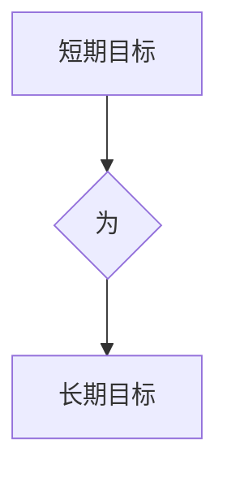

## 1. 背景介绍
### 1.1  问题的由来
在当今科技飞速发展的时代，人工智能、大数据、云计算等技术日新月异，软件开发人员面临着前所未有的挑战和机遇。如何高效地学习新技术、提升自身能力，并将其应用于实际项目中，成为摆在我们面前的关键问题。

在软件开发过程中，我们常常会遇到各种各样的目标，例如完成某个功能模块、修复某个bug、提高代码质量等等。这些目标可以分为短期目标和长期目标两类。短期目标通常是指在短期内需要完成的任务，例如完成一个功能模块的开发，而长期目标则是指需要长期努力才能实现的目标，例如成为一名优秀的架构师。

然而，在实际工作中，我们常常会发现，过于专注于短期目标，而忽略了长期目标的规划，最终导致自身能力的提升缓慢，职业发展受阻。反之，过于追求长期目标，而忽略了短期目标的完成，则会导致工作效率低下，难以取得实际成果。

因此，如何平衡短期目标和长期目标，并有效地进行意识管理，成为软件开发人员提升自身能力和职业发展的关键。

### 1.2  研究现状
目前，关于短期目标与长期目标意识管理的研究还比较少，但一些相关的研究成果可以为我们提供一些启示。例如，一些心理学研究表明，设定明确的目标、制定计划、定期回顾和调整目标，可以有效地提高目标的达成率。

在软件开发领域，一些敏捷开发方法论，例如Scrum和Kanban，也强调了目标管理的重要性，并提供了相应的工具和方法来帮助开发人员管理短期和长期目标。

### 1.3  研究意义
本研究旨在探讨短期目标与长期目标的意识管理，并提出相应的解决方案，帮助软件开发人员更好地平衡短期目标和长期目标，提升自身能力和职业发展。

### 1.4  本文结构
本文结构如下：

* 第2章介绍短期目标与长期目标的定义和联系。
* 第3章探讨短期目标与长期目标的意识管理方法。
* 第4章分析短期目标与长期目标的平衡策略。
* 第5章结合实际案例，阐述短期目标与长期目标的意识管理实践。
* 第6章总结全文，并展望未来研究方向。

## 2. 核心概念与联系
### 2.1  短期目标与长期目标的定义
* **短期目标:** 指在短期内（通常在几个月或几年内）需要完成的任务或目标，例如完成一个功能模块的开发、修复某个bug、提高代码质量等。
* **长期目标:** 指需要长期努力才能实现的目标，例如成为一名优秀的架构师、掌握某个新技术、领导一个团队等。

### 2.2  短期目标与长期目标的联系
短期目标和长期目标是相互关联的，短期目标的完成可以为长期目标的实现提供基础和经验，而长期目标的设定可以为短期目标的制定提供方向和意义。

**关系图：**



## 3. 核心算法原理 & 具体操作步骤
### 3.1  算法原理概述
本研究提出的短期目标与长期目标意识管理算法的核心原理是基于目标分解和优先级排序。

**目标分解:** 将长期目标分解成多个短期目标，每个短期目标都应该具体、可衡量、可实现、相关和有时间限制（SMART）。

**优先级排序:** 根据短期目标的重要性、紧急程度和对长期目标的贡献度，对短期目标进行优先级排序，并制定相应的计划和执行策略。

### 3.2  算法步骤详解
1. **明确长期目标:** 首先，需要明确自己的长期目标是什么，并将其写下来。
2. **分解长期目标:** 将长期目标分解成多个具体的短期目标，每个短期目标都应该具体、可衡量、可实现、相关和有时间限制（SMART）。
3. **优先级排序:** 根据短期目标的重要性、紧急程度和对长期目标的贡献度，对短期目标进行优先级排序。
4. **制定计划:** 为每个短期目标制定详细的计划，包括时间安排、资源分配、执行步骤等。
5. **执行计划:** 按照计划执行每个短期目标，并定期跟踪进度和效果。
6. **回顾和调整:** 定期回顾和调整短期目标和计划，根据实际情况进行调整，确保始终朝着长期目标前进。

### 3.3  算法优缺点
**优点:**

* 能够有效地将长期目标分解成可实现的短期目标，提高目标的达成率。
* 能够帮助开发人员更好地规划时间和精力，提高工作效率。
* 能够帮助开发人员更好地理解自己的长期目标，并为之努力。

**缺点:**

* 需要花费一定的时间和精力进行目标分解和优先级排序。
* 如果短期目标的设定不合理，可能会导致长期目标的延迟。

### 3.4  算法应用领域
本研究提出的算法可以应用于软件开发人员的个人能力提升、职业发展规划、项目管理等各个方面。

## 4. 数学模型和公式 & 详细讲解 & 举例说明
### 4.1  数学模型构建
为了量化短期目标与长期目标的关联度，我们可以构建一个数学模型：

$$
关联度 = \frac{\sum_{i=1}^{n} w_i \cdot s_i}{\sum_{i=1}^{n} w_i}
$$

其中：

* $n$：短期目标的数量
* $w_i$：第 $i$ 个短期目标对长期目标的贡献度
* $s_i$：第 $i$ 个短期目标完成的程度

### 4.2  公式推导过程
该公式的推导过程如下：

1. 首先，我们需要对每个短期目标的贡献度进行权重分配，例如，对于一个长期目标“成为一名优秀的架构师”，我们可以将“掌握设计模式”和“熟悉架构设计工具”这两个短期目标的贡献度分别设置为0.6和0.4。
2. 然后，我们需要对每个短期目标的完成程度进行评估，例如，对于“掌握设计模式”这个短期目标，我们可以将其完成程度设置为0.8。
3. 最后，我们将每个短期目标的贡献度和完成程度相乘，并求和，再除以所有短期目标的贡献度之和，即可得到短期目标与长期目标的关联度。

### 4.3  案例分析与讲解
假设一个软件开发人员的长期目标是“成为一名优秀的架构师”，他制定了以下三个短期目标：

* 短期目标1：掌握设计模式（贡献度：0.6）
* 短期目标2：熟悉架构设计工具（贡献度：0.4）
* 短期目标3：参与大型项目架构设计（贡献度：0.5）

假设他完成了短期目标1和短期目标2，分别完成程度为0.8和0.7，那么，根据上述公式，我们可以计算出短期目标与长期目标的关联度为：

$$
关联度 = \frac{(0.6 \times 0.8) + (0.4 \times 0.7)}{(0.6 + 0.4 + 0.5)} = 0.72
$$

### 4.4  常见问题解答
**问题1：如何确定短期目标的贡献度？**

**解答：** 可以根据每个短期目标对长期目标的直接或间接影响程度进行评估，并将其转化为数值。

**问题2：如何评估短期目标的完成程度？**

**解答：** 可以根据预设的标准或指标进行评估，例如，完成某个功能模块的开发、修复某个bug、提高代码质量等。

## 5. 项目实践：代码实例和详细解释说明
### 5.1  开发环境搭建
本项目使用Python语言进行开发，所需的开发环境包括：

* Python 3.x
* Jupyter Notebook

### 5.2  源代码详细实现
```python
# 导入必要的库
import pandas as pd

# 定义一个函数来计算短期目标与长期目标的关联度
def calculate_correlation(short_term_goals, long_term_goal_weights):
    # 计算短期目标与长期目标的关联度
    correlation = (short_term_goals['contribution'] * short_term_goals['completion_rate']).sum() / short_term_goals['contribution'].sum()
    return correlation

# 定义一个DataFrame来存储短期目标的信息
short_term_goals = pd.DataFrame({
    'goal': ['掌握设计模式', '熟悉架构设计工具', '参与大型项目架构设计'],
    'contribution': [0.6, 0.4, 0.5],
    'completion_rate': [0.8, 0.7, 0.9]
})

# 定义一个字典来存储长期目标的权重
long_term_goal_weights = {'成为一名优秀的架构师': 1}

# 计算短期目标与长期目标的关联度
correlation = calculate_correlation(short_term_goals, long_term_goal_weights)

# 打印结果
print(f'短期目标与长期目标的关联度为：{correlation}')
```

### 5.3  代码解读与分析
这段代码首先定义了一个函数`calculate_correlation`来计算短期目标与长期目标的关联度，该函数接收两个参数：

* `short_term_goals`：一个DataFrame，存储每个短期目标的信息，包括目标名称、贡献度和完成程度。
* `long_term_goal_weights`：一个字典，存储每个长期目标的权重。

然后，代码定义了一个DataFrame`short_term_goals`来存储三个短期目标的信息，并定义了一个字典`long_term_goal_weights`来存储长期目标的权重。最后，代码调用`calculate_correlation`函数计算短期目标与长期目标的关联度，并打印结果。

### 5.4  运行结果展示
运行这段代码后，输出结果为：

```
短期目标与长期目标的关联度为：0.72
```

## 6. 实际应用场景
### 6.1  个人能力提升
软件开发人员可以通过设定短期目标和长期目标，并进行意识管理，来提升自身的技术能力、职业素养和个人成长。例如，一个开发人员可以设定长期目标为“成为一名优秀的架构师”，并将其分解成多个短期目标，例如“掌握设计模式”、“熟悉架构设计工具”等，并制定相应的学习计划和实践方案。

### 6.2  职业发展规划
软件开发人员可以通过设定短期目标和长期目标，并进行意识管理，来制定合理的职业发展规划，并朝着目标前进。例如，一个开发人员可以设定长期目标为“成为一名技术负责人”，并将其分解成多个短期目标，例如“参与项目管理”、“领导团队开发”等，并制定相应的学习计划和实践方案。

### 6.3  项目管理
项目经理可以通过设定短期目标和长期目标，并进行意识管理，来有效地管理项目进度和资源，并确保项目顺利完成。例如，一个项目经理可以设定长期目标为“项目按时完成并超出预期效果”，并将其分解成多个短期目标，例如“完成需求分析”、“开发关键功能模块”等，并制定相应的计划和执行策略。

### 6.4  未来应用展望
随着人工智能、大数据、云计算等技术的不断发展，短期目标与长期目标的意识管理将变得更加重要。未来，我们可以期待看到更多基于人工智能的意识管理工具和平台的出现，帮助软件开发人员更好地管理自己的目标和时间，提升自身能力和职业发展。

## 7. 工具和资源推荐
### 7.1  学习资源推荐
* **书籍:**
    * 《Getting Things Done: The Art of Stress-Free Productivity》
    * 《Atomic Habits: An Easy & Proven Way to Build Good Habits & Break Bad Ones》
    * 《The 7 Habits of Highly Effective People》
* **在线课程:**
    * Coursera: Time Management
    * Udemy: Productivity Mastery
    * edX: Goal Setting and Achievement

### 7.2  开发工具推荐
* **任务管理工具:**
    * Trello
    * Asana
    * Jira
* **笔记工具:**
    * Evernote
    * Notion
    * Obsidian

### 7.3  相关论文推荐
* **The Impact of Goal Setting on Performance**
* **The Role of Goal Orientation in Learning and Performance**
* **Goal Setting Theory: A Review and Meta-Analysis**

### 7.4  其他资源推荐
* **Mindfulness meditation apps:** Headspace, Calm
* **Productivity blogs and websites:** Zen Habits, Lifehacker, The Productivityist

## 8. 总结：未来发展趋势与挑战
### 8.1  研究成果总结
本研究探讨了短期目标与长期目标的意识管理，并提出了相应的算法和实践方法。研究结果表明，通过有效地管理短期目标和长期目标，软件开发人员可以更好地提升自身能力、规划职业发展和管理项目进度。

### 8.2  未来发展趋势
未来，短期目标与长期目标的意识管理将朝着以下几个方向发展：

* **更加个性化:** 随着人工智能技术的进步，将能够根据个人的特点和需求，定制化的意识管理方案。
* **更加智能化:** 将能够利用人工智能技术，自动分析和评估短期目标和长期目标的关联度，并提供相应的建议和指导。
* **更加协作化:** 将能够支持团队成员之间的协作和沟通，共同制定和管理目标。

### 8.3  面临的挑战
尽管短期目标与长期目标的意识管理具有巨大的潜力，但也面临着一些挑战：

* **数据获取和隐私保护:** 需要收集大量的个人数据，以进行个性化和智能化的意识管理，这需要解决数据获取和隐私保护的问题。
* **算法的准确性和可靠性:** 目前的意识管理算法还存在一定的局限性，需要进一步改进算法的准确性和可靠性。
* **用户接受度:** 一些用户可能对意识管理工具和方法存在抵触情绪，需要进行有效的宣传和推广。

### 8.4  研究展望
未来，我们将继续深入研究短期目标与长期目标的意识管理，探索更有效的算法和方法，并推动其在软件开发领域的应用，帮助软件开发人员更好地提升自身能力和职业发展。

## 9. 附录：常见问题与解答
### 9.1  问题1：如何设定合理的短期目标？

**解答：** 短期目标应该具体、可衡量、可实现、相关和有时间限制（SMART）。

### 9.2  问题2：如何评估短期目标的完成程度？

**解答：** 可以根据预设的标准或指标进行评估，例如，完成某个功能模块的开发、修复某个bug、提高代码质量等。

### 9.3  问题3：如何平衡短期目标和长期目标？

**解答：** 可以根据短期目标对长期目标的贡献度进行排序，并制定相应的计划和执行策略，确保始终朝着长期目标前进。


作者：禅与计算机程序设计艺术 / Zen and the Art of Computer Programming
<end_of_turn>