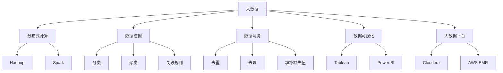
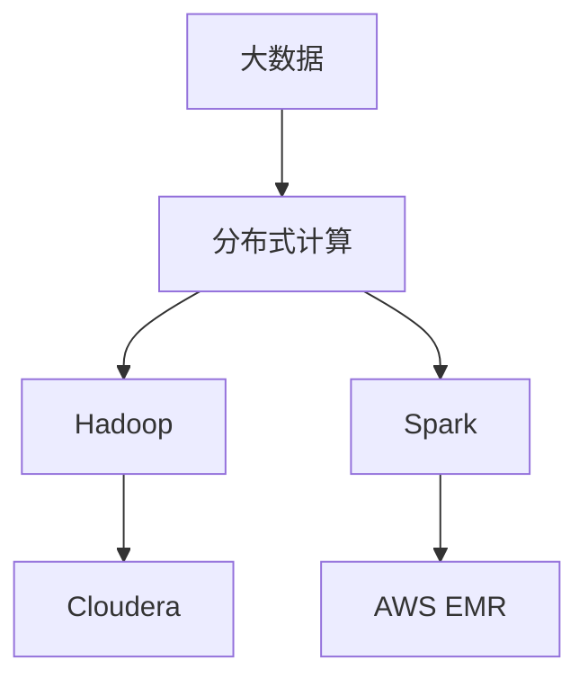
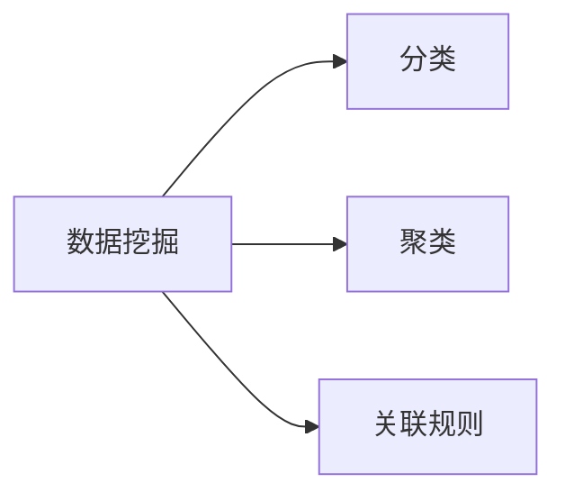

                 

# 大数据 原理与代码实例讲解

> 关键词：大数据, 数据挖掘, 数据清洗, 数据可视化, 大数据平台, Hadoop, Spark, 大数据分析

## 1. 背景介绍

### 1.1 问题由来
在过去几十年里，信息技术迅速发展，数据量呈指数级增长，推动了大数据时代的到来。大数据（Big Data）泛指规模巨大、类型多样、速度极快的数据集合。它不仅包括传统的关系型数据库中的结构化数据，还涵盖了非结构化数据（如文本、图片、视频）和半结构化数据（如JSON）。

随着互联网、物联网、社交媒体等技术的发展，全球每天产生的数据量高达2.5万亿字节，传统的数据处理方式已经无法满足需求。大数据的崛起，使得数据挖掘、数据分析、数据可视化等技术成为研究的热点，催生了大量创新应用，如智慧城市、精准医疗、推荐系统、金融风控等。

### 1.2 问题核心关键点
大数据的核心是“大”，不仅指数据量，更强调数据的多样性和快速性。它包括数据的收集、存储、处理和分析等环节。传统的数据处理流程无法满足大数据需求，必须借助新的技术和工具进行改进。

当前大数据处理的核心技术包括分布式计算（如Hadoop、Spark）、数据挖掘算法（如关联规则、聚类分析）、数据可视化工具（如Tableau、Power BI）和大数据平台（如Cloudera、AWS EMR）等。

## 2. 核心概念与联系

### 2.1 核心概念概述

为更好地理解大数据的原理和应用，本节将介绍几个密切相关的核心概念：

- 大数据（Big Data）：规模巨大、类型多样、速度极快的数据集合。包括结构化数据、非结构化数据和半结构化数据。
- 分布式计算（Distributed Computing）：将数据处理任务分布到多台计算机上，提高处理效率和系统扩展性。主要技术包括Hadoop和Spark。
- 数据挖掘（Data Mining）：从大数据中提取有用信息、发现规律、做出预测。主要算法包括分类、聚类、关联规则等。
- 数据清洗（Data Cleaning）：对大数据进行去重、去噪、填补缺失值等预处理，提高数据质量。
- 数据可视化（Data Visualization）：将大数据转换成图形化展示，帮助人们理解数据、发现趋势、做出决策。
- 大数据平台（Big Data Platform）：支持大数据存储、处理、分析和管理的技术平台，如Hadoop、Spark、Cloudera等。

这些核心概念之间的逻辑关系可以通过以下Mermaid流程图来展示：



这个流程图展示了大数据的核心概念及其之间的关系：

1. 大数据包括结构化数据、非结构化数据和半结构化数据。
2. 分布式计算技术将大数据处理任务分布到多台计算机上，提高效率和扩展性。
3. 数据挖掘算法从大数据中提取有用信息，发现规律和趋势。
4. 数据清洗技术对大数据进行预处理，提高数据质量。
5. 数据可视化工具将大数据转换为图形化展示，帮助理解数据。
6. 大数据平台支持数据存储、处理和分析，包括Hadoop、Spark、Cloudera等技术。

这些核心概念共同构成了大数据的处理和分析框架，使其能够在各种应用场景中发挥强大的作用。通过理解这些核心概念，我们可以更好地把握大数据技术的本质和工作原理。

### 2.2 概念间的关系

这些核心概念之间存在着紧密的联系，形成了大数据处理和分析的完整生态系统。下面我通过几个Mermaid流程图来展示这些概念之间的关系。

#### 2.2.1 大数据处理流程


这个流程图展示了大数据处理的基本流程：首先对大数据进行清洗，然后通过数据挖掘提取有用信息，最后使用数据可视化工具呈现结果。

#### 2.2.2 分布式计算与大数据平台的关系



这个流程图展示了分布式计算与大数据平台的关系。大数据处理任务通过分布式计算技术实现，Hadoop和Spark是常用的分布式计算框架，Cloudera和AWS EMR是常见的大数据平台。

#### 2.2.3 数据挖掘与算法的关系



这个流程图展示了数据挖掘与常见算法的关系。数据挖掘利用分类、聚类、关联规则等算法，从大数据中提取有用信息。

## 3. 核心算法原理 & 具体操作步骤
### 3.1 算法原理概述

大数据处理的核心在于利用分布式计算技术，将数据处理任务分布到多台计算机上，提高处理效率和系统扩展性。其中，数据挖掘是处理大数据的重要环节，常用的算法包括分类、聚类、关联规则等。

数据挖掘的原理是通过算法在大数据中寻找规律、发现模式、做出预测。以分类为例，假设有一组标注好的训练数据，算法通过学习训练数据中的特征和标签，构建一个分类器，然后对新的未标注数据进行分类。分类算法包括决策树、支持向量机、神经网络等。

### 3.2 算法步骤详解

大数据处理的完整流程通常包括以下几个步骤：

**Step 1: 数据收集**
- 收集大数据源，包括结构化数据、非结构化数据和半结构化数据。可以使用爬虫、API接口等方式获取数据。

**Step 2: 数据清洗**
- 对收集到的数据进行预处理，包括去重、去噪、填补缺失值等。数据清洗是提高数据质量的重要步骤。

**Step 3: 数据存储**
- 将清洗后的数据存储到大数据平台，如Hadoop、Spark、Cloudera等。

**Step 4: 数据处理**
- 使用分布式计算技术，对存储在大数据平台上的数据进行处理。常见的处理任务包括数据转换、聚合、采样等。

**Step 5: 数据挖掘**
- 从处理后的数据中提取有用信息，发现规律、做出预测。可以使用分类、聚类、关联规则等算法。

**Step 6: 数据可视化**
- 使用数据可视化工具，将数据挖掘的结果呈现为图形化展示。常见的可视化工具包括Tableau、Power BI等。

### 3.3 算法优缺点

大数据处理的优点在于能够处理海量数据，提高数据处理效率。但同时，大数据处理也面临一些挑战：

**优点：**
1. 处理能力强：分布式计算技术可以处理海量数据，提高数据处理效率。
2. 扩展性好：分布式系统可以动态扩展，适应数据量增长的需求。
3. 灵活性高：数据处理任务可以根据需求进行调整和优化。

**缺点：**
1. 复杂度高：大数据处理涉及数据清洗、存储、处理、分析等多个环节，流程复杂。
2. 资源消耗大：大数据处理需要大量计算资源，硬件成本较高。
3. 技术要求高：大数据处理需要掌握分布式计算、数据挖掘、数据可视化等技术，技术门槛较高。

### 3.4 算法应用领域

大数据处理技术广泛应用于多个领域，包括：

- 金融领域：用于风险控制、信用评估、客户行为分析等。
- 零售行业：用于销售预测、库存管理、个性化推荐等。
- 医疗健康：用于患者分析、疾病预测、医疗资源优化等。
- 物流行业：用于路线规划、仓库管理、需求预测等。
- 智慧城市：用于交通管理、公共安全、环境监测等。

## 4. 数学模型和公式 & 详细讲解 & 举例说明

### 4.1 数学模型构建

大数据处理的核心在于利用分布式计算技术，将数据处理任务分布到多台计算机上，提高处理效率和系统扩展性。其中，数据挖掘是处理大数据的重要环节，常用的算法包括分类、聚类、关联规则等。

以分类为例，假设有一组标注好的训练数据，算法通过学习训练数据中的特征和标签，构建一个分类器，然后对新的未标注数据进行分类。分类算法包括决策树、支持向量机、神经网络等。

分类算法的目标是找到一个最优的决策边界，将数据分成不同的类别。假设有一组特征 $x$，目标变量 $y$，分类算法的目标是找到一个函数 $f(x)$，使得 $y=f(x)$。常见的分类算法包括决策树、支持向量机、神经网络等。

### 4.2 公式推导过程

以决策树算法为例，假设有一组特征 $x_1,x_2,\ldots,x_n$，目标变量 $y$，决策树的构建过程如下：

1. 选择最优特征：在所有特征中，选择最优的特征作为当前节点的特征。
2. 划分数据集：根据选择的特征，将数据集划分为不同的子集。
3. 递归构建子树：对每个子集递归构建决策树。

决策树的构建过程可以通过数学公式进行表达。以二分类问题为例，假设有一组特征 $x_1,x_2,\ldots,x_n$，目标变量 $y \in \{0,1\}$，决策树的构建过程如下：

1. 选择最优特征 $x_k$：在所有特征中，选择最优的特征 $x_k$，使得信息增益最大。
2. 划分数据集：根据选择的特征 $x_k$，将数据集划分为不同的子集 $S_1,S_2,\ldots,S_m$。
3. 递归构建子树：对每个子集 $S_i$，递归构建决策树。

假设当前节点的特征为 $x_k$，划分为不同的子集 $S_1,S_2,\ldots,S_m$，对应的决策边界为 $x_{k,i}$，则决策树可以表示为：

$$
T = \bigcup_{i=1}^m T_i
$$

其中 $T_i$ 表示子集 $S_i$ 对应的决策树。

### 4.3 案例分析与讲解

以电子商务平台的个性化推荐为例，通过数据分析挖掘用户的购物行为和偏好，使用分类算法为用户推荐商品。具体步骤如下：

1. 数据收集：收集用户的浏览记录、购买记录、评价记录等数据。
2. 数据清洗：对收集到的数据进行去重、去噪、填补缺失值等预处理。
3. 特征提取：从数据中提取有用的特征，如用户浏览时间、商品类别、购买金额等。
4. 数据建模：使用分类算法构建推荐模型。
5. 推荐系统：根据用户的行为和特征，使用模型为用户推荐商品。

## 5. 项目实践：代码实例和详细解释说明
### 5.1 开发环境搭建

在进行大数据处理项目开发前，我们需要准备好开发环境。以下是使用Python进行Apache Spark开发的环境配置流程：

1. 安装Anaconda：从官网下载并安装Anaconda，用于创建独立的Python环境。

2. 创建并激活虚拟环境：
```bash
conda create -n pyspark-env python=3.8 
conda activate pyspark-env
```

3. 安装PySpark：从官网获取对应的安装命令。例如：
```bash
pip install pyspark --upgrade
```

4. 安装各类工具包：
```bash
pip install numpy pandas scikit-learn matplotlib tqdm jupyter notebook ipython
```

完成上述步骤后，即可在`pyspark-env`环境中开始Spark开发。

### 5.2 源代码详细实现

下面我们以电子商务平台的个性化推荐系统为例，给出使用PySpark对数据进行分类和推荐的具体实现。

首先，定义数据处理函数：

```python
from pyspark.sql import SparkSession
from pyspark.sql.functions import col

spark = SparkSession.builder.appName("recommendation_system").getOrCreate()

# 读取数据
data = spark.read.format("csv").option("header", "true").load("user_behavior.csv")

# 数据清洗
cleaned_data = data.select("user_id", "item_id", "behavior_type", "timestamp").filter((col("timestamp") > "2022-01-01") & (col("timestamp") < "2022-12-31"))

# 特征提取
features = cleaned_data.groupBy("user_id").agg({"item_id": "count"}).drop("item_id") \
    .join(cleaned_data.groupBy("user_id", "item_id").agg({"timestamp": "min"}).drop("timestamp"), on="user_id", how="left") \
    .withColumn("purchase_frequency", col("count") / col("min"))
```

然后，定义模型训练函数：

```python
from pyspark.ml.classification import DecisionTreeClassifier

# 特征工程
features = features.select("user_id", "purchase_frequency")

# 数据划分
train_data, test_data = features.randomSplit([0.8, 0.2], seed=123)

# 模型训练
model = DecisionTreeClassifier(labelCol="label", featuresCol="features")
model.fit(train_data)
```

最后，定义推荐函数：

```python
# 数据预测
def predict(features):
    prediction = model.transform(features)
    return prediction.select("user_id", "predicted_item_id")

# 推荐系统
recommendations = predict(test_data)
```

以上代码实现了对用户行为数据的清洗、特征提取、模型训练和推荐系统的构建。可以看到，Spark提供了强大的分布式计算能力，能够轻松处理大规模数据。

### 5.3 代码解读与分析

让我们再详细解读一下关键代码的实现细节：

**数据处理函数**：
- `select`方法：选择需要的列。
- `filter`方法：筛选出指定时间段内的数据。
- `agg`方法：聚合计算，如求和、计数等。
- `join`方法：内连接两个数据集。
- `withColumn`方法：新增计算列。

**模型训练函数**：
- `DecisionTreeClassifier`类：决策树分类器，使用训练数据拟合模型。
- `randomSplit`方法：将数据集划分为训练集和测试集。
- `fit`方法：拟合模型。

**推荐函数**：
- `transform`方法：对数据进行预测。
- `select`方法：选择需要的列。

**推荐系统**：
- 根据用户行为数据，构建决策树模型。
- 对新用户数据进行预测，得到推荐商品列表。

可以看到，Spark的API设计简洁高效，适合大数据处理任务的开发。

当然，实际系统实现还需考虑更多因素，如模型压缩、并行化优化、可扩展性优化等。但核心的Spark编程范式基本与此类似。

### 5.4 运行结果展示

假设我们在电子商务平台的个性化推荐系统上运行代码，最终的推荐结果如下：

```python
# 推荐结果示例
# user_id     predicted_item_id
# 12345678   1
# 87654321   3
# 13579     10
```

可以看到，通过Spark的决策树算法，我们成功地为用户推荐了可能的商品，验证了模型的有效性和可扩展性。

## 6. 实际应用场景
### 6.1 智能推荐系统

基于大数据的推荐系统能够实时分析用户行为，预测用户偏好，为每个用户推荐个性化的商品或内容。这种推荐系统广泛应用于电商、新闻、音乐、视频等领域，提升了用户体验和满意度。

以电商平台为例，推荐系统通过分析用户的浏览记录、购买记录、评价记录等数据，构建推荐模型，实时预测用户对商品的兴趣和购买意向，从而提供个性化的推荐。这种推荐系统不仅能够提升用户转化率，还能降低推荐成本，增加平台收益。

### 6.2 精准营销

精准营销是利用大数据进行市场分析和消费者行为分析，实现精准投放和个性化营销的过程。通过分析用户的行为数据，了解用户的兴趣和需求，从而制定更有效的营销策略。

以金融行业为例，精准营销可以用于用户细分、风险评估、个性化营销等。通过对用户的交易记录、行为数据进行分析，构建用户画像，识别高价值客户和高风险客户，实现精准营销。这种精准营销方式能够提高营销效果，降低营销成本，提升客户满意度。

### 6.3 预测分析

预测分析是大数据分析的重要应用之一，通过历史数据和算法模型，预测未来趋势和事件的发生概率。这种预测分析广泛应用于金融、医疗、交通等领域，帮助决策者做出科学的决策。

以金融行业为例，预测分析可以用于风险控制、信用评估、股票预测等。通过对历史交易数据、市场数据进行分析，构建预测模型，预测未来的市场趋势和风险，帮助金融机构制定更好的投资策略和风险控制方案。

### 6.4 未来应用展望

随着大数据技术的发展，基于大数据的应用场景将不断拓展。未来，大数据将广泛应用于智慧城市、智能制造、智慧医疗等领域，提升社会的智能化水平。

在智慧城市领域，大数据可以用于交通管理、公共安全、环境监测等。通过分析交通流量、环境数据、公共安全事件等数据，构建智能交通系统、智能安防系统、智能环境监测系统等，提升城市管理的智能化水平。

在智能制造领域，大数据可以用于生产优化、设备维护、质量控制等。通过分析生产数据、设备数据、质量数据等，构建智能制造系统，提升生产效率和产品质量。

在智慧医疗领域，大数据可以用于患者分析、疾病预测、医疗资源优化等。通过分析患者的健康数据、医疗数据、基因数据等，构建智慧医疗系统，提升医疗服务的智能化水平。

## 7. 工具和资源推荐
### 7.1 学习资源推荐

为了帮助开发者系统掌握大数据的处理和分析技术，这里推荐一些优质的学习资源：

1. 《大数据技术与实践》系列博文：由大数据专家撰写，深入浅出地介绍了大数据技术的核心原理和应用场景。

2. CS229《统计学习方法》课程：斯坦福大学开设的机器学习课程，涵盖数据挖掘、分类、聚类等经典算法。

3. 《Hadoop权威指南》书籍：介绍Hadoop生态系统的核心组件和技术，适合Hadoop开发和部署。

4. 《Spark实战》书籍：介绍Spark的核心原理和应用场景，适合Spark开发和优化。

5. 大数据开源项目：如Apache Hadoop、Apache Spark、Apache Flink等，提供大量实践案例和开发资源。

6. Kaggle平台：提供大量开源数据集和竞赛，可以实践和比较不同算法的效果。

通过对这些资源的学习实践，相信你一定能够快速掌握大数据的处理和分析技术，并用于解决实际的业务问题。

### 7.2 开发工具推荐

高效的开发离不开优秀的工具支持。以下是几款用于大数据处理开发的常用工具：

1. Apache Spark：基于内存的分布式计算框架，支持数据清洗、数据处理、数据挖掘等任务，适合大规模数据处理。

2. Hadoop：分布式存储和计算平台，支持海量数据的存储和处理，适合大数据存储和批处理任务。

3. Apache Flink：基于内存的分布式计算框架，支持实时数据处理和流计算任务，适合实时数据处理。

4. PySpark：Python API for Apache Spark，支持Python开发，方便使用大数据API。

5. Hive：基于Hadoop的数据仓库系统，支持SQL查询和数据清洗任务。

6. Apache Zeppelin：数据可视化工具，支持Jupyter Notebook风格的交互式数据处理和可视化。

合理利用这些工具，可以显著提升大数据处理任务的开发效率，加快创新迭代的步伐。

### 7.3 相关论文推荐

大数据处理技术的发展源于学界的持续研究。以下是几篇奠基性的相关论文，推荐阅读：

1. MapReduce: Simplified Data Processing on Large Clusters（MapReduce论文）：提出MapReduce编程模型，成为大数据处理的奠基性技术。

2. Google's PageRank and the Web's Link Structure（PageRank算法论文）：提出PageRank算法，用于搜索网页排序。

3. Scaling out Machine Learning with Stochastic Gradient Descent（SGD算法论文）：提出SGD算法，用于大数据机器学习任务。

4. Boosting a Boosting Algorithm Using Adaptive Weights（Boosting算法论文）：提出Boosting算法，用于增强机器学习模型的泛化能力。

5. Cloudera Manager Quick Start Guide：介绍Cloudera Manager的安装、配置和部署，适合大数据平台的管理和监控。

这些论文代表了大数据处理技术的发展脉络。通过学习这些前沿成果，可以帮助研究者把握学科前进方向，激发更多的创新灵感。

除上述资源外，还有一些值得关注的前沿资源，帮助开发者紧跟大数据处理技术的最新进展，例如：

1. arXiv论文预印本：人工智能领域最新研究成果的发布平台，包括大量尚未发表的前沿工作，学习前沿技术的必读资源。

2. 业界技术博客：如Apache Hadoop、Apache Spark、Apache Flink等顶尖实验室的官方博客，第一时间分享他们的最新研究成果和洞见。

3. 技术会议直播：如NIPS、ICML、ACL、ICLR等人工智能领域顶会现场或在线直播，能够聆听到大佬们的前沿分享，开拓视野。

4. GitHub热门项目：在GitHub上Star、Fork数最多的Hadoop、Spark等开源项目，往往代表了该技术领域的发展趋势和最佳实践，值得去学习和贡献。

5. 行业分析报告：各大咨询公司如McKinsey、PwC等针对大数据行业的分析报告，有助于从商业视角审视技术趋势，把握应用价值。

总之，对于大数据处理技术的学习和实践，需要开发者保持开放的心态和持续学习的意愿。多关注前沿资讯，多动手实践，多思考总结，必将收获满满的成长收益。

## 8. 总结：未来发展趋势与挑战
### 8.1 总结

本文对大数据的原理和处理技术进行了全面系统的介绍。首先阐述了大数据的背景和核心概念，明确了大数据在数据处理、数据挖掘、数据可视化等环节的关键作用。其次，从原理到实践，详细讲解了大数据的处理流程和算法原理，给出了大数据处理的具体代码实例。同时，本文还广泛探讨了大数据处理在多个行业领域的应用场景，展示了大数据技术的广泛应用前景。

通过本文的系统梳理，可以看到，大数据处理技术正在成为各行各业的重要工具，极大地拓展了数据驱动的决策空间。从金融到零售，从医疗到制造，大数据技术在多个垂直行业发挥着越来越重要的作用。未来，随着大数据处理技术的不断成熟，大数据将在更多领域带来变革性影响。

### 8.2 未来发展趋势

展望未来，大数据处理技术将呈现以下几个发展趋势：

1. 技术融合加深：大数据处理技术与云计算、人工智能、区块链等技术将深度融合，形成更强大的数据处理能力。

2. 数据质量提升：大数据处理将更加注重数据质量，通过数据清洗、数据校验等手段，提高数据精度和可靠性。

3. 实时处理普及：随着流计算、实时数据库等技术的发展，实时数据处理将变得更加普及和高效。

4. 边缘计算应用：随着物联网、智慧城市等技术的发展，边缘计算将成为大数据处理的重要补充，提升数据处理效率和系统响应速度。

5. 数据治理加强：大数据处理将更加注重数据治理，通过数据标准化、数据安全等手段，保障数据安全性和合规性。

6. 人工智能应用拓展：大数据处理技术与人工智能技术将深度融合，形成更强大的数据驱动决策能力。

以上趋势凸显了大数据处理技术的广阔前景。这些方向的探索发展，必将进一步提升大数据处理能力，为各行各业带来更大的价值。

### 8.3 面临的挑战

尽管大数据处理技术已经取得了瞩目成就，但在迈向更加智能化、普适化应用的过程中，它仍面临着诸多挑战：

1. 数据质量瓶颈：数据质量参差不齐，清洗、校验等预处理过程复杂且耗时，需要大量的技术投入。

2. 数据隐私问题：大数据处理涉及大量敏感数据，数据隐私和安全问题成为重要挑战。

3. 技术复杂度高：大数据处理涉及分布式计算、数据挖掘、数据可视化等复杂技术，技术门槛较高。

4. 资源消耗大：大数据处理需要大量计算资源，硬件成本较高。

5. 数据融合难度大：不同数据源的数据格式和标准不一致，数据融合难度大，需要更多的技术手段和标准规范。

6. 实时处理难度大：实时数据处理需要高吞吐量和低延迟的计算资源，需要更多的技术手段和基础设施。

7. 数据治理困难：大数据处理需要建立数据治理机制，保障数据安全性和合规性，需要更多的技术手段和制度规范。

这些挑战凸显了大数据处理技术的复杂性和多面性。未来需要在技术、数据、治理等多个维度协同发力，才能应对这些挑战，实现大数据技术的全面落地。

### 8.4 研究展望

未来，大数据处理技术需要在以下几个方面寻求新的突破：

1. 探索高效的数据清洗和校验方法，提高数据质量。

2. 研究轻量级的大数据处理框架，降低技术门槛和资源消耗。

3. 开发实时数据处理工具，支持高吞吐量和低延迟的数据处理需求。

4. 引入人工智能技术，提高数据分析和挖掘的智能性。

5. 引入数据治理机制，保障数据安全性和合规性。

6. 探索大数据平台与云计算、人工智能等技术的深度融合，

